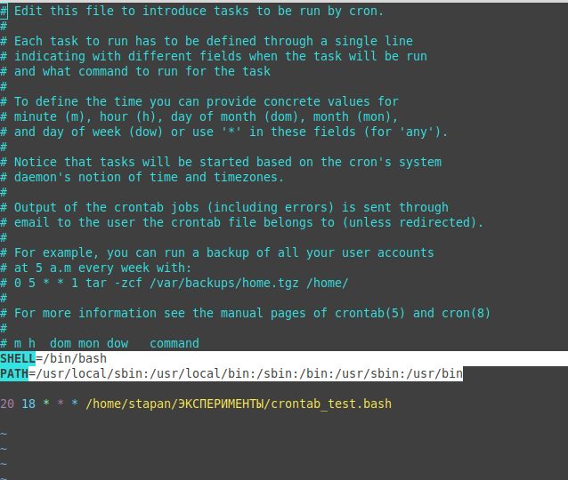
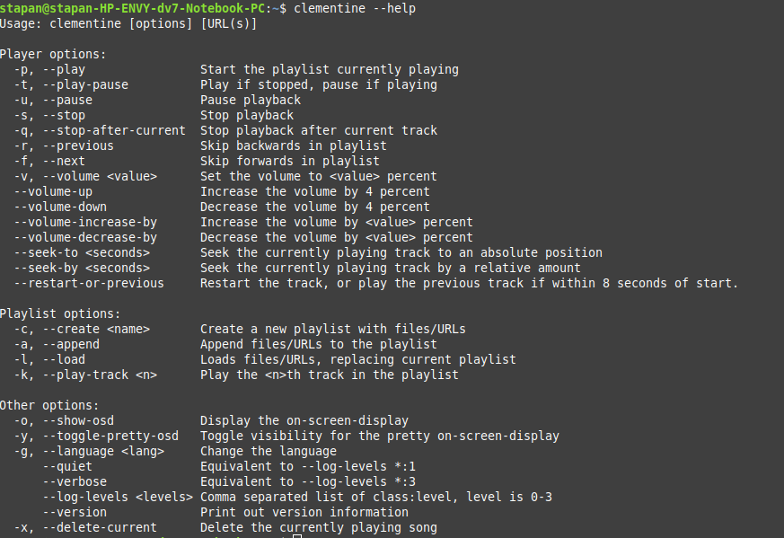

# Настраиваем crone для текущего пользователя

1. Выполняем __crontab -e__
2. Выбирем редактор, который будет использоваться по умолщанию
3. Добавляем строки в файл как на скриншоте

   SHELL=/bin/bash

   PATH=/usr/local/sbin:/usr/local/bin:/sbin:/bin:/usr/sbin:/usr/bin
   

4. Последняя строка файла __должна быть пустой__

# Команды crontab

- crontab -e - отредактировать файл crontab или создать его, если он еще не существует.

- crontab -l - Показать содержимое файла crontab.

- crontab -r - удалить текущий файл crontab.

- crontab -i - Удалить текущий файл crontab с запросом перед удалением.

- crontab -u - Изменить другой файл crontab. Требуются права системного администратора.

- Примеры: 
  - https://wiki.merionet.ru/servernye-resheniya/39/planirovshhik-cron-zapusk-programm-po-raspisaniyu/

  - https://gitjournal.tech/nastrojka-planirovshhika-zadach-cron-v-centos-linux-kak-zapuskat-zadanija-cron-kazhdye-5-10-ili-15-minut-3-min-dlja-chtenija/

  # Ключи запуска clementine

  - Вызываем в терминали __clementine --help__

  - 

# Пример использования

SHELL=/bin/bash

PATH=/usr/local/sbin:/usr/local/bin:/sbin:/bin:/usr/sbin:/usr/bin

33 18 * * * /home/stapan/git/kn7072/ANKI/CRON/start.bash -p >> ~/LOGS/log.txt 2>&1

37 18 * * * /home/stapan/git/kn7072/ANKI/CRON/start.bash -u >> ~/LOGS/log.txt 2>&1

42 18 * * * /home/stapan/git/kn7072/ANKI/CRON/start.bash -p >> ~/LOGS/log.txt 2>&1

47 18 * * * /home/stapan/git/kn7072/ANKI/CRON/start.bash -u >> ~/LOGS/log.txt 2>&1

~

