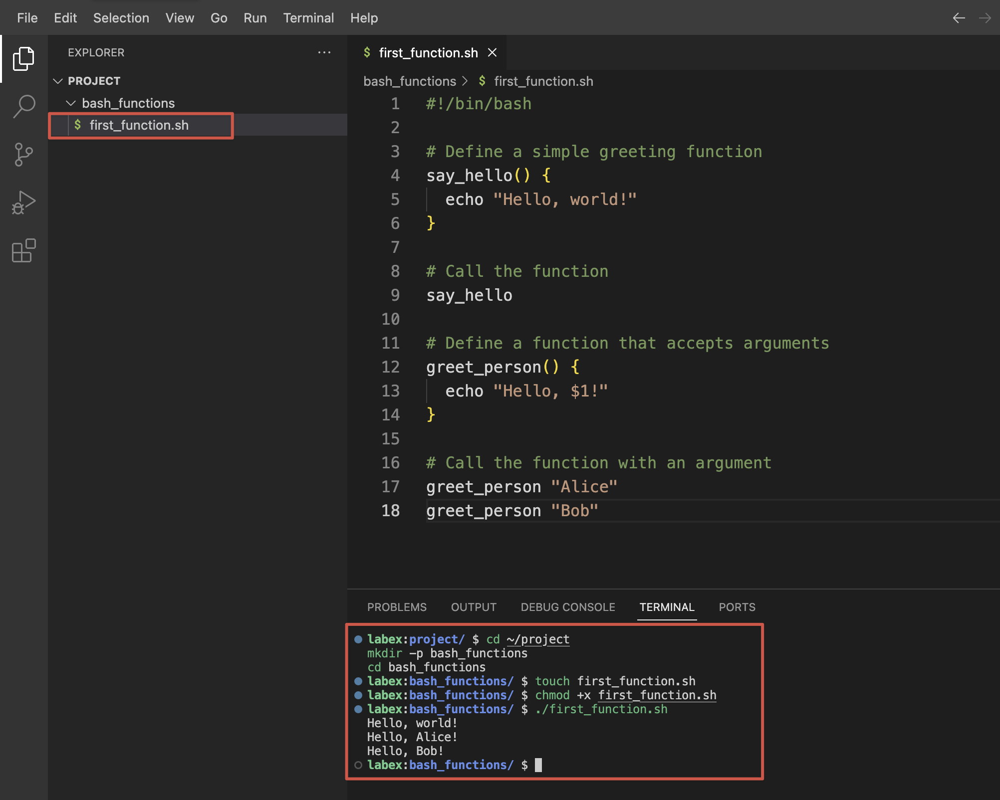

[source](https://labex.io/tutorials/shell-bash-function-return-values-391153)

# Bash Function Return Values <a name="link_1"></a>


Bash Function Return Values

Contents

- [ Bash Function Return Values](#link_1)
  - [ Introduction](#link_2)
  - [ Creating Your First Bash Function](#link_3)
    - [ Creating a Basic Function](#link_4)
    - [ Function Syntax Explained](#link_5)
    - [ Accessing Function Arguments](#link_6)
  - [ Understanding Function Return Codes](#link_7)
    - [ Basic Return Codes](#link_8)
    - [ Capturing Return Codes](#link_9)
    - [ Using Return Codes in Conditionals](#link_10)
  - [ Working with Custom Return Values](#link_11)
    - [ Method 1: Using Echo to Return Values](#link_12)
    - [ Method 2: Using Global Variables](#link_13)
    - [ Method 3: Returning Multiple Values](#link_14)
  - [ Practical Function Usage in a Script](#link_15)
    - [ Creating the File Management Utility](#link_16)
    - [ Breaking Down the Script](#link_17)
  - [ Error Handling and Function Best Practices](#link_18)
    - [ Creating a Script with Error Handling](#link_19)
    - [ Best Practices for Bash Functions](#link_20)
    - [ Creating a Function Library](#link_21)
  - [ Summary](#link_22)

## Introduction <a name="link_2"></a>

This comprehensive tutorial explores Bash function return values, providing you with essential knowledge and techniques to work effectively with functions in Bash scripting. Whether you are new to shell scripting or looking to enhance your skills, this guide offers a solid understanding of how to define, call, and handle function return values. These skills enable you to write more robust and flexible shell scripts for various automation tasks.

This is a Guided Lab, which provides step-by-step instructions to help you learn and practice. Follow the instructions carefully to complete each step and gain hands-on experience. Historical data shows that this is a beginner level lab with a 85% completion rate. It has received a 100% positive review rate from learners.

## Creating Your First Bash Function <a name="link_3"></a>

Bash functions are reusable blocks of code that help organize your scripts better. Before diving into return values, let us first understand how to create and call a function.

### Creating a Basic Function <a name="link_4"></a>

Let us create our first Bash function. Open a terminal window and type:

```bash
cd ~/project
mkdir -p bash_functions
cd bash_functions
```



Now let us create a simple function in a new script. Create a file named `first_function.sh` using nano:

```bash
touch first_function.sh
```

Add the following content to the file:

```bash
#!/bin/bash

## Define a simple greeting function
say_hello() {
  echo "Hello, world!"
}

## Call the function
say_hello

## Define a function that accepts arguments
greet_person() {
  echo "Hello, $1!"
}

## Call the function with an argument
greet_person "Alice"
greet_person "Bob"
```

Make the script executable:

```bash
chmod +x first_function.sh
```

Now run the script:

```bash
./first_function.sh
```

You should see this output:

```
Hello, world!
Hello, Alice!
Hello, Bob!
```

### Function Syntax Explained <a name="link_5"></a>

In Bash, there are two ways to define functions:

1. Using the standard syntax:

```bash
function_name() {
  ## Commands
}
```

2. Using the `function` keyword:

```bash
function function_name {
  ## Commands
}
```

Both styles work the same way, but the first one is more commonly used and POSIX-compliant.

### Accessing Function Arguments <a name="link_6"></a>

Inside a function, you can access arguments passed to the function using positional parameters:

- `$1`, `$2`, `$3`, etc. refer to the first, second, third argument, and so on
- `$0` refers to the function name or script name
- `$#` gives the number of arguments
- `$@` contains all arguments as separate strings
- `$*` contains all arguments as a single string

Let us create a new file to practice with function arguments:

```bash
touch function_args.sh
```

Add the following content:

```bash
#!/bin/bash

show_args() {
  echo "Function name: $0"
  echo "First argument: $1"
  echo "Second argument: $2"
  echo "Number of arguments: $#"
  echo "All arguments: $@"
}

echo "Calling function with three arguments:"
show_args apple banana cherry
```

Save, make executable, and run the script:

```bash
chmod +x function_args.sh
./function_args.sh
```

You should see output similar to:

```
Calling function with three arguments:
Function name: ./function_args.sh
First argument: apple
Second argument: banana
Number of arguments: 3
All arguments: apple banana cherry
```

This basic understanding of function definitions and argument handling provides the foundation for working with function return values in the next steps.

## Understanding Function Return Codes <a name="link_7"></a>

Every command in Bash, including functions, produces a return code (also called an exit status). This numeric value indicates whether the command succeeded or failed. This return code is fundamental to error handling in Bash scripts.

### Basic Return Codes <a name="link_8"></a>

In Bash:

- A return code of `0` indicates success
- Any non-zero value (1-255) indicates an error or abnormal condition

Let us create a script to demonstrate this:

```bash
cd ~/project/bash_functions
touch return_codes.sh
```

Add the following content:

```bash
#!/bin/bash

## Function that always succeeds
succeed() {
  echo "This function succeeds"
  return 0
}

## Function that always fails
fail() {
  echo "This function fails"
  return 1
}

## Call the functions and check their return codes
succeed
echo "Return code of succeed: $?"

fail
echo "Return code of fail: $?"
```

Save, make executable, and run the script:

```bash
chmod +x return_codes.sh
./return_codes.sh
```

You should see:

```
This function succeeds
Return code of succeed: 0
This function fails
Return code of fail: 1
```

### Capturing Return Codes <a name="link_9"></a>

The special variable `$?` contains the return code of the most recently executed command or function. This value is important for conditional execution and error handling.

Let us create another script to practice using return codes for conditional logic:

```bash
touch check_file.sh
```

Add the following content:

```bash
#!/bin/bash

## Function to check if a file exists
file_exists() {
  local filename="$1"

  if [ -f "$filename" ]; then
    echo "File $filename exists"
    return 0
  else
    echo "File $filename does not exist"
    return 1
  fi
}

## Test the function with files that exist and don't exist
file_exists "return_codes.sh"
if [ $? -eq 0 ]; then
  echo "Great! The file was found."
else
  echo "Too bad. The file was not found."
fi

echo ""

file_exists "non_existent_file.txt"
if [ $? -eq 0 ]; then
  echo "Great! The file was found."
else
  echo "Too bad. The file was not found."
fi
```

Save, make executable, and run the script:

```bash
chmod +x check_file.sh
./check_file.sh
```

You should see output similar to:

```
File return_codes.sh exists
Great! The file was found.

File non_existent_file.txt does not exist
Too bad. The file was not found.
```

### Using Return Codes in Conditionals <a name="link_10"></a>

The return code can be used directly in conditional expressions using `&&` (AND) and `||` (OR) operators:

```bash
touch conditional_return.sh
```

Add the following content:

```bash
#!/bin/bash

check_number() {
  local num=$1

  if [ $num -gt 10 ]; then
    return 0 ## Success if number is greater than 10
  else
    return 1 ## Failure if number is not greater than 10
  fi
}

## Using conditional operators with return codes
check_number 15 && echo "Number is greater than 10"
check_number 5 || echo "Number is not greater than 10"

## This line runs only if check_number succeeds
check_number 20 && {
  echo "Number is greater than 10"
  echo "Performing additional operations..."
}

## This line runs only if check_number fails
check_number 3 || {
  echo "Number is not greater than 10"
  echo "Taking alternative actions..."
}
```

Save, make executable, and run the script:

```bash
chmod +x conditional_return.sh
./conditional_return.sh
```

The output should be:

```
Number is greater than 10
Number is not greater than 10
Number is greater than 10
Performing additional operations...
Number is not greater than 10
Taking alternative actions...
```

Understanding how return codes work is essential for writing robust scripts that can handle errors properly and make decisions based on the success or failure of operations.

## Working with Custom Return Values <a name="link_11"></a>

While return codes are useful for indicating success or failure, they are limited to numbers between 0 and 255. For returning actual data from functions, we need to use other techniques.

### Method 1: Using Echo to Return Values <a name="link_12"></a>

The most common way to return actual values from functions is by using `echo` or other output commands, and then capturing that output.

Let us create a script to demonstrate this technique:

```bash
cd ~/project/bash_functions
touch return_values.sh
```

Add the following content:

```bash
#!/bin/bash

## Function that returns a value using echo
get_username() {
  echo "labex"
}

## Function that returns a calculated value
add_numbers() {
  local sum=$(($1 + $2))
  echo $sum
}

## Capture the returned values
username=$(get_username)
echo "The username is: $username"

result=$(add_numbers 5 7)
echo "The sum of 5 and 7 is: $result"

## You can also use the returned value directly
echo "Calculating again: $(add_numbers 10 20)"
```

Save, make executable, and run the script:

```bash
chmod +x return_values.sh
./return_values.sh
```

You should see:

```
The username is: labex
The sum of 5 and 7 is: 12
Calculating again: 30
```

### Method 2: Using Global Variables <a name="link_13"></a>

Another approach is to modify global variables within the function:

```bash
touch global_return.sh
```

Add the following content:

```bash
#!/bin/bash

## Declare global variables
FULL_NAME=""
USER_AGE=0

## Function that sets global variables
set_user_info() {
  FULL_NAME="$1 $2"
  USER_AGE=$3

  ## Return success
  return 0
}

## Call the function
set_user_info "John" "Doe" 30

## Use the global variables that were set by the function
echo "Full name: $FULL_NAME"
echo "Age: $USER_AGE"
```

Save, make executable, and run the script:

```bash
chmod +x global_return.sh
./global_return.sh
```

Output:

```
Full name: John Doe
Age: 30
```

### Method 3: Returning Multiple Values <a name="link_14"></a>

Let us explore how to return multiple values from a function:

```bash
touch multiple_returns.sh
```

Add the following content:

```bash
#!/bin/bash

## Function that returns multiple values separated by a delimiter
get_system_info() {
  local hostname=$(hostname)
  local kernel=$(uname -r)
  local uptime=$(uptime -p)

  ## Return multiple values separated by semicolons
  echo "$hostname;$kernel;$uptime"
}

## Capture the output and split it
system_info=$(get_system_info)

## Split the values using IFS (Internal Field Separator)
IFS=';' read -r host kernel up <<< "$system_info"

## Display the values
echo "Hostname: $host"
echo "Kernel version: $kernel"
echo "Uptime: $up"

## Alternative method using an array
get_user_details() {
  local details=("John Doe" "john@example.com" "Developer")
  printf "%s\n" "${details[@]}"
}

## Capture the output into an array
mapfile -t user_details < <(get_user_details)

echo ""
echo "User information:"
echo "Name: ${user_details[0]}"
echo "Email: ${user_details[1]}"
echo "Role: ${user_details[2]}"
```

Save, make executable, and run the script:

```bash
chmod +x multiple_returns.sh
./multiple_returns.sh
```

The output should show your system information followed by the user details:

```
Hostname: ubuntu
Kernel version: 5.15.0-1033-azure
Uptime: up 2 hours, 15 minutes

User information:
Name: John Doe
Email: john@example.com
Role: Developer
```

The actual hostname, kernel version, and uptime will vary depending on your system.

These methods demonstrate different ways to return values from functions beyond simple return codes. Each approach has its advantages depending on your specific needs.

## Practical Function Usage in a Script <a name="link_15"></a>

Now that we understand how to define functions and handle their return values, let us build a practical script that demonstrates these concepts in action. We will create a file management utility that uses functions with different return methods.

### Creating the File Management Utility <a name="link_16"></a>

Let us create a comprehensive script that performs various file operations:

```bash
cd ~/project/bash_functions
touch file_manager.sh
```

Add the following content:

```bash
#!/bin/bash

## Function to check if a file exists
## Returns 0 if file exists, 1 if it doesn't
file_exists() {
  if [ -f "$1" ]; then
    return 0
  else
    return 1
  fi
}

## Function to get file size in bytes
## Returns the size via echo
get_file_size() {
  if file_exists "$1"; then
    ## Use stat to get file size in bytes
    local size=$(stat -c %s "$1")
    echo "$size"
  else
    echo "0"
  fi
}

## Function to count lines in a file
## Returns line count via echo
count_lines() {
  if file_exists "$1"; then
    local lines=$(wc -l < "$1")
    echo "$lines"
  else
    echo "0"
  fi
}

## Function to get file information
## Returns multiple values using a delimiter
get_file_info() {
  local filename="$1"

  if file_exists "$filename"; then
    local size=$(get_file_size "$filename")
    local lines=$(count_lines "$filename")
    local modified=$(stat -c %y "$filename")
    local permissions=$(stat -c %A "$filename")

    ## Return all info with semicolons as delimiters
    echo "$size;$lines;$modified;$permissions"
  else
    echo "0;0;N/A;N/A"
  fi
}

## Function to create a test file
create_test_file() {
  local filename="$1"
  local lines="$2"

  ## Create or overwrite the file
  > "$filename"

  ## Add the specified number of lines
  for ((i = 1; i <= lines; i++)); do
    echo "This is line $i of the test file." >> "$filename"
  done

  ## Return success if file was created
  if file_exists "$filename"; then
    return 0
  else
    return 1
  fi
}

## Main script execution starts here
echo "File Management Utility"
echo "----------------------"

## Create a test file
TEST_FILE="sample.txt"
echo "Creating test file with 10 lines..."
if create_test_file "$TEST_FILE" 10; then
  echo "File created successfully."
else
  echo "Failed to create file."
  exit 1
fi

## Check if file exists
echo ""
echo "Checking if file exists..."
if file_exists "$TEST_FILE"; then
  echo "File '$TEST_FILE' exists."
else
  echo "File '$TEST_FILE' does not exist."
fi

## Get file size
echo ""
echo "Getting file size..."
size=$(get_file_size "$TEST_FILE")
echo "File size: $size bytes"

## Count lines
echo ""
echo "Counting lines in file..."
lines=$(count_lines "$TEST_FILE")
echo "Line count: $lines"

## Get all file information
echo ""
echo "Getting complete file information..."
file_info=$(get_file_info "$TEST_FILE")

## Split the returned values
IFS=';' read -r size lines modified permissions <<< "$file_info"

echo "File: $TEST_FILE"
echo "Size: $size bytes"
echo "Lines: $lines"
echo "Last modified: $modified"
echo "Permissions: $permissions"

echo ""
echo "File content preview:"
head -n 3 "$TEST_FILE"
echo "..."
```

Save, make executable, and run the script:

```bash
chmod +x file_manager.sh
./file_manager.sh
```

You should see output similar to:

```
File Management Utility
----------------------
Creating test file with 10 lines...
File created successfully.

Checking if file exists...
File 'sample.txt' exists.

Getting file size...
File size: 300 bytes

Counting lines in file...
Line count: 10

Getting complete file information...
File: sample.txt
Size: 300 bytes
Lines: 10
Last modified: 2023-11-04 12:34:56.789012345 +0000
Permissions: -rwxrwxr-x

File content preview:
This is line 1 of the test file.
This is line 2 of the test file.
This is line 3 of the test file.
...
```

The exact values for file size, modification time, and permissions will vary.

### Breaking Down the Script <a name="link_17"></a>

Our file management utility demonstrates several key concepts:

1. **Return codes** - The `file_exists()` and `create_test_file()` functions return 0 for success and 1 for failure
2. **Returning values with echo** - The `get_file_size()` and `count_lines()` functions return numeric values via echo
3. **Returning multiple values** - The `get_file_info()` function returns multiple values using a delimiter
4. **Function composition** - Some functions call other functions, demonstrating how to build complex functionality
5. **Conditional execution** - The script uses if statements with return codes to control program flow

This practical example shows how to combine various function techniques to create a useful utility. The script demonstrates proper error handling, function composition, and different methods for returning values.

## Error Handling and Function Best Practices <a name="link_18"></a>

For our final section, let us explore error handling techniques and best practices for Bash functions. Proper error handling is crucial for creating robust, maintainable scripts.

### Creating a Script with Error Handling <a name="link_19"></a>

Let us create a new script that demonstrates robust error handling:

```bash
cd ~/project/bash_functions
touch error_handling.sh
```

Add the following content:

```bash
#!/bin/bash

## Enable error handling
set -e ## Exit immediately if a command exits with non-zero status

## Define a function to log messages
log_message() {
  local level="$1"
  local message="$2"
  echo "[$(date '+%Y-%m-%d %H:%M:%S')] [$level] $message"
}

## Function to validate a number is positive
validate_positive() {
  local num="$1"
  local name="$2"

  ## Check if the argument is a number
  if ! [[ "$num" =~ ^[0-9]+$ ]]; then
    log_message "ERROR" "$name must be a number"
    return 1
  fi

  ## Check if the number is positive
  if [ "$num" -le 0 ]; then
    log_message "ERROR" "$name must be positive"
    return 2
  fi

  return 0
}

## Function that divides two numbers
divide() {
  local numerator="$1"
  local denominator="$2"

  ## Validate inputs
  validate_positive "$numerator" "Numerator" || return $?
  validate_positive "$denominator" "Denominator" || return $?

  ## Check for division by zero
  if [ "$denominator" -eq 0 ]; then
    log_message "ERROR" "Division by zero is not allowed"
    return 3
  fi

  ## Perform division
  local result=$(echo "scale=2; $numerator / $denominator" | bc)
  echo "$result"
  return 0
}

## Function to safely get user input
get_number() {
  local prompt="$1"
  local input

  while true; do
    read -p "$prompt: " input

    if validate_positive "$input" "Input"; then
      echo "$input"
      return 0
    else
      log_message "WARN" "Invalid input. Please try again."
    fi
  done
}

## Disable automatic exit on error for the main script
set +e

## Main script logic
log_message "INFO" "Starting division calculator"

## Test with valid values
result=$(divide 10 2)
exit_code=$?

if [ $exit_code -eq 0 ]; then
  log_message "INFO" "10 / 2 = $result"
else
  log_message "ERROR" "Division failed with code $exit_code"
fi

## Test with invalid values
echo ""
log_message "INFO" "Testing with invalid values"
divide 0 5
log_message "INFO" "Exit code: $?"

divide 10 0
log_message "INFO" "Exit code: $?"

divide abc 5
log_message "INFO" "Exit code: $?"

## Interactive mode
echo ""
log_message "INFO" "Interactive mode"
echo "Let's perform a division. Enter positive numbers."

## Get user input safely
num1=$(get_number "Enter first number")
num2=$(get_number "Enter second number")

## Perform division
result=$(divide "$num1" "$num2")
exit_code=$?

if [ $exit_code -eq 0 ]; then
  log_message "INFO" "$num1 / $num2 = $result"
else
  log_message "ERROR" "Division failed with code $exit_code"
fi

log_message "INFO" "Calculator finished"
```

Save, make executable, and run the script:

```bash
chmod +x error_handling.sh
./error_handling.sh
```

You will see output similar to the following and be prompted to enter numbers:

```
[2023-11-04 13:45:23] [INFO] Starting division calculator
[2023-11-04 13:45:23] [INFO] 10 / 2 = 5.00

[2023-11-04 13:45:23] [INFO] Testing with invalid values
[2023-11-04 13:45:23] [ERROR] Numerator must be positive
[2023-11-04 13:45:23] [INFO] Exit code: 2
[2023-11-04 13:45:23] [ERROR] Division by zero is not allowed
[2023-11-04 13:45:23] [INFO] Exit code: 3
[2023-11-04 13:45:23] [ERROR] Numerator must be a number
[2023-11-04 13:45:23] [INFO] Exit code: 1

[2023-11-04 13:45:23] [INFO] Interactive mode
Let's perform a division. Enter positive numbers.
Enter first number:
```

Enter a number, for example `20`. Then you will be prompted for the second number:

```
Enter second number:
```

Enter another number, for example `4`, and you should see:

```
[2023-11-04 13:45:30] [INFO] 20 / 4 = 5.00
[2023-11-04 13:45:30] [INFO] Calculator finished
```

### Best Practices for Bash Functions <a name="link_20"></a>

Based on our examples, here are some best practices for working with Bash functions:

1. **Add Descriptive Comments** - Document what each function does, its parameters, and return values
2. **Use Meaningful Function Names** - Choose names that clearly indicate the function's purpose
3. **Validate Input Parameters** - Check inputs to prevent errors
4. **Use Local Variables** - Prevent variable name collisions with the `local` keyword
5. **Return Appropriate Exit Codes** - Use conventional return codes (0 for success, non-zero for errors)
6. **Implement Proper Error Handling** - Log errors and handle them gracefully
7. **Keep Functions Focused** - Each function should do one thing well
8. **Use Function Composition** - Build complex functionality by combining simpler functions
9. **Document Return Values** - Clearly document how values are returned (via echo, return code, etc.)
10. **Test Edge Cases** - Ensure functions handle unusual inputs correctly

By following these practices, you can create more reliable, maintainable, and reusable Bash functions.

### Creating a Function Library <a name="link_21"></a>

For the final exercise, let us create a reusable function library:

```bash
touch math_functions.lib
```

Add the following content:

```bash
#!/bin/bash
## math_functions.lib - A library of mathematical functions
## Add two numbers
add() {
  echo $(($1 + $2))
}

## Subtract second number from first
subtract() {
  echo $(($1 - $2))
}

## Multiply two numbers
multiply() {
  echo $(($1 * $2))
}

## Divide first number by second (with decimal precision)
divide() {
  if [ "$2" -eq 0 ]; then
    return 1
  fi
  echo "scale=2; $1 / $2" | bc
  return 0
}

## Calculate power: first number raised to second number
power() {
  echo $(($1 ** $2))
}

## Check if a number is even
is_even() {
  if (($1 % 2 == 0)); then
    return 0
  else
    return 1
  fi
}

## Check if a number is odd
is_odd() {
  if is_even "$1"; then
    return 1
  else
    return 0
  fi
}
```

Now create a script that uses this library:

```bash
touch use_library.sh
```

Add the following content:

```bash
#!/bin/bash

## Source the math functions library
source math_functions.lib

## Display a header
echo "Math Functions Demo"
echo "------------------"

## Test the functions
echo "Addition: 5 + 3 = $(add 5 3)"
echo "Subtraction: 10 - 4 = $(subtract 10 4)"
echo "Multiplication: 6 * 7 = $(multiply 6 7)"

## Test division with error handling
div_result=$(divide 20 5)
if [ $? -eq 0 ]; then
  echo "Division: 20 / 5 = $div_result"
else
  echo "Division error: Cannot divide by zero"
fi

## Test division by zero
div_result=$(divide 20 0)
if [ $? -eq 0 ]; then
  echo "Division: 20 / 0 = $div_result"
else
  echo "Division error: Cannot divide by zero"
fi

echo "Power: 2 ^ 8 = $(power 2 8)"

## Test the even/odd functions
echo ""
echo "Number properties:"
for num in 1 2 3 4 5; do
  echo -n "Number $num is "

  if is_even $num; then
    echo "even"
  else
    echo "odd"
  fi
done
```

Save, make executable, and run the script:

```bash
chmod +x use_library.sh
./use_library.sh
```

You should see:

```
Math Functions Demo
------------------
Addition: 5 + 3 = 8
Subtraction: 10 - 4 = 6
Multiplication: 6 * 7 = 42
Division: 20 / 5 = 4.00
Division error: Cannot divide by zero
Power: 2 ^ 8 = 256

Number properties:
Number 1 is odd
Number 2 is even
Number 3 is odd
Number 4 is even
Number 5 is odd
```

This library approach demonstrates how you can create reusable function collections that can be imported into multiple scripts, promoting code reuse and maintainability.

## Summary <a name="link_22"></a>

In this tutorial, you have learned the essential concepts of Bash function return values. Starting with basic function creation and argument handling, you progressed to understanding return codes and how they indicate success or failure. You explored multiple methods for returning actual data from functions, including using echo, global variables, and delimiters for multiple values.

Through practical examples, you implemented a file management utility that demonstrated proper function composition and error handling. Finally, you learned best practices for creating robust, reusable functions and how to organize them into libraries.

The skills acquired in this tutorial provide a solid foundation for writing more sophisticated Bash scripts with proper error handling, modularity, and reusability. These techniques enable you to create maintainable shell scripts for various automation tasks, improving your overall productivity as a system administrator or developer.
