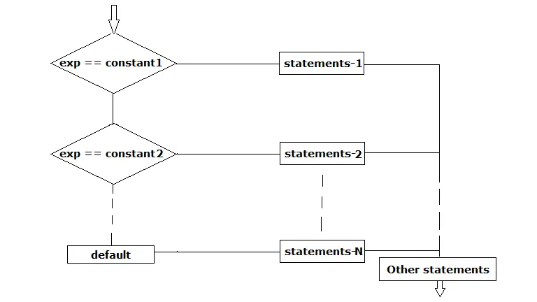
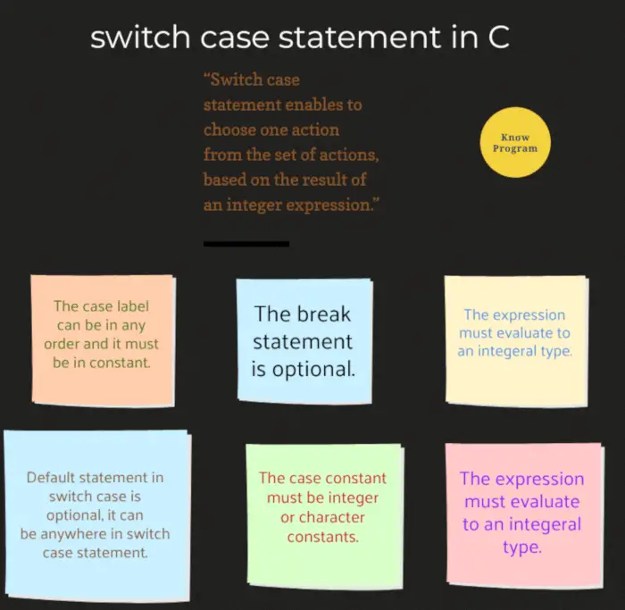

The switch case statement in C programming is a multi-way decision that tests whether an expression matches one of a number of constant integer values, and branches accordingly. Two keywords are used in the program:- switch and case.

## Syntax of switch case in C

```
switch(expression)
{
  case constant1:
      Statements-1;
  case constant2:
      Statements-2;
  case constant3:
      Statements-3;
  case constant3:
      Statements-4;
      .
      .
      .
  default:
      Statements-3;
}
```

The value of the **expression** is evaluated first and the value of the expression is **compared** with the **case constants**. When a match is found, the statement sequence associated with that case is executed until the break statement or the end of the switch statement is reached. The default statement is executed if no matches are found. When the **break** is encountered in a switch case, then program execution jumps to the end of the switch case.

The switch statement is often used to process keyword commands, such as a menu section.

## Flowchart of switch case in C






## Sample program on switch case in C

```
 #include<stdio.h>
 int main()
 {
   int a = 3;
   switch(a)
   {
     case 1:
         printf("Hello");
         break;
     case 2:
         printf("Hi");
         break;
     case 3:
         printf("Welcome to C programming");
         break;
     default:
         printf("Welcome to programming world");
   }
   return 0;
 }
```

Output:-

Welcome to C programming

In this program, the expression is variable `**a**` and its value is 3. So, compiler search case with 3, when the match is found then the statements of the case executed. If the match is not found then the default statement will be executed.

**Program**:- Write a C program for **arithmetic operations** additions, subtractions, multiplication, and division of two numbers. The user should have the option to choose the operation.

```
 #include<stdio.h>
 int main()
 {
   int a, b;
   char ch;

   printf("Enter two number: ");
   scanf("%d %d",&a, &b);

   printf("Enter one operator (+,-,*,/): ");
   // give a space before %c in the below scanf
   scanf(" %c",&ch);

   switch(ch)
   {
     case '+':
       printf("The sum of %d and %d is = %d", a, b, a+b);
       break;
     case '-':
       printf("The subtraction of %d and %d is = %d", a, b, a-b);
       break;
     case '*':
       printf("The multiplication of %d and %d is = %d", a, b, a*b);
       break;
     case '/':
       printf("The division of %d and %d is = %d", a, b, a/b);
       break;
     default:
       printf("Invalid operator.");
   }

   return 0;
 }
```

Output for the different test-cases:-

Enter two number: 10 20  
Enter one operator (+,-,*,/):+  
The sum of 10 and 20 is = 30

Enter two number: 20 5  
Enter one operator (+,-,*,/): –  
The subtraction of 20 and 5 is = 15

Enter two number: 2 5  
Enter one operator (+,-,*,/): *  
The multiplication of 2 and 5 is = 10

Enter two number: 100 5  
Enter one operator (+,-,*,/): /  
The division of 100 and 5 is = 20

Read more:- [Use scanf correctly with char](https://www.knowprogram.com/c-programming/input-using-scanf-c/#Case2-_Use_scanf_correctly_with_char)

## Special points on switch case in C

### The default statement is optional

In the switch case in C, the default statement is optional. If we don’t give any default statement and also the match is not found then any case statements will not be executed. But it is good programming practice to use the default statement in the switch case.

Find the output of the below two programs program-1 and program-2.

```
// program-1
#include<stdio.h>
int main()
{
  int a = 3;
  switch(a)
  {
    case 1: printf("x\n"); break;
    case 2: printf("y\n"); break;
    default: printf("z\n");
  }
  printf("Execution completed.");
  return 0;
}
```

```
 // program-2
#include<stdio.h>
int main()
{
  int a = 3;
  switch(a)
  {
    case 1: printf("x\n"); break;
    case 2: printf("y\n"); break;
  }
  printf("Execution completed.");
  return 0;
}
```

In program1 there is a default statement, here the expression doesn’t match with any case so finally default statement is executed.

In program2 there is no default statement is there. Since there is no match for expression with the case so no statement is executed from the switch case block.

The output of program-1:-

z  
Execution completed.

The output of program-2:-

Execution completed.

### The order of case statements

The order of case statements doesn’t create any difference in the output. Similarly, the default statement can be anywhere in the program.

```
 #include<stdio.h>
 int main()
 {
   int a = 1;
   switch(a)
   {
     case 2: printf("a"); break;
     case 1: printf("b"); break;
     case 3: printf("c"); break;
     default: printf("d");
   }
   return 0;
 }
```

Output:-

b

We can write the case statements in any order. Generally, we write case constants in increasing order as 1, then 2, 3, 4 and so on, by this way it is easier for other programmers to understand the code.

```
 #include<stdio.h>
 int main()
 {
   int a = 5;
   switch(a)
   {
     default: printf("C programming"); break;
     case 1: printf("C++ programming"); break;
     case 2: printf("Java programming");
   }
   return 0;
 }
```

Output:-

C programming

Generally, in switch cases, we write default statements at last, but we can write it anywhere in the switch case.

### Break is optional

In the switch case, we always use break statement but it optional. But if we are not using a break statement then we may get unexpected output.

```
 #include<stdio.h>
 int main()
 {
   int a = 2;
   switch(a)
   {
     case 1: printf("a");
     case 2: printf("b");
     case 3: printf("c");
     default: printf("d");
   }
   return 0;
 }
```

Output:-

bcd

Why this output came? In switch case, the expression is matched with constant 2 so, it is executed as displayed ‘b’ to the screen. Now, there is no break statement so, the next case statement is also executed and displayed ‘c’ to the screen. Similarly, the default statement also executed and displayed ‘`d`’ to the screen. Finally, we got `**bcd**` as output.

To overcome the above problem we should use the break statement. Generally, we use break statement in every case except for the last one. The last one may be case or default. Break stop the execution of the switch case and control came out of the switch case, in the last statement no remaining statements are there for execution so it doesn’t create any difference.

## The expression and constant in switch case

The expression must evaluate to a character or integer value. The floating-point expressions are not allowed.

The constants following the case keywords should be an integer or character type. They can be either constants or constants expressions. The constants must be different from one another.

### Floating-point numbers as expression or constant

Switch case doesn’t work on floating-point numbers. Floating-point numbers are not allowed either as an expression or constant in the switch case statement in C. If we use them then we will get a compile-time error.

Find the output of the below programs.

```
 #include<stdio.h>
 int main()
 {
   float a = 2;
   switch(a)
   {
     case 1: printf("a"); break;
     case 2: printf("b"); break;
     default: printf("c");
   }
   return 0;
 }
```

In this program we are using a floating-point number as an expression so, we got the error: “switch quantity not an integer”. Floating-point as an expression is not allowed in the switch case.

```
 #include<stdio.h>
 int main()
 {
   int a = 2;
   switch(a)
   {
     case 1.0: printf("a"); break;
     case 2.0: printf("b"); break;
     default: printf("c");
   }
   return 0;
 }
```

In this program constants are floating-point so we got the error: case label does not reduce to an integer constant.

### Constant expressions as constant or expression in switch case

Constant expressions are allowed as expression. Similarly, constant expressions are also allowed as constant for the switch case but The constants must be different from one/another. If duplicate constants are found in the program then compiler gives the compile-time error.

```
 #include<stdio.h>
 int main()
 {
   switch(3)
   {
     case 1: printf("x"); break;
     case 2: printf("y"); break;
     default: printf("z");
   }
   return 0;
 }
```

Output:-

z

The constant 3 is directly used as an expression in the above program. In switch case in C, it is allowed. Hence, the program executed successfully.

```
 #include<stdio.h>
 int main()
 {
   switch(3)
   {
     case 1: printf("x"); break;
     case 1+0: printf("y"); break;
     default: printf("z");
   }
   return 0;
 }
```

Two cases are similar in this program, so we got an error: duplicate case value.

```
 #include<stdio.h>
 int main()
 {
   int i=1, j=2;
   switch(3)
   {
     case i: printf("x"); break;
     case j: printf("y"); break;
     case i+j: printf("z");
   }
   return 0;
 }
```

We used variables as constant in the above program so we got an error: case label does not reduce to an integer constant.

```
 #include<stdio.h>
 int main()
 {
   switch(9)
   {
     case 3+3: printf("a"); break;
     case 3-3: printf("b"); break;
     case 3*3: printf("c"); break;
     case 3/3: printf("d");
   }
   return 0;
 }
```

Output:-

c

What will be the output of the below program?

```
 #include<stdio.h>
 int main()
 {
   int y = 1;
   switch(y)
   {
     y = y+5;
     case 1: printf("a"); break;
     case 5: printf("b"); break;
     default: printf("c");
   }
   return 0;
 }
```

Output:-

a

In this program, the statement “`y = y+5;`” will never be executed.

### Character as constant or expression

Find the output of the below program.

```
 #include<stdio.h>
 int main()
 {
   char ch = 'a';
   switch(ch)
   {
     case 'a': printf("Hi"); break;
     case 'b': printf("Hello"); break;
     case 'c': printf("How are you?"); break;
     default: printf("Bye");
   }
   return 0;
 }
```

Output:-

Hi

## Case ranges in a switch case statement in C

Generally, we use only one associated value with a case label in the switch statement. But the case can ranges. The syntax of the case range is,

```
case lower_value ... upper_value :
```

Values of lower and upper must be valid integer constant expressions.

### Program: C program to check character is Alphabet, Digit, White Space or Other

```
 #include<stdio.h>
 int main()
 {
   char c;

   printf("Enter any Character: ");
   scanf("%c",&c);
   
   switch(c)
   {
     case 'a'…'z':
     case 'A'…'Z':
           printf("Alphabet\n");
           break;
     case '0'…'9':
           printf("Digits\n");
           break;
     case ' ':
     case '\n':
     case '\t':
     case '\v':
     case '\r':
          printf("White Space\n");
          break;
     default:
          printf("Other\n");
          break;
   }
   
   return 0;
 }
```

Output:-

Enter any Character: V  
Alphabet

Enter any Character: 3  
Digits

Enter any Character:  
White Space

Enter any Character:?  
Other

If the value of the lower is greater than the upper than the compiler will give an error.

```
case '9'…'0':  //empty range specified
```

When the value of lower and upper is equal than the range specifies only the one value.

```
case '0'…'0':   //it is equal to case '0':
```

If the value of a case label falls within a case range that has already used in the switch statement, the compiler will give an error.

```
case '0'…'9':
case '5':  //error
```

When the case ranges overlap, then compiler rejects the code with an error message.

```
case 'a'…'z':
case 'a'…'Z': //error
```

Note that if an endpoint of a case range is a numeric literal, leave white-space around the ellipsis (…) to avoid one of the dots being treated as a decimal point.

```
case 0…4:   // error
case 5 … 9: // ok
```

## Program: read month number and display days in that month

Program:- Write a C program that will read the month number of the year and displays the total number of the days in that month.

When the month number is 2 i.e. February then it may have 29 or 28 days. For this we need to check year is a leap year or not, if the year is a leap year then a month has 29 days else month has 28 days.

The months having month numbers 1, 3, 5, 7, 8, 10, and 12 have always 31 days. Similarly, the remaining months have 30 days in the month.

```
 #include<stdio.h>
 int main()
 {
   int month;

   printf("Enter month number of the year: ");
   scanf("%d", &month);

   switch (month) {
     case 1:
     case 3:
     case 5:
     case 7:
     case 8:
     case 10:
     case 12:
       printf("Month has 31 days");
       break;
     case 2:
       {
         int year;
         printf("Enter year number: ");
         scanf("%d",&year);
         if( year%4==0 && (year %100!=0 || year % 400 == 0))
         printf("Month has 29 days.");
         else
         printf("Month has 28 days");
       }
       break;
     case 4:
     case 6:
     case 9:
     case 11:
       printf("Month has 30 days");
       break;
     default:
       printf("Invalid month number");
   }
   return 0;
 }
```

Output:-

Enter month number of the year: 3  
The month has 31 days

Enter month number of the year: 11  
The month has 30 days

Enter month number of the year: 2  
Enter year number: 2022  
The month has 28 days

## Difference between nested if else and switch case in C

The [if statement](https://www.knowprogram.com/c-programming/if-else-statement-in-c/) is the single-selection structure, the [if-else](https://www.knowprogram.com/c-programming/if-else-statement-in-c/) is the double selection structure and the [nested if-else](https://www.knowprogram.com/c-programming/if-else-statement-in-c/) and switch-case are the multi-selection control structures.

- The switch statement is often faster than nested if-else statements (but not always).
- The syntax of the switch case statement is cleaner and easy to understand.
- The switch can only test for equality, but if statement can evaluate any type of relational or logical expression.
- It is easier to add new cases to a switch statement than to a nested if-else structure.
- The switch case evaluates only character and integer value but if else evaluates integer, character, floating-point, boolean, and pointer values.
- In a nested if-else statement, only one statement will be executed but after matching a case, the switch case executes until the break does not appear or the switch statement is reached.

## Summary

- A switch-case statement enables one to choose one action from the set of actions, based on the result of an integer expression.
- The case label can be in any order and it must be constant.
- The two case labels can’t have the same value.
- The default statement in the switch case is optional and we can put it anywhere in the switch case statement.
- The case constant must be integer or character constants. The expression must evaluate to an integral type.
- The break statement is optional. If the break statement is omitted in any case of a switch statement, the program flow is followed through the next case label.
- The C89 specifies that a switch can have at least 257 case statements. The C99 requires that at least 1023 case statements be supported. The case can’t exist by itself, outside a switch.

If you enjoyed this post, share it with your friends. Do you want to share more information about the topic discussed above or do you find anything incorrect? Let us know in the comments. Thank you!
