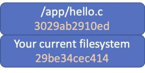
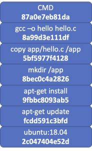
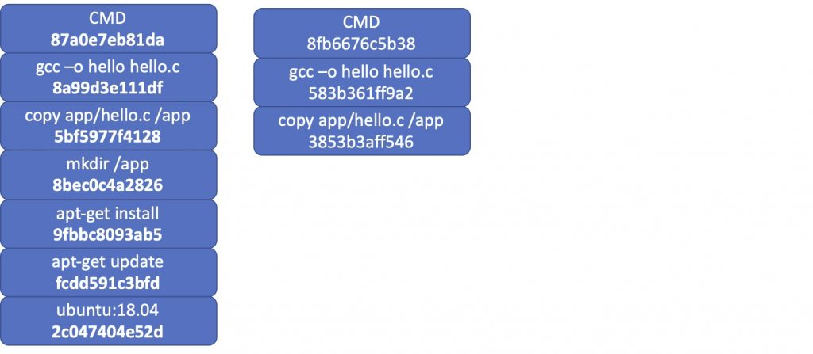
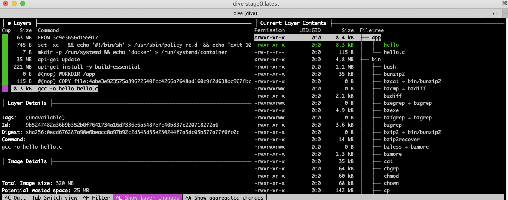
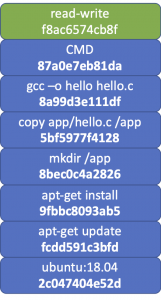

[source](https://blogs.cisco.com/developer/container-image-layers-1)

- [ Understanding Container Images, Part 1: Image Layers](#link_1)
- [ Hello world app – Take 1](#link_2)
- [ Layered filesystems](#link_3)
- [ Docker build process](#link_4)
  - [ Exploring images](#link_5)
  - [ Caveats building Dockerfiles](#link_6)
    - [ Dockerfile idempotency](#link_7)
    - [ Reducing number of layers](#link_8)
    - [ Making optimal use of cache](#link_9)
  - [ Read only layers](#link_10)

# Understanding Container Images, Part 1: Image Layers <a name="link_1"></a>

[Francisco Sedano Crippa](https://blogs.cisco.com/author/franciscosedanocrippa "Posts by Francisco Sedano Crippa")

You are probably using containers for your development work (and if you aren’t – you should really consider it). They behave so close to having a customized virtual machine, with almost instant-on startup that it’s easy to forget they’re not really virtual machines… nor should be treated as one!.

I prefer to think on container images not as a virtual machine, but as a (quite advanced) packaging system with good dependency tracking. It helps to think you’re just packaging a few files… just what’s needed to make your application run.

Let’s have a look at some examples and try to look at our build stages with a different perspective.

# Hello world app – Take 1 <a name="link_2"></a>

I want to build my C ‘Hello world’ application. Since on desktop I use ubuntu, I feel more comfortable with that distribution, so my first impulse is just try to mimic my regular development environment.

This is my first attempt:

I will create an ‘app’ directory, add my source code there, and create my Dockerfile.

```
|-- Dockerfile
`-- app
    `-- hello.c
```

My hello world C program:

```c
#include <stdio.h>

int main(void) {
    printf("Hello from the container!\n");
    return (0);
}

```

In my Dockerfile, I’ll do what I would do on my desktop system:

- Start with a base image
- Add the packages I (roughly) need
- Add my source code
- Build
- Run!

Dockerfile

```
FROM ubuntu:18.04
RUN apt-get update
RUN apt-get install -y build-essential
WORKDIR /app
COPY app/hello.c /app/
RUN gcc -o hello hello.c
ENTRYPOINT [ "/app/hello" ]
```

Let’s build it:

```
$ docker build -t stage0 .

Step 1/7 : FROM ubuntu:18.04
18.04: Pulling from library/ubuntu
f22ccc0b8772: Pull complete
3cf8fb62ba5f: Pull complete
[... a lot of output ...]
```

```
$ docker run stage0                                                                                                       
Hello from the container!
```

Great! We have our application working! But, let’s see what happened behind the scenes.

You can see for each line in our Dockerfile, docker prints a ‘Step’ followed by a hash.

What is that hash? Read on to discover it…

# Layered filesystems <a name="link_3"></a>

One of the core aspects of the container images is they’re based on a layered filesystem.

Let’s imagine we take a snapshot of your hard drive as it is now. The hash of the filesystem contents is also noted: 29be…. on this example.


What happens when you add some files to it? (let’s say your hello.c file). In the case of the filesystem of your computer, it’s just added there. It’s impossible to differentiate it from any other file on your hard disk.

On a layered filesystem, however, this is what you get:



You actually have two elements here:

1. The disk as it was before.
2. The change you did

It might not look like a big difference, but it really is!

Let’s see how container images use this concept to do some magic.

# Docker build process <a name="link_4"></a>

Looking at our Docker build process, this is what we saw:

```
$ docker build -t stage0 .
```

```
Sending build context to Docker daemon  77.31kB
Step 1/7 : FROM ubuntu:18.04
18.04: Pulling from library/ubuntu
f22ccc0b8772: Pull complete
3cf8fb62ba5f: Pull complete
e80c964ece6a: Pull complete
Digest: sha256:fd25e706f3dea2a5ff705dbc3353cf37f08307798f3e360a13e9385840f73fb3
Status: Downloaded newer image for ubuntu:18.04
 **---> 2c047404e52d**

Step 2/7 : RUN apt-get update
 ---> Running in a8d65ab87a93
Get:1 http://archive.ubuntu.com/ubuntu bionic InRelease [242 kB]
Get:2 http://security.ubuntu.com/ubuntu bionic-security InRelease [88.7 kB]
...
Fetched 21.8 MB in 20s (1078 kB/s)
Reading package lists...
Removing intermediate container a8d65ab87a93
 **---> fcdd591c3bfd**

Step 3/7 : RUN apt-get install -y build-essential
 ---> Running in c15a1c650b0a
Reading package lists...
Building dependency tree...
...
Processing triggers for libc-bin (2.27-3ubuntu1.3) ...
Removing intermediate container c15a1c650b0a
 **---> 9fbbc8093ab5**

Step 4/7 : WORKDIR /app
 ---> Running in fed79856ded7
Removing intermediate container fed79856ded7
 **---> 8bec0c4a2826**

Step 5/7 : COPY app/hello.c /app/
 **---> 5bf5977f4128**

Step 6/7 : RUN gcc -o hello hello.c
 ---> Running in 48c0f7dc9fcb
Removing intermediate container 48c0f7dc9fcb
 **---> 8a99d3e111df**

Step 7/7 : CMD [ "/app/hello" ]
 ---> Running in 2cc8c55e417b
Removing intermediate container 2cc8c55e417b
 **---> 87a0e7eb81da**

Successfully built 87a0e7eb81da
Successfully tagged stage0:latest
$

```

Each time docker executes a new line in the dockerfile, it creates a new layer with the result of executing that line. It then adds that layer to the docker image, but it also keeps track of all the individual layers as cache. This process took around 2 minutes on my computer.

Looking at the images on docker now I see the image I based from (ubuntu:18.04) and my final image: ‘stage0’ – with the hash that I saw on the build log: **87a0e7eb81da**

```
$ docker image ls
REPOSITORY   TAG       IMAGE ID       CREATED         SIZE
stage0       latest    87a0e7eb81da   4 minutes ago   319MB
ubuntu       18.04     2c047404e52d   7 weeks ago     63.3MB
$

```

The stage0 image is made upon the following layers



_docker image_ will by default hide the intermediate images, but they’re indeed stored. If you run docker image ls -a, you’ll see all of them:

```
$ docker image ls -a
REPOSITORY   TAG       IMAGE ID       CREATED         SIZE
stage0       latest    87a0e7eb81da   4 minutes ago   319MB
<none>       <none>    5bf5977f4128   4 minutes ago   319MB
<none>       <none>    8bec0c4a2826   4 minutes ago   319MB
<none>       <none>    8a99d3e111df   4 minutes ago   319MB
<none>       <none>    9fbbc8093ab5   4 minutes ago   319MB
<none>       <none>    fcdd591c3bfd   5 minutes ago   98.2MB
ubuntu       18.04     2c047404e52d   7 weeks ago     63.3MB
```

You can also see the size of each image: Base ubuntu is 63 Mb, that went to 98 when it executed

```
RUN apt-get update

and again to 319 Mb when it ran

RUN apt-get install -y build-essential
```

What will happen if you change the code you want to compile (your hello.c program)?

If you were deploying a virtual machine, it would mean you have to get your entire build environment again – remember you’re starting from a lean ubuntu machine.

Using containers, if you change your C program and build again, this is what you get:

Hello.c

```c
#include <stdio.h>

int main(void) {
    printf("Hello from the container! - Second version\n");
    return (0);
}

```

```
$ docker build -t stage0 .
Sending build context to Docker daemon  77.31kB
Step 1/7 : FROM ubuntu:18.04
 ---> 2c047404e52d

Step 2/7 : RUN apt-get update
 ---> Using cache
 ---> fcdd591c3bfd

Step 3/7 : RUN apt-get install -y build-essential
 ---> Using cache
 ---> 9fbbc8093ab5

Step 4/7 : WORKDIR /app
 ---> Using cache
 ---> 8bec0c4a2826

Step 5/7 : COPY app/hello.c /app/
 ---> 3853b3aff546

Step 6/7 : RUN gcc -o hello hello.c
 ---> Running in 580c3f378281
Removing intermediate container 580c3f378281
 ---> 583b361ff9a2

Step 7/7 : CMD [ "/app/hello" ]
 ---> Running in a2d18fe0c6b9
Removing intermediate container a2d18fe0c6b9
 ---> 8fb6676c5b38

Successfully built 8fb6676c5b38
Successfully tagged stage0:latest
```

You will notice two things:

1. This was MUCH faster. First run took about two minutes. This second run took 10 seconds
2. It didn’t print the result of all the apt-get lines

This is because docker noticed until line 4, the result of each of the lines would be exactly the same as it has cached. How does it know it? It’s tracking the layer it starts from, and the program it was run. Then it knows the result must be the same as before, so it avoids executing it and just reuses the layer that was built before.



## Exploring images <a name="link_5"></a>

There are a few tools that allows you to explore container images. I strongly recommend spending some time exploring your images to fully understand the magic that is going on!

An excellent tool is [Dive](https://github.com/wagoodman/dive)

This tool allows you to explore how a particular image was built, what changed on the filesystem on each of the layers, the command that was used to create a layer, etc.

Let’s explore our image:

```
$ dive stage0:latest
Image Source: docker://stage0:latest
Fetching image... (this can take a while for large images)
```



## Caveats building Dockerfiles <a name="link_6"></a>

There are a few important aspects here, that you will want to take into account when creating Dockerfiles:

- Dockerfile idempotency
- Number of layers
- Dockerfile order

### Dockerfile idempotency <a name="link_7"></a>

Docker assumes that applying the same command to an image produces the same output, with the exception of COPY or ADD commands. For COPY or ADD, Docker will check the hash of the files being copied. If they are the same as used on the build generating the layer, the step is skipped and used from cache. While this works fine most of the time, it will fail if you try to get any dynamic information from the container while it’s being built. For example, this Dockerfile:

```
FROM ubuntu:18.04
WORKDIR /app
RUN cp /proc/uptime /app/build_uptime
CMD ["/bin/bash", "-c", "cat /app/build_uptime"]
```

Will generate always the same output – regardless of how many times you build it, despite the actual file content will be different.

```
$ docker build -t uptime .
Sending build context to Docker daemon 2.048kB
Step 1/4 : FROM ubuntu:18.04
---> 2c047404e52d
Step 2/4 : WORKDIR /app
---> Using cache
---> 3804acc82f3c
Step 3/4 : RUN cp /proc/uptime /app/build_uptime
---> Using cache
---> e6a794f1d69c
Step 4/4 : CMD ["/bin/bash", "-c", "cat /app/build_uptime"]
---> Using cache
---> 00542cb52a4f
Successfully built 00542cb52a4f
Successfully tagged uptime:latest
```

```
$ docker run uptime
18946.11 111237.49
$
```

### Reducing number of layers <a name="link_8"></a>

Each new line in your Dockerfile will create a new layer – Which involves some overhead. If some commands are tightly coupled, it might make sense to put them in an unique layer. For example, instead of doing

```
FROM ubuntu:18.04
RUN apt-get update
RUN apt-get install -y build-essential
```

You might consider doing

```
FROM ubuntu:18.04
RUN apt-get update && apt-get install -y build-essential
```

This will reduce the number of layers on your image by one, but also will mean the entire layer will have to be rebuilt if anything changes.

### Making optimal use of cache <a name="link_9"></a>

In order to benefit from the caching, it’s important the line order in your Dockerfile. For example, if instead of using

```
FROM ubuntu:18.04
RUN apt-get update
RUN apt-get install -y build-essential
WORKDIR /app
COPY app/hello.c /app/
RUN gcc -o hello hello.c
CMD [ "/app/hello" ]
```

You do

```
FROM ubuntu:18.04
WORKDIR /app
COPY app/hello.c /app/
RUN apt-get update
RUN apt-get install -y build-essential
RUN gcc -o hello hello.c
CMD [ "/app/hello" ]
```

Each time you modify your source file, the layer at step 3 will be different – so from that point on, everything will have to be rebuilt. That means Docker will pull all the compiler files each time you change anything on your app!

## Read only layers <a name="link_10"></a>

All the layers created by a Dockerfile are read only – They’re immutable. This is needed, so they can be reused.

But, what happens when you run a docker container and change things on the filesystem?

When you start a container, Docker takes all the layers on your image, and adds a new one on top of it – That’s the read-write layer, and the one containing all the changes you do to your filesystem: File changes, file additions, file deletions.

If you delete a file on your container – you’re not changing any of the image layers, you’re just adding a ‘note’ on your read-write layer stating ‘this file was deleted’.



Apart from being read-write, that is a regular layer that we can use for our own purposes. We can even create a new image with it! Let’s do an experiment:

Run your application as usual, but let’s give it a name so it’s easier to track:

```
$ docker run -ti --name deleting_files stage0 bash                                                                        
root@4c1c0ee8492b:/app# ls -l
total 16
-rwxr-xr-x 1 root root 8304 Jan 19 13:19 hello
-rw-r--r-- 1 root root  115 Jan 19 13:18 hello.c
```

Let’s delete the application and finish the container:

```
root@4c1c0ee8492b:/app# rm -rf *
root@4c1c0ee8492b:/app# exit
$
```

Let’s start the container again – no need to give a name now.

```
$ docker run -ti stage0 bash
root@c2c5bcdbd95e:/app# ls -l
total 16
-rwxr-xr-x 1 root root 8304 Jan 19 13:19 hello
-rw-r--r-- 1 root root  115 Jan 19 13:18 hello.c
root@c2c5bcdbd95e:/app# exit
$
```

You notice the files are back there – All the deletions we did went into that read-write layer. Since our container starts from the previous layer, any modification is lost. This is what makes containers great, since you always start from a known state!.

However, that read-write layer is not lost. We can see it by doing

```
$ docker ps -a                                                                                                            
CONTAINER ID   IMAGE          COMMAND        CREATED          STATUS                      PORTS     NAMES
c2c5bcdbd95e   stage0         "bash"         2 minutes ago    Exited (0) 2 minutes ago              hopeful_villani
4c1c0ee8492b   stage0         "bash"         4 minutes ago    Exited (0) 4 minutes ago              deleting_files
$
```

As you can see, if you don’t give your container a name, Docker will chose a random one for you.

Having the container ID, we can make its read-write layer a regular one by using docker commit and the container id:

```
$ docker commit c2c5bcdbd95e image_with_files_deleted                                                                      
sha256:f8ac6574cb8f23af018e3a998ccc9a793519a450b39ece5cbb2c55457d9a1482
$
```

```
$ docker image ls
REPOSITORY                 TAG       IMAGE ID       CREATED          SIZ
image_with_files_deleted   latest    f8ac6574cb8f   25 seconds ago   319MB
<none>                     <none>    f1eb9f11026f   10 minutes ago   319MB
stage0                     latest    87a0e7eb81da   25 minutes ago   319MB
ubuntu                     18.04     2c047404e52d   7 weeks ago      63.3MB
```

This is now a regular image.. so we can run a container from it:

```
$ docker run -ti image_with_files_deleted bash
root@92dcc85d241a:/app# ls -l
total 0
root@92dcc85d241a:/app# exit
```

And surely, the files are not there.

Being a regular image, you could also push it to a remote repository and do FROM it in other Dockerfiles.

However, please think twice before doing so. By pushing a read-write layer you are hiding one fundamental aspect – Nobody will know how this layer was generated! While that can be sometimes useful (and we will explore it on the next post), this is not what you usually want.

On the next post, I’ll dig more on how we can use layers to further optimize docker builds.

For any question or comment, please let me know in the Comments Section below, or via [Twitter](https://twitter.com/fsedano) or [Linkedin](https://www.linkedin.com/in/fsedano/)

Also check other great related content:

- [https://developer.cisco.com/startnow/#cloud-containers-v0](https://developer.cisco.com/startnow/#cloud-containers-v0)
- [https://blogs.cisco.com/datacenter/docker-and-the-rise-of-microservices](https://blogs.cisco.com/datacenter/docker-and-the-rise-of-microservices)
- [https://blogs.cisco.com/networking/application-hosting-on-catalyst-9000-series-switches](https://blogs.cisco.com/networking/application-hosting-on-catalyst-9000-series-switches)
