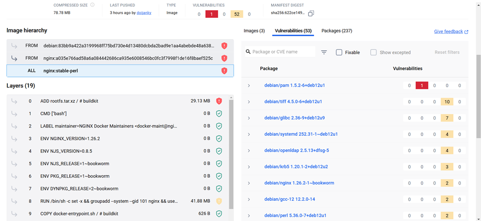
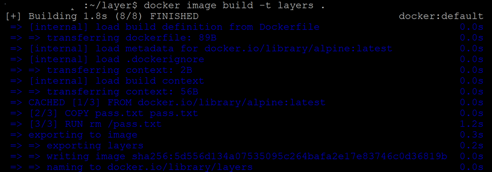
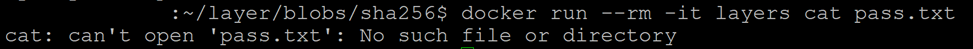
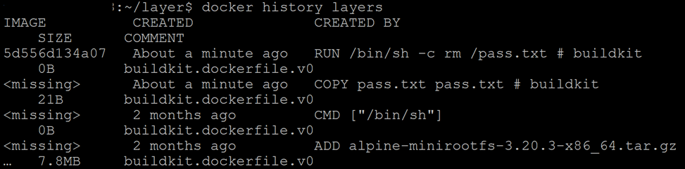
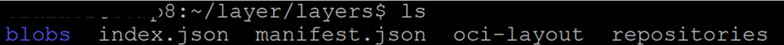
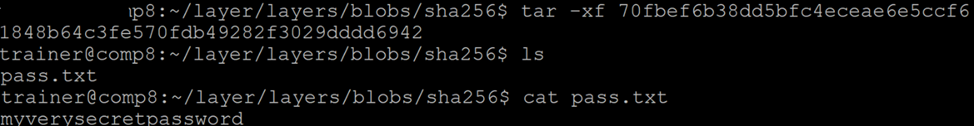

[источник](https://habr.com/ru/companies/otus/articles/859256/?ysclid=mlp6ju3iw7608661961)

- [ Препарируем слои образов Docker](#link_1)
  - [ Dockerfile как основа](#link_2)
  - [ Конфиденциальные данные в слоях](#link_3)
  - [ Из контейнера в образ](#link_4)
  - [ Методы защиты](#link_5)
  - [ Заключение](#link_6)

# Препарируем слои образов Docker <a name="link_1"></a>

Технологии контейнеризации сейчас являются неотъемлемой частью процессов DevOps. Контейнеры активно используются в микросервисных архитектурах для изоляции отдельных микросервисов. Наиболее распространенным решением по контейнеризации на сегодняшний день является Docker, и именно о небезопасной работе с контейнерами Docker мы и будем сегодня говорить.

## Dockerfile как основа <a name="link_2"></a>

Прежде чем начинать разговор о проблемах безопасности, вспомним, что такое образы, из чего они состоят и чем отличаются от контейнеров. Итак, образ — это неизменяемый шаблон только для чтения с инструкциями по созданию контейнера Docker. Как правило, образ строится на основе другого образа с некоторой дополнительной кастомизацией.

На базе готового образа создается контейнер, который затем запускается на выполнение. По сути, образ — это основа, которая используется для создания контейнера.

Для построения собственного образа необходимо создать Dockerfile, определить необходимые шаги и запустить его. Каждая команда в Dockerfile создает слой в образе. При изменении Dockerfile и перестроении образа перестраиваются только те слои, которые изменились.

Ниже представлено содержимое образа Nginx на ресурсе Docker Hub. В разделе Layers представлены команды, которые выполняются для создания слоев данного образа.



Как видно, этот образ содержит уязвимости, но сегодня мы не будем говорить о них. Вместо этого мы поговорим о безопасной работе со слоями и о том, как можно легко узнать какие файлы хранились на любом из слоев.

## Конфиденциальные данные в слоях <a name="link_3"></a>

На самом деле любой пользователь, имеющий доступ к образу контейнера, может получить доступ и ко всем включенным в этот образ файлам. Конечно, с точки зрения безопасности нежелательно включать в образ конфиденциальные данные, например, пароли или токены.

Однако иногда разработчики могут размещать конфиденциальные данные в одном из слоев своего образа, ошибочно полагая, что если в следующем слое они удалят эти данные, то никто не получит к ним доступ. Это не так и ниже мы рассмотрим Dockerfile, который демонстрирует, как делать НЕ нужно.

Представленный ниже набор команд Dockerfile создает образ на основе alpine, при этом в него сначала помещается, а потом удаляется файл с паролем:

```
FROM alpineCOPY pass.txt pass.txtRUN rm /pass.txt
```

Пример с практической точки зрения не слишком полезный, так как мы копируем файл с паролем и сразу же его удаляем, но он наглядно демонстрирует сохранение конфиденциальных данных в слоях.

Поэтому давайте сначала соберем данный образ, а потом запустим его.

Собрать образ можно с помощью команды:

`docker image build -t layers .`



А при запуске давайте сразу убедимся, что мы не можем прочитать файл pass.txt



С точки зрения разработчика все замечательно — конфиденциальные данные в контейнере отсутствуют. Однако на самом деле конфиденциальные данные все равно попали в образ.

## Из контейнера в образ <a name="link_4"></a>

Теперь давайте представим ситуацию, когда у злоумышленника есть доступ к консоли docker и он может выполнять любые команды, но прав root у него нет. При этом наш собранный контейнер запущен.

Без прав root нельзя получить доступ к /var/lib/docker/… и прочитать содержимое файловой системы контейнера. Можно попробовать посмотреть историю образа с помощью команды docker history:



Мы видим упоминание некоторого файла pass.txt на промежуточном слое, но не видим его содержимого. Попробуем посмотреть, что в нем находится, другим способом.

Экспортируем образ в файл tar с помощью команды `docker save` и распакуем его:

`docker save layers > layers.tar`

`tar -xf layers.tar`

В итоге после распаковки мы увидим несколько файлов и каталог.



Здесь manifest.json — это файл верхнего уровня с описанием образа. В нем указывается, в каком файле находится конфигурация, описываются все теги для данного образа и перечисляются все слои. Этот файл нам и нужен. В нем упоминаются три слоя, используемые в нашем образе, а также указаны их размеры и формат tar.


Перейдем в каталог Blobs/sha256: здесь мы видим несколько файлов. Нас интересуют те три файла, которые были указаны в manifest.json. Каждый из них можно распаковать с помощью tar.

Файл 75654… является основным образом файловой системы. А вот в файле 70fbe… мы увидим наш файл pass.txt:



Таким образом, мы смогли получить содержимое промежуточного слоя, на котором был сохранен файл с конфиденциальными данными. Собственно, все манипуляции с файлами на промежуточных слоях будут в них сохранены, поэтому разработчикам стоит об этом помнить.

## Методы защиты <a name="link_5"></a>

Говоря о методах защиты стоит рассмотреть использование секретов в средах Docker Swarm. Также, в Kubernetes есть сущность secret, которая позволяет передавать в контейнеры конфиденциальные данные.

Так мы можем создать секрет с помощью kubectl, и затем использовать его непосредственно в контенейрах в качестве переменной среды или подмонтировав как внешний том.

Для создания секрета лучше сначала отключить запись истории команд (их можно посмотреть с помощью команды history).

`set +o history`

Далее создадим секрет mysecret, содержащий name=user

`kubectl create secret generic mysecret --from-literal=name=user`

далее запись истории можно вернуть.

`set -o history`

Далее мы можем обращаться к нашему секрету уже из контейнера. В примере ниже секрет будет подмонтирован к контейнеру в виде файла.

```
apiVersion: v1kind: Podmetadata:  name: mypodspec:  containers:  - name: mypod    image: redis    volumeMounts:    - name: foo      mountPath: "/etc/foo"      readOnly: true  volumes:  - name: foo    secret:      secretName: mysecret      optional: true
```

Но здесь важно помнить, что после того, как мы передали секрет контейнеру, уже контейнер и приложение в нем отвечает за обеспечение конфиденциальности данных.

## Заключение <a name="link_6"></a>

В статье мы рассмотрели то, как можно извлечь данные из слоев образа Docker, поговорили о проблемах сохранения файлов в этих слоях. Также мы рассмотрели один из вариантов обеспечения безопасности конфиденциальных данных с использованием kubernetes.

> Все актуальные методы и инструменты обеспечения безопасности можно освоить на онлайн-курсах OTUS: [в каталоге](https://otus.pw/j0dC/) можно посмотреть список всех программ, а [в календаре](https://otus.pw/S64n/) — записаться на открытые уроки.
