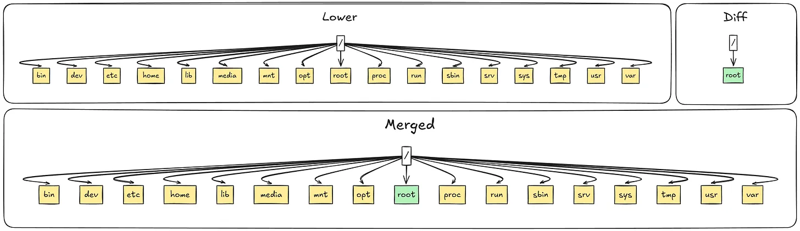
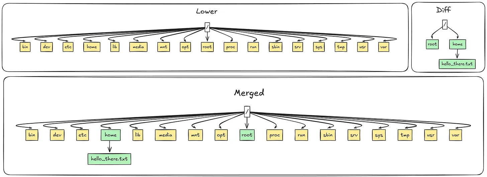
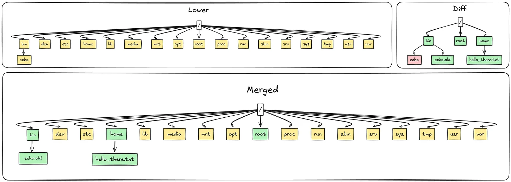

[источник](https://habr.com/ru/companies/flant/articles/862252/?ysclid=mlnt2fz3pe508628574)

- [ OverlayFS](#link_1)
- [ Создаём файловую систему в контейнере](#link_2)
- [ Заключение](#link_3)

*Примечание переводчика: недавно инженер Google Михал Питр написал практический обзор того, как работают файловые системы в контейнерах. Его небольшая статья поможет разобраться, что делает Docker, и вручную создать файловую систему контейнера. Слово автору.* 

На выходных я сделал игрушечный клон Docker’а. В процессе возник вопрос, откуда у контейнера берётся файловая система? Чтобы ответить на него, давайте разберёмся, что делает Docker, а потом воспроизведём всё это самостоятельно.

Запустим командную оболочку в Docker-контейнере на базе образа Alpine:

```
michal@michal-lg:~$ docker run -it --entrypoint /bin/sh --rm --name "alpine-container" alpine
/ # ls
bin    dev    etc    home   lib    media  mnt    opt    proc   root   run    sbin   srv    sys    tmp    usr    var

/ # hostname
a7cbf0aea1ad

/ # cd home && ls
```

Мы оказались в отдельной файловой системе, и она довольно пустая. Создадим файл:

```
/ # echo -e "Hello there\nGeneral Kenobi" > /home/hello_there.txt
/ # cat /home/hello_there.txt

Hello there
General Kenobi
```

Как думаете, можно ли получить доступ к этому файлу с хоста?

Спойлер
Можно — давайте сделаем это!

Docker хранит всё в директории `/var/lib/docker`, поэтому запустим второй терминал и поищем:

```
root@michal-lg:/var/lib/docker# find -name hello_there.txt

./overlay2/1557145fe40a1595d090eeafa72c39a7b54cca4791ae9e3ffafabff06466125c/diff/home/hello_there.txt
./overlay2/1557145fe40a1595d090eeafa72c39a7b54cca4791ae9e3ffafabff06466125c/merged/home/hello_there.txt
root@michal-lg:/var/lib/docker#
```

Любопытно, что наш файл нашёлся в двух разных директориях. Посмотрим, что ещё есть в `diff` и `merged`:

```
root@michal-lg:/var/lib/docker/.../diff# ls
home  root

root@michal-lg:/var/lib/docker/.../merged# ls
bin  dev  etc  home  lib  media  mnt  opt  proc  root  run  sbin  srv  sys  tmp  usr  var
```

`diff` содержит только пустую root-директорию и домашнюю директорию с созданным нами файлом. Содержимое `merged` полностью совпадает с файловой системой контейнера.

### OverlayFS <a name="link_1"></a>

Docker использует файловую систему OverlayFS. Она позволяет объединить два дерева файлов, «нижнее» и «верхнее», в комбинированный вид «merged». В Docker «верхнее» дерево файлов называется «diff», что, пожалуй, более уместно, и я буду обращаться к нему именно так.

Понять, зачем нужны файловые системы union-типа (см. [Каскадно-объединённое монтирование](https://ru.wikipedia.org/wiki/%D0%9A%D0%B0%D1%81%D0%BA%D0%B0%D0%B4%D0%BD%D0%BE-%D0%BE%D0%B1%D1%8A%D0%B5%D0%B4%D0%B8%D0%BD%D1%91%D0%BD%D0%BD%D0%BE%D0%B5_%D0%BC%D0%BE%D0%BD%D1%82%D0%B8%D1%80%D0%BE%D0%B2%D0%B0%D0%BD%D0%B8%D0%B5)), помогает следующий пример: на одном хосте, как правило, запускается несколько контейнеров. Высока вероятность того, что у них будет одинаковый нижний слой, будь то Alpine, Ubuntu или более специализированный, например Golang.

Если этот слой сделать read-only, его можно будет переиспользовать между контейнерами, сильно экономя место. При этом все изменения будут записываться в верхний слой. Давайте посмотрим, что произошло после создания *hello_there.txt:* 



_Чтобы избежать захламлённости, показывается содержимое только нужных нам директорий_

При создании hello_there.txt в `/home` тот был записан в `diff`, а OverlayFS создала объединённый вид в `merged`:



Что произойдёт, если изменить что-нибудь в нижнем слое? Давайте переименуем `/bin/echo` в `/bin/echo.old`:

```
/ # cd bin
/bin # mv echo echo.old
/bin # ls
...
chgrp          echo.old       gzip           ln             mount          printenv       setserial      umount
...
```

Как уже говорилось, нижний слой доступен только для чтения, поэтому все правки попадают в `diff`.

```
root@michal-lg:/var/lib/docker/overlay2/.../diff/bin# ls -l
total 0
c--------- 1 root root 0, 0 Nov 11 23:06 echo
lrwxrwxrwx 1 root root   12 Sep  6 13:34 echo.old -> /bin/busybox
```

Файлов теперь два! Один — для более не существующего _echo_, другой — для _echo.old_. OverlayFS использует специальные [whiteout-файлы](https://docs.kernel.org/filesystems/overlayfs.html#whiteouts-and-opaque-directories) для обозначения того, что файл был удалён в верхнем слое (даже если он существует в нижнем read-only-слое). Когда OverlayFS видит этот файл, она знает, что не нужно включать его в merged-представление.

Второй файл гораздо менее интересен: это просто переименованный echo, который на поверку оказывается символической ссылкой на busybox:



### Создаём файловую систему в контейнере <a name="link_2"></a>

Теперь давайте посмотрим, как Docker создаёт новую файловую систему с помощью OverlayFS.

Сначала создадим временные директории в `/tmp/` — они и станут файловой системой нашего контейнера:

```
michal@michal-lg:/tmp$ mkdir -p /tmp/container-demo/{diff,merged,work}
michal@michal-lg:/tmp$ ls container-demo/
diff  merged  work
```

С `diff` и `merged` мы уже встречались. `work` — рабочая директория OverlayFS, и нас она не интересует.

Загрузим Alpine minirootfs для нужной архитектуры процессора и распакуем его в `/tmp/container-demo/`. Я переименую извлечённую папку в «alpine»:

```
michal@michal-lg:/tmp/container-demo$ ls
alpine  diff  merged  work
```

Всё настроено, можно монтировать [файловую систему OverlayFS](https://man7.org/linux/man-pages/man8/mount.8.html):

```
michal@michal-lg:/tmp/container-demo$ sudo mount -t overlay  overlay  -o lowerdir=alpine,upperdir=diff,workdir=work  merged
```

Если теперь вывести содержимое `merged`, увидим файловую систему Alpine:

```
michal@michal-lg:/tmp/container-demo/merged$ ls
bin  etc   lib    mnt  proc  run   srv  tmp  vardev  home  media  opt  root  sbin  sys  usr
```

Если создать там файл, он будет записан в `diff`:

```
michal@michal-lg:/tmp/container-demo/merged$ echo hello > hello.txt

michal@michal-lg:/tmp/container-demo/merged$ ls
bin  etc        home  media  opt   root  sbin  sys  usrdev  hello.txt  lib   mnt    proc  run   srv   tmp  var

michal@michal-lg:/tmp/container-demo/merged$ ls ../diff/
hello.txt
```

В заключение можно запустить новый shell-процесс и установить `merged` в качестве его корневой директории. То же самое происходит в контейнерах — так те получают свою собственную файловую систему. Любой процесс, порождённый этим shell-процессом, унаследует корневую директорию и сможет работать со своей файловой системой.

```
michal@michal-lg:/tmp/container-demo$ sudo chroot merged /bin/sh
/ # ls
bin        hello.txt  media      proc       sbin       tmpdev        home       mnt        root       srv        usretc        lib        opt        run        sys        var

/ # cd ..
/ #
```

Полноценная реализация отличается от нашей тем, что в ней используются пространства имён для дополнительной изоляции. Подробнее о них можно узнать из [man-страниц Linux](https://man7.org/linux/man-pages/man7/namespaces.7.html).

### Заключение <a name="link_3"></a>

Для подавляющего большинства инженеров контейнеры — это чёрный ящик. Надеюсь, теперь у вас появилось понимание того, как они работают.

Ещё у меня есть более полный клон Docker'а примерно из 200 строк кода, написанный на Golang, — [заходите](https://github.com/MichalPitr/toy-docker), если интересно!
