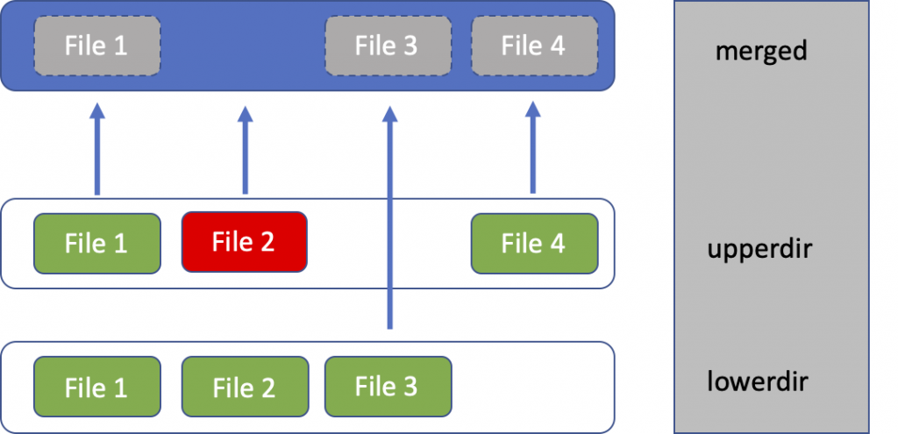
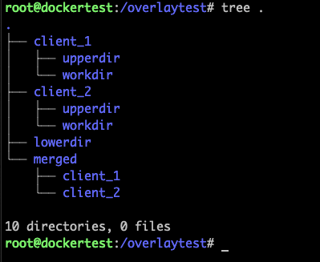
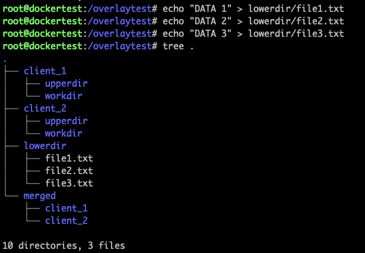
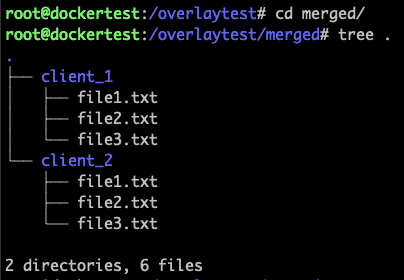
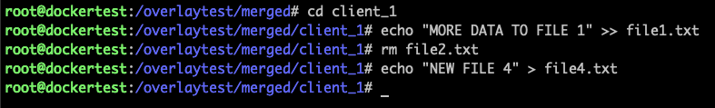
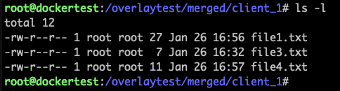
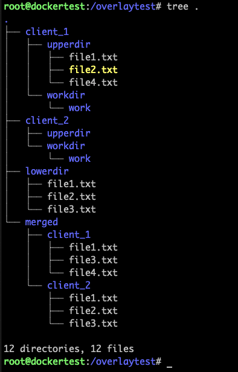
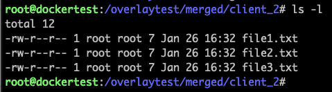
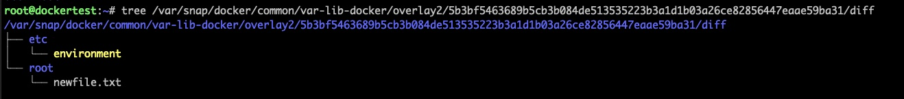

[source](https://blogs.cisco.com/developer/373-containerimages-03)

- [ Understanding Container Images, Part 3: Working with Overlays](#link_1)
  - [ Linux filesystems](#link_2)
  - [ Playing with overlay filesystems](#link_3)
  - [ Upper and lower directories](#link_4)
  - [ Multiple versions of the same base data](#link_5)
  - [ Examining overlays for your containers](#link_6)

# Understanding Container Images, Part 3: Working with Overlays <a name="link_1"></a>

[Francisco Sedano Crippa](https://blogs.cisco.com/author/franciscosedanocrippa "Posts by Francisco Sedano Crippa")

In the previous two posts we discussed [how container images are built](https://blogs.cisco.com/developer/container-image-layers-1?ccid=&dtid=devblog&oid=crippa-containerimage3-ww) and [how we can build optimal Dockerfiles](https://blogs.cisco.com/developer/container-images-2?ccid=&dtid=devblog&oid=crippa-containerimage3-ww) to make the best use of layers.

On this post, we are going to dig more on the mechanism docker uses to work with the layers, and how we can use it for other projects.

## Linux filesystems <a name="link_2"></a>

Docker relies on storage drivers to create the container filesystem. This allows docker to work with different Linux distributions that might have different capabilities.

There are different storage drivers available on Docker: aufs, overlay2, btrfs, devicemapper, zfs… All of them will provide Docker with a way to support layers and copy on write. This allows your container to see the data from other layers, but when any data is modified, it is written on a different place instead of overwriting the original content. This is called ‘Copy on write’, since the data is only copied when a write is performed.

Which storage driver you use actually depends on the Linux distribution and version you’re running. Over time, new storage drivers appear with better characteristics.

Until docker 18.06 (~2018 timeframe), the default storage driver was AUFS. It has been replaced since with overlay2, which provides better performance.

To check the storage driver in use, you can run docker info:

```
root@dockertest:~# docker info
...
 Server Version: 19.03.11
 Storage Driver: overlay2
  Backing Filesystem: extfs
  Supports d_type: true
  Native Overlay Diff: true
```

## Playing with overlay filesystems <a name="link_3"></a>

Docker is not the only use case for overlay filesystems. Anytime you need to provide multiple views of the same data, with potentially some variations on them, you can also use them and avoid saving redundant data. You will store only once the common data, and the differences for each view.

On the next post we will see a practical use of this involving networks and multiple Raspberry PIs – For now, let’s just play and create some overlays!

## Upper and lower directories <a name="link_4"></a>

Overlayfs uses the concept of “upper” and “lower” directories:



Our base layer is called ‘lowerdir’ – This is where the original files reside.

Any modification the client does will be reflected on the ‘upperdir’:

- If you change a file, the new version will be written there (File 1 in our example).
- If you delete the file, a deletion mark will be created on this layer (File 2 in our example).
- If you create a new file (File 4 in our example), it will be placed here.

Finally, ‘merged’ is the final view of all merged layers.

## Multiple versions of the same base data <a name="link_5"></a>

Time for some examples! Imagine you have a big set of data, and you need several processes to access and modify it. Each process should have an independent view of the data, but storing the initial big set of data multiple times would be extremely inefficient. That’s the perfect use case for overlays!

First, we create our different directories: upper, lower and merged. Overlayfs also needs an extra directory called ‘workdir’, which needs to be empty, and it’s used as an internal temporary storage.

Each client accessing the data needs to have a different view, therefore we will create a different ‘upperdir’, ‘workdir’ and ‘merged’ directory for each of them.

However, the ‘lowerdir’ directory is the same for all of clients since it holds our base data.

The directory structure we are creating looks like this one:



With our directory structure in place, we can start adding data:



And now, we can use overlayfs to create our final view. We mount once for each client:

```
mount -t overlay overlay \
-o lowerdir=/overlaytest/lowerdir \
-o upperdir=/overlaytest/client_1/upperdir \
-o workdir=/overlaytest/client_1/workdir \
/overlaytest/merged/client_1
```

```
mount -t overlay overlay \
-o lowerdir=/overlaytest/lowerdir \
-o upperdir=/overlaytest/client_2/upperdir \
-o workdir=/overlaytest/client_2/workdir \
/overlaytest/merged/client_2
```

Let’s check the end result: all the files from our base layer are there.



Let’s imagine client 1 makes some changes, like the ones in our layers diagram:




From the perspective of the client accessing the merged data, it all appears like a regular operation: One file was removed, one changed and another one was created:



However, looking at the entire tree reveals the changes are stored in our ‘upperdir’:



The common files remain unchanged, and client_2 continues to see the same data as before:



## Examining overlays for your containers <a name="link_6"></a>

Now that we are familiar with overlays and all associated directories, we can dig into our containers in a different way. Let’s run a new container from Ubuntu 18.04 image:

```
root@dockertest:~# docker run -ti ubuntu:18.04 bash
Unable to find image 'ubuntu:18.04' locally
18.04: Pulling from library/ubuntu
d519e2592276: Pull complete
d22d2dfcfa9c: Pull complete
b3afe92c540b: Pull complete
Digest: sha256:ea188fdc5be9b25ca048f1e882b33f1bc763fb976a8a4fea446b38ed0efcbeba
Status: Downloaded newer image for ubuntu:18.04
root@9d0900aab3d8:/#
```

Inside this container, let’s delete a file and create another one:

```
root@9d0900aab3d8:/# rm /etc/environment
root@9d0900aab3d8:/# echo "NEW FILE" > /root/newfile.txt
root@9d0900aab3d8:/# exit
```

From outside the container, you can now explore how Docker stored the changes. From the prompt, you can see the container ID, and confirm it from docker ps -a command:

```
root@dockertest:~# docker ps -a
CONTAINER ID   IMAGE          COMMAND    CREATED              STATUS
9d0900aab3d8   ubuntu:18.04   "bash"     About a minute ago   Exited (0)
```

With the container ID, you can use docker inspect command to learn more about it. It will print a lot of information, look for “GraphDriver” section:

```
root@dockertest:~# docker inspect 9d0900aab3d8
...
"GraphDriver": {
    "Data": {
        "LowerDir": "/var/snap/docker/common/var-lib-docker/overlay2/5b3bf5463689b5cb3b084de513535223b3a1d1b03a26ce82856447eaae59ba31-init/diff:/var/snap/docker/common/var-lib-docker/overlay2/5bdfb4a206a7a6a8fb48055f307697f0600eeae3dabc24602fd139cfd306884a/diff:/var/snap/docker/common/var-lib-docker/overlay2/74137f0fb4dff7da3a3d5f37b519b09299061ebee9dffc13844d77b40f774ba7/diff:/var/snap/docker/common/var-lib-docker/overlay2/f958120cefa9718d5dc5f3fbc32b630783941fcfbe6007c3c0004902ecb81c23/diff",
        "MergedDir": "/var/snap/docker/common/var-lib-docker/overlay2/5b3bf5463689b5cb3b084de513535223b3a1d1b03a26ce82856447eaae59ba31/merged",
        "UpperDir": "/var/snap/docker/common/var-lib-docker/overlay2/5b3bf5463689b5cb3b084de513535223b3a1d1b03a26ce82856447eaae59ba31/diff",
        "WorkDir": "/var/snap/docker/common/var-lib-docker/overlay2/5b3bf5463689b5cb3b084de513535223b3a1d1b03a26ce82856447eaae59ba31/work"
},
"Name": "overlay2"
}

```

Inside “LowerDir” you can see the three entries (separated by a semicolon) for each of the layers that comprise the ubuntu image. “UpperDir” stores the change you did to the original ubuntu image: Adding a new file (/root/newfile.txt) and removing another one (/etc/environment)



I hope this overview of overlayfs has been useful. It’s a great technique to use to avoid storing repeated data and a good tool to have in mind. On the next post I will show one real world use case, involving NFS and Raspberry PI!
