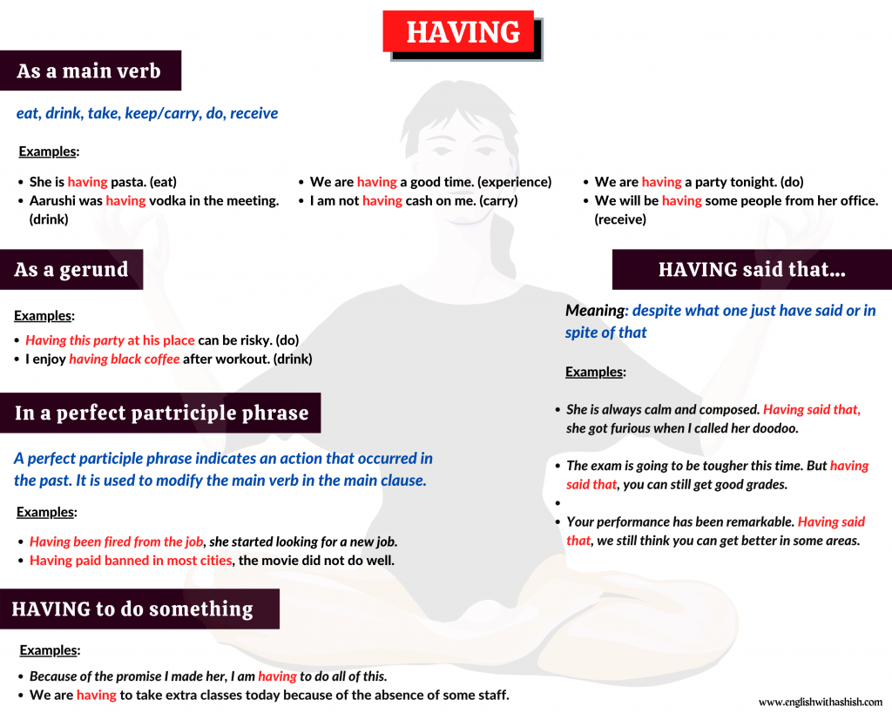

# Use of having in a sentence

by [Ashish Sharma](https://www.englishwithashish.com/author/englishwithashish/ "View all posts by Ashish Sharma")

This post will help you understand how to use ‘having’ in a sentence. _Having_ is a present participle of have and can be used for different purposes.

The word having can be used in the following ways in English:

1. As a main verb
2. As a gerund
3. As a perfect participle

Let’s understand all the uses of having one by one in detail.

use of having

## **1. ‘Having’ as a main verb**

One of the most common uses of having is to use it as a [main verb](https://englishwithashish.com/main-verb-in-english/). As a main verb, it means the following:

1. Eat
2. Drink
3. Face/experience
4. carry/keep
5. Do
6. Receive
7. Causative verb

### **HAVING = eat**

- She is **eating** pasta.
- She is **having** pasta.

- I was **eating** dinner when you called.
- I was **having** dinner when you called.

### **HAVING = drink**

- He was **drinking** soup in his room.
- He was **having** soup in his room.

- Aarushi was **drinking** vodka in the meeting.
- Aarushi was **having** vodka in the meeting.

### **HAVING = face/experience**

- We are **having** a good time.
- I was **having** some financial problems.
- I am **having** fun.

The verb ‘having’ here means that the subject is experiencing or going through a particular situation.

### **HAVING = do**

- We did not **have** food with us.
- I am not **having** cash on me.
- He was **having** some bags.

Here, the verb ‘having’ means the subject is in the possession of something at the time of speaking.

### **HAVING = carry/keep**

- We are **having** a party tonight.
- I am not **having** cash on me.
- He was **having** some bags**.**

### **HAVING = receive**

- We are **having** some guests come over in the evening.
- I am not **having** anyone to play chess with me tonight.
- We will be **having** some people from her office.

**NOTE**: ‘having’ here does not literally mean to receive as you receive a gift or a delivery. If you are having some people over, they are coming to your place for something, usually for a meal like dinner or to drink, watch TV and enjoy.

### **HAVING as a causative verb**

_Have_ as a [causative verb](https://englishwithashish.com/causative-verb-in-details/) means to ask or instruct someone to do something.

Examples:

- I **have** my sister clean my room.
- We will **have** Jon contact you and help you with this project.
- My father **had** me pick up some people from a station.

When the verb ‘have’ is in the continuous form, it indicates that someone is making someone do something, not by forcing though. But the action is going on.

Examples:

- I am **having** Aarushi cut my hair. (= Aarushi is cutting my hair.)
- We are **having** the car fixed. (= Someone is fixing our car, and we are watching over.)

## **2.** **Having as a gerund**

Having can be used as a [gerund](https://englishwithashish.com/what-are-gerunds/) in a [gerund phrase](https://englishwithashish.com/what-is-a-gerund-phrase-in-english/). A gerund can render any of the meanings that it gives as a main verb.

Examples:

- _Having this party_ at his place can be risky. (do)
- I enjoy _having black coffee_ after workout. (drink)
- _Having a positive attitude_ is important. (keep)

## **3. In a perfect partriciple phrase**

A perfect participle phrase indicates an action that occurred in the past. It is used to modify the main verb in the [main clause](https://englishwithashish.com/types-of-clauses/).

**Structure**: having + past participle + object/modifier

Examples:

- _**Having been fired from the job**,_ she started looking for a new job.

Alternatives:

**=** After she got fired from the job, she started looking for a new job.  
= she started looking for a new job after she got fired.

- _**Having paid banned in most cities,**_ the movie did not do well.

Alternative: The movie did not do well as it was banned in most cities.

## **4.** **HAVING to do something**

The phrase ‘having to do something’ might sound odd to some ears. But it is used _to refer to an activity that is going on for a limited time because of a requirement or a need._

Examples:

- Because of the promise I made her, I am **_having_** to do all of this.

The action is in progress and will be stopped soon. We are using the progressive form as the speaker is doing the action. If it was a general requirement or obligation, we would use the verb ‘have’ there: **I have to do all of this.**

Here, the action is most probably not taking place, and it is a general requirement or obligation. You boss might have given this responsibility. It is a part of your job now. You will have to follow this instruction unless your boss asks you to stop doing this. But the continuous form indicates that the action is in progress and the action will be stopped soon.

- His cook is not coming to work today. Therefore, he is **_having_** to prepare food for everyone in the family.
- We are **_having_** to take extra classes today because of the absence of some staff.

We are **_having_** to take extra classes today because of the absence of some staff.  
(The action is going on)

We **_have_** to take extra classes today because of the absence of some staff.  
(The action is probably not going on)

## **5**. **HAVING said that…**

This is a common phrase used to introduce something that contradicts what you have said earlier. It is a perfect participle phrase.

**Meaning**: despite what one just have said or in spite of that

Examples:

- She is always calm and composed. **Having said that**, she got furious when I called her doodoo.
- The exam is going to be tougher this time. **But having said that,** you can still get good grades.
- Your performance has been remarkable. **Having said that,** we still think you can get better in some areas.
- He hasn’t been doing well lately. **Having said that,** I think he still can be a great asset to our team.
- This car is extremely expensive. **Having said that,** I would love to buy it some day.

**NOTE**: we can also use the phrases **‘that being said’** and **‘that said’** to mean the same.