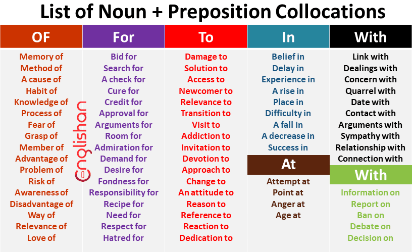
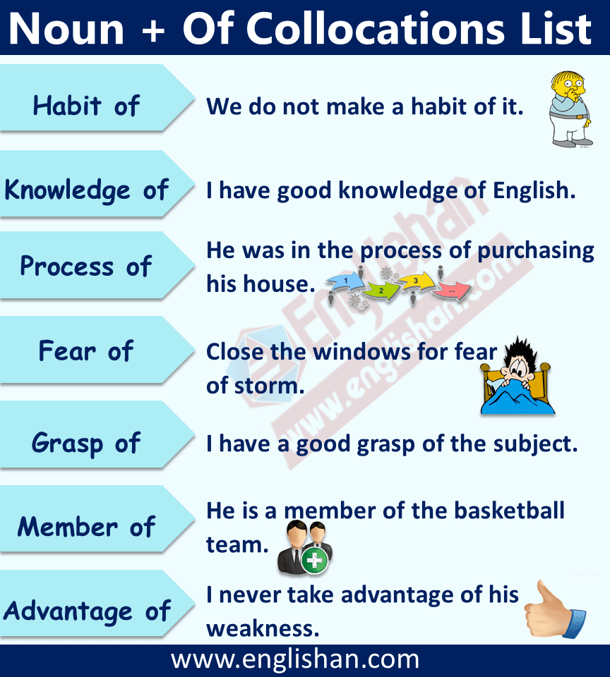
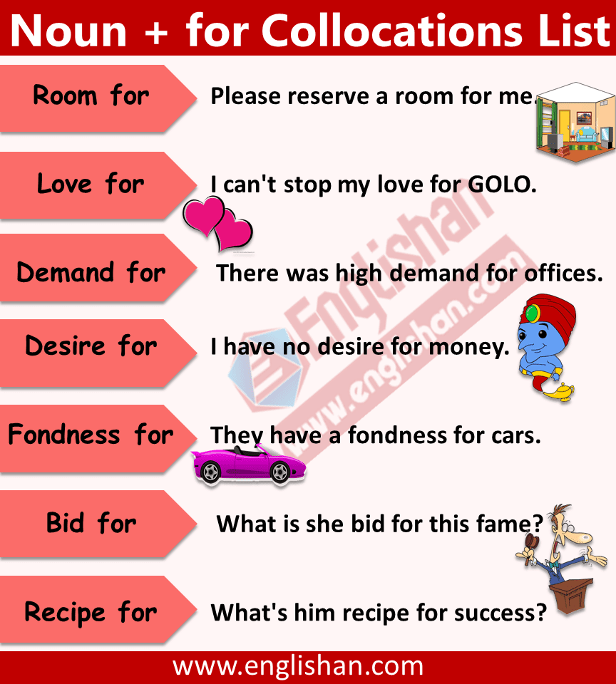
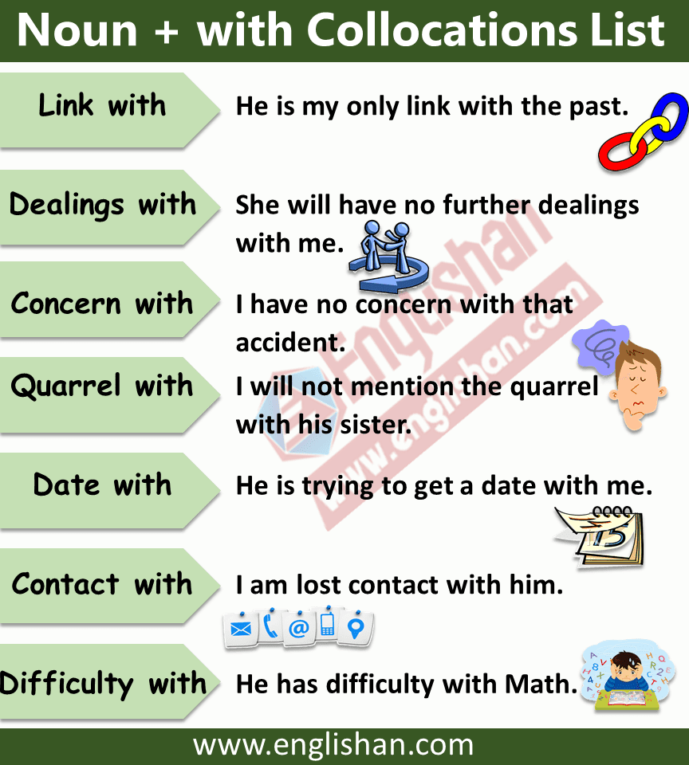
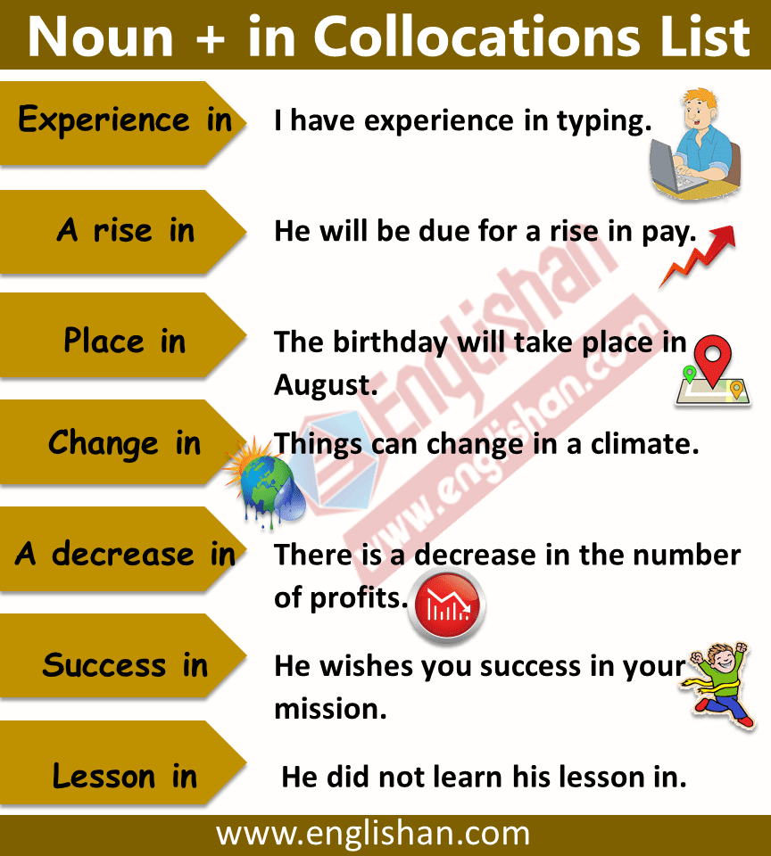
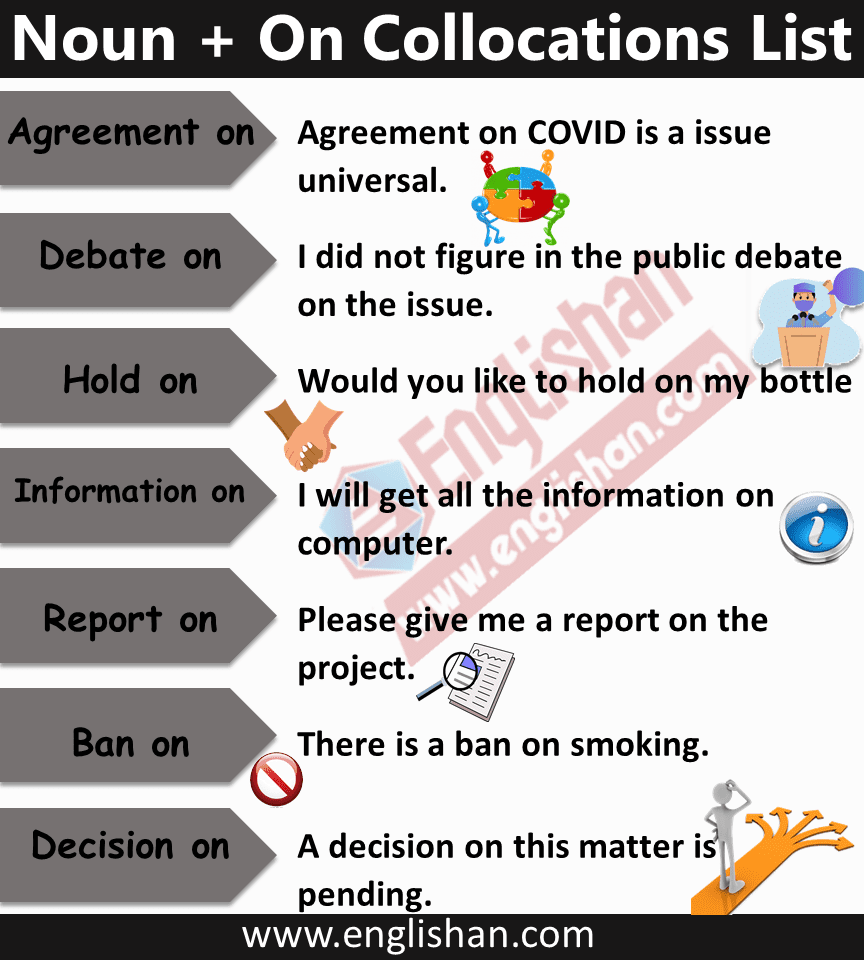
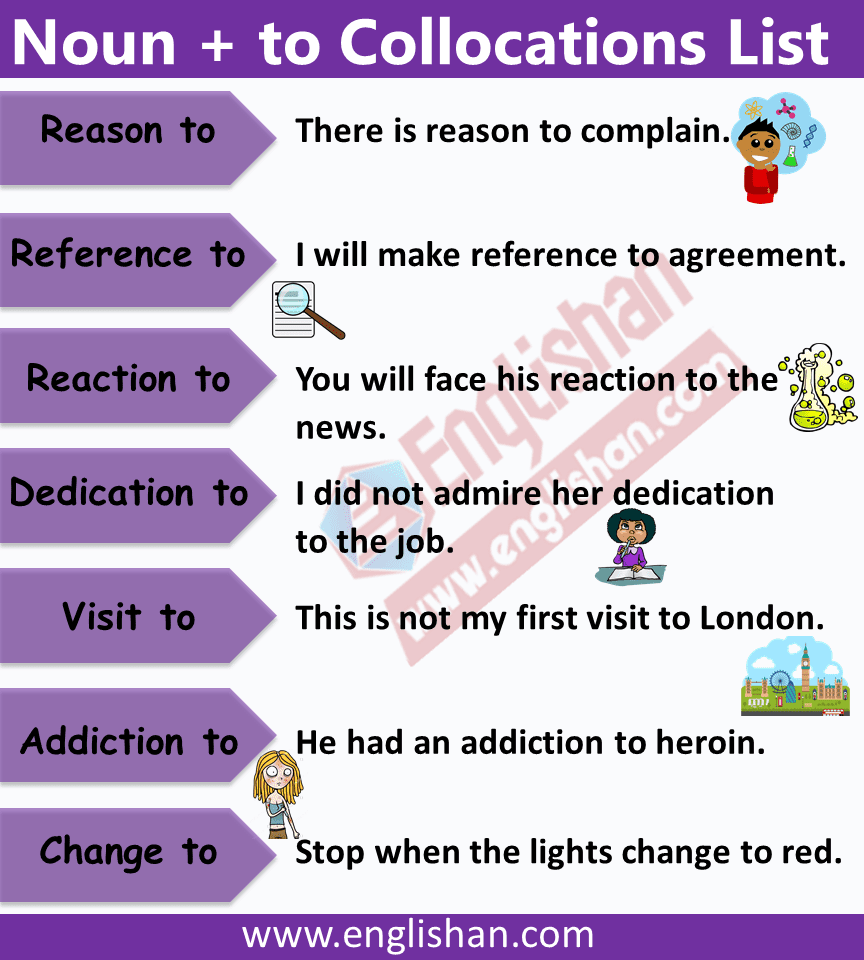
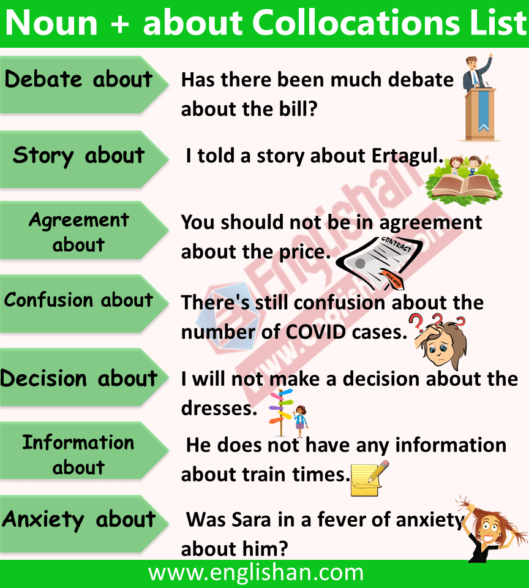
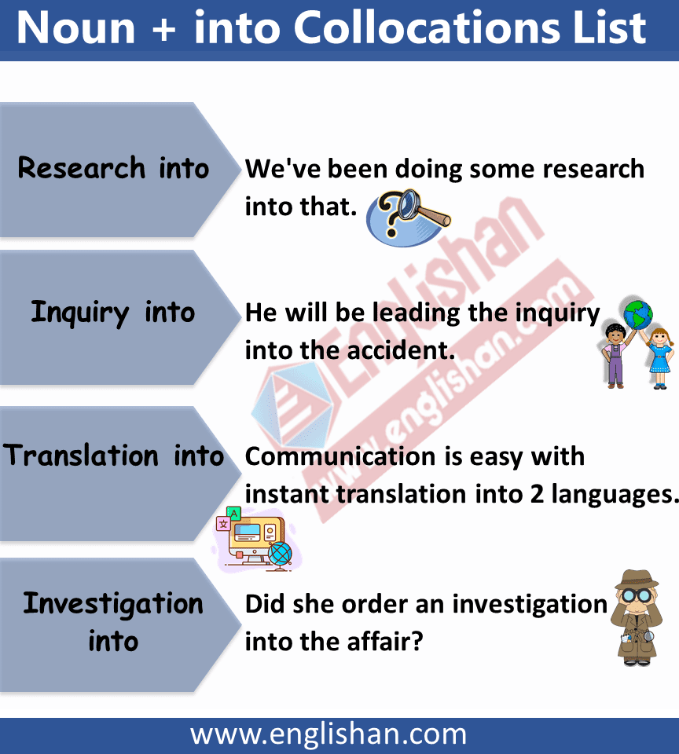

[источник](https://englishan.com/noun-preposition-collocations/)

# List of Noun Preposition Collocations in English PDF

[Share](https://englishan.com/noun-preposition-collocations/#)

Understanding how words fit together is super important. That’s where **noun preposition collocations** come in. These word pairs help us talk more clearly. From “demand for” to “affinity with,” they’re like puzzle pieces for sentences. Getting good at using **noun preposition collocations** makes your words sound better. It’s like upgrading from regular talk to super talk. So, let’s chat about why these word buddies matter and how to use them well.

Table of Contents

- [Noun Preposition Collocations](https://englishan.com/noun-preposition-collocations/#Noun_Preposition_Collocations "Noun Preposition Collocations")
    - [Noun + of](https://englishan.com/noun-preposition-collocations/#Noun_of "Noun + of")
    - [Noun + for](https://englishan.com/noun-preposition-collocations/#Noun_for "Noun + for")
    - [Noun + In](https://englishan.com/noun-preposition-collocations/#Noun_In "Noun + In")
    - [Noun + On](https://englishan.com/noun-preposition-collocations/#Noun_On "Noun + On")
    - [Noun + To](https://englishan.com/noun-preposition-collocations/#Noun_To "Noun + To")
    - [Noun + About](https://englishan.com/noun-preposition-collocations/#Noun_About "Noun + About")
    - [Noun + Into](https://englishan.com/noun-preposition-collocations/#Noun_Into "Noun + Into")

## Noun Preposition Collocations

### Noun + of

|                  |                                                       |
| ---------------- | ----------------------------------------------------- |
| Memory of        | The memory of that day still makes me sad.            |
| Method of        | What is the method of payment?                        |
| A cause of       | Junk foods is a cause of disease.                     |
| Habit of         | we do not make a habit of it.                         |
| Knowledge of     | I have good knowledge of English.                     |
| Process of       | He was in the process of purchasing his house.        |
| Fear of          | Close the windows for fear of storm.                  |
| Grasp of         | I have a good grasp of the subject.                   |
| Member of        | He is a member of the basketball team.                |
| Advantage of     | I never take advantage of his weakness.               |
| Problem of       | The world is facing a problem of COVID-19.            |
| Risk of          | Exercise lessens the risk of heart disease.           |
| Awareness of     | We need to increase public awareness of the COVID 19. |
| Disadvantage of  | One disadvantage of the car is, it saves time.        |
| Way of           | I am traveling to Karachi by way of Lahore.           |
| Relevance of     | I don’t see the relevance of your question.           |
| Love of          | She is the greatest love of his life                  |
| Address of       | The address of the registered school.                 |
| Example of       | This is a good example of book.                       |
| A photograph of  | He took a photograph of me.                           |
| Understanding of | My understanding of English is bad.                   |
| Possibility of   | There is a clear possibility of raining.              |
| Experience of    | It will be the worst experience of my life.           |

### **Noun + for**

|   |   |
|---|---|
|**Bid for**|**I am going to bid for 500 for this necklace.**|
|**Search for**|**Policeman joined the search for the lost kids.**|
|**A check for**|**I gave the family a check for $1700.**|
|**Cure for**|**There is no known cure for the disease.**|
|**Credit for**|**We did not take credit for her work.**|
|**Approval for**|**I am sure, I won approval for my project.**|
|**Arguments for**|**There were not strong arguments for and against COVID-19**|
|**Room for**|**Please reserve a room for me.**|
|**Admiration for**|**He is full of admiration for me.**|
|**Demand for**|**There was high demand for offices.**|
|**Desire for**|**I have no desire for money.**|
|**Fondness for**|**They have a fondness for cars.**|
|**Responsibility for**|**I have no responsibility for that accident.**|
|**Recipe for**|**What’s him recipe for success?**|
|**Need for**|**There is need for you to go picnic.**|
|**Respect for**|**We show respect for authority.**|
|**Hatred for**|**She feels hatred for him.**|
|**Love for**|**I can’t stop my love for GOLO.**|
|**Talent for**|**My Father has a talent for music.**|
|**Preference for**|**I have a preference for love.**|
|**Thirst for**|**You and me thirst for the that things.**|
|**Reputation for**|**They had a reputation for punctuality.**|
|**Case for**|**Let them carry your case for you.**|
|**Advertisement for**|**This is an advertisement for laptop.**|

**Noun + with Collocations List**

|   |   |
|---|---|
|**Link with**|**Link with my brother, he is in your town.**|
|**Dealings with**|**She will have no further dealings with me.**|
|**Concern with**|**I have no concern with that accident.**|
|**Quarrel with**|**I will not mention the quarrel with his sister.**|
|**Date with**|**He is trying to get a date with me.**|
|**Contact with**|**I have lost contact with him.**|
|**Arguments with**|**She always arguments with him.**|
|**Sympathy with**|**You are wrong, I have no sympathy with you.**|
|**Relationship with**|**I have very close relationship with you.**|
|**Connection with**|**What is your connection with the office?**|
|**Involvement with**|**Sara has always felt a deep involvement with flowers.**|
|**Difficulty with**|**He has difficulty with Math.**|
|**Meeting with**|**will you close the meeting with a short speech?**|

### **Noun + In**

|   |   |
|---|---|
|**Belief in**|**I lost my belief in that story.**|
|**Delay in**|**She apologizes for the delay in replying to you.**|
|**Experience in**|**I have experience in typing.**|
|**A rise in**|**He will be due for a rise in pay.**|
|**Place in**|**The birthday will take place in August.**|
|**Difficulty in**|**Companies were having difficulty in during lockdown.**|
|**A fall in**|**Is it late to fall in love?**|
|**A decrease in**|**There is a decrease in the number of profits.**|
|**Success in**|**He wishes you success in your mission.**|
|**Lesson in**|**He did not learn his lesson in.**|
|**Participation in**|**I do not want more participation in the decision-making.**|
|**Difference in**|**I measured the difference in temperature.**|
|**Course in**|**This is not a course in mechanics.**|
|**An increase in**|**There has been an increase in the number of people looking for job.**|
|**Interest in**|**She finds no interest in such things.**|
|**Growth in**|**There has been no growth in membership.**|
|**Change in**|**Things can bring change in a climate.**|

### **Noun + On**

|   |   |
|---|---|
|**Agreement on**|**Agreement on C_OVID_ is a universal issue.**|
|**Congratulations on**|**Congratulations on a superb performance!**|
|**Hold on**|**Would you like to hold on _my bottle_**|
|**Information on**|**I will get all the information on _computer_.**|
|**Report on**|**Please give me a report on the project.**|
|**Ban on**|**There is a ban on smoking.**|
|**Debate on**|**I did not figure in the public debate on the issue.**|
|**Decision on**|**A decision on this matter is pending.**|

### **Noun + To**

|   |   |
|---|---|
|**Damage to**|**Alcohol causes damage to liver.**|
|**Solution to**|**There’s no easy solution to this problem.**|
|**Access to**|**There is no access to the city is across the bridge.**|
|**Newcomer to**|**I will not newcomer to the village.**|
|**Relevance to**|**My idea has lost all relevance to the modern world.**|
|**Transition to**|**The England say they will not favour a transition to democracy.**|
|**Visit to**|**This is not my first visit to Landon.**|
|**Addiction to**|**He had an addiction to heroin.**|
|**Invitation to**|**I have not got an invitation to their wedding.**|
|**Devotion to**|**You did not show great devotion to other.**|
|**Approach to**|**They have a thoughtful approach to their work.**|
|**Change to**|**Stop when the lights change to red.**|
|**An attitude to**|**Charity is an attitude to save and revere.**|
|**Reason to**|**There is reason to complain.**|
|**Reference to**|**I will make reference to agreement.**|
|**Reaction to**|**You will face his reaction to the news.**|
|**Dedication to**|**I did not admire her dedication to the job.**|
|**Desire to**|**Dose she represses a sudden desire to cry.**|
|**Contribution to**|**He will not make a great contribution to society.**|
|**An invitation to**|**I did not decline an invitation to dinner.**|
|**Resistance to**|**The moth has been a great threat to the farm.**|
|**Concern to**|**Maybe it is not a matter of concern to all of us.**|

### **Noun + About**

|   |   |
|---|---|
|**Debate about**|**Has there been much debate about the bill?**|
|**Story about**|**I told a story about Ertagul.**|
|**Agreement about**|**You should not be in agreement about the price.**|
|**Confusion about**|**There’s still confusion about the number of COVID cases.**|
|**Decision about**|**I will not make a decision about the dresses.**|
|**Information about**|**He does not have any information about train times.**|
|**Anxiety about**|**Was Sara in a fever of anxiety about him?**|
|**Concern about**|**He will show great concern about you.**|

### **Noun + Into**

|                        |                                                                      |     |
| ---------------------- | -------------------------------------------------------------------- | --- |
| **Research into**      | **We’ve been doing some research into that.**                        |     |
| **Inquiry into**       | **He will be leading the inquiry into the accident.**                |     |
| **Translation into**   | **Communication is easy with instant translation into 2 languages.** |     |
| **Investigation into** | **Did she order an investigation into the affair?**                  |     |

