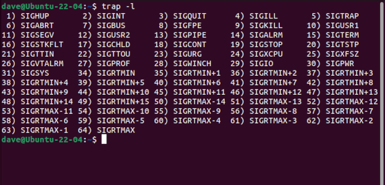
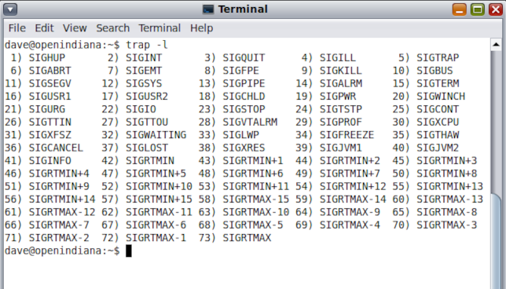
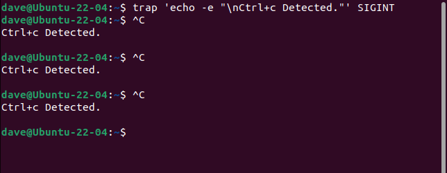
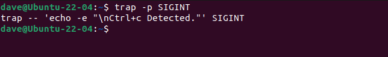
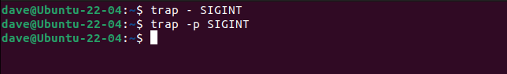
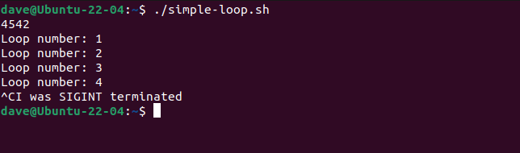
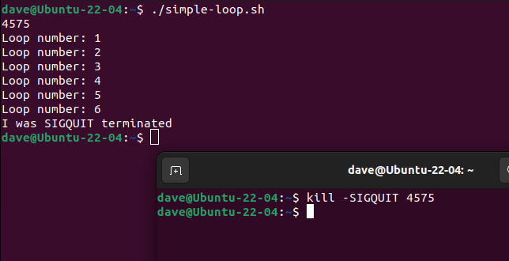
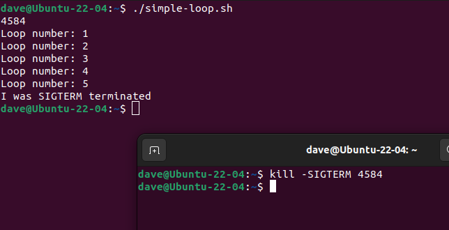
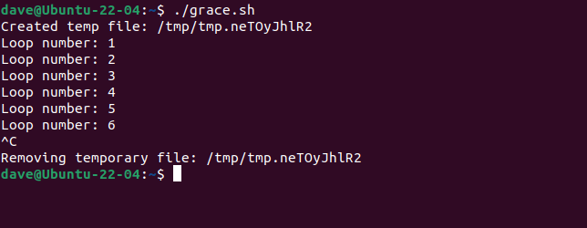
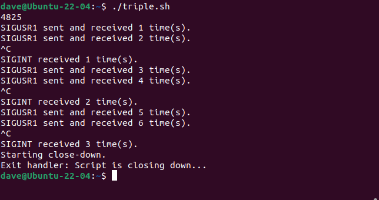

[источник](https://ru.linux-console.net/?p=8335&ysclid=lzo0g99y9d73828512)
# Как использовать сигналы Linux в сценариях Bash

Ядро Linux посылает процессам сигналы о событиях, на которые им нужно реагировать. Хорошо себя зарекомендовавшие скрипты элегантно и надежно обрабатывают сигналы и могут очистить себя, даже если вы нажмете Ctrl+C. Вот как.

## Сигналы и процессы

Сигналы — это короткие, быстрые односторонние сообщения, отправляемые таким процессам, как сценарии, программы и демоны. Они сообщают процессу о том, что произошло. Возможно, пользователь нажал Ctrl+C, или приложение могло попытаться записать в память, к которой у него нет доступа.

Если автор процесса ожидал, что ему может быть отправлен определенный сигнал, он может написать в программе или сценарии подпрограмму для обработки этого сигнала. Такая процедура называется _обработчиком сигнала_. Он ловит или перехватывает сигнал и выполняет какое-то действие в ответ на него.

Как мы увидим, Linux использует множество сигналов, но с точки зрения сценариев существует лишь небольшое подмножество сигналов, которые могут вас заинтересовать. В частности, в нетривиальных сценариях сигналы, сообщающие сценарий для завершения работы должен быть перехвачен (где это возможно) и выполнено корректное завершение работы.

Например, сценариям, которые создают временные файлы или открывают порты брандмауэра, можно дать возможность удалить временные файлы или закрыть порты до их закрытия. Если сценарий просто умирает в момент получения сигнала, ваш компьютер может остаться в непредсказуемом состоянии.

Вот как вы можете обрабатывать сигналы в своих собственных скриптах.

## Знакомьтесь с сигналами

Некоторые команды Linux имеют загадочные имена. Не так команда, которая перехватывает сигналы. Это называется `ловушка`. Мы также можем использовать `trap` с параметром `-l` (список), чтобы показать нам весь список сигналов, которые использует Linux.

trap -l



Хотя наш пронумерованный список заканчивается на 64, на самом деле сигналов 62. Сигналы 32 и 33 отсутствуют. Они не реализованы в Linux. Они были заменены функциями компилятора `gcc` для обработки потоков в реальном времени. Все, от сигнала 34, `SIGRTMIN`, до сигнала 64, `SIGRTMAX`, являются сигналами реального времени.

Вы увидите разные списки в разных Unix-подобных операционных системах. Например, на OpenIndiana присутствуют сигналы 32 и 33, а также множество дополнительных сигналов, в результате чего общее количество сигналов достигает 73.



На сигналы можно ссылаться по имени, номеру или сокращенному имени. Их сокращенное имя — это просто их имя с удаленным начальным «SIG».

Сигналы поднимаются по разным причинам. Если вы можете их расшифровать, их назначение содержится в их названии. Воздействие сигнала относится к одной из нескольких категорий:

- **Завершить:** процесс прекращен.
- **Игнорировать:** сигнал не влияет на процесс. Это только информационный сигнал.
- **Core:** создается файл дампа ядра. Обычно это делается из-за нарушения процесса, например нарушения памяти.
- **Остановить**: процесс остановлен. То есть он _приостанавливается_, а не прекращается.
- **Продолжить**. Сообщает остановленному процессу продолжить выполнение.

Это сигналы, с которыми вы будете сталкиваться чаще всего.

- **SIGHUP**: сигнал 1. Соединение с удаленным хостом, например сервером SSH, неожиданно прервано или пользователь вышел из системы. Сценарий, получивший этот сигнал, может корректно завершить работу или попытаться повторно подключиться к удаленному хосту.
- **SIGINT**: сигнал 2. Пользователь нажал комбинацию клавиш Ctrl+C, чтобы принудительно закрыть процесс, или с сигналом 2 была использована команда `kill`. Технически , это сигнал прерывания, а не сигнал завершения, но прерванный скрипт без обработчика сигнала обычно завершается.
- **SIGQUIT**: сигнал 3. Пользователь нажал комбинацию клавиш Ctrl+D, чтобы принудительно завершить процесс, или была использована команда `kill` с сигналом 3.< /li>
- **SIGFPE**: сигнал 8. Процесс пытался выполнить недопустимую (невозможную) математическую операцию, например деление на ноль.
- **SIGKILL**: сигнал 9. Это эквивалент сигнала гильотины. Вы не можете поймать или проигнорировать это, и это происходит мгновенно. Процесс немедленно завершается.
- **SIGTERM**: сигнал 15. Это более продуманная версия `SIGKILL`. `SIGTERM` также сообщает процессу о завершении, но это может быть перехвачено, и процесс может запустить свои процессы очистки перед закрытием. Это обеспечивает плавное завершение работы. Это сигнал по умолчанию, вызываемый командой `kill`.

## Сигналы в командной строке

Один из способов перехватить сигнал — использовать `trap` с номером или именем сигнала и ответом, который вы хотите получить, если сигнал получен. Мы можем продемонстрировать это в окне терминала.

Эта команда перехватывает сигнал `SIGINT`. Ответом является печать строки текста в окне терминала. Мы используем параметр `-e` (включить escape-последовательности) с `echo`, поэтому мы можем использовать спецификатор формата «`\n`».

trap 'echo -e "\nCtrl+c Detected."' SIGINT



Наша строка текста печатается каждый раз, когда мы нажимаем комбинацию Ctrl+C.

Чтобы узнать, установлена ли ловушка для сигнала, используйте параметр `-p` (вывести ловушку).

trap -p SIGINT



Использование `trap` без параметров делает то же самое.

Чтобы сбросить сигнал в нормальное состояние без захвата, используйте дефис «`-`» и имя захваченного сигнала.
 ```bash
trap - SIGINT

trap -p SIGINT
```




Отсутствие вывода команды `trap -p` означает, что для этого сигнала не установлено прерывание.

## Перехват сигналов в скриптах

Мы можем использовать ту же команду общего формата `trap` внутри скрипта. Этот скрипт перехватывает три разных сигнала: `SIGINT`, `SIGQUIT` и `SIGTERM`.
```bash
#!/bin/bash

trap "echo I was SIGINT terminated; exit" SIGINT
trap "echo I was SIGQUIT terminated; exit" SIGQUIT
trap "echo I was SIGTERM terminated; exit" SIGTERM

echo $$
counter=0

while true
do 
  echo "Loop number:" $((++counter))
  sleep 1
done

```


Три оператора `trap` находятся в верхней части скрипта. Обратите внимание, что мы включили команду `exit` в ответ на каждый из сигналов. Это означает, что скрипт реагирует на сигнал и затем завершает работу.

Скопируйте текст в свой редактор и сохраните его в файле с именем «simple-loop.sh» и сделайте его исполняемым с помощью команды `chmod`. Вам нужно будет сделать это со всеми сценариями в этой статье, если вы хотите следовать на своем собственном компьютере. Просто используйте имя соответствующего скрипта в каждом случае.
```bash
chmod +x simple-loop.sh
```


Остальная часть скрипта очень проста. Нам нужно знать идентификатор процесса скрипта, поэтому у нас есть скрипт, который повторяет это для нас. Переменная `$$` содержит идентификатор процесса скрипта.

Мы создаем переменную с именем `counter` и присваиваем ей нулевое значение.

Цикл `while` будет работать вечно, если его не остановить принудительно. Он увеличивает переменную `counter`, выводит ее на экран и на секунду засыпает.

Запустим скрипт и отправим ему разные сигналы.

./simple-loop.sh



Когда мы нажимаем «Ctrl + C», наше сообщение печатается в окне терминала, и скрипт завершается.

Давайте запустим его снова и отправим сигнал `SIGQUIT` с помощью команды `kill`. Нам нужно сделать это из другого окна терминала. Вам нужно будет использовать идентификатор процесса, который сообщил ваш собственный скрипт.
```bash
./simple-loop.sh

kill -SIGQUIT 4575
```



Как и ожидалось, скрипт сообщает о поступлении сигнала, а затем прекращает работу. И, наконец, чтобы доказать это, мы проделаем это снова с сигналом `SIGTERM`.
```bash
./simple-loop.sh

kill -SIGTERM 4584
```




Мы убедились, что можем перехватывать несколько сигналов в сценарии и реагировать на каждый из них независимо. Шаг, который превращает все это из интересного в полезное, — это добавление обработчиков сигналов.

## Обработка сигналов в скриптах

Мы можем заменить строку ответа на имя функции в вашем скрипте. Затем команда `trap` вызывает эту функцию при обнаружении сигнала.

Скопируйте этот текст в редактор и сохраните его как файл с именем «grace.sh» и сделайте его исполняемым с помощью `chmod`.
```bash
#!/bin/bash

trap graceful_shutdown SIGINT SIGQUIT SIGTERM

graceful_shutdown()
{
  echo -e "\nRemoving temporary file:" $temp_file
  rm -rf "$temp_file"
  exit
}

temp_file=$(mktemp -p /tmp tmp.XXXXXXXXXX)
echo "Created temp file:" $temp_file

counter=0

while true
do 
  echo "Loop number:" $((++counter))
  sleep 1
done
```

Сценарий устанавливает ловушку для трех разных сигналов — `SIGHUP`, `SIGINT` и `SIGTERM` — с помощью одного оператора `trap`. . Ответ представляет собой имя функции `graceful_shutdown()`. Функция вызывается всякий раз, когда принимается один из трех захваченных сигналов.

Сценарий создает временный файл в каталоге «/tmp», используя `mktemp`. Шаблон имени файла — «tmp.XXXXXXXXXX», поэтому имя файла будет «tmp». за которыми следуют десять случайных буквенно-цифровых символов. Имя файла эхом отобразится на экране.

Остальная часть скрипта такая же, как и в предыдущем, с переменной `counter` и бесконечным циклом `while`.

./grace.sh



Когда файлу отправляется сигнал, вызывающий его закрытие, вызывается функция `graceful_shutdown()`. Это удаляет наш единственный временный файл. В реальной ситуации он может выполнить любую очистку, которую требует ваш скрипт.

Кроме того, мы объединили все наши захваченные сигналы вместе и обработали их с помощью одной функции. Вы можете перехватывать сигналы по отдельности и отправлять их в собственные выделенные функции обработчика.

Скопируйте этот текст и сохраните его в файле с именем «triple.sh» и сделайте его исполняемым с помощью команды `chmod` .
```bash
#!/bin/bash

trap sigint_handler SIGINT
trap sigusr1_handler SIGUSR1
trap exit_handler EXIT

function sigint_handler() {
  ((++sigint_count))

  echo -e "\nSIGINT received $sigint_count time(s)."

  if [[ "$sigint_count" -eq 3 ]]; then
    echo "Starting close-down."
    loop_flag=1
  fi
}

function sigusr1_handler() {
  echo "SIGUSR1 sent and received $((++sigusr1_count)) time(s)."
}

function exit_handler() { 
  echo "Exit handler: Script is closing down..."
}

echo $$
sigusr1_count=0
sigint_count=0
loop_flag=0

while [[ $loop_flag -eq 0 ]]; do
  kill -SIGUSR1 $$
  sleep 1
done
```

Мы определяем три ловушки в верхней части скрипта.

- Один перехватывает `SIGINT` и имеет обработчик с именем `sigint_handler()`.
- Второй перехватывает сигнал с именем `SIGUSR1` и использует обработчик с именем `sigusr1_handler()` .
- Ловушка номер три перехватывает сигнал `EXIT`. Этот сигнал поднимается самим скриптом при его закрытии. Установка обработчика сигнала для `EXIT` означает, что вы можете установить функцию, которая всегда будет вызываться при завершении скрипта (если только он не будет уничтожен сигналом `SIGKILL`). Наш обработчик называется `exit_handler()` .

`SIGUSR1` и `SIGUSR2` — это сигналы, которые вы можете отправлять в свои скрипты. То, как вы интерпретируете и реагируете на них, полностью зависит от вас.

Оставив пока в стороне обработчики сигналов, тело скрипта должно быть вам знакомо. Он выводит идентификатор процесса в окно терминала и создает некоторые переменные. Переменная `sigusr1_count` записывает, сколько раз обрабатывался `SIGUSR1`, а `sigint_count` записывает, сколько раз обрабатывался `SIGINT`. Переменная `loop_flag` устанавливается равной нулю.

Цикл `while` не является бесконечным циклом. Цикл прекратится, если для переменной `loop_flag` установлено любое ненулевое значение. Каждое вращение цикла `while` использует `kill` для отправки сигнала `SIGUSR1` этому скрипту, отправляя его идентификатору процесса скрипта. Скрипты могут посылать сигналы сами себе!

Функция `sigusr1_handler()` увеличивает переменную `sigusr1_count` и отправляет сообщение в окно терминала.

Каждый раз, когда принимается сигнал `SIGINT`, функция `siguint_handler()` увеличивает переменную `sigint_count` и выводит ее значение в окно терминала.

Если переменная `sigint_count` равна трем, переменная `loop_flag` устанавливается равной единице, и в окно терминала отправляется сообщение, информирующее пользователя о начале процесса завершения работы.

Поскольку `loop_flag` больше не равен нулю, цикл `while` завершается, и сценарий завершается. Но это действие автоматически вызывает сигнал `EXIT` и вызывается функция `exit_handler()`.

./triple.sh



После трех нажатий Ctrl+C скрипт завершает работу и автоматически вызывает функцию `exit_handler()`.

## Читайте сигналы

Перехватывая сигналы и обрабатывая их в простых функциях-обработчиках, вы можете сделать так, чтобы ваши скрипты Bash убирались за собой, даже если они были неожиданно завершены. Это дает вам более чистую файловую систему. Это также предотвращает нестабильность при следующем запуске сценария и — в зависимости от цели вашего сценария — может даже предотвратить дыры в безопасности.
