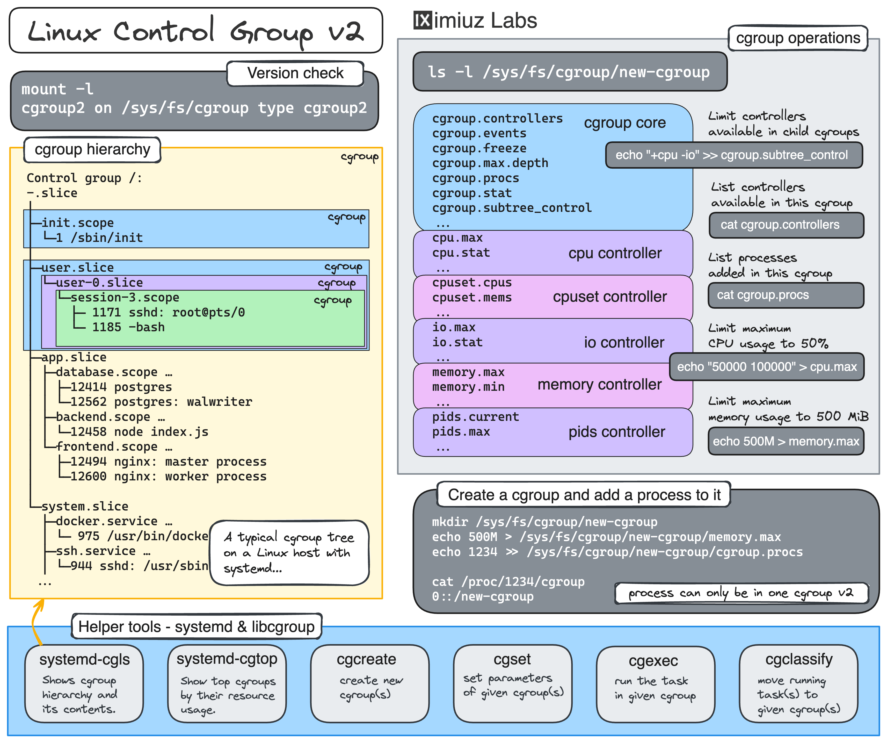

[source](https://labs.iximiuz.com/tutorials/controlling-process-resources-with-cgroups)

# Controlling Process Resources with Linux Control Groups

- [ Configuring a cgroup using cgroupfs](#link_1)
- [ Using systemd-run to run a restricted process](#link_2)
- [ Using systemd-run to run a restricted process](#link_3)
- [ Using a systemd slice to create a "persistent" cgroup](#link_4)
- [ Summarizing](#link_5)
  - [ References](#link_6)

Not a comprehensive guide but a practical example of how to limit process' CPU and RAM consumption using Linux cgroups. The technique may be used to:

- Protect the system from a particularly resource-hungry process
- Ensure fair resource distribution among multiple applications
- Test application performance under constrained resources
- Guarantee resource availability in multi-tenant environments

We will start with creating, configuring, and adding a process to a cgroup using the most basic (and labour-intensive) method - manipulating the virtual filesystem _cgroupfs_. After that, we will see how exactly the same can be done using higher-level tools like libcgroup's [`cgcreate`](https://linux.die.net/man/1/cgcreate)

and [`cgexec`](https://linux.die.net/man/1/cgexec), or systemd's [`systemd-run`](https://www.freedesktop.org/software/systemd/man/systemd-run.html) and [slice units](https://www.freedesktop.org/software/systemd/man/latest/systemd.slice.html)

While the focus will be on Linux-native ways of controlling process resources, the covered techniques are also directly applicable to managing resources of containers and Pods, so the tutorial is also highly relevant for people practicing Docker and Kubernetes.

Examples in this post leverage cgroup v2, but the general idea should also work with cgroup v1.



## Real quick, what is cgroup? <a name="link_1"></a>

From [man7.org page on cgroups](https://man7.org/linux/man-pages/man7/cgroups.7.html)

```
> Control groups, usually referred to as cgroups, are a Linux
  kernel feature which allow processes to be organized into
  hierarchical groups whose usage of various types of resources can
  then be limited and monitored.
```

The only kernel's cgroup interface is a pseudo-filesystem called _cgroupfs_. There is no dedicated system calls to create, modify, or delete cgroups - all cgroup manipulation is done through creating folders and writing to specially named files in the cgroup pseudo-filesystem.

On modern Linux distributions, this pseudo-filesystem is usually mounted at `/sys/fs/cgroup`.

```
mount -l | grep cgroup
```

```
cgroup2 on /sys/fs/cgroup type cgroup2 ...
```

Creating a subfolder in cgroupfs leads to a new cgroup creation:

```
mkdir /sys/fs/cgroup/my_cgroup
```

The folder gets automatically populated with a set of files that can be used to configure the new cgroup:

```
ls /sys/fs/cgroup/my_cgroup
```

```
cgroup.controllers      io.max
cgroup.events           io.stat
cgroup.freeze           memory.current
cgroup.max.depth        memory.events
cgroup.max.descendants  memory.events.local
cgroup.procs            memory.high
cgroup.stat             memory.low
cgroup.subtree_control  memory.max
cgroup.threads          memory.min
cgroup.type             memory.numa_stat
cpu.max                 memory.oom.group
cpu.stat                memory.stat
cpu.weight              memory.swap.current
cpu.weight.nice         memory.swap.events
cpuset.cpus             memory.swap.high
cpuset.cpus.effective   memory.swap.max
cpuset.cpus.partition   pids.current
cpuset.mems             pids.events
cpuset.mems.effective   pids.max
```

💡 The exact set of files depends on the enabled _controllers_ which you can see in the `cgroup.controllers` file. The most commonly used controllers are `cpuset`, `cpu`, `io`, `memory`, `hugetlb`, and `pids`.

💡 Since cgroups are managed via pseudo-filesystem folders and files, granting write access to a certain folder (or its files) can be used to allow non-root users to configure cgroups, including child cgroup creation. If the set of available controllers for a child cgroup needs to be further restricted, it can be done by writing to the parent's `cgroup.subtree_control` file:

```
echo "+cpu +memory -io" > /sys/fs/cgroup/<parent>/cgroup.subtree_control
```

This technique is known as [_cgroup delegation_](https://docs.kernel.org/admin-guide/cgroup-v2.html#delegation)

Higher-level tools like `cgcreate`, `cgexec`, and even `systemd-run` are merely wrappers performing `mkdir`, `write`, and the like calls on the cgroupfs subtree.

Now, let's get our hands dirty and run some experiments using an improvised resource hog program 🧑‍🔬
The program below tries to utilize all available CPUs by starting a busy loop for each core. It also keeps allocating memory in chunks of 10MB every second until the process is terminated.

```go
package main

import (
  "context"
  "fmt"
  "os/signal"
  "runtime"
  "sync"
  "syscall"
  "time"
)

func main() {
  ctx, cancel := signal.NotifyContext(context.Background(), syscall.SIGINT, syscall.SIGTERM)
  defer cancel()

  var wg sync.WaitGroup

  // Allocate all available CPUs
  numCPU := runtime.NumCPU()
  runtime.GOMAXPROCS(numCPU)

  // Start a busy goroutine for each CPU
  for i := 0; i < numCPU; i++ {
    go func() {
      wg.Add(1)
      defer wg.Done()

      fmt.Println("Started a CPU hog")
      for ctx.Err() == nil { /* Busy loop to keep CPU busy */ }
    }()
  }

  // Start allocating memory every second
  const memChunkMiB = 10
  var chunks [][]byte
  go func() {
    wg.Add(1)
    defer wg.Done()

    for ctx.Err() == nil {
      chunk := make([]byte, memChunkMiB*1024*1024)

      // Prevent the memory from being optimized away
      for i := 0; i < len(chunk); i++ {
        chunk[i] = byte(i % 256)
      }
      chunks = append(chunks, chunk)

      fmt.Printf("Allocated %d MB of memory\n", memChunkMiB)
      time.Sleep(1 * time.Second)
    }
  }()

  <-ctx.Done()
  fmt.Println("Received termination signal. Initiating shutdown...")

  wg.Wait()
  fmt.Println("Shutdown complete.")
}
```

## Configuring a cgroup using cgroupfs <a name="link_2"></a>

First, let's create a new cgroup by making a directory in the cgroup filesystem. This will be the group where we can set limits on CPU and memory usage for our resource-hungry process.

```
mkdir /sys/fs/cgroup/hog_pen
```

Next, we'll set limits on CPU and memory usage. Let's say we want to limit the CPU usage to 50% and the memory usage to 100MB.

To limit CPU usage, we'll write the `<cpu_quota>` and `<cpu_period>` values to the `cpu.max` file:

```
echo "50000 100000" > /sys/fs/cgroup/hog_pen/cpu.max
```

Here, `50000` is the maximum allowed CPU time per period (in microseconds), and `100000` is the period duration. This effectively limits the CPU usage to 50%.

💡 On multi-core systems, the maximum CPU usage can be above 100%. For instance, on a machine with 2 cores, specifying `200000 100000` is perfectly valid.

To limit memory usage, we'll write to the `memory.max` file:

```
echo "100M" > /sys/fs/cgroup/hog_pen/memory.max
```

Now, let's start the resource-hungry process:

terminal 1

```
~/hog
```

The above process is not yet constrained by the cgroup limits we set. To move it to the `hog_pen` cgroup, you need to write its PID to the `cgroup.procs` file.

Here is how you can do it (from a separate terminal tab):

terminal 2

```
HOG_PID=$(pgrep -xo hog)

echo ${HOG_PID} >> /sys/fs/cgroup/hog_pen/cgroup.procs
```

Alternatively, you can use the `cgexec` command to start the `hog` process in the `hog_pen2` cgroup right away:

```
cgexec -g cpu,memory:hog_pen2 ~/hog
```

Similarly to the `rmdir` trick, you can use the `cgdelete` command to remove the `hog_pen2` cgroup when it's no longer needed:

```
cgdelete -g cpu,memory:/hog_pen2
```

## Using systemd-run to run a restricted process <a name="link_3"></a>

As it usually happens with systemd, it wants to control every aspect of your ~~life~~ system, and resource management is no exception.

The `systemd-run` command provides a convenient way to launch processes as background services, possibly with the specified resource constraints. For example, to limit CPU and memory usage of a process, you can run:

```
systemd-run -u hog -p CPUQuota=50% -p MemoryMax=100M ~/hog
```

This command will create a transient service unit `hog.service` with the specified resource limits.

## Using systemd-run to run a restricted process <a name="link_4"></a>

As it usually happens with systemd, it wants to control every aspect of your ~~life~~ system, and resource management is no exception.

The `systemd-run` command provides a convenient way to launch processes as background services, possibly with the specified resource constraints. For example, to limit CPU and memory usage of a process, you can run:

```
systemd-run -u hog -p CPUQuota=50% -p MemoryMax=100M ~/hog
```

This command will create a transient service unit `hog.service` with the specified resource limits.
When the background `hog` process reaches the specified memory limit, it will be terminated by the OOM killer.

😎 **Pro tip**: `systemd-run` automatically clears transient units for succeeded runs. However, transient units created by failed one-off runs are not cleared automatically. To "garbage-collect" these failed units, use the `systemd-run` command with the `-G|--collect` flag.

Alternatively, you can manually unload all failed units by running `systemctl reset-failed`. Now you know what to do if you see an error like this:

```
Failed to start transient service unit:
Unit <name>.service was already loaded or has a fragment file.
```

You can see the just created cgroup (and all the other cgroups on your system) using `systemd-cgls`:

```
systemd-cgls --all
```

Additionally, you can use the `systemd-cgtop` command to see the top cgroups by their resource usage:

```
systemd-cgtop
```

💡 **Interesting fact**: On systemd-based Linux distros, it's usually a good idea to rely solely on systemd for cgroup manipulations. Since systemd launches its services in dedicated cgroup "slices", it becomes the de facto manager of the cgroupfs filesystem. Transitively, this means that software like containerd, Docker, and Kubernetes will typically try to avoid using cgroupfs directly and instead will leverage systemd as a cgroup "driver." See [this](https://github.com/containerd/containerd/issues/7319)
and [this](https://kubernetes.io/docs/setup/production-environment/container-runtimes/#cgroup-drivers)
for more.

## Using a systemd slice to create a "persistent" cgroup <a name="link_5"></a>

In the above example, `systemd-run` created a transient cgroup that is automatically cleaned up when the target process exits. If you want to create a cgroup that outlives the process and even survives a full system reboot, you can use a systemd _slice unit_.

First, create a new slice file in `/etc/systemd/system/`:

```
cat <<EOF > /etc/systemd/system/hog_pen.slice
[Slice]
CPUQuota=50%
MemoryMax=100M
EOF
```

💡 You can use the `systemctl daemon-reload` command to force systemd to reload its unit files.

And now you can place an arbitrary number of processes in this slice:

```
systemd-run -u hog1 --slice=hog_pen.slice ~/hog
systemd-run -u hog2 --slice=hog_pen.slice ~/hog
```

Every process in the `hog_pen.slice` slice will be placed in its own child cgroup, which inherits the resource limits set for the slice. Thus, the cumulative CPU and memory usage of all processes in the `hog_pen.slice` slice will be limited to 50% CPU and 100MB of memory.

Another great thing about systemd slices is that you can use them to control resources of Docker containers. This is especially useful if you need to tweak a cgroup controller for which there's no `docker run` flag (e.g., `memory.oom.group`), or when you want to place multiple Docker containers in the same cgroup, emulating a Kubernetes Pod:

```
docker run -d --name web --cgroup-parent=hog_pen.slice nginx
docker run -d --name rdb --cgroup-parent=hog_pen.slice redis
```

```
Control group /:
-.slice
├─hog_pen.slice
│ ├─docker-98684060c21bbc18e41f31926265cb092693a20fc169498e48cc2500c19bb646.scope …
│ │ ├─4156 nginx: master process nginx -g daemon off;
│ │ ├─4208 nginx: worker process
│ │ └─4209 nginx: worker process
│ └─docker-c9948bd490491b2719a8614146fb401535f6b1268b07cb430581973f7ea586b7.scope …
│   └─4292 redis-server *:6379
```

## Summarizing <a name="link_6"></a>

In this tutorial, we explored various methods to manage process resources using Linux cgroups. We started with the basics of configuring cgroups using the cgroupfs, then moved on to using the libcgroup tools for more convenience, and finally leveraged systemd for both transient and persistent resource management. These techniques can help ensure fair resource distribution, protect your system from resource-hungry processes, and even test application performance under constrained conditions.

Feel free to experiment with these methods and adapt them to your specific needs. Happy resource managing!

### References <a name="link_7"></a>

- [Control Group v2 - The Linux kernel user's and administrator's guide](https://docs.kernel.org/admin-guide/cgroup-v2.html)

- [cgroups(7) - Linux man pages](https://man7.org/linux/man-pages/man7/cgroups.7.html)

- [Using libcgroup Tools - Red Hat Enterprise Linux Documentation](https://docs.redhat.com/en/documentation/red_hat_enterprise_linux/7/html/resource_management_guide/chap-using_libcgroup_tools)

- [cgroups - ArchWiki](https://wiki.archlinux.org/title/Cgroups)

- [systemd-run - Run programs in transient scope and service units](https://www.freedesktop.org/software/systemd/man/latest/systemd-run.html)

- [systemd.slice - Slice unit configuration](https://www.freedesktop.org/software/systemd/man/latest/systemd.slice.html)
