[источник](https://hackware.ru/?p=12514)

- [ Модули ядра Linux](#link_1)
  - [ Что такое модули ядра ](#link_2)
  - [ Получение информации о модулях ](#link_3)
  - [ Автоматическая загрузка модуля с помощью systemd ](#link_4)
  - [ Ручная обработка модуля (включение и отключение модулей и драйверов) ](#link_5)
    - [ Как задействовать драйвер без его установки ](#link_6)
  - [ Запрет на включение модулей (чёрный список модулей) ](#link_7)
    - [ Как заблокировать все сетевые интерфейсы на компьютере ](#link_8)
    - [ Как надёжно выключить веб камеру ](#link_9)
    - [ Как отключить Bluetooth без возможности подключения ](#link_10)
  - [ Настройка параметров модуля ](#link_11)
  - [ Псевдонимы ](#link_12)
  - [ Ошибки при работе с модулями ](#link_13)
    - [ Модули не загружаются ](#link_14)
    - [ modprobe: ERROR: could not insert '…': Unknown symbol in module, or unknown parameter (see dmesg) ](#link_15)
    - [ modprobe: FATAL: Module … not found in directory /lib/modules/… ](#link_16)

# Модули ядра Linux <a name="link_1"></a>

---

## Что такое модули ядра <a name="link_2"></a>

Модули ядра — это фрагменты кода, которые могут быть загружены и выгружены в ядро по требованию. Они расширяют функциональность ядра без необходимости перезагрузки системы. Модуль может быть настроен как встроенный в ядро или загружаемый во время работы операционной системы.

Примеры модулей ядра — это драйверы различных устройств.

В этой статье вы узнаете:

- как узнать, какие модули ядра запущены (загружены)
- как узнать, какой используется драйвер для указанного устройства и как получить информацию о данном драйвере
- как надёжно отключит устройства (например, сетевые карты, веб камеры и другие), чтобы их невозможно было включить и использовать
- как попробовать новый драйвер без его установки в систему

## Получение информации о модулях <a name="link_3"></a>

Модули храняться в директории **/usr/lib/modules/ВЫПУСК_ЯДРА**. Текущую папку с модулями можно узнать командой:

```
echo /lib/modules/$(uname -r)
```

Пример вывода:

```
 /lib/modules/5.6.14-arch1-1
```

Имена модулей часто содержат символы подчёркивания (**\_**) или дефисы (**-**); при этом данные символы являются взаимозаменяемыми в командах **modprobe** и в конфигурационных файлах в директории **/etc/modprobe.d/**.

Команда **lsmod** показывает драйверы и другие модули, которые загружены в данный момент. Чтобы увидеть, какие модули загружены в данный момент, выполните:

```
 lsmod
```

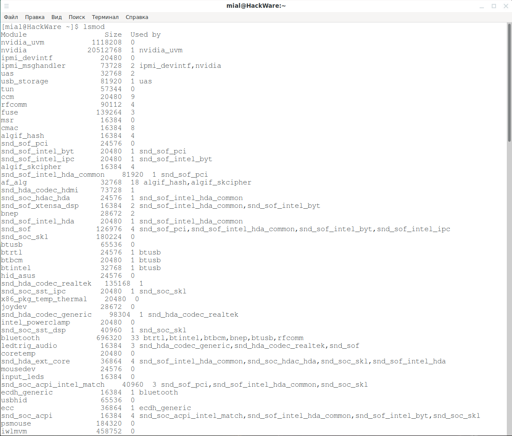

или команду

```
 kmod list
```

На самом деле, это одно и то же. Информация считывается из **/proc/modules** и данные команды только выводят её в более понятном для восприятия виде.

Для показа информации о модуле используется команда **modinfo**:

```
 modinfo ИМЯ_МОДУЛЯ
```

Если вы получили ошибку:

```
 bash: modinfo: команда не найдена
```

То запустите **modinfo** с [sudo](https://hackware.ru/?p=11183).

К примеру, чтобы узнать информацию о модуле **iwlwifi**:

```
 modinfo iwlwifi
```

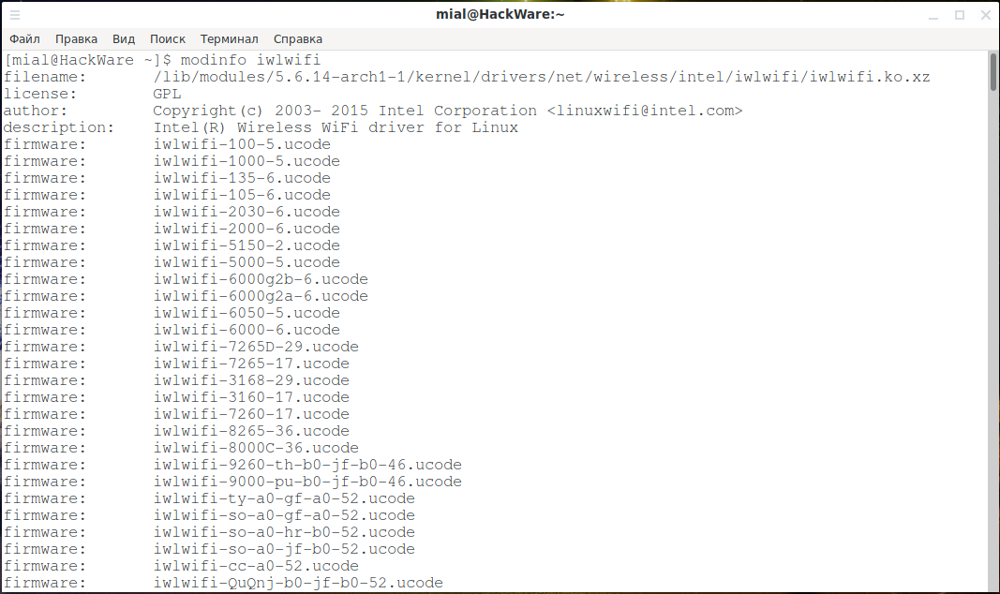

Как понять вывод modinfo

Вывод **modinfo** обширен и содержит много информации.

Строка «**filename**» показывает полный путь до файла модуля.

В строке «**author**» содержится информация о создателе модуля, например, «Copyright(c) 2003- 2015 Intel Corporation <linuxwifi@intel.com>»

В строке «**description**» описание модуля, например, «Intel(R) Wireless WiFi driver for Linux».

Рассмотрим, как интерпретировать строки

- **firmware**
- **alias**
- **intree**
- **vermagic**

на примере модуля **i915**

```
 modinfo i915
```

Фрагмент вывода:

```
filename:       /lib/modules/4.2.0-1-amd64/kernel/drivers/gpu/drm/i915/i915.ko
license:        GPL and additional rights
description:    Intel Graphics
author:         Intel Corporation
[...]
firmware:       i915/skl_dmc_ver1.bin
alias:          pci:v00008086d00005A84sv*sd*bc03sc*i*
[...]
depends:        drm_kms_helper,drm,video,button,i2c-algo-bit
intree:         Y
vermagic:       4.2.0-1-amd64 SMP mod_unload modversions
parm:           modeset:Use kernel modesetting [KMS] (0=DRM_I915_KMS from .config, 1=on, -1=force vga console preference [default]) (int)
[...]
```

**firmware:**

```
 firmware:       i915/skl_dmc_ver1.bin
```

Многим устройствам для правильной работы нужны две вещи: драйвер и прошивка. Драйвер запрашивает прошивку из файловой системы в **/lib/firmware**. Это специальный файл, необходимый для аппаратного обеспечения, это не бинарный файл. Затем дайвер делает всё, что нужно для загрузки прошивки в устройство. Прошивка выполняет программирование оборудования внутри устройства.

**alias:**

```
 alias:          pci:v00008086d00005A84sv*sd*bc03sc*i*
```

Эту запись можно разделить на части символами двоеточия (**:**)

- **pci**: тип устройства, pci или usb
- **v00008086**: **v** обозначает идентификатор поставщика, он идентифицирует производителя оборудования. Этот список поддерживается Специальной группой интересов PCI ([PCI Special Interest Group](https://pcisig.com/)). Номер 0x8086 означает «Корпорация Intel».
- **d00005A84**: **d** обозначает идентификатор устройства, выбранный производителем. Этот идентификатор обычно соединяется с идентификатором поставщика, чтобы создать уникальный 32-битный идентификатор для аппаратного устройства. Официального списка нет.
- **sv\***, **sd\***: версия поставщика подсистемы и версия устройства подсистемы для дальнейшей идентификации устройства (**\*** указывает, что оно будет соответствовать чему угодно)
- **bc03**: базовый класс. Это определяет, что это за устройство; Интерфейс IDE, контроллер Ethernet, контроллер USB, … **bc03** означает контроллер дисплея. Вы можете заметить их из вывода **lspci**, потому что **lspci** сопоставляет число и класс устройства.
- **sc\***: подкласс базового класса.
- **i\***: интерфейс

**intree:**

```
 intree:         Y
```

Все модули ядра начинают свои разработки как вне дерева. Как только модуль принимается для включения, он становится модулем внутри дерева. Модули без этого флага (установленного в **N**) могут испортить ядро.

**vermagic:**

vermagic:       4.2.0-1-amd64 SMP mod_unload modversions

При загрузке модуля строка **vermagic** проверяются на совпадение с текущей версией ядра. Если они не совпадают, вы получите ошибку, и ядро откажется загружать модуль. Вы можете преодолеть это, используя в modprobe флаг **--force**. Естественно, эти проверки существуют для вашей защиты, поэтому использование этой опции опасно.

Для вывода списка опций, установленных для загруженного модуля:

```
 systool -v -m ИМЯ_МОДУЛЯ
```

Если вы получили ошибку:

```
 bash: systool: команда не найдена
```

То установите пакет **sysfsutils**.

Пример вывода для модуля iwlwifi:

```
 systool -v -m iwlwifi
```

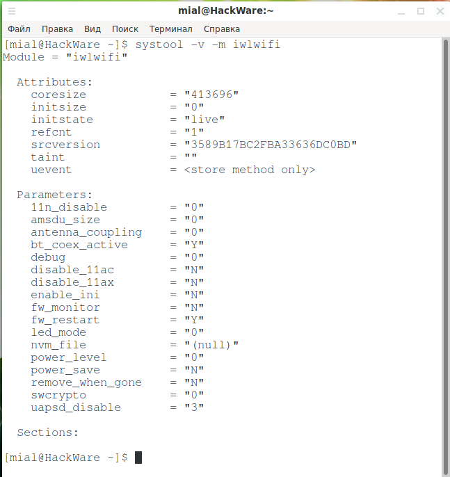

Для отображения полной конфигурации всех модулей:

```
modprobe -c | less
```

Чтобы отобразить конфигурацию определённого модуля:

```
 modprobe -c | grep ИМЯ_МОДУЛЯ
```

Чтобы перечислить зависимости модуля (или псевдонима), включая сам модуль:

```
 modprobe --show-depends ИМЯ_МОДУЛЯ
```

## Автоматическая загрузка модуля с помощью systemd <a name="link_4"></a>

Сегодня загрузка всех необходимых модулей выполняется **udev** автоматически, поэтому нет необходимости помещать модули в какой-либо файл конфигурации. Однако в некоторых случаях вам может потребоваться загрузить дополнительный модуль во время процесса загрузки компьютера или добавить в чёрный список другой модуль для правильной работы компьютера.

Модули ядра могут быть явно перечислены в файлах в **/etc/modules-load.d/** для [systemd](https://hackware.ru/?p=5460), чтобы загрузить их во время включения компьютера. Каждый файл конфигурации имеет имя в стиле **/etc/modules-load.d/<program>.conf**. Файлы конфигурации просто содержат список имён модулей ядра для загрузки, разделённых символами новой строки. Пустые строки и строки, чей первый непробельный символ - **#** (решётка) или **;** (точка с запятой) игнорируются

Пример файла **/etc/modules-load.d/virtio-net.conf**

```
# Загрузить virtio_net.ko при включении компьютера
virtio_net
```

Кроме указанной директории, также считываются файлы конфигурации из **/run/modules-load.d/\*.conf** и **/usr/lib/modules-load.d/\*.conf**.

Обратите внимание, что обычно лучше полагаться на автоматическую загрузку модулей с помощью идентификаторов PCI, USB-идентификаторов, идентификаторов DMI или аналогичных триггеров, закодированных в самих модулях ядра, вместо статической конфигурации, подобной этой. Фактически, большинство современных модулей ядра уже подготовлены для автоматической загрузки.

## Ручная обработка модуля (включение и отключение модулей и драйверов) <a name="link_5"></a>

Модули ядра обрабатываются инструментами, предоставляемыми пакетом **kmod**. Вы можете использовать эти инструменты вручную.

Примечание. Если вы обновили ядро, но ещё не перезагрузили компьютер, **modprobe** завершится с ошибкой без сообщения об ошибке и выйдет с кодом 1, поскольку путь **/usr/lib/modules/$(uname -r)/** больше не существует.

Чтобы загрузить модуль применяется команда вида:

```
 sudo modprobe ИМЯ_МОДУЛЯ
```

Чтобы загрузить модуль по имени файла (то есть, тот, который не установлен в **/usr/lib/modules/$(uname -r)/**):

```
 sudo insmod ИМЯ_ФАЙЛА [АРГУМЕНТЫ]
```

Для выгрузки (выключения) модуля:

```
 sudo modprobe -r ИМЯ_МОДУЛЯ
```

Или альтернативная команда:

```
 sudo rmmod ИМЯ_МОДУЛЯ
```

### Как задействовать драйвер без его установки <a name="link_6"></a>

Рассмотрим реальный пример, когда может пригодиться запуск драйвера из файла.

Возьмём в качестве примера [репозиторий драйверов для чипсета RTL8812AU/21AU и RTL8814AU](https://github.com/aircrack-ng/rtl8812au).

Эти драйвера предназначены для работы таких современных карт с поддержкой стандарта Wi-Fi AC как:

- [Alfa AWUS1900](http://rover.ebay.com/rover/1/711-53200-19255-0/1?ff3=4&pub=5575132165&toolid=10001&campid=5338412216&customid=&mpre=https%3A%2F%2Fwww.ebay.com%2Fsch%2Fi.html%3F_from%3DR40%26_trksid%3Dm570.l1313%26_nkw%3DAlfa%2BAWUS1900%26_sacat%3D0) (чипсет: Realtek RTL8814AU)
- [TRENDnet TEW-809UB](http://rover.ebay.com/rover/1/711-53200-19255-0/1?ff3=4&pub=5575132165&toolid=10001&campid=5338412216&customid=&mpre=https%3A%2F%2Fwww.ebay.com%2Fsch%2Fi.html%3F_from%3DR40%26_trksid%3Dm570.l1313%26_nkw%3DTRENDnet%2BTEW-809UB%26_sacat%3D0) (чипсет: Realtek RTL8814AU)
- [ASUS USB-AC68](http://rover.ebay.com/rover/1/711-53200-19255-0/1?ff3=4&pub=5575132165&toolid=10001&campid=5338412216&customid=&mpre=https%3A%2F%2Fwww.ebay.com%2Fsch%2Fi.html%3F_from%3DR40%26_trksid%3Dm570.l1313%26_nkw%3DASUS%2BUSB-AC68%26_sacat%3D0) (чипсет: Realtek RTL8814AU)
- [Alfa AWUS036ACH](http://rover.ebay.com/rover/1/711-53200-19255-0/1?ff3=4&pub=5575132165&toolid=10001&campid=5338412216&customid=&mpre=https%3A%2F%2Fwww.ebay.com%2Fsch%2Fi.html%3F_from%3DR40%26_trksid%3Dm570.l1313%26_nkw%3DAlfa%2BAWUS036ACH%26_sacat%3D0) (чипсет: Realtek RTL8812AU)
- [Alfa AWUS036AC](http://rover.ebay.com/rover/1/711-53200-19255-0/1?ff3=4&pub=5575132165&toolid=10001&campid=5338412216&customid=&mpre=https%3A%2F%2Fwww.ebay.com%2Fsch%2Fi.html%3F_from%3DR40%26_trksid%3Dm570.l1313%26_nkw%3DAlfa%2BAWUS036AC%26_sacat%3D0) (чипсет: Realtek RTL8812AU)
- [ASUS USB-AC56](http://rover.ebay.com/rover/1/711-53200-19255-0/1?ff3=4&pub=5575132165&toolid=10001&campid=5338412216&customid=&mpre=https%3A%2F%2Fwww.ebay.com%2Fsch%2Fi.html%3F_from%3DR40%26_trksid%3Dm570.l1313%26_nkw%3DASUS%2BUSB-AC56%26_sacat%3D0) (чипсет: Realtek RTL8812AU)

Эти драйвера поддерживают режим монитора и беспроводную инъекцию, то есть подходят для аудита безопасности Wi-Fi сетей на 2.4 и 5 Ghz, в том числе с поддержкой Wi-Fi стандарта AC.

В принципе, в репозиториях Kali Linux уже имеется данный драйвер:

```
 apt show realtek-rtl88xxau-dkms
```

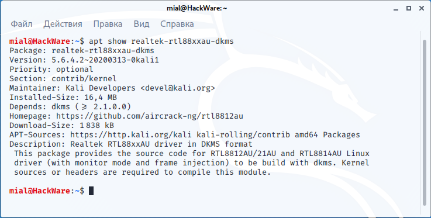

Но его версия 5.6.4. Но уже доступна [версия 5.7.0](https://github.com/aircrack-ng/rtl8812au/tree/v5.7.0). Предположим, мы хотим попробовать версию 5.7.0 без установки её в систему.

Итак, удаляем версию из репозитория (если она была установлена)

```
 sudo apt remove realtek-rtl88xxau-dkms
```

Проверим, что модуль не загружен:

```
 sudo lsmod | grep 88XXau
```

И при попытке его загрузить возникает ошибка:

```
 sudo modprobe 88XXau
```

модуль не найден:

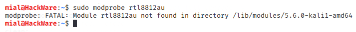

```
 modprobe: FATAL: Module 88XXau not found in directory /lib/modules/5.6.0-kali1-amd64
```

Или такая ошибка:

```
 modprobe: ERROR: could not insert '88XXau': Unknown symbol in module, or unknown parameter (see dmesg)
```

То есть, неизвестный символ в модуле. Суть такая же — модуль не найден, но ранее существовал, поэтому от него остались упоминания в списках зависимостей.

Установим зависимости, необходимые для компиляции данного драйвера:

```
 sudo apt install build-essential bc libelf-dev
```

Клонируем репозиторий — обратите внимание на использование опции **-b** с которой указана интересующая нас ветка (в данном случае название ветки совпадает с версией драйвера):

```
 git clone https://github.com/aircrack-ng/rtl8812au -b v5.7.0
```

Компилируем, но не делаем установку, поскольку мы в принципе не хотим устанавливать этот модуль:

```
cd rtl8812au
make
```

У нас есть два способа загрузить (включить) модуль — с помощью **insmod** или с помощью команды **modprobe**. Команда **insmod** удобнее, т. к. можно указать скомпилированный файл драйвера, а команда **modprobe** лучше обрабатывает зависимости, поэтому рассмотрим оба варианта.

Загрузка модуля без установки (используя insmod)

Для включения модуля из файла используйте команду вида:

```
 sudo insmod ИМЯ_ФАЙЛА [АРГУМЕНТЫ]
```

Файлы модулей имеют расширение **.ko**, в нашем случае имя файла **88XXau.ko**, поэтому команда следующая:

```
 sudo insmod ./88XXau.ko
```

Проверяем, был ли загружен модуль:

```
 sudo lsmod | grep 88XXau
```

Вывод:

```
88XXau               3067904  0
cfg80211              864256  1 88XXau
usbcore               315392  6 ohci_hcd,ehci_pci,usbhid,ehci_hcd,ohci_pci,88XXau
```

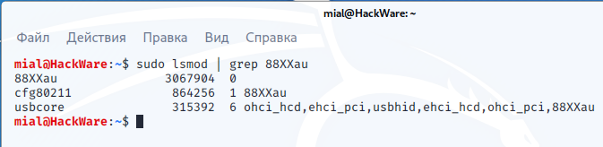

Первая строка показывается, что модуль **88XXau** загружен, а в последующих строках показаны модули, которые использует 88XXau (то есть которые являются для него зависимостями).

Загрузка модуля без установки (используя modprobe)

Второй вариант чуть более сложный в настройке, но для загрузки модуля не нужно указывать полный путь до файла драйвера.

Выгрузим модуль, если он был загружен ранее:

```
 sudo rmmod 88XXau
```

Теперь мы сделаем так, что система будет думать, что модуль установлен, хотя на самом это не так. Для этого мы создадим символическую ссылку от файла **.ko** в папку **/lib/modules/uname -r**:

```
 sudo ln -s /ПУТЬ/ДО/МОДУЛЬ.ko /lib/modules/$(uname -r)
```

В нашем случае для этого нужно выполнить такую команду:

```
 sudo ln  -s  pwd  /88XXau.ko /lib/modules/$(uname -r)
```

Обновим список зависимостей всех модулей (кстати, ключ **-a** в следующей команде можно пропускать, т.к. он предполагается по умолчанию):

```
 sudo depmod -a
```

Теперь для загрузки модуля можно использовать обычную команду **modprobe**:

```
 sudo modprobe 88XXau
```

Проверим версию модуля:

```
 sudo modinfo 88XXau
```

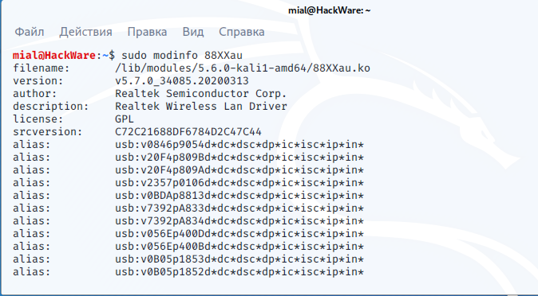

Обратите внимание на строки:

```
filename:       /lib/modules/5.6.0-kali1-amd64/88XXau.ko
version:        v5.7.0_34085.20200313
```

Используется версия v5.7.0 — именно этого мы и добивались.

Описанные методы запуска модулей подходят для единоразового или эпизодического запуска драйверов. Для постоянного использования рекомендуется выполнить нормальную установку модуля, в этом случае он будет поддерживать DKMS.

DKMS

Драйверы можно установить с помощью DKMS. Это система, которая автоматически перекомпилирует и устанавливает модуль ядра при установке или обновлении нового ядра. Чтобы использовать DKMS, установите пакет **dkms**.

С помощью DKMS устанавливаются драйверы из официальных репозиториев. Также с помощью DKMS можно установить и драйверы из прочих репозиториев (например, rtl8812au, который чуть выше был взять в качестве примера, это поддерживает) — для этого следуйте официальным инструкциям по установке от разработчиков, а описанный чуть выше метод запуска драйвера без установки предназначен для тестирования.

## Запрет на включение модулей (чёрный список модулей) <a name="link_7"></a>

Чёрный список в контексте модулей ядра — это механизм, предотвращающий загрузку модуля ядра. Это может быть полезно, если, например, связанное оборудование не требуется или если загрузка этого модуля вызывает проблемы: например, могут быть два модуля ядра, которые пытаются управлять одним и тем же компонентом оборудования, и загрузка их вместе приведёт к конфликту.

Использование файлов в **/etc/modprobe.d/**

Создайте файл **.conf** внутри **/etc/modprobe.d/** и добавьте строку для каждого модуля, который вы хотите добавить в черный список, используя ключевое слово **blacklist**. Например, если вы хотите запретить загрузку модуля **pcspkr**, создайте файл **/etc/modprobe.d/nobeep.conf** и добавьте в него строку:

```
 blacklist pcspkr
```

Некоторые модули загружаются как часть initramfs. То есть можно выделить модули, которые:

- загружаются из файлов **.ko**
- загружаются как часть initramfs (initial ramdisk)

Для запрета загрузки модулей первого типа (загружаемые из файлов **.ko**) достаточно внести запись об этом модуле в файл **/etc/modprobe.d/\*.conf** с директивой **blacklist**.

Для модулей второго типа (загружаемые как часть initramfs), кроме создания конфигурационного файла, также необходимо пересоздать initramfs.

Примечание: initramfs (initial ramdisk) — это начальная среда ramdisk для загрузки ядра Linux. Начальный ramdisk — это, по сути, очень маленькая среда (раннее пользовательское пространство), которая загружает различные модули ядра и настраивает необходимые вещи перед передачей управления init. Это позволяет, например, иметь зашифрованные корневые файловые системы и корневые файловые системы на программном массиве RAID.

Примечание. Команда **blacklist** внесёт модуль в чёрный список, чтобы он не загружался автоматически. Но при этом модуль может быть загружен, если от него зависит другой модуль, не включенный в чёрный список, а также по прежнему можно загрузить модуль вручную. Тем не менее есть обходной путь для этого поведения; Команда **install** указывает **modprobe** запускать пользовательскую команду вместо того, чтобы как обычно вставлять модуль в ядро, поэтому вы можете принудительно заставить модуль всегда не загружаться с помощью рассмотренной далее конструкции. Допустим, вы создали файл **/etc/modprobe.d/blacklist.conf** чтобы заблокировать загрузку модуля **ИМЯ_МОДУЛЯ**. Чтобы это сделать надёжно, добавьте в этот файл:

```
blacklist ИМЯ_МОДУЛЯ
install ИМЯ_МОДУЛЯ /bin/true
```

Это надёжно заблокирует загрузку указанного модуля, а также любого другого, зависящего от него.

Как пересоздать initramfs для блокировки модулей

Если вы блокируете модули, которые загружаются из initramfs, то после их добавления в файл **/etc/modprobe.d/\*.conf**, необходимо пересоздать initramfs.

На Debian, Kali Linux, Linux Mint, Ubuntu и их производных это делается так:

```
sudo update-initramfs -u
sudo reboot
```

В Arch Linux, BlackArch и их производных это делается так:

```
sudo mkinitcpio -g /boot/initramfs-linux.img -k /boot/vmlinuz-linux
```

В Arch Linux команда

```
mkinitcpio -M
```

распечатает все автоматически обнаруженные модули: чтобы предотвратить загрузку некоторых из этих модулей initramfs, внесите их в чёрный список в файле **.conf** в **/etc/modprobe.d**, и он будет добавлен хуком **modconf** во время генерации образа. Запуск

```
mkinitcpio -v
```

выведет список всех модулей, задействованных различными хуками (например, хук filesystems, хук block и т. д.).

Блокировка модулей в начале загрузки Linux (отключение модулей в командной строке ядра)

Это может быть очень полезно, если неисправный модуль делает невозможным загрузку вашей системы. Вы можете занести в чёрный список модули в меню загрузчика. Просто добавьте

```
module_blacklist=ИМЯ-МОДУЛЯ1,ИМЯ-МОДУЛЯ2,ИМЯ-МОДУЛЯ3
```

в строку с параметрами загрузки ядра.

Примеры редактирования параметров загрузки ядра для популярных дистрибутивов вы найдёте в статье «[Как в Linux сбросить забытый пароль входа](https://hackware.ru/?p=3801)». Также смотрите статью «[Как изменить параметры загрузки Linux в UEFI](https://hackware.ru/?p=6574)».

Примечание. Если вы заносите в чёрный список более одного модуля, имейте в виду, что они разделены только запятыми. Пробелы или что-либо ещё могут нарушить синтаксис.

Рассмотрим практические примеры, когда пользователю может понадобиться блокировать загрузку модулей ядра.

### Как заблокировать все сетевые интерфейсы на компьютере <a name="link_8"></a>

Предположим, необходимо, чтобы на компьютере была заблокирована любая сетевая активность, то есть и проводные, и беспроводные сети. Существует команда **rfkill**, но она предназначена для блокировки только беспроводных сетей. Поэтому найдём другой способ.

Алгоритм действий следующий:

1. Мы определим, какие драйверы используются сетевыми устройствами
2. Заблокируем эти драйверы

Чтобы узнать, какие драйверы задействованы в Linux для работы сетевых карт, выполните команду:

```
 sudo lshw -C network
```

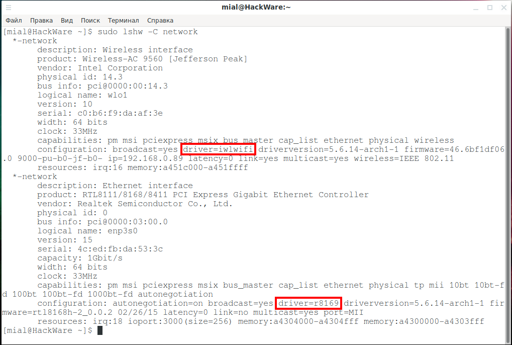

Строки «**configuration:**» содержат информацию о драйверах. Для беспроводной карты это «driver=**iwlwifi**», а для проводного сетевого интерфейса это «driver=**r8169**».

Создаём файл **/etc/modprobe.d/block-network.conf** и добавляем в него:

```
blacklist iwlwifi
install iwlwifi /bin/true
blacklist r8169
install r8169 /bin/true
```

Так выглядит настройка сети в нормальном состоянии, виден проводной и беспроводной адаптеры:

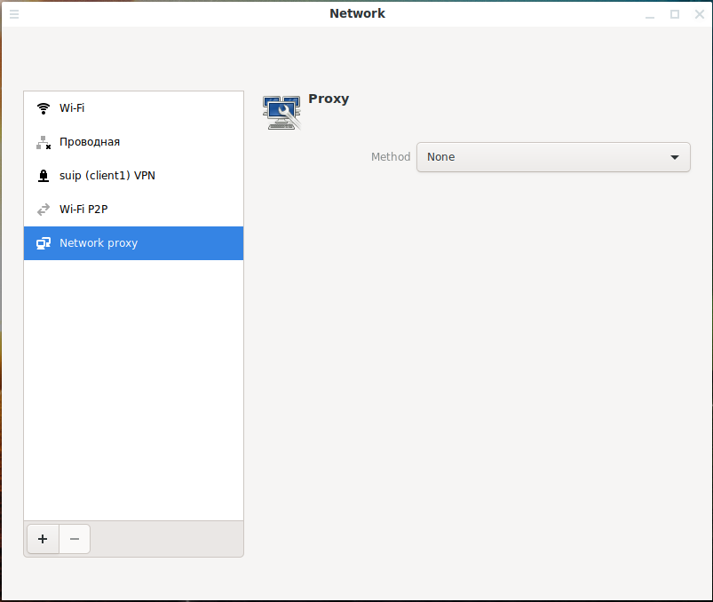

После перезагрузки невозможно будет включить сеть, поскольку компьютер не сможет использовать сетевые интерфейсы без драйверов:

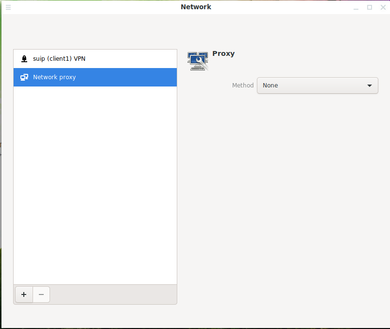

При попытке загрузить модули вручную, например:

```
sudo modprobe iwlwifi
```

Эти модули не будут загружаться благодаря команде **install**.

Вы не сможете включить любую сеть вплоть до удаления файла **/etc/modprobe.d/block-network.conf** и перезагрузки. Тем не менее при подключении других сетевых адаптеров, они будут использоваться. Данный способ надёжно защитит от случайного использования сети при условии, что вы контролируете подключение новых физических устройств к компьютеру.

### Как надёжно выключить веб камеру <a name="link_9"></a>

На некоторых новых моделях ноутбуков веб камеру можно закрыть шторкой — на тот случай, если вы опасаетесь, что хакер может взломать ваш компьютер и следить за вами.

Сейчас мы научимся отключать драйвер веб камеры, чтобы её невозможно было использовать.

Даже если у вас ноутбук, скорее всего, веб камера подключена внутри корпуса к USB хабу, то есть это USB устройство. Вывести список USB устройств в системе можно командой:

```
lsusb
```

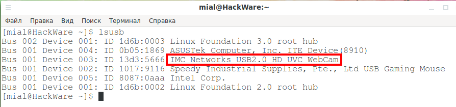

Обратите внимание на IMC Networks USB2.0 HD UVC WebCam в приведённом списке — это и есть веб камера ноутбука.

Чтобы определить драйверы, которые нужны для работы любого USB или с PCI устройства в вашей системе, обратитесь к статье «[Как узнать, какие модули (драйверы) связаны с USB и PCI устройствами](https://zalinux.ru/?p=3835)».

Воспользуемся следующей командой:

```
usb-devices
```

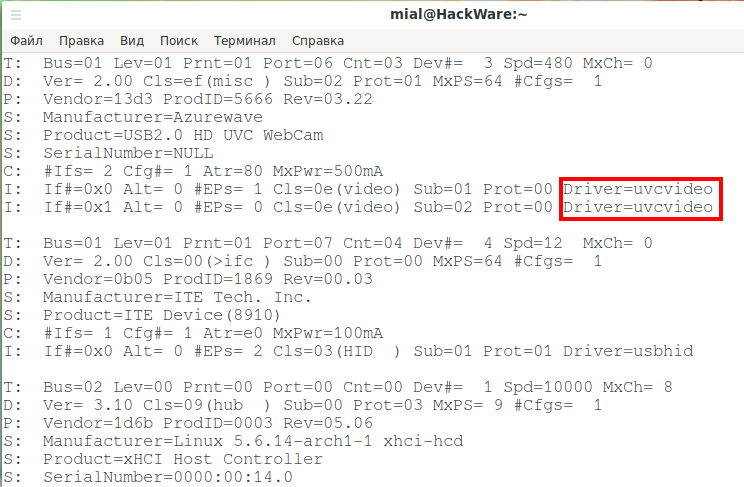

Видим, что для устройства USB2.0 HD UVC WebCam используется драйвер **uvcvideo**.

Создаём файл **/etc/modprobe.d/block-webcam.conf** и блокируем в нём запуск модуля ядра **uvcvideo**:

```
blacklist uvcvideo
install uvcvideo /bin/true
```

После перезагрузки система не сможет использовать вебкамеру, пока не будет удалён файл **block-webcam.conf** и выполнена перезагрузка.

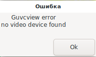

### Как отключить Bluetooth без возможности подключения <a name="link_10"></a>

Модуль ядра **bluetooth** включён в ядро, поэтому удалением каких-то пакетов вроде **bluez** и **blueman** задачу отключения Bluetooth не решить — если удалить указанные пакеты у нас не будет инструментов и графических апплетов для наблюдением за Bluetooth, но это не означает, что на уровне ядра не будет выполнятся подключение Bluetooth устройств (например, USB адаптера Bluetooth), либо периферийные устройства не будут сопрягаться.

Как можно убедиться, апплет blueman, а следовательно и Bluetooth работают.

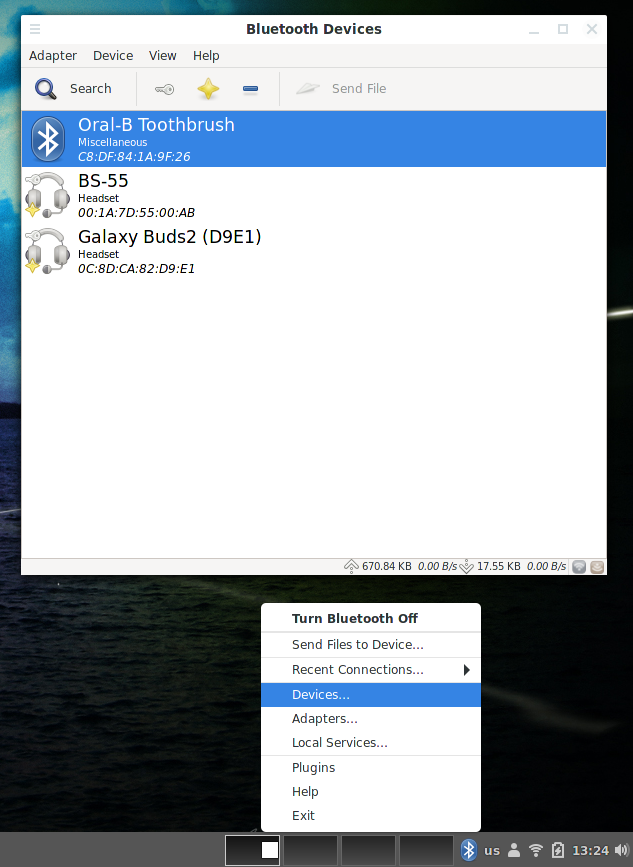

Для отключения модуля **bluetooth** создайте файл **/etc/modprobe.d/blacklist.conf**:

```
sudo gedit /etc/modprobe.d/blacklist.conf
```

и копируйте в него следующее:

```
blacklist bluetooth
install bluetooth /bin/true
```

Чтобы изменения вступили в силу, перезагрузите компьютер.

Как можно убедиться, Bluetooth больше не работает:


## Настройка параметров модуля <a name="link_11"></a>

Чтобы передать параметр в модуль ядра, вы можете передать их вручную с помощью **modprobe** или убедиться, что определённые параметры всегда применяются с помощью файла конфигурации **modprobe** или с помощью командной строки ядра.

Вручную во время загрузки, используя **modprobe**

Основной способ передачи параметров в модуль — использование команды **modprobe**. Параметры указываются в командной строке с использованием простых назначений **ключ=значение**:

```
modprobe ИМЯ-МОДУЛЯ ИМЯ-ПАРАМЕТРА=ЗНАЧЕНИЕ-ПАРАМЕТРА
```

Используя файлы в **/etc/modprobe.d/**

Файлы в каталоге **/etc/modprobe.d/** можно использовать для передачи настроек модуля в **udev**, который будет использовать **modprobe** для управления загрузкой модулей во время загрузки системы. Файлы конфигурации в этом каталоге могут иметь любое имя, если они заканчиваются расширением **.conf**, например **/etc/modprobe.d/myfilename.conf**. Синтаксис:

```
options ИМЯ-МОДУЛЯ ИМЯ-ПАРАМЕТРА=ЗНАЧЕНИЕ-ПАРАМЕТРА
```

Например, содержимое файла **/etc/modprobe.d/thinkfan.conf**:

```
# на ThinkPads, эта настройка позволяет демону 'thinkfan' контролировать скорость вентилятора
options thinkpad_acpi fan_control=1
```

Добавление опций модуля во время загрузки системы (ииспользование командной строки ядра)

Если модуль встроен в ядро, вы также можете передать опции модулю с помощью командной строки ядра. Для всех распространённых загрузчиков правильный синтаксис:

```
ИМЯ-МОДУЛЯ.ИМЯ-ПАРАМЕТРА=ЗНАЧЕНИЕ-ПАРАМЕТРА
```

Например:

```
thinkpad_acpi.fan_control=1
```

## Псевдонимы <a name="link_12"></a>

Псевдонимы — это альтернативные имена для модуля. Например:

```
alias МОЙ-МОД ОЧЕНЬ-ДЛИННОЕ-ИМЯ-МОДУЛЯ
```

означает, что вы можете использовать

```
modprobe МОЙ-МОД
```

вместо

```
modprobe ОЧЕНЬ-ДЛИННОЕ-ИМЯ-МОДУЛЯ
```

Вы также можете использовать подстановочные знаки в стиле оболочки, поэтому

```
alias my-mod* really_long_modulename
```

означает, что

```
modprobe my-mod-something
```

имеет тот же эффект.

Чтобы создать псевдоним в конфигурационном файле **/etc/modprobe.d/myalias.conf**:

```
alias МОЙ-МОД ОЧЕНЬ-ДЛИННОЕ-ИМЯ-МОДУЛЯ
```

Некоторые модули имеют псевдонимы, которые используются для автоматической их загрузки, когда они нужны приложению. Отключение этих псевдонимов может предотвратить автоматическую загрузку, но все равно позволит загружать модули вручную.

Пример файла **/etc/modprobe.d/modprobe.conf**

```
# Предотвращение автоматической загрузки Bluetooth
alias net-pf-31 off
```

## Ошибки при работе с модулями <a name="link_13"></a>

### Модули не загружаются <a name="link_14"></a>

Если определённый модуль не загружается и в [журнале загрузки](https://zalinux.ru/?p=3432)

```
journalctl -b
```

говорится, что модуль находится в чёрном списке, но в каталоге **/etc/modprobe.d/** нет соответствующей записи, проверьте другую папку **modprobe** на наличие записи о занесении в чёрный список: **/usr/lib/modprobe.d/**.

Модуль не будет загружен, если строка «**vermagic**», содержащаяся в модуле ядра, не соответствует значению текущего запущенного ядра. Если известно, что модуль совместим с текущим работающим ядром, проверку "vermagic" можно игнорировать с помощью **modprobe --force-vermagic**.

Предупреждение. Игнорирование проверок версий для модуля ядра может привести к сбою ядра или непредсказуемому поведению системы из-за несовместимости. Используйте **--force-vermagic** только с максимальной осторожностью.

### modprobe: ERROR: could not insert '…': Unknown symbol in module, or unknown parameter (see dmesg) <a name="link_15"></a>

Пример:

```
modprobe: ERROR: could not insert '88XXau': Unknown symbol in module, or unknown parameter (see dmesg)
```

Ошибка вызвана тем, что ранее модуль присутствовал в системе и о нём оставлена запись в списке зависимостей, но на момент ошибки модуль отсутствует (удалён).

Для обновления списка зависимостей выполните команду:

```
sudo depmod -a
```

Ещё одна возможная причина ошибки - не загружена зависимость, требуемая для модуля. Например, для Wi-Fi адаптеров обязательной зависимостью является **cfg80211**, чтобы загрузить этот модуль, выполните команду:

```
sudo modprobe cfg80211
```

### modprobe: FATAL: Module … not found in directory /lib/modules/… <a name="link_16"></a>

Пример:

```
modprobe: FATAL: Module 88XXau not found in directory /lib/modules/5.6.0-kali1-amd64
```

Означает, что модуль, который вы пытаетесь запустить, не существует.

Возможные причины:

- описка в названии модуля
- не установлен или удалён содержащий указанный модуль пакет

Если ранее модуль (драйвер) запускался, но затем появилась указанная ошибка, то она может быть связана с тем, что было обновлено ядро, а модуль для новой версии ядра не был скомпилирован.
