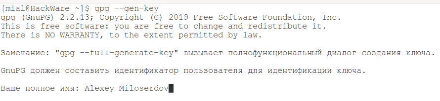
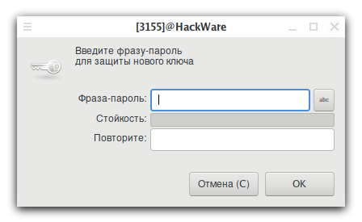
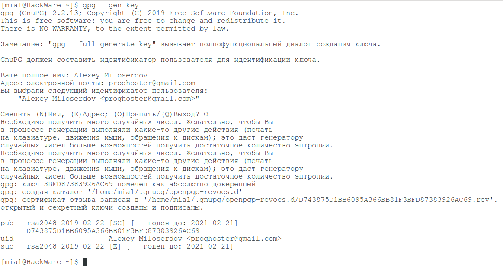
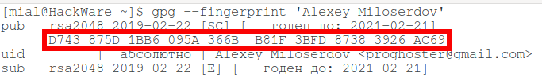
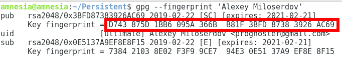
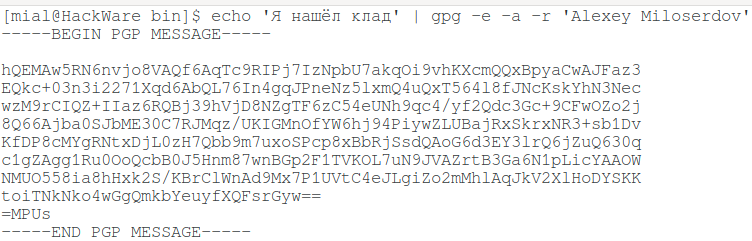
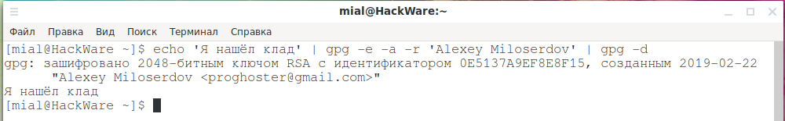

# Как пользоваться gpg: шифрование, расшифровка файлов и сообщений, подпись файлов и проверка подписи, управление ключами

[источник](https://hackware.ru/?p=8215)

1. [ Как пользоваться gpg: шифрование, расшифровка файлов и сообщений, подпись файлов и проверка подписи, управление ключами](#link_1)
2. [ Что такое GPG](#link_2)
3. [ Предупреждение по использованию GPG](#link_3)
4. [ Каким публичным GPG ключам можно доверять?](#link_4)
5. [ Как сгенерировать пару публичный-приватный ключ в GPG](#link_5)
6. [ Как посмотреть или сохранить свой публичный (открытый) ключ в GPG](#link_6)
7. [ Как посмотреть или сохранить свой приватный (секретный) ключ в GPG](#link_7)
8. [ Как импортировать ключи GPG](#link_8)
9. [ Как просмотреть список ключей GPG](#link_9)
10. [ Как удалить ключи GPG](#link_10)
11. [ Для чего нужны fingerprint (отпечатки) в GPG](#link_11)
12. [ Шифрование файлов и данных с GPG](#link_12)
13. [ Как в GPG шифровать файлы, чтобы их можно было отправить в виде сообщения](#link_13)
14. [ Как в GPG зашифровать сообщение](#link_14)
15. [ Как расшифровать файлы в GPG. Как расшифровать сообщение в GPG](#link_15)
16. [ GPG: Невозможно ввести пароль после неправильной попытки](#link_16)
17. [ Как посмотреть получателей зашифрованного в GPG файла](#link_17)
18. [ Выбор приватного ключа для расшифровки](#link_18)
19. [ Как в GPG подписать файл](#link_19)
20. [ Как в GPG проверить подпись файла ](#link_20)
21. [ Как извлечь файл из подписанного файла GPG](#link_21)
22. [ Как в GPG одновременно подписать и зашифровать файл](#link_22)
23. [ Редактирования ключей GPG](#link_23)
24. [ Как указать идентификатор пользователя в GPG](#link_24)
25. [ Файлы GPG](#link_25)
26. [ Источники:](#link_26)

## Что такое GPG 

gpg — это инструмент шифрования и электронного подписывания. В его работе используется ассиметричное шифрование, основанное на двух ключах: приватный и публичный. Приватный ключ иногда называют секретным. А публичный ключ называют открытым.

Суть работы в общих чертах следующая: любой желающий может сгенерировать себе пару ключей. Публичный ключ (как это можно понять из названия) не является секретным — этот ключ может находиться в открытом доступе. С помощью этого ключа можно шифровать сообщения и файлы. Причём сообщения и файлы шифруются только «в одну сторону» - расшифровать их, даже используя этот самый публичный ключ, уже невозможно. Их расшифровка возможна только при использовании соответствующего приватного ключа.

Таким образом, если вы хотите отправить секретное сообщение или зашифрованный файл определённому лицу, то вы берёте публичный ключ этого лица (который может быть в свободном доступе), зашифровываете информацию и отправляете ему эту зашифрованную информацию — кроме владельца соответствующего приватного ключа её уже никто не сможет узнать.

Если обменяться публичными ключами, то вы с этим лицом можете вести зашифрованную беседу:

- вы шифруете свои сообщения публичным ключом вашего собеседника и отправляете ему
- он с помощью своего приватного ключа читает эти сообщения
- ваш собеседник шифрует свои сообщения вашим публичным ключом и отправляет вам
- вы с помощью своего приватного ключа читаете свои сообщения
- и так далее

Приватный ключ умеет делать ещё один интересный фокус: он умеет подписывать файлы. Причём, как можно уже догадаться, проверять подпись можно соответствующим публичным ключом.

Итак, **gpg** — это OpenPGP часть GNU Privacy Guard (GnuPG). Этот инструмент обеспечивает цифровое шифрование и службы подписи используя стандарт OpenPGP. **gpg** имеет функции полного управления ключами, а также все приблуды, которые вы можете ожидать от реализации OpenPGP.

## Предупреждение по использованию GPG 

Используйте хороший пароль для вашего пользовательского аккаунта и хорошую парольную фразу для защиты вашего секретного ключа. Эта парольная фраза является самой слабой частью всей системы. Касательно GPG, вам нужно защитить от постороннего доступа папку "**~/.gnupg/**".

Для использования в скриптах, у **gpg** есть хорошо документированная реализация API, чтобы активировать этот интерфейс используйте опции **--with-colons** и **--status-fd**. Также для определённых операций может пригодиться опция **--command-fd**.

## Каким публичным GPG ключам можно доверять? 

Создать пару публичный-приватный ключ можно у себя на компьютере для любого имени. Это примерно как SSL сертификаты: можно создать для любого сайта, но такой самоподписанный сертификат не будет вызывать доверие у браузеров. Поэтому привлекается третья сторона — корневой центр сертификации (root certification authority, CA) (там чуть сложнее, также имеются промежуточные доверенные центры авторизации (trusted certificate authority)). Собственно, эта услуга и является платной при покупке SSL сертификата для сайта — сгенерировать сертификат можно самому за секунду на любом Linux.

Аналогичная ситуация и с GPG ключами: они могут быть созданы на любое имя. Поэтому когда вы скачиваете публичный GPG ключ для проверки цифровой подписи, вы должны быть полностью уверены, что он именно от того лица, от кого вы думаете. Иначе вся процедура теряет смысл.

После самого первого обмена публичными ключами, дальнейший обмен более надёжен: другая сторона, чтобы подтвердить, что новый публичный ключ исходит от неё, подпишет этот самый новый публичный ключ своим предыдущим приватным ключом. Таким образом, получив новый публичный ключ от вашего собеседника, вы можете проверить подпись предыдущим публичным ключом, и если подпись верна, то, следовательно, можно доверять и новому ключу, который должен заменить предыдущий публичный ключ.

## Как сгенерировать пару публичный-приватный ключ в GPG 

Всё начинается с генерации ключей. Вы это можете сделать на своём компьютере.

Для генерирования пары ключей запустите команду:

|     |                 |
| --- | --------------- |
| 1   | `gpg --gen-key` |

Вам нужно будет ввести:

- Ваше полное имя
- Адрес электронной почты

Затем программа покажет выбранный вами идентификатор пользователя и спросит, всё ли правильно? Если всё правильно, вам нужно будет ввести **O**.

Затем программа попросит ввести пароль.

Вы можете задать вопрос: какой ещё пароль, если для зашифровки и расшифровки используется ассиметричный алгоритм с файлами ключей? Да, всё верно, вводимый пароль не будет участвовать в процессе шифрования и расшифровки, он нужен для защиты вашего ключа, поскольку он хранится у вас на компьютере в домашней папке. На тот случай, если злоумышленник получит физический доступ к вашему компьютеру, он не сможет просто воспользоваться вашим приватным ключом — ему сначала нужно будет подобрать пароль. Поэтому пароль придумайте надёжный. Кстати, если вы экспортируете приватный ключ в файл (команды для этого будут показаны ниже) чтобы, например, перенести его на другой компьютер, то при импорте этого ключа на другой компьютер нужно будет ввести пароль от этого приватного ключа.

Затем программа покажет совет:

> Необходимо получить много случайных чисел. Желательно, чтобы Вы в процессе генерации выполняли какие-то другие действия (печать на клавиатуре, движения мыши, обращения к дискам); это даст генератору случайных чисел больше возможностей получить достаточное количество энтропии.

Вместо **--gen-key** можно использовать опцию **--full-generate-key**, которая также сгенерирует пару ключей, но покажет больше опций. При использовании **--gen-key** некоторые значений опций используются по умолчанию.

## Как посмотреть или сохранить свой публичный (открытый) ключ в GPG 

У меня плохо с фантазией, поэтому далее в командах в качестве имени пользователя (точнее, идентификаторая пользователя) я использую Alexey Miloserdov — замените эту строку на ваше значение.

Чтобы посмотреть публичный ключ используйте опцию **--export**, а также опцию **-a**, которая означает, что выводимые данные должны быть не в бинарном формате, а в ASCII (то есть текстовом, пригодном для копирования-вставки в сообщение мессенджера или электронной почты), в конце укажите имя пользователя:

|     |                                             |
| --- | ------------------------------------------- |
| 1   | `gpg --``export` `-a` `"Alexey Miloserdov"` |

Для сохранения публичного ключа в файл используйте перенаправление вывода:

|     |                                                            |
| --- | ---------------------------------------------------------- |
| 1   | `gpg --``export` `-a` `"Alexey Miloserdov"` `> public.key` |

В результате публичный ключ будет сохранён в файл **public.key**.

Или используйте опцию **-o**, после которой укажите имя файла:

|     |                                                           |
| --- | --------------------------------------------------------- |
| 1   | `gpg --``export` `-a -o public.key` `"Alexey Miloserdov"` |

Кстати, обратите внимание, что для вывода публичного ключа не запрашивается пароль.

## Как посмотреть или сохранить свой приватный (секретный) ключ в GPG 

Для просмотра и экспорта приватного ключа используется опция **--export-secret-key**:

|     |                                                        |
| --- | ------------------------------------------------------ |
| 1   | `gpg --``export``-secret-key -a` `"Alexey Miloserdov"` |

Для сохранения в файл:

|     |                                                                        |
| --- | ---------------------------------------------------------------------- |
| 1   | `gpg --``export``-secret-key -a` `"Alexey Miloserdov"` `> private.key` |

Или с опцией **-o**:

|     |                                                                       |
| --- | --------------------------------------------------------------------- |
| 1   | `gpg --``export``-secret-key -a -o private.key` `"Alexey Miloserdov"` |

## Как импортировать ключи GPG 

Для импорта публичного ключа выполните:

|     |                               |
| --- | ----------------------------- |
| 1   | `gpg --``import` `public.key` |

Эта команда добавит публичный ключ, который находится в файле "**public.key**".

Для добавления приватного ключа из файла **private.key** выполните команду:

|     |                                |
| --- | ------------------------------ |
| 1   | `gpg --``import` `private.key` |

## Как просмотреть список ключей GPG 

Для просмотра всех публичных ключей в вашей системе выполните:

|     |                   |
| --- | ----------------- |
| 1   | `gpg --list-keys` |

Для просмотра всех приватных ключей в вашей системе выполните:

|     |                          |
| --- | ------------------------ |
| 1   | `gpg --list-secret-keys` |

## Как удалить ключи GPG 

Для удаления публичного ключа выполните:

|     |                                          |
| --- | ---------------------------------------- |
| 1   | `gpg --delete-key` `"Alexey Miloserdov"` |

Помните: если на компьютере имеется приватный ключ, ассоциированный с этим публичным ключом, то вы получите ошибку! Вы должны удалить приватный ключ этой пары, а затем можно удалять публичный ключ.

Для удаления приватного ключа:

|     |                                                 |
| --- | ----------------------------------------------- |
| 1   | `gpg --delete-secret-key` `"Alexey Miloserdov"` |

## Для чего нужны fingerprint (отпечатки) в GPG 

Fingerprint (отпечатки) ключей в gpg имеют примерно следующий вид:

|     |                                                     |
| --- | --------------------------------------------------- |
| 1   | `D743 875D 1BB6 095A 366B B81F 3BFD 8738 3926 AC69` |

Отпечаток может выполнять функцию идентификатора ключа — то есть вместо указания имени пользователя (в моём примере это Alexey Miloserdov) можно использовать отпечаток.

Например для удаления секретного ключа, используя в качестве идентификатора отпечаток:

|     |                                                                                 |
| --- | ------------------------------------------------------------------------------- |
| 1   | `gpg --delete-secret-key` `'D743 875D 1BB6 095A 366B B81F 3BFD 8738 3926 AC69'` |

Вторая функция применения отпечатка — это верификация публичного ключа. В качестве примера приводится следующая история: Алиса передала Бобу клочок бумаги, на котором записан отпечаток (ну или позвонила по телефону и продиктовала отпечаток). Затем Алиса переслала Бобу свой публичный ключ. Но так как ключ пришёл из Интернета — то непонятно, от кого он именно? Не был ли этот ключ подменён по пути? После импорта ключа, можно просмотреть его отпечаток. Поскольку у Боба есть отпечаток, который он получил из доверенного источника (Алиса продиктовала его своим голосом или лично передала записку с отпечатком), то Боб теперь может сравнить эти два отпечатка — если отпечатки идентичные, значит публичный ключ действительно отправлен Алисой и значит ему можно доверять.

Посмотреть опечаток для ключа определённого пользователя можно командой:

|     |                                           |
| --- | ----------------------------------------- |
| 1   | `gpg --fingerprint` `'Alexey Miloserdov'` |

Это отпечаток на компьютере, где была создана пара ключей:

А это отпечаток на другом компьютере, где был импортирован публичный ключ:

Как можно убедиться, они идентичные. Следовательно, публичный ключ действительно получен от того источника, о котором я думал.

## Шифрование файлов и данных с GPG 

Про шифрование в gpg нужно знать, что оно может быть:

- ассиметричным (шифруется публичным ключом, расшифровывается приватным)
- симметричным (шифруется и расшифровывается приватным ключом, шифруется и расшифровывается одной и той же парольной фразой)

Второе, что нужно знать: шифрование можно совмещать с подписыванием файла. Подписывание файла и проверку подписи мы рассмотрим далее. Также далее мы рассмотрим одновременное шифрование и подпись файла.

Третье: зашифровать можно одним или более публичными ключами.

Для шифрования файла используя симметричный метод с паролем используйте опцию **-c** (либо её длинный аналог **--symmetric**):

Следующая команда для шифрования файла test.php паролем в gpg:

|     |                       |
| --- | --------------------- |
| 1   | `gpg -c` `test``.php` |

В результате шифрования будет создан файл с расширением **.gpg** (в данном случае это будет файл test.php.gpg).

Для того, чтобы зашифровать файл симметричным шифрованием с возможностью расшифровки приватным ключом (в этом случае его можно будет расшифровать приватным ключом, либо паролем) нужно использовать сразу несколько опций:

- **-e** — означает шифрование данных
- **-c** — означает симметричное шифрование
- **-r 'id'** — означает зашифровать данные для пользователя с определённым id

Пример команды симметричного шифрования файла test.php для пользователя Alexey Miloserdov с возможностью его расшифровки приватным ключом ЛИБО для расшифровки паролем:

|     |                                                   |
| --- | ------------------------------------------------- |
| 1   | `gpg -e -c -r` `'Alexey Miloserdov'` `test``.php` |

Точнее говоря, комбинирование двух опций **-e** и **-c** шифрует ключ сессии публичным ключом и симметричным шифром, поэтому для расшифровки может использоваться И приватный ключ, И пароль (на выбор). Если на другом компьютере, где вы расшифровываете файл, имеется ваш приватный ключ, то при расшифровке будет запрошен пароль приватного ключа. Если приватный ключ отсутствует, то будет запрошен пароль, который использовался при шифровании файла.

Для шифрования публичным ключом _**(-e)**_, чтобы файл _**(test.php)**_ мог расшифровать только владелец соответствующего парного приватного ключа _**(-r 'Alexey Miloserdov')**_:

|     |                                                |
| --- | ---------------------------------------------- |
| 1   | `gpg -e -r` `'Alexey Miloserdov'` `test``.php` |

Вместо опции **-r 'Имя Адресата'** можно использовать опцию **-R 'Имя Адресата**' или её длинный аналог **--hidden-recipient 'Имя Адресата'**. Она также шифрует файл для указанного адресата, но имя этого адресата шифруется. Кстати, следует упомянуть, что даже в зашифрованном файле имя адресата может посмотреть кто угодно — о том, как это сделать, будет сказано ниже.

Пример шифрования файла test.php публичным ключом пользователя Alexey Miloserdov, но с зашифрованным именем адресата.

|     |                                                |
| --- | ---------------------------------------------- |
| 1   | `gpg -e -R` `'Alexey Miloserdov'` `test``.php` |

Обратите внимание, что во всех случаях шифрования **оригинальный файл остаётся**!!! Вам самим нужно решать, что с ним делать, например, удалить его.

Чтобы каждый раз не вводить имя получателя, можно установить значение по умолчанию опцией **--default-recipient**. Также с ней в комплекте идут опции **--default-recipient-self** и **--no-default-recipient**.

## Как в GPG шифровать файлы, чтобы их можно было отправить в виде сообщения 

По умолчанию файлы сохраняются в бинарный формат OpenPGP. Кстати, в этом формате файл может занимать значительно меньше места (в разы!) чем исходный файл до шифрования. Если вы откроете зашифрованный файл, то убедитесь, что это бинарные данные, которые невозможно передать копированием-вставкой без потери их функциональности.

Но иногда может возникнуть необходимость переслать зашифрованный файл или сообщение по почте или в мессенджере в виде обычного текста. Это возможно с помощью опции **-a**, которая создаёт зашифрованный файл в формате ASCII.

|     |                                                   |
| --- | ------------------------------------------------- |
| 1   | `gpg -e -a -r` `'Alexey Miloserdov'` `test``.php` |

В результате будет создан файл с расширением **.asc** (в данном случае это файл test.php.asc).

## Как в GPG зашифровать сообщение 

Для зашифровки сообщения используйте следующую конструкцию:

|     |                                                                       |
| --- | --------------------------------------------------------------------- |
| 1   | `echo` `'ТЕКСТ СООБЩЕНИЯ'` `\| gpg -e -a -r` `'ПОЛУЧАТЕЛЬ СООБЩЕНИЯ'` |

Обратите внимание, что я добавил опцию **-a** — для того, чтобы зашифрованное сообщение можно было скопировать и вставить в мессенджер или в email (или распечатать на принтере). Без этой опции будут выведены бинарные данные.

Зашифрованное сообщение будет выведено в стандартный вывод, то есть в терминал. Если вы хотите сохранить зашифрованное сообщение в файл, то используйте конструкцию:

|     |                                                                                         |
| --- | --------------------------------------------------------------------------------------- |
| 1   | `echo` `'ТЕКСТ СООБЩЕНИЯ'` `\| gpg -e -a -r` `'ПОЛУЧАТЕЛЬ СООБЩЕНИЯ'` `> ФАЙЛ_С_ШИФРОМ` |

Пример использования:

|     |                                                                 |
| --- | --------------------------------------------------------------- |
| 1   | `echo` `'Я нашёл клад'` `\| gpg -e -a -r` `'Alexey Miloserdov'` |

## Как расшифровать файлы в GPG. Как расшифровать сообщение в GPG 

Для расшифровки используется опция **-d**:

|     |                           |
| --- | ------------------------- |
| 1   | `gpg -d` `test``.php.gpg` |

Причём данные будут выведены прямо в стандартный вывод! То есть в терминал. Чтобы сохранить данные в файл используйте опцию **-o**, после которой укажите имя нового расшифрованного файла:

|     |                                           |
| --- | ----------------------------------------- |
| 1   | `gpg -d -o` `test``.php` `test``.php.gpg` |

Либо используйте конструкцию вида:

|     |                                                   |
| --- | ------------------------------------------------- |
| 1   | `gpg -d ЗАШИФРОВАННЫЙ_ФАЙЛ > РАСШИФРОВАННЫЙ_ФАЙЛ` |

Пример:

|     |                                          |
| --- | ---------------------------------------- |
| 1   | `gpg -d` `test``.php.gpg >` `test``.php` |

Вроде это тоже нормально работает (для текстовых файлов уж точно).

**Как расшифровать сообщение в GPG**

Также gpg может расшифровывать данные из стандартного ввода. В этом можно убедиться подобной конструкцией:

|     |                                                                             |
| --- | --------------------------------------------------------------------------- |
| 1   | `echo` `'Я нашёл клад'` `\| gpg -e -a -r` `'Alexey Miloserdov'` `\| gpg -d` |

Более практический пример:

|     |                                  |
| --- | -------------------------------- |
| 1   | `cat` `test``.php.gpg \| gpg -d` |

## GPG: Невозможно ввести пароль после неправильной попытки 

При симметричном шифровании пароли кэшируются, чтобы не нужно было вводить много раз один и тот же пароль. Не знаю, как это соотносится с безопасностью, но можно сильно попасть впросак, если ввести неверный пароль — при последующих попытках открыть этот же файл, система вместо того, чтобы спрашивать у вас новый вариант, будет использовать кэшированную версию, то есть просто будет выдавать ошибку:

|     |                                                                          |
| --- | ------------------------------------------------------------------------ |
| 1   | `gpg: decryption failed: Недопустимый алгоритм симметричного шифрования` |

Чтобы побороть эту ситуацию, нужно явно указать не использовать кэш, для этого имеется опция **--no-symkey-cache**, пример использования:

|     |                                             |
| --- | ------------------------------------------- |
| 1   | `gpg -d --no-symkey-cache` `test``.php.gpg` |

## Как посмотреть получателей зашифрованного в GPG файла 

Если вы не хотите расшифровывать файл (а может быть просто не можете из-за отсутствия приватного ключа), но хотите посмотреть, кому он предназначен (это можно сделать даже для зашифрованных файлов, если специально не зашифрованы получатели как это показано выше), то для этого имеется опция **--list-only**.

Вместе с этой опцией нужно использовать опцию **-d**, а также указать проверяемый файл, пример:

|     |                                       |
| --- | ------------------------------------- |
| 1   | `gpg --list-only -d` `test``.php.gpg` |

Может быть выведено:

|            |                                                                                                                                                              |
| ---------- | ------------------------------------------------------------------------------------------------------------------------------------------------------------ |
| 1  2 | `gpg: зашифровано 2048-битным ключом RSA с идентификатором 0E5137A9EF8E8F15, созданным 2019-02-22`        `"Alexey Miloserdov <proghoster@gmail.com>"` |

Или без локализации:

|            |                                                                                                                                             |
| ---------- | ------------------------------------------------------------------------------------------------------------------------------------------- |
| 1  2 | `gpg: encrypted with 2048-bit RSA key, ID 0x0E5137A9EF8E8F15, created 2019-02-22`        `"Alexey Miloserdov <proghoster@gmail.com>"` |

Это сообщение означает, что выполнено ассиметричное шифрование для пользователя Alexey Miloserdov <proghoster@gmail.com>.

При симметричном шифровании сообщение будет таким:

|                              |                                                                                                                                                                                                                                                            |
| ---------------------------- | ---------------------------------------------------------------------------------------------------------------------------------------------------------------------------------------------------------------------------------------------------------- |
| 1  2  3  4 | `gpg: сеансовый ключ зашифрован по AES`  `gpg: зашифровано одной фразой-паролем`  `gpg: зашифровано 2048-битным ключом RSA с идентификатором 0E5137A9EF8E8F15, созданным 2019-02-22`        `"Alexey Miloserdov <proghoster@gmail.com>"` |

Или без локализации:

|                              |                                                                                                                                                                                                                               |
| ---------------------------- | ----------------------------------------------------------------------------------------------------------------------------------------------------------------------------------------------------------------------------- |
| 1  2  3  4 | `gpg: AES encrypted session key`  `gpg: encrypted with 1 passphrase`  `gpg: encrypted with 2048-bit RSA key, ID 0x0E5137A9EF8E8F15, created 2019-02-22`        `"Alexey Miloserdov <proghoster@gmail.com>"` |

Причём вплоть до 2019 года, почти до самых последних версий gpg, у опции **--list-only** есть интересный баг: если на компьютере, где выполняется проверка, имеется приватный ключ пользователя, кому предназначен данный файл, то не выводиться ничего. Это может запутать, поскольку также ничего не выводиться в случае, если получатель зашифрован. Я нашёл упоминание об этой ошибке в 2013 году (смотрите список источников), и она до сих присутствует в 2019 в самой последней версии Tails. Чтобы обойти этот баг, используйте опцию **-v**, получается примерно следующая команда:

|     |                                              |
| --- | -------------------------------------------- |
| 1   | `gpg --list-only -``v` `-d` `test``.php.gpg` |

Будет выведено что-то вроде:

|     |                                         |
| --- | --------------------------------------- |
| 1   | `gpg: public key is 0x0E5137A9EF8E8F15` |

И уже по идентификатору публичного ключа можно найти пользователя.

В самых последних версиях gpg (например в Arch Linux и BlackArch) эта ошибка уже исправлена. То есть **--list-only** работает именно так, как это интуитивно ожидается и костыля в виде опции **-v** больше не требуется.

## Выбор приватного ключа для расшифровки 

Как мы уже выяснили, даже зашифрованная информация в GPG содержит имя получателя (если оно специально не удалено). Поэтому процедура расшифровки файлов понятна: GPG смотрит получателя и использует его приватный ключ для извлечения данных.

А как это происходит в случае, если получатель зашифрован? В этом случае GPG просто перебирает все имеющиеся в системе приватные ключи и смотрит, какой из них подойдёт (такой своеобразный брут-форсинг).

Вы можете помочь программе используя опцию **--try-secret-key ИМЯ**, вместо **ИМЕНИ** нужно указать идентификатор пользователя с закрытым ключом, для которого зашифрован файл.

Думаю, вы уже понимаете, что зашифрованная информация содержит как минимум такие части как: 1) идентификатор получателя, 2) «полезная нагрузка» - сами зашифрованные данные. Идентификатор получателя может быть поддельным — то есть для шифрования использовались публичные ключи одного лица, а в качестве получателя указано другое лицо. Это приведёт к тому, что попытка расшифровки в GPG завершиться неудачей.

Для расшифровки таких файлов с поддельным ключевым ID, используется опция **--try-all-secrets**. Как можно понять из названия самой опции, она не будет смотреть на ключевой идентификатор в сообщении, а будет пробовать все секретные ключи, пока не найдёт правильный для расшифровки. То есть поведение будет в точности таким же, как если бы получатель (или получатели) не были указаны вовсе. То есть как если бы данные шифровались с использованием опций **--throw-keyids** или **--hidden-recipient**.

## Как в GPG подписать файл 

Как было сказано выше, для подписи файла используется приватный ключ. Поскольку приватный (секретный) ключ хранится (очевидно же) в секрете владельцем, то исходя из предположения, что никто кроме владельца не имеет доступ к приватному ключу, мы можем быть уверены, что файл, который подписан этим приватным ключом, исходит от этого определённого лица. Если файл как либо после подписи был изменён, то эта подпись перестаёт быть верной (валидной) для данного файла. Поэтому, проверка подписи позволяет гарантировать:

- файл исходит от того лица, которое её подписало;
- файл не был как либо модифицирован с момента подписи.

Для проверки подписи определённого лица у вас должен быть публичный ключ этого лица.

Для подписи файла используется опция **-s** или её более длинный вариант **--sign**. Если у вас на компьютере только один приватный ключ, то он будет выбран автоматически.

Если у вас на компьютере несколько приватных ключей, то нужно использовать также опцию **-u ИМЯ** или её более длинный вариант **--local-user ИМЯ**. Эта опция перезаписывает значение **--default-key**.

Кстати про **--default-key**. Она устанавливает ключ, который будет использоваться по умолчанию, чтобы его не нужно было вводить каждый раз.

Итак, я хочу подписать файл test.php, приватным ключом пользователя Alexey Miloserdov, тогда моя команда следующая:

|     |                                                  |
| --- | ------------------------------------------------ |
| 1   | `gpg -u` `'Alexey Miloserdov'` `-s` `test``.php` |

Будет создан файл с расширением **.gpg**, в моём случае это файл test.php.gpg. Этот файл включает И исходный файл, И его цифровую подпись. Новый файл в бинарном формате — то есть даже если ранее это было сообщение или текстовый файл, то он становится нечитаемым.

С помощью опции **--clear-sign** (другое её написание **--clearsign**) можно создать файл в виде обычного текста.

|     |                                                                |
| --- | -------------------------------------------------------------- |
| 1   | `gpg -u` `'Alexey Miloserdov'` `--``clear``-sign` `test``.php` |

Будет создан файл test.php.asc, который будет содержать исходный текст после **-----BEGIN PGP SIGNED MESSAGE-----**, а также блок с подписью:

|                                                |                                                                                                                                                      |
| ---------------------------------------------- | ---------------------------------------------------------------------------------------------------------------------------------------------------- |
| 1  2  3  4  5  6 | `-----BEGIN PGP SIGNATURE-----`  `…………………………`  `…………………………`  `…………………………`  `…………………………`  `-----END PGP SIGNATURE-----` |

Текстовое содержимое можно извлечь без сторонних инструментов, а для проверки подписи всё равно нужна программа PGP.

В реальной жизни публичные программы и другие файлы намного чаще распространяются в виде пары: **исходный файл программы + отдельно подпись**. Можно догадаться почему: большинству пользователей до фонаря эта электронная подпись и они не смогли бы извлечь файлы из **.gpg** формата. В принципе, их позиция понятна: какой смысл проверять подпись, если мы всё равно лично не знаем тех, кто именно подписал файл, да и тех, кто удостоверяет подлинность публичного ключа мы тоже не знаем. Разве что, можно быть уверенным, что файл действительно подписан автором программы, а не хакером, который взломал сервер, где хранятся файлы для скачивания, и что хакер не подменил файл в процессе его «путешествия» к нам на компьютер.

Так вот, чтобы делать такую пару (точнее говоря, нам нужно сделать только отдельный файл подписи — с исходным файлом вообще ничего не происходит) в PGP есть опция **-b** (или более длинное написание **--detach-sign**), которая применяется следующим образом:

|     |                                                  |
| --- | ------------------------------------------------ |
| 1   | `gpg -u` `'Alexey Miloserdov'` `-b` `test``.php` |

Будет создан дополнительный файл **.sig** (в моём случае это test.php.sig). В этом файле нет ничего, кроме цифровой подписи. Поэтому вам нужно предоставлять и оригинальный файл, и файл .sig.

## Как в GPG проверить подпись файла  

Для проверки подписи используется опция **--verify**.

Как мы только что узнали, цифровая подпись может быть интегрирована в файл, а может содержаться в отдельном файле. От этого зависит запуск команды **gpg**, если цифровая подпись интегрирована в файл, то достаточно указать опцию **--verify**, а затем проверяемый файл:

|     |                                 |
| --- | ------------------------------- |
| 1   | `gpg --verify` `test``.php.gpg` |

Если цифровая подпись отделена от файла, то после опции **--verify** нужно указать два аргумента: **вначале идёт файл с подписью, а затем подписанные данные**:

|     |                                              |
| --- | -------------------------------------------- |
| 1   | `gpg --verify` `test``.php.sig` `test``.php` |

Кстати, для проверки подписи есть специальная программа **gpgv**, которая заменяет собой конструкцию **gpg --verify**, то есть предыдущие команды можно записать так:

|     |                         |
| --- | ----------------------- |
| 1   | `gpgv` `test``.php.gpg` |

и

|     |                                      |
| --- | ------------------------------------ |
| 1   | `gpgv` `test``.php.sig` `test``.php` |

Пример вывода при проверке подписи (проверка выполнялась на компьютере, где была создана соответствующая пара ключей, поэтому к подписи полное доверие):

|                              |                                                                                                                                                                                                                                                                                                                               |
| ---------------------------- | ----------------------------------------------------------------------------------------------------------------------------------------------------------------------------------------------------------------------------------------------------------------------------------------------------------------------------- |
| 1  2  3  4 | `gpg: Подпись сделана Сб 23 фев 2019 04:40:40 MSK`  `gpg:                ключом RSA с идентификатором D743875D1BB6095A366BB81F3BFD87383926AC69`  `gpg:                 издатель "proghoster@gmail.com"`  `gpg: Действительная подпись пользователя "Alexey Miloserdov <proghoster@gmail.com>" [абсолютное]` |

Без локализации (на этом компьютере публичный ключ был импортирован, поэтому, с одной стороны, подтверждено, что подпись хорошая и принадлежит Alexey Miloserdov <proghoster@gmail.com>, но, с другой стороны, выведено предупреждение, что сам открытый ключ, которым проверялась подпись, не сертифицирован доверенной подписью — то есть программа хочет нам сказать, что таких ключей от имени Alexey Miloserdov <proghoster@gmail.com> может наделать кто угодно в любом количестве):

|                                                         |                                                                                                                                                                                                                                                                                                                                                                                                                                                                                                                                                |
| ------------------------------------------------------- | ---------------------------------------------------------------------------------------------------------------------------------------------------------------------------------------------------------------------------------------------------------------------------------------------------------------------------------------------------------------------------------------------------------------------------------------------------------------------------------------------------------------------------------------------- |
| 1  2  3  4  5  6  7 | `gpg: Signature made Сб 23 фев 2019 01:40:40 UTC`  `gpg:                using RSA key D743875D1BB6095A366BB81F3BFD87383926AC69`  `gpg:                issuer "proghoster@gmail.com"`  `gpg: Good signature from "Alexey Miloserdov <proghoster@gmail.com>" [unknown]`  `gpg: WARNING: This key is not certified with a trusted signature!`  `gpg:          There is no indication that the signature belongs to the owner.`  `Primary key fingerprint: D743 875D 1BB6 095A 366B  B81F 3BFD 8738 3926 AC69` |

## Как извлечь файл из подписанного файла GPG 

После проверки подписи может возникнуть интересный вопрос — а как, собственно, использовать этот файл в **.gpg** формате? Чтобы получить подписанные данные нужно использовать опцию **-d**, которую мы уже рассматривали — она используется для расшифровки данных. Но в дополнении к данной опции нужно ещё использовать опцию **-o**, после которой нужно указать имя файла, куда будут извлечены подписанные данные — обычный редирект вывода, как это было рассмотрено выше, может не подойти, поскольку для подписанного файла опцией **-d** не только извлекаются исходные данные, но и происходит проверка подписи и результаты проверки тоже выводятся на экран, то есть если вы будете использовать редирект вывода, то в создаваемый файл попадут и подписанные данные, и информация о проверке подписи.

|     |                                           |
| --- | ----------------------------------------- |
| 1   | `gpg -d -o` `test``.php` `test``.php.gpg` |

## Как в GPG одновременно подписать и зашифровать файл 

Для этого достаточно совмещать уже известные нам опции.

Чтобы зашифровать файл публичным ключом другого лица, и подписать его своим приватным ключом, нужно выполнить команду вида:

|     |                                                                       |
| --- | --------------------------------------------------------------------- |
| 1   | `gpg -e -u` `'ОТ КОГО ФАЙЛ'` `-r` `'КОМУ ФАЙЛ'` `ФАЙЛ_ДЛЯ_ШИФРОВАНИЯ` |

Чтобы использовалось симметричное шифрование, то к предыдущей конструкции достаточно добавить соответствующую опцию **-c**:

|     |                                                                          |
| --- | ------------------------------------------------------------------------ |
| 1   | `gpg -e -c -u` `'ОТ КОГО ФАЙЛ'` `-r` `'КОМУ ФАЙЛ'` `ФАЙЛ_ДЛЯ_ШИФРОВАНИЯ` |

## Редактирования ключей GPG 

Для редактирования ключа определённого пользователя выполните команду (замените 'Alexey Miloserdov' на желаемый идентификатор пользователя):

|     |                                        |
| --- | -------------------------------------- |
| 1   | `gpg --edit-key` `'Alexey Miloserdov'` |

Вы попадёте в интерактивный интерфейс командной строки, там будут работать следующие команды:

|                                                                                                                                                                                                                                                                                                                                                                                                                                         |                                                                                                                                                                                                                                                                                                                                                                                                                                                                                                                                                                                                                                                                                                                                                                                                                                                                                                                                                                                                                                                                                                                                                                                                                                                                                                                                                                                                                                                                                                                                                                                                                                                                                                                                                                                                                                                                                                                                                                                                                                                                                                                                                                                                                                                                                                                                                                                                                                                                                                                                                                                                                                                                                                                                                                                                                                                                             |
| --------------------------------------------------------------------------------------------------------------------------------------------------------------------------------------------------------------------------------------------------------------------------------------------------------------------------------------------------------------------------------------------------------------------------------------- | --------------------------------------------------------------------------------------------------------------------------------------------------------------------------------------------------------------------------------------------------------------------------------------------------------------------------------------------------------------------------------------------------------------------------------------------------------------------------------------------------------------------------------------------------------------------------------------------------------------------------------------------------------------------------------------------------------------------------------------------------------------------------------------------------------------------------------------------------------------------------------------------------------------------------------------------------------------------------------------------------------------------------------------------------------------------------------------------------------------------------------------------------------------------------------------------------------------------------------------------------------------------------------------------------------------------------------------------------------------------------------------------------------------------------------------------------------------------------------------------------------------------------------------------------------------------------------------------------------------------------------------------------------------------------------------------------------------------------------------------------------------------------------------------------------------------------------------------------------------------------------------------------------------------------------------------------------------------------------------------------------------------------------------------------------------------------------------------------------------------------------------------------------------------------------------------------------------------------------------------------------------------------------------------------------------------------------------------------------------------------------------------------------------------------------------------------------------------------------------------------------------------------------------------------------------------------------------------------------------------------------------------------------------------------------------------------------------------------------------------------------------------------------------------------------------------------------------------------------------------------- |
| 1  2  3  4  5  6  7  8  9  10  11  12  13  14  15  16  17  18  19  20  21  22  23  24  25  26  27  28  29  30  31  32  33  34  35  36  37  38  39  40  41  42  43  44 | `quit        выйти из этого меню`  `save        сохранить и выйти`  `help        показать данную справку`  `fpr         показать отпечаток ключа`  `grip        показать код ключа`  `list        вывести список ключей и идентификаторов пользователя`  `uid         выбрать идентификатор пользователя N`  `key         выбрать подключ N`  `check       проверка подписей`  `sign        подписать выбранные идентификаторы пользователя [* описание команд см. ниже]`  `lsign       локально подписать выбранные идентификаторы пользователя`  `tsign       подписать выбранные идентификаторы пользователя подписью доверия`  `nrsign      подписать выбранные идентификаторы пользователя без возможности отзыва`  `adduid      добавить идентификатор пользователя`  `addphoto    добавить фотоидентификатор`  `deluid      удалить выбранные идентификаторы пользователя`  `addkey      добавить подключ`  `addcardkey  добавить ключ на криптографическую карту`  `keytocard   переместить ключ на криптографическую карту`  `bkuptocard  переместить архивный ключ на криптографическую карту`  `delkey      удалить выбранные подключи`  `addrevoker  добавить ключ отзыва`  `delsig      удалить подписи с выбранных идентификаторов пользователя`  `expire      сменить срок действия ключа или выбранных подключей`  `primary     пометить выбранный идентификатор пользователя как первичный`  `pref        список предпочтений (экспертам)`  `showpref    список предпочтений (подробный)`  `setpref     установить список предпочтений для выбранных идентификаторов пользователя`  `keyserver   установить URL предпочтительного сервера ключей для выбранных идентификаторов пользователя`  `notation    установить замечание для выбранных идентификаторов пользователя`  `passwd      сменить фразу-пароль`  `trust       изменить уровень доверия владельцу`  `revsig      отозвать подписи у выбранных идентификаторов пользователя`  `revuid      отозвать выбранные идентификаторы пользователя`  `revkey      отозвать ключ или выбранные подключи`  `enable      подключить ключ`  `disable     отключить ключ`  `showphoto   показать выбранные фотоидентификаторы`  `clean       сжать непригодные идентификаторы пользователей и удалить непригодные подписи из ключа`  `minimize    сжать непригодные идентификаторы пользователей и удалить все подписи из ключа`  `* У команды` `'sign'` `может быть приставка` `'l'` `(локальные подписи, lsign),`    `'t'` `(подписи доверия, tsign),` `'nr'` `(неотзываемые,`    `nrsign) или любое их сочетание (ltsign, tnrsign и т.д.).` |

Чтобы окончательно отозвать свой собственный ключ, выдав сертификат о компрометации ключей (вместо **USERID** введите идентификатор пользователя):

|     |                           |
| --- | ------------------------- |
| 1   | `gpg --gen-revoke USERID` |

Ключ **--gen-revoke** создаёт сертификат отзыва (кстати, сертификат отзыва генерируется с самого начала, при создании пары ключей), который при распространении среди людей и серверов ключей говорит им, что ваш ключ больше не является валидным.

Для отключения или включения публичного ключа в своём собственном public key ring:

|     |                                         |
| --- | --------------------------------------- |
| 1   | `gpg --batch --edit-key USERID disable` |

И:

|     |                                          |
| --- | ---------------------------------------- |
| 1   | `gpg --batch --edit-key USERID` `enable` |

Для смены пароля приватного ключа (замените 'Alexey Miloserdov' на ваш идентификатор пользователя):

|     |                                                         |
| --- | ------------------------------------------------------- |
| 1   | `gpg --batch --edit-key` `'Alexey Miloserdov'` `passwd` |

Изменить уровень доверия владельцу:

|     |                                                |
| --- | ---------------------------------------------- |
| 1   | `gpg --edit-key` `'Alexey Miloserdov'` `trust` |

Будет выведено сообщение:

> Укажите, насколько Вы доверяете данному пользователю в вопросах проверки достоверности ключей других пользователей (проверяет паспорт, сверяет отпечатки ключей из разных источников и т.п.)

И вам нужно будет сделать выбор, введя одну из следующих цифр:

|                                       |                                                                                                                                                           |
| ------------------------------------- | --------------------------------------------------------------------------------------------------------------------------------------------------------- |
| 1  2  3  4  5 | `1 = Не знаю или не буду отвечать`  `2 = НЕ доверяю`  `3 = Доверяю ограниченно`  `4 = Полностью доверяю`  `5 = Абсолютно доверяю` |

## Как указать идентификатор пользователя в GPG 

Идентификатор пользователя можно указать различными способами:

- полное имя и фамилия
- полный адрес электронной почты
- отпечаток ключа
- полный идентификатор пользователя (имя и фамилия, а также адрес электронной почты, например Heinrich Heine <heinrichh@uni-duesseldorf.de>)
- частичное указание имени пользователя или адреса электронной почты
- другие способы (в целом их довольно много, причём, поддерживается множество операторов сравнения и тестирования условий)

## Файлы GPG 

Имеется несколько конфигурационных файлов для контроля определённых аспектов операций gpg. Если не сказано другое, ожидается что они размещены в домашней директории текущего пользователя.

**gpg.conf**

Стандартный конфигурационный файл, который gpg считывает при запуске. Он может содержать любое количество валидных длинных опций; можно не вводить начальные две чёрточки, нельзя использовать короткую запись опции. В командной строке можно изменить значение по умолчанию. Следует делать резервную копию этого файла.

**~/.gnupg**

Это домашняя папка по умолчанию, которая используется если не установлено другое в переменной окружения **GNUPGHOME** или опцией **--homedir**.

**~/.gnupg/pubring.gpg**

Публичный киринг (public keyring). Следует иметь резервную копию этого файла

**~/.gnupg/pubring.gpg.lock**

Файл блокировки для публичного киринга.

**~/.gnupg/pubring.kbx**

Публичный киринг использует различные форматы. Этот файл поделён с gpgsm. Следует иметь резервную копию этого файла. Фактически, это база данных, где хранятся все ключи. Структуру этого файла можно посмотреть командой:

|     |                                    |
| --- | ---------------------------------- |
| 1   | `kbxutil ~/.gnupg``/pubring``.kbx` |

**~/.gnupg/pubring.kbx.lock**

Файл блокировки для ‘pubring.kbx’.

**~/.gnupg/secring.gpg**

Секретный киринг используемой GnuPG версией до 2.1. Он не используется GnuPG 2.1 и более поздними.

**~/.gnupg/secring.gpg.lock**

Файл блокировки для секретного киринга.

**~/.gnupg/.gpg-v21-migrated**

Файл, показывающий, что сделан переход на GnuPG 2.1.

**~/.gnupg/trustdb.gpg**

Доверенная база данных. Нет нужды делать резервную копию этого файла; лучше делать резервную копию значений ownertrust, смотрите опцию **--export-ownertrust**.

**~/.gnupg/trustdb.gpg.lock**

Файл блокировки для доверенной базы данных.

**~/.gnupg/random_seed**

Файл, используемый для сохранения состояния внутреннего пула случайных чисел.

**~/.gnupg/openpgp-revocs.d/**

Директория, где хранятся предварительно сгенерированные сертификаты отзыва. Имя файла соответствует отпечатку OpenPGP ключа, для которого этот сертификат. У каждого, у кого есть доступ к этим файлам, может отозвать ваши ключи. Поэтому эти файлы нужно хранить в секрете и иметь их резервные копии.

## Источники: 

- Шпаргалка по использованию GPG: [http://irtfweb.ifa.hawaii.edu/~lockhart/./](http://irtfweb.ifa.hawaii.edu/~lockhart/./)
- **man gpg**
- [https://superuser.com/questions/354890/how-do-i-symmetrically-encrypt-a-file-using-gpg](https://superuser.com/questions/354890/how-do-i-symmetrically-encrypt-a-file-using-gpg)
- [https://kb.iu.edu/d/awiu](https://kb.iu.edu/d/awiu)
- [https://www.endpoint.com/blog/2013/05/24/gnupg-list-all-recipients-of-message](https://www.endpoint.com/blog/2013/05/24/gnupg-list-all-recipients-of-message)
