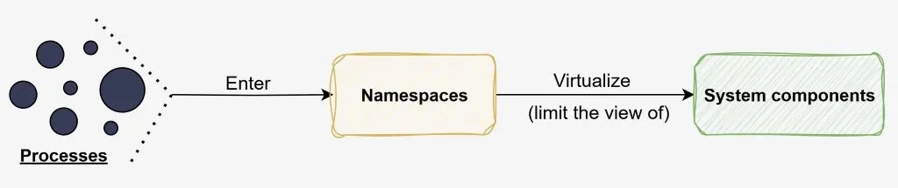
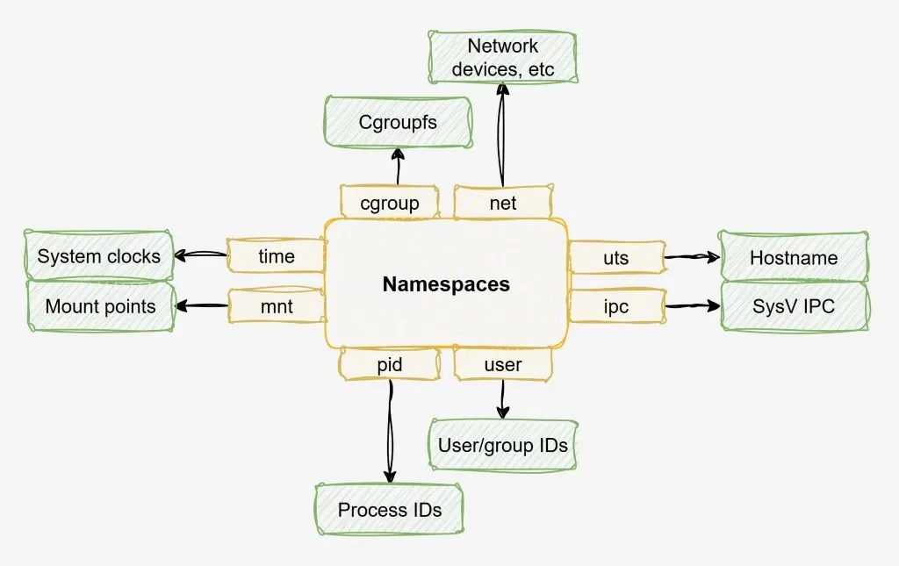

[source](https://www.hackerstack.org/understanding-linux-namespaces/)

- [ Understanding Linux Namespaces](#link_1)
  - [ What are Linux Namespaces](#link_2)
  - [ Linux Namespaces Types](#link_3)
  - [ Listing namespaces](#link_4)
  - [ Initial System Namespaces](#link_5)
  - [ Listing namespaces of a specific process](#link_6)
  - [ Listing all the processes of a namespace](#link_7)
  - [ Listing processes in same namespaces as PID](#link_8)
  - [ Running programs inside new Linux namespaces](#link_9)
    - [ Run a program inside a newly created namespace](#link_10)
    - [ More about the unshare command](#link_11)
    - [ Example: running bash into a newly created network namespace](#link_12)
  - [ Entering existing Linux namespaces](#link_13)
    - [ Run programs inside other processes namespaces](#link_14)
    - [ Enter specific namespaces of other processes](#link_15)
    - [ More about the nsenter command](#link_16)
  - [ Exploring namespaces of a Docker container](#link_17)

## Understanding Linux Namespaces <a name="link_1"></a>

Namespaces are one of the Linux Kernel features making containers a reality. In this post, we are going to learn what Linux Namespaces are and how they work through simple explanations, illustrations and examples.

### What are Linux Namespaces <a name="link_2"></a>

[Linux namespaces](https://man7.org/linux/man-pages/man7/namespaces.7.html?ref=hackerstack.org) can be used to provide processes a limited view on some of the system components. This is an important piece when we want to isolate processes from each other. Containerization tools like Docker and Containerd take advantage of Linux Namespaces to isolate containers.



### Linux Namespaces Types <a name="link_3"></a>



Depending on which system component we want to restrict processes view from, we need to use specific namespaces types. The types of namespaces available on the system can be listed as follows:

```
$ lsns -o TYPE
TYPE
time      # Virtualizes the view on some of the system clocks values
ipc       # Virtualizes the view on System V IPC and POSIX message queues
cgroup    # Virtualizes the view on Cgroups
user      # Virtualizes the view on user and group IDs
net       # Virtualizes the view on Network devices, stacks, ports, etc
uts       # Virtualizes the view on hostname and NIS domain name
mnt       # Virtualizes the view on mount points
pid       # Virtualizes the view on process IDs
```

For a detailed description about what each namespace type does, have a look at this:

- [man 7 time_namespaces](https://man7.org/linux/man-pages/man7/time_namespaces.7.html?ref=hackerstack.org)
- [man 7 ipc_namespaces](https://man7.org/linux/man-pages/man7/ipc_namespaces.7.html?ref=hackerstack.org)
- [man 7 cgroup_namespaces](https://man7.org/linux/man-pages/man7/cgroup_namespaces.7.html?ref=hackerstack.org)
- [man 7 user_namespaces](https://man7.org/linux/man-pages/man7/user_namespaces.7.html?ref=hackerstack.org)
- [man 7 network_namespaces](https://man7.org/linux/man-pages/man7/network_namespaces.7.html?ref=hackerstack.org)
- [man 7 uts_namespaces](https://man7.org/linux/man-pages/man7/uts_namespaces.7.html?ref=hackerstack.org)
- [man 7 mount_namespaces](https://man7.org/linux/man-pages/man7/mount_namespaces.7.html?ref=hackerstack.org)
- [man 7 pid_namespaces](https://man7.org/linux/man-pages/man7/pid_namespaces.7.html?ref=hackerstack.org)

### Listing namespaces <a name="link_4"></a>

The 'lsns' command can be used to list namespaces used by processes. Running that command will by default list namespaces the current user can see (read from the [procfs](https://www.hackerstack.org/how-to-interact-with-linux-kernel-through-procfs-and-sysfs) pseudo filesystem)

```
# Who is the current user?
$ whoami
ubuntu

# Listing namespaces as user ubuntu
$ lsns
        NS TYPE   NPROCS   PID USER   COMMAND
4026531834 time        3 74838 ubuntu /lib/systemd/systemd --user
4026531835 cgroup      3 74838 ubuntu /lib/systemd/systemd --user
4026531836 pid         3 74838 ubuntu /lib/systemd/systemd --user
4026531837 user        3 74838 ubuntu /lib/systemd/systemd --user
4026531838 uts         3 74838 ubuntu /lib/systemd/systemd --user
4026531839 ipc         3 74838 ubuntu /lib/systemd/systemd --user
4026531840 net         3 74838 ubuntu /lib/systemd/systemd --user
4026531841 mnt         3 74838 ubuntu /lib/systemd/systemd --user

# Switched to root user
$ whoami
root

# Listing namespaces as user root
$ lsns
        NS TYPE   NPROCS     PID USER             COMMAND
4026531835 cgroup    129       1 root             /sbin/init
4026531836 pid       126       1 root             /sbin/init
4026531837 user      129       1 root             /sbin/init
4026531838 uts       123       1 root             /sbin/init
4026531839 ipc       126       1 root             /sbin/init
4026531840 mnt       118       1 root             /sbin/init
4026531860 mnt         1      21 root             kdevtmpfs
4026531992 net       126       1 root             /sbin/init
4026532144 mnt         1 1770518 root             /lib/systemd/systemd-udevd
4026532146 mnt         3 1766779 root             nginx: master process nginx -g daemon off;
4026532147 uts         3 1766779 root             nginx: master process nginx -g daemon off;
4026532149 ipc         3 1766779 root             nginx: master process nginx -g daemon off;
4026532150 pid         3 1766779 root             nginx: master process nginx -g daemon off;
4026532152 net         3 1766779 root             nginx: master process nginx -g daemon off;
4026532204 mnt         1     697 root             /usr/sbin/irqbalance --foreground
4026532206 mnt         1     745 root             /usr/sbin/ModemManager
4026532227 mnt         1 1770505 systemd-timesync /lib/systemd/systemd-timesyncd
4026532228 mnt         1 1770508 systemd-network  /lib/systemd/systemd-networkd
4026532229 uts         1 1770518 root             /lib/systemd/systemd-udevd
4026532231 mnt         1 1770495 systemd-resolve  /lib/systemd/systemd-resolved
4026532232 mnt         1 1770551 root             /lib/systemd/systemd-logind
4026532233 uts         1 1770505 systemd-timesync /lib/systemd/systemd-timesyncd
4026532234 uts         1 1770551 root             /lib/systemd/systemd-logind
```

For each namespace in the output of the 'lsns' command, we see from left to right:

- NS - the namespace ID
- TYPE - the namespace type
- NPROCS - the number of processes in the namespace
- PID - the lowest process ID in the namespace
- USER - the username of the PID
- COMMAND - the command of the PID

For more about the available fields that can be displayed, use 'lsns --help'.

### Initial System Namespaces <a name="link_5"></a>

The Linux system starts with namespaces of each types. To prove that, we can list the namespaces of the first process of the system (PID 1):

```
# Listing namespaces of process with PID 1
(root)$ lsns -p 1
        NS TYPE   NPROCS PID USER COMMAND
4026531834 time      178   1 root /sbin/init
4026531835 cgroup    178   1 root /sbin/init
4026531836 pid       123   1 root /sbin/init
4026531837 user      178   1 root /sbin/init
4026531838 uts       120   1 root /sbin/init
4026531839 ipc       123   1 root /sbin/init
4026531840 mnt       115   1 root /sbin/init
4026531992 net       123   1 root /sbin/init
```

During the Linux boot process, once the kernel loaded in RAM by the bootloader, the first process that is created to initialize the system has the PID 1. As shown in the result of the preceding command, the first process of the system belongs to namespaces of all the available types.

### Listing namespaces of a specific process <a name="link_6"></a>

To list namespaces used by a specific process, we can use the following command:

```
# Syntax
# lsns -p PID

# Listing namespaces of process with PID 1
$ lsns -p 1
        NS TYPE   NPROCS PID USER COMMAND
4026531834 time      129   1 root /sbin/init
4026531835 cgroup    129   1 root /sbin/init
4026531836 pid       126   1 root /sbin/init
4026531837 user      129   1 root /sbin/init
4026531838 uts       123   1 root /sbin/init
4026531839 ipc       126   1 root /sbin/init
4026531840 mnt       118   1 root /sbin/init
4026531992 net       126   1 root /sbin/init

# Listing namespaces of process with PID 1766779
$ lsns -p 1766779
        NS TYPE   NPROCS     PID USER COMMAND
4026531834 time      129       1 root /sbin/init
4026531835 cgroup    129       1 root /sbin/init
4026531837 user      129       1 root /sbin/init
4026532146 mnt         3 1766779 root nginx: master process nginx -g daemon off;
4026532147 uts         3 1766779 root nginx: master process nginx -g daemon off;
4026532149 ipc         3 1766779 root nginx: master process nginx -g daemon off;
4026532150 pid         3 1766779 root nginx: master process nginx -g daemon off;
4026532152 net         3 1766779 root nginx: master process nginx -g daemon off;
```

The last command shows that the process with PID 1766779 belongs to the default system namespaces for 'time', 'cgroup' and 'user' (because the associated process IDs for those namespaces is 1) but is part of additional namespaces for the other namespaces types (mnt, uts, ipc, pid and net).

### Listing all the processes of a namespace <a name="link_7"></a>

To list all the processes belonging to a specific namespace, we can use the following command:

```
# Syntaxt
# lsns NAMESPACE_ID

# Listing processes belonging to namespace with ID 4026531836
$ lsns 4026531836
    PID    PPID USER   COMMAND
1739571       1 ubuntu /lib/systemd/systemd --user
1770724 1770723 ubuntu -bash
1772249 1770724 ubuntu └─lsns 4026531836
```

For each process in the output of the listing command, we see from left to right:

- PID - The ID of the process
- PPID - The ID of the parent process
- USER - The name of the user owning the process
- COMMAND - The command of the process

### Listing processes in same namespaces as PID <a name="link_8"></a>

To list processes belonging to the same namespace as another process, we can use the following commands:

```
# Syntax 1 (consider namespaces of all types)
# pgrep --ns PID -a

# Example 1:
# Listing processes belonging to same namespaces
# as process with ID 1739571 (consider namespaces of all types)

$ pgrep --ns 1739571 -a
1739571 /lib/systemd/systemd --user
1770724 -bash

# Syntax 2 (consider namespaces of types NSTYPE only)
# pgrep --ns PID -a --nslist NSTYPE
# NSTYPE = time, cgroup, user, ...

# Example 2:
# Listing processes belonging to same namespaces
# as process with ID 1739571 (consider namespaces of type user only)

$ pgrep --ns 1739571 -a --nslist user
1739571 /lib/systemd/systemd --user
1770724 -bash

# Example 3:
# Listing processes belonging to same namespaces
# as process with ID 1739571 (consider namespaces
# of types user, ipc and pid only)

$ pgrep --ns 1739571 -a --nslist user,ipc,pid
1739571 /lib/systemd/systemd --user
1770724 -bash
```

### Running programs inside new Linux namespaces <a name="link_9"></a>

To run a program inside new namespaces, we can use the 'unshare' command. The types of namespaces we want to create for running the program are specified as one or more flags of the 'unshare' command. Here are examples.

#### Run a program inside a newly created namespace <a name="link_10"></a>

To run myprogram inside a newly created network namespace, use:

```
unshare --net myprogram
```

To run myprogram inside two newly created network and cgroup namespaces, use:

```
unshare --net --cgroup myprogram
```

#### More about the unshare command <a name="link_11"></a>

For the list of available flags for each namespace types, use:

```
unshare --help
```

When a program is not specified for the 'unshare' command, the default program that will be run is the one specified by the environment variable `$SHELL` (default to /bin/sh).

#### Example: running bash into a newly created network namespace <a name="link_12"></a>

To run the bash program inside a new namespace of type 'net' for instance, we can use the following command:

```
(root)$ unshare --net bash
```

By default, inside that new network namespace, we only see the loopback network interface:

```
(root)$ ip a
1: lo: <LOOPBACK> mtu 65536 qdisc noop state DOWN group default qlen 1000
    link/loopback 00:00:00:00:00:00 brd 00:00:00:00:00:00
```

Inside that new network namespace, the routing and arp tables views are also different from the ones we see outside the namespace... they are empty:

```
(root)$ route -n
(root)$ arp -a
```

If we run the same command outside the namespace, we get this:

```
(root)$ route -n
Kernel IP routing table
Destination     Gateway         Genmask         Flags Metric Ref    Use Iface
0.0.0.0         172.18.208.1    0.0.0.0         UG    100    0        0 eth0
172.17.0.0      0.0.0.0         255.255.0.0     U     0      0        0 docker0
172.18.0.0      0.0.0.0         255.255.0.0     U     0      0        0 br-7642594ed86e
172.18.208.0    0.0.0.0         255.255.240.0   U     0      0        0 eth0
172.18.208.1    0.0.0.0         255.255.255.255 UH    100    0        0 eth0

(root)$ arp -a
? (172.17.0.2) at 02:42:ac:11:00:02 [ether] on docker0
DESKTOP-0HQ48FL.mshome.net (172.18.208.1) at 00:15:5d:73:9d:ba [ether] on eth0
DESKTOP-0HQ48FL.mshome.net (172.18.208.1) at <incomplete> on br-7642594ed86e
test.mshome.net (172.18.208.73) at <incomplete> on br-7642594ed86e
```

### Entering existing Linux namespaces <a name="link_13"></a>

To run a program inside one or more namespaces of other processes, we can use the 'nsenter' command as follows.

#### Run programs inside other processes namespaces <a name="link_14"></a>

Enter all namespaces of the process with PID 8256 and run the bash command:

```
nsenter -t 8256 --all bash
```

#### Enter specific namespaces of other processes <a name="link_15"></a>

Enter the mount namespace of the process with PID 8256:

```
nsenter -t 8256 --mount
```

#### More about the nsenter command <a name="link_16"></a>

For the list of available flags for each namespace types, use:

```
nsenter --help
```

When a program is not specified for the 'nsenter' command, the default program that will be run is the one specified by the environment variable `$SHELL` (default to /bin/sh).

### Exploring namespaces of a Docker container <a name="link_17"></a>

```
# No container running yet
$ ps aux | grep nginx | grep -v grep

# Nginx container creation
$ docker run -d nginx
64c34cc1ded89d9f5604eecc861bd4df0c85494649090eb2b3dc171f2a92b644

# Here it is
$ docker ps
CONTAINER ID   IMAGE     COMMAND                  CREATED          STATUS          PORTS     NAMES
64c34cc1ded8   nginx     "/docker-entrypoint.…"   39 seconds ago   Up 36 seconds   80/tcp    awesome_banzai

# Here are the processes created by the container
$ ps aux | grep nginx | grep -v grep
root        8256  0.0  0.1  11456  7472 ?        Ss   May19   0:00 nginx: master process nginx -g daemon off;
systemd+    8316  0.0  0.0  11920  2892 ?        S    May19   0:00 nginx: worker process
systemd+    8317  0.0  0.0  11920  2892 ?        S    May19   0:00 nginx: worker process
```

The processes using the 'nginx' command are from the docker container. Let's list the namespaces of one of those processes:

```
$ lsns -p 8256
        NS TYPE   NPROCS   PID USER COMMAND
4026531834 time      122     1 root /sbin/init
4026531835 cgroup    122     1 root /sbin/init
4026531837 user      122     1 root /sbin/init
4026532155 mnt         3  8256 root nginx: master process nginx -g daemon off;
4026532156 uts         3  8256 root nginx: master process nginx -g daemon off;
4026532157 ipc         3  8256 root nginx: master process nginx -g daemon off;
4026532158 pid         3  8256 root nginx: master process nginx -g daemon off;
4026532160 net         3  8256 root nginx: master process nginx -g daemon off;
```

The view of that process on system components is limited through namespaces of types other than time, cgroup and user. As shown in the preceding command, the namespaces the process with PID 8256 belongs to for time, cgroup and user are the initial system namespaces containing PID 1 (/sbin/init command). Therefore, host system components related to those namespaces types are not isolated from the nginx container processes.

The nginx container processes belong to newly created namespaces of types mnt, uts, ipc, pid and net (lowest PID of the namespaces corresponds to nginx PID), and therefore only host system components related to those namespaces types are isolated from the nginx container processes.

For the namespace of type 'net' (network) for instance, here are the network interfaces the nginx process (PID 8256) sees:

```
$ nsenter -t 8256 --net
$ ip a
1: lo: <LOOPBACK,UP,LOWER_UP> mtu 65536 qdisc noqueue state UNKNOWN group default qlen 1000
    link/loopback 00:00:00:00:00:00 brd 00:00:00:00:00:00
    inet 127.0.0.1/8 scope host lo
       valid_lft forever preferred_lft forever
5: eth0@if6: <BROADCAST,MULTICAST,UP,LOWER_UP> mtu 1500 qdisc noqueue state UP group default
    link/ether 02:42:ac:11:00:02 brd ff:ff:ff:ff:ff:ff link-netnsid 0
    inet 172.17.0.2/16 brd 172.17.255.255 scope global eth0
       valid_lft forever preferred_lft forever
```

and the network interfaces that are actually available on the host system:

```
$ ip a
1: lo: <LOOPBACK,UP,LOWER_UP> mtu 65536 qdisc noqueue state UNKNOWN group default qlen 1000
    link/loopback 00:00:00:00:00:00 brd 00:00:00:00:00:00
    inet 127.0.0.1/8 scope host lo
       valid_lft forever preferred_lft forever
    inet6 ::1/128 scope host
       valid_lft forever preferred_lft forever
2: eth0: <BROADCAST,MULTICAST,UP,LOWER_UP> mtu 1500 qdisc mq state UP group default qlen 1000
    link/ether 52:54:00:2c:e2:ea brd ff:ff:ff:ff:ff:ff
    inet 172.19.22.97/20 brd 172.19.31.255 scope global eth0
       valid_lft forever preferred_lft forever
    inet 172.18.208.73/20 brd 172.18.223.255 scope global dynamic eth0
       valid_lft 84950sec preferred_lft 84950sec
    inet6 fe80::5054:ff:fe2c:e2ea/64 scope link
       valid_lft forever preferred_lft forever
3: br-7642594ed86e: <NO-CARRIER,BROADCAST,MULTICAST,UP> mtu 1500 qdisc noqueue state DOWN group default
    link/ether 02:42:d2:37:fb:2a brd ff:ff:ff:ff:ff:ff
    inet 172.18.0.1/16 brd 172.18.255.255 scope global br-7642594ed86e
       valid_lft forever preferred_lft forever
4: docker0: <BROADCAST,MULTICAST,UP,LOWER_UP> mtu 1500 qdisc noqueue state UP group default
    link/ether 02:42:24:2a:a3:ce brd ff:ff:ff:ff:ff:ff
    inet 172.17.0.1/16 brd 172.17.255.255 scope global docker0
       valid_lft forever preferred_lft forever
    inet6 fe80::42:24ff:fe2a:a3ce/64 scope link
       valid_lft forever preferred_lft forever
6: veth5b9d547@if5: <BROADCAST,MULTICAST,UP,LOWER_UP> mtu 1500 qdisc noqueue master docker0 state UP group default
    link/ether ea:b1:a8:41:e8:b3 brd ff:ff:ff:ff:ff:ff link-netnsid 0
    inet6 fe80::e8b1:a8ff:fe41:e8b3/64 scope link
       valid_lft forever preferred_lft forever
```

This demonstrates that the container has its own view on the network (devices, routing table, etc) that is isolated from the host networking components. Same type of isolation also applies for the container mounted file systems ([mnt namespace](https://man7.org/linux/man-pages/man7/mount_namespaces.7.html?ref=hackerstack.org)), processes it sees ([pid namespace](https://man7.org/linux/man-pages/man7/pid_namespaces.7.html?ref=hackerstack.org)), hostname ([uts namespace](https://man7.org/linux/man-pages/man7/uts_namespaces.7.html?ref=hackerstack.org)) and IPC ([ipc namespace](https://man7.org/linux/man-pages/man7/ipc_namespaces.7.html?ref=hackerstack.org)).

---

That's all. Hope you better understand Linux namespaces now.
