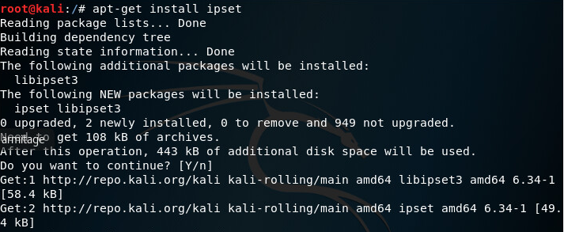
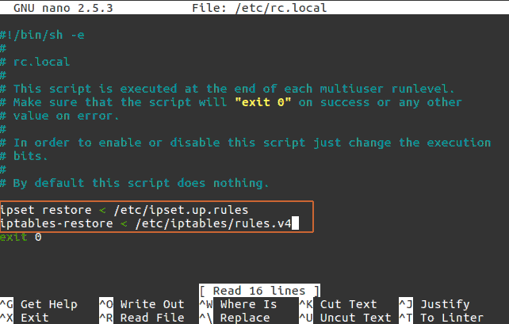

[источник](https://itsecforu.ru/2017/11/22/%D0%BA%D0%B0%D0%BA-%D0%B8%D1%81%D0%BF%D0%BE%D0%BB%D1%8C%D0%B7%D0%BE%D0%B2%D0%B0%D1%82%D1%8C-ipset-%D0%B4%D0%BB%D1%8F-%D0%B1%D0%BB%D0%BE%D0%BA%D0%B8%D1%80%D0%BE%D0%B2%D0%BA%D0%B8-ip-%D0%B0/?ysclid=mmkqbp3nmz176246888)

## Как использовать «ipset» для блокировки IP-адресов определенной страны <a name="link_1"></a>


Автор cryptoparty На чтение 4 мин Опубликовано 22.11.2017

Ранее мы узнали, [как мы можем ограничить или разрешить доступ конкретной стране используя GeoIP](https://itsecforu.ru/2017/10/02/%d0%ba%d0%b0%d0%ba-%d0%b7%d0%b0%d0%b1%d0%bb%d0%be%d0%ba%d0%b8%d1%80%d0%be%d0%b2%d0%b0%d1%82%d1%8c-ip-%d0%b0%d0%b4%d1%80%d0%b5%d1%81%d0%b0-%d0%b8%d0%b7-%d1%81%d1%82%d1%80%d0%b0%d0%bd-%d0%b8%d1%81/) в этой статье, мы рассмотрим, как мы можем блокировать большие диапазоны IP-адресов, используя ipset-модули с iptables.

IPset – это набор IP-адресов на основе командной строки внутри ядра Linux.

IP-адреса, сети, (TCP / UDP) номера портов, MAC-адреса, имена интерфейсов или их комбинации таким образом, который обеспечивает молниеносную скорость при сопоставлении записи с набором.

Это ассоциативное приложение для брандмауэра iptables Linux, которое позволяет быстро и легко блокировать набор IP-адресов.

Здесь мы рассмотрим, как использовать модули ipset с IP-адресами на нашей машине на базе Linux.

Содержание

- [ Как использовать «ipset» для блокировки IP-адресов определенной страны](#link_1)
  - [ Обновление нашей системы](#link_2)
  - [ Установка IPset](#link_3)
  - [ Создание наборов IP-адресов](#link_4)
  - [ Применение набора IP](#link_5)
  - [ Постоянное применение правил](#link_6)
  - [ В системе RHEL](#link_7)

### Обновление нашей системы <a name="link_2"></a>

Прежде всего, нам нужно будет обновить наши пакеты для нашей Linux-машины, чтобы обновить наши пакеты программного обеспечения. Ч

тобы обновить нашу систему, нам нужно убедиться, что мы работаем как пользователь sudo или root.

Чтобы переключиться на доступ к sudo или root, мы выполним следующую команду.

```bash
sudo -s
```

Когда мы root, мы будем двигаться вперед для обновления нашей системы.

**Система на базе Debian**

```bash
apt update apt upgrade
```

**Система Redhat**

```bash
yum update
```

### Установка IPset <a name="link_3"></a>

Большинство дистрибутивов Linux, таких как Ubuntu, Debian, поставляются с ipset, предварительно установленным.

В Centos IPset не был предварительно установлен, поэтому нам нужно будет его установить.

Мы можем установить его, выполнив следующую команду в зависимости от используемого вами дистрибутива


**Система на базе Debian**

```bash
apt install ipset
```

**Система Redhat**

```bash
yum install ipset
```

### Создание наборов IP-адресов <a name="link_4"></a>

Теперь, когда у нас установлен ipset, мы теперь перейдем к созданию наборов IP.

Теперь нам нужно создать ipset, который содержит сетевые подсети, которые мы хотим заблокировать или ограничить.

Итак, сначала нам нужно получить список сетевых подсетей, которые мы хотим добавить в ip-пакеты.

На сайте [Country IP Blocks](https://www.countryipblocks.net/), и мы можем получить списки подсетей со страницы выбора страны.

Здесь мы выбрали несколько подсетей Китая для целей тестирования.

```
1.0.1.0/24
1.0.2.0/23
1.0.8.0/21
1.0.32.0/19
1.1.0.0/24
1.1.2.0/23
1.10.8.0/23
1.202.0.0/15
5.10.68.240/29
5.10.70.40/30
5.10.72.16/29
```

Вот пример сетевых подсетей, которые мы будем блокировать в этой статье, но в реальном мире у нас будет огромное количество подсетей.

Итак, мы будем использовать любой язык сценариев / программирования и сгенерируем список команд следующим образом.

```bash
ipset create countryblock hash:net
ipset add countryblock 1.0.1.0/24
ipset add countryblock 1.0.2.0/23
ipset add countryblock 1.0.8.0/21
ipset add countryblock 1.1.0.0/24
ipset add countryblock 1.1.2.0/23
ipset add countryblock 1.10.8.0/23
ipset add countryblock 1.202.0.0/15
ipset add countryblock 5.10.68.240/29
ipset add countryblock 5.10.70.40/30
ipset add countryblock 5.10.72.16/29
```


### Применение набора IP <a name="link_5"></a>

Теперь, когда наши ip-пакеты готовы, мы теперь применим эти ip-блоки для блокировки с помощью ipset-модуля с iptables.

```bash
iptables -A INPUT -m set --match-set countryblock src -j DROP
```

Вышеупомянутая команда блокирует трафик, исходящий из диапазонов ip, определенных подсетей в вышеописанном сгенерированном наборе, называемом countryblock.

Таким образом, все перечисленные там IP-адреса будут заблокированы.

### Постоянное применение правил <a name="link_6"></a>

Если мы готовы проверить наши конфигурации и правила, мы, возможно, захотим сделать изменения постоянными.

Для этого нам нужно будет сделать следующие утверждения относительно нашего контроллера брандмауэра.

**В системе на базе Debian**

```bash
ipset save> /etc/ipset.up.rules
iptables-save> /etc/iptables/rules.v4
```

**Следующие строки добавляются в следующие строки в /etc/rc.local.**

```bash
ipset restore < /etc/ipset.up.rules
iptables-restore < /etc/iptables/rules.v4
```



### В системе RHEL <a name="link_7"></a>

```bash
ipset save> /etc/ipset.up.rules
iptables-save> / etc / sysconfig / iptables
```

Как только мы сохраним правила как ipset, так и iptables, мы теперь получим то же, что и для Debian.

Мы просто добавим следующие команды в файл /etc/rc.local.

```bash
ipset restore < /etc/ipset.up.rules
iptables-restore < /etc/sysconfig/iptables
```

Таким образом, мы можем блокировать определенные наборы ip-адрессов, используя ipset модули с iptables. Мы можем создавать наборы разных стран, чтобы мы могли применять их в соответствии с потребностями.

Эти методы очень эффективны, когда нам нужен подобный функционал.

Для этого есть много брандмауэров и модулей iptables, но это довольно легко, быстро и удобно использовать.
