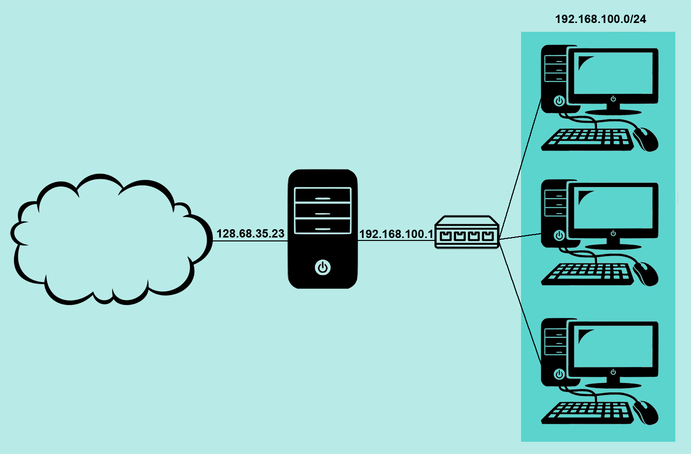

[источник](https://tokmakov.msk.ru/blog/item/473)

- [ Утилита iptables в Ubuntu](#link_1)
  - [ Цепочки правил](#link_2)
  - [ Таблицы iptables](#link_3)
  - [ Принцип работы](#link_4)
  - [ Утилита iptables](#link_5)
  - [ Поведение по умолчанию](#link_6)
  - [ Удаление всех правил](#link_7)
  - [ Действия с соединениями](#link_8)
  - [ Критерии для пакетов](#link_9)
  - [ Критерий состояния соединения](#link_10)
  - [ Пользовательские цепочки](#link_11)
  - [ Опция –reject-with](#link_12)
  - [ Маркировка пакетов](#link_13)
  - [ Маркировка соединений](#link_14)
  - [ Сохранение изменений](#link_15)
  - [ Автозагрузка правил](#link_16)
  - [ Пример настройки web-сервера](#link_17)
    - [ 1. Политика ACCEPT для OUTPUT](#link_18)
    - [ 2. Политика DROP для OUTPUT](#link_19)
  - [ Настройка маршрутизатора](#link_20)
    - [ Доступ в интернет (SNAT)](#link_21)
    - [ Доступ внутрь сети (DNAT)](#link_22)
      - [ Дополнительно](#link_23)

# Утилита iptables в Ubuntu <a name="link_1"></a>

Утилита `iptables` — это межсетевой экран для операционных систем Linux. С помощью правил `iptables` можно разрешать или блокировать прохождение трафика. Когда происходит попытка установления соединения с текущей машиной, `iptables` просматривает список правил в списке, чтобы понять, как нужно поступить в этом случае. Если правила нет, то выполняется действие по умолчанию.

## Цепочки правил <a name="link_2"></a>

Набор правил формируется в цепочки, существуют базовые и пользовательские цепочки. Список базовых цепочек:

- `PREROUTING` — правила в этой цепочке применяются ко всем пакетам, которые поступают на сетевой интерфейс извне
- `INPUT` — применяются к пакетам, которые предназначаются для самого хоста или для процесса на данном хосте
- `FORWARD` — правила, которые применяются к транзитным пакетам, проходящим через хост, не задерживаясь
- `OUTPUT` — применяются к пакетам, которые сгенерированы самим хостом или процессами на данном хосте
- `POSTROUTING` — применяются к пакетам, которые должны покинуть сетевой интерфейс данного хоста


## Таблицы iptables <a name="link_3"></a>

Над цепочками правил в `iptables` есть еще один уровень абстракции — таблицы. Таблицы предназначены для выполнения разных действий над пакетами, например для модификации или фильтрации:

- `raw` — предназначена для работы с сырыми пакетами, пока они еще не прошли обработку
- `mangle` — предназначена для модификации различных заголовков пакета
- `nat` — обеспечивает работу NAT, если сервер используется в качестве маршрутизатора
- `filter` — основная таблица для фильтрации пакетов, используется по умолчанию

## Принцип работы <a name="link_4"></a>

Входящий пакет начинает обрабатываться брандмауэром с цепочки `PREROUTING` в таблице `mangle`. Затем он обрабатывается правилами цепочки `PREROUTING` таблицы `nat`. На этом этапе проверяется, не требуется ли модификация назначения пакета (`DNAT`). Важно сменить назначение сейчас, потому что маршрут пакета определяется сразу после того, как он покинет цепочку `PREROUTING`. После этого он будет отправлен на цепочку `INPUT` (если целью пакета является этот компьютер) или `FORWARD` (если его целью является другой компьютер в сети).

Если целью пакета является другой компьютер, то пакет фильтруется правилами цепочки `FORWARD` таблиц `mangle` и `filter`, а затем к нему применяются правила цепочки `POSTROUTING`. На данном этапе можно использовать `SNAT/MASQUARADE` (подмена источника/маскировка). После этих действий пакет (если выжил) будет отправлен в сеть.

Если назначением пакета является сам компьютер с брандмауэром, то, после маршрутизации, он обрабатывается правилами цепочек `INPUT` таблиц `mangle` и `filter`. В случае прохождения цепочек пакет передается приложению.

Когда приложение на машине с брандмауэром, отвечает на запрос или отправляет собственный пакет, то он обрабатывается цепочкой `OUTPUT` таблицы `filter`. Затем к нему применяются правила цепочки `OUTPUT` таблицы `nat` — для определения, требуется ли использовать `DNAT` (модификация назначения). Далее, пакет фильтруется цепочкой `OUTPUT` таблицы `filter` и выпускается в цепочку `POSTROUTING`, которая может использовать `SNAT` и `QoS`. В случае успешного прохождения `POSTROUTING` пакет выходит в сеть.

## Утилита iptables <a name="link_5"></a>

Синтаксис утилиты `iptables`:

```
$ sudo iptables [-t таблица] команда [критерий действие]
```

Если таблица не указана, подразумевается таблица `filter`. Команды могут быть:

- `-A` (или `--append`) — добавить правило в цепочку
- `-D` (или `--delete`) — удалить правило из цепочки
- `-I` (или `--insert`) — вставить правило в цепочку под указанным номером
- `-L` (или `--list`) — вывести все правила для заданной цепочки
- `-F` (или `--flush`) — очистить все правила для заданной цепочки (таблицы)
- `-N` (или `--new-chain`) — создать новую цепочку
- `-X` (или `--delete-chain`) — удалить цепочку
- `-P` (или `--policy`) — установить действие по умолчанию для цепочки

Имеются следующие дополнительные опции:

- `-v` (или `--verbose`) — увеличить подробность сообщений, при указании с командой `--list` будет выводиться имя интерфейса, параметры правил и маски TOS.
- `-n` (или `--numeric`) — выводить ip-адреса и номера портов в числовом виде, предотвращая попытки преобразовать их в символические имена.
- `--line-numbers` — показывать номера строк при отображении списка правил командой `--list` (номер строки соответствует позиции правила в цепочке).

Примеры использования утилиты:

```bash
$ sudo iptables -F  # сбросить все правила в таблице filter

$ sudo iptables -t nat -F  # сбросить все правила в таблице nat

$ sudo iptables -L --line-numbers  # посмотреть все правила в таблице filter с нумерацией

$ sudo iptables -L -v --line-numbers  # посмотреть все правила в таблице filter с нумерацией (подробно)

$ sudo iptables -t nat -L --line-numbers  # посмотреть все правила в таблице nat с нумерацией

$ sudo iptables -D INPUT 3  # удалить правило в цепочке INPUT в таблице filter по номеру

$ sudo iptables -I INPUT -p tcp --dport 80 -j ACCEPT  # вставить правило в начало цепочки INPUT в таблице filter

$ sudo iptables -A INPUT -p tcp --dport 80 -j ACCEPT  # добавить правило в конец цепочки INPUT в таблице filter

$ sudo iptables -I INPUT 3 -p tcp --dport 80 -j ACCEPT  # вставить правило в третью позицию цепочки INPUT в таблице filter
```

## Поведение по умолчанию <a name="link_6"></a>

Прежде чем приступать к настройке межсетевого экрана, следует определиться с тем, каким должно быть поведение цепочек правил по умолчанию. Другими словами, что `iptables` нужно делать в том случае, если соединение не подпадает ни под одно из сконфигурированных правил?

Изначально все три цепочки таблицы `filter` по умолчанию разрешают прием трафика:

```bash
$ sudo iptables -L
```

```
Chain INPUT (policy ACCEPT)
target     prot opt source               destination

Chain FORWARD (policy ACCEPT)
target     prot opt source               destination

Chain OUTPUT (policy ACCEPT)
target     prot opt source               destination
```

Если же что-то менялось, а теперь нужно вернуть прежние настройки, то сделать это можно с помощью команд:

```bash
$ sudo iptables -P INPUT ACCEPT
$ sudo iptables -P OUTPUT ACCEPT
$ sudo iptables -P FORWARD ACCEPT
```

Можно пойти по другому пути и сначала запретить весь трафик, а затем выборочно разрешать его:

```bash
$ sudo iptables -P INPUT DROP
$ sudo iptables -P OUTPUT DROP
$ sudo iptables -P FORWARD DROP
```

## Удаление всех правил <a name="link_7"></a>

Удаление всех сконфигурированных правил таблицы `filter`

```bash
$ sudo iptables -F
```

Удаление всех сконфигурированных правил таблицы `nat`

```bash
$ sudo iptables -t nat -F
```

Удаление всех сконфигурированных правил цепочки `INPUT` таблицы `filter`

```bash
$ sudo iptables -F INPUT
```

## Действия с соединениями <a name="link_8"></a>

После настройки поведения по умолчанию, можно переходить к созданию правил обработки трафика, чтобы `iptables` понимал, что делать с конкретным пакетом.

- `ACCEPT` — пакет покидает данную цепочку и передается в следующую
- `DROP` — отбросить пакет, пакет не передается в следующую цепочку
- `REJECT` — отбросить пакет, сообщить отправителю пакета об ошибке
- `SNAT` — замена ip-адреса источника в пакете, в цепочках `POSTROUTING` и `OUTPUT` таблицы `nat`
- `DNAT` — замена ip-адреса назначения в пакете, в цепочке `PREROUTING` таблицы `nat` (изредка — в `OUTPUT`)
- `LOG` — записать пакет в лог-файл (отправляется демону `syslog`) и обработать остальными правилами
- `MASQUERADE` — как `SNAT`, но для соединений с динамическим ip-адресом, в цепочке `POSTROUTING` таблицы `nat`
- `MARK` — установить метку на пакет и обработать остальными правилами
- `CONNMARK` — установить метку на пакеты одной сессии или соединения
- `RETURN` — возврат из текущей цепочки. Если из цепочки `one` правилом номер 3 пакет был направлен в цепочку `two`, то применение к нему в цепочке `two` действия `RETURN` приведет к его переходу обратно в цепочку `one`, и он продолжит ее прохождение с правила номер 4. Для базовой цепочки к пакету сразу будет применено действие по умолчанию.

Действие `MASQUERADE` является частным случаем `SNAT`, его основным отличием является то, маскарадинг самостоятельно получает ip-адрес от заданного сетевого интерфейса и не требует его явного указания. Это удобно, если на внешнем интерфейсе используется динамический ip-адрес.

```bash
$ sudo iptables -t nat -A POSTROUTING -o ens33 -s 192.168.100.0/24 -j SNAT --to-source 198.51.100.1

$ sudo iptables -t nat -A POSTROUTING -o ens33 -s 192.168.100.0/24 -j MASQUERADE
```

## Критерии для пакетов <a name="link_9"></a>

**Общие критерии** — допустимо употреблять в любых правилах, они не зависят от типа протокола и не требуют подгрузки модулей расширения:

- `-p` (или `--protocol`) — используется для указания типа протокола (`all`, `icmp`, `tcp`, `udp`)
- `-s` (или `--source`) — используется для указания ip-адреса источника; можно указать единственный ip-адрес (10.10.10.10) или диапазон ip-адресов (10.10.10.0/24)
- `-d` (или `--destination`) — используется для указания ip-адреса места назначения; можно указать единственный ip-адрес (10.10.10.10) или диапазон ip-адресов (10.10.10.0/24)
- `-i` (или `--in-interface`) — интерфейс, с которого был получен пакет, допускается только в цепочках `INPUT`, `FORWARD` и `PREROUTING`; при отсутствии этого критерия предполагается любой интерфейс
- `-o` (или `--out-interface`) — интерфейс, с которого будет отправлен пакет, допускается только в цепочках `OUTPUT`, `FORWARD` и `POSTROUTING`; при отсутствии этого критерия предполагается любой интерфейс

**Неявные критерии** — неявно подгружают модули расширений и становятся доступны при указании критерия `--protocol`. Рассмотрим некоторые из них:

- `-p tcp --sport` (или `--source-port`) — исходный порт, с которого был отправлен TCP-пакет. В качестве параметра может указываться номер порта или название сетевой службы. Соответствие имен сервисов и номеров портов можно найти в файле `/etc/services`. Номера портов могут задаваться в виде интервала из минимального и максимального номеров.
- `-p tcp --dport` (или `--destination-port`) — порт или диапазон портов, на который адресован TCP-пакет. Аргументы задаются в том же формате, что и для `--source-port`.
- `-p udp --sport` (или `--source-port`) — исходный порт, с которого был отправлен UDP-пакет. В качестве параметра может указываться номер порта или название сетевой службы. Соответствие имен сервисов и номеров портов можно найти в файле `/etc/services`. Номера портов могут задаваться в виде интервала из минимального и максимального номеров.
- `-p udp --dport` (или `--destination-port`) — порт или диапазон портов, на который адресован UDP-пакет. Аргументы задаются в том же формате, что и для `--source-port`.

**Явные критерии** — требуют явной подгрузки модулей расширения с помощью опции `-m` или `--match`. Например, если планируется использовать критерий `state`, то нужно явно указать `-m state` левее используемого критерия. Рассмотрим некоторые из них:

- `-m conntrack --ctstate _STATES_` — проверяет признак состояния соединения: `NEW`, `ESTABLISHED`, `RELATED` и `INVALID`. Состояние `NEW` подразумевает, что пакет открывает новое соединение или пакет принадлежит однонаправленному потоку. Состояние `ESTABLISHED` указывает на то, что пакет принадлежит уже установленному соединению, через которое пакеты идут в обеих направлениях. Состояние `RELATED` указывает на то, что пакет принадлежит уже существующему соединению, но при этом он открывает новое соединение. Состояние `INVALID` подразумевает, что пакет связан с неизвестным потоком или соединением и, возможно содержит ошибку в данных или в заголовке.
- `-m state --state _STATES_` (устарел, не рекомендуется) — проверяет признак состояния соединения: `NEW`, `ESTABLISHED`, `RELATED` и `INVALID`.
- `-m multiport --source-port _PORTS_` — служит для указания списка исходящих портов, можно указать до 15 различных портов. Названия портов в списке должны отделяться друг от друга запятыми, пробелы в списке недопустимы. Может использоваться только совместно с критериями `-p tcp` или `-p udp`. Главным образом используется как расширенная версия обычного критерия `--source-port`.
- `-m multiport --destination-port _PORTS_` — служит для указания списка входящих портов, можно указать до 15 различных портов. Названия портов в списке должны отделяться друг от друга запятыми, пробелы в списке недопустимы. Может использоваться только совместно с критериями `-p tcp` или `-p udp`. Главным образом используется как расширенная версия обычного критерия `--destination-port`.
- `-m multiport --port _PORTS_` — проверяет как исходящий так и входящий порт пакета. Формат аргументов аналогичен критерию `--source-port` и `--destination-port`. Данный критерий проверяет порты обоих направлений, если задан критерий `-m multiport --port 80` — под него попадают пакеты, идущие с порта 80 на порт 80.
- `-m mac --mac-source _MAC_` — MAC адрес сетевого узла, передавшего пакет, в формате `XX:XX:XX:XX:XX:XX`. Имеет смысл только в цепочках `PREROUTING`, `FORWARD` и `INPUT` и нигде более.
- `-m iprange --src-range _IP-IP_` — позволяет указать диапазон ip-адресов источника, например 192.168.1.10-192.168.2.20
- `-m iprange --dst-range _IP-IP_` — позволяет указать диапазон ip-адресов места назначения, например 192.168.1.10-192.168.2.20
- `-m mark --mark 15` — позволяет выделять пакеты с заданной маркировкой (`nfmark`)
- `-m connmark --mark 15` — полностью аналогичен `mark`, но проверяет не маркировку пакета (`nfmark`), а маркировку соединения (`ctmark`)

## Критерий состояния соединения <a name="link_10"></a>

Как сказано выше, многие протоколы требуют двусторонних коммуникаций. Например, если нужно разрешить соединения по SSH, то добавить правила надо будет и в цепочку `INPUT` и в цепочку `OUTPUT`. Но что, если нужно разрешить только входящие SSH-соединения на сервер (т.е. только возможность подключиться к серверу по SSH)? Разрешит ли добавление правила в цепочку `OUTPUT` и исходящие SSH-соединения (т.е. с сервера можно будет подключиться по SSH к другому хосту)?

Для таких случаев используются состояния соединений. Они позволяют описывать двусторонние коммуникации, в которых разрешается установка только соединений определенной направленности. В примере ниже разрешены SSH-соединения, поступающие от хоста 10.10.10.10, но SSH-соединения к этому хосту запрещены. Однако, системе разрешается отправка информации по SSH в случае уже установленного соединения, что делает возможной SSH-коммуникацию между хостами:

```bash
$ sudo iptables -A INPUT -p tcp --dport 22 -s 10.10.10.10 -m state --state NEW,ESTABLISHED -j ACCEPT

$ sudo iptables -A OUTPUT -p tcp --sport 22 -d 10.10.10.10 -m state --state ESTABLISHED -j ACCEPT
```

## Пользовательские цепочки <a name="link_11"></a>

Предположим, что нам нужно обеспечить доступ к определенным портам нашего сервера для всех хостов из подсети `10.134.0.64/26`, кроме двух — `10.134.0.67` и `10.134.0.100`.

```bash
$ sudo iptables -F # Очищаем все цепочки таблицы filter
```

Создаем специальную цепочку для проверки пакетов из нашей подсети

```bash
$ sudo iptables -N our_subnet
$ sudo iptables -A our_subnet -s 10.134.0.67 -j RETURN # Запрещенный хост — выходим
$ sudo iptables -A our_subnet -s 10.134.0.100 -j RETURN # Запрещенный хост — выходим
```

Всем остальным хостам подсети разрешаем доступ к нужным портам

```bash
$ sudo iptables -A our_subnet -p tcp -m multiport --dports 22,53,8080,139,445 -j ACCEPT
$ sudo iptables -A our_subnet -p udp -m multiport --dports 53,123,137,138 -j ACCEPT
$ sudo iptables -A our_subnet -p icmp --icmp-type 8 -j ACCEPT
```

Разрешаем пакеты, если соединение уже было установлено ранее

```bash
$ sudo iptables -A INPUT -m conntrack --ctstate ESTABLISHED,RELATED -j ACCEPT
```

Все пакеты из нашей подсети отправляем на проверку в цепочку `our_subnet`

```bash
$ sudo iptables -A INPUT -s 10.134.0.64/26 -j our_subnet
$ sudo iptables -P INPUT DROP # Что не разрешено — то запрещено
$ sudo iptables -P OUTPUT ACCEPT # На выход — можно все
```

Теперь все новые входящие пакеты, отправленные из нашей подсети `10.134.0.64/26`, отправляются на проверку в цепочку `our_subnet`. К пакетам с «запрещенных» хостов применяется операция `RETURN`, и они покидают эту цепочку и впоследствии блокируются действием по умолчанию цепочки `INPUT`. Пакеты с остальных хостов этой подсети пропускаются в том случае, если они адресованы на порты прокси (`8080/tcp`), SSH (`22/tcp`), SMB (`139,445/tcp`, `137,138/udp`), DNS (`53/tcp`, `53/udp`), NTP (`123/udp`). Также для этих хостов разрешены ICMP-эхо-запросы (пинги). Все остальные пакеты (включая пакеты не из нашей подсети, пакеты с запрещенных хостов и пакеты на неразрешенные порты) блокируются действием по умолчанию `DROP`.

Нетрудно заметить, что в этом простом примере вместо `RETURN` можно было использовать и `DROP`. Однако, существует понятие «принципа одного запрета». При организации фильтрующих правил в рамках этого принципа, сначала следует серия разрешающих правил, исключения оформляются в виде `RETURN`, а все не разрешенные пакеты доходят до конца базовой цепочки и блокируются действием по умолчанию либо последним правилом. Следование этому принципу позволяет достичь гибкости в выборе и смене метода блокирования пакетов. Допустим, нужно сменить блокирующее действие `DROP` на `REJECT`. Нет ничего проще — просто меняем правило по умолчанию.

## Опция –reject-with <a name="link_12"></a>

Действие `REJECT` имеет необязательную опцию `--reject-with`, которая может принимать значения

- `icmp-net-unreachable` — сеть недоступна
- `icmp-host-unreachable` — узел недоступен
- `icmp-port-unreachable` — порт недоступен
- `icmp-proto-unreahable` — неподдерживаемый протокол
- `icmp-net-prohibited` — сеть запрещена
- `icmp-host-prohibited` — узел запрещен
- `tcp-reset` — отправляет RST-сообщение отправителю.

RST пакеты используются для закрытия TCP соединений. По умолчанию будет передано сообщение `port-unreachable`.

```bash
$ sudo iptables -A INPUT -s 10.26.95.20 -j REJECT --reject-with tcp-reset
```

## Маркировка пакетов <a name="link_13"></a>

Действие `MARK` устанавливает метку, которая ассоциирована с определённым пакетом. Допустимо использование только в таблице `mangle`. Следует помнить, что метка устанавливается не на сам пакет, а является неким значением для ядра, которое ассоциируется с пакетом. То есть, увидеть данную метку на это пакете на другом хосте — не получится. Для таких целей лучше использовать `TOS`, который устанавливает значение в IP-заголовок пакета.

```bash
$ sudo iptables -t mangle -A PREROUTING -p tcp --dport 22 -j MARK --set-mark 2
```

## Маркировка соединений <a name="link_14"></a>

Действие `CONNMARK` позволяет установить метку на соединение в целом. Это можно использовать в любой цепочке. Более того, эта маркировка копируется и на соединения, связанные с текущим. Впоследствии можно использовать эту метку для модификации или для маршрутизации пакетов соединения.

Однако, для модификации и маршрутизации могут использоваться только метки, установленные на пакете. Поэтому есть возможность копировать метку соединения на метку пакета. И наоборот — копировать метку пакета на метку соединения.

Опция `--set-mark` устанавливает метку на соединение.

```bash
$ sudo iptables -t nat -A PREROUTING -p tcp --dport 80 -j CONNMARK --set-mark 4
```

Опция `--save-mark` используется для копирования метки пакета на метку соединения. Например, если мы установили метку на пакет с помощью `MARK`, то с помощью `--save-mark` можно скопировать её на всё подключение целиком.

```bash
$ sudo iptables -t mangle -A PREROUTING --dport 80 -j CONNMARK --save-mark
```

Опция `--restore-mark` используется для копирования метки соединения на метку пакета. Допустимо использование только в таблице `mangle`.

```bash
$ sudo iptables -t mangle -A PREROUTING --dport 80 -j CONNMARK --restore-mark
```

## Сохранение изменений <a name="link_15"></a>

Внесенные в цепочки правил изменения пропадут при перезагрузке, так что их нужно сохранить с в файл помощью команды:

```bash
$ sudo /sbin/iptables-save > /etc/iptables.rules

$ cat /etc/iptables.rules
```

```
#Generated by iptables-save v1.6.1 on Sat Feb 15 11:58:32 2020
*filter
:INPUT DROP [0:0]
:FORWARD DROP [0:0]
:OUTPUT DROP [0:0]
-A INPUT -i lo -j ACCEPT
-A INPUT -p icmp -j ACCEPT
-A INPUT -p udp -m udp --sport 53 -m state --state ESTABLISHED -j ACCEPT
-A INPUT -p tcp -m tcp --sport 53 -m state --state ESTABLISHED -j ACCEPT
-A INPUT -p tcp -m tcp --dport 80 -j ACCEPT
-A INPUT -p tcp -m tcp --dport 443 -j ACCEPT
-A INPUT -p tcp -m tcp --dport 22 -j ACCEPT
-A INPUT -p tcp -m tcp --sport 80 -m state --state ESTABLISHED -j ACCEPT
-A OUTPUT -o lo -j ACCEPT
-A OUTPUT -p icmp -j ACCEPT
-A OUTPUT -p udp -m udp --dport 53 -j ACCEPT
-A OUTPUT -p tcp -m tcp --dport 53 -j ACCEPT
-A OUTPUT -p tcp -m tcp --sport 80 -j ACCEPT
-A OUTPUT -p tcp -m tcp --sport 443 -j ACCEPT
-A OUTPUT -p tcp -m tcp --sport 22 -j ACCEPT
-A OUTPUT -p tcp -m tcp --dport 80 -j ACCEPT
COMMIT
#Completed on Sat Feb 15 11:58:32 2020
```

После перезагрузки правила можно восстановить из файла `/etc/iptables.rules` с помощью команды:

```
$ sudo iptables-restore < /etc/iptables.rules
```

## Автозагрузка правил <a name="link_16"></a>

Понятно, что восстанавливать правила вручную после каждой перезагрузки неудобно. Поэтому устанавливаем пакет `iptables-persistent`:

```
$ sudo apt install iptables-persistent
```

При установке пакета будет предложено сохранить текущие правила `iptables`:

- в файл `/etc/iptables/rules.v4` для протокола IPv4
- в файл `/etc/iptables/rules.v6` для протокола IPv6


Теперь, после каких-либо изменений правил, надо сохранить текущее состояние в файл `/etc/iptables/rules.v4`, чтобы это состояние восстановилось после перезагрузки:

```
$ sudo iptables-save > /etc/iptables/rules.v4
```

После установки пакета будет добавлена новая служба `netfilter-persistent.service`, которая при загрузке системы будет восстанавливать правила `iptables`:

```
$ systemctl status netfilter-persistent.service
```

```
● netfilter-persistent.service - netfilter persistent configuration
   Loaded: loaded (/lib/systemd/system/netfilter-persistent.service; enabled; vendor preset: enabled)
   Active: active (exited) since Wed 2020-02-05 10:08:52 MSK; 27s ago
 Main PID: 3769 (code=exited, status=0/SUCCESS)
    Tasks: 0 (limit: 2317)
   CGroup: /system.slice/netfilter-persistent.service

фев 05 10:08:52 ubuntu-iptables systemd[1]: Starting netfilter persistent configuration...
фев 05 10:08:52 ubuntu-iptables systemd[1]: Started netfilter persistent configuration.
```

Судя по всему, скоро пакет `iptables-persistent` будет заменен на пакет `netfilter-persistent` (сейчас он устанавливается как зависимость при установке `iptables-persistent`).

## Пример настройки web-сервера <a name="link_17"></a>

### 1. Политика ACCEPT для OUTPUT <a name="link_18"></a>

Первым делом задаем политику по умолчанию:

```bash
$ sudo iptables --policy INPUT DROP
$ sudo iptables --policy OUTPUT ACCEPT
$ sudo iptables --policy FORWARD DROP
```

Разрешаем трафик через интерфейс `loopback` (будет работать `ping` для `localhost`):

```bash
$ sudo iptables -A INPUT -i lo -j ACCEPT
```

Многие приложения используют для обмена между собой интерфейс обратной петли, и без этого правила работа таких приложений будет нарушена.

Если подходить к настройке не очень фанатично, то можно разрешить работу протокола ICMP (будут работать `ping` и `traceroute`):

```bash
$ sudo iptables -A INPUT -p icmp -j ACCEPT
```

ICMP (протокол межсетевых управляющих сообщений) — сетевой протокол, входящий в стек протоколов TCP/IP. В основном ICMP используется для передачи сообщений об ошибках и других исключительных ситуациях, возникших при передаче данных.

Утилита `ping`, служащая для проверки возможности доставки IP-пакетов, использует ICMP-сообщения с типом 8 (эхо-запрос) и 0 (эхо-ответ). Утилита `traceroute`, отображающая путь следования IP-пакетов, использует ICMP-сообщения с типом 11.

Разрешаем нашему серверу получать ответы от DNS-серверов:

```bash
$ sudo iptables -A INPUT -p udp --sport 53 -m state --state ESTABLISHED -j ACCEPT
$ sudo iptables -A INPUT -p tcp --sport 53 -m state --state ESTABLISHED -j ACCEPT
```

В большинстве случаев для DNS-сообщений используется протокол UDP. Но если сообщение превышает 512 байт — используется протокол TCP. DNS-сервера работают на порту 53, поэтому разрешаем входящий TCP и UDP трафик, который идет с `source port` 53. Кроме того, уточняем — что этот трафик в ответ на запрос с нашего сервера.

Разрешаем входящие подключения к портам HTTP, HTTPS и SSH:

```bash
$ sudo iptables -A INPUT -p tcp --dport 80 -j ACCEPT
$ sudo iptables -A INPUT -p tcp --dport 443 -j ACCEPT
$ sudo iptables -A INPUT -p tcp --dport 22 -j ACCEPT
```

Наш web-сервер (Apache или Nginx) прослушивает порты 80 и 443, а SSH-сервер — порт 22. Поэтому разрешаем входящий TCP трафик, который идет на `destination port` 80, 443 и 22.

Чтобы можно было устанавливать и обновлять пакеты с помощью утилиты `apt`:

```bash
$ sudo iptables -A INPUT -p tcp --sport 80 -m state --state ESTABLISHED -j ACCEPT
```

Любой исходящий трафик у нас разрешен, поэтому утилита `apt` может отправлять запросы на сервер репозитория. Но ей еще нужно получать ответы, поэтому разрешаем входящий TCP трафик, который идет с `source port` 80. Кроме того, уточняем — что этот трафик в ответ на запрос с нашего сервера.

Теперь можно проверить добавленные правила командой:

```bash
$ sudo iptables -L -v --line-numbers
```

```
Chain INPUT (policy DROP 0 packets, 0 bytes)
num   pkts bytes target     prot opt in     out     source       destination
1      272 27773 ACCEPT     all  --  lo     any     anywhere     anywhere
2       22  1848 ACCEPT     icmp --  any    any     anywhere     anywhere
3       12  1975 ACCEPT     udp  --  any    any     anywhere     anywhere     udp spt:domain state ESTABLISHED
4        0     0 ACCEPT     tcp  --  any    any     anywhere     anywhere     tcp spt:domain state ESTABLISHED
5       18  2313 ACCEPT     tcp  --  any    any     anywhere     anywhere     tcp dpt:http
6        0     0 ACCEPT     tcp  --  any    any     anywhere     anywhere     tcp dpt:https
7     2091  140K ACCEPT     tcp  --  any    any     anywhere     anywhere     tcp dpt:ssh
8       10  1308 ACCEPT     tcp  --  any    any     anywhere     anywhere     tcp spt:http state ESTABLISHED

Chain FORWARD (policy DROP 0 packets, 0 bytes)
num   pkts bytes target     prot opt in     out     source          destination

Chain OUTPUT (policy ACCEPT 6 packets, 772 bytes)
num   pkts bytes target     prot opt in     out     source          destination
```

### 2. Политика DROP для OUTPUT <a name="link_19"></a>

В этом случае все правила для цепочки `INPUT` будут такими же, но надо еще добавить правила для цепочки `OUTPUT`. Итак, первым делом задаем политику по умолчанию:

```bash
$ sudo iptables --policy INPUT DROP
$ sudo iptables --policy OUTPUT DROP
$ sudo iptables --policy FORWARD DROP
```

Разрешаем трафик через интерфейс `loopback`:

```bash
$ sudo iptables -A INPUT -i lo -j ACCEPT
$ sudo iptables -A OUTPUT -o lo -j ACCEPT
```

Разрешаем работу протокола ICMP (будут работать `ping` и `traceroute`):

```bash
$ sudo iptables -A INPUT -p icmp -j ACCEPT
$ sudo iptables -A OUTPUT -p icmp -j ACCEPT
```

Разрешаем нашему серверу отправлять запросы DNS-серверам:

```bash
$ sudo iptables -A OUTPUT -p udp --dport 53 -j ACCEPT
$ sudo iptables -A OUTPUT -p tcp --dport 53 -j ACCEPT
```

Разрешаем нашему серверу получать ответы от DNS-серверов:

```bash
$ sudo iptables -A INPUT -p udp --sport 53 -m state --state ESTABLISHED -j ACCEPT
$ sudo iptables -A INPUT -p tcp --sport 53 -m state --state ESTABLISHED -j ACCEPT
```

Разрешаем входящие подключения к портам HTTP, HTTPS и SSH:

```bash
$ sudo iptables -A INPUT -p tcp --dport 80 -j ACCEPT
$ sudo iptables -A INPUT -p tcp --dport 443 -j ACCEPT
$ sudo iptables -A INPUT -p tcp --dport 22 -j ACCEPT
```

Разрешаем отправлять пакеты с портов HTTP, HTTPS и SSH:

```bash
$ sudo iptables -A OUTPUT -p tcp --sport 80 -m state --state ESTABLISHED -j ACCEPT
$ sudo iptables -A OUTPUT -p tcp --sport 443 -m state --state ESTABLISHED -j ACCEPT
$ sudo iptables -A OUTPUT -p tcp --sport 22 -m state --state ESTABLISHED -j ACCEPT
```

Чтобы можно было устанавливать и обновлять пакеты с помощью утилиты `apt`:

```bash
$ sudo iptables -A INPUT -p tcp --sport 80 -m state --state ESTABLISHED -j ACCEPT
$ sudo iptables -A OUTPUT -p tcp --dport 80 -j ACCEPT
```

Чтобы устанавливать и обновлять пакеты с помощью утилиты `apt` по протоколу HTTPS — нужно добавить еще два правила для порта 443.

Теперь можно проверить добавленные правила командой:

```bash
$ sudo iptables -L -v --line-numbers
```

```
Chain INPUT (policy DROP 6 packets, 623 bytes)
num   pkts bytes target     prot opt in     out     source       destination
1       53  5876 ACCEPT     all  --  lo     any     anywhere     anywhere
2        0     0 ACCEPT     icmp --  any    any     anywhere     anywhere
3       16  2808 ACCEPT     udp  --  any    any     anywhere     anywhere     udp spt:domain state ESTABLISHED
4        0     0 ACCEPT     tcp  --  any    any     anywhere     anywhere     tcp spt:domain state ESTABLISHED
5       35  3480 ACCEPT     tcp  --  any    any     anywhere     anywhere     tcp dpt:http
6        0     0 ACCEPT     tcp  --  any    any     anywhere     anywhere     tcp dpt:https
7      936 63201 ACCEPT     tcp  --  any    any     anywhere     anywhere     tcp dpt:ssh
8       50 92195 ACCEPT     tcp  --  any    any     anywhere     anywhere     tcp spt:http state ESTABLISHED

Chain FORWARD (policy DROP 0 packets, 0 bytes)
num   pkts bytes target     prot opt in     out     source       destination

Chain OUTPUT (policy DROP 6 packets, 772 bytes)
num   pkts bytes target     prot opt in     out     source       destination
1       53  5876 ACCEPT     all  --  any    lo      anywhere     anywhere
2        0     0 ACCEPT     icmp --  any    any     anywhere     anywhere
3       16  1244 ACCEPT     udp  --  any    any     anywhere     anywhere     udp dpt:domain
4        0     0 ACCEPT     tcp  --  any    any     anywhere     anywhere     tcp dpt:domain
5       18 22936 ACCEPT     tcp  --  any    any     anywhere     anywhere     tcp spt:http state ESTABLISHED
6        0     0 ACCEPT     tcp  --  any    any     anywhere     anywhere     tcp spt:https state ESTABLISHED
7      657 80901 ACCEPT     tcp  --  any    any     anywhere     anywhere     tcp spt:ssh state ESTABLISHED
8       69  4613 ACCEPT     tcp  --  any    any     anywhere     anywhere     tcp dpt:http
```

## Настройка маршрутизатора <a name="link_20"></a>

Есть компьютер с двумя сетевыми интерфейсами. Первый интерфейс `eth0` смотрит в интернет и имеет белый ip-адрес `128.68.35.23`. Второй интерфейс `eth1` смотрит в локальную сеть и имеет ip-адрес `192.168.100.1`.



### Доступ в интернет (SNAT) <a name="link_21"></a>

Этот компьютер должен обеспечивать выход в интернет для всех компьютеров из локальной сети `192.168.100.0/24`. По умолчанию транзитный трафик отключен, так что редактируем файл `/etc/sysctl.conf`:

```bash
$ sudo nano /etc/sysctl.conf
```

```
net.ipv4.ip_forward=1
```

Чтобы настройки вступили в силу:

```bash
$ sudo sysctl -p
```

Теперь настраиваем `iptables`:

```bash
$ sudo iptables -P FORWARD DROP
$ sudo iptables -A FORWARD -i eth1 -o eth0 -s 192.168.100.0/24 -j ACCEPT
$ sudo iptables -A FORWARD -i eth0 -o eth1 -d 192.168.100.0/24 -j ACCEPT
```

Тем самым разрешили ходить транзитным пакетам для нашего диапазона ip адресов, а всё остальное запретили. Теперь настроим SNAT (подмена адреса источника), что позволит всем компьютерам сети выходить в интернет, используя единственный ip-адрес `128.68.35.23`.

```bash
$ sudo iptables -t nat -A POSTROUTING -s 192.168.100.0/24 -o eth0 -j SNAT --to-source 128.68.35.23
```

### Доступ внутрь сети (DNAT) <a name="link_22"></a>

Внутри сети есть компьютер с ip-адресом `192.168.100.2`, к которому нужен доступ по RDP из интернета. Все запросы в нашу локальную сеть приходят на интерфейс `eth0` с ip-адресом `128.68.35.23`. Мы может отобрать те их них, которые идут на порт `3389` и отправить их на `192.168.100.2` (DNAT — подмена адреса получателя):

```bash
$ sudo iptables -t nat -A PREROUTING -i eth0 -p tcp -m tcp --dport 3389 -j DNAT --to-destination 192.168.100.2
```

При указании критерия `-p tcp|udp|icpm` или `--protocol` — неявно подгружаются модули расширений и становятся доступны критерии `--sport` и `--dport`. Но иногда это не срабатывает и тогда модули нужно загрузить явно, то есть указать `-m tcp|udp|icpm`.

#### Дополнительно <a name="link_23"></a>

- [Викиучебник: iptables](https://ru.wikibooks.org/wiki/Iptables)
- [IPTABLES — руководство: часть 1 — основы IPTABLES](https://adminunix.ru/linux-iptables-rukovodstvo-chast-1-osnovy-iptables/)
- [IPTABLES — руководство: часть 2 — управление IPTABLES](https://adminunix.ru/linux-iptables-rukovodstvo-chast-2-upravlenie-ip/)
- [IPTABLES — руководство: часть 3 — параметры правил](https://adminunix.ru/linux-iptables-rukovodstvo-chast-3-parametry-p/)
- [Linux: IPTABLES — руководство: часть 4 — цели для правил](https://adminunix.ru/linux-iptables-rukovodstvo-chast-4-tseli-dlya-pra/)
- [Основы iptables для начинающих. Часть 1. Общие вопросы](https://interface31.ru/tech_it/2020/02/osnovy-iptables-dlya-nachinayushhih-chast-1.html)
- [Основы iptables для начинающих. Часть 2. Таблица filter](https://interface31.ru/tech_it/2020/09/osnovy-iptables-dlya-nachinayushhih-chast-2-tablica-filter.html)
- [Основы iptables для начинающих. Часть 3. Таблица nat](https://interface31.ru/tech_it/2021/07/osnovy-iptables-dlya-nachinayushhih-chast-3-tablica-nat.html)
