[источник](https://old.calculate-linux.org/main/ru/iptables)

- [ Глава 1. Введение](#link_1)
  - [ 1.1. Почему было написано данное руководство](#link_2)
  - [ 1.2. Как он был написан](#link_3)
  - [ 1.3. Термины, используемые в данном документе](#link_4)
- [ Глава 2. Подготовка](#link_5)
  - [ 2.1. Где взять iptables](#link_6)
  - [ 2.2. Настройка ядра](#link_7)
  - [ 2.3. Установка пакета](#link_8)
    - [ 2.3.1. Сборка пакета](#link_9)
    - [ 2.3.2. Установка в Red Hat 7.1](#link_10)
- [ Глава 3. Порядок прохождения таблиц и цепочек.](#link_11)
  - [ 3.1. Общие положения](#link_12)
  - [ 3.2. Таблица Mangle](#link_13)
  - [ 3.3. Таблица Nat](#link_14)
  - [ 3.4. Таблица Filter](#link_15)
- [ Глава 4. Механизм определения состояний](#link_16)
  - [ 4.1. Введение](#link_17)
  - [ 4.2. Таблица трассировщика](#link_18)
  - [ 4.3. Состояния в пространстве пользователя](#link_19)
  - [ 4.4. TCP соединения](#link_20)
  - [ 4.5. UDP соединения](#link_21)
  - [ 4.6. ICMP соединения](#link_22)
  - [ 4.7. Поведение по-умолчанию](#link_23)
  - [ 4.8. Трассировка комплексных протоколов](#link_24)
- [ Глава 5. Сохранение и восстановление больших наборов правил](#link_25)
  - [ 5.1. Плюсы](#link_26)
  - [ 5.2. И минусы](#link_27)
  - [ 5.3. iptables-save](#link_28)
  - [ 5.4. iptables-restore](#link_29)
- [ Глава 6. Как строить правила](#link_30)
  - [ 6.1. Основы](#link_31)
  - [ 6.2. Таблицы](#link_32)
  - [ 6.3. Команды](#link_33)
  - [ 6.4. Критерии](#link_34)
    - [ 6.4.1. Общие критерии](#link_35)
    - [ 6.4.2. Неявные критерии](#link_36)
      - [ 6.4.2.1. TCP критерии](#link_37)
      - [ 6.4.2.2. UDP критерии](#link_38)
      - [ 6.4.3.1. Критерий Limit](#link_39)
      - [ 6.4.3.2. Критерий MAC](#link_40)
      - [ 6.4.3.3. Критерий Mark](#link_41)
      - [ 6.4.3.4. Критерий Multiport](#link_42)
      - [ 6.4.3.5. Критерий Owner](#link_43)
      - [ 6.4.3.6. Критерий State](#link_44)
      - [ 6.4.3.7. Критерий TOS](#link_45)
    - [ 6.4.4. Критерий "мусора" (Unclean match)](#link_46)
  - [ 6.5. Действия и переходы](#link_47)
    - [ 6.5.1. Действие ACCEPT](#link_48)
    - [ 6.5.2. Действие DNAT](#link_49)
    - [ 6.5.3. Действие DROP](#link_50)
    - [ 6.5.4. Действие LOG](#link_51)
    - [ 6.5.5. Действие MARK](#link_52)
    - [ 6.5.6. Действие MASQUERADE](#link_53)
    - [ 6.5.7. Действие MIRROR](#link_54)
    - [ 6.5.8. Действие QUEUE](#link_55)
    - [ 6.5.9. Действие REDIRECT](#link_56)
    - [ 6.5.10. Действие REJECT](#link_57)
    - [ 6.5.11. Действие RETURN](#link_58)
    - [ 6.5.12. Действие SNAT](#link_59)
    - [ 6.5.13. Действие TOS](#link_60)
    - [ 6.5.14. Действие TTL](#link_61)
    - [ 6.5.15. Действие ULOG](#link_62)
- [ Глава 7. Файл rc.firewall](#link_63)
  - [ 7.1. Пример rc.firewall](#link_64)
  - [ 7.2. Описание сценария rc.firewall](#link_65)
    - [ 7.2.1. Конфигурация](#link_66)
    - [ 7.2.2. Загрузка дополнительных модулей](#link_67)
    - [ 7.2.3. Настройка /proc](#link_68)
    - [ 7.2.4. Размещение правил по разным цепочкам](#link_69)
    - [ 7.2.5. Установка политик по-умолчанию](#link_70)
    - [ 7.2.6. Создание пользовательских цепочек в таблице filter](#link_71)
      - [ 7.2.6.1. Цепочка bad_tcp_packets](#link_72)
      - [ 7.2.6.2. Цепочка allowed](#link_73)
      - [ 7.2.6.3. Цепочка для TCP](#link_74)
      - [ 7.2.6.4. Цепочка для UDP](#link_75)
      - [ 7.2.6.5. Цепочка для ICMP](#link_76)
    - [ 7.2.7. Цепочка INPUT](#link_77)
    - [ 7.2.8. Цепочка FORWARD](#link_78)
    - [ 7.2.9. Цепочка OUTPUT](#link_79)
    - [ 7.2.10. Цепочка PREROUTING таблицы nat](#link_80)
    - [ 7.2.11. Запуск SNAT и цепочка POSTROUTING](#link_81)
- [ Глава 8. Примеры сценариев](#link_82)
  - [ 8.1. Структура файла rc.firewall.txt](#link_83)
  - [ 8.1.1. Структура](#link_84)
  - [ 8.2. rc.firewall.txt](#link_85)
  - [ 8.3. rc.DMZ.firewall.txt](#link_86)
  - [ 8.4. rc.DHCP.firewall.txt](#link_87)
  - [ 8.5. rc.UTIN.firewall.txt](#link_88)
  - [ 8.6. rc.test-iptables.txt](#link_89)
  - [ 8.7. rc.flush-iptables.txt](#link_90)
  - [ 8.8. Limit-match.txt](#link_91)
  - [ 8.9. Pid-owner.txt](#link_92)
  - [ 8.10. Sid-owner.txt](#link_93)
  - [ 8.11. Ttl-inc.txt](#link_94)
  - [ 8.12. Iptables-save ruleset](#link_95)
- [ Приложение A. Детальное описание специальных команд](#link_96)
  - [ A.1. Вывод списка правил](#link_97)
  - [ A.2. Изменение и очистка ваших таблиц](#link_98)
- [ Приложение B. Общие проблемы и вопросы](#link_99)
  - [ B.1. Проблемы загрузки модулей](#link_100)
  - [ B.2. Пакеты со статусом NEW и со сброшенным битом SYN](#link_101)
  - [ B.3. SYN/ACK - пакеты и пакеты со статусом NEW](#link_102)
  - [ B.4. Поставщики услуг Internet, использующие зарезервированные IP-адреса](#link_103)
  - [ B.5. Как разрешить прохождение DHCP запросов через iptables](#link_104)
  - [ B.6. Проблемы mIRC DCC](#link_105)
  - [ Приложение C. Типы ICMP](#link_106)
  - [ Приложение D. Ссылки на другие ресурсы](#link_107)
  - [ Приложение E. Благодарности](#link_108)


## Глава 1. Введение <a name="link_1"></a>

### 1.1. Почему было написано данное руководство <a name="link_2"></a>

Скажем так, я посчитал, что существует досадный пробел в HOWTO по части информации об iptables и функциях сетевого фильтра (netfilter), реализованных в новой серии ядер 2.4.x Linux. Кроме всего прочего, я попытался ответить на некоторые вопросы по поводу новых возможностей, например проверки состояния пакетов (state matching). Большинство из них проиллюстрированы в файле скрипта [rc.firewall.txt](http://www.calculate-linux.ru/attachments/1440/rc.firewall.txt), который вы можете вставить в `/etc/rc.d/`. Для тех, кому интересно, готов сообщить, что этот файл первоначально был основан на masquerading HOWTO.

Там же вы найдете небольшой сценарий [rc.flush-iptables.txt](http://www.calculate-linux.ru/attachments/1433/rc.flush-iptables.txt), написанный мною, который вы можете использовать, для своих нужд, при необходимости расширяя под свою конфигурацию.

### 1.2. Как он был написан <a name="link_3"></a>

Я консультировался с Марком Бучером (Marc Boucher) и другими членами команды разработчиков netfilter. Пользуясь случаем, выражаю огромную признательность за их помощь в создании данного руководства, которое изначально было написано для boingworld.com, а теперь доступно на моем персональном сайте frozentux.net. С помощью этого документа вы пройдете процесс настройки шаг за шагом и, надеюсь, что к концу изучения его вы будете знать о пакете iptables значительно больше. Большая часть материала базируется на файле rc.firewall.txt, так как я считаю, что рассмотрение примера -- лучший способ изучения iptables. Я пройду по основным цепочкам правил в порядке их следования. Это несколько усложняет изучение, зато изложение становится логичнее. И, всякий раз, когда у вас возникнут затруднения, вы можете обращаться к этому руководству.

### 1.3. Термины, используемые в данном документе <a name="link_4"></a>

Этот документ содержит несколько терминов, которые следует пояснить прежде, чем вы столкнетесь с ними.

DNAT - от англ. `Destination Network Address Translation` - Изменение Сетевого Адреса Получателя. DNAT - это изменение адреса назначения в заголовке пакета. Зачастую используется в паре с SNAT. Основное применение -- использование единственного реального IP-адреса несколькими компьютерами для выхода в Интернет и предоставления дополнительных сетевых услуг внешним клиентам.

"Поток" (Stream) - под этим термином подразумевается соединение, через которое передаются и принимаются пакеты. Я использовал этот термин для обозначения соединений, через которые передается по меньшей мере 2 пакета в обеих направлениях. В случае TCP это может означать соединение, через которое передается SYN пакет и затем принимается SYN/ACK пакет. Но это так же может подразумевать и передачу SYN пакета и прием сообщения ICMP Host unreachable. Другими словами, я использую этот термин в достаточно широком диапазоне применений.

SNAT - от англ. `Source Network Address Translation` - Изменение Сетевого Адреса Отправителя. SNAT - это изменение исходного адреса в заголовке пакета. Основное применение -- использование единственного реального IP-адреса несколькими компьютерами для выхода в Интернет. В натоящее время диапазон реальных IP-адресов, по стандарту IPv4, недостаточно широк, и его не хватает на всех (переход на IPv6 разрешит эту проблему).

"Состояние" (State) - под этим термином подразумевается состояние, в котором находится пакет, согласно [RFC 793](http://tools.ietf.org/html/rfc793) , а также трактовкам, используемым в netfilter/iptables. Хочу обратить ваше внимание на тот факт, что определения состояний пакетов, как для внутренних так и для внешних состояний, используемые Netfilter, не полностью соответствуют указанному выше RFC 793.

"Пространство пользователя" (User space) - под этим термином я подразумеваю все, что расположено за пределами ядра, например: команда iptables -h выполняется за пределами ядра, в то время как команда **iptables -A FORWARD -p tcp -j ACCEPT** выполняется (частично) в пространстве ядра, поскольку она добавляет новое правило к имеющемуся набору.

"Пространство ядра" (Kernel space) - в большей или меньшей степени является утверждением, обратным термину "Пространство пользователя". Подразумевает место исполнения - в пределах ядра.

"Userland" - см. _Пространство пользователя._

## Глава 2. Подготовка <a name="link_5"></a>

Целью данной главы является оказание помощи в понимании той роли, которую netfilter и **iptables** играют в Linux сегодня. Так же она должна помочь вам установить и настроить межсетевой экран (firewall).

### 2.1. Где взять iptables <a name="link_6"></a>

Пакеты iptables могут быть загружены с домашней страницы [проекта Netfilter](http://www.netfilter.org/). Кроме того, для работы iptables соответствующим образом должно быть сконфигурировано ядро вашей Linux-системы. Настройка ядра будет обсуждаться ниже.

### 2.2. Настройка ядра <a name="link_7"></a>

Для обеспечения базовых возможностей **iptables**, с помощью утилиты **make config** или ей подобных (**make menuconfig** или **make xconfig** прим. перев.), в ядро должны быть включены следующие опции:  
`CONFIG_PACKET` - Эта опция необходима для приложений, работающих непосредственно с сетевыми устройствами, например: tcpdump или snort.

> Строго говоря, опция `CONFIG_PACKET` не требуется для работы iptables, но, поскольку она используется довольно часто, я включил ее в список. Если вам эта опция не нужна, то можете ее не включать.

- `CONFIG_NETFILTER` - Эта опция необходима, если вы собираетесь использовать компьютер в качестве сетевого экрана (firewall) или шлюза (gateway) в Интернет. Другими словами, вам она определенно понадобится, иначе зачем тогда читать это руководство!
    
    И конечно, нужно добавить драйверы для ваших устройств, т.е. для карты Ethernet, PPP и SLIP. Эти опции необходимы для обеспечения базовых возможностей **iptables**, для получения дополнительных возможностей придется включить в ядро некоторые дополнительные опции. Ниже приводится список опций для ядра 2.4.9 и их краткое описание:
    

- `CONFIG_IP_NF_CONNTRACK` - Трассировка соединений. Трассировка соединений, среди всего прочего, используется при трансляции сетевых адресов и маскарадинге (NAT и Masquerading). Если вы собираетесь строить сетевой экран (firewall) для локальной сети, то вам определенно потребуется эта опция. К примеру, этот модуль необходим для работы [rc.firewall.txt](http://www.calculate-linux.ru/attachments/1440/rc.firewall.txt).

- `CONFIG_IP_NF_FTP` - Трассировка FTP соединений. Обмен по FTP идет слишком интенсивно, чтобы использовать обычные методы трассировки. Если не добавить этот модуль, то вы столкнетесь с трудностями при передаче протокола FTP через сетевой экран (firewall).

- `CONFIG_IP_NF_IPTABLES` - Эта опция необходима для выполнения операций фильтрации, преобразования сетевых адресов (NAT) и маскарадинга (masquerading). Без нее вы вообще ничего не сможете делать с iptables.

- `CONFIG_IP_NF_MATCH_LIMIT` - Этот модуль необязателен, однако он используется в примерах [rc.firewall.txt](http://www.calculate-linux.ru/attachments/1440/rc.firewall.txt). Он предоставляет возможность ограничения количества проверок для некоторого правила. Например, -m limit --limit 3/minute указывает, что заданное правило может пропустить не более 3-х пакетов в минуту. Таким образом, данный модуль может использоваться для защиты от нападений типа "Отказ в обслуживании".

- `CONFIG_IP_NF_MATCH_MAC` - Этот модуль позволит строить правила, основанные на MAC-адресации. Как известно, каждая сетевая карта имеет свой собственный уникальный Ethernet-адрес, таким образом, существует возможность блокировать пакеты, поступающие с определенных MAC-адресов (т.е. с определенных сетевых карт). Следует, однако, отметить что данный модуль не используется в [rc.firewall.txt](http://www.calculate-linux.ru/attachments/1440/rc.firewall.txt) или где либо еще в данном руководстве.

- `CONFIG_IP_NF_MATCH_MARK` - Функция маркировки пакетов MARK. Например, при использовании функции MARK мы получаем возможность пометить требуемые пакеты, а затем, в других таблицах, в зависимости от значения метки, принимать решение о маршрутизации помеченного пакета. Более подробное описание функции MARK приводится ниже в данном документе.

- `CONFIG_IP_NF_MATCH_MULTIPORT` - Этот модуль позволит строить правила с проверкой на принадлежность пакета к диапазону номеров портов источника/приемника.

- `CONFIG_IP_NF_MATCH_TOS` - Этот модуль позволит строить правила, отталкиваясь от состояния поля TOS в пакете. Поле TOS устанавливается для Type Of Service. Так же становится возможным устанавливать и сбрасывать биты этого поля в собственных правилах в таблице mangle или командами ip/tc.

- `CONFIG_IP_NF_MATCH_TCPMSS` - Эта опция добавляет возможность проверки поля MSS в TCP-пакетах.

- `CONFIG_IP_NF_MATCH_STATE` - Это одно из самых серьезных усовершенствований по сравнению с **ipchains**. Этот модуль предоставляет возможность управления TCP пакетами, основываясь на их состоянии (state). К примеру, допустим, что мы имеем установленное TCP соединение, с траффиком в оба конца, тогда пакет полученный по такому соединению будет считаться **ESTABLISHED** (установленное соединение -- прим. ред). Эта возможность широко используется в примере [rc.firewall.txt](http://www.calculate-linux.ru/attachments/1440/rc.firewall.txt).

- `CONFIG_IP_NF_MATCH_UNCLEAN` - Этот модуль реализует возможность дополнительной проверки IP, TCP, UDP и ICMP пакетов на предмет наличия в них несоответствий, "странностей", ошибок. Установив его мы, к примеру, получим возможность "отсекать" подобного рода пакеты. Однако хочется отметить, что данный модуль пока находится на экспериментальной стадии и не во всех случаях будет работать одинаково, поэтому никогда нельзя будет быть уверенным, что мы не "сбросили" вполне правильные пакеты.

- `CONFIG_IP_NF_MATCH_OWNER` - Проверка "владельца" соединения (socket). Для примера, мы можем позволить только пользователю root выходить в Internet. Этот модуль был написан как пример работы с **iptables**. Следует заметить, что данный модуль имеет статус экспериментального и может не всегда выполнять свои функции.

- `CONFIG_IP_NF_FILTER` - Реализация таблицы filter в которой в основном и осуществляется фильтрация. В данной таблице находятся цепочки **INPUT, FORWARD и OUTPUT**. Этот модуль обязателен, если вы планируете осуществлять фильтрацию пакетов.

- `CONFIG_IP_NF_TARGET_REJECT` - Добавляется действие **REJECT**, которое производит передачу ICMP-сообщения об ошибке в ответ на входящий пакет, который отвергается заданным правилом. Запомните, что TCP соединения, в отличие от UDP и ICMP, всегда завершаются или отвергаются пакетом TCP RST.

- `CONFIG_IP_NF_TARGET_MIRROR` - Возможность отправки полученного пакета обратно (отражение). Например, если назначить действие MIRROR для пакетов, идущих в порт HTTP через нашу цепочку INPUT (т.е. на наш WEB-сервер прим. перев.), то пакет будет отправлен обратно (отражен) и, в результате, отправитель увидит свою собственную домашнюю страничку. (Тут одни сплошные "если": Если у отправителя стоит WEB-сервер, если он работает на том же порту, если у отправителя есть домашняя страничка, и т.д. . Суть-то собственно сводится к тому, что с точки зрения отправителя все выглядит так, как будто бы пакет он отправил на свою собственную машину, а проще говоря, действие MIRROR меняет местами адрес отправителя и получателя и выдает измененный пекет в сеть прим. перев.)

- `CONFIG_IP_NF_NAT` - Трансляция сетевых адресов в различных ее видах. С помощью этой опции вы сможете дать выход в Интернет всем компьютерам вашей локальной сети, имея лишь один уникальный IP-адрес. Эта опция необходима для работы примера [rc.firewall.txt](http://www.calculate-linux.ru/attachments/1440/rc.firewall.txt).

- `CONFIG_IP_NF_TARGET_MASQUERADE` - Маскарадинг. В отличие от NAT, маскарадинг используется в тех случаях, когда заранее неизвестен наш IP-адрес в Интернете, т.е. для случаев DHCP, PPP, SLIP или какого-либо другого способа подключения, подразумевающего динамическое получение IP-адреса. Маскарадинг дает несколько более высокую нагрузку на компьютер, по сравнению с NAT, однако он работает в ситуациях, когда невозможно заранее указать собственный внешний IP-адрес.

- `CONFIG_IP_NF_TARGET_REDIRECT` - Перенаправление. Обычно это действие используется совместно с проксированием. Вместо того, чтобы просто пропустить пакет дальше, это действие перенаправляет пакет на другой порт сетевого экрана (прокси-серверу прим. перев.). Другими словами, таким способом мы можем выполнять _"прозрачное проксирование"_.

- `CONFIG_IP_NF_TARGET_LOG` - Добавляет действие LOG в **iptables**. Мы можем использовать этот модуль для фиксации отдельных пакетов в системном журнале (syslog). Эта возможность может оказаться весьма полезной при отладке ваших сценариев.

- `CONFIG_IP_NF_TARGET_TCPMSS` - Эта опция может использоваться для преодоления ограничений, накладываемых некоторыми провайдерами (_Internet Service Providers_), которые блокируют ICMP Fragmentation Needed пакеты. В результате таких ограничений серверы провайдеров могут не передавать web-страницы, ssh может работать, в то время как scp обрывается после установления соединения и пр. Для преодоления подобного рода ограничений мы можем использовать действие TCPMSS ограничивая значение MSS (_Maximum Segment Size_) (обычно MSS ограничивается размером MTU исходящего интерфейса минус 40 байт прим. перев.). Таким образом мы получаем возможность преодолеть то, что авторы **netfilter** называют "преступной безмозглостью провайдеров или серверов" ("criminally braindead ISPs or servers") в справке по конфигурации ядра.

- `CONFIG_IP_NF_COMPAT_IPCHAINS` - Добавляет совместимость с более старой технологией ipchains. Вполне возможно, что подобного рода совместимость будет сохранена и в ядрах серии 2.6.x.

- `CONFIG_IP_NF_COMPAT_IPFWADM` - Добавляет совместимость с **ipfwadm**, не смотря на то что это очень старое средство построения брандмауэров.

Как вы можете видеть, я дал краткую характеристику каждому модулю. Данные опции доступны в ядре версии 2.4.9. Если вам потребуются дополнительные возможности - советую обратить внимание на расширения _patch-o-matic_, которые добавляют достаточно большое количество дополнительных функций к Netfilter. _Patch-o-matic_ - это набор дополнений, которые, как предполагается, в будущем будут включены в состав ядра.

Для работы сценария [rc.firewall.txt](http://www.calculate-linux.ru/attachments/1440/rc.firewall.txt) вам необходимо будет добавить в ядро следующие опции или собрать соответствующие подгружаемые модули. За информацией по опциям, необходимым для работы других сценариев, обращайтесь к приложению с примерами этих сценариев.

- `CONFIG_PACKET`
- `CONFIG_NETFILTER`
- `CONFIG_IP_NF_CONNTRACK`
- `CONFIG_IP_NF_FTP`
- `CONFIG_IP_NF_IRC`
- `CONFIG_IP_NF_IPTABLES`
- `CONFIG_IP_NF_FILTER`
- `CONFIG_IP_NF_NAT`
- `CONFIG_IP_NF_MATCH_STATE`
- `CONFIG_IP_NF_TARGET_LOG`
- `CONFIG_IP_NF_MATCH_LIMIT`
- `CONFIG_IP_NF_TARGET_MASQUERADE`

Выше приведен список минимально необходимых опций ядра для сценария [rc.firewall.txt](http://www.calculate-linux.ru/attachments/1440/rc.firewall.txt) Перечень опций, необходимых для других примеров сценариев вы сможете найти в соответствующих разделах ниже. Сейчас же мы остановимся на главном сценарии и начнем его изучение.

### 2.3. Установка пакета <a name="link_8"></a>

В первую очередь посмотрим как собрать (скомпилировать) пакет **iptables**. Сборка пакета в значительной степени зависит от конфигурации ядра и вы должны это понимать. Некоторые дистрибутивы предполагают предустановку пакета **iptables**, один из них - Red Hat. Однако, в RedHat этот пакет по умолчанию выключен, поэтому ниже мы рассмотрим как его включить в данном и в других дистрибутивах.

#### 2.3.1. Сборка пакета <a name="link_9"></a>

Для начала пакет с исходными текстами **iptables** нужно распаковать. Мы будем рассматривать пакет iptables 1.2.6a и ядро серии 2.4. Распакуем как обычно, командой bzip2 -cd iptables-1.2.6a.tar.bz2 | tar -xvf - (распаковку можно выполнить также командой tar -xjvf iptables-1.2.6a.tar.bz2). Если распаковка прошла удачно, то пакет будет размещен в каталоге iptables-1.2.6a. За дополнительной информацией вы можете обратиться к файлу `iptables-1.2.6a/INSTALL`, который содержит подробную информацию по сборке и установке пакета.

Далее необходимо проверить включение в ядро дополнительных модулей и опций. Шаги, описываемые здесь, будут касаться только наложения "заплат" (patches) на ядро. На этом шаге мы установим обновления, которые, как ожидается, будут включены в ядро в будущем.

> Некоторые из них находятся пока на экспериментальной стадии и наложение этих заплат может оказаться не всегда оправданной, однако среди них есть чрезвычайно интересные функции и действия.

Выполним этот шаг, набрав команду (естественно, обладая правами пользователя root):

```
make pending-patches KERNEL_DIR=/usr/src/linux/
```

Переменная `KERNEL_DIR` должна содержать путь к исходным текстам вашего ядра. Обычно это `/usr/src/linux/`. Если исходные тексты у вас расположены в другом месте, то, соответственно, вы должны указать свой путь.

> Здесь предполагается выполнить несколько обновлений и дополнений, которые определенно войдут в состав ядра, но несколько позднее, сейчас же мы возьмем их отсюда выполнив команду:  
> make most-of-pom KERNEL_DIR=/usr/src/linux/

В процессе выполнения вышеприведенной команды у вас будет запрашиваться подтверждение на обновление каждого раздела из того, что в мире netfilter называется **patch-o-matic**. Чтобы установить все "заплатки" из **patch-o-matic**, вам нужно выполнить следующую команду:

```
make patch-o-matic KERNEL_DIR=/usr/src/linux/
```

Не забудьте внимательно и до конца прочитать справку по каждой "заплатке" до того как вы будете устанавливать что-либо, поскольку одни "заплатки" могут оказаться несовместимы с другими, а некоторые - при совместном наложении даже разрушить ядро.

> Вы можете вообще пропустить обновление ядра, другими словами особой нужды в таком обновлении нет, однако `patch-o-matic` содержит действительно интересные обновления, и у вас вполне может возникнуть желание посмотреть на них. Ничего страшного не случится, если вы запустите эти команды и посмотрите какие обновления имеются.

После завершения обновления, вам необходимо будет пересобрать ядро, добавив в него только что установленные обновления. Не забудьте сначала выполнить конфигурирование ядра, поскольку установленные обновления скорее всего окажутся выключенными. В принципе, можно подождать с компиляцией ядра до тех пор пока вы не закончите установку **iptables**.

Продолжая сборку **iptables**, запустите команду:

```
make KERNEL_DIR=/usr/src/linux/
```

Если в процессе сборки возникли какие либо проблемы, то можете попытаться разрешить их самостоятельно, либо обратиться на Netfilter mailing list, где вам смогут помочь. Там вы найдете пояснения, что могло быть сделано вами неправильно при установке, так что сразу не паникуйте. Если это не помогло - постарайтесь поразмыслить логически, возможно это поможет. Или обратитесь к знакомому "гуру".

Если все прошло гладко, то следовательно вы готовы к установке исполняемых модулей (binaries), для чего запустите следующую команду:

```
make install KERNEL_DIR=/usr/src/linux/
```

Надеюсь, что здесь-то проблем не возникло! Теперь для использования пакета **iptables** вам определенно потребуется пересобрать и переустановить ядро, если вы до сих пор этого не сделали. Дополнительную информацию по установке пакета вы найдете в файле `INSTALL`.

#### 2.3.2. Установка в Red Hat 7.1 <a name="link_10"></a>

RedHAt 7.1, с установленным ядром 2.4.x уже включает предустановленные **netfilter** и **iptables**. Однако, для сохранения обратной совместимости с предыдущими дистрибутивами, по умолчанию работает пакет ipchains. Сейчас мы коротко разберем - как удалить ipchains и запустить вместо него iptables.

> Версия iptables в Red Hat 7.1 сильно устарела и, наверное неплохим решением будет установить более новую версию.

Для начала нужно отключить **ipchains**, чтобы предотвратить загрузку соответствующих модулей в будущем. Чтобы добиться этого, нам потребуется изменить имена некоторых файлов в дереве каталогов `/etc/rc.d/`. Следующая команда, выполнит требуемые действия:

```
chkconfig --level 0123456 ipchains off
```

В результате выполнения этой команды, в некоторых именах ссылок, указывающих на файлы в каталоге `/etc/rc.d/init.d/ipchains`, символ S (который сообщает, что данный сценарий отрабатывает на запуске системы) будет заменен символом K (от слова Kill, который указывает на то, что сценарий отрабатывает, при завершении работы системы. Таким образом мы предотвратим запуск ненужного сервиса в будущем.

Однако **ipchains** по-прежнему остаются в работе. Теперь надо выполнить команду, которая остановит этот сервис:

```
service ipchains stop
```

И в заключение необходимо запустить сервис **iptables**. Для этого, во-первых, надо определиться с уровнями запуска операционной системы, на которых нужно стартовать этот сервис. Обычно это уровни 2, 3 и 5. Об этих уровнях мы знаем:

- 2. Многопользовательский режим без поддержки NFS или то же самое, что и 3, но без сетевой поддержки.
- 3. Полнофункциональный многопользовательский режим.
- 5. X11. Данный уровень используется для автоматической загрузки Xwindows.

Чтобы запустить iptables на этих уровнях нужно выполнить команду:

```
chkconfig --level 235 iptables on
```

Хочется упомянуть об уровнях, на которых не требуется запуска iptables: Уровень 1 - однопользовательский режим работы, как правило используется в экстренных случаях, когда мы "поднимаем" "упавшую" систему. Уровень 4 - вообще не должен использоваться. Уровень выполнения 6 - это уровень остановки системы при выключении или перезагрузке компьютера.

Для активации сервиса iptables подадим команду:

```
service iptables start
```

Итак, мы запустили iptables, но у нас пока еще нет ни одного правила. Чтобы добавить новые правила в Red Hat 7.1 можно пойти двумя путями, во-первых: подправить файл `/etc/rc.d/init.d/iptables`, но этот способ имеет одно негативное свойство - при обновлении iptables из RPM-пакетов все ваши правила будут утеряны, а во-вторых: занести правила и сохранить их командой iptables-save, сохраненные таким образом правила будут автоматически восстанавливаться при загрузке системы.

В случае, если вы избрали первый вариант установки правил в iptables, то вам необходимо занести их в секцию start сценария `/etc/rc.d/init.d/iptables` (для установки правил при загрузке системы) или в функцию `start()`. Для выполнения действий при остановке системы - внесите соответствующие изменения в секцию stop) или в функцию `stop()`. Так же не забудьте про секции `restart` и `condrestart`. Хочется еще раз напомнить, что в случае обновления iptables из RPM-пакетов или через автоматическое обновление по сети, вы можете утерять все изменения, внесенные в файл `/etc/rc.d/init.d/iptables`.

Второй способ загрузки правил предпочтительнее. Он предполагает следующие шаги. Для начала - запишите правила в файл или непосредственно, через команду iptables, смотря что для вас предпочтительнее. Затем исполните команду iptables-save. Эта команда эквивалентна команде iptables-save > /etc/sysconfig/iptables. В результате, весь набор правил будет сохранен в файле `/etc/sysconfig/iptables`, который автоматически подгружается при запуске сервиса iptables. Другим способом сохранить набор правил будет подача команды service iptables save, которая полностью идентична вышеприведенной команде. Впоследствии, при перезагрузке компьютера, сценарий iptables из rc.d будет выполнять команду iptables-restore для загрузки набора правил из файла `/etc/sysconfig/iptables`.

И наконец, в завершение установки, неплохо было бы удалить старые версии ipchains и iptables. Это необходимо сделать для того, чтобы система не "перепутала" старый пакет iptables с вновь установленным. Удаление старого пакета iptables необходимо произвести только в том случае, если вы производили установку из исходных текстов. Дело в том, что RPM пакеты устанавливаются в несколько иное место нежели пакеты, собранные из исходных текстов, а поэтому новый пакет не "затирает" старый. Чтобы выполнить деинсталляцию предыдущей версии iptables выполните следующую команду:

```
rpm -e iptables
```

Аналогичным образом удалим и ipchains, поскольку оставлять этот пакет в системе более нет никакого смысла.

```
rpm -e ipchains
```

## Глава 3. Порядок прохождения таблиц и цепочек. <a name="link_11"></a>

В этой главе мы рассмотрим порядок прохождения таблиц и цепочек в каждой таблице. Эта информация будет очень важна для вас позднее, когда вы начнете строить свои наборы правил, особенно когда в наборы правил будут включаться такие действия как `DNAT`, `SNAT` и конечно же `TOS`.

### 3.1. Общие положения <a name="link_12"></a>

Когда пакет приходит на наш брандмауэр, то он сперва попадает на сетевое устройство, перехватывается соответствующим драйвером и далее передается в ядро. Далее пакет проходит ряд таблиц и затем передается либо локальному приложению, либо переправляется на другую машину. Порядок следования пакета приводится ниже:

**Таблица 3-1. Порядок движения транзитных пакетов**

|Шаг|Таблица|Цепочка|Примечание|
|---|---|---|---|
|1|||Кабель (т.е. Интернет)|
|2|||Сетевой интерфейс (например, eth0)|
|3|mangle|PREROUTING|Обычно эта цепочка используется для внесения изменений в заголовок пакета, например для изменения битов TOS и пр..|
|4|nat|PREROUTING|Эта цепочка используется для трансляции сетевых адресов (`Destination Network Address Translation`). Source Network Address Translation выполняется позднее, в другой цепочке. Любого рода фильтрация в этой цепочке может производиться только в исключительных случаях|
|5|||Принятие решения о дальнейшей маршрутизации, т.е. в этой точке решается куда пойдет пакет - локальному приложению или на другой узел сети.|
|6|mangle|FORWARD|Далее пакет попадает в цепочку `FORWARD` таблицы mangle, которая должна использоваться только в исключительных случаях, когда необходимо внести некоторые изменения в заголовок пакета между двумя точками принятия решения о маршрутизации.|
|7|Filter|FORWARD|В цепочку FORWARD попадают только те пакеты, которые идут на другой хост Вся фильтрация транзитного трафика должна выполняться здесь. Не забывайте, что через эту цепочку проходит траффик в обоих направлениях, обязательно учитывайте это обстоятельство при написании правил фильтрации.|
|8|mangle|POSTROUTING|Эта цепочка предназначена для внесения изменений в заголовок пакета уже после того как принято последнее решение о маршрутизации.|
|9|nat|POSTROUTING|Эта цепочка предназначена в первую очередь для Source Network Address Translation. Не используйте ее для фильтрации без особой на то необходимости. Здесь же выполняется и маскарадинг (Masquerading).|
|10|||Выходной сетевой интерфейс (например, eth1).|
|11|||Кабель (пусть будет LAN).|

Как вы можете видеть, пакет проходит несколько этапов, прежде чем он будет передан далее. На каждом из них пакет может быть остановлен, будь то цепочка iptables или что либо еще, но нас главным образом интересует iptables. Заметьте, что нет каких либо цепочек, специфичных для отдельных интерфейсов или чего либо подобного. Цепочку `FORWARD` проходят ВСЕ пакеты, которые движутся через наш брандмауэр/ роутер. Не используйте цепочку INPUT для фильтрации транзитных пакетов, они туда просто не попадают! Через эту цепочку движутся только те пакеты, которые предназначены данному хосту!

А теперь рассмотрим порядок движения пакета, предназначенного локальному процессу/приложению:

**Таблица 3-2. Для локального приложения**

|Шаг|Таблица|Цепочка|Примечание|
|---|---|---|---|
|1|||Кабель (т.е. Интернет)|
|2|||Входной сетевой интерфейс (например, eth0)|
|3|mangle|PREROUTING|Обычно используется для внесения изменений в заголовок пакета, например для установки битов TOS и пр.|
|4|nat|PREROUTING|Преобразование адресов (`Destination Network Address Translation`). Фильтрация пакетов здесь допускается только в исключительных случаях.|
|5|||Принятие решения о маршрутизации.|
|6|mangle|INPUT|Пакет попадает в цепочку INPUT таблицы mangle. Здесь внесятся изменения в заголовок пакета перед тем как он будет передан локальному приложению.|
|7|filter|INPUT|Здесь производится фильтрация входящего трафика. Помните, что все входящие пакеты, адресованные нам, проходят через эту цепочку, независимо от того с какого интерфейса они поступили.|
|8|||Локальный процесс/приложение (т.е., программа-сервер или программа-клиент)|

Важно помнить, что на этот раз пакеты идут через цепочку INPUT, а не через `FORWARD`.

И в заключение мы рассмотрим порядок движения пакетов, созданных локальными процессами.

**Таблица 3-3. От локальных процессов**

|Шаг|Таблица|Цепочка|Примечание|
|---|---|---|---|
|1|||Локальный процесс (т.е., программа-сервер или программа-клиент).|
|2|||Принятие решения о маршрутизации. Здесь решается куда пойдет пакет дальше -- на какой адрес, через какой сетевой интерфейс и пр.|
|3|mangle|OUTPUT|Здесь производится внесение изменений в заголовок пакета. Выполнение фильтрации в этой цепочке может иметь негативные последствия.|
|4|nat|OUTPUT|Эта цепочка используется для трансляции сетевых адресов (NAT) в пакетах, исходящих от локальных процессов брандмауэра.|
|5|Filter|OUTPUT|Здесь фильтруется исходящий траффик.|
|6|mangle|POSTROUTING|Цепочка `POSTROUTING` таблицы mangle в основном используется для правил, которые должны вносить изменения в заголовок пакета перед тем, как он покинет брандмауэр, но уже после принятия решения о маршрутизации. В эту цепочку попадают все пакеты, как транзитные, так и созданные локальными процессами брандмауэра.|
|7|nat|POSTROUTING|Здесь выполняется `Source Network Address Translation`. Не следует в этой цепочке производить фильтрацию пакетов во избежание нежелательных побочных эффектов. Однако и здесь можно останавливать пакеты, применяя политику по-умолчанию DROP.|
|8|||Сетевой интерфейс (например, eth0)|
|9|||Кабель (т.е., Internet)|

Теперь мы знаем, что есть три различных варианта прохождения пакетов. Рисунок ниже более наглядно демонстрирует это:

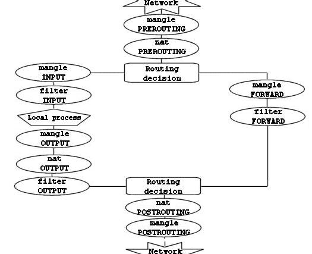

Этот рисунок дает довольно ясное представление о порядке прохождения пакетов через различные цепочки. В первой точке принятия решения о маршрутизации (routing decision) все пакеты, предназначенные данному хосту направляются в цепочку `INPUT`, остальные - в цепочку `FORWARD`.

Обратите внимание также на тот факт, что пакеты, с адресом назначения на брандмауэр, могут претерпеть изменение сетевого адреса назначения (DNAT) в цепочке `PREROUTING` таблицы nat и соответственно дальнейшая маршрутизация в первой точке будет выполняться в зависимости от произведенных изменений. Запомните - все пакеты проходят через таблицы и цепочки по тому или иному маршруту. Даже если выполняется DNAT в ту же сеть, откуда пакет пришел, то он все равно продолжит движение по цепочкам.

> В сценарии [rc.test-iptables.txt](http://www.calculate-linux.ru/attachments/1437/rc.test-iptables.txt) вы сможете найти дополнительную информацию о порядке прохождения пакетов.

### 3.2. Таблица Mangle <a name="link_13"></a>

Как уже упоминалось выше, эта таблица предназначена, главным образом для внесения изменений в заголовки пакетов (mangle - искажать, изменять. прим. перев.). Т.е. в этой таблице вы можете устанавливать биты TOS (Type Of Service) и т.д.

> Еще раз напоминаю вам, что в этой таблице не следует производить любого рода фильтрацию, маскировку или преобразование адресов (DNAT, SNAT, MASQUERADE).

В этой таблице допускается выполнять только нижеперечисленные действия:

- TOS
- TTL
- MARK

Действие **TOS** выполняет установку битов поля Type of Service в пакете. Это поле используется для назначения сетевой политики обслуживания пакета, т.е. задает желаемый вариант маршрутизации. Однако, следует заметить, что данное свойство в действительности используется на незначительном количестве маршрутизаторов в Интернете. Другими словами, не следует изменять состояние этого поля для пакетов, уходящих в Интернет, потому что на роутерах, которые таки обслуживают это поле, может быть принято неправильное решение при выборе маршрута.

Действие **TTL** используется для установки значения поля TTL (Time To Live) пакета. Есть одно неплохое применение этому действию. Мы можем присваивать определенное значение этому полю, чтобы скрыть наш брандмауэр от чересчур любопытных провайдеров (Internet Service Providers). Дело в том, что отдельные провайдеры очень не любят когда одно подключение разделяется несколькими компьютерами. и тогда они начинают проверять значение TTL приходящих пакетов и используют его как один из критериев определения того, один компьютер "сидит" на подключении или несколько.

Действие `MARK` устанавливает специальную метку на пакет, которая затем может быть проверена другими правилами в iptables или другими программами, например iproute2. С помощью "меток" можно управлять маршрутизацией пакетов, ограничивать траффик и т.п.

### 3.3. Таблица Nat <a name="link_14"></a>

Эта таблица используется для выполнения преобразований сетевых адресов NAT (`Network Address Translation`). Как уже упоминалось ранее, только первый пакет из потока проходит через цепочки этой таблицы, трансляция адресов или маскировка применяются ко всем последующим пакетам в потоке автоматически. Для этой таблицы характерны действия:

- DNAT
- SNAT
- MASQUERADE

Действие `DNAT` (Destination Network Address Translation) производит преобразование адресов назначения в заголовках пакетов. Другими словами, этим действием производится перенаправление пакетов на другие адреса, отличные от указанных в заголовках пакетов.

`SNAT` (Source Network Address Translation) используется для изменения исходных адресов пакетов. С помощью этого действия можно скрыть структуру локальной сети, а заодно и разделить единственный внешний IP адрес между компьютерами локальной сети для выхода в Интернет. В этом случае брандмауэр, с помощью SNAT, автоматически производит прямое и обратное преобразование адресов, тем самым давая возможность выполнять подключение к серверам в Интернете с компьютеров в локальной сети.

Маскировка (`MASQUERADE`) применяется в тех же целях, что и SNAT, но в отличие от последней, `MASQUERADE` дает более сильную нагрузку на систему. Происходит это потому, что каждый раз, когда требуется выполнение этого действия - производится запрос IP адреса для указанного в действии сетевого интерфейса, в то время как для SNAT IP адрес указывается непосредственно. Однако, благодаря такому отличию, `MASQUERADE` может работать в случаях с динамическим IP адресом, т.е. когда вы подключаетесь к Интернет, скажем через PPP, SLIP или DHCP.

### 3.4. Таблица Filter <a name="link_15"></a>

Как следует из названия, в этой таблице должны содержаться наборы правил для выполнения фильтрации пакетов. Пакеты могут пропускаться далее, либо отвергаться (действия `ACCEPT` и `DROP` соответственно), в зависимости от их содержимого. Конечно же, мы можем отфильтровывать пакеты и в других таблицах, но эта таблица существует именно для нужд фильтрации. В этой таблице допускается использование большинства из существующих действий, однако ряд действий, которые мы рассмотрели выше в этой главе, должны выполняться только в присущих им таблицах.

## Глава 4. Механизм определения состояний <a name="link_16"></a>

В данной главе все внимание будет уделено механизму определения состояний пакетов (state machine). По прочтении ее у вас должно сложиться достаточно четкое представление о работе механизма, а способствовать этому должен значительный объем поясняющих примеров.

### 4.1. Введение <a name="link_17"></a>

Механизм определения состояния (`state machine`) является отдельной частью iptables и в действительности не должен бы так называться, поскольку фактически является механизмом трассировки соединений. Однако значительному количеству людей он известен именно как "механизм определения состояния" (`state machine`). В данной главе эти названия будут использоваться как синонимы. Трассировщик соединений создан для того, чтобы netfilter мог постоянно иметь информацию о состоянии каждого конкретного соединения. Наличие трассировщика позволяет создавать более надежные наборы правил по сравнению с брандмауэрами, которые не имеют поддержки такого механизма.

В пределах iptables, соединение может иметь одно из 4-х базовых состояний: `NEW`, `ESTABLISHED`, `RELATED` и `INVALID`. Позднее мы остановимся на каждом из них более подробно. Для управления прохождением пакетов, основываясь на их состоянии, используется критерий `--state`.

Трассировка соединений производится специальным кодом в пространстве ядра -- трассировщиком (`conntrack`). Код трассировщика может быть скомпилирован как подгружаемый модуль ядра, так и статически связан с ядром. В большинстве случаев нам потребна более специфичная информация о соединении, чем та, которую поставляет трассировщик по-умолчанию. Поэтому трассировщик включает в себя обработчики различных протоколов, например TCP, UDP или ICMP. Собранная ими информация затем используется для идентификации и определения текущего состояния соединения. Например - соединение по протоколу UDP однозначно идентифицируется по IP-адресам и портам источника и приемника.

В предыдущих версиях ядра имелась возможность включения/выключения поддержки дефрагментации пакетов. Однако, после того как трассировка соединений была включена в состав iptables/netfilter, надобность в этом отпала. Причина в том, что трассировщик не в состоянии выполнять возложенные на него функции без поддержки дефрагментации и поэтому она включена постоянно. Ее нельзя отключить иначе как отключив трассировку соединений. Дефрагментация выполняется всегда, если трассировщик включен.

Трассировка соединений производится в цепочке `PREROUTING`, исключая случаи, когда пакеты создаются локальными процессами на брандмауэре, в этом случае трассировка производится в цепочке `OUTPUT`. Это означает, что iptables производит все вычисления, связанные с определением состояния, в пределах этих цепочек. Когда локальный процесс на брандмауэре отправляет первый пакет из потока, то в цепочке `OUTPUT` ему присваивается состояние `NEW`, а когда возвращается пакет ответа, то состояние соединения в цепочке `PREROUTING` изменяется на `ESTABLISHED`, и так далее. Если же соединение устанавливается извне, то состояние `NEW` присваивается первому пакету из потока в цепочке `PREROUTING`. Таким образом, определение состояния пакетов производится в пределах цепочек `PREROUTING` и `OUTPUT` таблицы `nat`.

### 4.2. Таблица трассировщика <a name="link_18"></a>

Кратко рассмотрим таблицу трассировщика, которую можно найти в файле `/proc/net/ip_conntrack`. Здесь содержится список всех активных соединений. Если модуль `ip_conntrack` загружен, то команда cat /proc/net/ip_conntrak должна вывести нечто, подобное:

```
tcp  6 117 SYN_SENT src=192.168.1.6 dst=192.168.1.9 sport=32775 
dport=22 [UNREPLIED] src=192.168.1.9 dst=192.168.1.6 sport=22
dport=32775 use=2
```

В этом примере содержится вся информация, которая известна трассировщику, по конкретному соединению. Первое, что можно увидеть - это название протокола, в данном случае - tcp. Далее следует некоторое число в обычном десятичном представлении. После него следует число, определяющее "время жизни" записи в таблице (т.е. количество секунд, через которое информация о соединении будет удалена из таблицы). Для нашего случая, запись в таблице будет храниться еще 117 секунд, если конечно через это соединение более не проследует ни одного пакета. При прохождении каждого последующего пакета через данное соединение, это значение будет устанавливаться в значение по-умолчанию для заданного состояния. Это число уменьшается на 1 каждую секунду. Далее следует фактическое состояние соединения. Для нашего примера состояние имеет значение `SYN_SENT`. Внутреннее представление состояния несколько отличается от внешнего. Значение `SYN_SENT` говорит о том, что через данное соединение проследовал единственный пакет `TCP SYN`. Далее расположены адреса отправителя и получателя, порт отправителя и получателя. Здесь же видно ключевое слово `[UNREPLIED]`, которое сообщает о том, что ответного трафика через это соединение еще не было. И наконец приводится дополнительная информация по ожидаемому пакету, это IP адреса отправителя/получателя (те же самые, только поменявшиеся местами, поскольку ожидается ответный пакет), то же касается и портов.

Записи в таблице могут принимать ряд значений, все они определены в заголовочных файлах `linux/include/netfilter-ipv4/ip_conntrack*.h`. Значения по-умолчанию зависят от типа протокола. Каждый из IP-протоколов - `TCP`, `UDP` или `ICMP` имеют собственные значения по-умолчанию, которые определены в заголовочном файле `linux/include/netfilter-ipv4/ip_conntrack.h`. Более подробно мы остановимся на этих значениях, когда будем рассматривать каждый из протоколов в отдельности.

> Совсем недавно, в `patch-o-matic`, появилась заплата `tcp-window-tracking`, которая предоставляет возможность передачи значений всех таймаутов через специальные переменные, т.е. позволяет изменять их "на лету". Таким образом появляется возможность изменения таймаутов без необходимости пересборки ядра.  
> Изменения вносятся с помощью определенных системных вызовов, через каталог `/proc/sys/net/ipv4/netfilter`. Особое внимание обратите на ряд переменных `/proc/sys/net/ipv4/netfilter/ip_ct_*`.

После получения пакета ответа трассировщик снимет флаг `[UNREPLIED]` и заменит его флагом `[ASSURED]`. Этот флаг сообщает о том, что соединение установлено уверенно и эта запись не будет стерта по достижении максимально возможного количества трассируемых соединений. Максимальное количество записей, которое может содержаться в таблице зависит от значения по-умолчанию, которое может быть установлено вызовом функции `ipsysctl` в последних версиях ядра. Для объема ОЗУ 128 Мб это значение соответствует 8192 записям, для 256 Мб - 16376. Вы можете посмотреть и изменить это значение установкой переменной `/proc/sys/net/ipv4/ip_conntrack_max`.

### 4.3. Состояния в пространстве пользователя <a name="link_19"></a>

Как вы уже наверняка заметили, в пространстве ядра, в зависимости от типа протокола, пакеты могут иметь несколько различных состояний. Однако, вне ядра пакеты могут иметь только 4 состояния. В основном состояние пакета используется критерием `--state`. Допустимыми являются состояния `NEW, ESTABLISHED, RELATED` и `INVALID`. В таблице, приводимой ниже, рассмтриваются каждое из возможных состояний.

**Таблица 4-1. Перечень состояний в пространстве пользователя**

|Состояние|Описание|
|---|---|
|NEW|Признак NEW сообщает о том, что пакет является первым для данного соединения. Это означает, что это первый пакет в данном соединении, который увидел модуль трассировщика. Например если получен SYN пакет являющийся первым пакетом для данного соединения, то он получит статус `NEW`. Однако, пакет может и не быть `SYN` пакетом и тем не менее получить статус `NEW`. Это может породить определенные проблемы в отдельных случаях, но может оказаться и весьма полезным, например когда желательно "подхватить" соединения, "потерянные" другими брандмауэрами или в случаях, когда таймаут соединения уже истек, но само соединение не было закрыто.|
|RELATED|Состояние `RELATED` одно из самых "хитрых". Соединение получает статус `RELATED` если оно связано с другим соединением, имеющим признак `ESTABLISHED`. Это означает, что соединение получает признак `RELATED` тогда, когда оно инициировано из уже установленного соединения, имеющего признак `ESTABLISHED`. Хорошим примером соединения, которое может рассматриваться как `RELATED`, является соединение FTP-data, которое является связанным с портом FTP control, а так же DCC соединение, запущенное из `IRC`. Обратите внимание на то, что большинство протоколов `TCP` и некоторые из протоколов `UDP` весьма сложны и передают информацию о соединении через область данных `TCP` или `UDP` пакетов и поэтому требуют наличия специальных вспомогательных модулей для корректной работы.|
|ESTABLISHED|Состояние `ESTABLISHED` говорит о том, что это не первый пакет в соединении. Схема установки состояния `ESTABLISHED` достаточна проста для понимания. Единственное требование, предъявляемое к соединению, заключается в том, что для перехода в состояние `ESTABLISHED` необходимо чтобы узел сети передал пакет и получил на него ответ от другого узла (хоста). После получения ответа состояние соединения `NEW` или `RELATED` будет изаменено на `ESTABLISHED`.|
|INVALID|Признак `INVALID` говорит о том, что пакет не может быть идентифицирован и поэтому не может иметь определенного статуса. Это может происходить по разным причинам, например при нехватке памяти или при получении `ICMP`-сообщения об ошибке, которое не соответствует какому либо известному соединению. Наверное наилучшим вариантом было бы применение действия `DROP` к таким пакетам.|

Эти четыре состояния могут использоваться в критерии `--state`. Механизм определения состояния позволяет строить чрезвычайно мощную и эффективную защиту. Раньше приходилось открывать все порты выше 1024, чтобы пропустить обратный трафик в локальную сеть, теперь же, при наличии механизма определения состояния, необходимость в этом отпала, поскольку появилась возможность "открывать" доступ только для обратного (ответного) трафика, пресекая попытки установления соединений извне.

### 4.4. TCP соединения <a name="link_20"></a>

В этом и в последующих разделах мы поближе рассмотрим признаки состояний и порядок их обработки каждым из трех базовых протоколов `TCP, UDP` и `ICMP`, а так же коснемся случая, когда протокол соединения не может быть классифицирован на принадлежность к трем, вышеуказанным, протоколам. Начнем рассмотрение с протокола TCP, поскольку он имеет множество интереснейших особенностей в отношении механизма определения состояния в iptables.

`TCP` соединение всегда устанавливается передачей трех пакетов, которые инициализируют и устанавливают соединение, через которое в дальнейшем будут передаваться данные. Сессия начинается с передачи `SYN` пакета, в ответ на который передается `SYN/ACK` пакет и подтверждает установление соединения пакет `ACK`. После этого соединение считается установленным и готовым к передаче данных. Может возникнуть вопрос: "А как же трассируется соединение?". В действительности все довольно просто.

Для всех типов соединений, трассировка проходит практически одинаково. Взгляните на рисунок ниже, где показаны все стадии установления соединения. Как видите, трассировщик, с точки зрения пользователя, фактически не следит за ходом установления соединения. Просто, как только трассировщик "увидел" первый (SYN) пакет, то присваивает ему статус NEW. Как только через трассировщика проходит второй пакет (SYN/ACK), то соединению присваивается статус `ESTABLISHED`. Почму именно второй пакет? Сейчас разберемся. Строя свой набор правил, вы можете позволить покидать локальную сеть пакетам со статусом `NEW` и `ESTABLISHED`, а во входящем трафике пропускать пакеты только со статусом `ESTABLISHED` и все будет работать прекрасно. И наоборот, если бы трассировщик продолжал считать соединение как `NEW`, то фактически вам никогда не удалось бы установить соединение с "внешним миром", либо пришлось бы позволить прохождение NEW пакетов в локальную сеть. С точки зрения ядра все выглядит более сложным, поскольку в пространстве ядра `TCP` соединения имеют ряд промежуточных состояний, недоступных в пространстве пользователя. В общих чертах они соответствуют спецификации `RFC 793 - Transmission Control Protocol` на странице 21-23. Более подробно эта тема будет рассматриваться чуть ниже.

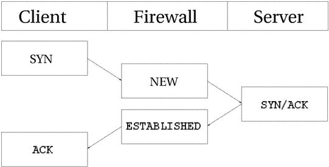

С точки зрения пользователя все выглядит достаточно просто, однако если посмотреть с точки зрения ядра, то все выглядит несколько сложнее. Рассмотрим порядок изменения состояния соединения в таблице `/proc/net/ip_conntrack`. После передачи первого пакета SYN.

```
tcp      6 117 SYN_SENT src=192.168.1.5 dst=192.168.1.35 sport=1031 \
     dport=23 [UNREPLIED] src=192.168.1.35 dst=192.168.1.5 sport=23 \
     dport=1031 use=1
```

Теперь запись сообщает о том, что обратно прошел пакет `SYN/ACK`. На этот раз соединение переводится в состояние `SYN_RECV`. Это состояние говорит о том, что пакет SYN был благополучно доставлен получателю и в ответ на него пришел пакет-подтверждение (SYN/ACK). Кроме того, механизм определения состояния "увидев" пакеты, следующие в обеих направлениях, снимает флаг `[UNREPLIED]`. И наконец после передачи заключительного `ACK`-пакета, в процедуре установления соединения

```
tcp      6 431999 ESTABLISHED src=192.168.1.5 dst=192.168.1.35 \
     sport=1031 dport=23 src=192.168.1.35 dst=192.168.1.5 \
     sport=23 dport=1031 use=1
```

соединение переходит в состояние `ESTABLISHED` (установленное). После приема нескольких пакетов через это соединение, к нему добавится флаг `[ASSURED]` (уверенное).

При закрытии, `TCP` соединение проходит через следующие состояния:

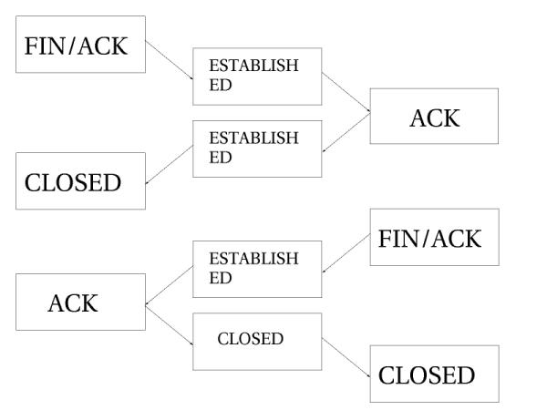

Как видно из рисунка, соединение не закрывается до тех пор пока не будет передан последний пакет ACK. Обратите внимание - эта картинка описывает нормальный процесс закрытия соединения. Кроме того, если соединение отвергается, то оно может быть закрыто передачей пакета `RST` (сброс). В этом случае соединение будет закрыто по истечение предопределенного времени.

При закрытии, соединение переводится в состояние `TIME_WAIT`, продолжительность которого по-умолчанию соответствует 2 минутам, в течение которого еще возможно прохождение пакетов через брандмауэр. Это является своего рода "буферным временем", которое дает возможность пройти пакетам, "увязшим" на том или ином маршрутизаторе (роутере).

Если соединение закрывается по получении пакета `RST`, то оно переводится в состояние `CLOSE`. Время ожидания до фактического закрытия соединения по-умолчанию устанавливается равным 10 секунд. Подтверждение на пакеты `RST` не передается и соединение закрывается сразу же. Кроме того имеется ряд других внутренних состояний. В таблице ниже приводится список возможных внутренних состояний соединения и соответствующие им размеры таймаутов.

**Таблица 4-2. Internal states**

|Состояние|Время ожидания|
|---|---|
|NONE|
|ESTABLISHED|5 дней|
|SYN_SENT|2 минуты|
|SYN_RECV|60 секунд|
|FIN_WAIT|2 минуты|
|TIME_WAIT|2 минуты|
|CLOSE|10 секунд|
|CLOSE_WAIT|12 часов|
|LAST_ACK|30 секунд|
|LISTEN>|2 минуты|

Эти значения могут несколько изменяться от версии к версии ядра, кроме того, они могут быть изменены через интерфейс файловой системы `/proc` (переменные `proc/sys/net/ipv4/netfilter/ip_ct_tcp_*`). Значения устанавливаются в сотых долях секунды, так что число 3000 означает 30 секунд.

> Обратите внимание на то, что со стороны пользователя, механизм определения состояния никак не отображает состояние флагов `TCP` пакетов. Как правило - это не всегда хорошо, поскольку состояние `NEW` присваивается, не только пакетам `SYN`.  
> Это качество трассировщика может быть использовано для избыточного файерволлинга (`firewalling`), но для случая домашней локальной сети, в которой используется только один брандмауэр это очень плохо. Эта проблема более подробно обсуждается в разделе **_Пакеты со статусом NEW и со сброшенным битом SYN_** приложения _**Общие проблемы и вопросы**_. Альтернативным вариантом решения этой проблемы может служить установка заплаты `tcp-window-tracking` из `patch-o-matic`, которая сделает возможным принятие решений в зависимости от значения `TCP window`.

### 4.5. UDP соединения <a name="link_21"></a>

По сути своей, `UDP` соединения не имеют признака состояния. Этому имеется несколько причин, основная из них состоит в том, что этот протокол не предусматривает установления и закрытия соединения, но самый большой недостаток - отсутствие информации об очередности поступления пакетов. Приняв две датаграммы `UDP`, невозможно сказать точно в каком порядке они были отправлены. Однако, даже в этой ситуации все еще возможно определить состояние соединения. Ниже приводится рисунок того, как выглядит установление соединения с точки зрения трассировщика.

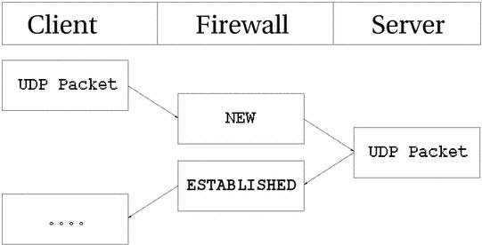

Из рисунка видно, что состояние UDP соединения определяется почти так же как и состояние TCP соединения, с точки зрения из пользовательского пространства. Изнутри же это выглядит несколько иначе, хотя во многом похоже. Для начала посмотрим на запись, появившуюся после передачи первого пакета UDP.

```
 udp      17 20 src=192.168.1.2 dst=192.168.1.5 sport=137 dport=1025 \
     [UNREPLIED] src=192.168.1.5 dst=192.168.1.2 sport=1025 \
     dport=137 use=1
```

Первое, что мы видим -- это название протокола (udp) и его номер (см. `/etc/protocols` прим. перев.). Третье значение -- оставшееся "время жизни" записи в секундах. Далее следуют характеристики пакета, прошедшего через брандмауэр -- это адреса и порты отправителя и получателя. Здесь же видно, что это первый пакет в сессии (флаг `[UNREPLIED]`). И завершают запись адреса и порты отправителя и получателя ожидаемого пакета. Таймаут такой записи по умолчанию составляет 30 секунд.

> udp 17 170 src=192.168.1.2 dst=192.168.1.5 sport=137 \  
> dport=1025 src=192.168.1.5 dst=192.168.1.2 sport=1025 \  
> dport=137 use=1

После того как сервер "увидел" ответ на первый пакет, соединение считается `ESTABLISHED` (установленным), единственное отличие от предыдущей записи состоит в отсутствии флага `[UNRREPLIED]` и, кроме того, таймаут для записи стал равным 180 секундам. После этого может только добавиться флаг `[ASSURED]` (уверенное соединение), который был описан выше. Флаг `[ASSURED]` устанавливается только после прохождения некоторого количества пакетов через соединение.

> udp 17 175 src=192.168.1.5 dst=195.22.79.2 sport=1025 \  
> dport=53 src=195.22.79.2 dst=192.168.1.5 sport=53 \  
> dport=1025 [ASSURED] use=1

Теперь соединение стало "уверенным". Запись в таблице выглядит практически так же как и в предыдущем примере, за исключением флага `[ASSURED]`. Если в течение 180 секунд через соединение не пройдет хотя бы один пакет, то запись будет удалена из таблицы. Это достаточно маленький промежуток времени, но его вполне достаточно для большинства применений. "Время жизни" отсчитывается от момента прохождения последнего пакета и при появлении нового, время переустанавливается в свое начальное значение, это справедливо и для всех остальных типов внутренних состояний.

### 4.6. ICMP соединения <a name="link_22"></a>


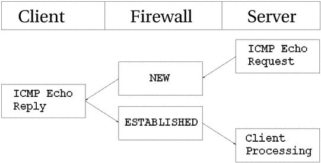


Как видно из этого рисунка, сервер выполняет `Echo Request` (эхо-запрос) к клиенту, который (запрос) распознается брандмауэром как NEW. На этот запрос клиент отвечает пакетом `Echo Reply`, и теперь пакет распознается как имеющий состояние `ESTABLISHED`. После прохождения первого пакета (Echo Request) в ip_conntrack появляется запись:

> icmp 1 25 src=192.168.1.6 dst=192.168.1.10 type=8 code=0 \  
> id=33029 [UNREPLIED] src=192.168.1.10 dst=192.168.1.6 \  
> type=0 code=0 id=33029 use=1

Эта запись несколько отличается от записей, свойственных протоколам `TCP` и `UDP`, хотя точно так же присутствуют и название протокола и время таймаута и адреса передатчика и приемника, но далее появляются три новых поля - `type, code` и `id`. Поле type содержит тип `ICMP`, поле code - код `ICMP`. Значения типов и кодов `ICMP` приводятся в приложении _**Типы ICMP**_. И последнее поле `id` содержит идентификатор пакета. Каждый ICMP-пакет имеет свой идентификатор. Когда приемник, в ответ на ICMP-запрос посылает ответ, он подставляет в пакет ответа этот идентификатор, благодаря чему, передатчик может корректно распознать в ответ на какой запрос пришел ответ.

Следующее поле - флаг `[UNREPLIED]`, который встречался нам ранее. Он означает, что прибыл первый пакет в соединении. Завершается запись характеристиками ожидаемого пакета ответа. Сюда включаются адреса отправителя и получателя. Что касается типа и кода ICMP пакета, то они соответствуют правильным значениям ожидаемого пакета `ICMP Echo Reply`. Идентификатор пакета-ответа тот же, что и в пакете запроса.

Пакет ответа распознается уже как `ESTABLISHED`. Однако, мы знаем, что после передачи пакета ответа, через это соединение уже ничего не ожидается, поэтому после прохождения ответа через `netfilter`, запись в таблице трассировщика уничтожается.

В любом случае запрос рассматривается как `NEW`, а ответ как `ESTABLISHED`.

> Заметьте при этом, что пакет ответа должен совпадать по своим характеристикам (адреса отправителя и получателя, тип, код и идентификатор) с указанными в записи в таблице трассировщика, это справедливо и для всех остальных типов трафика.

`ICMP` запросы имеют таймаут, по-умолчанию, 30 секунд. Этого времени, в большинстве случаев, вполне достаточно. Время таймаута можно изменить в `/proc/sys/net/ipv4/netfilter/ip_ct_icmp_timeout`. (Напоминаю, что переменные типа `/proc/sys/net/ipv4/netfilter/ip_ct_*` становятся доступны только после установки "заплаты" `tcp-window-tracking из patch-o-matic` прим. перев.).

Значительная часть `ICMP` используется для передачи сообщений о том, что происходит с тем или иным `UDP` или `TCP` соединением. Всвязи с этим они очень часто распознаются как связанные (`RELATED`) с существующим соединением. Простым примером могут служить сообщения `ICMP Host Unreachable` или `ICMP Network Unreachable`. Они всегда порождаются при попытке соединиться с узлом сети когда этот узел или сеть недоступны, в этом случае последний маршрутизатор вернет соответствующий `ICMP` пакет, который будет распознан как `RELATED`. На рисунке ниже показано как это происходит.


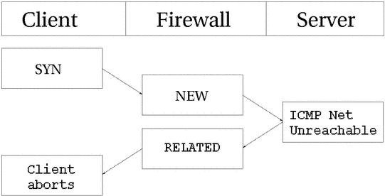


В этом примере некоторому узлу передается запрос на соединение (`SYN` пакет). Он приобретает статус `NEW` на брандмауэре. Однако, в этот момент времени, сеть оказывается недоступной, поэтому роутер возвращает пакет `ICMP Network Unreachable`. Трассировщик соединений распознает этот пакет как `RELATED`, благодаря уже имеющейся записи в таблице, так что пакет благополучно будет передан клиенту, который затем оборвет неудачное соединение. Тем временем, брандмауэр уничтожит запись в таблице, поскольку для данного соединения было получено сообщение об ошибке.

То же самое происходит и с `UDP` соединениями - если обнаруживаются подобные проблемы. Все сообщения `ICMP`, передаваемые в ответ на UDP соединение, рассматриваются как `RELATED`. Взгляните на следующий рисунок.

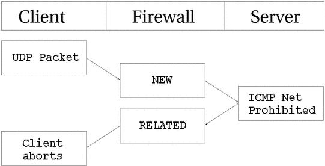

Датаграмма `UDP` передается на сервер. Соединению присваивается статус `NEW`. Однако доступ к сети запрещен (брандмауэром или роутером), поэтому обратно возвращается сообщение `ICMP Network Prohibited`. Брандмауэр распознает это сообщение как связанное с открытым `UDP` соединением, присваивает ему статус `RELATED` и передает клиенту. После чего запись в таблице трассировщика уничтожается, а клиент благополучно обрывает соединение.

### 4.7. Поведение по-умолчанию <a name="link_23"></a>

В некоторых случаях механизм определения состояния не может распознать протокол обмена и, соответственно, не может выбрать стратегию обработки этого соединения. В этом случае он переходит к заданному по-умолчанию поведению. Поведение по-умолчанию используется, например при обслуживании протоколов `NETBLT, MUX` и `EGP`. Поведение по-молчанию во многом схоже с трассировкой UDP соединений. Первому пакету присваивается статус `NEW`, а всем последующим - статус `ESTABLISHED`.

При использовании поведения по-умолчанию, для всех пакетов используется одно и то же значение таймаута, которое можно изменить в `/proc/sys/net/ipv4/netfilter/ip_ct_generic_timeout`. По-умолчанию это значение равно 600 секундам, или 10 минутам В зависимости от типа трафика, это время может меняться, особенно когда соединение устанавливается по спутниковому каналу.

### 4.8. Трассировка комплексных протоколов <a name="link_24"></a>

Имеется ряд комплексных протоколов, корректная трассировка которых более сложна. Прмером могут служить протоколы `ICQ, IRC` и `FTP`. Каждый из этих протоколов несет дополнительную информацию о соединении в области данных пакета. Соответственно корректная трассировка таких соединений требует подключения дополнительных вспомогательных модулей.

В качестве первого примера рассмотрим протокол `FTP`. Протокол `FTP` сначала открывает одиночное соединение, которое называется "сеансом управления FTP" (`FTP control session`). При выполнении команд в пределах этого сеанса, для передачи сопутствующих данных открываются дополнительные порты. Эти соединения могут быть активными или пассивными. При создании активного соединения клент передает `FTP` серверу номер порта и IP адрес для соединения. Затем клент открывает порт, сервер подключает к заданному порту клиента свой порт с номером 20 (известный как `FTP-Data`) и передает данные через установленное соединение.

Проблема состоит в том, что брандмауэр ничего не знает об этих дополнительных подключениях, поскольку вся информация о них передается через область данных пакета. Из-за этого брандмауэр не позволит серверу соединиться с указанным портом клиента.

Решение проблемы состоит в добавлении специального вспомогательного модуля трассировки, который отслеживает, специфичную для данного протокола, информацию в области данных пакетов, передаваемых в рамках сеанса управления. При создании такого соединения, вспомогательный модуль корректно воспримет передаваемую информацию и создаст соответствующую запись в таблице трассировщика со статусом `RELATED`, благодаря чему соединение будет установлено. Рисунок ниже поясняет порядок выполнения подобного соединения.


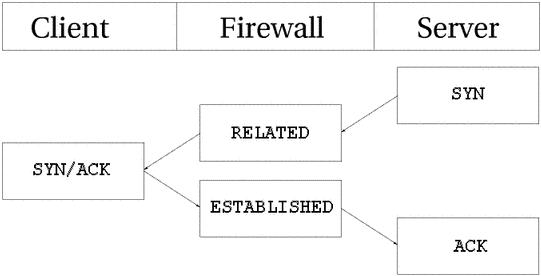


Пассивный FTP действует противоположным образом. Клиент посылает запрос серверу на получение данных, а сервер возвращает клиенту IP адрес и номер порта для подключения. Клиент подключает свой 20-й порт (`FTP-data`) к указанному порту сервера и получает запрошенные данные. Если ваш FTP сервер находится за брандмауэром, то вам потребуется этот вспомогательный модуль для того, чтобы сервер смог обслуживать клиентов из Интернет. То же самое касается случая, когда вы хотите ограничить своих пользователей только возможностью подключения к HTTP и FTP серверам в Интернет и закрыть все остальные порты. Рисунок ниже показывает как выполняется пассивное соединение FTP:


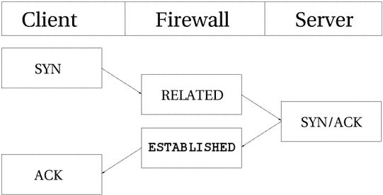


Некоторые вспомогательные модули уже включены в состав ядра. Если быть более точным, то в состав ядра включены вспомогательные модули для протоколов `FTP` и `IRC`. Если в вашем распоряжении нет необходимого вспомогательного модуля, то вам следует обратиться к patch-o-matic, который содержит большое количество вспомогательных модулей для трассировки таких протоколов, как `ntalk` или `H.323`. Если и здесь вы не нашли то, что вам нужно, то у вас есть еще варианты: вы можете обратиться к `CVS iptables`, если искомый вспомогательный модуль еще не был включен в `patch-o-matic`, либо можете войти в контакт с разработчиками `netfilter` и узнать у них - имеется ли подобный модуль и планируется ли он к выпуску. Если и тут вы потерпели неудачу, то наверное вам следует прочитать [Rusty Russell's Unreliable Netfilter Hacking HOW-TO](http://www.netfilter.org/documentation/HOWTO/netfilter-hacking-HOWTO.html).

Вспомогательные модули могут быть скомпилированы как в виде подгружаемых модулей ядра, так и статически связаны с ядром. Если они скомпилированы как модули, то вы можете загрузить их командой:

modprobe ip_conntrack_*

Обратите внимание на то, что механизм определения состояния не имеет никакого отношения к трансляции сетевых адресов (`NAT`), поэтому вам может потребоваться большее количество дополнительных модулей, если вы выполняете такую трансляцию. Допустим, что вы выполняете трансляцию адресов и трассировку FTP соединений, тогда вам необходим так же и соответствующий вспомогательный модуль NAT. Имена вспомогательных модулей NAT начинаются с `ip_nat_`, в соответствии с соглашением об именах. В данном случае модуль называется `ip_nat_ftp`. Для протокола `IRC` такой модуль будет называться `ip_nat_irc`. Тому же самому соглашению следуют и названия вспомогательных модулей трассировщика, например: `ip_conntrack_ftp` и `ip_conntrack_irc`.

## Глава 5. Сохранение и восстановление больших наборов правил <a name="link_25"></a>

В состав пакета iptables входят две очень удобные утилиты, особенно если вам приходится иметь дело с большими наборами правил. Называются они **`iptables-save`** и **`iptables-restore`**. Первая из них сохраняет, а вторая восстанавливает наборы правил в/из файла. По своему формату файл с набором правил похож на обычные файлы сценариев командной оболочки (`shell`), в чем вы сможете убедиться чуть ниже.

### 5.1. Плюсы <a name="link_26"></a>

Один из плюсов использования утилит `iptables-save` и `iptables-restore` состоит в высокой скорости загрузки и сохранения больших наборов правил. Главный недостаток, связанный с установкой наборов правил из сценариев командной оболочки состоит в том, что команда iptables копирует набор правил из пространства ядра в пространство пользователя, вставляет, добавляет или изменяет правило и, наконец, весь набор правил копируется обратно в пространство ядра. Эта последовательность действий выполняется для каждого правила, которое вставляется или изменяется в наборе правил.

Эта проблема легко решается с помощью `iptables-save` и `iptables-restore` Утилита `iptables-save` записывает набор правил в обычный текстовый файл в особом формате. Утилита `iptables-restore` загружает набор правил из файла. Главное преимущество этих утилит состоит в том, что они производят сохранение/восстановление всего набора правил за одно обращение. `iptables-save` "в один присест" получает из пространства ядра и записывает в файл весь набор правил, а `iptables-restore` загружает из файла и переписывает за одно обращение в пространство ядра набор правил для каждой таблицы. Или другими словами - вместо того, чтобы обращаться огромное число раз к ядру для того чтобы получить набор правил, а затем опять записать его в пространство ядра не меньшее число раз, можно просто сохранить набор правил в файл, а затем загружать его из файла, при этом число перемещений наборов в ядро будет зависеть только от числа используемых таблиц.

Вы уже наверняка поняли, что эти утилиты могут представлять для вас интерес, особенно если вам приходится загружать огромные наборы правил. Однако использование этих утилит имеет и свои отрицательные стороны, которые мы рассмотрим в следующем разделе.

### 5.2. И минусы <a name="link_27"></a>

У вас может сложиться впечатление, что `iptables-restore` может обрабатывать своего рода сценарии. Пока не может и вероятнее всего - никогда не сможет. В этом и состоит главный недостаток `iptables-restore`. Чтобы было более понятно - представьте себе случай, когда брандмауэр получает динамический IP-адрес и вы хотите вставить его значение в свои правила во время загрузки системы. Решить эту проблему с помощью `iptables-restore` практически невозможно.

Как одно из решений можно предложить написать небольшой скрипт, который определяет значение IP-адреса и затем вставляет его в набор правил (например, с помощью sed) на место некоторого ключевого слова. Здесь вам потребуется создать временный файл, в котором производятся изменения и который затем загружается с помощью `iptables-restore`. Однако такой вариант решения порождает свои проблемы -- вам придется отказаться от утилиты `iptables-save` поскольку она может затереть, созданную вручную, заготовку файла с правилами для `iptables-restore`. Вобщем - довольно неуклюжее решение.

Еще один вариант - хранить в файле для `iptables-restore` только статические правила, а затем с помощью небольшого скрипта добавлять правила с динамическими параметрами. Конечно же вы уже поняли, что это решение такое же неуклюжее как и первое. Вам придется смириться с тем, что `iptables-restore` не очень хорошо подходит для случая с динамически назначаемым IP-адресом и вообще для случаев, когда вам потребуется динамически изменять набор правил в зависимости от конфигурации системы и т.п..

Еще один недостаток `iptables-restore` и `iptables-save` в том, что их функциональность не всегда соответствует описанной. Проблема состоит в том, что не многие пользуются этими утилитами, еще меньше людей вовлечено в процесс поиска ошибок в этих программах. Поэтому, при использовании некоторых, вновь появившихся, критериев или действий вы можете столкнуться с неожиданным поведением своих правил. Несмотря на возможное существование некоторых проблем, я все же настоятельно рекомендую к использованию эти два инструмента, которые прекрасно работают в большинстве случаев, исключение могут составлять лишь некоторые новые критерии и действия.

### 5.3. iptables-save <a name="link_28"></a>

Утилита `iptables-save`, как я уже упоминал, предназначена для сохранения текущего набора правил в файл, который затем может быть использован утилитой `iptables-restore`. Эта команда очень проста в использовании и имеет всего два аргумента.

`iptables-save [-c] [-t table]`

Первый аргумент `-c` (допустимо использовать более длинный вариант `--counters`) заставляет `iptables-save` сохранить знчения счетчиков байт и пакетов. Это делает возможным рестарт брандмауэра без потери счетчиков, которые могут использоваться для подсчета статистики. По-умолчанию, при запуске без ключа `-с`, сохранение счетчиков не производится.

С помощью ключа `-t` (более длинный вариант `--table`) можно указать имя таблицы для сохранения. Если ключ `-t` не задан, то сохраняются все таблицы. Ниже приведен пример работы команды `iptables-save` в случае, когда набор не содержит ни одного правила.  

```
# Generated by iptables-save v1.2.6a on Wed Apr 24 10:19:17 2002
*filter
:INPUT ACCEPT [404:19766]
:FORWARD ACCEPT [0:0]
:OUTPUT ACCEPT [530:43376]
COMMIT
# Completed on Wed Apr 24 10:19:17 2002
# Generated by iptables-save v1.2.6a on Wed Apr 24 10:19:17 2002
*mangle
:PREROUTING ACCEPT [451:22060]
:INPUT ACCEPT [451:22060]
:FORWARD ACCEPT [0:0]
:OUTPUT ACCEPT [594:47151]
:POSTROUTING ACCEPT [594:47151]
COMMIT
# Completed on Wed Apr 24 10:19:17 2002
# Generated by iptables-save v1.2.6a on Wed Apr 24 10:19:17 2002
*nat
:PREROUTING ACCEPT [0:0]
:POSTROUTING ACCEPT [3:450]
:OUTPUT ACCEPT [3:450]
COMMIT
# Completed on Wed Apr 24 10:19:17 2002
```

Строки, начинающиеся с символа `#`, являются комментариями. Имена таблиц начинаются с символа `*` (звездочка), например: `*mangle`. После каждого имени таблицы следуют описания цепочек и правил. Описания цепочек записываются в формате :  
`<chain-name> <chain-policy> [<packet-counter>:<byte-counter>]`,  
где `<chain-name>` - это название цепочки (например `PREROUTING`), `<chain-policy>` - политика по-умолчанию (например `ACCEPT`). Завершают описание цепочки значения счетчиков пакетов и байт, те самые счетчики, которые вы получите в результате выполнения команды iptables -L -v. Описание каждой таблицы завершает ключевое слово `COMMIT`, которое означает, что в этой точке набор правил для данной таблицы будет передан в пространство ядра.

Пример выше показал как выглядит содержимое пустого набора правил, сохраненного утилитой `iptables-save`. Ниже показан результат сохранения небольшого набора правил (`Iptables-save ruleset`):

```
# Generated by iptables-save v1.2.6a on Wed Apr 24 10:19:55 2002
*filter
:INPUT DROP [1:229]
:FORWARD DROP [0:0]
:OUTPUT DROP [0:0]
[0:0] -A INPUT -m state --state RELATED,ESTABLISHED -j ACCEPT
[0:0] -A FORWARD -i eth0 -m state --state RELATED,ESTABLISHED -j ACCEPT
[0:0] -A FORWARD -i eth1 -m state --state NEW,RELATED,ESTABLISHED -j ACCEPT
[0:0] -A OUTPUT -m state --state NEW,RELATED,ESTABLISHED -j ACCEPT
COMMIT
# Completed on Wed Apr 24 10:19:55 2002
# Generated by iptables-save v1.2.6a on Wed Apr 24 10:19:55 2002
*mangle
:PREROUTING ACCEPT [658:32445]
:INPUT ACCEPT [658:32445]
:FORWARD ACCEPT [0:0]
:OUTPUT ACCEPT [891:68234]
:POSTROUTING ACCEPT [891:68234]
COMMIT
# Completed on Wed Apr 24 10:19:55 2002
# Generated by iptables-save v1.2.6a on Wed Apr 24 10:19:55 2002
*nat
:PREROUTING ACCEPT [1:229]
:POSTROUTING ACCEPT [3:450]
:OUTPUT ACCEPT [3:450]
[0:0] -A POSTROUTING -o eth0 -j SNAT --to-source 195.233.192.1
COMMIT
# Completed on Wed Apr 24 10:19:55 2002
```

Из примера виден результат действия аргумента `-c` - перед каждым правилом и в строке описания каждой цепочки имеются числа, отображающие содержимое счетчиков пакетов и байт. Сразу замечу, что набор правил утилита `iptables-save` выдает на стандартный вывод, поэтому, при сохранении набора в файл команда должна выглядеть примерно так:

```
iptables-save -c > /etc/iptables-save
```

Эта команда запишет весь набор правил, вместе с содержимым счетчиков, в файл с именем `/etc/iptables-save`.

### 5.4. iptables-restore <a name="link_29"></a>

Утилита `iptables-restore` используется для восстановления (загрузки) набора правил, который ранее был сохранен утилитой `iptables-save`. Набор правил утилита получает со стандартного ввода и не может загружать его из файла напрямую. Команда имеет следующий синтаксис:

`iptables-restore [-c] [-n]`

Ключ `-c` (более длинный вариант `--counters`) заставляет восстанавливать значения счетчиков.

Указание ключа `-n` (более длинный вариант `--noflush`) сообщает `iptables-restore` о том, что правила должны быть добавлены к имеющимся. По-умолчанию утилита `iptables-restore` (без ключа `-n`) очистит содержимое таблиц и цепочек перед загрузкой нового набора правил.

Для загрузки набора правил утилитой `iptables-restore` из файла можно предложить несколько вариантов, но наиболее употребимый:

```
cat /etc/iptables-save | iptables-restore -c
```

В результате выполнения этой команды содержимое файла `/etc/iptables-save` будет прочитано утилитой `cat` и перенаправленно на стандартный ввод утилиты `iptables-restore`. Можно было бы привести еще целый ряд команд, с помощью которых можно организовать загрузку набора правил из файла, но это выходит за рамки темы, поэтому оставлю читателю возможность самому найти более удобный для него вариант.

После исполнения этой команды набор правил должен загрузиться и все должно работать. Если это не так, то скорее всего вы допустили ошибку при наборе команды.

## Глава 6. Как строить правила <a name="link_30"></a>

В данной главе будет обсуждаться порядок построения собственных правил для `iptables`. Каждая строка, которую вы вставляете в ту или иную цепочку, должна содержать отдельное правило. Мы так же обсудим основные критерии и действия (`targets`) и порядок создания своих собственных действий (т.е. подцепочек правил).

### 6.1. Основы <a name="link_31"></a>

Как уже говорилось выше, каждое правило - это строка, содержащая в себе критерии определяющие, подпадает ли пакет под заданное правило, и действие, которое необходимо выполнить в случае выполнения критерия. В общем виде правила записываются примерно так:  
`iptables [-t table] command [match] [target/jump]`

Нигде не утверждается, что описание действия (`target/jump`) должно стоять последним в строке, однако, такая нотация более удобочитаема. Как бы то ни было, но чаще всего вам будет встречаться именно такой способ записи правил.

Если в правило не включается спецификатор [`-t table`], то по умолчанию предполагается использование таблицы `filter`, если же предполагается использование другой таблицы, то это требуется указать явно. Спецификатор таблицы так же можно указывать в любом месте строки правила, однако более или менее стандартом считается указание таблицы в начале правила.

Далее, непосредственно за именем таблицы, должна стоять команда. Если спецификатора таблицы нет, то команда всегда должна стоять первой. Команда определяет действие `iptables`, например: вставить правило, или добавить правило в конец цепочки, или удалить правило и т.п.

Раздел `match` задает критерии проверки, по которым определяется подпадает ли пакет под действие этого правила или нет. Здесь мы можем указать самые разные критерии - IP-адрес источника пакета или сети, IP-адрес места назначения,порт, протокол, сетевой интерфейс и т.д. Существует множество разнообразных критериев, но об этом - несколько позже.

И наконец `target` указывает, какое действие должно быть выполнено при условии выполнения критериев в правиле. Здесь можно заставить ядро передать пакет в другую цепочку правил, "сбросить" пакет и забыть про него, выдать на источник сообщение об ошибке и т.п.

### 6.2. Таблицы <a name="link_32"></a>

Опция `-t` указывает на используемую таблицу. По умолчанию используется таблица `filter`. С ключом `-t` применяются следующие опции.

**Таблица 6-1. Таблицы**

|Состояние|Описание|
|---|---|
|nat|Таблица nat используется главным образом для преобразования сетевых адресов (`Network Address Translation`). Через эту таблицу проходит только первый пакет из потока. Преобразования адресов автоматически применяется ко всем последующим пакетам. Это один из факторов, исходя из которых мы не должны осуществлять какую-либо фильтрацию в этой таблице. Цепочка `PREROUTING` используется для внесения изменений в пакеты на входе в брандмауэр. Цепочка `OUTPUT` используется для преобразования адресов в пакетах, созданных приложениями внутри брандмауэра, перед принятием решения о маршрутизации. И последняя цепочка в этой таблице -- `POSTROUTING`, которая используется для преобразования пакетов перед выдачей их в сеть.|
|mangle|Эта таблица используется для внесения изменений в заголовки пакетов. Примером может служить изменение поля `TTL, TOS` или `MARK`. Важно: в действительности поле `MARK` не изменяется, но в памяти ядра заводится структура, которая сопровождает данный пакет все время его прохождения через брандмауэр, так что другие правила и приложения на данном брандмауэре (и только на данной брандмауэре) могут использовать это поле в своих целях. Таблица имеет пять цепочек `PREROUTING, POSTROUTING, INPUT, OUTPUT` и `FORWARD`. `PREROUTING` используется для внесения изменений на входе в брандмауэр, перед принятием решения о маршрутизации. `POSTROUTING` используется для внесения изменений на выходе из брандмауэра, после принятия решения о маршрутизации. `INPUT` - для внесения изменений в пакеты перед тем как они будут переданы локальному приложению внутри брандмауэра. `OUTPUT` - для внесения изменений в пакеты, поступающие от приложений внутри брандмауэра. `FORWARD` - для внесения изменений в транзитные пакеты после первого принятия решения о ипршрутизации, но перед последним принятием решения о ипршрутизации. Замечу, что таблица `mangl@e ни в коем случае не должна использоваться для преобразования сетевых адресов или маскарадинга` (Network Address Translation, Masquerading)`, поскольку для этих целей имеется таблица @nat`.|
|filter|Таблица `filter` используется главным образом для фильтрации пакетов. Для примера, здесь мы можем выполнить `DROP`, `LOG, ACCEPT` или `REJECT` без каких либо ограничений, которые имеются в других таблицах. Имеется три встроенных цепочки. Первая - `FORWARD`, используемая для фильтрации пакетов, идущих транзитом через брандмауэр. Цепочку `INPUT` проходят пакеты, которые предназначены локальным приложениям (брандмауэру). И цепочка `OUTPUT` - используется для фильтрации исходящих пакетов, сгенерированных приложениями на самом брандмауэре.|

Выше мы рассмотрели основные отличия трех имеющихся таблиц. Каждая из них должна использоваться только в своих целях, и вы должны это понимать. Нецелевое использование таблиц может привести к ослаблению защиты брандмауэра и сети, находящейся за ним. Позднее, в главе **_Порядок прохождения таблиц и цепочек_**, мы подробнее остановимся на этом.

### 6.3. Команды <a name="link_33"></a>

Ниже приводится список команд и правила их использования. Посредством команд мы сообщаем `iptables`, что мы предполагаем сделать. Обычно предполагается одно из двух действий - добавление нового правила в цепочку или удаление существующего правила из той или иной таблицы. Далее приведены команды, которые используются в `iptables`.

**Таблица 6-2. Команды**

|   |   |
|---|---|
|Команда|`-A, --append`|
|Пример|iptables -A INPUT ...|
|Описание|Добавляет новое правило в конец заданной цепочки.|
|Команда|`-D, --delete`|
|Пример|iptables -D INPUT --dport 80 -j DROP, iptables -D INPUT 1|
|Описание|Удаление правила из цепочки. Команда имеет два формата записи, первый - когда задается критерий сравнения с опцией `-D` (см. первый пример), второй - порядковый номер правила. Если задается критерий сравнения, то удаляется правило, которое имеет в себе этот критерий, если задается номер правила, то будет удалено правило с заданным номером. Счет правил в цепочках начинается с 1.|
|Команда|`-R, --replace`|
|Пример|iptables -R INPUT 1 -s 192.168.0.1 -j DROP|
|Описание|Эта команда заменяет одно правило другим. В основном она используется во время отладки новых правил.|
|Команда|`-I, --insert`|
|Пример|iptables -I INPUT 1 --dport 80 -j ACCEPT|
|Описание|Вставляет новое правило в цепочку. Число, следующее за именем цепочки указывает номер правила, перед которым нужно вставить новое правило, другими словами число задает номер для вставляемого правила. В примере выше, указывается, что данное правило должно быть 1-м в цепочке `INPUT`.|
|Команда|`-L, --list`|
|Пример|iptables -L INPUT|
|Описание|Вывод списка правил в заданной цепочке, в данном примере предполагается вывод правил из цепочки `INPUT`. Если имя цепочки не указывается, то выводится список правил для всех цепочек. Формат вывода зависит от наличия дополнительных ключей в команде, например `-n, -v`, и пр.|
|Команда|`-F, --flush`|
|Пример|iptables -F INPUT|
|Описание|Сброс (удаление) всех правил из заданной цепочки (таблицы). Если имя цепочки и таблицы не указывается, то удаляются все правила, во всех цепочках. (Хочется от себя добавить, что если не указана таблица ключом `-t (--table)`, то очистка цепочек производится только в таблице `filter`, прим. перев. )|
|Команда|`-Z, --zero`|
|Пример|iptables -Z INPUT|
|Описание|Обнуление всех счетчиков в заданной цепочке. Если имя цепочки не указывается, то подразумеваются все цепочки. При использовании ключа `-v` совместно с командой `-L`, на вывод будут поданы и состояния счетчиков пакетов, попавших под действие каждого правила. Допускается совместное использование команд `-L` и `-Z`. В этом случае будет выдан сначала список правил со счетчиками, а затем произойдет обнуление счетчиков.|
|Команда|`-N, --new-chain`|
|Пример|iptables -N allowed|
|Описание|Создается новая цепочка с заданным именем в заданной таблице В выше приведенном примере создается новая цепочка с именем `allowed`. Имя цепочки должно быть уникальным и не должно совпадать с зарезервированными именами цепочек и действий (такими как `DROP, REJECT` и т.п.)|
|Команда|`-X, --delete-chain`|
|Пример|iptables -X allowed|
|Описание|Удаление заданной цепочки из заданной таблицы. Удаляемая цепочка не должна иметь правил и не должно быть ссылок из других цепочек на удаляемую цепочку. Если имя цепочки не указано, то будут удалены все цепочки заданной таблице кроме встроенных.|
|Команда|`-P, --policy`|
|Пример|iptables -P INPUT DROP|
|Описание|Задает политику по-умолчанию для заданной цепочки. Политика по-умолчанию определяет действие, применяемое к пакетам не попавшим под действие ни одного из правил в цепочке. В качестве политики по умолчанию допускается использовать `DROP` и `ACCEPT`.|
|Команда|`-E, --rename-chain`|
|Пример|iptables -E allowed disallowed|
|Описание|Команда `-E` выполняет переименование пользовательской цепочки. В примере цепочка `allowed` будет переименована в цепочку `disallowed`. Эти переименования не изменяют порядок работы, а носят только косметический характер.|

Команда должна быть указана всегда. Список доступных команд можно просмотреть с помощью команды iptables -h или, что тоже самое, iptables --help. Некоторые команды могут использоваться совместно с дополнительными ключами. Ниже приводится список дополнительных ключей и описывается результат их действия. При этом заметьте, что здесь не приводится дополнительных ключей, которые используются при построении критериев (`matches`) или действий (`targets`). Эти опции мы будем обсуждать далее.

**_Таблица 6-3. Дополнительные ключи_**

|   |   |
|---|---|
|Ключ|`-v, --verbose`|
|Команды, с которыми используется|`--list, --append, --insert, --delete, --replace`|
|Описание|Используется для повышения информативности вывода и, как правило, используется совместно с командой `--list`. В случае использования с командой `--list`, в вывод этой команды включаются так же имя интерфейса, счетчики пакетов и байт для каждого правила. Формат вывода счетчиков предполагает вывод кроме цифр числа еще и символьные множители K (x1000), M (x1,000,000) и G (x1,000,000,000). Для того, чтобы заставить команду `--list` выводить полное число (без употребления множителей) требуется применять ключ `-x`, который описан ниже. Если ключ `-v, --verbose` используется с командами `--append, --insert, --delete` или `--replace`, то будет выведен подробный отчет о произведенной операции.|
|Ключ|`-x, --exact`|
|Команды, с которыми используется|`--list`|
|Описание|Для всех чисел в выходных данных выводятся их точные значения без округления и без использования множителей K, M, G. Этот ключ используется только с командой `--list` и не применим с другими командами.|
|Ключ|`-n, --numeric`|
|Команды, с которыми используется|`--list`|
|Описание|Заставляет `iptables` выводить IP-адреса и номера портов в числовом виде предотвращая попытки преобразовать их в символические имена. Данный ключ используется только с командой `--list`.|
|Ключ|`--line-numbers`|
|Команды, с которыми используется|`--list`|
|Описание|Ключ `--line-numbers` включает режим вывода номеров строк при отображении списка правил командой `--list`. Номер строки соответствует позиции правила в цепочке. Этот ключ используется только с командой `--list`.|
|Ключ|`-c, --set-counters`|
|Команды, с которыми используется|`--insert, --append, --replace`|
|Описание|Этот ключ используется для установки начального значения счетчиков пакетов и байт в заданное значение при создании нового правила. Например, ключ `--set-counters` 20 4000 установит счетчик пакетов = 20, а счетчик байт = 4000.|
|Ключ|`--modprobe`|
|Команды, с которыми используется|Все|
|Описание|Ключ `--modprobe` определяет команду загрузки модуля ядра. Данный ключ может использоваться в случае, когда модули ядра находится вне пути поиска (`search path`). Этот ключ может использоваться с любой командой.|

### 6.4. Критерии <a name="link_34"></a>

Здесь мы подробнее остановимся на критериях выделения пакетов. Я разбил все критерии на пять групп. Первая - общие критерии которые могут использоваться в любых правилах. Вторая - TCP критерии которые применяются только к TCP пакетам. Третья - UDP критерии которые применяются только к UDP пакетам. Четвертая - ICMP критерии для работы с ICMP пакетами. И наконец пятая - специальные критерии, такие как `state, owner, limit` и пр.

#### 6.4.1. Общие критерии <a name="link_35"></a>

Здесь мы рассмотрим Общие критерии. Общие критерии допустимо употреблять в любых правилах, они не зависят от типа протокола и не требуют подгрузки модулей расширения. К этой группе я умышленно отнес критерий `--protocol` несмотря на то, что он используется в некоторых специфичных от протокола расширениях. Например, мы решили использовать TCP критерий, тогда нам необходимо будет использовать и критерий `--protocol` которому в качестве дополнительного ключа передается название протокола - TCP. Однако критерий `--protocol` сам по себе является критерием, который используется для указания типа протокола.

**Таблица 6-4. Общие критерии**

|   |   |
|---|---|
|Критерий|`-p, --protocol`|
|Пример|iptables -A INPUT -p tcp|
|Описание|Этот критерий используется для указания типа протокола. Примерами протоколов могут быть `TCP, UDP` и `ICMP`. Список протоколов можно посмотреть в файле `/etc/protocols`. Прежде всего, в качестве имени протокола в данный критерий можно передавать один из трех вышеупомянутых протоколов, а также ключевое слово `ALL`. В качестве протокола допускается передавать число - номер протокола, так например, протоколу `ICMP` соответствует число 1, `TCP` - 6 и `UDP` - 17. Соответствия между номерами протоколов и их именами вы можете посмотреть в файле `/etc/protocols`, который уже упоминался. Критерию может передаваться и список протоколов, разделенных запятыми, например так: `udp,tcp` (Хотя автор и указывает на возможность передачи списка протоколов, тем не менее вам врят ли удастся это сделать! Кстати, man iptables явно оговаривает, что в данном критерии может быть указан только один протокол. Может быть это расширение имеется в `patch-o-matic`? прим. перев.) Если данному критерию передается числовое значение 0, то это эквивалентно использованию спецификатора `ALL`, который подразумевается по умолчанию, когда критерий `--protocol` не используется. Для логической инверсии критерия, перед именем протокола (списком протоколов) используется символ `!`, например `--protocol ! tcp` подразумевает пакеты протоколов, `UDP` и `ICMP`.|
|Критерий|`-s, --src, --source`|
|Пример|iptables -A INPUT -s 192.168.1.1|
|Описание|IP-адрес(а) источника пакета. Адрес источника может указываться так, как показано в примере, тогда подразумевается единственный IP-адрес. А можно указать адрес в виде `address/mask`, например как `192.168.0.0/255.255.255.0`, или более современным способом `192.168.0.0/24`, т.е. фактически определяя диапазон адресов Как и ранее, символ `!`, установленный перед адресом, означает логическое отрицание, т.е. `--source ! 192.168.0.0/24` означает любой адрес кроме адресов `192.168.0.x.`|
|Критерий|`-d, --dst, --destination`|
|Пример|iptables -A INPUT -d 192.168.1.1|
|Описание|IP-адрес(а) получателя. Имеет синтаксис схожий с критерием `--source`, за исключением того, что подразумевает адрес места назначения. Точно так же может определять как единственный IP-адрес, так и диапазон адресов. Символ `!` используется для логической инверсии критерия.|
|Критерий|`-i, --in-interface`|
|Пример|iptables -A INPUT -i eth0|
|Описание|Интерфейс, с которого был получен пакет. Использование этого критерия допускается только в цепочках `INPUT`, `FORWARD` и `PREROUTING`, в любых других случаях будет вызывать сообщение об ошибке. При отсутствии этого критерия предполагается любой интерфейс, что равносильно использованию критерия `-i +`. Как и прежде, символ `!` инвертирует результат совпадения. Если имя интерфейса завершается символом `+`, то критерий задает все интерфейсы, начинающиеся с заданной строки, например `-i PPP+` обозначает любой `PPP` интерфейс, а запись `-i ! eth+` - любой интерфейс, кроме любого `eth`.|
|Критерий|`-o, --out-interface`|
|Пример|iptables -A FORWARD -o eth0|
|Описание|Задает имя выходного интерфейса. Этот критерий допускается использовать только в цепочках `OUTPUT, FORWARD` и `POSTROUTING`, в противном случае будет генерироваться сообщение об ошибке. При отсутствии этого критерия предполагается любой интерфейс, что равносильно использованию критерия `-o +`. Как и прежде, символ `!` инвертирует результат совпадения. Если имя интерфейса завершается символом `+`, то критерий задает все интерфейсы, начинающиеся с заданной строки, например `-o eth+` обозначает любой `eth` интерфейс, а запись `-o ! eth+` - любой интерфейс, кроме любого `eth`.|
|Критерий|`-f, --fragment`|
|Пример|iptables -A INPUT -f|
|Описание|Правило распространяется на все фрагменты фрагментированного пакета, кроме первого, сделано это потому, что нет возможности определить исходящий/входящий порт для фрагмента пакета, а для `ICMP`-пакетов определить их тип. С помощью фрагментированных пакетов могут производиться атаки на ваш брандмауэр, так как фрагменты пакетов могут не отлавливаться другими правилами. Как и раньше, допускается использования символа `!` для инверсии результата сравнения. только в данном случае символ `!` должен предшествовать критерию `-f`, например `! -f`. Инверсия критерия трактуется как "все первые фрагменты фрагментированных пакетов и/или нефрагментированные пакеты, но не вторые и последующие фрагменты фрагментированных пакетов".|

#### 6.4.2. Неявные критерии <a name="link_36"></a>

В этом разделе мы рассмотрим неявные критерии, точнее, те критерии, которые подгружаются неявно и становятся доступны, например при указании критерия `--protocol tcp`. На сегодняшний день существует три автоматически подгружаемых расширения, это `TCP` критерии, `UDP` критерии и `ICMP` критерии (при построении своих правил я столкнулся с необходимостью явного указания ключа `-m tcp`, т.е. о неявности здесь говорить не приходится, поэтому будьте внимательнее при построении своих правил, если что-то не идет - пробуйте явно указывать необходимое расширение. прим. перев.). Загрузка этих расширений может производиться и явным образом с помощью ключа `-m, -match`, например `-m tcp`.

##### 6.4.2.1. TCP критерии <a name="link_37"></a>

Этот набор критериев зависит от типа протокола и работает только с TCP пакетами. Чтобы использовать их, вам потребуется в правилах указывать тип протокола `--protocol tcp.` Важно: критерий `--protocol tcp` обязательно должен стоять перед специфичным критерием. Эти расширения загружаются автоматически как для tcp протокола, так и для udp и icmp протоколов. (О неявной загрузке расширений я уже упоминал выше прим. перев.).

**Таблица 6-5. TCP критерии**

|   |   |
|---|---|
|Критерий|`--sport, --source-port`|
|Пример|iptables -A INPUT -p tcp --sport 22|
|Описание|Исходный порт, с которого был отправлен пакет. В качестве параметра может указываться номер порта или название сетевой службы. Соответствие имен сервисов и номеров портов вы сможете найти в файле `/etc/services`. При указании номеров портов правила отрабатывают несколько быстрее. однако это менее удобно при разборе листингов скриптов. Если же вы собираетесь создавать значительные по объему наборы правил, скажем порядка нескольких сотен и более, то тут предпочтительнее использовать номера портов. Номера портов могут задаваться в виде интервала из минимального и максимального номеров, например `--source-port 22:80`. Если опускается минимальный порт, т.е. когда критерий записывается как `--source-port :80`, то в качестве начала диапазона принимается число 0. Если опускается максимальный порт, т.е. когда критерий записывается как `--source-port 22:`, то в качестве конца диапазона принимается число 65535. Допускается такая запись `--source-port 80:22`, в этом случае iptables поменяет числа 22 и 80 местами, т.е. подобного рода запись будет преобразована в `--source-port 22:80`. Как и раньше, символ `!` используется для инверсии. Так критерий `--source-port ! 22` подразумевает любой порт, кроме `22`. Инверсия может применяться и к диапазону портов, например `--source-port ! 22:80`. За дополнительной информацией обращайтесь к описанию критерия `multiport`.|
|Критерий|`--dport, --destination-port`|
|Пример|iptables -A INPUT -p tcp --dport 22|
|Описание|Порт или диапазон портов, на который адресован пакет. Аргументы задаются в том же формате, что и для `--source-port`.|
|Критерий|`--tcp-flags`|
|Пример|iptables -p tcp --tcp-flags SYN,FIN,ACK SYN|
|Описание|Определяет маску и флаги tcp-пакета. Пакет считается удовлетворяющим критерию, если из перечисленных флагов в первом списке в единичное состояние установлены флаги из второго списка. Так для вышеуказанного примера под критерий подпадают пакеты у которых флаг `SYN` установлен, а флаги `FIN` и `ACK` сброшены. В качестве аргументов критерия могут выступать флаги `SYN, ACK, FIN, RST, URG, PSH,` а так же зарезервированные идентификаторы `ALL` и `NONE`. `ALL` - значит ВСЕ флаги и `NONE` - НИ ОДИН флаг. Так, критерий `--tcp-flags ALL NONE` означает - "все флаги в пакете должны быть сброшены". Как и ранее, символ `!` означает инверсию критерия Важно: имена флагов в каждом списке должны разделяться запятыми, пробелы служат для разделения списков.|
|Критерий|`--syn`|
|Пример|iptables -p tcp --syn|
|Описание|Критерий `--syn` является по сути реликтом, перекочевавшим из `ipchains`. Критерию соответствуют пакеты с установленным флагом `SYN` и сброшенными флагами `ACK` и `FIN`. Этот критерий аналогичен критерию `--tcp-flags SYN,ACK,FIN SYN`. Такие пакеты используются для открытия соединения `TCP`. Заблокировав такие пакеты, вы надежно заблокируете все входящие запросы на соединение, однако этот критерий не способен заблокировать исходящие запросы на соединение. Как и ранее, допускается инвертирование критерия символом `!`. Так критерий `! --syn` означает - "все пакеты, не являющиеся запросом на соединение", т.е. все пакеты с установленными флагами `FIN` или `ACK`.|
|Критерий|`--tcp-option`|
|Пример|iptables -p tcp --tcp-option 16|
|Описание|Удовлетворяющим условию данного критерия будет будет считаться пакет, `TCP` параметр которого равен заданному числу. `TCP Option` - это часть заголовка пакета. Она состоит из 3 различных полей. Первое 8-ми битовое поле содержит информацию об опциях, используемых в данном соединении. Второе 8-ми битовое поле содержит длину поля опций. Если следовать стандартам до конца, то следовало бы реализовать обработку всех возможных вариантов, однако, вместо этого мы можем проверить первое поле и в случае, если там указана неподдерживаемая нашим брандмауэром опция, то просто перешагнуть через третье поле (длина которого содержится во втором поле). Пакет, который не будет иметь полного `TCP` заголовка, будет сброшен автоматически при попытке изучения его `TCP` параметра. Как и ранее, допускается использование флага инверсии условия `!`. Дополнительную информацию по `TCP Options` вы сможете найти на [Internet Engineering Task Force](http://www.ietf.org/)|

##### 6.4.2.2. UDP критерии <a name="link_38"></a>

В данном разделе будут рассматриваться критерии, специфичные только для протокола `UDP`. Эти расширения подгружаются автоматически при указании типа протокола `--protocol udp`. Важно отметить, что пакеты `UDP` не ориентированы на установленное соединение, и поэтому не имеют различных флагов которые дают возможность судить о предназначении датаграмм. Получение `UDP` пакетов не требует какого либо подтверждения со стороны получателя. Если они потеряны, то они просто потеряны (не вызывая передачу `ICMP` сообщения об ошибке). Это предполагает наличие значительно меньшего числа дополнительных критериев, в отличие от `TCP` пакетов. Важно: Хороший брандмауэр должен работать с пакетами любого типа, `UDP` или `ICMP`, которые считаются не ориентированными на соединение, так же хорошо как и с `TCP` пакетами. Об этом мы поговорим позднее, в следующих главах.

**Таблица 6-6. UDP критерии**

|   |   |
|---|---|
|Критерий|`--sport, --source-port`|
|Пример|iptables -A INPUT -p udp --sport 53|
|Описание|Исходный порт, с которого был отправлен пакет. В качестве параметра может указываться номер порта или название сетевой службы. Соответствие имен сервисов и номеров портов вы сможете найти в файле [services.txt](http://www.calculate-linux.ru/attachments/1431/services.txt) . При указании номеров портов правила отрабатывают несколько быстрее. однако это менее удобно при разборе листингов скриптов. Если же вы собираетесь создавать значительные по объему наборы правил, скажем порядка нескольких сотен и более, то тут предпочтительнее использовать номера портов. Номера портов могут задаваться в виде интервала из минимального и максимального номеров, например `--source-port 22:80`. Если опускается минимальный порт, т.е. когда критерий записывается как `--source-port :80`, то в качестве начала диапазона принимается число 0. Если опускается максимальный порт, т.е. когда критерий записывается как `--source-port 22:` , то в качестве конца диапазона принимается число `65535`. Допускается такая запись `--source-port 80:22`, в этом случае `iptables` поменяет числа 22 и 80 местами, т.е. подобного рода запись будет преобразована в `--source-port 22:80`. Как и раньше, символ `!` используется для инверсии. Так критерий `--source-port ! 22` подразумевает любой порт, кроме 22. Инверсия может применяться и к диапазону портов, например `--source-port ! 22:80`.|
|Критерий|`--dport, --destination-port`|
|Пример|iptables -A INPUT -p udp --dport 53|
|Описание|Порт, на который адресован пакет. Формат аргументов полностью аналогичен принятому в критерии `--source-port`.|

**6.4.2.3. ICMP критерии**

Этот протокол используется, как правило, для передачи сообщений об ошибках и для управления соединением. Он не является подчиненным IP протоколу, но тесно с ним взаимодействует, поскольку помогает обрабатывать ошибочные ситуации. Заголовки `ICMP` пакетов очень похожи на IP заголовки, но имеют и отличия. Главное свойство этого протокола заключается в типе заголовка, который содержит информацию о том, что это за пакет. Например, когда мы пытаемся соединиться с недоступным хостом, то мы получим в ответ сообщение `ICMP host unreachable`. Полный список типов `ICMP` сообщений, вы можете посмотреть в приложении **_Типы ICMP_**. Существует только один специфичный критерий для `ICMP` пакетов. Это расширение загружается автоматически, когда мы указываем критерий `--protocol icmp`. Заметьте, что для проверки `ICMP` пакетов могут употребляться и общие критерии, поскольку известны и адрес источника и адрес назначения и пр.

**Таблица 6-7. ICMP критерии**

|   |   |
|---|---|
|Критерий|`--icmp-type`|
|Пример|iptables -A INPUT -p icmp --icmp-type 8|
|Описание|Тип сообщения `ICMP` определяется номером или именем. Числовые значения определяются в `RFC 792`. Чтобы получить список имен `ICMP` значений выполните команду iptables --protocol icmp --help, или посмотрите приложение _Типы ICMP_. Как и ранее, символ `!` инвертирует критерий, например `--icmp-type ! 8`.|

##### 6.4.3.1. Критерий Limit <a name="link_39"></a>

Должен подгружаться явно ключом `-m limit`. Прекрасно подходит для правил, производящих запись в системный журнал (`logging`) и т.п. Добавляя этот критерий, мы тем самым устанавливаем предельное число пакетов в единицу времени, которое способно пропустить правило. Можно использовать символ `!` для инверсии, например `-m limit ! --limit 5/s`. В этом случае подразумевается, что пакеты будут проходить правило только после превышения ограничения.

Более наглядно этот критерий можно представить себе как некоторую емкость с выпускным отверстием, через которое проходит определенное число пакетов за единицу времени (т.е. скорость "вытекания"). Скорость "вытекания" как раз и определяет величина `--limit`. Величина `--limit-burst` задает общий "объем емкости". А теперь представим себе правило `--limit 3/minute --limit-burst 5`, тогда после поступления 5 пакетов (за очень короткий промежуток времени), емкость "наполнится" и каждый последующий пакет будет вызывать "переполнение" емкости, т.е. "срабатывание" критерия. Через 20 секунд "уровень" в емкости будет понижен (в соответствии с величиной `--limit`), таким образом она готова будет принять еще один пакет, не вызывая "переполнения" емкости, т.е. срабатывания критерия.

Рассмотрим еще подробнее

1. Предположим наличие правила, содержащего критерий `-m limit --limit 5/second --limit-burst 10`. Ключ `limit-burst` установил объем "емкости" равный 10-ти. Каждый пакет, который подпадает под указанное правило, направляется в эту емкость.
2. Допустим, в течение 1/1000 секунды, мы получили 10 пакетов, тогда с получением каждого пакета "уровень" в "емкости" будет возрастать: 1-2-3-4-5-6-7-8-9-10.
3. Емкость наполнилась. Теперь пакеты, подпадающие под наше ограничительное правило, больше не смогут попасть в эту "емкость" (там просто нет места), поэтому они (пакеты) пойдут дальше по набору правил, пока не будут явно восприняты одним из них, либо подвергнутся политике по-умолчанию.
4. Каждые 1/5 секунды "уровень" в воображаемой емкости снижается на 1, и так до тех пор, пока "емкость" не будет опустошена. Через секунду, после приема 10-ти пакетов "емкость" готова будет принять еще 5 пакетов.
5. Само собой разумеется, что "уровень" в "емкости" возрастает на 1 с каждым вновь пришедшим пакетом.

_**От переводчика**_: Очень долгое время мое понимание критериев `limit` находилось на интуитивном уровне, пока [Владимир Холманов](mailto:fmfm@symmetron.msk.ru) (снимаю шляпу в глубочайшем поклоне) не объяснил мне просто и понятно его суть. Постараюсь передать его пояснения:

1. Расширение `-m limit` подразумевает наличие ключей `--limit` и `--limit-burst`. Если вы не указываете эти ключи, то они принимают значение по-умолчанию.
2. Ключ `--limit-burst` - это максимальное значение счетчика пакетов, при котором срабатывает ограничение.
3. Ключ `--limit` - это скорость, с которой счетчик `burst limit` "откручивается назад".

Принцип, который просто реализуется на C и широко используется во многих алгоритмах-ограничителях.

**Таблица 6-8. Ключи критерия limit**

|   |   |
|---|---|
|Ключ|`--limit`|
|Пример|iptables -A INPUT -m limit --limit 3/hour|
|Описание|Устанавливается средняя скорость "освобождения емкости" за единицу времени. В качестве аргумента указывается число пакетов и время. Допустимыми считаются следующие единицы измерения времени: `/second /minute /hour /day`. По умолчанию принято значение 3 пакета в час, или `3/hour`. Использование флага инверсии условия `!` в данном критерии недопустимо.|
|Ключ|`--limit-burst`|
|Пример|iptables -A INPUT -m limit --limit-burst 5|
|Описание|Устанавливает максимальное значение числа `burst limit` для критерия `limit`. Это число увеличивается на единицу если получен пакет, подпадающий под действие данного правила, и при этом средняя скорость (задаваемая ключом `--limit`) поступления пакетов уже достигнута. Так происходит до тех пор, пока число `burst limit` не достигнет максимального значения, устанавливаемого ключом `--limit-burst`. После этого правило начинает пропускать пакеты со скоростью, задаваемой ключом `--limit`. Значение по-умолчанию принимается равным 5. Для демонстрации принципов работы данного критерия я написал сценарий [limit-match.txt](http://www.calculate-linux.ru/attachments/1434/limit-match.txt) С помощью этого сценария вы увидите как работает критерий `limit`, просто посылая `ping`-пакеты с различными временнЫми интервалами.|

##### 6.4.3.2. Критерий MAC <a name="link_40"></a>

`MAC (Ethernet Media Access Control)` критерий используется для проверки исходного MAC-адреса пакета. Расширение `-m mac`, на сегодняшний день, предоставляет единственный критерий, но возможно в будущем он будет расширен и станет более полезен.

> Модуль расширения должен подгружаться явно ключом `-m mac`. Упоминаю я об этом потому, что многие, забыв указать этот ключ, удивляются, почему не работает этот критерий.

**Таблица 6-9. Ключи критерия MAC**

|   |   |
|---|---|
|Ключ|`--mac-source`|
|Пример|iptables -A INPUT -m mac --mac-source 00:00:00:00:00:01|
|Описание|MAC адрес сетевого узла, передавшего пакет. MAC адрес должен указываться в форме `XX:XX:XX:XX:XX:XX`. Как и ранее, символ `!` используется для инверсии критерия, например `--mac-source ! 00:00:00:00:00:01`, что означает - "пакет с любого узла, кроме узла, который имеет MAC адрес `00:00:00:00:00:01`" . Этот критерий имеет смысл только в цепочках `PREROUTING, FORWARD` и `INPUT` и нигде более.|

##### 6.4.3.3. Критерий Mark <a name="link_41"></a>

Критерий `mark` предоставляет возможность "пометить" пакеты специальным образом. `Mark` - специальное поле, которое существует только в области памяти ядра и связано с конкретным пакетом. Может использоваться в самых разнообразных целях, например, ограничение трафика и фильтрация. На сегодняшний день существует единственная возможность установки метки на пакет в Linux - это использование действия `MARK`. Поле `mark` представляет собой беззнаковое целое число в диапазоне от 0 до 4294967296 для 32-битных систем.

**Таблица 6-10. Ключи критерия Mark**

|   |   |
|---|---|
|Ключ|`--mark`|
|Пример|iptables -t mangle -A INPUT -m mark --mark 1|
|Описание|Критерий производит проверку пакетов, которые были предварительно "помечены". Метки устанавливаются действием `MARK`, которое мы будем рассматривать ниже. Все пакеты, проходящие через `netfilter` имеют специальное поле `mark`. Запомните, что нет никакой возможности передать состояние этого поля вместе с пакетом в сеть. Поле `mark` является целым беззнаковым, таким образом можно создать не более 4294967296 различных меток. Допускается использовать маску с меткам. В данном случае критерий будет выглядеть подобным образом: `--mark 1/1`. Если указывается маска, то выполняется логическое `AND` метки и маски.|

##### 6.4.3.4. Критерий Multiport <a name="link_42"></a>

Расширение `multiport` позволяет указывать в тексте правила несколько портов и диапазонов портов.

> Вы не сможете использовать стандартную проверку портов и расширение `-m multiport` (например `--sport 1024:63353 -m multiport --dport 21,23,80`) одновременно. Подобные правила будут просто отвергаться `iptables`.

**Таблица 6-11. Ключи критерия Multiport**

|   |   |
|---|---|
|Ключ|`--source-port`|
|Пример|iptables -A INPUT -p tcp -m multiport --source-port 22,53,80,110|
|Описание|Служит для указания списка исходящих портов. С помощью данного критерия можно указать до 15 различных портов. Названия портов в списке должны отделяться друг от друга запятыми, пробелы в списке не допустимы. Данное расширение может использоваться только совместно с критериями `-p tcp` или `-p udp`. Главным образом используется как расширенная версия обычного критерия `--source-port`.|
|Ключ|`--destination-port`|
|Пример|iptables -A INPUT -p tcp -m multiport --destination-port 22,53,80,110|
|Описание|Служит для указания списка входных портов. Формат задания аргументов полностью аналогичен `-m multiport --source-port`.|
|Ключ|`--port`|
|Пример|iptables -A INPUT -p tcp -m multiport --port 22,53,80,110|
|Описание|Данный критерий проверяет как исходящий так и входящий порт пакета. Формат аргументов аналогичен критерию `--source-port` и `--destination-port`. Обратите внимание на то что данный критерий проверяет порты обеих направлений, т.е. если вы пишете `-m multiport --port 80`, то под данный критерий подпадают пакеты, идущие с порта 80 на порт 80.|

##### 6.4.3.5. Критерий Owner <a name="link_43"></a>

Расширение owner предназначено для проверки "владельца" пакета. Изначально данное расширение было написано как пример демонстрации возможностей `iptables`. Допускается использовать этот критерий только в цепочке `OUTPUT`. Такое ограничение наложено потому, что на сегодняшний день нет реального механизма передачи информации о "владельце" по сети. Справедливости ради следует отметить, что для некоторых пакетов невозможно определить "владельца" в этой цепочке. К такого рода пакетам относятся различные `ICMP responses`. Поэтому не следует применять этот критерий к `ICMP responses` пакетам.

**Таблица 6-12. Ключи критерия Owner**

|   |   |
|---|---|
|Ключ|`--uid-owner`|
|Пример|iptables -A OUTPUT -m owner --uid-owner 500|
|Описание|Производится проверка "владельца" по `User ID (UID)`. Подобного рода проверка может использоваться, к примеру, для блокировки выхода в Интернет отдельных пользователей.|
|Ключ|`--gid-owner`|
|Пример|iptables -A OUTPUT -m owner --gid-owner 0|
|Описание|Производится проверка "владельца" пакета по `Group ID (GID)`.|
|Ключ|`--pid-owner`|
|Пример|iptables -A OUTPUT -m owner --pid-owner 78|
|Описание|Производится проверка "владельца" пакета по `Process ID (PID)`. Этот критерий достаточно сложен в использовании, например, если мы хотим позволить передачу пакетов на HTTP порт только от заданного демона, то нам потребуется написать небольшой сценарий, который получает `PID` процесса (хотя бы через ps) и затем подставляет найденный `PID` в правила. Пример использования критерия можно найти в [pid-owner.txt](http://www.calculate-linux.ru/attachments/1435/pid-owner.txt).|
|Ключ|`--sid-owner`|
|Пример|iptables -A OUTPUT -m owner --sid-owner 100|
|Описание|Производится проверка `Session ID` пакета. Значение SID наследуются дочерними процессами от "родителя", так, например, все процессы HTTPD имеют один и тот же SID (примером таких процессов могут служить HTTPD Apache и Roxen). Пример использования этого критерия можно найти в [sid-owner.txt](http://www.calculate-linux.ru/attachments/1439/sid-owner.txt). Этот сценарий можно запускать по времени для проверки наличия процесса HTTPD, и в случае отсутствия - перезапустить "упавший" процесс, после чего сбросить содержимое цепочки `OUTPUT` и ввести ее снова.|

##### 6.4.3.6. Критерий State <a name="link_44"></a>

Критерий `state` используется совместно с кодом трассировки соединений и позволяет нам получать информацию о признаке состояния соединения, что позволяет судить о состоянии соединения, причем даже для таких протоколов как `ICMP` и `UDP`. Данное расширение необходимо загружать явно, с помощью ключа `-m state`. Более подробно механизм определения состояния соединения обсуждается в разделе _Механизм определения состояний_ .

**Таблица 6-13. Ключи критерия State**

|   |   |
|---|---|
|Ключ|--state|
|Пример|iptables -A INPUT -m state --state RELATED,ESTABLISHED|
|Описание|Проверяется признак состояния соединения (`state`) На сегодняшний день можно указывать 4 состояния: `INVALID, ESTABLISHED, NEW` и `RELATED`. `INVALID` подразумевает, что пакет связан с неизвестным потоком или соединением и, возможно содержит ошибку в данных или в заголовке. Состояние `ESTABLISHED` указывает на то, что пакет принадлежит уже установленному соединению через которое пакеты идут в обеих направлениях. Признак `NEW` подразумевает, что пакет открывает новое соединение или пакет принадлежит однонаправленному потоку. И наконец, признак `RELATED` указывает на то что пакет принадлежит уже существующему соединению, но при этом он открывает новое соединение Примером тому может служить передача данных по `FTP`, или выдача сообщения `ICMP` об ошибке, которое связано с существующим `TCP` или `UDP` соединением. Замечу, что признак `NEW` это не то же самое, что установленный бит `SYN` в пакетах `TCP`, посредством которых открывается новое соединение, и, подобного рода пакеты, могут быть потенциально опасны в случае, когда для защиты сети вы используете один сетевой экран. Более подробно эта проблема рассматривается ниже в главе _Механизм определения состояний_.|

##### 6.4.3.7. Критерий TOS <a name="link_45"></a>

Критерий `TOS` предназначен для проведения проверки битов поля `TOS`. `TOS - Type Of Service` - представляет собой 8-ми битовое, поле в заголовке IP-пакета. Модуль должен загружаться явно, ключом `-m tos`.

**От переводчика:** Далее приводится описание поля TOS, взятое не из оригинала, поскольку оригинальное описание я нахожу несколько туманным.

Данное поле служит для нужд маршрутизации пакета. Установка любого бита может привести к тому, что пакет будет обработан маршрутизатором не так как пакет со сброшенными битами `TOS`. Каждый бит поля `TOS` имеет свое значение. В пакете может быть установлен только один из битов этого поля, поэтому комбинации не допустимы. Каждый бит определяет тип сетевой службы:

**Минимальная задержка** Используется в ситуациях, когда время передачи пакета должно быть минимальным, т.е., если есть возможность, то маршрутизатор для такого пакета будет выбирать более скоростной канал. Например, если есть выбор между оптоволоконной линией и спутниковым каналом, то предпочтение будет отдано более скоростному оптоволокну.

**Максимальная пропускная способность** Указывает, что пакет должен быть переправлен через канал с максимальной пропускной способностью. Например спутниковые каналы, обладая большей задержкой имеют высокую пропускную способность.

**Максимальная надежность** Выбирается максимально надежный маршрут во избежание необходимости повторной передачи пакета. Примером могут служить `PPP` и `SLIP` соединения, которые по своей надежности уступают, к примеру, сетям `X.25`, поэтому, сетевой провайдер может предусмотреть специальный маршрут с повышенной надежностью.

**Минимальные затраты** Применяется в случаях, когда важно минимизировать затраты (в смысле деньги) на передачу данных. Например, при передаче через океан (на другой континент) аренда спутникового канала может оказаться дешевле, чем аренда оптоволоконного кабеля. Установка данного бита вполне может привести к тому, что пакет пойдет по более "дешевому" маршруту.

**Обычный сервис** В данной ситуации все биты поля TOS сброшены. Маршрутизация такого пакета полностью отдается на усмотрение провайдера.

**Таблица 6-14. Ключи критерия TOS**

|   |   |
|---|---|
|Ключ|`--tos`|
|Пример|iptables -A INPUT -p tcp -m tos --tos 0x16|
|Описание|Данный критерий предназначен для проверки установленных битов `TOS`, которые описывались выше. Как правило поле используется для нужд маршрутизации, но вполне может быть использовано с целью "маркировки" пакетов для использования с `iproute2` и дополнительной маршрутизации в linux. В качестве аргумента критерию может быть передано десятичное или шестнадцатиричное число, или мнемоническое описание бита, мнемоники и их числовое значение вы можете получить выполнив команду iptables -m tos -h. Ниже приводятся мнемоники и их значения. `Minimize-Delay 16 (0x10)` (Минимальная задержка), `Maximize-Throughput 8 (0x08)` (Максимальная пропускная способность), `Maximize-Reliability 4 (0x04)` (Максимальная надежность), `Minimize-Cost 2 (0x02)` (Минимальные затраты), `Normal-Service 0 (0x00)` (Обычный сервис)|

6.4.3.8. Критерий TTL

`TTL (Time To Live)` является числовым полем в IP заголовке. При прохождении очередного маршрутизатора, это число уменьшается на 1. Если число становится равным нулю, то отправителю пакета будет передано `ICMP` сообщение типа 11 с кодом 0 (`TTL equals 0 during transit`) или с кодом 1 (`TTL equals 0 during reassembly`) . Для использования этого критерия необходимо явно загружать модуль ключом `-m ttl`.

**От переводчика:** Опять обнаружилось некоторое несоответствие оригинального текста с действительностью, по крайней мере для `iptables 1.2.6a`, о которой собственно и идет речь, существует три различных критерия проверки поля `TTL`, это `-m ttl --ttl-eq` число, `-m ttl --ttl-lt` число и `-m ttl --ttl-gt` число. Назначение этих критериев понятно уже из их синтаксиса. Тем не менее, я все таки приведу перевод оригинала:

**Таблица 6-15. Ключи критерия TTL**

|   |   |
|---|---|
|Ключ|--ttl|
|Пример|iptables -A OUTPUT -m ttl --ttl 60|
|Описание|Производит проверку поля `TTL` на равенство заданному значению. Данный критерий может быть использован при наладке локальной сети, например: для случаев, когда какая либо машина локальной сети не может подключиться к серверу в Интернете, или для поиска "троянов" и пр. Вобщем, области применения этого поля ограничиваются только вашей фантазией. Еще один пример: использование этого критерия может быть направлено на поиск машин с некачественной реализацией стека `TCP/IP` или с ошибками в конфигурации ОС.|

#### 6.4.4. Критерий "мусора" (Unclean match) <a name="link_46"></a>

Критерий `unclean` не имеет дополнительных ключей и для его использования достаточно явно загрузить модуль. Будьте осторожны, данный модуль находится еще на стадии разработки и поэтому в некоторых ситуациях может работать некорректно. Данная проверка производится для вычленения пакетов, которые имеют расхождения с принятыми стандартами, это могут быть пакеты с поврежденным заголовком или с неверной контрольной суммой и пр., однако использование этой проверки может привести к разрыву и вполне корректного соединения.

### 6.5. Действия и переходы <a name="link_47"></a>

Действия и переходы сообщают правилу, что необходимо выполнить, если пакет соотвествует заданному критерию. Чаще всего употребляются действия `ACCEPT` и `DROP`. Однако, давайте кратко рассмотрим понятие переходов.

Описание переходов в правилах выглядит точно так же как и описание действий, т.е. ставится ключ `-j` и указывается название цепочки правил, на которую выполняется переход. На переходы накладывается ряд ограничений, первое - цепочка, на которую выполняется переход, должна находиться в той же таблице, что и цепочка, из которой этот переход выполняется, второе - цепочка , являющаяся целью перехода должна быть создана до того как на нее будут выполняться переходы. Например, создадим цепочку `tcp_packets` в таблице `filter` с помощью команды

```
iptables -N tcp_packets
```

Теперь мы можем выполнять переходы на эту цепочку подобно:

```
iptables -A INPUT -p tcp -j tcp_packets
```

Т.е. встретив пакет протокола `tcp`, `iptables` произведет переход на цепочку `tcp_packets` и продолжит движение пакета по этой цепочке. Если пакет достиг конца цепочки то он будет возвращен в вызывающую цепочку (в нашем случае это цепочка `INPUT`) и движение пакета продолжится с правила, следующего за правилом, вызвавшем переход. Если к пакету во вложенной цепочке будет применено действие `ACCEPT`, то автоматически пакет будет считаться принятым и в вызывающей цепочке и уже не будет продолжать движение по вызывающим цепочкам. Однако пакет пойдет по другим цепочкам в других таблицах. Дополнительную информацию о порядке прохождения цепочек и таблиц вы сможете получить в главе Порядок прохождения таблиц и цепочек.

Действие - это предопределенная команда, описывающая действие, которое необходимо выполнить, если пакет совпал с заданным критерием. Например, можно применить действие `DROP` или `ACCEPT` к пакету, в зависимости от наших нужд. Существует и ряд других действий, которые описываются ниже в этом разделе. В результате выполнения одних действий, пакет прекращает свое прохождение по цепочке, например `DROP` и `ACCEPT`, в результате других, после выполнения неких операций, продолжает проверку, например, `LOG`, в результате работы третьих даже видоизменяется, например `DNAT` и `SNAT, TTL` и `TOS`, но так же продолжает продвижение по цепочке.

#### 6.5.1. Действие ACCEPT <a name="link_48"></a>

Данная операция не имеет дополнительных ключей. Если над пакетом выполняется действие `ACCEPT`, то пакет прекращает движение по цепочке (и всем вызвавшим цепочкам, если текущая цепочка была вложенной) и считается ПРИНЯТЫМ (то бишь пропускается), тем не менее, пакет продолжит движение по цепочкам в других таблицах и может быть отвергнут там. Действие задается с помощью ключа `-j ACCEPT`.

#### 6.5.2. Действие DNAT <a name="link_49"></a>

`DNAT` (`Destination Network Address Translation`) используется для преобразования адреса места назначения в IP заголовке пакета. Если пакет подпадает под критерий правила, выполняющего `DNAT`, то этот пакет, и все последующие пакеты из этого же потока, будут подвергнуты преобразованию адреса назначения и переданы на требуемое устройство, хост или сеть. Данное действие может, к примеру, успешно использоваться для предоставления доступа к вашему web-серверу, находящемуся в локальной сети, и не имеющему реального IP адреса. Для этого вы строите правило, которое перехватывает пакеты, идущие на HTTP порт брандмауэра и выполняя DNAT передаете их на локальный адрес web-сервера. Для этого действия так же можно указать диапазон адресов, тогда выбор адреса назначения для каждого нового потока будет производиться случайнам образом.

Действие `DNAT` может выполняться только в цепочках `PREROUTING` и `OUTPUT` таблицы `nat`, и во вложенных под-цепочках. Важно запомнить, что вложенные подцепочки, реализующие `DNAT` не должны вызываться из других цепочек, кроме `PREROUTING` и `OUTPUT`.

**Таблица 6-16. Действие DNAT**

|   |   |
|---|---|
|Ключ|`--to-destination`|
|Пример|iptables -t nat -A PREROUTING -p tcp -d 15.45.23.67 --dport 80 -j DNAT --to-destination 192.168.1.1-192.168.1.10|
|Описание|Ключ `--to-destination` указывает, какой IP адрес должен быть подставлен в качестве адреса места назначения. В выше приведенном примере во всех пакетах, пришедших на адрес 15.45.23.67, адрес назначения будет изменен на один из диапазона от 192.168.1.1 до 192.168.1.10. Как уже указывалось выше, все пакеты из одного потока будут направляться на один и тот же адрес, а для каждого нового потока будет выбираться один из адресов в указанном диапазоне случайным образом. Можно также определить единственный IP адрес. Можно дополнительно указать порт или диапазон портов, на который (которые) будет перенаправлен траффик. Для этого после ip адреса через двоеточие укажите порт, например `--to-destination 192.168.1.1:80`, а указание диапазона портов выглядит так: `--to-destination 192.168.1.1:80-100`. Как вы можете видеть, синтаксис действий `DNAT` и `SNAT` во многом схож. Не забывайте, что указание портов допускается только при работе с протоколом `TCP` или `UDP`, при наличии опции `--protocol` в критерии.|

Действие `DNAT` достаточно сложно в использовании и требует дополнительного пояснения. Рассмотрим простой пример. У нас есть WEB сервер и мы хотим разрешить доступ к нему из Интернет. Мы имеем только один реальный IP адрес, а WEB-сервер расположен в локальной сети. Реальный IP адрес `$INET_IP` назначен брандмауэру, HTTP сервер имеет локальный адрес `$HTTP_IP` и, наконец брандмауэр имеет локальный адрес `$LAN_IP`. Для начала добавим простое правило в цепочку `PREROUTING` таблицы nat:

```
iptables -t nat -A PREROUTING --dst $INET_IP -p tcp --dport 80 -j DNAT --to-destination $HTTP_IP
```

В соответствии с этим правилом, все пакеты, поступающие на 80-й порт адреса `$INET_IP` перенаправляются на наш внутренний WEB-сервер. Если теперь обратиться к WEB-серверу из Интернет, то все будет работать прекрасно. Но что же произойдет, если попробовать соединиться с ним из локальной сети? Соединение просто не установится. Давайте посмотрим как маршрутизируются пакеты, идущие из Интернет на наш WEB-сервер. Для простоты изложения примем адрес клиента в Интернет равным `$EXT_BOX`.

1. Пакет покидает клиентский узел с адресом $EXT_BOX и направляется на $INET_IP
2. Пакет приходит на наш брандмауэр.
3. Брандмауэр, в соответствии с вышеприведенным правилом, подменяет адрес назначения и передает его дальше, в другие цепочки.
4. Пакет передается на $HTTP_IP.
5. Пакет поступает на HTTP сервер и сервер передает ответ через брандмауэр, если в таблице маршрутизации он обозначен как шлюз для $EXT_BOX. Как правило, он назначается шлюзом по-умолчанию для HTTP сервера.
6. Брандмауэр производит обратную подстановку адреса в пакете, теперь все выглядит так, как будто бы пакет был сформирован на брандмауэре.
7. Пакет передается клиенту $EXT_BOX.

А теперь посмотрим, что произойдет, если запрос посылается с узла, расположенного в той же локальной сети. Для простоты изложения примем адрес клиента в локальной сети равным `$LAN_BOX`.

1. Пакет покидает `$LAN_BOX`.
2. Поступает на брандмауэр.
3. Производится подстановка адреса назначения, однако адрес отправителя не подменяется, т.е. исходный адрес остается в пакете без изменения.
4. Пакет покидает брандмауэр и отправляется на HTTP сервер.
5. HTTP сервер, готовясь к отправке ответа, обнаруживает, что клиент находится в локальной сети (поскольку пакет запроса содержал оригинальный IP адрес, который теперь превратился в адрес назначения) и поэтому отправляет пакет непосредственно на `$LAN_BOX`.
6. Пакет поступает на `$LAN_BOX`. Клиент "путается", поскольку ответ пришел не с того узла, на который отправлялся запрос. Поэтому клиент "сбрасывает" пакет ответа и продолжает ждать "настоящий" ответ.

Проблема решается довольно просто с помощью `SNAT`. Ниже приводится правило, которое выполняет эту функцию. Это правило вынуждает `HTTP` сервер передавать ответы на наш брандмауэр, которые затем будут переданы клиенту.

```
iptables -t nat -A POSTROUTING -p tcp --dst $HTTP_IP --dport 80 -j SNAT --to-source $LAN_IP
```

Запомните, цепочка `POSTROUTING` обрабатывается самой последней и к этому моменту пакет уже прошел процедуру преобразования `DNAT`, поэтому критерий строится на базе адреса назначения `$HTTP_IP`.

Если вы думаете, что на этом можно остановиться, то вы ошибаетесь! Представим себе ситуацию, когда в качестве клиента выступает сам брандмауэр. Тогда, к сожалению, пакеты будут передаваться на локальный порт с номером 80 самого брандмауэра, а не на `$HTTP_IP`. Чтобы разрешить и эту проблему, добавим правило:

```
iptables -t nat -A OUTPUT --dst $INET_IP -p tcp --dport 80 -j DNAT --to-destination $HTTP_IP
```

Теперь никаких проблем, с доступом к нашему WEB-серверу, уже не должно возникать.

> Каждый должен понять, что эти правила предназначены только лишь для корректной обработки адресации пакетов. В дополнение к этим правилам вам может потребоваться написать дополнительные правила для цепочки `FORWARD` таблицы `filter`. Не забудьте при этом, что пакеты уже прошли цепочку `PREROUTING` и поэтому их адреса назначения уже изменены действием `DNAT`.

#### 6.5.3. Действие DROP <a name="link_50"></a>

Данное действие просто "сбрасывает" пакет и `iptables` "забывает" о его существовании. "Сброшенные" пакеты прекращают свое движение полностью, т.е. они не передаются в другие таблицы, как это происходит в случае с действием `ACCEPT`. Следует помнить, что данное действие может иметь негативные последствия, поскольку может оставлять незакрытые "мертвые" сокеты как на стороне сервера, так и на стороне клиента, наилучшим способом защиты будет использование действия `REJECT` особенно при защите от сканирования портов.

#### 6.5.4. Действие LOG <a name="link_51"></a>

LOG -- действие, которое служит для журналирования отдельных пакетов и событий. В журнал могут заноситься заголовки IP пакетов и другая интересующая вас информация. Информация из журнала может быть затем прочитана с помощью dmesg или `syslogd` либо с помощью других программ. Превосходное средство для отладки ваших правил. Неплохо было бы на период отладки правил вместо действия DROP использовать действие LOG, чтобы до конца убедиться, что ваш брандмауэр работает безупречно. Обратите ваше внимание так же на действие ULOG, которое наверняка заинтересует вас своими возможностями, поскольку позволяет выполнять запись журналируемой информации не в системный журнал, а в базу данных MySQL и т.п..

> Обратите внимание - если у вас имеются проблемы с записью в системный журнал, то это проблемы не `iptables` или `netfilter`, а `syslogd. За информацией по конфигурированию @syslogd` обращайтесь к `man syslog.conf`.

Действие LOG имеет пять ключей, которые перечислены ниже.

**Таблица 6-17. Ключи действия LOG**

|   |
|---|
|Ключ|
|Пример|iptables -A FORWARD -p tcp -j LOG --log-level debug|
|Описание|Используется для задания уровня журналирования (`log level`). Полный список уровней вы найдете в руководстве (man) по `syslog.conf`. Обычно, можно задать следующие уровни: `debug, info, notice, warning, warn, err, error, crit, alert, emerg` и `panic`. Ключевое слово error означает то же самое, что и `err, warn - warning` и `panic - emerg`. Важно: в последних трех парах слов не следует использовать `error, warn` и `panic`. Приоритет определяет различия в том как будут заноситься сообщения в журнал. Все сообщения заносятся в журнал средствами ядра. Если вы установите строку `kern.=info /var/log/iptables` в файле `syslog.conf`, то все ваши сообщения из `iptables`, использующие уровень `info`, будут заноситься в файл `/var/log/iptables`. Однако, в этот файл попадут и другие сообщения, поступающие из других подсистем, которые используют уровень info. За дополнительной информацией по @syslog @и @syslog.conf @я рекомендую обращаться к manpages и HOWTO.|
|Ключ|`--log-prefix`|
|Пример|iptables -A INPUT -p tcp -j LOG --log-prefix "INPUT packets"|
|Описание|Ключ задает текст (префикс), которым будут предваряться все сообщения iptables. Сообщения со специфичным префиксом затем легко можно найти, к примеру, с помощью grep. Префикс может содержать до 29 символов, включая и пробелы.|
|Ключ|`--log-tcp-sequence`|
|Пример|iptables -A INPUT -p tcp -j LOG --log-tcp-sequence|
|Описание|Этот ключ позволяет заносить в журнал номер `TCP Sequence` пакета. Номер `TCP Sequence` идентифицирует каждый пакет в потоке и определяет порядок "сборки" потока. Этот ключ потенциально опасен для безопасности системы, если системный журнал разрешает доступ "НА ЧТЕНИЕ" всем пользователям. Как и любой другой журнал, содержащий сообщения от iptables.|
|Ключ|`--log-tcp-options`|
|Пример|iptables -A FORWARD -p tcp -j LOG --log-tcp-options|
|Описание|Этот ключ позволяет заносить в системный журнал различные сведения из заголовка TCP пакета. Такая возможность может быть полезна при отладке. Этот ключ не имеет дополнительных параметров, как и большинство ключей действия LOG.|
|Ключ|`--log-ip-options`|
|Пример|iptables -A FORWARD -p tcp -j LOG --log-ip-options|
|Описание|Этот ключ позволяет заносить в системный журнал различные сведения из заголовка IP пакета. Во многом схож с ключом `--log-tcp-options`, но работает только с IP заголовком.|

#### 6.5.5. Действие MARK <a name="link_52"></a>

Используется для установки меток для определенных пакетов. Это действие может выполняться только в пределах таблицы `mangle`. Установка меток обычно используется для нужд маршрутизации пакетов по различным маршрутам, для ограничения трафика и т.п.. За дополнительной информацией вы можете обратиться к [Linux Advanced Routing and Traffic Control HOW-TO](http://lartc.org/). Не забывайте, что "метка" пакета существует только в период времени пока пакет не покинул брандмауэр, т.е. метка не передается по сети. Если необходимо как-то пометить пакеты, чтобы использовать маркировку на другой машине, то можете попробовать манипулировать битами поля `TOS`.

**Таблица 6-18. Ключи действия MARK**

|   |   |
|---|---|
|Ключ|`--set-mark`|
|Пример|iptables -t mangle -A PREROUTING -p tcp --dport 22 -j MARK --set-mark 2|
|Описание|Ключ `--set-mark` устанавливает метку на пакет. После ключа `--set-mark` должно следовать целое беззнаковое число.|

#### 6.5.6. Действие MASQUERADE <a name="link_53"></a>

Маскарадинг (`MASQUERADE`) в основе своей представляет то же самое, что и SNAT только не имеет ключа `--to-source`. Причиной тому то, что маскарадинг может работать, например, с dialup подключением или DHCP, т.е. в тех случаях, когда IP адрес присваивается устройству динамически. Если у вас имеется динамическое подключение, то нужно использовать маскарадинг, если же у вас статическое IP подключение, то бесспорно лучшим выходом будет использование действия SNAT.

Маскарадинг подразумевает получение IP адреса от заданного сетевого интерфейса, вместо прямого его указания, как это делается с помощью ключа `--to-source` в действии SNAT. Действие `MASQUERADE` имеет хорошее свойство - "забывать" соединения при остановке сетевого интерфейса. В случае же `SNAT`, в этой ситуации, в таблице трассировщика остаются данные о потерянных соединениях, и эти данные могут сохраняться до суток, поглощая ценную память. Эффект "забывчивости" связан с тем, что при остановке сетевого интерфейса с динамическим IP адресом, есть вероятность на следующем запуске получить другой IP адрес, но в этом случае любые соединения все равно будут потеряны, и было бы глупо хранить трассировочную информацию.

Как вы уже поняли, действие `MASQUERADE` может быть использовано вместо SNAT, даже если вы имеете постоянный IP адрес, однако, невзирая на положительные черты, маскарадинг не следует считать предпочтительным в этом случае, поскольку он дает большую нагрузку на систему.

Действие `MASQUERADE` допускается указывать только в цепочке `POSTROUTING` таблицы nat, так же как и действие SNAT. `MASQUERADE` имеет ключ, описываемый ниже, использование которого необязательно.

**Таблица 6-19. Действие MASQUERADE**

|   |   |
|---|---|
|Ключ|`--to-ports`|
|Пример|iptables -t nat -A POSTROUTING -p TCP -j MASQUERADE --to-ports 1024-31000|
|Описание|Ключ `--to-ports` используется для указания порта источника или диапазона портов исходящего пакета. Можно указать один порт, например: `--to-ports 1025`, или диапазон портов как здесь: `--to-ports 1024-3000`. Этот ключ можно использовать только в правилах, где критерий содержит явное указание на протокол TCP или UDP с помощью ключа `--protocol`.|

#### 6.5.7. Действие MIRROR <a name="link_54"></a>

Действие **MIRROR** может использоваться вами только для экспериментов и в демонстрационных целях, поскольку это действие может привести к "зацикливанию" пакета и в результате к "Отказу от обслуживания". В результате действия MIRROR в пакете, поля `source` и `destination` меняются местами (`invert the source and destination fields`) и пакет отправляется в сеть. Использование этой команды может иметь весьма забавный результат, наверное, со стороны довольно потешно наблюдать, как какой нибудь кульхацкер пытается "взломать" свой собственный компьютер!

Данное действие допускается использовать только в цепочках `INPUT, FORWARD` и `PREROUTING`, и в цепочках, вызываемых из этих трех. Пакеты, отправляемые в сеть действием `MIRROR` больше не подвергаются фильтрации, трассировке или NAT, избегая тем самым "зацикливания" и других неприятностей. Однако это не означает, что проблем с этим действием нет. Давайте, к примеру, представим, что на хосте, использующем действие MIRROR фабрикуется пакет, с TTL равным 255, на этот же самый хост и пакет подпадает под критерий "зеркалирующего" правила. Пакет "отражается" на этот же хост, а поскольку между "приемником" и "передатчиком" только 1 хоп (hop) то пакет будет прыгать туда и обратно 255 раз. Неплохо для крякера, ведь, при величине пакета 1500 байт, мы потеряем до 380 Кбайт трафика!

#### 6.5.8. Действие QUEUE <a name="link_55"></a>

Действие `QUEUE` ставит пакет в очередь на обработку пользовательскому процессу. Оно может быть использовано для нужд учета, проксирования или дополнительной фильтрации пакетов.

От переводчика: Далее автор пространно рассуждает о том, что обсуждение данной темы далеко выходит за рамки документа и пр., поэтому, не мудрствуя лукаво, приведу здесь выдержку из [http://antonio.mccinet.ru/protection/iptables_howto.html](http://antonio.mccinet.ru/protection/iptables_howto.html) в переводе Евгения Данильченко aka virii5, [eugene@kriljon.ru](mailto:eugene@kriljon.ru):

> "...Для того чтобы эта цель была полезна, необходимы еще два компонента:
> 
> 1. "queue handler" - обработчик очереди, который выполняет работу по передаче пакетов между ядром и пользовательским приложением; и
> 2. пользовательское приложение которое будет получать, возможно обрабатывать, и решать судьбу пакетов.  
>     Стандартный обработчик очереди для IPv4 - модуль ip-queue, который распространяется с ядром и помечен как экспериментальный. Ниже дан пример, как можно использовать iptables для передачи пакетов в пользовательское приложение:  
>     
>     # modprobe iptable_filter
>     # modprobe ip_queue
>     # iptables -A OUTPUT -p icmp -j QUEUE
>     
>       
>     С этим правилом, созданные локально пакеты ICMP типа (такие, что создаются скажем при помощи команды ping) попадают в модуль `ip_queue`, который затем пытается передать их в пользовательское приложение. Если ни одно из таких приложений не найдено, пакеты сбрасываются. Чтобы написать пользовательскую программу обработки пакетов, используйте `libipq API`. Оно распространяется с пакетом iptables. Примеры можно найти в `testsuite tools` (например redirect.c) на CVS. Статус `ip_queue` можно проверить с помощью: `/proc/net/ip_queue` Максимальную длинну очереди (то есть, число пакетов передаваемых в пользовательское приложение без подтверждения обработки) можно контролировать с помощью: `/proc/sys/net/ipv4/ip_queue_maxlen` По умолчанию - максимальная длинна очереди равна 1024. Как только этот предел достигается, новые пакеты будут сбрасываться, пока очередь не снизиться ниже данного предела. Хорошие протоколы, такие как TCP интерпретируют сброшенные пакеты как перегруженность канала передачи, и успешно с этим справляются (насколько я помню, пакет будет просто переслан заново удаленной стороной, прим. перевод.). Однако, может потребоваться некоторого рода эксперементирование, чтобы определить оптимальную длину очереди в каждом конкретном случае, если по умолчанию очередь слишком мала..."

#### 6.5.9. Действие REDIRECT <a name="link_56"></a>

Выполняет перенаправление пакетов и потоков на другой порт той же самой машины. К примеру, можно пакеты, поступающие на HTTP порт перенаправить на порт `HTTP proxy`. Действие `REDIRECT` очень удобно для выполнения "прозрачного" проксирования (`transparent proxying`), когда машины в локальной сети даже не подозревают о существовании прокси.

`REDIRECT` может использоваться только в цепочках `PREROUTING` и `OUTPUT` таблицы `nat`. И конечно же это действие можно выполнять в подцепочках, вызываемых и вышеуказанных. Для действия `REDIRECT` предусмотрен только один ключ.

**Таблица 6-20. Действие REDIRECT**

|   |   |
|---|---|
|Ключ|`--to-ports`|
|Пример|iptables -t nat -A PREROUTING -p tcp --dport 80 -j REDIRECT --to-ports 8080|
|Описание|Ключ `--to-ports` определяет порт или диапазон портов назначения. Без указания ключа `--to-ports`, перенаправления не происходит, т.е. пакет идет на тот порт, куда и был назначен. В примере, приведенном выше, `--to-ports 8080` указан один порт назначения. Если нужно указать диапазон портов, то мы должны написать нечто подобное `--to-ports 8080-8090`. Этот ключ можно использовать только в правилах, где критерий содержит явное указание на протокол TCP или UDP с помощью ключа `--protocol`.|

#### 6.5.10. Действие REJECT <a name="link_57"></a>

`REJECT` используется, как правило, в тех же самых ситуациях, что и DROP, но в отличие от DROP, команда REJECT выдает сообщение об ошибке на хост, передавший пакет. Действие REJECT на сегодняшний день может использоваться только в цепочках `INPUT, FORWARD` и `OUTPUT` (и во вложенных в них цепочках). Пока существует только единственный ключ, управляющий поведением команды `REJECT`.

**Таблица 6-21. Действие REJECT**

|   |   |
|---|---|
|Ключ|`--reject-with`|
|Пример|iptables -A FORWARD -p TCP --dport 22 -j REJECT --reject-with tcp-reset|
|Описание|Указывает, какое сообщение необходимо передать в ответ, если пакет совпал с заданным критерием. При применении действия REJECT к пакету, сначала на хост-отправитель будет отослан указанный ответ, а затем пакет будет "сброшен". Допускается использовать следующие типы ответов: `icmp-net-unreachable`, `icmp-host-unreachable`, `icmp-port-unreachable`, `icmp-proto-unreachable`, `icmp-net-prohibited` и `icmp-host-prohibited`. По-умолчанию передается сообщение `port-unreachable`. Все вышеуказанные типы ответов являются `ICMP error messages`. Дополнительную информацию по типам ICMP сообщений вы можете получить в приложении _Типы ICMP_. В заключение укажем еще один тип ответа - `tcp-reset`, который используется только для протокола TCP. Если указано значение `tcp-reset`, то действие `REJECT` передаст в ответ пакет `TCP RST`, пакеты `TCP RST` используются для закрытия TCP соединений. За дополнительной информацией обращайтесь к _RFC 793 - Transmission Control Protocol_. (Список типов `ICMP` ответов и их алиасов вы сможете получить введя команду iptables -j REJECT -h прим. перев.).|

#### 6.5.11. Действие RETURN <a name="link_58"></a>

Действие RETURN прекращает движение пакета по текущей цепочке правил и производит возврат в вызывающую цепочку, если текущая цепочка была вложенной, или, если текущая цепочка лежит на самом верхнем уровне (например INPUT), то к пакету будет применена политика по-умолчанию. Обычно, в качестве политики по-умолчанию назначают действия ACCEPT или DROP .

Для примера, допустим, что пакет идет по цепочке INPUT и встречает правило, которое производит переход во вложенную цепочку - `--jump EXAMPLE_CHAIN`. Далее, в цепочке `EXAMPLE_CHAIN` пакет встречает правило, которое выполняет действие `--jump RETURN`. Тогда произойдет возврат пакета в цепочку `INPUT`. Другой пример, пусть пакет встречает правило, которое выполняет действие `--jump RETURN` в цепочке INPUT. Тогда к пакету будет применена политика по-умолчанию цепочки `INPUT`.

#### 6.5.12. Действие SNAT <a name="link_59"></a>

SNAT используется для преобразования сетевых адресов (`Source Network Address Translation`), т.е. изменение исходящего IP адреса в IP заголовке пакета. Например, это действие можно использовать для предоставления выхода в Интернет другим компьютерам из локальной сети, имея лишь один уникальный IP адрес. Для этого. необходимо включить пересылку пакетов (`forwarding`) в ядре и затем создать правила, которые будут транслировать исходящие IP адреса нашей локальной сети в реальный внешний адрес. В результате, внешний мир ничего не будет знать о нашей локальной сети, он будет считать, что запросы пришли с нашего брандмауэра.

`SNAT` допускается выполнять только в таблице nat, в цепочке `POSTROUTING`. Другими словами, только здесь допускается преобразование исходящих адресов. Если первый пакет в соединении подвергся преобразованию исходящего адреса, то все последующие пакеты, из этого же соединения, будут преобразованы автоматически и не пойдут через эту цепочку правил.

**Таблица 6-22. Действие SNAT**

|   |   |
|---|---|
|Ключ|`--to-source`|
|Пример|iptables -t nat -A POSTROUTING -p tcp -o eth0 -j SNAT --to-source 194.236.50.155-194.236.50.160:1024-32000|
|Описание|Ключ `--to-source` используется для указания адреса, присваемового пакету. Все просто, вы указываете IP адрес, который будет подставлен в заголовок пакета в качестве исходящего. Если вы собираетесь перераспределять нагрузку между несколькими брандмауэрами, то можно указать диапазон адресов, где начальный и конечный адреса диапазона разделяются дефисом, например: 194.236.50.155-194.236.50.160. Тогда, конкретный IP адрес будет выбираться из диапазона случайным образом для каждого нового потока. Дополнительно можно указать диапазон портов, которые будут использоваться только для нужд SNAT. Все исходящие порты будут после этого перекартироваться в заданный диапазон. iptables старается, по-возможности, избегать перекартирования портов, однако не всегда это возможно, и тогда производится перекартирование . Если диапазон портов не задан, то исходные порты ниже 512 перекартируются в диапазоне 0-511, порты в диапазоне 512-1023 перекартируются в диапазоне 512-1023, и, наконец порты из диапазона 1024-65535 перекартируются в диапазоне 1024-65535. Что касается портов назначения, то они не подвергаются перекартированию.|

#### 6.5.13. Действие TOS <a name="link_60"></a>

Команда TOS используется для установки битов в поле Type of Service IP заголовка. Поле TOS содержит 8 бит, которые используются для маршрутизации пакетов. Это один из нескольких полей, используемых iproute2. Так же важно помнить, что данное поле может обрабатываться различными маршрутизаторами с целью выбора маршрута движения пакета. Как уже указывалось выше, это поле, в отличие от MARK, сохраняет свое значение при движении по сети, а поэтому может использоваться вами для маршрутизации пакета. На сегодняшний день, большинство маршрутизаторов в Интернете никак не обрабатывают это поле, однако есть и такие, которые смотрят на него. Если вы используете это поле в своих нуждах, то подобные маршрутизаторы могут принять неверное решение при выборе маршрута, поэтому, лучше всего использовать это поле для своих нужд только в пределах вашей WAN или LAN.

**Внимание!**

> Действие TOS воспринимает только предопределенные числовые значения и мнемоники, которые вы можете найти в `linux/ip.h`. Если вам действительно необходимо устанавливать произвольные значения в поле TOS, то можно воспользоваться "заплатой" FTOS с сайта [Paksecured Linux Kernel patches](http://www.paksecured.com/patches/), поддерживаемого Matthew G. Marsh. Однако, будьте крайне осторожны с этой "заплатой". Не следует использовать нестандартные значения TOS иначе как в особенных ситуациях.

> Данное действие допускается выполнять только в пределах таблицы `mangle`.

> В некоторых старых версиях iptables (1.2.2 и ниже) это действие реализовано с ошибкой (не исправляется контрольная сумма пакета), а это ведет к нарушению протокола обмена и в результате такие соединения обрываются.

Команда TOS имеет только один ключ, который описан ниже.

**Таблица 6-23. Действие TOS**

|   |   |
|---|---|
|Ключ|`--set-tos`|
|Пример|iptables -t mangle -A PREROUTING -p TCP --dport 22 -j TOS --set-tos 0x10|
|Описание|Ключ `--set-tos` определяет числовое значение в десятичном или шестнадцатиричном виде. Поскольку поле TOS является 8-битным, то вы можете указать число в диапазоне от 0 до 255 (0x00 - 0xFF). Однако, большинство значений этого поля никак не используются. Вполне возможно, что в будущих реализациях TCP/IP числовые значения могут быть изменены, поэтому, во-избежание ошибок, лучше использовать мнемонические обозначения: `Minimize-Delay` (16 или 0x10), `Maximize-Throughput` (8 или 0x08), `Maximize-Reliability` (4 или 0x04), `Minimize-Cost` (2 или 0x02) или `Normal-Service` (0 или 0x00). По-умолчанию большинство пакетов имеют признак `Normal-Service`, или 0. Список мнемоник вы сможете получить, выполнив команду iptables -j TOS -h.|

#### 6.5.14. Действие TTL <a name="link_61"></a>

Действие TTL используется для изменения содержимого поля `Time To Live` в IP заголовке. Один из вариантов применения этого действия - это устанавливать значение поля `Time To Live` ВО ВСЕХ исходящих пакетах в одно и то же значение. Для чего это?! Есть некоторые провайдеры, которые очень не любят, когда одним подключением пользуется несколько компьютеров, если мы начинаем устанавливать на все пакеты одно и то же значение TTL, то тем самым мы лишаем провайдера одного из критериев определения того, что подключение к Интернету разделяется несколькими компьютерами. Для примера можно привести число TTL = 64, которое является стандартным для ядра Linux.

За дополнительной информацией по установке значения по-умолчанию обращайтесь к [ip-sysctl.txt](http://www.calculate-linux.ru/attachments/1425/ip-sysctl.txt), который вы найдете в приложении  
_Ссылки на другие ресурсы_.

Действие TTL можно указывать только в таблице `mangle` и нигде больше. Для данного действия предусмотрено 3 ключа, описываемых ниже.

**Таблица 6-24. Действие TTL** |Ключ | `--ttl-set`| |Пример |iptables -t mangle -A PREROUTING -i eth0 -j TTL --ttl-set 64| |Описание | Устанавливает поле TTL в заданное значение. Оптимальным считается значение около 64. Это не слишком много, но и не слишком мало. Не задавайте слишком большое значение, это может иметь неприятные последствия для вашей сети. Представьте себе, что пакет "зацикливается" между двумя неправильно сконфигурированными роутерами, тогда, при больших значениях TTL, есть риск "потерять" значительную долю пропускной способности канала.| |Ключ | `--ttl-dec`| |Пример |iptables -t mangle -A PREROUTING -i eth0 -j TTL --ttl-dec 1| |Описание | Уменьшает значение поля TTL на заданное число. Например, пусть входящий пакет имеет значение TTL равное 53 и мы выполняем команду `--ttl-dec 3`, тогда пакет покинет наш хост с полем TTL равным 49. Не забывайте, что сетевой код автоматически уменьшит значение TTL на 1, поэтому, фактически мы получаем 53 - 3 - 1 = 49.| |Ключ | `--ttl-inc`| |Пример | iptables -t mangle -A PREROUTING -i eth0 -j TTL --ttl-inc 1| |Описание |Увеличивает значение поля TTL на заданное число. Возьмем предыдущий пример, пусть к нам поступает пакет с TTL = 53, тогда, после выполнения команды `--ttl-inc 4`, на выходе с нашего хоста, пакет будет иметь TTL = 56, не забывайте об автоматическом уменьшении поля TTL сетевым кодом ядра, т.е. фактически мы получаем выражение 53 + 4 - 1 = 56. Увеличение поля TTL может использоваться для того, чтобы сделать наш брандмауэр менее "заметным" для трассировщиков (traceroutes). Программы трассировки любят за ценную информацию при поиске проблемных участков сети, и ненавидят за это же, поскольку эта информация может использоваться крякерами в неблаговидных целях. Пример использования вы можете найти в сценарии [ttl-inc.txt](http://www.calculate-linux.ru/attachments/1438/ttl-inc.txt).

#### 6.5.15. Действие ULOG <a name="link_62"></a>

Действие `ULOG` предоставляет возможность журналирования пакетов в пользовательское пространство. Оно заменяет традиционное действие `LOG`, базирующееся на системном журнале. При использовании этого действия, пакет, через сокеты netlink, передается специальному демону который может выполнять очень детальное журналирование в различных форматах (обычный текстовый файл, база данных MySQL и пр.) и к тому же поддерживает возможность добавления надстроек (плагинов) для формирования различных выходных форматов и обработки сетевых протоколов. Пользовательскую часть ULOGD вы можете получить на домашней странице [ULOGD project page](http://www.netfilter.org/projects/ulogd/).

**Таблица 6-25. Действие ULOG**

|   |   |
|---|---|
|Ключ|`--ulog-nlgroup`|
|Пример|iptables -A INPUT -p TCP --dport 22 -j ULOG --ulog-nlgroup 2|
|Описание|Ключ `--ulog-nlgroup` сообщает `ULOG` в какую группу netlink должен быть передан пакет. Всего существует 32 группы (от 1 до 32). Если вы желаете передать пакет в 5-ю группу, то можно просто указать `--ulog-nlgroup 5`. По-умолчанию используется 1-я группа.|
|Ключ|`--ulog-prefix`|
|Пример|iptables -A INPUT -p TCP --dport 22 -j ULOG --ulog-prefix "SSH connection attempt: "|
|Описание|Ключ `--ulog-prefix` имеет тот же смысл, что и аналогичная опция в действии `LOG`. Длина строки префикса не должна превышать 32 символа|
|Ключ|`--ulog-cprange`|
|Пример|iptables -A INPUT -p TCP --dport 22 -j ULOG --ulog-cprange 100|
|Описание|Ключ `--ulog-cprange` определяет, какую долю пакета, в байтах, надо передавать демону `ULOG`. Если указать число 100, как показано в примере, то демону будет передано только 100 байт из пакета, это означает, что демону будет передан заголовок пакета и некоторая часть области данных пакета. Если указать 0, то будет передан весь пакет, независимо от его размера. Значение по-умолчанию равно 0.|
|Ключ|`--ulog-qthreshold`|
|Пример|iptables -A INPUT -p TCP --dport 22 -j ULOG --ulog-qthreshold 10|
|Описание|Ключ `--ulog-qthreshold` устанавливает величину буфера в области ядра. Например, если задать величину буфера равной 10, как в примере, то ядро будет накапливать журналируемые пакеты во внутреннем буфере и передавать в пользовательское пространство группами по 10 пакетов. По-умолчанию размер буфера равен 1 из-за сохранения обратной совместимости с ранними версиями ulogd, которые не могли принимать группы пакетов.|

## Глава 7. Файл rc.firewall <a name="link_63"></a>

В этой главе мы рассмотрим настройку брандмауэра на примере сценария [rc.firewall.txt](http://www.calculate-linux.ru/attachments/1440/rc.firewall.txt). Мы будем брать каждую базовую настройку и рассматривать как она работает и что делает. Это может натолкнуть вас на решение ваших собственных задач. Для запуска этого сценария вам потребуется внести в него изменения таким образом, чтобы он мог работать с вашей конфигурацией сети, в большинстве случаев достаточно изменить только переменные.  
Note

> Примечательно, что есть более эффективные способы задания наборов правил, однако я исходил из мысли о большей удобочитаемости сценария, так, чтобы каждый смог понять его без глубоких познаний оболочки BASH.

### 7.1. Пример rc.firewall <a name="link_64"></a>

Итак, все готово для разбора файла примера [rc.firewall.txt](http://www.calculate-linux.ru/attachments/1440/rc.firewall.txt) (сценарий включен в состав данного документа в приложении _Примеры сценариев_). Он достаточно велик, но только из-за большого количества комментариев. Сейчас я предлагаю вам просмотреть этот файл, чтобы получить представление о его содержимом и затем вернуться сюда за более подробными пояснениями.

### 7.2. Описание сценария rc.firewall <a name="link_65"></a>

#### 7.2.1. Конфигурация <a name="link_66"></a>

Первая часть файла [rc.firewall.txt](http://www.calculate-linux.ru/attachments/1440/rc.firewall.txt) является конфигурационным разделом. Здесь задаются основные настройки брандмауэра, которые зависят от вашей конфигурации сети. Например IP адреса - наверняка должны быть изменены на ваши собственные. Переменная `$INET_IP` должна содержать реальный IP адрес, если вы подключаетесь к Интернет через DHCP, то вам следует обратить внимание на скрипт [rc.DHCP.firewall.txt](http://www.calculate-linux.ru/attachments/1441/rc.DHCP.firewall.txt), Аналогично `$INET_IFACE` должна указывать ваше устройство, через которое осуществляется подключение к Интернет. Это может быть, к примеру, eth0, eth1, ppp0, tr0 и пр.

Этот сценарий не содержит каких либо настроек, специфичных для DHCP, PPPoE, поэтому эти разделы не заполнены. То же самое касается и других "пустых" разделов. Это сделано преднамеренно, чтобы вы могли более наглядно видеть разницу между сценариями. Если вам потребуется заполнить эти разделы, то вы можете взять их из других скриптов, или написать свой собственный.

Раздел _Local Area Network_ должен содержать настройки, соответствующие конфигурации вашей локальной сети. Вы должны указать локальный IP адрес брандмауэра, интерфейс, подключенный к локальной сети, маску подсети и широковещательный адрес.

Далее следует секция _Localhost Configuration_, которую изменять вам едва ли придется. В этой секции указывается локальный интерфейс lo и локальный IP адрес 127.0.0.1. За разделом _Localhost Configuration_, следует секция _Iptables Configuration_. Здесь создается переменная `$IPTABLES`, содержащая путь к файлу iptables (обычно `/usr/local/sbin/iptables`). Если вы устанавливали iptables из исходных модулей, то у вас путь к iptables может несколько отличаться от приведенного в сценарии (например `/usr/sbin/iptables`), однако в большинстве дистрибутивов iptables расположена именно здесь.

#### 7.2.2. Загрузка дополнительных модулей <a name="link_67"></a>

В первую очередь, командой /sbin/depmod -a, выполняется проверка зависимостей модулей после чего производится подгрузка модулей, необходимых для работы сценария. Старайтесь в ваших сценариях загружать только необходимые модули. Например, по каким то причинам мы собрали поддержку действий `LOG`, `REJECT` и `MASQUERADE` в виде подгружаемых модулей и теперь собираемся строить правила, использующие эти действия, тогда соответствующие модули необходимо загрузить командами:

```
/sbin/insmod ipt_LOG  
/sbin/insmod ipt_REJECT  
/sbin/insmod ipt_MASQUERADE
```

**Внимание!**

> В своих сценариях я принудительно загружаю все необходимые модули, во избежание отказов. Если происходит ошибка во время загрузки модуля, то причин может быть множество, но основной причиной является то, что подгружаемые модули скомпилированы с ядром статически. За дополнительной информацией обращайтесь к разделу _Проблемы загрузки модулей_.

В следующей секции приводится ряд модулей, которые не используются в данном сценарии, но перечислены для примера. Так например модуль `ipt_owner`, который может использоваться для предоставления доступа к сети с вашей машины только определенному кругу пользователей, повышая, тем самым уровень безопасности. Информацию по критериям `ipt_owner`, смотрите в разделе _Критерий Owner_ главы _Как строить правила_.

Мы можем загрузить дополнительные модули для проверки "состояния" пакетов (`state matching`). Все модули, расширяющие возможности проверки состояния пакетов, именуются как `ip_conntrack_*` и `ip_nat_*`. С помощью этих модулей осуществляется трассировка соединений по специфичным протоколам. Например: протокол FTP является комплексным протоколом по определению, он передает информацию о соединении в области данных пакета. Так, если наш локальный хост передает через брандмауэр, производящий трансляцию адресов, запрос на соединение с FTP сервером в Интернет, то внутри пакета передается локальный IP адрес хоста. А поскольку, IP адреса, зарезервированные для локальных сетей, считаются ошибочными в Интернет, то сервер не будет знать что делать с этим запросом, в результате соединение не будет установлено. Вспомогательный модуль FTP NAT выполняет все необходимые действия по преобразованию адресов, поэтому FTP сервер фактически получит запрос на соединение от имени нашего внешнего IP адреса и сможет установить соединение. То же самое происходит при использовании DCC для передачи файлов и чатов. Установка соединений этого типа требует передачи IP адреса и порта по протоколу IRC, который так же проходит через трансляцию сетевых адресов на брандмауэре. Без специального модуля расширения работоспособность протоколов FTP и IRC становится весьма сомнительной. Например, вы можете принимать файлы через DCC, но не можете отправлять. Это обусловливается тем, как DCC "запускает" соединение. Вы сообщаете принимающему узлу о своем желании передать файл и куда он должен подключиться. Без вспомогательного модуля DCC соединение выглядит так, как если бы мы потребовали установление соединения внешнего приемника с узлом в нашей локальной сети, проще говоря такое соединение будет "обрушено". При использовании же вспомогательного модуля все работает прекрасно. поскольку приемнику передается корректный IP адрес для установления соединения.

> Если у вас наблюдаются проблемы с прохождением mIRC DCC через брандмауэр, но при этом другие IRC-клиенты работают вполне корректно - прочитайте раздел _Проблемы mIRC DCC_ в приложении _Общие проблемы и вопросы_.

Дополнительную информацию по модулям `conntrack` и `nat` читайте в приложении _Общие проблемы и вопросы_. Так же не забывайте о документации, включаемой в пакет iptables. Чтобы иметь эти дополнительные возможности, вам потребуется установить patch-o-matic и пересобрать ядро. Как это сделать - объясняется выше в главе _Подготовка_.

> Заметьте, что загружать модули `ip_nat_irc` и `ip_nat_ftp` вам потребуется только в том случае, если вы хотите, чтобы преобразование сетевых адресов (`Network Adress Translation`) производилось корректно с протоколами FTP и IRC. Так же вам потребуется подгрузить модули `ip_conntrack_irc` и `ip_conntrack_ftp` до загрузки модулей NAT.

#### 7.2.3. Настройка /proc <a name="link_68"></a>

Здесь мы запускаем пересылку пакетов (`IP forwarding`), записав единицу в файл `/proc/sys/net/ipv4/ip_forward` таким способом:

```
echo "1" > /proc/sys/net/ipv4/ip_forward
```

**Внимание!**  
bq. Наверное стоит задуматься над тем где и когда включать пересылку (`IP forwarding`). В этом и в других сценариях в данном руководстве, мы включаем пересылку до того как создадим какие либо правила iptables. От начала работы пересылки (IP forwarding) до момента, когда будут созданы необходимые правила, при нашем варианте, может пройти от нескольких миллисекунд до минут, все зависит от объема работы, выполняемой сценарием и быстродействия конкретного компьютера. Понятно, что это дает некоторый промежуток времени, когда злоумышленник может проникнуть через брандмауэр. Поэтому, в реальной ситуации запускать пересылку (IP forwarding) следует после создания всего набора правил. Здесь же я поместил включение пересылки в начале исключительно в целях удобочитаемости.

Если вам необходима поддержка динамического IP, (при использовании SLIP, PPP или DHCP) вы можете раскомментарить строку:

```
echo "1" > /proc/sys/net/ipv4/ip_dynaddr
```

Если вам требуется включить любые другие опции, вы должны обращаться к соответствующей документации по этим опциям. Хороший и лаконичный документ по файловой системе `/proc` поставляется вместе с ядром. Ссылки на на другие документы вы найдете в приложении _Ссылки на другие ресурсы_.

> Сценарий [rc.firewall.txt](http://www.calculate-linux.ru/attachments/1440/rc.firewall.txt) и все остальные сценарии в данном руководстве, содержат небольшую по размерам секцию не требуемых (`non-required`) настроек `/proc`. Как бы привлекательно не выглядели эти опции - не включайте их, пока не убедитесь, что достаточно четко представляете себе функции, которые они выполняют.

#### 7.2.4. Размещение правил по разным цепочкам <a name="link_69"></a>

Здесь мы поговорим о пользовательских цепочках, в частности - о пользовательских цепочках, определяемых в сценарии [rc.firewall.txt](http://www.calculate-linux.ru/attachments/1440/rc.firewall.txt). Мой вариант разделения правил по дополнительным цепочкам может оказаться неприемлемым в том или ином конкретном случае. Я надеюсь, что смогу показать вам возможные "подводные камни". Данный раздел тесно перекликается с главой _Порядок прохождения таблиц и цепочек_ и совершенно нелишним будет еще раз, хотя бы бегло, просмотреть ее.

Распределив набор правил по пользовательским цепочкам, я добился экономии процессорного времени, без потери уровня безопасности системы и читабельности сценариев. Вместо того, чтобы пропускать TCP пакеты через весь набор правил (и для ICMP, и для UDP), я просто отбираю TCP пакеты и пропускаю их через пользовательскую цепочку, предназначенную именно для TCP пакетов, что приводит к уменьшению нагрузки на систему. На следующей картинке схематично приводится порядок прохождения пакетов через `netfilter`. В действительности, эта картинка выглядит несколько ограниченно по сравнению со схемой, приведенной в главе _Порядок прохождения таблиц и цепочек_.


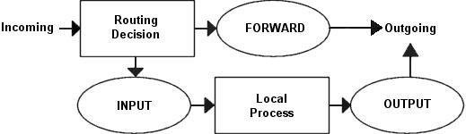


Основное назначение рисунка - освежить нашу память. В целом, данный пример сценария основан на предположении, что мы имеем одну локальную сеть, один брандмауэр (firewall) и единственное подключение к Интернет, с постоянным IP адресом (в противоположность PPP, SLIP, DHCP и прочим). Так же предполагается, что доступ к сервисам Интернет идет через брандмауэр, что мы полностью доверяем нашей локальной сети и поэтому не собираемся блокировать траффик, исходящий из локальной сети, однако Интернет не может считаться доверительной сетью и поэтому необходимо ограничить возможность доступа в нашу локальную сеть извне. Мы собираемся исходить из принципа "Все что не разрешено - то запрещено". Для выполнения последнего ограничения, мы устанавливаем политику по-умолчанию - `DROP`. Тем самым мы отсекаем соединения, которые явно не разрешены.

А теперь давайте рассмотрим что нам нужно сделать и как.

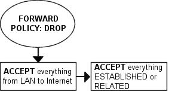


Для начала - позволим соединения из локальной сети с Интернет. Для этого нам потребуется выполнить преобразование сетевых адресов (NAT). Делается это в цепочке `PREROUTING` (Я полагаю, что здесь автор просто допустил опечатку, поскольку в тексте сценария заполняется цепочка `POSTROUTING`, да и мы уже знаем, что `SNAT` производится в цепочке `POSTROUTING` таблицы `nat` **прим. перев.**), которая заполняется последней в нашем сценарии. Подразумевается, также, выполнение некоторой фильтрации в цепочке `FORWARD`. Если мы полностью доверяем нашей локальной сети, пропуская весь траффик в Интернет, то это еще не означает доверия к Интернет и, следовательно необходимо вводить ограничения на доступ к нашим компьютерам извне. В нашем случае мы допускаем прохождение пакетов в нашу сеть только в случае уже установленного соединения, либо в случае открытия нового соединения, но в рамках уже существующего (`ESTABLISHED` и `RELATED`).

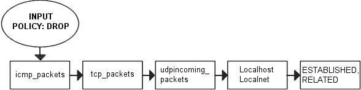


Что касается машины-брандмауэра - необходимо до минимума свести сервисы, работающие с Интернет. Следовательно мы допускаем только HTTP, FTP, SSH и IDENTD доступ к брандмауэру. Все эти протоколы мы будем считать допустимыми в цепочке `INPUT`, соответственно нам необходимо разрешить "ответный" траффик в цепочке `OUTPUT`. Поскольку мы предполагаем доверительные взаимоотношения с локальной сетью, то мы добавляем правила для диапазона адресов локальной сети, а заодно и для локального сетевого интерфейса и локального IP адреса (127.0.0.1). Как уже упоминалось выше, существует ряд диапазонов адресов, выделенных специально для локальных сетей, эти адреса считаются в Интернет ошибочными и как правило не обслуживаются. Поэтому и мы запретим любой траффик из Интернет с исходящим адресом, принадлежащим диапазонам локальных сетей. И в заключение прочитайте главу _Общие проблемы и вопросы_.

Так как у нас работает FTP сервер, то правила, обслуживающие соединения с этим сервером, желательно было бы поместить в начало цепочки INPUT, добиваясь тем самым уменьшения нагрузки на систему. В целом же, надо понимать, что чем меньше правил проходит пакет, тем больше экономия процессорного времени, тем ниже нагрузка на систему. С этой целью я разбил набор правил на дополнительные цепочки.

В нашем примере я разбил пакеты на группы по их принадлежности к тому или иному протоколу. Для каждого типа протокола создана своя цепочка правил, например, `tcp_packets`, которая содержит правила для проверки всех допустимых TCP портов и протоколов. Для проведения дополнительной проверки пакетов, прошедших через одну цепочку, может быть создана другая. В нашем случае таковой является цепочка `allowed`. В этой цепочке производится дополнительная проверка отдельных характеристик TCP пакетов перед тем как принять окончательное решение о пропуске. ICMP пакеты следуют через цепочку `icmp_packets`. Здесь мы просто пропускаем все ICMP пакеты с указанным кодом сообщения. И наконец UDP пакеты. Они проходят через цепочку `udp_packets`, которая обрабатывает входящие UDP пакеты. Если они принадлежат допустимым сервисам, то они пропускаются без проведения дополнительной проверки.

Поскольку мы рассматриваем сравнительно небольшую сеть, то наш брандмауэр используется еще и в качестве рабочей станции, поэтому мы делаем возможным соединение с Интернет и с самого брандмауэра.


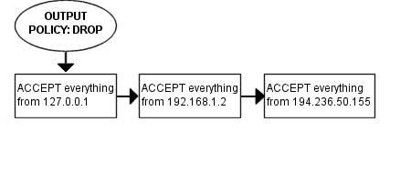


И в завершение о цепочке `OUTPUT`. Мы не выполняем каких либо специфичных блокировок для пользователей, однако мы не хотим, чтобы кто либо, используя наш брандмауэр выдавал в сеть "поддельные" пакеты, поэтому мы устанавливаем правила, позволяющие прохождение пакетов только с нашим адресом в локальной сети, с нашим локальным адресом (127.0.0.1) и с нашим адресом в Интернет. С этих адресов пакеты пропускаются цепочкой `OUTPUT`, все остальные (скорее всего сфальсифицированные) отсекаются политикой по-умолчанию `DROP`.

#### 7.2.5. Установка политик по-умолчанию <a name="link_70"></a>

Прежде, чем приступить к созданию набора правил, необходимо определиться с политиками цепочек по-умолчанию. Политика по-умолчанию устанавливается командой, подобной приводимой ниже

```
iptables [-P {chain} {policy}]
```

Политика по-умолчанию представляет собой действие, которое применяется к пакету, не попавшему под действие ни одного из правил в цепочке. (Небольшое уточнение, команда iptables -P применима ТОЛЬКО К ВСТРОЕННЫМ цепочкам, т.е. `INPUT, FORWARD, OUTPUT` и т.п., и не применима к пользовательским цепочкам. **прим. перев.**).

> Будьте предельно осторожны с установкой политик по-умолчанию для цепочек из таблиц, не предназначенных для фильтрации, так как это может приводить к довольно странным результатам.

#### 7.2.6. Создание пользовательских цепочек в таблице filter <a name="link_71"></a>

Итак, у вас перед глазами наверняка уже стоит картинка движения пакетов через различные цепочки, и как эти цепочки взаимодействуют между собой! Вы уже должны ясно представлять себе цели и назначение данного сценария. Давайте начнем создавать цепочки и наборы правил для них.

Прежде всего необходимо создать дополнительные цепочки с помощью команды `-N`. Сразу после создания цепочки еще не имеют ни одного правила. В нашем примере создаются цепочки `icmp_packets`, `tcp_packets`, `udp_packets` и цепочка `allowed`, которая вызывается из цепочки `tcp_packets`. Входящие пакеты с интерфейса `$INET_IFACE` (т.е. из Интернет), по протоколу `ICMP` перенаправляются в цепочку `icmp_packets`, пакеты протокола TCP перенаправляются в цепочку `tcp_packets` и входящие пакеты UDP с интерфейса eth0 идут в цепочку `udp_packets`. Более подробное описание вы найдете в разделе _Цепочка INPUT_. Синтаксис команды для создания своей цепочки очень прост:

```
iptables [-N chain]
```

##### 7.2.6.1. Цепочка bad_tcp_packets <a name="link_72"></a>

Эта цепочка предназначена для отфильтровывания пакетов с "неправильными" заголовками и решения ряда других проблем. Здесь отфильтровываются все пакеты, которые распознаются как NEW, но не являются `SYN` пакетами, а так же обрабатываются `SYN/ACK`-пакеты, имеющие статус `NEW`. Эта цепочка может быть использована для защиты от вторжения и сканирования портов. Сюда, так же, добавлено правило для отсеивания пакетов со статусом `INVALID`.

Если вы пожелаете почитать более подробно об этой проблеме, то смотрите раздел _Пакеты со статусом NEW и со сброшенным битом SYN_ в приложении _Общие проблемы и вопросы_. Разумеется, не всегда справедливо будет просто сбрасывать пакеты с признаком NEW и сброшенным битом `SYN`, но в 99% случаев это оправданный шаг. Поэтому мой сценарий заносит информацию о таких пакетах в чичтемный журнал, а затем "сбрасывает" их.

Причина, по которой для `SYN/ACK`-пакетов со статусом `NEW @применяется действие @REJECT`, достаточно проста. Она описывается в разделе _SYN/ACK - пакеты и пакеты со статусом NEW_ приложения _Общие проблемы и вопросы_. Общепринятой считается необходимость отправления пакета `RST` в подобных случаях (RST в ответ на незапрошенный `SYN/ACK`). Тем самым мы предотвращаем возможность атаки "Предсказание номера TCP-последовательности" (`Sequence Number Prediction`) на другие узлы сети.

##### 7.2.6.2. Цепочка allowed <a name="link_73"></a>

TCP пакет, следуя с интерфейса `$INET_IFACE`, попадает в цепочку `tcp_packets`, если пакет следует на разрешенный порт, то после этого проводится дополнительная проверка в цепочке `allowed`.

Первое правило проверяет, является ли пакет `SYN` пакетом, т.е. запросом на соединение. Такой пакет мы считаем допустимым и пропускаем. Следующее правило пропускает все пакеты с признаком `ESTABLISHED` или `RELATED`. Когда соединение устанавливается `SYN` пакетом, и на этот запрос был отправлен положительный ответ, то оно получает статус `ESTABLISHED`. Последним правилом в этой цепочке сбрасываются все остальные `TCP` пакеты. Под это правило попадают пакеты из несуществующего соединения, пакеты со сброшенным битом `SYN`, которые пытаются запустить соединение. Не `SYN` пакеты практически не используются для запуска соединения, за исключением случаев сканирования портов. Насколько я знаю, на сегодняшний день нет реализации `TCP/IP`, которая поддерживала бы открытие соединения иначе, чем передача `SYN` пакета, поэтому на 99% можно быть уверенным, что сброшены пакеты, посланные сканером портов.

##### 7.2.6.3. Цепочка для TCP <a name="link_74"></a>

Итак, мы подошли к TCP соединениям. Здесь мы указываем, какие порты могут быть доступны из Internet. Несмотря на то, что даже если пакет прошел проверку здесь, мы все равно все пакеты передаем в цепочку `allowed` для дополнительной проверки.

Я открыл TCP порт с номером 21, который является портом управления FTP соединениями. и далее, я разрешаю все `RELATED` соединения, разрешая, тем самым, `PASSIVE FTP`, при условии, что был загружен модуль `ip_conntrack_ftp`. Если вам потребуется запретить FTP соединения, то вам потребуется выгрузить модуль `ip_conntrack_ftp` и удалить строку `$IPTABLES -A tcp_packets -p TCP -s 0/0 --dport 21 -j allowed` из сценария [rc.firewall.txt](http://www.calculate-linux.ru/attachments/1440/rc.firewall.txt).

Порт 22 - это SSH, который намного более безопасен чем telnet на 23 порту. Если Вам вздумается предоставить доступ к командной оболочке (shell) кому бы то ни было из Интернет, то лучше конечно пользоваться SSH. Однако, хочу заметить, что вообще-то считается дурным тоном предоставлять доступ к брандмауэру любому кроме вас самих. Ваш сетевой экран должен иметь только те сервисы, которые действительно необходимы и не более того.

Порт 80 - это порт HTTP, другим словами - web сервер, уберите это правило, если у вас нет web сервера.

И наконец порт 113, ответственный за службу `IDENTD` и использующийся некоторыми протоколами типа IRC, и пр. Замечу, что вам следует использовать пакет `oidentd` если вы делаете трансляцию сетевых адресов для некоторых узлов (хостов) в локальной сети. `oidentd` поддерживает передачу `IDENTD` запросов в локальной сети.

Если у вас имеется необходимость открыть дополнительные порты, то просто скопируйте одно из правил в цепочке `tcp_packets` и подправьте номера портов в соответствии с вашими требованиями.

##### 7.2.6.4. Цепочка для UDP <a name="link_75"></a>

Пакеты UDP из цепочки `INPUT` следуют в цепочку `udp_packets` Как и в случае с TCP пакетами, здесь они проверяются на допустимость по номеру порта назначения. Обратите внимание - мы не проверяем исходящий порт пакета, поскольку об этом заботится механизм определения состояния. Открываются только те порты, которые обслуживаются серверами или демонами на нашем брандмауэре. Пакеты, которые поступают на брандмауэр по уже установленным соединениям (установленным из локальной сети) пропускаются брандмауэром автоматически, поскольку имеют состояние `ESTABLISHED` или `RELATED`.

Как видно из текста сценария, порт 53, на котором "сидит" DNS, для UDP пакетов закрыт, то есть правило, открывающее 53-й порт в сценарии присутствует, но закомментировано. Если вы пожелаете запустить DNS на брандмауэре, то это правило следует раскомментировать.

Я лично разрешаю порт 123, на котором работает NTP (`network time protocol`). Этой службой обычно пользуются для приема точного времени с серверов времени в Интернет. Однако, вероятнее всего, что вы не используете этот протокол, поэтому соответствующее правило в сценарии так же закомментировано.

Порт 2074 используется некоторыми мультимедийными приложениями, подобно `speak freely`, которые используются для передачи голоса в режиме реального времени.

И наконец - ICQ, на порту 4000. Это широко известный протокол, используемый ICQ-приложениями Я полагаю, не следует объяснять вам что это такое.

Кроме того в сценарии приведены еще два правила, которые по-умолчанию закомментированы. Ими можно воспользоваться, если брандмауэр чрезмерно нагружен. Первое - блокирует широковещательные пакеты, поступающие на порты со 135 по 139. Эти порты используются протоколами `SMB` и `NetBIOS` от Microsoft. Таким образом данное правило предотвращает переполнение таблицы трассировщика в сетях `Microsoft Network`. Второе правило блокирует DHCP запросы извне. Это правило определенно имеет смысл если внешняя сеть содержит некоммутируемые сегменты, где IP адреса выделяются клиентам динамически.

> Последние два правила не являются обязательными (в тексте сценария они закомментированы). Все пакеты, которые не были отвергнуты или приняты явно, логируются в журнал последним правилом в цепочке `INPUT`, поэтому, если вас беспокоит проблема "раздувания" системного журнала -- можете раскомментировать эти правила.

##### 7.2.6.5. Цепочка для ICMP <a name="link_76"></a>

Здесь принимается решение о пропуске `ICMP` пакетов. Если пакет приходит с eth0 в цепочку `INPUT`, то далее он перенаправляется в цепочку `icmp_packets`. В этой цепочке проверяется тип ICMP сообщения. Пропускаются только `ICMP Echo Request`, `TTL equals 0 during transit` и `TTL equals 0 during reassembly`. Все остальные типы ICMP сообщений должны проходить брандмауэр беспрепятственно, поскольку будут иметь состояние `RELATED`.

> Если `ICMP` пакет приходит в ответ на наш запрос, то он приобретает статус `RELATED` (связанный с имеющимся соединением). Более подробно состояние пакетов рассматривается в главе Механизм определения состояний

При принятии решения я исхожу из следующих соображений: `ICMP Echo Request` пакеты посылаются, главным образом, для проверки доступности хоста. Если удалить это правило, то наш брандмауэр не будет "откликаться" в ответ на `ICMP Echo Request`, что сделает использование утилиты ping и подобных ей, по отношению к брандмауэру, бесполезными.

`Time Exceeded` (т.е., `TTL equals 0 during transit` и `TTL equals 0 during reassembly`). Во время движения пакета по сети, на каждом маршрутизаторе поле TTL, в заголовке пакета, уменьшается на 1. Как только поле TTL станет равным нулю, то маршрутизатором будет послано сообщение `Time Exceeded`. Например, когда вы выполняете трассировку (`traceroute`) какого либо узла, то поле TTL устанавливается равным 1, на первом же маршрутизаторе оно становится равным нулю и к нам приходит сообщение `Time Exceeded`, далее, устанавливаем TTL = 2 и второй маршрутизатор передает нам Time Exceeded, и так далее, пока не получим ответ с самого узла.

Список типов ICMP сообщений смотрите в приложении _Типы ICMP_. Дополнительную информацию по ICMP вы можете получить в следующих документах:

- [The Internet Control Message Protocol](http://replay.waybackmachine.org/20030413085014/http://www.ee.siue.edu/~rwalden/networking/icmp.html)
- "RFC 792 - Internet Control Message Protocol - от J. Postel":

> Будьте внимательны при блокировании ICMP пакетов, возможно я не прав, блокируя какие-то из них, может оказаться так, что для вас это неприемлемо.

#### 7.2.7. Цепочка INPUT <a name="link_77"></a>

Цепочка INPUT, как я уже писал, для выполнения основной работы использует другие цепочки, за счет чего снижая нагрузку на сетевой фильтр. Эффект применения такого варианта организации правил лучше заметен на медленных машинах, которые в другом случае начинают "терять" пакеты при высокой нагрузке. Достигается это разбиением набора правил по некоторому признаку и выделение их в отдельные цепочки. Тем самым уменьшается количество правил, которое проходит каждый пакет.

Первым же правилом мы пытаемся отбросить "плохие" пакеты. За дополнительной информацией обращайтесь к приложению _Цепочка bad_tcp_packets_. В некоторых особенных ситуациях такие пакеты могут считаться допустимыми, но в 99% случаев лучше их "остановить". Поэтому такие пакеты заносятся в системный журнал (логируются) и "сбрасываются".

Далее следует целая группа правил, которая пропускает весь трафик, идущий из доверительной сети, которая включает в себя сетевой адаптер, связанный с локальной сетью и локальный сетевой интерфейс (`lo`) и имеющий исходные адреса нашей локальной сети (включая реальный IP адрес). Эта группа правил стоит первой по той простой причине, что локальная сеть генерирует значительно бОльший трафик чем трафик из Internet. Поэтому, при построении своих наборов правил, всегда старайтесь учитывать объем трафика, указывая первыми те правила, которые будут обслуживать больший трафик.

Первым в группе, анализирующей трафик идущий с `$INET_IFACE`, стоит правило, пропускающее все пакеты со статусом `ESTABLISHED` или `RELATED` (эти пакеты являются частью уже УСТАНОВЛЕННОГО или СВЯЗАННОГО соединения). Это правило эквивалентно правилу, стоящему в цепочке `allowed`. И в некоторой степени является избыточным, поскольку затем цепочка allowed вызывается опосредованно через цепочку `tcp_packets`, однако оно несколько разгружает сетевой фильтр, поскольку значительная доля трафика пропускается этим праилом и не проходит всю последовательность до цепочки `allowed`.

После этого производится анализ трафика, идущего из Internet. Все пакеты, приходящие в цепочку `INPUT` с интерфейса `$INET_IFACE` распределяются по вложенным цепочкам, в зависимости от типа протокола. TCP пакеты передаются в цепочку `tcp_packets`, UDP пакеты отправляются в цепочку `udp_packets` и `ICMP` перенаправляются в цепочку `icmp_packets`. Как правило, большую часть трафика "съедают" TCP пакеты, потом UDP и меньший объем приходится на долю ICMP, однако в вашем конкретном случае это предположение может оказаться неверным. Очень важно учитывать объем трафика, проходящего через набор правил. Учет объема трафика - абсолютная необходимость. В случае неоптимального распределения правил даже машину класса Pentium III и выше, с сетевой картой 100 Мбит и большим объемом передаваемых данных по сети, довольно легко можно "поставить на колени" сравнительно небольшим объемом правил.

Далее следует весьма специфическое правило (по-умолчанию закомментировано). Дело в том, что клиенты Microsoft Network имеют "дурную привычку" выдавать огромное количество Multicast (групповых) пакетов в диапазоне адресов 224.0.0.0/8. Поэтому можно использовать данное правило для предотвращения "засорения" логов в случае, если с внешней стороны имеется какая либо сеть Microsoft Network. Подобную же проблему решают два последних правила (по-умолчанию закомментированы) в цепочке `udp_packets`, описанные в _Цепочка для UDP_.

Последним правилом, перед тем как ко всем не принятым явно пакетам в цепочке `INPUT` будет применена политика по-умолчанию, траффик журналируется, на случай необходимости поиска причин возникающих проблем. При этом мы устанавливаем правилу, ограничение на количество логируемых пакетов - не более 3-х в минуту, чтобы предотвратить чрезмерное раздувание журнала и кроме того подобные записи в журнал сопровождаются собственным комментарием (префиксом), чтобы знать откуда появились эти записи.

Все что не было явно пропущено в цепочке `INPUT` будет подвергнуто действию DROP, поскольку именно это действие назначено в качестве политики по-умолчанию. Политики по-умолчанию были описаны чуть выше в разделе У_становка политик по-умолчанию_.

#### 7.2.8. Цепочка FORWARD <a name="link_78"></a>

Цепочка `FORWARD` содержит очень небольшое количество правил. Первое правило напрвляет все TCP пакеты на проверку в цепочку `bad_tcp_packets`, которая используется так же и в цепочке `INPUT`. Цепочка `bad_tcp_packets` сконструирована таким образом, что может вызываться из других цепочек, невзирая на то, куда направляется пакет. После проверки TCP пакетов, как обычно, мы разрешем движение пакетов из локальной сети без ограничений.

Далее, пропускается весь трафик из локальной сети без ограничений. Естественно, нужно пропустить ответные пакеты в локальную сеть, поэтому следующим правилом мы пропускаем все, что имеет признак `ESTABLISHED` или `RELATED`, т.е. мы пропускаем пакеты по соединению установленному ИЗ локальной сети.

И в заключение заносим в системный журнал информацию о сброшенных пакетах, предваряя их префиксом `"IPT FORWARD packet died: "`, чтобы потом, в случае поиска ошибок, не перепутать их с пакетами, сброшенными в цепочке `INPUT`.

#### 7.2.9. Цепочка OUTPUT <a name="link_79"></a>

Как я уже упоминал ранее, в моем случае компьютер используется как брандмауэр и одновременно как рабочая станция. Поэтому я позволяю покидать мой хост всему, что имеет исходный адрес `$LOCALHOST_IP`@, $LAN_IP@ или `$STATIC_IP`. Сделано это для защиты от трафика, который может сфальсицироваться моего компьютера, несмотря на то, что я совершенно уверен во всех, кто имеет к нему доступ. И в довершение ко всему, я журналирую "сброшенные" пакеты, на случай поиска ошибок или в целях выявления сфальсифицированных пакетов. Ко всем пакетам, не прошедшим ни одно из правил, применяется политика по-умолчанию `-- DROP`.

#### 7.2.10. Цепочка PREROUTING таблицы nat <a name="link_80"></a>

В данном сценарии эта цепочка не имеет ни одного правила и единственно, почему я привожу ее описание здесь, это еще раз напомнить, что в данной цепочке выполняется преобразование сетевых адресов (`DNAT`) перед тем как пакеты попадут в цепочку `INPUT` или `FORWARD`.

> Еще раз хочу напомнить, что эта цепочка не предназначена ни для какого вида фильтрации, а только для преобразования адресов, поскольку в эту цепочку попадает только первый пакет из потока.

#### 7.2.11. Запуск SNAT и цепочка POSTROUTING <a name="link_81"></a>

И заключительный раздел - настройка `SNAT`. По крайней мере для меня. Прежде всего мы добавляем правило в таблицу nat, в цепочку `POSTROUTING`, которое производит преобразование исходных адресов всех пакетов, исходящих с интерфейса, подключенного к Internet. В сценарии определен ряд переменных, с помощью которых можно использовать для автоматической настройки сценария. Кроме того, использование переменных повышает удобочитаемость скриптов. Ключом `-t` задается имя таблицы, в данном случае `nat`. Команда `-A` добавляет (`Add`) новое правило в цепочку `POSTROUTING`, критерий `-o $INET_IFACE` задает исходящий интерфейс, и в конце правила задаем действие над пакетом `--SNAT`. Таким образом, все пакеты, подошедшие под заданный критерий будут "замаскированы", т.е. будут выглядеть так, как будто они отправлены с нашего узла. Не забудьте указать ключ `--to-source` с соответствующим IP адресом для исходящих пакетов

В этом сценарие я использую `SNAT` вместо `MASQUERADE` по ряду причин. Первая - предполагается, что этот сценарий должен работать на сетевом узле, который имеет постоянный IP адрес. Следующая состоит в том, что `SNAT` работает быстрее и более эффективно. Конечно, если вы не имеете постоянного IP адреса, то вы должны использовать действие `MASQUERADE`, которое предоставляет более простой способ трансляции адресов, поскольку оно автоматически определяет IP адрес, присвоенный заданному интерфейсу. Однако, по сравнению с `SNAT` это действие требует несколько больших вычислительных ресурсов, хотя и не значительно. Пример работы с `MASQUERADE`, вы найдете в сценарии [rc.DHCP.firewall.txt](http://www.calculate-linux.org/attachments/1441/rc.DHCP.firewall.txt)

## Глава 8. Примеры сценариев <a name="link_82"></a>

Цель этой главы состоит в том, чтобы дать краткое описание каждого сценария, в этом руководстве. Эти сценарии не совершенны, и они не могут полностью соответствовать вашим нуждам. Это означает, что вы должны сами "подогнать" эти сценарии под себя. Последующая часть руководства призвана облегчить вам эту подгонку.

### 8.1. Структура файла rc.firewall.txt <a name="link_83"></a>

Все сценарии, описанные в этом руководстве, имеют определенную структуру. Сделано это для того, чтобы сценарии были максимально похожи друг на друга, облегчая тем самым поиск различий между ними. Эта структура довольно хорошо описывается в этой главе. Здесь я надеюсь дать вам понимание, почему все сценарии были написаны именно так и почему я выбрал именно эту структуру.

> Обратите внимание на то, что эта структура может оказаться далеко неоптимальной для ваших сценариев. Эта структура выбрана лишь для лучшего объяснения хода моих мыслей.

### 8.1.1. Структура <a name="link_84"></a>

Это - структура, которой следуют все сценарии в этом руководстве. Если вы обнаружите, что это не так, то скорее всего это моя ошибка, если конечно я не объяснил, почему я нарушил эту структуру.

1. _Configuration_ - Прежде всего мы должны задать параметры конфигурации, для сценария. Параметры Конфигурации, в большинстве случаев, должны быть описаны первыми в любом сценарии.
    1. _Internet_ - Это раздел конфигурации, описывающей подключение к Internet. Этот раздел может быть опущен, если вы не подключены к Интернет. Обратите внимание, что может иметься большее количество подразделов чем, здесь перечислено, но только те, которые описывают наше подключение к Internet.
        1. _DHCP_ - Если имеются специфичные для DHCP настройки, то они добавляются здесь.
        2. _PPPoE_ - Описываются параметры настройки PPPoE подключения.
    2. _LAN_ - Если имеется любая ЛОКАЛЬНАЯ СЕТЬ за брандмауэром, то здесь указываются параметры, имеющие отношение к ней. Наиболее вероятно, что этот раздел будет присутствовать почти всегда.
    3. _DMZ_ - Здесь добавляется конфигурация зоны DMZ. В большинстве сценариев этого раздела не будет, т.к. любая нормальная домашняя сеть, или маленькая локальная сеть, не будет иметь ее. (`DMZ - de-militarized zone`. Скорее всего под это понятие автор подвел небольшую подсеть, в которой расположены серверы, например: DNS, MAIL, WEB и т.п, и нет ни одной пользовательской машины. прим. перев.)
    4. _Localhost_ - Эти параметры принадлежат нашему брандмауэру (localhost). В вашем случае эти переменные вряд ли изменятся, но, тем не менее, я создал эти переменные.Хотелось бы надеяться, что у вас не будет причин изменять эти переменные.
    5. _iptables_ - Этот раздел содержит информацию об iptables. В большинстве сценариев достаточно будет только одной переменной, которая указывает путь к iptables.
    6. _Other_ - Здесь располагаются прочие настройки, которые не относятся и к одному из вышеуказанных разделов.
2. _Module loading_ - Этот раздел сценариев содержит список модулей. Первая часть должна содержать требуемые модули, в то время как вторая часть должна содержать нетребуемые модули.  
    bq. Обратить внимание. Некоторые модули, отвечающие за дополнительные возможности, могут быть указаны даже если они не требуются. Обычно, в таких случаях, пример сценария отмечает эту особенность.
    1. _Required modules_ - Этот раздел должен содержать модули, необходимые для работы сценария.
    2. _Non-required modules_ - Этот раздел содержит модули, которые не требуются для нормальной работы сценария. Все эти модули должны быть закомментированы. Если вам они потребуются, то вы должны просто раскомментировать их.
3. _proc configuration_ - Этот раздел отвечает за настройку файловой системы `/proc`. Если эти параметры необходимы - они будут перечислены, если нет, то они должны быть закомментированы по-умолчанию, и указаны как не-требуемые. Большинство полезных настроек `/proc` будут перечислены в примерах, но далеко не все.
    1. _Required proc configuration_ - Этот раздел должен содержать все требуемые сценарием настройка для `/proc`. Это могут быть настройки для запуска системы защиты, возможно, добавляют специальные возможности для администратора или пользователей.
    2. _Non-required proc configuration_ - Этот раздел должен содержать не-требуемые настройки `/proc`, которые могут оказаться полезными в будущем. Все они должны быть закомментированы, так как они фактически не требуются для работы сценария. Этот список будет содержать далеко не все настройки `/proc`.
4. _rules set up_ - К этому моменту скрипт, как правило, уже подготовлен к тому, чтобы вставлять наборы правил. Я разбил все правила по таблицам и цепочкам. Любые пользовательские цепочки должны быть созданы прежде, чем мы сможем их использовать. Я указываю цепочки и их наборы правил в том же порядке, в каком они выводятся командой iptables -L.
    1. _Filter table_ - Прежде всего мы проходим таблицу `filter`. Для начала необходимо установить политику по умолчанию в таблице.
    2. _Set policies_ - Назначение политик по-умолчанию для системных цепочек. Обычно я устанавливаю `DROP` для цепочек в таблице `filter`, и буду пропускать потоки, которые идут изнутри. Тем самым мы избавимся от всего, что нам неугодно.
    3. _Create user specified chains_ - В этом разделе, создаются все пользовательские цепочки, которые мы будем использовать позже в пределах этой таблицы. Мы не сможем использовать эти цепочки в до тех пор, пока не создадим их.
    4. _Create content in user specified chains_ - После создания пользовательских цепочек, мы можем заполнить их правилами. Единственная причина, по которой правила для пользовательских цепочек определяются здесь -- это близость к командам, создающим эти цепочки. Вы же можете размещать правила в другом месте вашего сценария.
    5. _INPUT chain_ - В этом разделе добавляются правила для цепочки `INPUT`.  
        bq. Как уже указывалось, я старался следовать порядку, который получается в выводе команды iptables -L. Нет серьезных причин, чтобы соблюдать эту структуру, однако, пробуйте избежать смешивания данных из различных таблиц и цепочек, так как станет намного тяжелее читать такой набор правил и выискивать возможные проблемы.
    6. _FORWARD chain_ - Здесь мы добавляем правила в цепочку `FORWARD`
    7. _OUTPUT chain_ - амой последней в таблице filter, заполняется цепочка `OUTPUT`.
5. _nat table_ - После таблицы `filter` мы переходим к таблице nat. Сделано это по ряду причин. Прежде всего - не следует запускать механизм NAT на ранней стадии, когда еще возможна передача пакетов без ограничений (то есть, когда NAT уже включена, но нет ни одного правила фильтрации). Также, я рассматриваю таблицу nat как своего рода уровень, который находится вне таблицы `filter`. Таблица filter является своего рода ядром, в то время как nat - оболочка вокруг ядра, а таблица mangle. может рассматриваться как оболочка вокруг таблицы nat. Это может быть не совсем правильно, но и не далеко от действительности.
    1. _Set policies_ - Прежде всего мы устанавливаем всю политику по умолчанию в пределах таблицы nat. Обычно, я устанавливаю `ACCEPT`. Эта таблица не должна использоваться для фильтрации, и мы не должны здесь "выбрасывать" (`DROP`) пакеты. Есть ряд неприятных побочных эффектов которые имеют место быть в таких случаях из-за наших предположений. Я пропускаю все пакеты в этих цепочках, поскольку не вижу никаких причин не делать этого.
    2. _Create user specified chains_ - Здесь создаются все пользовательские цепочки для таблицы nat. Обычно у меня их нет, но я добавил этот раздел на всякий случай. Обратите внимание, что пользовательские цепочки должны быть созданы до их фактического использования.
    3. _Create content in user specified chains_ - Добавление правил в пользовательские цепочки таблицы nat. Принцип размещения правил здесь тот же что и в таблице filter. Я добавляю их здесь потому, что не вижу причин выносить их в другое место.
    4. _PREROUTING chain_ - Цепочка `PREROUTING` используется для `DNAT`. В большинстве сценариев DNAT не используется, или по крайней мере закомментирована, чтобы не "открывать ворота" в нашу локальную сеть слишком широко. В некоторых сценариях это правило включено, так как единственная цель этих сценариев состоит в предоставлении услуг, которые без DNAT невозможны.
    5. _POSTROUTING chain_ - Цепочка `POSTROUTING` используется сценариями, которые я написал, так как в большинстве случаев имеется одна или более локальных сетей, которые мы хотим подключить к Интернет через сетевой экран. Главным образом мы будем использовать SNAT, но в некоторых случаях, мы вынуждены будем использовать `MASQUERADE`.
    6. _OUTPUT chain_ - Цепочка `OUTPUT` используется вообще в любом из сценариев. Но я пока не нашел серьезных оснований для использования этой цепочки. Если вы используете эту цепочку, черкните мне пару строк, и я внесу соответствующие изменения в данное руководство.
6. _mangle table_ - Таблица mangle - последняя таблица на пути пакетов. Обычно я не использую эту таблицу вообще, так как обычно не возникает потребностей в чем либо, типа изменения TTL поля или поля TOS и пр. Другими словами, я оставил этот раздел пустым в некоторых сценариях, с несколькими исключениями, где я добавил, несколько примеров использования этой таблицы.
    1. _Set policies_ - Здесь задается Политика по-умолчанию. Здесь существуют те же ограничения, что и для таблицы nat. Таблица не должна использоваться для фильтрации, и следовательно вы должны избегать этого. Я не устанавливал никакой политики в любом из сценариев для цепочек в таблице mangle, и вам следут поступать так же.
    2. _Create user specified chains_ - Создаются пользовательские цепочки. Так как я не использую таблицу mangle в сценариях, я не стал создавать пользовательских цепочек. Однако, этот раздел был добавлен на всякий случай.
    3. _Create content in user specified chains_ - Если вы создали какие либо пользовательские цепочки в пределах этой таблицы, вы можете заполнить их правилами здесь.
    4. _PREROUTING_ - В этом пункте имеется только упоминание о цепочке.
    5. _INPUT chain_ - В этом пункте имеется только упоминание о цепочке.
    6. _FORWARD chain_ - В этом пункте имеется только упоминание о цепочке.
    7. _OUTPUT chain_ - В этом пункте имеется только упоминание о цепочке.
    8. _POSTROUTING chain_ - В этом пункте имеется только упоминание о цепочке.

Надеюсь, что я объяснил достаточно подробно, как каждый сценарий структурирован и почему они структурированы таким способом.

> Обратите внимание, что эти описания чрезвычайно кратки, и являются лишь кратким пояснением того, почему сценарии имеют такую структуру. Я не претендую на истину в последней инстанции и не утверждаю, что это - единственный и лучший вариант.

### 8.2. rc.firewall.txt <a name="link_85"></a>


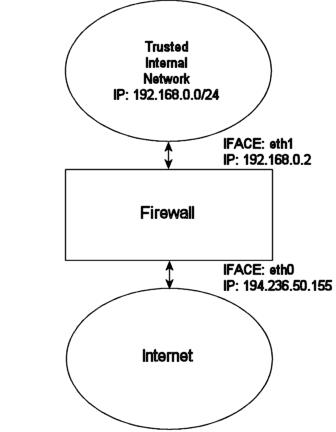


Сценарий [rc.firewall.txt](http://www.calculate-linux.ru/attachments/1440/rc.firewall.txt) - основное ядро, на котором основывается остальные сценарии. _Глава Файл rc.firewall_ достаточно подробно описывает сценарий. Сценарий написан для домашней сети, где вы имеете одну ЛОКАЛЬНУЮ СЕТЬ и одно подключение к Internet. Этот сценарий также исходит из предположения, что вы имеете статический IP адрес, и следовательно не используете `DHCP`, `PPP`, `SLIP` либо какой то другой протокол, который назначает IP динамически. В противном случае возьмите за основу сценарий [rc.DHCP.firewall.txt](http://www.calculate-linux.ru/attachments/1441/rc.DHCP.firewall.txt)

Сценарий требует, чтобы следующие опции были скомпилированы либо статически, либо как модули. Без какой либо из них сценарий будет неработоспособен. Кроме того, изменения, которые вы возможно внесете в текст сценария, могут потребовать включения дополнительных возможностей в ваше ядро.

- CONFIG_NETFILTER
- CONFIG_IP_NF_CONNTRACK
- CONFIG_IP_NF_IPTABLES
- CONFIG_IP_NF_MATCH_LIMIT
- CONFIG_IP_NF_MATCH_STATE
- CONFIG_IP_NF_FILTER
- CONFIG_IP_NF_NAT
- CONFIG_IP_NF_TARGET_LOG

### 8.3. rc.DMZ.firewall.txt <a name="link_86"></a>


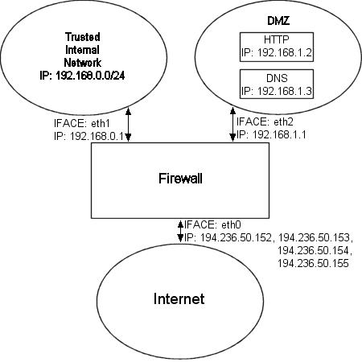


Сценарий [@rc.DMZ.firewall.txt](http://www.calculate-linux.ru/attachments/1442/rc.DMZ.firewall.txt) был написан для тех, кто имеет доверительную локальную сеть, одну "Демилитаризированную Зону" и одно подключение к Internet. Для доступа к серверам Демилитаризированной Зоны, в данном случае, извне, используется NAT "один к одному", то есть, Вы должны заставить брандмауэр распознавать пакеты более чем для одного IP адреса.

Сценарий требует, чтобы следующие опции были скомпилированы либо статически, либо как модули. Без какой либо из них сценарий будет неработоспособен

- CONFIG_NETFILTER
- CONFIG_IP_NF_CONNTRACK
- CONFIG_IP_NF_IPTABLES
- CONFIG_IP_NF_MATCH_LIMIT
- CONFIG_IP_NF_MATCH_STATE
- CONFIG_IP_NF_FILTER
- CONFIG_IP_NF_NAT
- CONFIG_IP_NF_TARGET_LOG

Сценарий работает с двумя внутренними сетями, как это продемонстрировано на рисунке. Одна использует диапазон IP адресов `192.168.0.0/24` и является Доверительной Внутренней Сетью. Другая использует диапазон `192.168.1.0/24` и называется Демилитаризированной Зоной (DMZ), для которой мы будем выполнять преобразование адресов (NAT) "один к одному". Например, если кто-то из Интернет отправит пакет на наш `DNS_IP`, то мы выполним DNAT для передачи пакета на DNS в DMZ. Если бы DNAT не выполнялся, то DNS не смог бы получить запрос, поскольку он имеет адрес `DMZ_DNS_IP`, а не `DNS_IP`. Трансляция выполняется следующим правилом:

```
$IPTABLES -t nat -A PREROUTING -p TCP -i $INET_IFACE -d $DNS_IP --dport 53 -j DNAT --to-destination $DMZ_DNS_IP
```

Для начала напомню, что `DNAT` может выполняться только в цепочке `PREROUTING` таблицы `nat`. Согласно этому правилу, пакет должен приходить по протоколу TCP на `$INET_IFACE` с адресатом IP, который соответствует нашему `$DNS_IP`, и направлен на порт 53. Если встречен такой пакет, то выполняется подмена адреса назначения, или DNAT. Действию DNAT передается адрес для подмены с помощью ключа `--to-destination $DMZ_DNS_IP`. Когда через брандмауэр возвращается пакет ответа, то сетевым кодом ядра адрес отправителя будет автоматически изменен с `$DMZ_DNS_IP` на `$DNS_IP`, другими словами обратная детрансляция адресов выполняется автоматически и не требует создания дополнительных правил.

Теперь вы уже должны понимать как работает DNAT, чтобы самостоятельно разобраться в тексте сценария без каких либо проблем. Если что-то для вас осталось не ясным и это не было рассмотрено в данном документе, то вы можете сообщить мне об этом - вероятно, это моя ошибка.

### 8.4. rc.DHCP.firewall.txt <a name="link_87"></a>

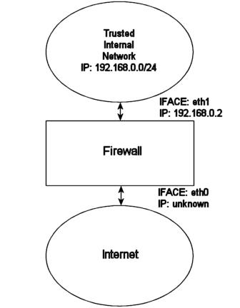

Сценарий [The rc.DHCP.firewall.txt](http://www.calculate-linux.ru/attachments/1441/rc.firewall.txt) очень похож на оригинал [rc.firewall.txt](http://www.calculate-linux.ru/attachments/1440/rc.firewall.txt). Однако, этот сценарий больше не использует переменную `STATIC_IP`, это и является основным отличием от оригинала [rc.firewall.txt](http://www.calculate-linux.ru/attachments/1440/rc.firewall.txt). Причина в том, что [rc.firewall.txt](http://www.calculate-linux.ru/attachments/1440/rc.firewall.txt) не будет работать в случае динамического IP адреса. Изменения, по сравнению с оригиналом - минимальны. Этот сценарий будет полезен в случае DHCP, PPP и SLIP подключения к Интернет.

Сценарий требует, чтобы следующие опции были скомпилированы либо статически, либо как модули. Без какой либо из них сценарий будет неработоспособен

- CONFIG_NETFILTER
- CONFIG_IP_NF_CONNTRACK
- CONFIG_IP_NF_IPTABLES
- CONFIG_IP_NF_MATCH_LIMIT
- CONFIG_IP_NF_MATCH_STATE
- CONFIG_IP_NF_FILTER
- CONFIG_IP_NF_NAT
- CONFIG_IP_NF_TARGET_MASQUERADE
- CONFIG_IP_NF_TARGET_LOG

Главное отличие данного скрипта состоит в удалении переменной `STATIC_IP` и всех ссылок на эту переменную. Вместо нее теперь используется переменная `INET_IFACE`. Другими словами `-d $STATIC_IP` заменяется на `-i $INET_IFACE`. Собственно, это все, что нужно изменить в действительности. (Хочется отметить, что в данном случае под `STATIC_IP` автор понимает переменную `INET_IP` прим. перев.)

Мы больше не можем устанавливать правила в цепочке `INPUT` подобных этому: `--in-interface $LAN_IFACE --dst $INET_IP`. Это в свою очередь вынуждает нас строить правила основываясь только на сетевом интерфейсе. Например, пусть на брандмауэре запущен HTTP сервер. Если мы приходим на главную страничку, содержащую статическую ссылку обратно на этот же сервер, который работает под динамическим адресом, то мы можем "огрести" немало проблем. Хост, который проходит через NAT, запросит через DNS IP адрес HTTP сервера, после чего попробует получить доступ к этому IP. Если брандмауэр производит фильтрацию по интерфейсу и IP адресу, то хост не сможет получить ответ, поскольку цепочка INPUT отфильтрует такой запрос. Это так же справедливо и для некоторых случаев когда мы имеем статический IP адрес, но тогда это можно обойти, используя правила, которые проверяют пакеты, приходящие с LAN интерфейса на наш `INET_IP` и выполнять `ACCEPT` для них.

После всего вышесказанного, не такой уж плохой может показаться мысль о создании сценария, который бы обрабатывал динамический IP. Например, можно было бы написать скрипт, который получает IP адрес через `ifconfig` и подставляет его в текст сценария (где определяется соответствующая переменная), который "поднимает" соединение с Интернет. Замечательный сайт linuxguruz.org имеет огромную коллекцию скриптов, доступных для скачивания. Ссылку на linuxguruz.org вы найдете в приложении _Ссылки на другие ресурсы_.

> Этот сценарий менее безопасен чем [rc.firewall.txt](http://www.calculate-linux.ru/attachments/1440/rc.firewall.txt). Я настоятельно рекомендую вам использовать сценарий [rc.firewall.txt](http://www.calculate-linux.ru/attachments/1440/rc.firewall.txt), если это возможно, так как [rc.DHCP.firewall.txt](http://www.calculate-linux.ru/attachments/1441/rc.DHCP.firewall.txt) более открыт для нападений извне.

Также, можно добавить в ваши сценарии что нибудь вроде этого:

INET_IP=`ifconfig $INET_IFACE | grep inet | cut -d : -f 2 | cut -d ' ' -f 1`

Выше приведенная команда получает динамический IP от интерфейса. Более совершенные методы получения IP адреса вы найдете в сценарии [retreiveip.txt](http://www.calculate-linux.ru/attachments/1443/retrieveip.txt). Однако у такого подхода есть серьезные недостатки, которые описанны ниже.

1. Если скрипт запускается из другого сценария, который в свою очередь запускается демоном PPP, то это может привести к "зависанию" всех, уже установленных соединений, из-за правил, которые отбраковывают пакеты со статусом NEW и со сброшенным битом SYN. (смотри раздел _Пакеты со статусом NEW и со сброшенным битом SYN_). Проблему конечно можно разрешить удалением этих правил, но такое решение довольно сомнительно с точки зрения безопасности.
2. Предположим, что у вас есть набор статических правил, довольно грубо будет постоянно стирать и добавлять правила, к тому же рискуя повредить существующие.
3. Это может привести к излишним усложнениям, что в свою очередь, влечет ослабление защиты. Чем проще скрипт, тем проще его сопровождать.

### 8.5. rc.UTIN.firewall.txt <a name="link_88"></a>


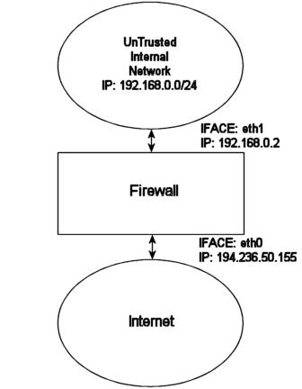


Сценарий [rc.UTIN.firewall.txt](http://www.calculate-linux.ru/attachments/1436/rc.UTIN.firewall.txt), в отличие от других сценариев, блокирует LAN, которая находится за брандмауэром. Мы доверяем внутренним пользователям не больше чем пользователям из Internet. Другими словами, мы не доверяем никому, ни в Интернет, ни в локальной сети, с которыми мы связаны. Поэтому доступ к Интернет ограничивается только протоколами POP3, HTTP и FTP.

Этот сценарий следует золотому правилу - "не доверяй никому, даже собственным служащим". Это грустно но факт - большая часть атак и взломов, которым подвергается компания, производится служащими компаний из локальных сетей. Этот сценарий, надеюсь, даст некоторые сведения, которые помогут вам усилить вашу межсетевую защиту. Он мало отличается от оригинала [rc.firewall.txt](http://www.calculate-linux.ru/attachments/1440/rc.firewall.txt), но содержит подсказки о том, что мы обычно пропускаем.

Сценарий требует, чтобы следующие опции были скомпилированы либо статически, либо как модули. Без какой либо из них сценарий будет неработоспособен:

- CONFIG_NETFILTER
- CONFIG_IP_NF_CONNTRACK
- CONFIG_IP_NF_IPTABLES
- CONFIG_IP_NF_MATCH_LIMIT
- CONFIG_IP_NF_MATCH_STATE
- CONFIG_IP_NF_FILTER
- CONFIG_IP_NF_NAT
- CONFIG_IP_NF_TARGET_LOG

### 8.6. rc.test-iptables.txt <a name="link_89"></a>

Сценарий [rc.test-iptables.txt](http://www.calculate-linux.ru/attachments/1437/rc.test-iptables.txt) предназначен для проверки различных цепочек но может потребовать дополнительных настроек, в зависимости от вашей конфигурации, например, включения `ip_forwarding` или настройки `masquerading` и т.п. Тем не менее в большинстве случаев с базовыми настройками, когда настроены основные таблицы, этот сценарий будет работоспособен. В действительности, в этом сценарии производится установка действий LOG на ping-запросы и ping-ответы. Таким способом появляется возможность зафиксировать в системном журнале какие цепочки проходились и в каком порядке. Запустите сценарий и затем выполните следующие команды:

```
ping -c 1 host.on.the.internet
```

И во время исполнения первой команды выполните **tail -n 0 -f /var/log/messages**. Теперь вы должны ясно видеть все используемые цепочки и порядок их прохождения.  
Note

> Этот сценарий был написан исключительно в демонстрационных целях. Другими словами, не следует иметь правила для журналирования подобно этим, которые регистрируют все пакеты без ограничений. В противном случае вы рискуете стать легкой добычей для злоумышленника, который может засыпать вас пакетами, "раздуть" ваш лог, что может вызвать "Отказ в обслуживании", а после этого перейти к реальному взлому вашей системы не боясь быть обнаруженным, поскольку не сможет быть зарегистрирован системой.

### 8.7. rc.flush-iptables.txt <a name="link_90"></a>

Сценарий [rc.flush-iptables.txt](http://www.calculate-linux.ru/attachments/1433/rc.flush-iptables.txt) в действительности не имеет самостоятельной ценности поскольку он сбрасывает все ваши таблицы и цепочки. В начале сценария, устанавливаются политики по-умолчанию `ACCEPT` для цепочек `INPUT`, `OUTPUT` и `FORWARD` в таблице `filter`. После этого сбрасываются в заданную по-умолчанию политики для цепочек `PREROUTING`, `POSTROUTING` и `OUTPUT` таблицы `nat`. Эти действия выполняются первыми, чтобы не возникало проблем с закрытыми соединениями и блокируемыми пакетами. Фактически, этот сценарий может использоваться для подготовки брандмауэра к настройке и при отладке ваших сценариев, поэтому здесь мы заботимся только об очистке набора правил и установке политик по-умолчанию.

Когда выполнена установка политик по-умолчанию, мы переходим к очистке содержимого цепочек в таблицах `filter` и `nat`, а затем производится удаление всех, определенных пользователем, цепочек. После этого работа скрипта завершается. Если вы используете таблицу `mangle`, то вы должны будете добавить в сценарий соответствующие строки для обработки этой таблицы.

> В заключение пару слов. Очень многие спрашивают меня, а почему бы не поместить вызов этого сценария в `rc.firewal`, написав что-нибудь типа rc.firewall start для запуска скрипта. Я не сделал этого до сих пор, потому что считаю, что учебный материал должен нести в себе основные идеи и не должен быть перегружен разнообразными сценариями со странным синтаксисом. Добавление специфичного синтаксиса делает сценарии менее читабельными, а сам учебный материал более сложным в понимании, поэтому данное руководство остается таким, каково оно есть, и продолжит оставаться таким.

### 8.8. Limit-match.txt <a name="link_91"></a>

Сценарий [limit-match.txt](http://www.calculate-linux.ru/attachments/1434/limit-match.txt) написан с целью продемонстрировать работу с критерием `limit`. Запустите этот скрипт и попробуйте отправлять на этот хост ping-пакеты с различными интервалами.

### 8.9. Pid-owner.txt <a name="link_92"></a>

Сценарий [pid-owner.txt](http://www.calculate-linux.ru/attachments/1435/pid-owner.txt) демонстрирует использование критерия `--pid-owner`. Фактически, этот сценарий ничего не блокирует, поэтому, чтобы увидеть его действие, вам потребуется воспользоваться командой iptables -L -v.

### 8.10. Sid-owner.txt <a name="link_93"></a>

Сценарий [sid-owner.txt](http://www.calculate-linux.ru/attachments/1439/sid-owner.txt) демонстрирует использование критерия `--sid-owner`. Фактически, этот сценарий ничего не блокирует, поэтому, чтобы увидеть его действие, вам потребуется воспользоваться командой iptables -L -v.

### 8.11. Ttl-inc.txt <a name="link_94"></a>

Небольшой пример [ttl-inc.txt](http://www.calculate-linux.ru/attachments/1438/ttl-inc.txt), демонстрирующий как можно сделать брандмауэр/роутер "невидимым" для трассировщиков, осложняя тем самым работу атакующего.

### 8.12. Iptables-save ruleset <a name="link_95"></a>

Небольшой пример [iptsave-saved.txt](http://www.calculate-linux.ru/attachments/1444/iptsave-saved.txt), о котором говорилось в главе Сохранение и восстановление больших наборов правил, иллюстрирующий работу команды iptables-save. Не является исполняемым сценарием и предназначен лишь для демонстрации результата работы iptables-save.

## Приложение A. Детальное описание специальных команд <a name="link_96"></a>

### A.1. Вывод списка правил <a name="link_97"></a>

Чтобы вывести список правил нужно выполнить команду `iptables` с ключом `L`, который кратко был описан ранее в главе _Как строить правила_. Выглядит это примерно так:

```
iptables -L
```

Эта команда выведет на экран список правил в удобочитаемом виде. Номера портов будут преобразованы в имена служб в соответствии с файлом `/etc/services`, IP адреса будут преобразованы в имена хостов через разрешение имен в службе DNS. С разрешением (resolving) имен могут возникнуть некоторые проблемы, например, имея сеть `192.168.0.0/16` служба DNS не сможет определить имя хоста с адресом 192.168.1.1, в результате произойдет подвисание команды. Чтобы обойти эту проблему следует выполнить вывод списка правил с дополнительным ключом:

```
iptables -L -n
```

Чтобы вывести дополнительную информацию о цепочках и правилах, выполните

```
iptables -L -n -v
```

Не забывайте о ключе `-t`, который может быть использован для просмотра таблиц `nat` и `mangle`, например:

```
iptables -L -t nat
```

В файловой системе `/proc` имеется ряд файлов, которые содержат достаточно интересную для нас информацию. Например, допустим нам захотелось просмотреть список соединений в таблице `conntrack`. Это основная таблица, которая содержит список трассируемых соединений и в каком состоянии каждое из них находится. Для просмотра таблицы выполните команду:

```
cat /proc/net/ip_conntrack | less
```

### A.2. Изменение и очистка ваших таблиц <a name="link_98"></a>

По мере того как вы продолжите углубляться в исследование iptables, перед вами все актуальнее будет вставать вопрос об удалении отдельных правил из цепочек без необходимости перезагрузки машины. Сейчас я попробую на него ответить. Если вы по ошибке добавили какое либо правило, то вам нужно только заменить команду `-A` на команду `-D` в строке правила. iptables найдет заданное правило и удалит его. Если имеется несколько правил, которые выглядят как заданный шаблон для удаления, то будет стерто первое из найденных правил. Если такой порядок вещей вас не устраивает, то команде `-D`, в качестве параметра, можно передать номер удаляемой строки, например, команда iptables -D INPUT 10 сотрет десятое правило в цепочке `INPUT`. (Чтобы узнать номер правила, подайте команду iptables -L НАЗВАНИЕ_ЦЕПОЧКИ --line-numbers, тогда правила будут выводиться со своими номерами прим. перев.)

Для удаления содержимого целой цепочки используйте команду `-F`. Например: iptables -F INPUT - сотрет все правила в цепочке `INPUT`, однако эта команда не изменяет политики цепочки по-умолчанию, так что если она установлена как `DROP`, то будет блокироваться все, что попадает в цепочку `INPUT`. Чтобы сбросить политику по-умолчанию, нужно просто установить ее в первоначальное состояние, например iptables -P INPUT ACCEPT. (И еще: если таблица не указана явно ключом `-t (--table)`, то очистка цепочек производится ТОЛЬКО в таблице `filter`, прим. перев. )

Мною был написан _небольшой сценарий_ (описанный несколько выше), который производит очистку всех таблиц и цепочек, и переустанавливает политики цепочек в iptables. Запомните, что при использовании таблицы `mangle` вам необходимо внести дополнения в этот сценарий, поскольку он ее не обрабатывает.

## Приложение B. Общие проблемы и вопросы <a name="link_99"></a>

### B.1. Проблемы загрузки модулей <a name="link_100"></a>

Вы можете столкнуться с несколькими проблемами при попытке загрузить тот или иной модуль. Например, может быть выдано сообщение об отсутствии запрашиваемого модуля

insmod: iptable_filter: no module by that name found

Пока еще нет причин для беспокойства. Вполне возможно, что запрашиваемый модуль (или модули) был связан с ядром статически. Это первое, что вы должны проверить. В примере, приведенном выше, произошла ошибка при загрузке таблицы `filter`. Чтобы проверить наличие этой таблицы просто запустите команду:

```
iptables -t filter -L
```

Если все нормально, то эта команда выведет список всех цепочек из таблицы `filter`. Вывод должен выглядеть примерно так:  

```
Chain INPUT (policy ACCEPT)
target     prot opt source               destination

Chain FORWARD (policy ACCEPT)
target     prot opt source               destination

Chain OUTPUT (policy ACCEPT)
target     prot opt source               destination
```

Если таблица `filter` отсутствует, то вывод будет примерно следующим  

iptables v1.2.5: can't initialize iptables table `filter': Table \
     does not exist (do you need to insmod?)
Perhaps iptables or your kernel needs to be upgraded.

Это уже серьезнее, так как это сообщение указывает на то, что либо вы забыли установить модули, либо вы забыли выполнить depmod -a, либо вы вообще не скомпилировали необходимые модули. Для решения первой проблемы запустите команду make modules_install в каталоге с исходными текстами ядра. Вторая проблема решается запуском команды depmod -a. Разрешение третьей проблемы уже выходит за рамки данного руководства, и в этом случае рекомендую посетить домашнюю страничку [The Linux Documentation Project](http://www.tldp.org/). (Взгляните еще раз в начало документа, где описывается процесс установки iptables. прим. перев.)

Другие ошибки, которые вы можете получить при запуске iptables:  

```
iptables: No chain/target/match by that name
```

  
Эта ошибка сообщает, что нет такой цепочки, действия или критерия. Это может зависеть от огромного числа факторов, наиболее вероятно, что вы пытаетесь использовать несуществующую (или еще не определенную) цепочку, несуществующее действие или критерий. Либо потому, что не загружен необходимый модуль.

### B.2. Пакеты со статусом NEW и со сброшенным битом SYN <a name="link_101"></a>

Это свойство iptables недостаточно хорошо задокументировано, а поэтому многие могут уделить ему недостаточное внимание (включая и меня). Если вы используете правила, определяющие статус пакета `NEW`, но не проверяете состояние бита `SYN`, то пакеты со сброшенным битом `SYN` смогут "просочиться" через вашу защиту. Хотя, в случае, когда мы используем несколько брандмауэров, такой пакет может оказаться частью `ESTABLISHED` соединения, установленного через другой брандмауэр. Пропуская подобные пакеты, мы делаем возможным совместную работу двух или более брандмауэров, при этом мы можем любой из них остановить, не боясь разорвать установленные соединения, поскольку функции по передаче данных тут же возьмет на себя другой брандмауэр. Однако это позволит устанавливать практически любое TCP соединение. Во избежание этого следует добавить следующие правила в цепочки `INPUT`, `OUTPUT` и `FORWARD`:  

```
$IPTABLES -A INPUT -p tcp ! --syn -m state --state NEW -j LOG --log-prefix "New not syn:" 
$IPTABLES -A INPUT -p tcp ! --syn -m state --state NEW -j DROP
```

> Вышеприведенные правила позаботятся об этой проблеме. Будьте чрезвычайно внимательны при построении правил принимающих решение на основе статуса пакета.

Обратите внимание, что имеются некоторые неприятности с вышеприведенными правилами и плохой реализацией `TCP/IP` от Microsoft. Дело в том, что при некоторых условиях, пакеты, сгенерированные программами от Microsoft маркируются как `NEW` и согласно этим правилам будут сброшены. Это, однако, не приводит к разрушению соединений, насколько я знаю. Происходит это потому, что, когда соединение закрывается, и посылается завершающий пакет `FIN/ACK`, то `netfilter` закрывает это соединение и удаляет его из таблицы `conntrack`. В этот момент, дефектный код Microsoft посылает другой пакет, которому присваивается статус `NEW`, но в этом пакете не установлен бит `SYN` и, следовательно, соответствует вышеупомянутым правилам. Короче говоря - особо не переживайте по поводу этих правил. В случае чего - вы сможете просмотреть системный журнал, куда логируются отбрасываемые пакеты (см. правила выше) и разобраться с ними.

Имеется еще одна известная проблема с этими правилами. Если кто-то в настоящее время связан с брандмауэром, например из LAN, и активирует PPP, то в этом случае соединение будет уничтожено. Это происходит в момент, когда загружаются или выгружаются `conntrack` и `nat` модули. Другой способ получить эту проблему состоит в том, чтобы выполнить сценарий [rc.firewall.txt](http://www.calculate-linux.ru/attachments/1440/rc.firewall.txt) из сеанса telnet с другого компьютера. Для этого вы соединяетесь по telnet с брандмауэром. Запускаете [rc.firewall.txt](http://www.calculate-linux.ru/attachments/1440/rc.firewall.txt), в процессе исполнения которого, запускаются модули трассировки подключений, грузятся правила `"NEW not SYN"`. Когда клиент telnet или daemon пробуют послать что нибудь, то это подключение будет распознано трассировочным кодом как `NEW`, но пакеты не имеют установленного бита `SYN`, так как они, фактически, являются частью уже установленного соединения. Следовательно, пакет будет соответствовать правилам в результате чего будет зажурналирован и сброшен.

### B.3. SYN/ACK - пакеты и пакеты со статусом NEW <a name="link_102"></a>

Существует одна из разновидностей спуфинг-атак (от англ. spoofing - мистификация, подмена. прим. перев.), которая называется "Предсказание номера TCP-последовательности" (Sequence Number Prediction). Смысл атак такого рода заключается в использовании чужого IP-адреса для нападения на какой либо узел сети.

Для рассмотрения типичной Sequence Number Prediction атаки обозначим через [A] - атакующий хост, [V] - атакуемый хост, [O] - третий хост, чей IP-адрес используется атакующим.

1. Хост [A] отправляет SYN-пакет (запрос на соединение прим. перев.) хосту [V] с обратным IP-адресом хоста [O].
2. Хост [V] отвечает хосту [O] пакетом `SYN/ACK`.
3. Теперь, по логике вещей, хост [O] должен разорвать соединение пакетом `RST`, поскольку он не посылал запрос на соединение (пакет `SYN`) и попытка атаки провалится, однако, допустим, что хост [O] не ответил (оказался выключенным, перегружен работой или находится за брандмауэром, который не пропустил пакет `SYN/ACK`).
4. Если хост [O] не отправил пакет `RST`, прервав таким образом начавшуюся атаку, то атакующий хост [A] получает возможность взаимодействия с хостом [V], выдавая себя за [O].

Не передав `RST`-пакет, мы, тем самым, способствуем выполнению атаки на хост [V], которая может быть инкриминирована нам самим. Общепринятой считается необходимость отправления пакета `RST` в подобных случаях (`RST` в ответ на незапрошенный `SYN/ACK`). Если в вашем брандмауэре используются правила, фильтрующие пакеты со статусом `NEW` и сброшенным битом `SYN`, то `SYN/ACK`-пакеты будут "сбрасываться" этими правилами. Поэтому, следующее правило необходимо вставить в цепочку `bad_tcp_packets` первым:

```
iptables -A bad_tcp_packets -p tcp --tcp-flags SYN,ACK SYN,ACK -m state --state NEW -j REJECT --reject-with tcp-reset
```

В большинстве случаев подобные правила обеспечивают достаточный уровень безопасности для хоста [O] и риск от их использования относительно невелик. Исключение составляют случаи использования серии брандмауэров. В этом случае некоторые соединения могут оказаться заблокированными, даже если они вполне законны. Эти правила, ко всему прочему, допускают некоторые виды сканирования портов, но не более того.

### B.4. Поставщики услуг Internet, использующие зарезервированные IP-адреса <a name="link_103"></a>

Я добавил этот раздел чтобы предупредить вас о туповатых провайдерах (`Internet Service Providers`), которые назначают IP адреса, отведенные IANA для локальных сетей. Например, Swedish Internet Service Provider и телефонная монополия Telia используют такие адреса для своих серверов DNS (диапазон 10.x.x.x). Проблема, с которой вы будете наиболее вероятно сталкиваться, состоит в том, что мы, в своих сценариях, блокируем подключения с любых IP в диапазоне 10.x.x.x, из-за возможности фальсификации пакетов. Если вы столкнетесь с такой ситуацией, то наверное вам придется снять часть правил. Или установить правила, пропускающие траффик с этих серверов, ранее цепочки INPUT, например так:

```
/usr/local/sbin/iptables -t nat -I PREROUTING -i eth1 -s 10.0.0.1/32 -j ACCEPT
```

Хотелось бы напомнить подобным провайдерам, что эти диапазоны адресов не предназначены для использования в Интернет. Для корпоративных сетей - пожалуйста, для ваших собственных домашних сетей - прекрасно! Но вы не должны вынуждать нас "открываться" по вашей прихоти.

### B.5. Как разрешить прохождение DHCP запросов через iptables <a name="link_104"></a>

В действительности, эта задача достаточно проста, если вам известны принципы работы протокола `DHCP`. Прежде всего необходимо знать, что DHCP работает по протоколу UDP. Следовательно, протокол является первым критерием. Далее, необходимо уточнить интерфейс, например, если DHCP запросы идут через `$LAN_IFACE`, то движение запросов DHCP следует разрешить только через этот интерфейс. И наконец, чтобы сделать правило более определенным, следует уточнить порты. DHCP использует порты 67 и 68. Таким образом, искомое правило может выглядеть следующим образом:

```
$IPTABLES  -I INPUT -i $LAN_IFACE -p udp --dport 67:68 --sport 67:68 -j ACCEPT
```

Обратите внимание, это правило пропускает весь трафик по протоколу UDP через порты 67 и 68, однако это не должно вас особенно смущать, поскольку оно разрешает лишь движение запросов от узлов сети, пытающихся установить соединение с портами 67 и 68. Этого правила вполне достаточно, чтобы позволить выполнение DHCP запросов и при этом не слишком широко "открыть ворота". Если вас очень беспокоит проблема безопасности, то вы вполне можете ужесточить это правило.

### B.6. Проблемы mIRC DCC <a name="link_105"></a>

mIRC использует специфичные настройки, которые позволяют соединяться через брандмауэр и обрабатывать DCC соединения должным образом. Если эти настройки используются совместно с iptables, точнее с модулями `ip_conntrack_irc` и `ip_nat_irc`, то эта связка просто не будет работать. Проблема заключается в том, что mIRC автоматически выполняет трансляцию сетевых адресов (NAT) внутри пакетов. В результате, когда пакет попадает в iptables, она просто не знает, что с ним делать. mIRC не ожидает, что брандмауэр будет настолько "умным", чтобы корректно обрабатывать IRC, и поэтому самостоятельно запрашивает свой IP у сервера и затем подставляет его, при передаче DCC запроса.

Включение опции "I am behind a firewall" ("Я за брандмауэром") и использование модулей `ip_conntrack_irc` и `ip_nat_irc` приводит к тому, что `netfilter` пишет в системный журнал сообщение `"Forged DCC send packet"`.

У этой проблемы есть простое решение - отключите эту опцию в mIRC и позвольте iptables выполнять всю работу.

### Приложение C. Типы ICMP <a name="link_106"></a>

Это полный список типов ICMP сообщений:

**Таблица C-1. ICMP types**

|ТИП|КОД|Описание|Запрос|Ошибка|
|---|---|---|---|---|
|0|0|Echo Reply|x||
|3|0|Network Unreachable||x|
|3|1|Host Unreachable||x|
|3|2|Protocol Unreachable||x|
|3|3|Port Unreachable||x|
|3|4|Fragmentation needed but no frag. bit set||x|
|3|5|Source routing failed||x|
|3|6|Destination network unknown||x|
|3|7|Destination host unknown||x|
|3|8|Source host isolated (obsolete)||x|
|3|9|Destination network administratively prohibited||x|
|3|10|Destination host administratively prohibited||x|
|3|11|Network unreachable for TOS||x|
|3|12|Host unreachable for TOS||x|
|3|13|Communication administratively prohibited by filtering||x|
|3|14|Host precedence violation||x|
|3|15|Precedence cutoff in effect||x|
|4|0|Source quench|||
|5|0|Redirect for network|||
|5|1|Redirect for host|||
|5|2|Redirect for TOS and network|||
|5|3|Redirect for TOS and host|||
|8|0|Echo request|x||
|9|0|Router advertisement|||
|10|0|Route solicitation|||
|11|0|TTL equals 0 during transit||x|
|11|1|TTL equals 0 during reassembly||x|
|12|0|IP header bad (catchall error)||x|
|12|1|Required options missing||x|
|13|0|Timestamp request (obsolete)|x||
|14||Timestamp reply (obsolete)|x||
|15|0|Information request (obsolete)|x||
|16|0|Information reply (obsolete)|x||
|17|0|Address mask request|x||
|18|0|Address mask reply|x||

### Приложение D. Ссылки на другие ресурсы <a name="link_107"></a>

Здесь приведен список ссылок, где вы сможете получить дополнительную информацию :

- [ip-sysctl.txt](http://www.calculate-linux.org/attachments/1425/ip-sysctl.txt) - из документации к ядру 2.4.14. Маленький, но хороший справочник по организации сетевого кода ядра.
- [ip_dynaddr.txt](http://www.calculate-linux.org/attachments/1426/ip_dynaddr.txt) - из документации к ядру 2.4.14. Маленький справочник по параметрам настройки `ip_dynaddr`, доступным через `sysctl` и файловую систему `/proc`.
- [iptables.8](http://www.calculate-linux.org/attachments/1427/iptables.html) - Маны для iptables 1.2.4 в формате HTML Прекрасное руководство для создания правил в iptables. Всегда полезно иметь под рукой.
- [The Internet Control Message Protocol](http://www.calculate-linux.org/attachments/1428/icmp.txt) - Хороший и подробный документ, описывающийпротокол ICMP. Написан Ральфом Уолденом (Ralph Walden).
- [RFC 792 - Internet Control Message Protocol](http://tools.ietf.org/html/rfc792) - Официальный источник информации по протоколу ICMP. Содержит всю техническую информацию о протоколе ICMP, которая только может потребоваться. Автор J. Postel.
- [RFC 793 - Transmission Control Protocol](http://tools.ietf.org/html/rfc793) - Этот документ описывает стандарт протокола TCP. Документ чрезвычайно насыщен техническими подробностями, однако всякий, желающий понять работу протокола TCP во всех деталях, должен прочитать этот документ. Автор J. Postel.
- [http://www.netfilter.org/](http://www.netfilter.org/) - Официальный сайт netfilter и iptables. Необходим для всех желающих установить iptables и netfilter в linux.
- [Firewall rules table](http://www.calculate-linux.org/attachments/1429/firewall_rules_table_final.pdf) - Небольшой файл в формате PDF, любезно предоставленный Стюартом Кларком (Stuart Clark), который представляет из себя набор бланков для ведения отчетности по правилам, используемым на брандмауэре.
- [/etc/protocols](http://www.calculate-linux.org/attachments/1430/protocols.txt) - Пример файла `protocols`, полученный в дистрибутиве Slackware. Может служить справочником по номерам протоколов, таких как IP, ICMP или TCP.
- [/etc/services](http://www.calculate-linux.org/attachments/1431/services.txt) - Пример файла `services`, полученный в дистрибутиве Slackware. Чрезвычайно полезен для просмотра, чтобы увидеть какие протоколы с какими портами работают.
- [Internet Engineering Task Force](http://www.ietf.org/) - Одна из самых больших групп, которые занимаются установлением и поддержкой стандартов Internet. Поддерживает свой репозиторий `RFC`. Включает в себя как крупные компании, так и отделные лица, с целью обеспечения межоперабельности Интернета.
- [Linux Advanced Routing and Traffic Control HOW-TO](http://lartc.org/howto/) - Один из лучших документов, касающихся роутинга. Поддерживается сайт Бертом Хубертом (Bert Hubert).
- [Paksecured Linux Kernel patches](http://www.paksecured.com/patches/) - На сайте вы найдете все "заплаты" к ядру, написанные Matthew G. Marsh. Среди всего прочего, здесь вы найдете "заплату" FTOS.
- [ULOGD project page](http://www.netfilter.org/projects/ulogd/) - Домашняя страница проекта ULOGD.
- [The Linux Documentation Project](http://tldp.org/) один из лучших сайтов, содержащих документацию. Здесь вы найдете огромное количество документов по Linux-тематике.
- [http://www.netfilter.org/documentation/index.html#FAQ](http://www.netfilter.org/documentation/index.html#FAQ) - Официальный FAQ (Frequently Asked Questions) по netfilter .
- [http://www.netfilter.org/documentation/HOWTO/packet-filtering-HOWTO.html](http://www.netfilter.org/documentation/HOWTO/packet-filtering-HOWTO.html) - Rusty Russells Unreliable Guide to packet filtering. Прекрасная документация по основам фильтрации пакетов с помощью iptables, написанная одним из разработчиков iptables и netfilter.
- [http://www.netfilter.org/documentation/HOWTO/NAT-HOWTO.html](http://www.netfilter.org/documentation/HOWTO/NAT-HOWTO.html) - Rusty Russells Unreliable Guide to Network Address Translation. Замечательная документация по `Network Address Translation` в iptables и netfilter, написанная одним из основных разработчиков Расти Расселом (Rusty Russell).
- [http://netfilter.org/documentation/HOWTO/netfilter-hacking-HOWTO.html](http://netfilter.org/documentation/HOWTO/netfilter-hacking-HOWTO.html) - Rusty Russells Unreliable Netfilter Hacking HOWTO. Один из немногих документов по созданию кода для работы с netfilter и iptables. Так же написан Расти Расселом (Rusty Russell).
- [http://www.linuxguruz.org/iptables/](http://www.linuxguruz.org/iptables/) - Содержит множество ссылок в Интернет по тематике. Имеется список сценариев iptables для различных применений.
- [http://www.faqs.org/docs/gazette/firewalls.html](http://www.faqs.org/docs/gazette/firewalls.html) - Отличное обсуждение по автоматизации работы iptables, например: как, внесением незначительных изменений, заставить ваш компьютер автоматически добавлять "неугодные" сайты в специальный список (banlist) в iptables.
- [http://www.rigacci.org/wiki/lib/exe/fetch.php/doc/appunti/linux/sa/iptables/conntrack.html](http://www.rigacci.org/wiki/lib/exe/fetch.php/doc/appunti/linux/sa/iptables/conntrack.html) - Прекрасное описание модулей трассировщика соединений. Если вам интересна тема трассировки соединений, то вам следует это прочитать.
- [http://www.docum.org](http://www.docum.org) - Один из немногих сайтов, который содержит информацию о командах Linux CBQ, tc и ip. Поддерживает сайт - Stef Coene.
- [http://lists.samba.org/mailman/listinfo/netfilter](http://lists.samba.org/mailman/listinfo/netfilter) - Официальный список адресов (mailing-list) по netfilter. Чрезвычайно полезен для разрешения вопросов по iptables и netfilter.

И конечно же, исходный код iptables, документация и люди, которые помогали мне.

### Приложение E. Благодарности <a name="link_108"></a>

Автор: Oskar Andreasson

[blueflux@kofein.net](mailto:blueflux@kofein.net)  
Copyright (C) 2001-2003 Oskar Andreasson

Перевод: Андрей Киселев ([kis_an@mail.ru](mailto:kis_an@mail.ru))
