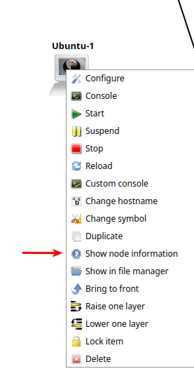
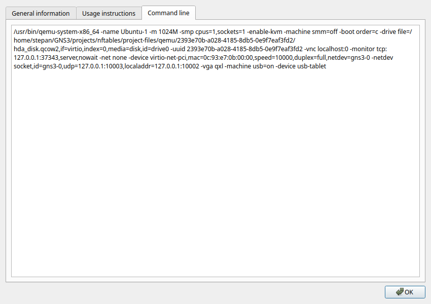

## базовая настройка машин

### запуск за пределами gns3

зайти в меню **"show node information"** выбранной машины, **машина должна быть отключена**.



далее выбрать вкладку **"command line"** и скопировать в текстовый редактор
содержимое, например



```
/usr/bin/qemu-system-x86_64 -name Ubuntu-1 -m 1024M -smp cpus=1,sockets=1 -enable-kvm -machine smm=off -boot order=c -drive file=/home/stepan/GNS3/projects/nftables/project-files/qemu/2393e70b-a028-4185-8db5-0e9f7eaf3fd2/hda_disk.qcow2,if=virtio,index=0,media=disk,id=drive0 -uuid 2393e70b-a028-4185-8db5-0e9f7eaf3fd2 -vnc localhost:0 -monitor tcp:127.0.0.1:37343,server,nowait -net none -device virtio-net-pci,mac=0c:93:e7:0b:00:00,speed=10000,duplex=full,netdev=gns3-0 -netdev socket,id=gns3-0,udp=127.0.0.1:10003,localaddr=127.0.0.1:10002 -vga qxl -machine usb=on -device usb-tablet
```

нас интересует сетевая часть - сделаем, так чтобы виртуалная машина использовала host сеть,
а также удалим настройки vnc. Все это делается для запуска машины с целью обновления пакетов,
так как скорость интернета резко падает под gns3. Также можно добавить ядер и памями для ускорения работы.

```bash
/usr/bin/qemu-system-x86_64 -name Ubuntu-1 -m 2048M -smp cpus=2,sockets=1 -enable-kvm -machine smm=off -boot order=c -drive file=/home/stepan/GNS3/projects/nftables/project-files/qemu/2393e70b-a028-4185-8db5-0e9f7eaf3fd2/hda_disk.qcow2,if=virtio,index=0,media=disk,id=drive0 -uuid 2393e70b-a028-4185-8db5-0e9f7eaf3fd2 -device virtio-net-pci,mac=0c:93:e7:0b:00:00,speed=10000,duplex=full,netdev=gns3-0 -netdev user,id=gns3-0
```

авторизуемся и выполняем

```bash
sudo apt update
sudo apt upgrade
```

### смена hostname

```bash
sudo hostname ubuntu1
```
