[источник](https://hackware.ru/?p=6595)

# Практика настройки сетевых маршрутов: выбор подключения, используемое для Интернета; одновременное использование нескольких подключений для разных целей

## Оглавление

- [ Как в Linux выбрать подключение, используемое для Интернета ](#link_1)
- [ Как одновременно использовать несколько подключения для разных целей ](#link_2)
- [ Использование OpenVPN для всех подключений, кроме некоторых IP адресов, сетей или сайтов ](#link_3)
- [ Использование компьютера в качестве сетевого шлюза ](#link_4)
- [ Заключение ](#link_5)

---

Я уже говорил о том, «[Как в Windows выбрать подключение, используемое для Интернета](https://hackware.ru/?p=6127)», теперь рассмотрим этот же вопрос для Linux. Дополнительно я покажу, как можно использовать одновременно оба соединения к Интернету, например, через одно выполнять сканирования, а через другое просто сёрфить по сайтам. А также ещё пару интересных трюков.

## Как в Linux выбрать подключение, используемое для Интернета <a name="link_1"></a>

Компьютер может быть одновременно подключён к нескольким сетям и любую из них использовать для Интернет-доступа. При этом для выхода в глобальную сеть, на самом деле, используется только одна сеть, а другая (или другие) находятся в резерве. Операционная система выбирает то подключение, которое обладает лучшими характеристиками. Если вы хотите использовать другое подключение, не отключаясь от того, которое используется по умолчанию, то именно это я сейчас и покажу.

Если вы посмотрели ссылку, которую я дал чуть выше (выбор подключений в Windows), то вы знаете, что для каждого сетевого интерфейса установлен так называемый **маршрут по умолчанию** (default route) — через этот маршрут передаётся весь трафик, который не соответствует другим правилам маршрутизации. Если ваш компьютер подключён к нескольким сетям, сто система хранит сразу несколько маршрутов по умолчанию, но присваивает им так называемые метрики — условные обозначения (баллы) качества соединения. Чем ниже это значение, тем ВЫШЕ приоритет соединения.

Посмотреть маршруты по умолчанию можно командой:

```
ip route list default
```

Пример в моём случае (я подключён к двум сетям):

```
default via 192.168.0.1 dev wlo1 proto dhcp metric 600
default via 192.168.0.1 dev wlp0s20f0u1 proto dhcp metric 601
```

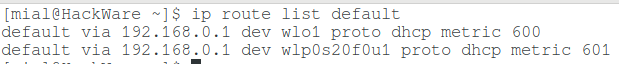

Видно, что у меня два маршрута по умолчанию для сетевого интерфейса wlo1 и wlp0s20f0u1. Причём у первого метрика 600, а у второго метрика 601. Поскольку первое значение меньше, то именно первое соединение имеет приоритет.

Чтобы система начала использовать wlp0s20f0u1, а wlo1 держала в резерве, нам нужно установить метрику для wlp0s20f0u1 на любое значение ниже, чем 600.

В последующих командах заменяйте имена интерфейсов на их имена в вашей системе — они могут отличаться. Также корректируйте IP адреса.

Изменить маршрут (вроде бы) нельзя, поэтому мы удалим интересующий нас маршрут по умолчанию и добавим точно такой же, но с новой метрикой. Обратите внимание на особенность — у обоих моих маршрутов одинаковый IP адрес шлюза (роутера), поэтому чтобы система точно понимала, что мы от неё хотим, будет также указывать название интерфейса.

Удаляем маршрут по умолчанию для интерфейса wlp0s20f0u1:

```
sudo ip route del default dev wlp0s20f0u1
```

Добавляем маршрут по умолчанию для интерфейса wlp0s20f0u1 (также указываем IP роутера):

```
sudo ip route add default via 192.168.0.1 dev wlp0s20f0u1 metric 100
```

Делаем проверку:

```
ip route list default
```

Метрика для wlp0s20f0u1 изменена:

```
default via 192.168.0.1 dev wlp0s20f0u1 metric 100
default via 192.168.0.1 dev wlo1 proto dhcp metric 600
```

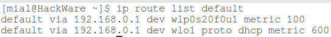

Проверка внешнего IP адреса также показывает, что теперь выход в Интернет выполняется через wlp0s20f0u1. Кстати, индикатор уровня Wi-Fi в NetworkManager стал показывать сигнал именно для сети wlp0s20f0u1.

Сделанные изменения исчезнут при перезагрузке. Либо вы можете вернуть всё как было вновь удалив маршрут для одного из интерфейсов и вновь его добавив с предыдущим значением метрики.

## Как одновременно использовать несколько подключения для разных целей <a name="link_2"></a>

Предыдущий способ подходит для переключения между несколькими соединениями. Но что если мы хотим одновременно использовать оба канала связи? К примеру, через одно подключение я хочу просматривать сайты, а через другое делать сканирование? Или я хочу открывать один сайт через одно подключение, а другой сайт — через другое?

Это можно реализовать указав маршруты. Маршруты — это правила, которые отвечают на вопрос: запрос к данному IP на какой именно интерфейс передать?

Посмотреть доступные маршруты можно следующей командой:

```
ip route
```

Пример в моём случае:

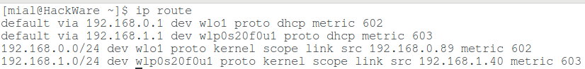

Значение первых двух строк с **default via** мы рассмотрели чуть выше — это маршруты по умолчанию. Рассмотрим другие две:

```
192.168.0.0/24 dev wlo1 proto kernel scope link src 192.168.0.89 metric 602
192.168.1.0/24 dev wlp0s20f0u1 proto kernel scope link src 192.168.1.40 metric 603
```

К примеру строка **192.168.0.0/24 dev wlo1 proto kernel scope link src 192.168.0.89 metric 602** говорит о том, что запросы к IP адресам, принадлежащим сети **192.168.0.0/24** (например, к адресу 192.168.0.20) , будут перенаправляться через интерфейс **wlo1**. Также там имеются дополнительные опции, в том числе метрика.

К примеру, я хочу, чтобы все запросы к IP из сети 172.16.0.0/12 уходили на интерфейс wlp0s20f0u1. В то время как все остальные — уходили по маршруту по умолчанию, которым является wlo1.

wlo1 уже и так маршрут по умолчанию, поэтому с ним ничего не делаем.

Для добавления правила маршрутизации, по которому любые запросы к **172.16.0.0/12** будут отправляться через шлюз с IP **192.168.1.1** с интерфейса **wlp0s20f0u1**:

```
sudo ip route add 172.16.0.0/12 via 192.168.1.1 dev wlp0s20f0u1 metric 5
```

Проверяем:

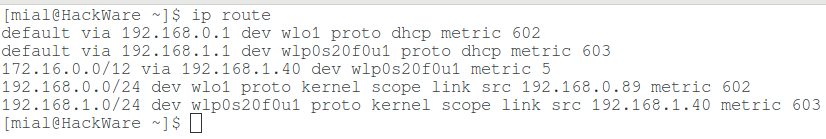

Теперь для проверки на практике, смотрим значения переданных и полученных данных для сетевых интерфейсов:

```
ip -s a
```

У меня:

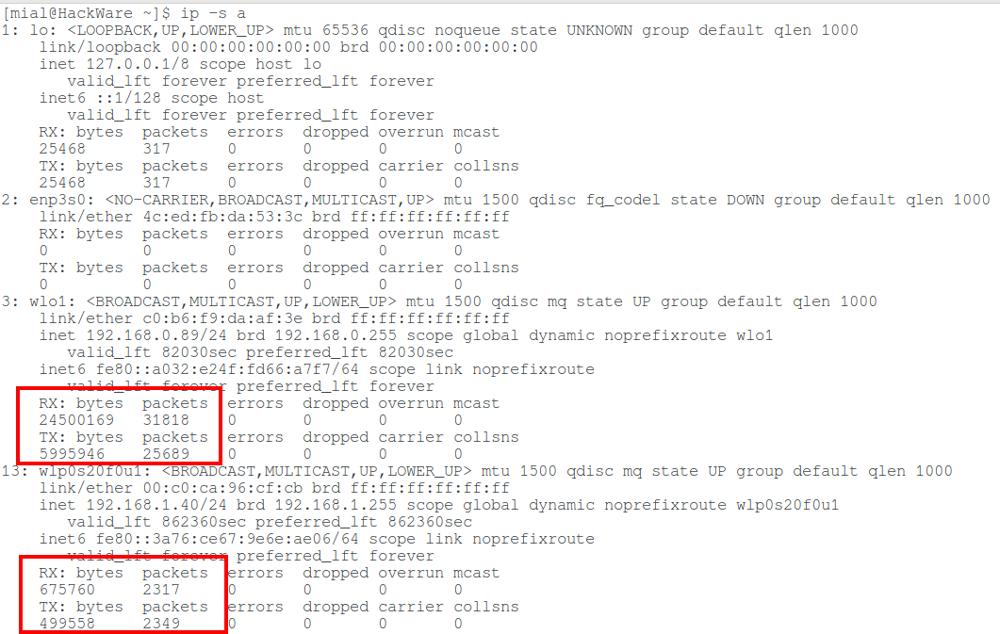

Для wlo1:

```
Получено: байт  пакетов
24500169   31818
Отправлено: байт  пакетов
5995946    25689
```

Для wlp0s20f0u1:

```
Получено: байт  пакетов
675760     2317
Отправлено: байт  пакетов
499558     2349
```

Открою какой-нибудь сайт, например [HackWare.ru](https://hackware.ru). Снова смотрим статистику:

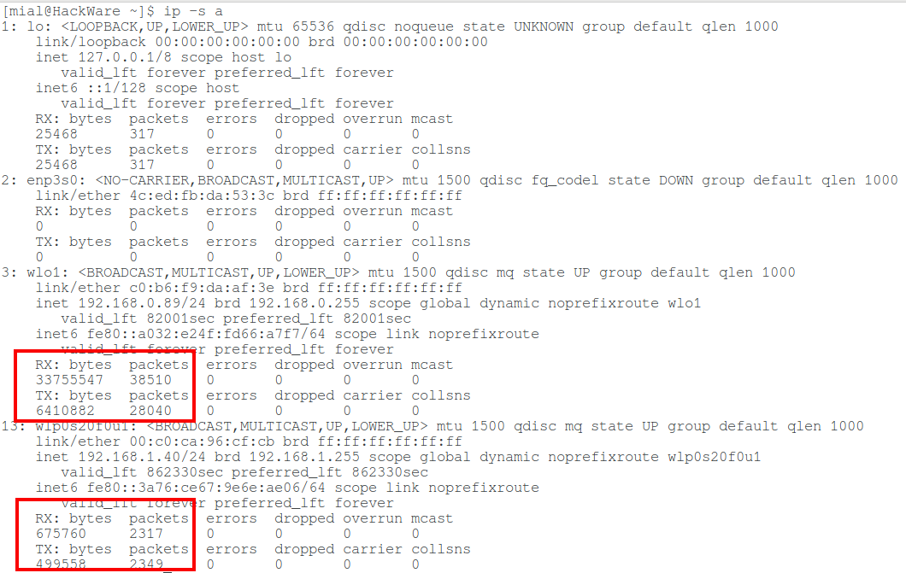

Для wlo1:

```
Получено: байт  пакетов
33755547   38510
Отправлено: байт  пакетов
6410882    28040
```

Для wlp0s20f0u1 значения не поменялись.

Если выполнить запрос IP адреса 172.28.20.13 или любого другого, принадлежащего к сети 172.16.0.0/12, то будет видно, как поменялась количество переданных данных для wlp0s20f0u1:

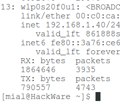

Можно добавлять любое количество маршрутов. Также можно добавлять по одному IP адресу (а не подсетями):

```
sudo ip route add 185.117.153.79 via 192.168.1.1 dev wlp0s20f0u1 metric 5
```

## Использование OpenVPN для всех подключений, кроме некоторых IP адресов, сетей или сайтов <a name="link_3"></a>

Если вы выходите в Интернет через [OpenVPN](https://hackware.ru/?p=5369), то при создании подключения создаётся новый маршрут по умолчанию, например:

```
default via 10.8.0.5 dev tun0 proto static metric 50
```

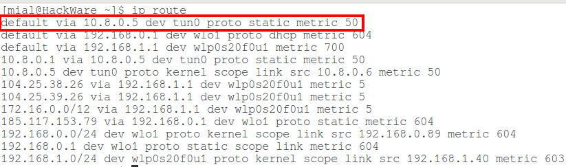

Думаю, вы уже догадались, что если мы хотим подключаться к какому-либо сайту или подсети минуя OpenVPN, то нам достаточно создать новый маршрут с более низкой метрикой. При этом маршрут с интерфейсом tun0 трогать не нужно. В результате получится, что все соединения будут происходить через OpenVPN, но при обращении к сайтам, для чьих IP был задан специальный маршрут, подключение будет выполняться минуя OpenVPN. Кстати, метрика необязательно должна быть ниже - поскольку маршрут по умолчанию применяется только в тех случаях, когда отсутствует специальное правило. То есть если вы создали специальное правило маршрутизации для IP адреса 185.117.153.79 с метрикой 500, то в случае обращения к адресу 185.117.153.79 такое правило будет иметь приоритет перед правилом **default via 10.8.0.5 dev tun0 proto static metric 50**, поскольку оно является специальным, а в маршрут по умолчанию уходят только те пакеты, которые не ушли ранее по любому специальному правилу.

## Использование компьютера в качестве сетевого шлюза <a name="link_4"></a>

Можно настроить другие устройства в сети так, что они будут использовать в качестве шлюза не роутер, а определённый компьютер в локальной сети. Передаваемый на этот компьютер-шлюз трафик можно анализировать, либо, к примеру, передавать во внешний мир через Tor или VPN. Это немного напоминает атаку человек-посередине. Разница в способах достижения результата: при атаке MitM, выполняются манипуляции с ARP кэшем. Здесь же мы просто настраиваем другой компьютер использовать наш компьютер в качестве шлюза.

Покажу на примере двух компьютеров с ОС Linux.

На первом я включаю маршрутизацию пришедшего трафика:

```
sudo sysctl -w net.ipv4.ip_forward=1
```

Предыдущая команда это полный аналог этой команды:

```
echo "1" > /proc/sys/net/ipv4/ip_forward
```

Также на первом компьютере я запускаю [Wireshark](https://kali.tools/?p=1407), чтобы мониторить трафик. В качестве фильтра устанавливаю **icmp**. Протокол [ICMP](https://ru.wikipedia.org/wiki/ICMP) (протокол межсетевых управляющих сообщений) используется для пинга, трассировки, а также именно через этот протокол передаются ошибки, вроде «хост недоступен», «сеть недоступна» и тому подобное.

Больше на первом компьютере ничего не настраиваю, только смотрю его IP адрес в локальной сети — это 192.168.0.51.

На втором компьютере я удаляю существующий маршрут по умолчанию, и устанавливаю новый маршрут через 192.168.0.51:

```
sudo ip route del default
sudo ip route add default via 192.168.0.51 metric 1
```

На втором же компьютере делаю самую обычную трассировку до сайта:

```
traceroute suip.biz
```

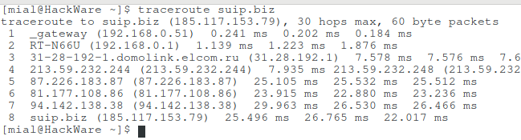

Обратите внимание на первые две строчки:

```
1  _gateway (192.168.0.51)  0.566 ms  0.547 ms  0.538 ms
2  RT-N66U (192.168.0.1)  1.521 ms  1.695 ms  1.802 ms
```

То есть сначала трафик идёт на компьютер с адресом 192.168.0.51 и только затем на IP 192.168.0.1, то есть на роутер.

Перехожу на первый компьютер и вижу, что трафик действительно шёл через него.

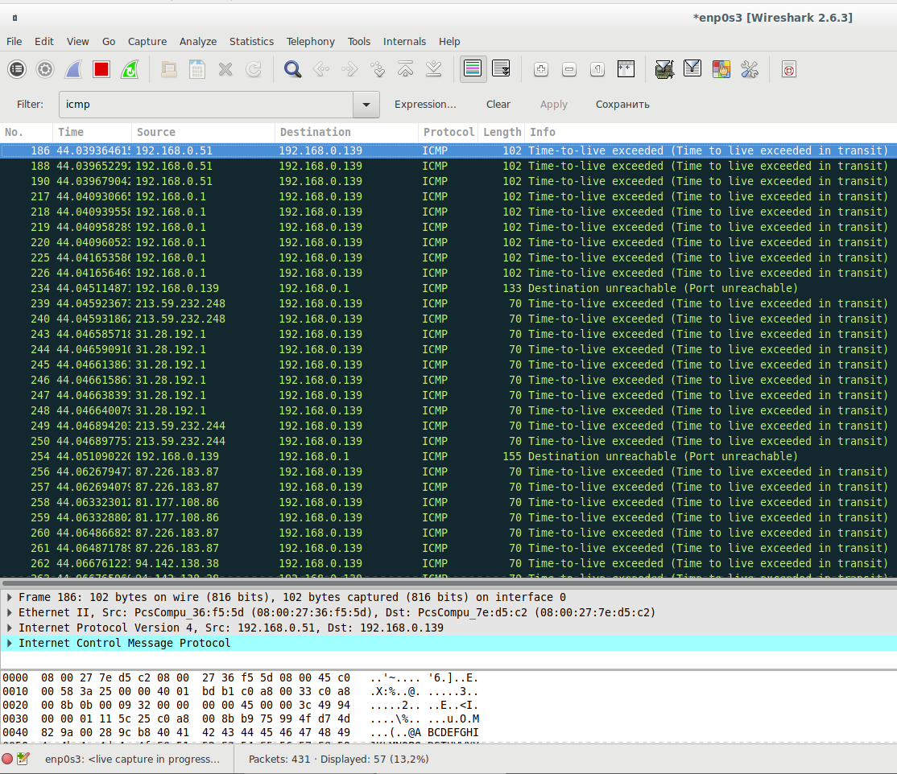

На втором компьютере запускаю пинг:


На первом компьютере в качестве фильтра устанавливаю

```
not icmp.resp_in and icmp.type==8
```

Этот фильтр означает показывать только пинги:

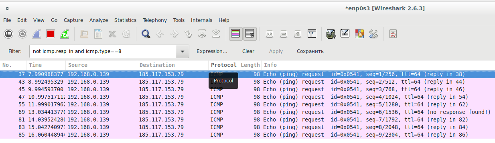

Это работает не только для ICMP протокола, но и для другого трафика. Например, на втором компьютере в веб-браузере открываю сайт, а на первом компьютере использую фильтр

```
http
```

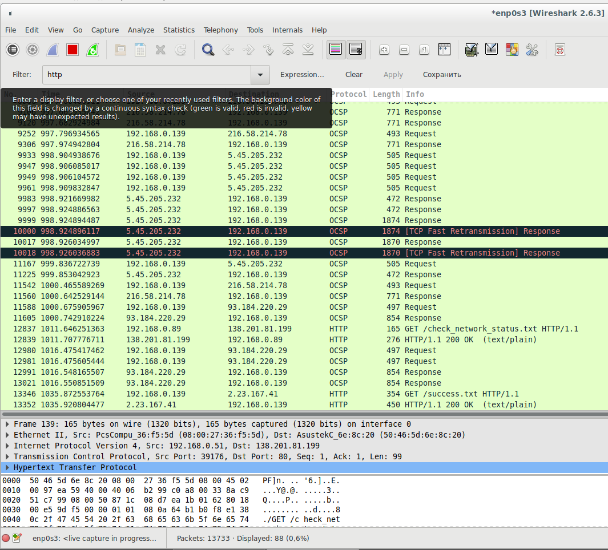

Виден веб трафик, для которого пунктом назначения и исходным адресом является 192.168.0.139, это IP адрес второго компьютера.

## Заключение <a name="link_5"></a>

Понимая, как работают сетевые маршруты, можно очень тонко настроить использование любых сетевых интерфейсов в своей системе.

Эти же принципы создания маршрутов (и даже эти же команды) работают и в роутерах.

При желании можно один из компьютеров превратить в роутер (в том числе воткнув в него провод Интернет-провайдера) и использовать это для анализа трафика, либо очень тонкой настройки правил, которые, может быть, недоступны для вашего роутера.

Для систем Windows также можно [настроить маршруты для отдельных сетей и IP](https://hackware.ru/?p=6127), для этого используется команда **ROUTE**. С помощью неё можно не только установить маршрут по умолчанию, но и для сетей и адресов, для этого вместо **0.0.0.0 MASK 0.0.0.0** достаточно указывать конкретные IP адреса и маску сети.
