[источник](https://zalinux.ru/?p=3705)

- [ Как использовать команду ip в Linux](#link_1)
- [ Как работает команда ip](#link_2)
- [ Объекты, с которыми работает команда ip](#link_3)
- [ Использование ip с адресами](#link_4)
- [ Отображать только адреса IPv4 или IPv6](#link_5)
- [ Отображение информации для одного интерфейса](#link_6)
- [ Как добавить IP адреса](#link_7)
- [ Удаление IP-адреса](#link_8)
- [ Как просмотреть статистику использования трафика сетевыми интерфейсами](#link_9)
- [ Использование ip для управления сетевыми интерфейсами](#link_10)
- [ Включение и отключение link (сетевых устройств)](#link_11)
- [ Использование ip с маршрутами](#link_12)
- [ Как показать информацию только об одном маршруте](#link_13)
- [ Добавление маршрута](#link_14)
- [ Добавление маршрута (присвоение новому интерфейсу IP и настройка маршрутизации)](#link_15)
- [ Показ и настройка маршрутов для IPv6](#link_16)
- [ Все изменения являются временными](#link_17)
- [ Мониторинг событий сетевых интерфейсов](#link_18)
- [ Управление таблицами соседей (ARP и NDP)](#link_19)

## Как использовать команду ip в Linux <a name="link_1"></a>

Вы можете настроить IP-адреса, сетевые интерфейсы и правила маршрутизации на лету с помощью команды Linux **ip**. Мы покажем вам, как вы можете использовать эту современную замену классическому (и теперь устаревшему) **ifconfig**.

## Как работает команда ip <a name="link_2"></a>

С помощью команды **ip** вы можете настроить способ, которым компьютер Linux обрабатывает IP-адреса, контроллеры сетевых интерфейсов (NIC) и правила маршрутизации. В дополнении к этому, изменения вступают в силу немедленно — вам не нужно перезагружаться. Команда **ip** может сделать намного больше, чем это, но в этой статье мы сосредоточимся на наиболее распространённых случаях использования.

Команда **ip** имеет много подкоманд, каждая из которых работает с типом объекта, таким как IP-адреса, маршруты и т.д. В свою очередь, имеется много вариантов для каждого из этих объектов. Именно это богатство функциональности даёт команде **ip** гранулярность, необходимую для выполнения сложных задач.

## Объекты, с которыми работает команда ip <a name="link_3"></a>

Общий синтаксис команды **ip** следующий:

```
 ip [ ОПЦИИ ] ОБЪЕКТ { КОМАНДА }
```

**ОБЪЕКТАМИ** в команде **ip** являются:

- **address**: управление адресом (IP или IPv6 протокола) на устройстве
- **addrlabel**: конфигурация меток для выбора адреса протокола
- **l2tp**: туннель ethernet через IP (L2TPv3)
- **link**: настройка сетевых устройств
- **maddress**: управление многоадресными адресами
- **monitor**: мониторит состояние, следит за сообщениями netlink
- **mroute**: запись кэша многоадресной маршрутизации
- **mrule**: правило в базе данных политики многоадресной маршрутизации
- **neighbour**: управлять записями кэша ARP или NDISC.
- **netns**: управление сетевым пространством имён
- **ntable**: управлять работой кэша neighbor
- **route**: записи в таблице маршрутизации
- **rule**: управление базой данных политики маршрутизации
- **tcp_metrics**/**tcpmetrics**: управление метриками TCP
- **token**: управлять идентификаторами интерфейса токена
- **tunnel**: настройка туннелей через IP
- **tuntap**: управление устройствами TUN/TAP
- **xfrm**: управление политиками IPSec

Мы рассмотрим следующие объекты:

- **address** (адрес): IP-адреса и диапазоны.
- **link**: сетевые интерфейсы, такие как проводные соединения и адаптеры Wi-Fi.
- **route** (маршрут): правила, управляющие маршрутизацией трафика, отправляемого на адреса через интерфейсы (link).
- **monitor**: (мониторинг): наблюдение за происходящим с сетевыми интерфейсами

## Использование ip с адресами <a name="link_4"></a>

Очевидно, что сначала вы должны знать настройки, с которыми вы имеете дело. Чтобы узнать, какие IP-адреса у вашего компьютера, используйте команду **ip** с объектом **address**. Действием по умолчанию является **show**, которое перечислит IP-адреса. Вы также можете опустить **show** и сокращать написание **address** до «**addr**» или даже до «**a**».

Все следующие команды эквивалентны:

```
ip address show
ip addr show
ip addr
ip a
```

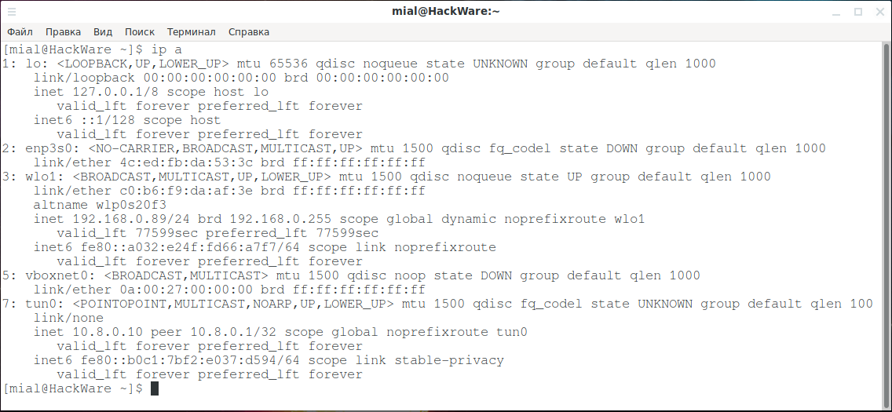

Мы видим два IP-адреса, а также много другой информации. IP-адреса связаны с контроллерами сетевого интерфейса (NIC). Команда **ip** пытается быть полезной и предоставляет много информации об интерфейсе.

Первый IP-адрес — это (внутренний) петлевой адрес, используемый для связи внутри компьютера. Второй фактический (внешний) IP-адрес, который компьютер имеет в локальной сети (LAN).

Кроме петлевого интерфейса **lo**, также имеются следующие:

- **enp3s0** — физический интерфейс проводного сетевого подключения. В некоторых дистрибутивах Linux по умолчанию называется eth0.
- **wlo1** — физический интерфейс беспроводного сетевого подключения. В некоторых дистрибутивах Linux по умолчанию называется wlan0.
- **vboxnet0** — виртуальный интерфейс, созданный программой VirtualBox для организации локальной сети между виртуальными машинами (смотрите [Виртуальные машины в одной сети, изолированные от других сетей](https://hackware.ru/?p=3706#462)).
- **tun0** — программный интерфейс для создания туннеля между двумя компьютерами. В данном случае этот интерфейс создан программой [OpenVPN](https://hackware.ru/?p=5369).

Давайте разберём всю информацию, которую мы получили по первому интерфейсу:

- **lo**: Имя сетевого интерфейса в виде строки.
- **<LOOPBACK,UP,LOWER_UP>**: это петлевой интерфейс. Здесь указано **UP**, что означает, что он работает. [Физический сетевой уровень](https://hackware.ru/?p=6290#tcp/ip_osi) (первый уровень) также работает, об этом говорит **LOWER_UP**.
- **mtu 65536**: максимальная единица передачи. Это размер наибольшего фрагмента данных, который может передавать этот интерфейс.
- **qdisc noqueue: qdisc** — это механизм организации очередей. Планирует передачу пакетов. Существуют различные методы очередей, называемые дисциплинами. Дисциплина **noqueue** означает «отправляй мгновенно, не ставь в очередь». Это стандартная дисциплина **qdisc** для виртуальных устройств, например адресов **LOOPBACK**.
- **state UNKNOWN**: могут быть такие состояния как **DOWN** (сетевой интерфейс не работает), **UNKNOWN** (сетевой интерфейс работает, но ничего не подключено) или **UP** (сеть работает и соединение установлено).
- **group default**: интерфейсы могут быть сгруппированы логически. По умолчанию они помещаются в группу под названием «**default**».
- **qlen 1000**: максимальная длина очереди передачи.
- **link/loopback**: адрес управления доступом к среде (MAC) интерфейса.
- **inet 127.0.0.1/8**: IP-адрес версии 4. Часть адреса после косой черты (**/**) представляет собой нотацию бесклассовой междоменной маршрутизации (CIDR), представляющую маску подсети. Она указывает, сколько ведущих непрерывных битов имеют значение единица в маске подсети. Значение восемь означает восемь битов. Восемь битов, равных единице, представляют 255 в двоичном виде, поэтому маска подсети равна 255.0.0.0. Более подробно об IP адресе и подсетях смотрите в статье «[IP адрес](https://hackware.ru/?p=11589)».
- **scope host**: область IP-адреса. Этот IP-адрес действителен только внутри компьютера («хост»).
- **lo**: интерфейс, с которым связан этот IP-адрес.
- **valid_lft**: допустимое время жизни. Для IP-адреса версии 4 IP, назначенного протоколом динамической конфигурации хоста (DHCP), это период времени, в течение которого IP-адрес считается действительным и может создавать и принимать запросы на подключение.
- **preferred_lft**: предпочтительное время жизни. Для IP-адреса версии 4, выделенного протоколом DHCP, это количество времени, в течение которого IP-адрес может использоваться без ограничений. Оно никогда не должно быть больше значения **valid_lft**.
- **inet6**: [IP-адрес версии 6](https://hackware.ru/?p=10338), **оvalid_lft** и **preferred_lft**.

Физические интерфейсы, как мы покажем ниже, более интересны. Рассмотрим два физических интерфейса: один из них не задействован (провод не подключён), а второй используется (беспроводной Wi-Fi адаптер).

Неиспользуемый сетевой интерфейс:

- **enp3s0**: имя сетевого интерфейса в виде строки. «**en**» обозначает Ethernet, «**p3**» — номер шины карты Ethernet, а «**s0**» — номер слота.
- **<NO-CARRIER,BROADCAST,MULTICAST,UP>**: NO-CARRIER означает, что сетевой разъем не обнаруживает сигнал на линии. Обычно это происходит потому, что сетевой кабель отключён или повреждён. В редких случаях это также может быть аппаратный сбой или ошибка драйвера. В моём случае просто не подключён сетевой кабель UP означает, что устройство работает. BROADCAST — устройство может отправлять трафик всем хостам по link. MULTICAST — устройство может выполнять и принимать многоадресные пакеты.
- **mtu 1500**: максимальная единица передачи, поддерживаемая этим интерфейсом.
- **qdisc fq_codel**: FQ_Codel (управляемая задержка честной очереди) — это дисциплина очередей, которая объединяет честную очередь со схемой CoDel AQM. FQ_Codel использует стохастическую модель для классификации входящих пакетов в разные потоки и используется для обеспечения справедливой доли пропускной способности для всех потоков, использующих очередь. Каждый такой поток управляется дисциплиной очередей CoDel. Переупорядочение внутри потока исключается, поскольку Codel внутренне использует очередь FIFO.
- **state DOWN**: интерфейс не работает и не подключён.
- **group default**: этот интерфейс входит в интерфейсную группу «default».
- **qlen 1000**: максимальная длина очереди передачи.
- **link/ether 4c:ed:fb:da:53:3c brd ff:ff:ff:ff:ff:ff**: MAC-адрес интерфейса.

Используемый сетевой интерфейс:

- **wlo1**: имя сетевого интерфейса в виде строки.
- **<BROADCAST,MULTICAST,UP,LOWER_UPP>**: этот интерфейс поддерживает широкополосную и многоадресную рассылку, и интерфейс в состоянии UP (работает). [Физический (аппаратный) уровень сети](https://hackware.ru/?p=6290#tcp/ip_osi) (уровень один) также в состоянии UP.
- **mtu 1500**: максимальная единица передачи, поддерживаемая этим интерфейсом.
- **qdisc noqueue**: Дисциплина **noqueue** означает «отправляй мгновенно, не ставь в очередь».
- **state UP**: интерфейс работает и подключён.
- **group default**: этот интерфейс входит в интерфейсную группу «default».
- **qlen 1000**: максимальная длина очереди передачи.
- **link/ether**: [MAC-адрес](https://hackware.ru/?p=4917) интерфейса.
- **inet 192.168.0.89/24**: [IP-адрес версии 4](https://hackware.ru/?p=11589). «/24» говорит нам, что в маске подсети установлено 24 смежных старших бита, равных единице. Это три группы по восемь битов. Восьмибитовое двоичное число равно 255; следовательно, маска подсети 255.255.255.0.
- **brd 192.168.0.255**: широковещательный адрес для этой подсети.
- **scope global**: IP-адрес действителен везде в этой сети.
- **dynamic**: IP-адрес теряется при отключении интерфейса.
- **noprefixroute**: не создавать маршрут в таблице маршрутов при добавлении этого IP-адреса. Кто-то должен добавить маршрут вручную, если он хочет использовать его с этим IP-адресом. Аналогично, если этот IP-адрес удалён, не искать маршрут для удаления.
- **wlo1**: интерфейс, с которым связан этот IP-адрес.
- **valid_lft**: допустимое время жизни. Время, когда IP-адрес будет считаться действительным; 77599 секунд — это 21 час 33 минуты.
- **preferred_lft**: предпочтительное время жизни. Это время, которое IP-адрес будет работать без каких-либо ограничений.
- **inet6**: [IP-адрес версии 6](https://hackware.ru/?p=10338), scope link, valid_lft и preferred_lft.

## Отображать только адреса IPv4 или IPv6 <a name="link_5"></a>

Если вы хотите ограничить вывод IP-адресами версии 4, вы можете использовать опцию **-4** следующим образом:

```
 ip -4 a
```

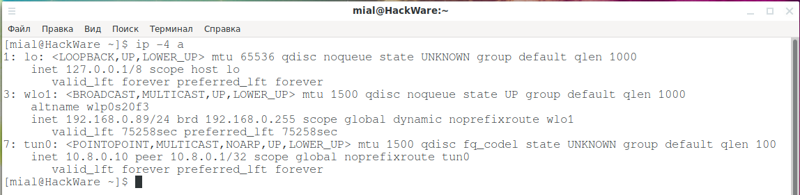

Если вы хотите ограничить вывод IP-адресами версии 6, вы можете использовать опцию **-6** следующим образом:

```
 ip -6 a
```

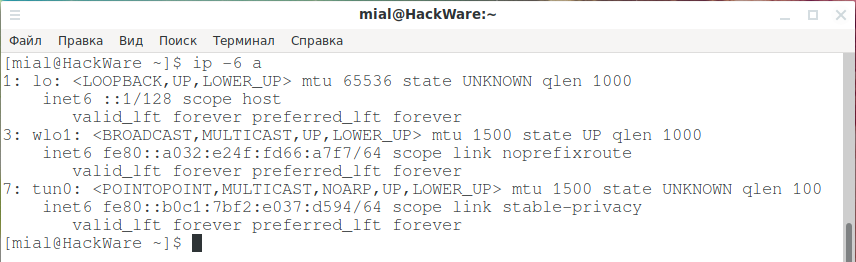

## Отображение информации для одного интерфейса <a name="link_6"></a>

Если вы хотите просмотреть информацию об IP-адресе для одного интерфейса, вы можете использовать параметры **show** и **dev** и название интерфейса, как показано ниже:

```
ip a show dev lo
ip a show dev wlo1
```

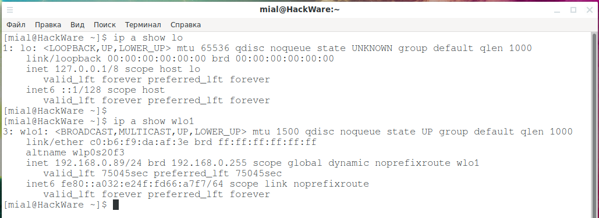

Можно пропустить строку **dev**:

```
ip a show lo
ip a show wlo1
```

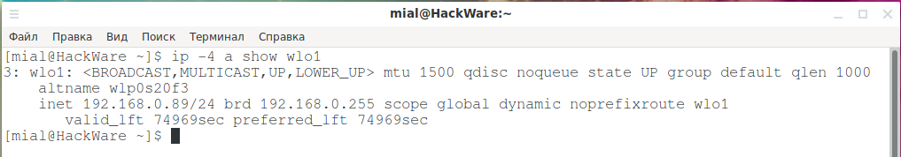

Вы также можете использовать флаг **-4** или **-6** для дальнейшего уточнения вывода, чтобы видеть только то, что вас интересует.

Если вы хотите увидеть информацию IP версии 4, связанную с адресами в интерфейсе wlo1, введите следующую команду:

```
 ip -4 a show wlo1
```

## Как добавить IP адреса <a name="link_7"></a>

Вы можете использовать опции **add** и **dev** для добавления IP-адреса в интерфейс. Вам просто нужно указать команде **ip**, какой IP-адрес и к какому интерфейсу добавить.

Мы собираемся добавить IP-адрес 192.168.0.33 в интерфейс wlo1. Мы также должны предоставить нотацию CIDR для маски подсети. Мы вводим следующее:

```
 sudo ip a add 192.168.0.33/24 dev wlo1
```

Мы вводим следующее, чтобы ещё раз взглянуть на IP-адреса IP версии 4 на этом интерфейсе:

```
 ip -4 a show wlo1
```

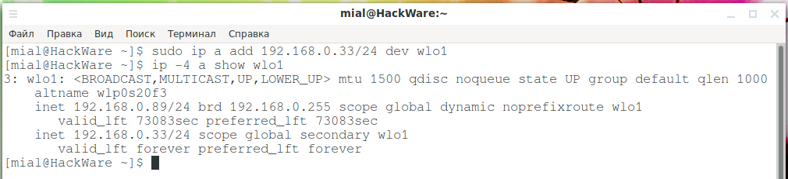

Новый IP-адрес присутствует в этом сетевом интерфейсе. Мы переходим на другой компьютер и используем следующую команду, чтобы проверить, можем ли мы пропинговать новый IP-адрес:

```
 ping 192.168.0.33
```

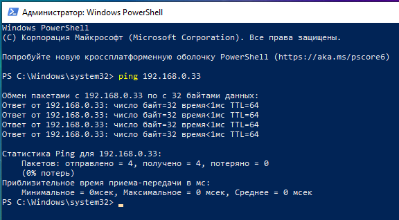

IP-адрес отвечает и отправляет подтверждения пингам. Наш новый IP-адрес запущен и работает после одной простой команды **ip**.

## Удаление IP-адреса <a name="link_8"></a>

Для удаления IP-адреса команда почти такая же, как и для добавления, за исключением того, что вы заменяете **add** на **del**, как показано ниже:

```
 sudo ip a del 192.168.0.33/24 dev wlo1
```

Если мы введём следующее для проверки, мы увидим, что новый IP-адрес был удалён:

```
 ip -4 a show wlo1
```

## Как просмотреть статистику использования трафика сетевыми интерфейсами <a name="link_9"></a>

Чтобы увидеть статистику полученных и отправленных данных каждым интерфейсом, используйте опцию **-s**:

```
 ip -s a
```

Причём опцию **-s** можно использовать 2 и более раз, если вы хотите более подробную информацию:

```
 ip -s -s a
```

Если вы хотите, чтобы данные выводились в удобном для восприятия виде, то укажите опцию **-h**:

```
 ip -s -h a
```

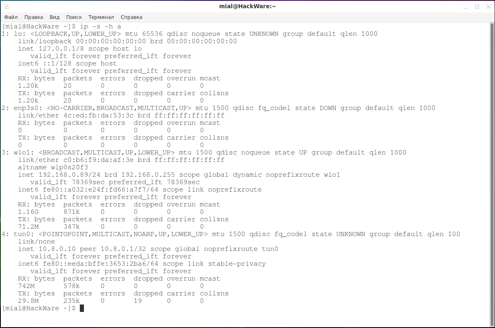

Смотрите также очень интересный пример использования команды **ip** «[Просмотр статистики трафика в реальном времени](https://kali.org.ru/%D0%B4%D1%80%D1%83%D0%B3%D0%B8%D0%B5-it-%D1%82%D0%B5%D0%BC%D1%8B/%D0%BF%D1%80%D0%BE%D1%81%D0%BC%D0%BE%D1%82%D1%80-%D1%81%D1%82%D0%B0%D1%82%D0%B8%D1%81%D1%82%D0%B8%D0%BA%D0%B8-%D1%82%D1%80%D0%B0%D1%84%D0%B8%D0%BA%D0%B0-%D0%B2-%D1%80%D0%B5%D0%B0%D0%BB%D1%8C%D0%BD)».

## Использование ip для управления сетевыми интерфейсами <a name="link_10"></a>

Объект **link** используется для проверки и работы с сетевыми интерфейсами. То есть работа осуществляется не на уровне логического [IP адреса](https://hackware.ru/?p=11589), а на уровне сетевой карты как аппаратного оборудования. На уровне IP протокола мы выполняем различные операции с IP адресом, а на аппаратном уровне мы включаем и отключаем сетевые интерфейсы, меняем MAC адрес, добавляем и удаляем аппаратные сетевые интерфейсы и делаем другую настройку сетевых интерфейсов. Смотрите также «[Как поменять MAC-адрес в Linux, как включить и отключить автоматическую смену (спуфинг) MAC в Linux](https://hackware.ru/?p=4917)».

Введите следующую команду, чтобы увидеть интерфейсы, установленные на вашем компьютере:

```
 ip link show
```

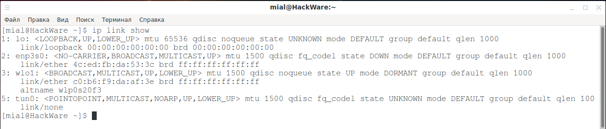

Чтобы увидеть информацию только по одному определённому сетевому интерфейсу, просто добавьте его имя в команду, как показано ниже:

```
 ip link show wlo1
```

## Включение и отключение link (сетевых устройств) <a name="link_11"></a>

Вы можете использовать опцию **set** с опцией **up** или **down** для включения или остановки сетевого интерфейса. Вы также должны использовать sudo как показано ниже:

```
 sudo ip link set wlo1 down
```

Мы вводим следующее, чтобы снова взглянуть на сетевой интерфейс:

```
 ip link show wlo1
```

Состояние сетевого интерфейса **DOWN**. Мы можем использовать опцию **up** для перезапуска сетевого интерфейса, как показано ниже:

```
 sudo ip link set wlo1 up
```

Мы вводим следующее, чтобы выполнить ещё одну быструю проверку состояния сетевого интерфейса:

```
 ip link show wlo1
```

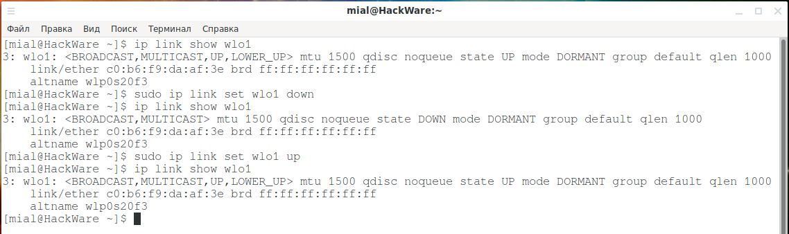

Сетевой интерфейс был перезапущен, и состояние отображается как UP.

## Использование ip с маршрутами <a name="link_12"></a>

С помощью объекта route вы можете проверять маршруты и управлять ими. Правила маршрутизации определяют, на какой сетевой интерфейс отправляется сетевой трафик в зависимости от целевого IP-адреса. Смотрите также

- [Практика настройки сетевых маршрутов: выбор подключения, используемое для Интернета; одновременное использование нескольких подключений для разных целей](https://hackware.ru/?p=6595)
- [Как в Windows выбрать подключение, используемое для Интернета](https://hackware.ru/?p=6127)

Если сетевой пакет предназначен устройству, которое непосредственно подключено к отправителю, то путь пакета очевиден — этот пакет отправляется напрямую получателю. Но во всех других случаях необходимо принять решение, через какой сетевой интерфейс нужно отправить трафик. Самый частый пример, с которым многие из нас сталкиваются каждый день, это роутер: если он получил сетевой пакет, предназначенный для локального IP адреса, то он отправляет его через LAN интерфейс, если же пакет предназначен для Глобальной сети (или просто IP не входит в домашнюю локальную сеть), то такой пакет отправляется через WAN интерфейс. Эти правила и являются правилами маршрутизации. Всего различают две группы правил:

- правила для определённых IP и диапазонов сетей
- правила для всего остального трафика, который не упомянут в предыдущих правилах — все такие сетевые пакеты отправляются по маршруту по умолчанию

Чтобы просмотреть маршруты, установленные на вашем компьютере, введите следующую команду:

```
 ip route
```

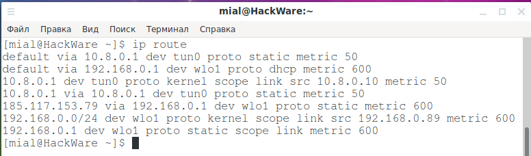

На скриншоте отражены правила маршрутизации для одного сетевого соединения, работающего через OpenVPN.

Начнём с разбора строки:

```
 default via 192.168.0.1 dev wlo1 proto dhcp metric 600
```

Давайте посмотрим на информацию, которую мы получили:

- **default**: правило по умолчанию. Этот маршрут используется, если ни одно из других правил не соответствует отправляемому. Маршрутов по умолчанию может быть несколько (на скриншоте выше их два), но у них должно быть разное значение метрики, для установки приоритета, то есть какой из них должен использоваться в первую очередь.
- **via 192.168.0.1**: маршрутизирует пакеты через устройство на 192.168.0.1. Это IP-адрес маршрутизатора по умолчанию в этой сети.
- **dev wlo1**: использовать этот сетевой интерфейс для отправки пакетов на маршрутизатор.
- **proto dhcp**: идентификатор протокола маршрутизации. DHCP означает, что маршруты будут определены динамически.
- **metric 600**: указание предпочтения маршрута по сравнению с другими. Маршруты с более низкими показателями предпочтительнее, чем с более высокими показателями. Вы можете использовать это, чтобы выбрать для отправки данных интерфейс проводной сети, а не Wi-Fi (или наоборот), либо чтобы выбрать предпочитаемое беспроводное соединение, если у вас больше одной Wi-Fi карты.

Разберём строку

```
 192.168.0.0/24 dev wlo1 proto kernel scope link src 192.168.0.89 metric 600
```

- **192.168.0.0/24**: диапазон IP-адресов, которым управляет это правило маршрутизации. Если компьютер обменивается данными в этом диапазоне IP-адресов, это правило запускает и контролирует маршрутизацию пакетов.
- **dev wlo1**: интерфейс, через который этот маршрут будет отправлять пакеты.
- **proto kernel**: маршрут, созданный ядром во время автоматической настройки
- **scope link**: область действия является ссылкой, что означает, что область действия ограничена непосредственной сетью, к которой подключён этот компьютер.
- **src 192.168.0.89**: IP-адрес, с которого отправляются пакеты, отправленные этим маршрутом.
- **metric 600**: метрика, определяющая (низкий) приоритет этого маршрута.

## Как показать информацию только об одном маршруте <a name="link_13"></a>

Если вы хотите сосредоточиться на деталях определённого маршрута, вы можете добавить в команду опцию list и диапазон IP-адресов маршрута следующим образом:

```
 ip route list 192.168.0.0/24
```

## Добавление маршрута <a name="link_14"></a>

Ранее мы получили следующий список маршрутов:

```
default via 10.8.0.1 dev tun0 proto static metric 50
default via 192.168.0.1 dev wlo1 proto dhcp metric 600
10.8.0.1 dev tun0 proto kernel scope link src 10.8.0.10 metric 50
10.8.0.1 via 10.8.0.1 dev tun0 proto static metric 50
185.117.153.79 via 192.168.0.1 dev wlo1 proto static metric 600
192.168.0.0/24 dev wlo1 proto kernel scope link src 192.168.0.89 metric 600
192.168.0.1 dev wlo1 proto static scope link metric 600
```

В нём:

- **wlo1** — физический беспроводной интерфейс
- **tun0** — интерфейс созданный программно, для организации тоннеля OpenVPN
- **185.117.153.79** — адрес OpenVPN сервера, как можно увидеть, для него создано специальное правило, перенаправляющее трафик на этот IP адрес напрямую через физическое устройство wlo1, а не через tun0 (иначе не было бы подключения к серверу OpenVPN и ничего бы не работало)
- **192.168.0.0/24** — это локальная сеть
- **10.8.0.10** — это IP адрес интерфейса tun0, то есть IP в виртуальной частной сети OpenVPN, а **10.8.0.1** это IP адрес другой точки туннеля, по сути сервера OpenVPN в виртуальной частной сети (его внешний IP 185.117.153.79)

Предположим, я хочу подключаться к определённому IP или диапазонам IP адресов напрямую. Я хочу подключаться к 157.245.118.66 минуя OpenVPN, тогда мне достаточно установить явный маршрут для данного IP:

```
 sudo ip route add 157.245.118.66 via 192.168.0.1 dev wlo1 metric 100
```

В этой команде:

- **157.245.118.66** — IP, для которого создаётся маршрут
- **192.168.0.1** — IP адрес, куда должен отправиться пакет для этого маршрута
- **wlo1** — физический интерфейс, который подключён к устройству, имеющему IP адрес 192.168.0.1

## Добавление маршрута (присвоение новому интерфейсу IP и настройка маршрутизации) <a name="link_15"></a>

Предположим, что мы только что добавили новую сетевую карту на этот компьютер. Мы набираем следующее и видим, что он отображается как enp0s8:

```
 ip link show
```

Мы добавим новый маршрут к компьютеру, чтобы использовать этот новый интерфейс. Сначала мы вводим следующее, чтобы связать IP-адрес с интерфейсом:

```
 sudo ip addr add 192.168.121.1/24 dev enp0s8
```

Маршрут по умолчанию с использованием существующего IP-адреса добавляется в новый интерфейс. Мы используем опцию delete и указываем его свойства, как показано ниже, чтобы удалить маршрут по умолчанию:

```
 sudo ip route delete default via 192.168.4.1 dev enp0s8
```

Теперь мы будем использовать опцию add, чтобы добавить наш новый маршрут. Новый интерфейс будет обрабатывать сетевой трафик в диапазоне IP-адресов 192.168.121.0/24. Мы дадим ему метрику 100; потому что это будет единственный маршрут, обрабатывающий этот трафик, метрика в значительной степени академическая.

Мы вводим следующее:

```
 sudo ip route add 192.168.121.0/24 dev enp0s8 metric 100
```

Теперь мы набираем следующее, чтобы увидеть, что мы получили в конечном счёте:

```
 ip route
```

Наш новый маршрут уже на месте. Однако у нас все ещё есть маршрут 192.168.4.0/24, который указывает на интерфейс enp0s8 — мы набираем следующее, чтобы удалить его:

```
 sudo ip route delete 192.168.4.0/24 dev enp0s8
```

Теперь у нас должен быть новый маршрут, который направляет весь трафик, предназначенный для диапазона IP 192.168.121.0/24, через интерфейс enp0s8. Это также должен быть единственный маршрут, который использует наш новый интерфейс.

Мы вводим следующее для подтверждения:

```
 ip route
```

## Показ и настройка маршрутов для IPv6 <a name="link_16"></a>

Вы можете использовать параметры **-4** и **-6** для просмотра только маршрутов IPv4 или IPv6. По умолчанию отображаются только маршруты IPv4. Для просмотра маршрутов IPv6 используйте:

```
 ip -6 route
```

Для управления маршрутов IPv6 используйте показанные выше команды с опцией **-6**.

## Все изменения являются временными <a name="link_17"></a>

Самое замечательное в этих командах — они не постоянны. Если вы хотите очистить их, просто перезагрузите систему. Это означает, что вы можете экспериментировать с ними, пока они не будут работать так, как вы хотите. И это очень хорошо, если вы наделаете ужасный беспорядок в вашей системе — простая перезагрузка восстановит порядок и вернёт всё как было.

С другой стороны, если вы хотите, чтобы изменения были постоянными, вам нужно выполнить дополнительные действия. Что именно нужно сделать зависит от семейства дистрибутива, а также от того, используете ли вы графическое окружение рабочего стола. В безголовых серверах необходимо выполнить настройку конфигурационных файлов, в системах с графическим интерфейсом часть настройки может выполняться автоматически программами вроде NetworkManager, либо также может быть выполнена с помощью конфигурационных файлов.

Таким образом, вы можете протестировать команды перед тем, как сделать что-либо постоянным.

## Мониторинг событий сетевых интерфейсов <a name="link_18"></a>

Всё, что происходит с сетевыми интерфейсами в режиме реального времени можно наблюдать с помощью команды:

```
 ip monitor
```

Эта команда покажет удаление и добавление маршрутов, изменение IP адресов, включение и отключение сетевых устройств и другие события.

Чтобы мониторить события, связанные с IPv6:

```
 ip -6 monitor
```

## Управление таблицами соседей (ARP и NDP) <a name="link_19"></a>

Эта команда поддерживает варианты написания как американского (**ip neighbour**), так и британского (**ip neighbour**) правописания.

Для просмотра таблиц соседей:

```
 ip neighbor show
```

Все команды «**show**» поддерживают параметры **-4** и **-6** для просмотра только соседей IPv4 (ARP) или IPv6 (NDP). По умолчанию отображаются все соседи.
