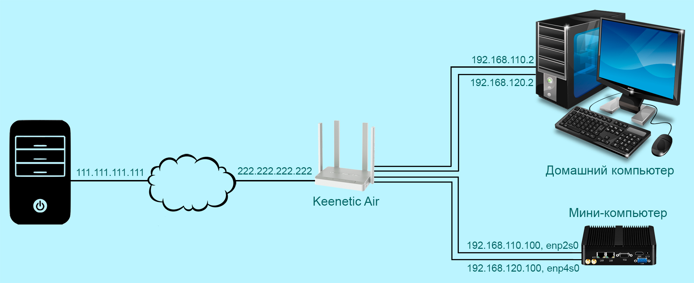
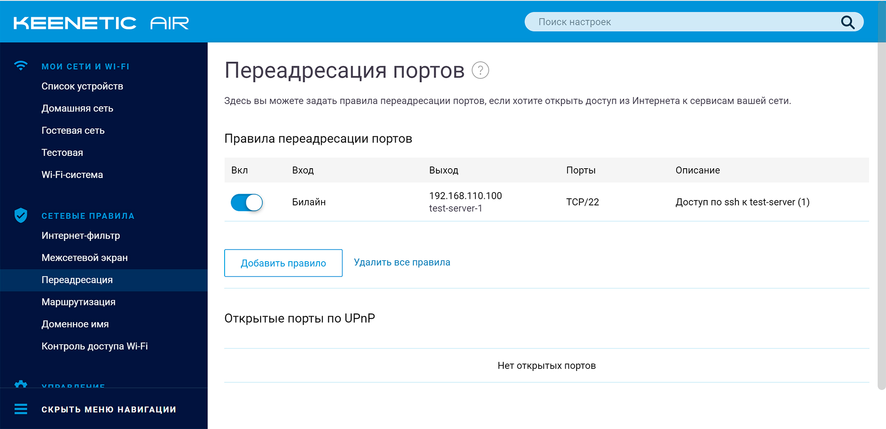
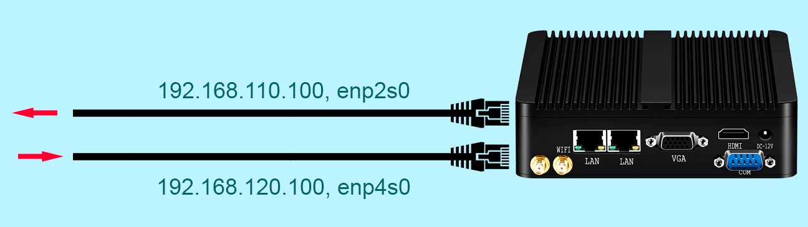

[источник](https://tokmakov.msk.ru/blog/item/497)

- [ Подключаемся через интерфейс enp2s0](#link_1)
- [ Подключаемся через интерфейс enp4s0](#link_2)
- [ Создаем правила и таблицы маршрутизации](#link_3)
- [ Подключаемся через интерфейс enp4s0](#link_4)
- [ Правила и маршруты при загрузке](#link_5)

# Маршрутизация на основе политик. Часть вторая

Теперь попробуем применить полученные знания на практике. У меня есть мини-компьютер, купленный на AliExpress, с двумя сетевыми интерфейсами `enp2s0` и `enp4s0`. Оба интерфейса подключены к роутеру Keenetic Air, но к разным сегментам домашней сети, и имеют ip-адреса `192.168.110.100` и `192.168.120.100`. На роутере настроен проброс порта `22` внутрь подсети `192.168.110.0/24`, на ip-адрес `192.168.110.100`.



На мини-компьютере установлена ОС Ubuntu Server и OpenSSH сервер. Настройка сети выполнена с использованием Netplan:

```
$ cat /etc/netplan/01-netcfg.yaml
```

```
network:
  version: 2
  renderer: networkd
  ethernets:
    enp2s0:
      addresses: [192.168.110.100/24]
      gateway4: 192.168.110.1
      nameservers:
        addresses: [8.8.8.8, 8.8.4.4]
    enp4s0:
      addresses: [192.168.120.100/24]
      routes:
        - to: 0.0.0.0/0
          via: 192.168.120.1
          metric: 100
      nameservers:
        addresses: [8.8.8.8, 8.8.4.4]
```

Тут все просто — есть основной канал через интерфейс `enp2s0` и есть резервный канал через интерфейс `enp4s0` (на самом деле, интернет-провайдер всего один). Посмотрим, какие маршруты есть у мини-компьютера:

```
$ ip route show
default via 192.168.110.1 dev enp2s0 proto static
default via 192.168.120.1 dev enp4s0 proto static metric 100
192.168.110.0/24 dev enp2s0 proto kernel scope link src 192.168.110.100
192.168.120.0/24 dev enp4s0 proto kernel scope link src 192.168.120.100
```

Наша задача — подключиться по ssh к мини-компьютеру с сервера `111.111.111.111`. Сначала через интерфейс `enp2s0`, потом — через интерфейс `enp4s0`.

## Подключаемся через интерфейс enp2s0 <a name="link_1"></a>

Точнее говоря, соединяться будем с роутером Keenetic Air, но он пробросит соединение на компьютер с ip-адресом `192.168.110.100`:



```
$ ssh evgeniy@222.222.222.222
evgeniy@222.222.222.222's password: пароль
Welcome to Ubuntu 18.04.4 LTS (GNU/Linux 4.15.0-99-generic x86_64)
```

Соединение прошло успешно. Подключимся еще раз и в момент подключения посмотрим входящие и исходящие пакеты:

```
# tcpdump -i enp2s0 -nq -c6 host 111.111.111.111
tcpdump: verbose output suppressed, use -v or -vv for full protocol decode
listening on enp2s0, link-type EN10MB (Ethernet), capture size 262144 bytes
14:26:50.423190 IP 111.111.111.111.52792 > 192.168.110.100.22: tcp 0
14:26:50.423261 IP 192.168.110.100.22 > 111.111.111.111.52792: tcp 0
14:26:50.468323 IP 111.111.111.111.52792 > 192.168.110.100.22: tcp 0
14:26:50.468807 IP 111.111.111.111.52792 > 192.168.110.100.22: tcp 41
14:26:50.468829 IP 192.168.110.100.22 > 111.111.111.111.52792: tcp 0
14:26:50.481863 IP 192.168.110.100.22 > 111.111.111.111.52792: tcp 41
6 packets captured
6 packets received by filter
0 packets dropped by kernel
```

## Подключаемся через интерфейс enp4s0 <a name="link_2"></a>

Теперь на роутере изменим правило проброса порта — будем пробрасывать 22 порт внутрь подсети `192.168.120.0/24`, на ip-адрес `192.168.120.100`:


Еще раз подключаемся с сервера `111.111.111.111` к мини-компьютеру. И здесь нас ждет неудача — мини-компьютер отвечает через тот интерфейс и с того ip-адреса, которые прописаны в маршруте по умолчанию. Т.е. входящее ssh-соединение идет через интерфейс `enp4s0`, на ip-адрес `192.168.120.100`, а отвечает мини-компьютер через интерфейс `enp2s0`, с ip-адреса `192.168.110.100`.



Попробуем подключиться еще раз и в момент подключения посмотрим входящие и исходящие пакеты:

```
# tcpdump -i enp4s0 -nq -c3 host 111.111.111.111
tcpdump: verbose output suppressed, use -v or -vv for full protocol decode
listening on enp4s0, link-type EN10MB (Ethernet), capture size 262144 bytes
14:36:28.039846 IP 111.111.111.111.52738 > 192.168.120.100.22: tcp 0
14:36:29.045742 IP 111.111.111.111.52738 > 192.168.120.100.22: tcp 0
14:36:31.061345 IP 111.111.111.111.52738 > 192.168.120.100.22: tcp 0
3 packets captured
3 packets received by filter
0 packets dropped by kernel
```

Входящие пакеты есть, а вот исходящих — нет. Нам надо сделать так, чтобы мини-комп отвечал на том же интерфейсе, на котором было входящее соединение. С интерфейсом `enp2s0` проблем нет, но надо что-то придумать для интерфейса `enp4s0`.

## Создаем правила и таблицы маршрутизации <a name="link_3"></a>

По умолчанию всегда присутствуют три стандартные таблицы маршрутизации — `local`, `main` и `default`. Добавим две новые таблицы — `enp2s0` и `enp4s0`:

```
# nano /etc/iproute2/rt_tables
```

```
# предопределенные таблицы
255     local
254     main
253     default
0       unspec
# добавляем новые таблицы
[grn]101     enp2s0[/grn]
[grn]102     enp4s0[/grn]
```

Теперь добавляем два новых правила — какие таблицы просматривать при отправке пакета:

```
# ip rule add from 192.168.110.100 lookup enp2s0
# ip rule add from 192.168.120.100 lookup enp4s0
```

При добавлении правил без указания приоритета (`pref` или `priority`), новые правила будут получать номер с 32765 до 1. Подробное описание синтаксиса команды `ip` можно найти [здесь](https://baturin.org/docs/iproute2/).

```
# ip rule add from 192.168.110.100 lookup enp2s0 pref 32765
# ip rule add from 192.168.120.100 lookup enp4s0 pref 32764

# ip rule add from 192.168.110.100 lookup enp2s0 priority 32765
# ip rule add from 192.168.120.100 lookup enp4s0 priority 32764
```

И добавляем маршрут по умолчанию для каждой новой таблицы, т.е. для `enp2s0` и для `enp4s0`:

```
# ip route add default via 192.168.110.1 dev enp2s0 table enp2s0
# ip route add default via 192.168.120.1 dev enp4s0 table enp4s0
```

Смотрим, что получилось в итоге:

```
# ip rule show
0:      from all lookup local
32764:  from 192.168.120.100 lookup enp4s0
32765:  from 192.168.110.100 lookup enp2s0
32766:  from all lookup main
32767:  from all lookup default
```

При отправке пакета, сперва будут просмотрены маршруты из таблицы `local`, потом маршруты из таблиц `enp4s0` и `enp2s0` (если совпадет ip-адрес отправителя), а затем — маршруты из таблиц `main` и `default`.

```
# ip route show table enp2s0
default via 192.168.110.1 dev enp2s0
# ip route show table enp4s0
default via 192.168.120.1 dev enp4s0
```

На самом деле, нам достаточно одной таблицы `enp4s0`, потому как маршртут по умолчанию из таблицы `enp2s0` совпадает с маршрутом по умолчанию из таблицы `main`.

## Подключаемся через интерфейс enp4s0 <a name="link_4"></a>

Снова пробуем с сервера `111.111.111.111` подключиться по ssh к мини-компьютеру:

```
$ ssh evgeniy@222.222.222.222
evgeniy@222.222.222.222's password: пароль
Welcome to Ubuntu 18.04.4 LTS (GNU/Linux 4.15.0-99-generic x86_64)
```

Теперь соединение прошло успешно. Подключимся еще раз и в момент подключения посмотрим входящие и исходящие пакеты:

```
# tcpdump -i enp4s0 -nq -c6 host 111.111.111.111
tcpdump: verbose output suppressed, use -v or -vv for full protocol decode
listening on enp4s0, link-type EN10MB (Ethernet), capture size 262144 bytes
14:46:18.705125 IP 111.111.111.111.52806 > 192.168.120.100.22: tcp 0
14:46:18.705167 IP 192.168.120.100.22 > 111.111.111.111.52806: tcp 0
14:46:18.748001 IP 111.111.111.111.52806 > 192.168.120.100.22: tcp 0
14:46:18.748634 IP 111.111.111.111.52806 > 192.168.120.100.22: tcp 41
14:46:18.748703 IP 192.168.120.100.22 > 111.111.111.111.52806: tcp 0
14:46:18.794915 IP 192.168.120.100.22 > 111.111.111.111.52806: tcp 41
6 packets captured
6 packets received by filter
0 packets dropped by kernel
```

Есть как входящие пакеты с ip-адреса `111.111.111.111`, так и исходящие на ip-адрес `111.111.111.111`.

## Правила и маршруты при загрузке <a name="link_5"></a>

При перезагрузке мини-компьютера созданные нами правила и маршруты пропадут. Поэтому их надо прописать в конфигурационном файле Netplan:

```
network:
  version: 2
  renderer: networkd
  ethernets:
    enp2s0:
      addresses: [192.168.110.100/24]
      gateway4: 192.168.110.1 # основной маршрут по умолчанию таблицы main
      routes:
        - to: 0.0.0.0/0 # маршрут по умолчанию таблицы enp2s0 (или 101)
          via: 192.168.110.1
          table: 101
      routing-policy: # вместо команды: ip rule add from 192.168.110.100 lookup 101
        - from: 192.168.110.100
          table: 101
          priority: 32765
      nameservers:
        addresses: [8.8.8.8, 8.8.4.4]
    enp4s0:
      addresses: [192.168.120.100/24]
      routes:
        - to: 0.0.0.0/0 # запасной маршрут по умолчанию таблицы main
          via: 192.168.120.1
          metric: 100
        - to: 0.0.0.0/0 # маршрут по умолчанию таблицы enp4s0 (или 102)
          via: 192.168.120.1
          table: 102
      routing-policy: # вместо команды: ip rule add from 192.168.120.100 lookup 102
        - from: 192.168.120.100
          table: 102
          priority: 32764
      nameservers:
        addresses: [8.8.8.8, 8.8.4.4]
```

Если Netplan не используется, можно создать конфигурационные файлы `systemd-networkd`:

```
# nano /etc/systemd/network/20-enp2s0.network
```

```
[Match]
Name=enp2s0
[Network]
Address=192.168.110.100/24
Gateway=192.168.110.1
DNS=8.8.8.8
DNS=8.8.4.4
[Route]
Destination=0.0.0.0/0
Gateway=192.168.110.1
Table=101
[RoutingPolicyRule]
From=192.168.110.100
Table=101
Priority=32765
```

```
# nano /etc/systemd/network/40-enp4s0.network
```

```
[Match]
Name=enp4s0
[Network]
Address=192.168.120.100/24
DNS=8.8.8.8
DNS=8.8.4.4
[Route]
Destination=0.0.0.0/0
Gateway=192.168.120.1
Metric=100
[Route]
Destination=0.0.0.0/0
Gateway=192.168.120.1
Table=102
[RoutingPolicyRule]
From=192.168.120.100
Table=102
Priority=32764
```
