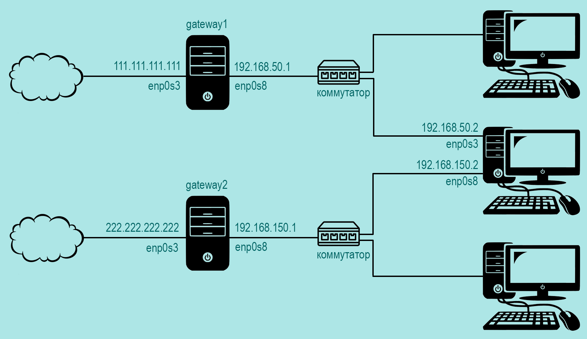

[источник](https://tokmakov.msk.ru/blog/item/502)

- [ Настройка сети](#link_1)
- [ Таблицы маршрутизации](#link_2)
- [ Доступ из интернета](#link_3)
- [ Переключение каналов](#link_4)

# Маршрутизация на основе политик. Часть третья

Допустим, у нас есть компьютер с двумя сетевыми интерфейсами, которые подключены к сетям двух интернет-провайдеров. И нам нужно переключаться на резервный канал в случае сбоя основного. И переключаться обратно на основной канал после восстановления связи. Для этого напишем скрипт, который будет проверять доступность основого канала с помощью команды `ping` и при необходимости изменять маршрут по умолчанию.



## Настройка сети <a name="link_1"></a>

На компьютере установлена ОС Ubuntu Desktop, настройка сети выполнена с использованием Netplan:

```
# nano /etc/netplan/01-network-manager-all.yaml
```

```
network:
  version: 2
  renderer: networkd
  ethernets:
    enp0s3:
      addresses: [192.168.50.2/24]
      routes:
        - to: 0.0.0.0/0 # основной маршрут по умолчанию для таблицы main
          from: 192.168.50.2
          via: 192.168.50.1
          metric: 100
        - to: 0.0.0.0/0 # маршрут по умолчанию для таблицы primary (или 100)
          via: 192.168.50.1
          table: 100
      routing-policy:
        - from: 192.168.50.2
          table: 100
          priority: 31000
      nameservers:
        addresses: [8.8.8.8, 8.8.4.4]
    enp0s8:
      addresses: [192.168.150.2/24]
      routes:
        - to: 0.0.0.0/0 # резервный маршрут по умолчанию для таблицы main
          from: 192.168.150.2
          via: 192.168.150.1
          metric: 200
        - to: 0.0.0.0/0 # маршрут по умолчанию для таблицы secondary (или 200)
          via: 192.168.150.1
          table: 200
      routing-policy:
        - from: 192.168.150.2
          table: 200
          priority: 32000
      nameservers:
        addresses: [8.8.8.8, 8.8.4.4]
```

Служба `NetworkManager` отключена, вместо нее за сеть отвечает служба `systemd-networkd`:

```
# systemctl stop NetworkManager.service
# systemctl disable NetworkManager.service
# systemctl start systemd-networkd.service
# systemctl enable systemd-networkd.service
```

После загрузки системы смотрим маршруты таблицы `main`:

```
$ ip route show
default via 192.168.50.1 dev enp0s3 proto static src 192.168.50.2 metric 100
default via 192.168.150.1 dev enp0s8 proto static src 192.168.150.2 metric 200
192.168.50.0/24 dev enp0s3 proto kernel scope link src 192.168.50.2
192.168.150.0/24 dev enp0s8 proto kernel scope link src 192.168.150.2
```

Здесь два маршрута по умолчанию, но с разными значениями метрики — один маршрут основной (метрика 100), другой запасной (метрика 200).

## Таблицы маршрутизации <a name="link_2"></a>

И есть два правила, которые предписывают просматривать таблицы `primary` и `secondary`, если пакеты отправляются с ip-адресов `192.168.50.2` и `192.168.150.2` соответственно.

```
$ ip rule show
0:      from all lookup local
31000:  from 192.168.50.2 lookup primary
32000:  from 192.168.150.2 lookup secondary
32766:  from all lookup main
32767:  from all lookup default
```

Таблицы маршрутизации `primary` и `secondary` определены в файле `/etc/iproute2/rt_tables`:

```
# nano /etc/iproute2/rt_tables
```

```
# предопределенные таблицы
255     local
254     main
253     default
0       unspec
# добавляем новые таблицы
[grn]100     primary[/grn]
[grn]200     secondary[/grn]
```

Каждая из таблиц маршрутизации содержит маршрут по умолчанию:

```
$ ip route show table primary
default via 192.168.50.1 dev enp0s3 proto static

$ ip route show table secondary
default via 192.168.150.1 dev enp0s8 proto static
```

## Доступ из интернета <a name="link_3"></a>

Допустим, у нас на компьютере установлен ssh-сервер и нам нужна возможность подключения извне. Разумеется, здесь не обойтись без помощи интернет-провайдеров, потому что наш компьютер не имеет белого ip-адреса. На маршрутизаторах `gateway1` и `gateway2` нужно настроить проброс портов. _Настройки, которые мы выполнили на компьютере, обеспечивают маршрутизацию ответов через интерфейс, на котором был получен запрос. Так что тут не будет такой ситуации, что входящее соединение на одном интерфейсе, а исходящее — на другом._

Проброс порта на маршрутизаторе `gateway1`:

```
# iptables -t nat -A PREROUTING -i enp0s3 -p tcp --dport 22 -j DNAT --to-destination 192.168.50.2
```

Проброс порта на маршрутизаторе `gateway2`:

```
# iptables -t nat -A PREROUTING -i enp0s3 -p tcp --dport 22 -j DNAT --to-destination 192.168.150.2
```

Проверяем подключение по ssh через маршрутизатор `gateway1`:

```
$ ssh evgeniy@111.111.111.111
The authenticity of host '111.111.111.111 (111.111.111.111)' can't be established.
ECDSA key fingerprint is SHA256:SNK5y+y11LWgJFlW8nKYVqhy3oDpgQtOXRcRaymhWAs.
Are you sure you want to continue connecting (yes/no)? yes
Warning: Permanently added '111.111.111.111' (ECDSA) to the list of known hosts.
evgeniy@111.111.111.111's password: пароль
Welcome to Ubuntu 18.04.4 LTS (GNU/Linux 5.3.0-51-generic x86_64)
```

Проверяем подключение по ssh через маршрутизатор `gateway2`:

```
$ ssh evgeniy@222.222.222.222
The authenticity of host '222.222.222.222 (222.222.222.222)' can't be established.
ECDSA key fingerprint is SHA256:SNK5y+y11LWgJFlW8nKYVqhy3oDpgQtOXRcRaymhWAs.
Are you sure you want to continue connecting (yes/no)? yes
Warning: Permanently added '222.222.222.222' (ECDSA) to the list of known hosts.
evgeniy@222.222.222.222's password: пароль
Welcome to Ubuntu 18.04.4 LTS (GNU/Linux 5.3.0-51-generic x86_64)
```

## Переключение каналов <a name="link_4"></a>

Теперь напишем скрипт, который будет переключать каналы доступа в интернет:

```
# mkdir /root/swicth-channel/

# nano /root/swicth-channel/swicth-channel.sh
```

```bash
#!/bin/sh

# Доступность этого хоста означает доступность основного канала
PING_HOST='8.8.8.8'
# Файл-флаг создается в момент переключении на резервный канал
LOCK_FILE='/root/switch-channel/switch-channel.lock'
# Будем записывать в журнал события переключения на другой канал
LOG_FILE='/root/switch-channel/switch-channel.log'

# Сетевой интерфейс, который смотрит в сеть первого интернет провайдера
IFACE_ONE='enp0s3'
# Сетевой интерфейс, который смотрит в сеть второго интернет провайдера
IFACE_TWO='enp0s8'
# IP-адрес первого сетевого интерфейса (первый интернет провайдер)
IP_IF_ONE='192.168.50.2'
# IP-адрес второго сетевого интерфейса (второй интернет провайдер)
IP_IF_TWO='192.168.150.2'
# IP-адрес шлюза первого интернет провайдера
IP_GW_ONE='192.168.50.1'
# IP-адрес шлюза второго интернет провайдера
IP_GW_TWO='192.168.150.1'

# Возможна такая ситуация, что компьютер был перезагружен в момент, когда работал
# резервный канал интернет. А за время перезагрузки восстановился основной канал
# интернет. В этом случае файл-флаг продолжит существовать и не позволит скрипту
# в дальнейшем переключаться на резервный канал.
if [ -f ${LOCK_FILE} ]; then
    # Получаем вывод команды ip route show, берем только первую строку, ищем в этой
    # строке подстроку ${IFACE_ONE}. Если такая подстрока найдена, значит работает
    # основной канал интернет — и нужно удалить файл-флаг.
    ip route show | head -1 | grep ${IFACE_ONE}
    if [ $? -eq 0 ]; then
        rm -f ${LOCK_FILE}
    fi
fi

# Пингуем проверочный хост через основной канал
ping -I ${IP_IF_ONE} -c1 -n ${PING_HOST} > /dev/null

# Если проверочный хост не доступен
if [ $? -ne 0 ]; then
    # Если нет файла-флага, значит мы сейчас на основном канале
    if [ ! -f ${LOCK_FILE} ]; then
        # Переключаемся на резервный канал (метрика основного маршрута 300, метрика резервного маршрута 200)
        ip route del default via ${IP_GW_ONE} dev ${IFACE_ONE} src ${IP_IF_ONE} proto static metric 100
        ip route add default via ${IP_GW_ONE} dev ${IFACE_ONE} src ${IP_IF_ONE} proto static metric 300
        # Создаём файл-флаг, что мы на резервном канале
        touch ${LOCK_FILE}
        # Делаем запись в файл журнала
        echo `date +'%Y/%m/%d %H:%M:%S'` Switching to secondary channel >> ${LOG_FILE}
    fi
else # Если проверочный хост доступен
    # Если есть файл-флаг, значит мы сейчас на резервном канале
    if [ -f ${LOCK_FILE} ]; then
        # Переключаемся на основной канал (метрика основного маршрута 100, метрика резервного маршрута 200)
        ip route del default via ${IP_GW_ONE} dev ${IFACE_ONE} src ${IP_IF_ONE} proto static metric 300
        ip route add default via ${IP_GW_ONE} dev ${IFACE_ONE} src ${IP_IF_ONE} proto static metric 100
        # Удаляем файл-флаг, мы опять на основном канале
        rm -f ${LOCK_FILE}
        # Делаем запись в файл журнала
        echo `date +'%Y/%m/%d %H:%M:%S'` Switching to primary channel >> ${LOG_FILE}
    fi
fi

```

```
# chmod +x /root/swicth-channel/swicth-channel.sh
```

И будем запускать этот скрипт каждую минуту:

```
# nano /etc/crontab
```

```
# проверка каналов выхода в интернет и переключение канала при необходимости
* *    * * *   root    /root/switch-channel/switch-channel.sh
```

Чтобы проверить работу скрипта, выключим интерфейс `enp0s8` на маршрутизаторе `gateway1`:

```
# ip link set dev enp0s8 down
```

Подождем минуту и проверим маршруты на нашем компьютере:

```
$ ip route show
default via 192.168.150.1 dev enp0s8 proto static src 192.168.150.2 metric 200
default via 192.168.50.1 dev enp0s3 proto static src 192.168.50.2 metric 300
192.168.50.0/24 dev enp0s3 proto kernel scope link src 192.168.50.2
192.168.150.0/24 dev enp0s8 proto kernel scope link src 192.168.150.2
```

Включим интерфейс `enp0s8` на маршрутизаторе `gateway1`:

```
# ip link set dev enp0s8 up
```

Подождем минуту и еще раз проверим маршруты на компьютере:

```
$ ip route show
default via 192.168.50.1 dev enp0s3 proto static src 192.168.50.2 metric 100
default via 192.168.150.1 dev enp0s8 proto static src 192.168.150.2 metric 200
192.168.50.0/24 dev enp0s3 proto kernel scope link src 192.168.50.2
192.168.150.0/24 dev enp0s8 proto kernel scope link src 192.168.150.2
```
