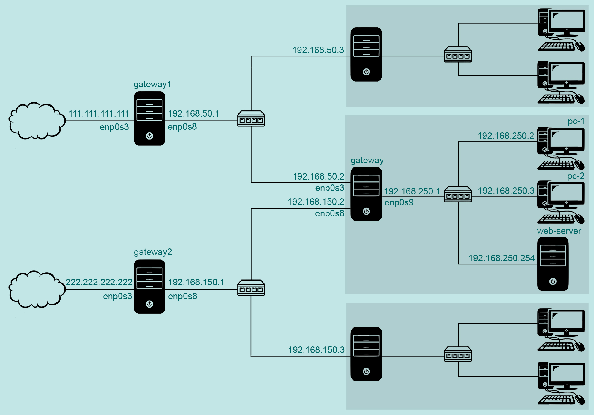
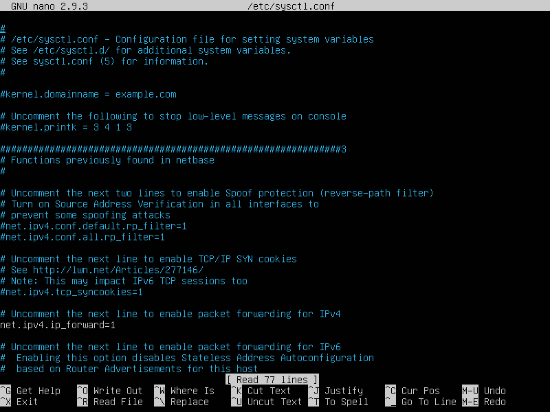
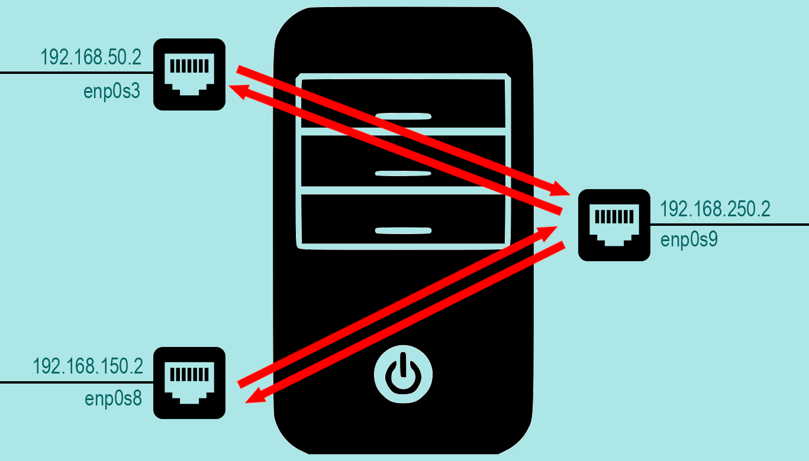
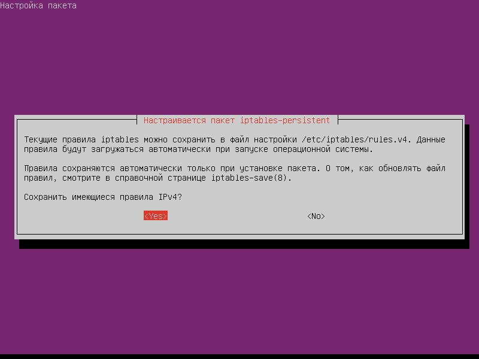
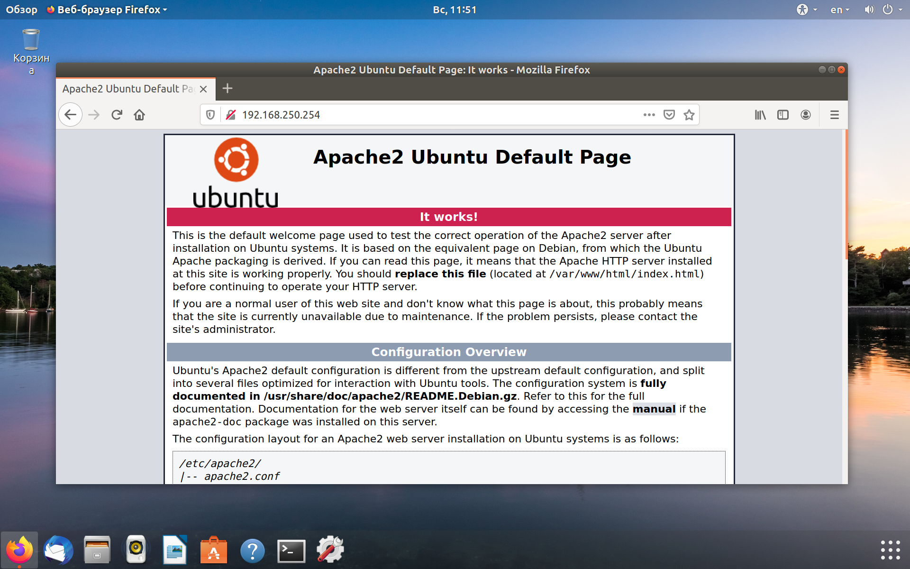
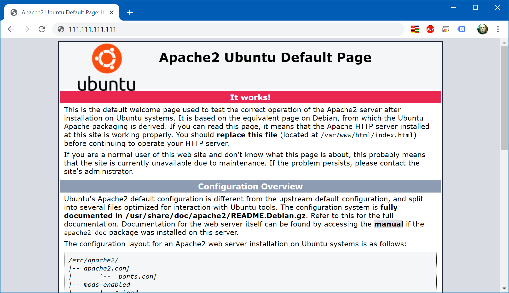

[источник](https://tokmakov.msk.ru/blog/item/508)

- [ Настройка сети](#link_1)
- [ Таблицы маршрутизации](#link_2)
- [ Переключение каналов](#link_3)
- [ Форвардинг пакетов](#link_4)
- [ Сохранение правил](#link_5)
- [ Поднимаем web-сервер](#link_6)
- [ Настройка pc-1 и pc-2](#link_7)
- [ Еще одна таблица маршрутизации](#link_8)
- [ Проверка маршрута для pc-2](#link_9)
- [ Файл конфигурации сети](#link_10)
  - [ Дополнительно](#link_11)

# Маршрутизация на основе политик. Часть четвертая

Немного усложним конфигурацию сети из третьей части. У нашего компьютера теперь не два, а три сетевых интерфейса. Первый интерфейс имеет выход в интернет через сеть первого интернет-провайдера, второй интерфейс — через сеть второго интернет-провайдера. А третий интерфейс подключен к локальной сети `192.168.250.0/24`. И наш компьютер должен обеспечивать выход в интернет для всех компьютеров этой сети.



## Настройка сети <a name="link_1"></a>

На компьютере `gateway` установлена ОС Ubuntu Server, настройка сети выполнена с использованием Netplan:

```
# nano /etc/netplan/01-netcfg.yaml
```

```
network:
  version: 2
  renderer: networkd
  ethernets:
    enp0s3:
      addresses: [192.168.50.2/24]
      routes:
        # маршрут по умолчанию для таблицы main, метрика 100 (основной)
        - to: 0.0.0.0/0
          from: 192.168.50.2
          via: 192.168.50.1
          metric: 100
        # маршрут по умолчанию для таблицы primary (идентификатор 10)
        - to: 0.0.0.0/0
          via: 192.168.50.1
          table: 10
      routing-policy:
        # если отправитель 192.168.50.2, просматривать таблицу primary
        - from: 192.168.50.2
          table: 10
          priority: 31000
      nameservers:
        addresses: [8.8.8.8, 8.8.4.4]
    enp0s8:
      addresses: [192.168.150.2/24]
      routes:
        # маршрут по умолчанию для таблицы main, метрика 200 (резервный)
        - to: 0.0.0.0/0
          from: 192.168.150.2
          via: 192.168.150.1
          metric: 200
        # маршрут по умолчанию для таблицы secondary (идентификатор 20)
        - to: 0.0.0.0/0
          via: 192.168.150.1
          table: 20
      routing-policy:
        # если отправитель 192.168.150.2, просматривать таблицу secondary
        - from: 192.168.150.2
          table: 20
          priority: 32000
      nameservers:
        addresses: [8.8.8.8, 8.8.4.4]
    enp0s9:
      addresses: [192.168.250.1/24]
      nameservers:
        addresses: [8.8.8.8, 8.8.4.4]
```

После загрузки системы смотрим маршруты таблицы `main`:

```
$ ip route show
default via 192.168.50.1 dev enp0s3 proto static src 192.168.50.2 metric 100
default via 192.168.150.1 dev enp0s8 proto static src 192.168.150.2 metric 200
192.168.50.0/24 dev enp0s3 proto kernel scope link src 192.168.50.2
192.168.150.0/24 dev enp0s8 proto kernel scope link src 192.168.150.2
192.168.250.0/24 dev enp0s9 proto kernel scope link src 192.168.250.1
```

Здесь два маршрута по умолчанию, но с разными значениями метрики — один маршрут основной (метрика 100), другой резервный (метрика 200).

## Таблицы маршрутизации <a name="link_2"></a>

И есть два правила, которые предписывают просматривать таблицы `primary` и `secondary`, если пакеты отправляются с ip-адресов `192.168.50.2` и `192.168.150.2` соответственно.

```
$ ip rule show
0:      from all lookup local
31000:  from 192.168.50.2 lookup primary
32000:  from 192.168.150.2 lookup secondary
32766:  from all lookup main
32767:  from all lookup default
```

Таблицы маршрутизации `primary` и `secondary` определены в файле `/etc/iproute2/rt_tables`:

```
# nano /etc/iproute2/rt_tables
```

```
# предопределенные таблицы
255     local
254     main
253     default
0       unspec
# добавляем новые таблицы
10      primary
20      secondary
```

Каждая из таблиц маршрутизации содержит маршрут по умолчанию:

```
$ ip route show table primary
default via 192.168.50.1 dev enp0s3 proto static

$ ip route show table secondary
default via 192.168.150.1 dev enp0s8 proto static
```

## Переключение каналов <a name="link_3"></a>

За переключение каналов отвечает скрипт `/root/swicth-channel/swicth-channel.sh`:

```
# mkdir /root/swicth-channel/
# nano /root/swicth-channel/swicth-channel.sh
```

```bash
#!/bin/sh

# Доступность этого хоста означает доступность основного канала
PING_HOST='8.8.8.8'
# Файл-флаг создается в момент переключении на резервный канал
LOCK_FILE='/root/switch-channel/switch-channel.lock'
# Будем записывать в журнал события переключения на другой канал
LOG_FILE='/root/switch-channel/switch-channel.log'

# Сетевой интерфейс, который смотрит в сеть первого интернет провайдера
IFACE_ONE='enp0s3'
# Сетевой интерфейс, который смотрит в сеть второго интернет провайдера
IFACE_TWO='enp0s8'
# IP-адрес первого сетевого интерфейса (первый интернет провайдер)
IP_IF_ONE='192.168.50.2'
# IP-адрес второго сетевого интерфейса (второй интернет провайдер)
IP_IF_TWO='192.168.150.2'
# IP-адрес шлюза первого интернет провайдера
IP_GW_ONE='192.168.50.1'
# IP-адрес шлюза второго интернет провайдера
IP_GW_TWO='192.168.150.1'

# Возможна такая ситуация, что компьютер был перезагружен в момент, когда работал
# резервный канал интернет. А за время перезагрузки восстановился основной канал
# интернет. В этом случае файл-флаг продолжит существовать и не позволит скрипту
# в дальнейшем переключаться на резервный канал.
if [ -f ${LOCK_FILE} ]; then
    # Получаем вывод команды ip route show, берем только первую строку, ищем в этой
    # строке подстроку ${IFACE_ONE}. Если такая подстрока найдена, значит работает
    # основной канал интернет — и нужно удалить файл-флаг.
    ip route show | head -1 | grep ${IFACE_ONE}
    if [ $? -eq 0 ]; then
        rm -f ${LOCK_FILE}
    fi
fi

# Пингуем проверочный хост через основной канал
ping -I ${IP_IF_ONE} -c1 -n ${PING_HOST} > /dev/null

# Если проверочный хост не доступен
if [ $? -ne 0 ]; then
    # Если нет файла-флага, значит мы сейчас на основном канале
    if [ ! -f ${LOCK_FILE} ]; then
        # Переключаемся на резервный канал (метрика основного маршрута 300, метрика резервного маршрута 200)
        ip route del default via ${IP_GW_ONE} dev ${IFACE_ONE} src ${IP_IF_ONE} proto static metric 100
        ip route add default via ${IP_GW_ONE} dev ${IFACE_ONE} src ${IP_IF_ONE} proto static metric 300
        # Создаём файл-флаг, что мы на резервном канале
        touch ${LOCK_FILE}
        # Делаем запись в файл журнала
        echo `date +'%Y/%m/%d %H:%M:%S'` Switching to secondary channel >> ${LOG_FILE}
    fi
else # Если проверочный хост доступен
    # Если есть файл-флаг, значит мы сейчас на резервном канале
    if [ -f ${LOCK_FILE} ]; then
        # Переключаемся на основной канал (метрика основного маршрута 100, метрика резервного маршрута 200)
        ip route del default via ${IP_GW_ONE} dev ${IFACE_ONE} src ${IP_IF_ONE} proto static metric 300
        ip route add default via ${IP_GW_ONE} dev ${IFACE_ONE} src ${IP_IF_ONE} proto static metric 100
        # Удаляем файл-флаг, мы опять на основном канале
        rm -f ${LOCK_FILE}
        # Делаем запись в файл журнала
        echo `date +'%Y/%m/%d %H:%M:%S'` Switching to primary channel >> ${LOG_FILE}
    fi
fi
```

```
# chmod +x /root/swicth-channel/swicth-channel.sh
```

Этот скрипт будем запускать каждую минуту:

```
# nano /etc/crontab
```

```
# проверка каналов выхода в интернет и переключение канала при необходимости
* *    * * *   root    /root/switch-channel/switch-channel.sh
```

## Форвардинг пакетов <a name="link_4"></a>

По умолчанию транзитный трафик отключен, так что редактируем файл `/etc/sysctl.conf`:

```
# nano /etc/sysctl.conf
```

```
net.ipv4.ip_forward=1
```



После этого настраиваем `netfilter` с помощью утилиты `iptables`:

```
# iptables -P FORWARD DROP

# iptables -A FORWARD -i enp0s3 -o enp0s9 -d 192.168.250.0/24 -j ACCEPT
# iptables -A FORWARD -i enp0s8 -o enp0s9 -d 192.168.250.0/24 -j ACCEPT
# iptables -A FORWARD -i enp0s9 -o enp0s3 -s 192.168.250.0/24 -j ACCEPT
# iptables -A FORWARD -i enp0s9 -o enp0s8 -s 192.168.250.0/24 -j ACCEPT
```

И смотрим, что получилось:

```
# iptables -L -v --line-numbers
Chain INPUT (policy ACCEPT 181 packets, 43950 bytes)
num   pkts   bytes   target   prot   opt   in       out      source             destination

Chain FORWARD (policy DROP 0 packets, 0 bytes)
num   pkts   bytes   target   prot   opt   in       out      source             destination
1        0       0   ACCEPT   all    --    enp0s3   enp0s9   anywhere           192.168.250.0/24
2        0       0   ACCEPT   all    --    enp0s8   enp0s9   anywhere           192.168.250.0/24
3        0       0   ACCEPT   all    --    enp0s9   enp0s3   192.168.250.0/24   anywhere
4        0       0   ACCEPT   all    --    enp0s9   enp0s8   192.168.250.0/24   anywhere

Chain OUTPUT (policy ACCEPT 227 packets, 30799 bytes)
num   pkts   bytes   target   prot   opt   in       out      source             destination
```

Мы разрешили ходить транзитным пакетам для нашего диапазона ip адресов, а всё остальное запретили.



## Сохранение правил <a name="link_5"></a>

Созданные с помощью утилиты `iptables` правила пропадут при перезагрузке. Так что их нужно сохранить и восстанавливать при перезагрузке. В этом нам поможет пакет `iptables-persistent`:

```
$ sudo apt install iptables-persistent
```

При установке пакета будет предложено сохранить текущие правила `iptables`:

- в файл `/etc/iptables/rules.v4` для протокола IPv4
- в файл `/etc/iptables/rules.v6` для протокола IPv6



После установки пакета будет добавлена новая служба `netfilter-persistent.service`, которая при загрузке системы будет восстанавливать созданные нами правила:

```
$ systemctl status netfilter-persistent.service
● netfilter-persistent.service - netfilter persistent configuration
   Loaded: loaded (/lib/systemd/system/netfilter-persistent.service; enabled; vendor preset: enabled)
   Active: active (exited) since Sat 2020-05-24 11:20:44 MSK; 2h 32min ago
  Process: 446 ExecStart=/usr/sbin/netfilter-persistent start (code=exited, status=0/SUCCESS)
 Main PID: 446 (code=exited, status=0/SUCCESS)

май 24 11:20:43 gateway systemd[1]: Starting netfilter persistent configuration...
май 24 11:20:44 gateway systemd[1]: Started netfilter persistent configuration.
```

## Поднимаем web-сервер <a name="link_6"></a>

Установим на машине `web-server` пакет `apache2`:

```
# apt install apache2
```

С компьютера `pc-1` проверим, что сервер работает:



Чтобы обеспечить доступ к web-серверу из интернета, выполняем на `gateway1` команду (подробности [здесь](https://tokmakov.msk.ru/blog/item/474)):

```
# iptables -t nat -A PREROUTING -i enp0s3 -p tcp --dport 80 -j DNAT --to-destination 192.168.250.254
```

И сохраняем правила, чтобы они восстановилось после перезагрузки:

```
# iptables-save > /etc/iptables/rules.v4
```

Проверяем, что web-сервер теперь доступен, набирая в адресной строке `http://111.111.111.111/`:



В принципе, мы можем выполнить эти две команды и на `gateway2` — тогда web-сервер будет доступен по двум ip-адресам. В этом случае при настройке DNS надо будет добавить две A-записи для домена (round-robin). Преобразование доменного имени в ip-адрес производится в произвольном порядке с равной вероятностью распределения. Некоторые DNS-сервера могут регулярно опрашивать серверы для проверки их доступности и нагруженности. Если сервер не отвечает, он временно удаляется из пула DNS, пока не будет готов к работе. Но это уже совсем другая история.

## Настройка pc-1 и pc-2 <a name="link_7"></a>

Настройка сети одинаковая для `pc-1` и `pc-2`, выполнена с использованием Netplan, им назначены ip-адреса `192.168.250.2` и `192.168.250.3`:

```
$ sudo nano /etc/netplan/01-network-manager-all.yaml
```

```
# Настройка сети для компьютера pc-1
network:
  version: 2
  renderer: networkd
  ethernets:
    enp0s3:
      addresses: [192.168.250.2/24]
      gateway4: 192.168.250.1
      nameservers:
        addresses: [8.8.8.8, 8.8.4.4]
```

Служба `NetworkManager` отключена, вместо нее за сеть отвечает служба `systemd-networkd`:

```
# systemctl stop NetworkManager.service
# systemctl disable NetworkManager.service
# systemctl start systemd-networkd.service
# systemctl enable systemd-networkd.service
```

```
$ sudo nano /etc/netplan/01-network-manager-all.yaml
```

```
# Настройка сети для компьютера pc-2
network:
  version: 2
  renderer: networkd
  ethernets:
    enp0s3:
      addresses: [192.168.250.3/24]
      gateway4: 192.168.250.1
      nameservers:
        addresses: [8.8.8.8, 8.8.4.4]
```

## Еще одна таблица маршрутизации <a name="link_8"></a>

Давайте сделаем так, чтобы компьютер `pc-2` выходил в интернет через резервный канал связи, т.е. через сеть второго провайдера. Для этого создадим еще одну таблицу маршрутизации (имена таблиц операционной системе не нужны, это исключительно для нашего удобства, чтобы обращаться не по номеру таблицы, а по говорящему имени):

```
# nano /etc/iproute2/rt_tables
```

```
# предопределенные таблицы
255     local
254     main
253     default
0       unspec
# добавляем новые таблицы
10      primary
20      secondary
30      pc2-via-gw2
```

Теперь добавляем новое правило — какие таблицы просматривать при отправке пакета:

```
# ip rule add from 192.168.250.3 table pc2-via-gw2 pref 30000
```

Смотрим список правил — какие таблицы будут просмотрены при отправке пакета:

```
# ip rule show
0:      from all lookup local
30000:  from 192.168.250.3 lookup pc2-via-gw2
31000:  from 192.168.50.2 lookup primary
32000:  from 192.168.150.2 lookup secondary
32766:  from all lookup main
32767:  from all lookup default
```

Для таблицы `pc2-via-gw2` зададим маршрут по умолчанию:

```
# ip route add default via 192.168.150.1 dev enp0s8 table pc2-via-gw2
```

Убедимся, что маршрут по умолчанию для `pc2-via-gw2` добавлен:

```
# ip route show table pc2-via-gw2
default via 192.168.150.1 dev enp0s8 proto static
```

## Проверка маршрута для pc-2 <a name="link_9"></a>

Проверим, что компьютер `pc-2` выходит в интернет через резервный канал связи:

```
$ traceroute -n ya.ru
traceroute to ya.ru (87.250.250.242), 30 hops max, 60 byte packets
1  192.168.250.1  0.454 ms  0.384 ms  0.341 ms
2  192.168.150.1  1.177 ms  1.142 ms  1.091 ms
..........
9  87.250.250.242  10.984 ms  10.768 ms  10.716 ms
```

Удостоверимся, что компьютер `pc-1` выходит в интернет через основной канал связи:

```
$ traceroute -n ya.ru
traceroute to ya.ru (87.250.250.242), 30 hops max, 60 byte packets
1  192.168.250.1  0.329 ms  0.225 ms  0.172 ms
2  192.168.50.1  0.376 ms  0.326 ms  0.394 ms
..........
9  87.250.250.242  8.377 ms  10.626 ms  11.813 ms
```

## Файл конфигурации сети <a name="link_10"></a>

Созданные нами правило и маршрут по умолчанию для таблицы `pc2-via-gw2` пропадут при перезагрузке `gateway`, поэтому надо изменить файл конфигурации сети:

```
# nano /etc/netplan/01-netcfg.yaml
```

```
network:
  version: 2
  renderer: networkd
  ethernets:
    enp0s3:
      addresses: [192.168.50.2/24]
      routes:
        # маршрут по умолчанию для таблицы main, метрика 100 (основной)
        - to: 0.0.0.0/0
          from: 192.168.50.2
          via: 192.168.50.1
          metric: 100
        # маршрут по умолчанию для таблицы primary (идентификатор 10)
        - to: 0.0.0.0/0
          via: 192.168.50.1
          table: 10
      routing-policy:
        # если отправитель 192.168.50.2, просматривать таблицу primary
        - from: 192.168.50.2
          table: 10
          priority: 31000
      nameservers:
        addresses: [8.8.8.8, 8.8.4.4]
    enp0s8:
      addresses: [192.168.150.2/24]
      routes:
        # маршрут по умолчанию для таблицы main, метрика 200 (резервный)
        - to: 0.0.0.0/0
          from: 192.168.150.2
          via: 192.168.150.1
          metric: 200
        # маршрут по умолчанию для таблицы secondary (идентификатор 20)
        - to: 0.0.0.0/0
          via: 192.168.150.1
          table: 20
        # маршрут по умолчанию для таблицы pc2-via-gw2 (идентификатор 30)
        - to: 0.0.0.0/0
          via: 192.168.150.1
          table: 30
      routing-policy:
        # если отправитель 192.168.150.2, просматривать таблицу secondary
        - from: 192.168.150.2
          table: 20
          priority: 32000
        # если отправитель 192.168.250.3, просматривать таблицу pc2-via-gw2
        # (отправлять пакеты от компьютера pc-2 через второго провайдера)
        - from: 192.168.250.3
          table: 30
          priority: 30000
      nameservers:
        addresses: [8.8.8.8, 8.8.4.4]
    enp0s9:
      addresses: [192.168.250.1/24]
      nameservers:
        addresses: [8.8.8.8, 8.8.4.4]
```

#### Дополнительно <a name="link_11"></a>

- [Linux маршрутизатор с несколькими внешними интерфейсами](http://www.opennet.ru/base/net/debian_multilink.txt.html)
- [Роутинг и policy-routing в Linux при помощи iproute2](https://habr.com/ru/post/108690/)
