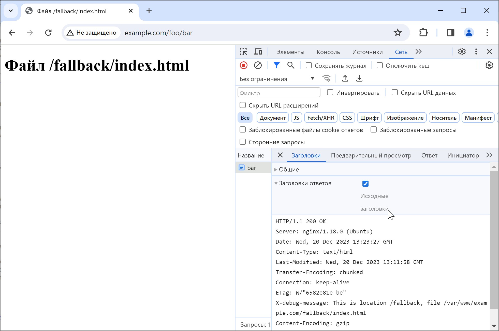
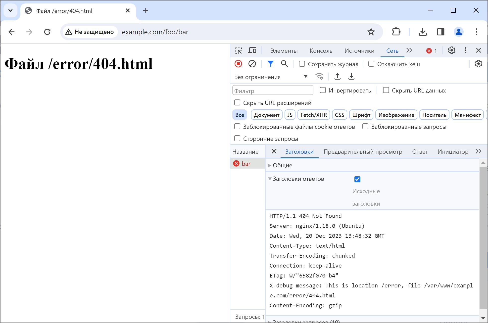
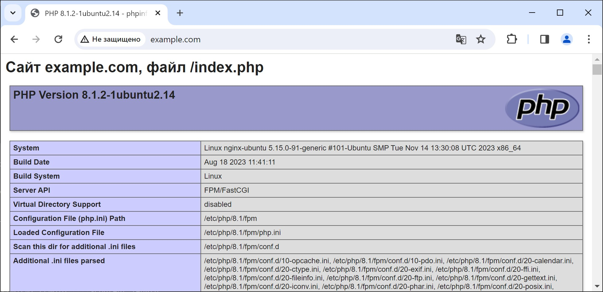
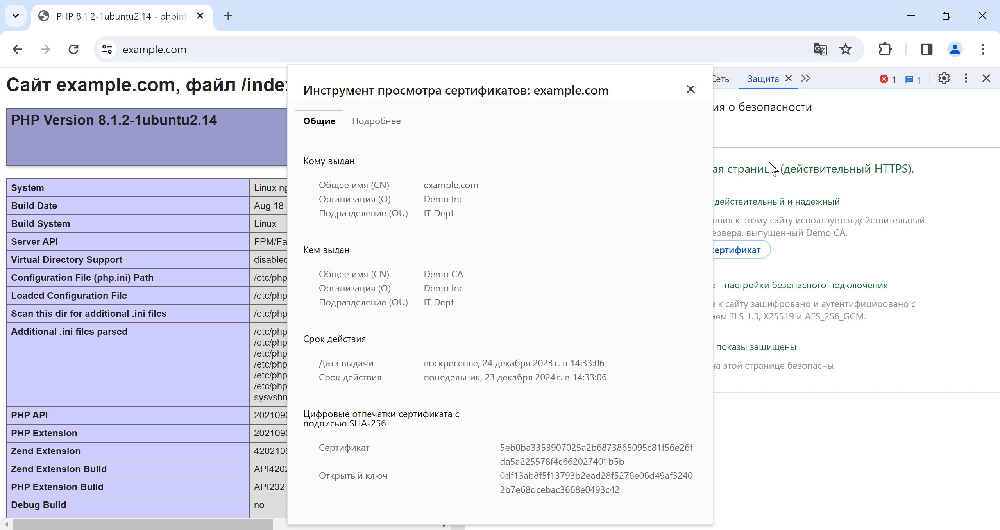

[источник](https://tokmakov.msk.ru/blog/item/770)

- [ Nginx. Установка и настройка. Часть 1](#link_1)
  - [ Установка nginx-core](#link_2)
  - [ Варианты установки](#link_3)
  - [ Файлы конфигурации](#link_4)
  - [ Главный файл конфигурации](#link_5)
  - [ Модульная структура](#link_6)
  - [ Директивы конфигурации](#link_7)
  - [ Логирование запросов и ошибок](#link_8)
  - [ Виртуальные хосты](#link_9)
  - [ Директивы listen и server_name](#link_10)
  - [ Директивы location и root](#link_11)
  - [ Примеры location и root](#link_12)
    - [ Первый пример](#link_13)
    - [ Второй пример](#link_14)
    - [ Третий пример](#link_15)
    - [ Четвертый пример](#link_16)
  - [ Внутренние редиректы](#link_17)
    - [ Директива index](#link_18)
    - [ Директива try_files](#link_19)
    - [ Директива error_page](#link_20)
  - [ Установка службы PHP-FPM](#link_21)
  - [ Подключение Nginx к PHP-FPM](#link_22)
  - [ Настройка PHP-FPM для прослушивания сокета UNIX](#link_23)
  - [ Настройка PHP-FPM для прослушивания сокета TCP/IP](#link_24)
  - [ Файл конфигурации Nginx для PHP-FPM](#link_25)
  - [ Настройка поддержки HTTPS](#link_26)
- [ Nginx. Установка и настройка. Часть 2](#link_27)
  - [ Редиректы с кодом 301](#link_28)
  - [ Как nginx обрабатывает запросы](#link_29)
    - [ Примеры поиска подходящего location](#link_30)
      - [ Первая конфигурация](#link_31)
      - [ Вторая конфигурация](#link_32)
      - [ Третья конфигурация](#link_33)
      - [ Четвертая конфигурация](#link_34)
      - [ Пятая конфигурация](#link_35)
      - [ Шестая конфигурация](#link_36)
  - [ Базовая HTTP-авторизация](#link_37)
  - [ Прочие директивы конфигурации](#link_38)
    - [ Директивы allow и deny](#link_39)
    - [ Директива client_max_body_size](#link_40)
    - [ Директивы limit_req_zone и limit_req](#link_41)
  - [ Настройка Nginx как reverse proxy](#link_42)
    - [ 1. Виртуальная машина nginx-server](#link_43)
      - [ Настройка Nginx как reverse proxy](#link_44)
      - [ Директива конфигурации proxy_pass](#link_45)
    - [ 2. Виртуальная машина www-one](#link_46)
      - [ Настройка nginx как веб-сервера](#link_47)
      - [ Установка и настройка php-fpm](#link_48)
      - [ Если возникла проблема ссылок](#link_49)
  - [ Балансировка нагрузки, директива upstream](#link_50)
  - [ Прокси-сервер для TCP/IP, директива stream](#link_51)
    - [ 1. Установка на виртуальную машину sql-one](#link_52)
    - [ 2. Установка на виртуальную машину sql-two](#link_53)
    - [ 3. Запуск MySQL кластера Galera вручную](#link_54)
    - [ 4. Запуск MySQL кластера Galera скриптом](#link_55)
    - [ 5. Настройка Nginx как TCP/IP proxy](#link_56)
    - [ 6. Доступ по ssh через прокси-сервер](#link_57)
- [ Nginx. Установка и настройка. Часть 3](#link_58)
  - [ Переменные в файле конфигурации](#link_59)
    - [ Предопределенные переменные](#link_60)
    - [ Пользовательские переменные](#link_61)
      - [ Первый пример, директива set](#link_62)
      - [ Второй пример, директива map](#link_63)
      - [ Третий пример, директива set](#link_64)
      - [ Четвертый пример, директива map](#link_65)
  - [ Фазы обработки запроса](#link_66)
  - [ Модуль ngx_http_rewrite_module](#link_67)
    - [ Директива конфигурации if](#link_68)
      - [ Первый пример](#link_69)
      - [ Второй пример](#link_70)
      - [ Третий пример](#link_71)
      - [ Четвертый пример](#link_72)
      - [ Пятый пример](#link_73)
    - [ Директива конфигурации rewrite](#link_74)
      - [ Первый пример](#link_75)
      - [ Второй пример](#link_76)
      - [ Третий пример](#link_77)
      - [ Четвертый пример](#link_78)
      - [ Пятый пример](#link_79)
      - [ Шестой пример](#link_80)
      - [ Флаги last и break](#link_81)
    - [ Директива конфигурации return](#link_82)
      - [ Первый пример](#link_83)
      - [ Второй пример](#link_84)

# Nginx. Установка и настройка. Часть 1 <a name="link_1"></a>

Nginx — это веб-сервер с открытым исходным кодом, созданный работать под высокой нагрузкой, чаще всего используемый для отдачи статического контента. Он также может выполнять другие важные функции, такие как балансировка нагрузки, кеширование HTTP и использование в качестве обратного прокси.

## Установка nginx-core <a name="link_2"></a>

Обновляем списки пакетов из репозиториев и устанавливаем

```bash
$ sudo apt update
$ sudo apt install nginx
```

После установки добавляем службу в автозагрузку

```bash
$ sudo systemctl enable nginx.service
```

Проверяем статус работы веб-сервера

```bash
$ sudo systemctl status nginx.service
```

Проверяем наличие службы в автозагрузке

```bash
$ sudo systemctl is-enabled nginx.service
```

Для работы с установленным веб-сервером пригодятся базовые команды управления

| Функция                                      | Команда                        |
| -------------------------------------------- | ------------------------------ |
| Запуск                                       | `sudo systemctl start nginx`   |
| Остановка                                    | `sudo systemctl stop nginx`    |
| Перезапуск (последовательно stop и start)    | `sudo systemctl restart nginx` |
| Перезагрузка (перечитать файлы конфигурации) | `sudo systemctl reload nginx`  |
| Проверка состояния                           | `sudo systemctl status nginx`  |
| Тест конфигурации                            | `sudo nginx -t`                |

## Варианты установки <a name="link_3"></a>

Для установки доступны пакеты `nginx-light`, `nginx-core` (наш вариант), `nginx-full` и `nginx-extra`.

Пакет `nginx-light` — это облегченная версия nginx, с минимальным набором модулей. Включает в себя только базовые возможности HTTP-сервера, недоступны многие модули, например модуль перезаписи URL `ngx_http_rewrite_module` или модуль сжатия `ngx_http_gzip_module`. Может быть полезен в контейнерных средах, таких как Docker, где минимализм является ключевым моментом. Это также неплохой выбор для основных задач балансировки нагрузки.

Пакет `nginx-core` представляет собой минимальную, но полную установку веб-сервера nginx. Это отправная точка, если нужен функциональный сервер без посторонних модулей. Включает в себя базовые функции HTTP, такие как поддержка HTTP/2, поддержка Secure Sockets Layer (SSL) и основные функции обратного прокси. Хороший выбор для простых веб-приложений, статических веб-сайтов или конфигураций обратного прокси-сервера, где не нужны дополнительные функции.

Пакет `nginx-full` — более многофункциональная версия nginx, предназначенная для более сложных и ресурсоемких задач. Включает в себя почти все модули с исходным исходным кодом nginx, такие как возможности проксирования, дополнительные модули HTTP, поддержку WebSocket и многое другое. Подходит для сложных веб-приложений, которым требуются различные функции, такие как SSL, проксирование и расширенные возможности кэширования. Также хорошо подходит, если нужен веб-сервер общего назначения, не слишком беспокоясь о том, какие модули могут понадобиться позже.

Пакет `nginx-extras` — наиболее многофункциональный, ориентирован на узкоспециализированные развертывания, требующие широкого набора функциональных возможностей. Включает в себя все модули, имеющиеся в `nginx-full`, а также дополнительные сторонние модули. Однако следует отметить, что `nginx-extras` не включает в себя все возможные модули. Для тех нишевых потребностей, которые не удовлетворяются доступными пакетами, может потребоваться компиляция nginx из исходного кода.

## Файлы конфигурации <a name="link_4"></a>

Все файлы конфигурации Nginx расположены в директории `/etc/nginx`

```
$ ls -la /etc/nginx/
total 72
drwxr-xr-x  8 root root 4096 дек 11 15:43 .
drwxr-xr-x 99 root root 4096 дек 11 15:44 ..
drwxr-xr-x  2 root root 4096 мая 30  2023 conf.d
-rw-r--r--  1 root root 1125 мая 30  2023 fastcgi.conf
-rw-r--r--  1 root root 1055 мая 30  2023 fastcgi_params
-rw-r--r--  1 root root 2837 мая 30  2023 koi-utf
-rw-r--r--  1 root root 2223 мая 30  2023 koi-win
-rw-r--r--  1 root root 3957 мая 30  2023 mime.types
drwxr-xr-x  2 root root 4096 мая 30  2023 modules-available
drwxr-xr-x  2 root root 4096 дек 11 15:44 modules-enabled
-rw-r--r--  1 root root 1447 мая 30  2023 nginx.conf
-rw-r--r--  1 root root  180 мая 30  2023 proxy_params
-rw-r--r--  1 root root  636 мая 30  2023 scgi_params
drwxr-xr-x  2 root root 4096 дек 11 15:43 sites-available
drwxr-xr-x  2 root root 4096 дек 11 15:43 sites-enabled
drwxr-xr-x  2 root root 4096 дек 11 15:43 snippets
-rw-r--r--  1 root root  664 мая 30  2023 uwsgi_params
-rw-r--r--  1 root root 3071 мая 30  2023 win-utf
```

Здесь много чего, но нам в первую очередь интересны следующие файлы и директории

- `nginx.conf` — главный конфигурационный файл nginx.
- `conf.d` — дополнительные конфигурационные файлы nginx.
- `sites-available` — в этой директории хранятся файлы виртуальных хостов. Nginx не использует файлы из этой директории, если ссылки на них нет в директории `sites-enabled`.
- `sites-enabled` — директория, в которой хранятся активированные виртуальные хосты. Обычно это делается путём создания ссылки на файл конфигурации хоста из директории `sites-available`.
- `modules-available`, `modules-enabled` — эти директории содержат, соответственно, доступные и активные модули.

## Главный файл конфигурации <a name="link_5"></a>

Давайте посмотрим содержимое главного файла конфигурации `/etc/nginx/nginx.conf`

```
user www-data;
worker_processes auto;
pid /run/nginx.pid;
include /etc/nginx/modules-enabled/*.conf;
events {
    worker_connections 1024;
    # multi_accept on;
}
http {
    # базовые настройки
    sendfile on;
    tcp_nopush on;
    types_hash_max_size 2048;
    keepalive_timeout 40;

    # кодировка по умолчанию
    charset UTF-8;
    # настройки кэширования
    open_file_cache max=10000 inactive=30s;
    # настройка mime-types
    include /etc/nginx/mime.types;
    default_type application/octet-stream;
    # настройки SSL
    ssl_protocols TLSv1 TLSv1.1 TLSv1.2 TLSv1.3; # Dropping SSLv3, ref: POODLE
    ssl_prefer_server_ciphers on;
    # логирование
    access_log /var/log/nginx/access.log;
    error_log /var/log/nginx/error.log;
    # разрешить сжатие
    gzip on;
    # виртуальные хосты
    include /etc/nginx/conf.d/*.conf;
    include /etc/nginx/sites-enabled/*;
}

```

Файл конфигурации состоит из секций и директив

```
секция main
├── директивы main
├── секция events
│   └── директивы events
├── секция http
│   ├── директивы http
│   ├── секция server
│   │   ├── директивы server
│   │   └── секция location
│   └── секция server
│       ├── директивы server
│       └── секция location
└── секция mail
    ├── директивы mail
    ├── секция server
    │   └── директивы server
    └── секция server
        └── директивы server
```

## Модульная структура <a name="link_6"></a>

Nginx является модульным приложением. Это значит, что каждая из директив в конфиге связана с определенным модулем. Так, к примеру, модуль `ngx_core_module` отвечает за основную логику — то есть определяет как раз те директивы, без которых сервер просто не запустится (например `user`).

Модули существуют двух видов — статические и динамические. Статические — это модули, которые входят в состав nginx в результате сборки из исходников с добавлением кода необходимого модуля. Динамические — это модули, которые можно подключать к nginx без сборки самого nginx, хотя сам модуль должен быть собран как внешняя библиотека. Однако nginx не позволяет подключить динамический модуль, если в ходе сборки nginx не была указана в параметрах сборки поддержка этого модуля. Иначе говоря — если требуется конкретный модуль, то в любом случае необходимо собирать nginx из исходных файлов. А вот как — уже на ваше усмотрение и исходя из возможностей работы модуля (не все модули умеют работать как динамические).

В директории `/etc/nginx/modules-enabled` мы найдем несколько символических ссылок на файлы конфигурации. В этих файлах конфигурации с помощью директивы `load_module` загружаются динамические модули.

```
$ ls -la /etc/nginx/modules-enabled
lrwxrwxrwx 1 root root   55 дек 11 15:44 50-mod-http-geoip2.conf -> /usr/share/nginx/modules-available/mod-http-geoip2.conf
lrwxrwxrwx 1 root root   61 дек 11 15:44 50-mod-http-image-filter.conf -> /usr/share/nginx/modules-available/mod-http-image-filter.conf
lrwxrwxrwx 1 root root   60 дек 11 15:44 50-mod-http-xslt-filter.conf -> /usr/share/nginx/modules-available/mod-http-xslt-filter.conf
lrwxrwxrwx 1 root root   48 дек 11 15:44 50-mod-mail.conf -> /usr/share/nginx/modules-available/mod-mail.conf
lrwxrwxrwx 1 root root   50 дек 11 15:44 50-mod-stream.conf -> /usr/share/nginx/modules-available/mod-stream.conf
lrwxrwxrwx 1 root root   57 дек 11 15:44 70-mod-stream-geoip2.conf -> /usr/share/nginx/modules-available/mod-stream-geoip2.conf
```

```
$ cat /etc/nginx/modules-enabled/50-mod-http-image-filter.conf
load_module modules/ngx_http_image_filter_module.so;
```

Модуль `ngx_http_image_filter_module` позволяет использовать в файле конфигурации директиву `image_filter`, с помощью которой можно изменять размер, поворачивать и обрезать изображения. Модуль `ngx_http_empty_gif_module` позволяет использовать директиву `empty_gif`, которая выдает прозрачное gif-изображение размером 1x1 пиксель.

```
location /img/ {
    proxy_pass   http://backend;
    image_filter resize 150 100;
    image_filter rotate 90;
    error_page   415 = /empty;
}
location = /empty {
    empty_gif;
}

```

## Директивы конфигурации <a name="link_7"></a>

Существует два вида директив — простые и блочные. Простая директива состоит из имени и параметров, разделённых пробелами, и в конце строки ставится точкой с запятой. Блочная директива (секция) состоит из нескольких директив, помещённых внутри фигурных скобок.

- `user` — пользователь, от имени которого работает nginx, обычно `www-data`
- `worker_processes` – количество процессов сервера, значение выставляется равным количеству ядер процессора, `auto` — nginx определит автоматически
- `pid` — файл, внутри которого хранится идентификатор запущенного главного процесса (PID)
- `include` — подключаемый файл или файлы конфигурации
- `events` — секция директив, определяющих работу с сетевыми соединениями
- `worker_connections` — по умолчанию 512. Устанавливает максимальное количество соединений одного рабочего процесса, то есть nginx будет обрабатывать `worker_processes * worker_connections`, остальные запросы ставить в очередь. Следует выбирать значения от 1024 до 4096 — зависит от производительности процессора.
- `multi_accept` — по умолчанию `off`. Если включен, позволяет принимать максимально возможное количество соединений. Если отключен, nginx решает, какой дочерний процесс будет обрабатывать запрос. Поскольку nginx очень эффективен в этом — значение `off` подойдет в большинстве случаев.
- `http` — секция директив http-сервера
- `sendfile` — позволяет использовать более совершенный системный вызов, который обеспечивает прямую передачу файла, то есть без системных вызовов read и write
- `tcp_nopush` — позволяет передавать заголовок ответа и начало файла в одном пакете, при использовании значения `on` — повышает производительность.
- `types_hash_max_size` — регламентирует максимальный размер хэш таблиц типов. Чтобы быстро обрабатывать статические наборы данных — nginx использует хеш-таблицы. При запуске nginx сам подбирает размеры хеш-таблиц — но не больше указанного значения. Чем больше значение, тем больше памяти будет использовано, но частота конфликтов хеш-ключей уменьшится, а скорость извлечения будет выше. Если в логах появляются сообщения «could not build optimal types_hash» — нужно увеличить значение.
- `keepalive_timeout` — по умолчанию 75. Отвечает за максимальное время поддержания keepalive-соединения, в случае, если клиент по нему ничего не запрашивает. Для современных условий, стоит выставить от 30 до 50.
- `open_file_cache` — по умолчанию отключена. При включении nginx будет хранить в кэше дескрипторы открытых файлов, информацию об их размерах и времени модификации, информацию о существовании каталогов, информацию об ошибках поиска файла — «файл не найден», «нет прав на чтение».
- `default_type` — указывает тип MIME ответа по умолчанию
- `ssl_protocols` — включает указанные SSL протоколы
- `access_log` — задает путь к файлу лога доступа и формат записей; при выставлении значения в `off`, запись в журнал доступа будет отключена
- `error_log` — путь к файлу лога регистрации ошибок и уровень детализации
- `gzip` — включает или отключает сжатие

## Логирование запросов и ошибок <a name="link_8"></a>

Директива `log_format` позволяет описать, что будет содержаться в журнале запросов. По умолчанию используется формат `combined`.

```
log_format combined '$remote_addr - $remote_user [$time_local] '
                    '"$request" $status $body_bytes_sent '
                    '"$http_referer" "$http_user_agent"';
```

Все, что начинается с доллара — это переменные, большинство из которых доступно по умолчанию. Однако, возможно задать новые переменные, которые также можно использовать при описании формата логов доступа.

Лог ошибок, как нетрудно догадаться, используется для записи ошибок работы nginx. В отличие от `access_log`, в директиву `error_log` передается не формат логов, а минимальный уровень детализации. По умолчанию используется уровень `error`, но существуют и другие уровни, вплоть до `debug`.

```
error_log /var/log/nginx/error.log debug;
```

Для повышения производительности при записи логов доступа можно использовать буфер перед записью на диск. Есть два тригера для записи из буфера в файл, которые можно использовать одновременно

- если буфер заполнен и больше не вмещается
- если данные в буфере старше, чем указано

Размер буфера и время сброса на диск задаются с помощью директив `buffer` и `flush`

```
access_log /var/log/nginx/access.log combined buffer=256k flush=10s;
error_log /var/log/nginx/error.log warn;
```

## Виртуальные хосты <a name="link_9"></a>

Директива `server` определяет так называемый виртуальный хост, что позволяет на одном ip-адресе обрабатывать несколько доменов. К какому домену идет обращение — nginx определяет по http-заголовку `Host`. В общем случае, каждый `server` может быть запущен на конкретном ip-адресе и порту, либо обрабатывать конкретное (или несколько конкретных) доменных имен.

В файле конфигурации `/etc/nginx/nginx.conf` есть две директивы `include`

```
http {
    # виртуальные хосты
    include /etc/nginx/conf.d/*.conf;
    include /etc/nginx/sites-enabled/*;
}
```

Давайте посмотрим содержимое директории `/etc/nginx/sites-enabled`

```
$ ls -la /etc/nginx/sites-enabled
total 8
drwxr-xr-x 2 root root 4096 дек 11 15:43 .
drwxr-xr-x 8 root root 4096 дек 11 17:21 ..
lrwxrwxrwx 1 root root   34 дек 11 15:43 default -> /etc/nginx/sites-available/default
```

Давайте посмотрим содержимое файла `/etc/nginx/sites-enabled/default`

```
#_Default server configuration
server {
    listen 80 default_server;
    listen [::]:80 default_server;
    root /var/www/html;
    # Add index.php to the list if you are using PHP
    index index.html index.htm index.nginx-debian.html;
    server_name _;
    location / {
            # First attempt to serve request as file, then as
            # directory, then fall back to displaying a 404.
            try_files $uri $uri/ =404;
    }
}
```

Это конфигурация так называемого сервера по умолчанию. Если пришел http-запрос, но ни один из виртуальных хостов его не обработал — тогда запрос будет обработан сервером по умолчанию. Сервер по умолчанию можно задать явно с помощью параметра `default_server` в директиве `listen`. В противном случае сервером по умолчанию будет считаться первый сервер в списке.

```
server {
    listen 80; # сервер по умолчанию для 80-го порта
    server_name example.org www.example.org;
    # ...прочие директивы конфигурации...
}
server {
    listen 80;
    server_name example.net www.example.net;
    # ...прочие директивы конфигурации...
}
server {
    listen 80;
    server_name example.com www.example.com;
    # ...прочие директивы конфигурации...
}
```

Сервер по умолчанию является свойством слушающего порта, поэтому у разных портов могут быть определены разные серверы по умолчанию

```
server {
    listen 80;
    listen 8080 default_server;
    server_name example.org www.example.org;
    # ...прочие директивы конфигурации...
}
server {
    listen 80 default_server;
    listen 8080;
    server_name example.com www.example.com;
    # ...прочие директивы конфигурации...
}
```

## Директивы listen и server_name <a name="link_10"></a>

Директива `listen` позволяет определить, где слушает конкретный сервер — какой порт, какой ip-адрес или вообще unix-сокет. Кроме этого, он позволяет установить большое количество опций по работе сервера, например, использовать ли SSL, по какому протоколу работать и так далее.

Директива `server_name` позволяет указать, какие доменные имена будет обрабатывать конкретный сервер. Можно указать несколько доменных имен через пробел. Кроме того, допускается использовать `*` — например, чтобы обрабатывать все субдомены `*.example.com`

```
server {
    listen 443 http2 ssl;
    server_name example.com www.example.com;
    # ...прочие директивы конфигурации...
}
```

Когда приходит http-запрос — nginx вначале сопоставляет ip-адрес и порт запроса с директивами `listen` в секциях `server`. Затем сопоставляет значение поле `Host` заголовка запроса с директивами `server_name` в секциях `server`, которые соответствуют ip-адресу и порту. Если имя сервера не найдено, запрос будет обработан сервером по умолчанию.

Давайте рассмотрим вот такой пример конфигурации

```
server {
    listen  192.168.1.1:80;
    server_name example.org www.example.org;
    # ...прочие директивы конфигурации...
}
server {
    listen 192.168.1.1:80 default_server;
    server_name example.net www.example.net;
    # ...прочие директивы конфигурации...
}
server {
    listen 192.168.1.2:80 default_server;
    server_name example.com www.example.com;
    # ...прочие директивы конфигурации...
}
```

Запрос `www.example.com`, который пришел на `192.168.1.1:80`, будет обработан сервером по умолчанию (второй в списке), потому как имени `www.example.com` нет в директиве `server_name` первого сервера и нет в директиве `server_name` второго сервера. Это значит, что запрос должен обработать сервер по умолчанию. Если бы не было параметра `default_server` для второго сервера — запрос бы обработал первый сервер.

Если необходимо обрабатывать http-запросы без поля `Host` в заголовке — нужно указать в качестве значения директивы `server_name` пустую строку. Это можно сделать для уже существующей секции, так и создать новую секцию `server`. Если это новая секция `server` — то директиву `server_name` с пустой строкой можно не указывать, это значение по умолчанию.

```
server {
    listen 80;
    server_name example.org www.example.org "";
    # ...прочие директивы конфигурации...
}

server {
    listen 80;
    server_name "";
    # ...прочие директивы конфигурации...
}
```

Если в запросе вместо имени сервера указан ip-адрес, то поле `Host` заголовка запроса будет содержать ip-адрес, и запрос можно обработать, используя ip-адрес как имя сервера.

```
server {
    listen 80;
    server_name example.org www.example.org "" 192.168.1.1;
    # ...прочие директивы конфигурации...
}
```

Если запросы без поля `Host` в заголовке не должны обрабатываться, можно определить сервер, который будет их отклонять. В примере ниже возвращается специальный для nginx код `444`, который закрывает соединение.

```
server {
    listen 80;
    server_name "";
    return 444;
}
```

В примерах конфигурации серверов, обрабатывающих все запросы, встречается странное имя `_` (подчеркивание). Оно не является каким-то особенным, это просто одно из множества некорректных доменных имён, которые никогда не пересекутся ни с одним из реальных имён.

```
server {
    listen 80 default_server;
    server_name _;
    return 444;
}
```

## Директивы location и root <a name="link_11"></a>

Директивы `location` служит для установки конфигурации в зависимости от URI-запроса. Директива `root` задает начальную часть пути к файлам, которые будет отдавать nginx, в файловой системе сервера.

```
http {
    server {
        listen 80;
        server_name example.org;
        root /var/www/example.org;
        location /img {
            # ...прочие директивы конфигурации...
        }

        location /pdf {
            # ...прочие директивы конфигурации...
        }
    }
}
```

Здесь все просто — nginx сравнивает строку, которая идет после директивы `location` с URI http-запроса. Скажем, приходит http-запрос `http://example.org/img/logo.png`, URI этого запроса — это `/img/logo.png`. Сравнивается начальная часть URI `/img/logo.png` со строкой `/img` — здесь есть совпадение `/img` с `/img`. Это значит, что nginx будет искать в файловой системе файл `/var/www/example.org/img/logo.png` — это `root + /img/logo.png`.

Директива `location` может быть представлена одним из трех вариантов

```
#_поиск точного совпадения URI http-запроса со строкой string, высший приоритет
location = string {
    # ...прочие директивы конфигурации...
}

#_поиск совпадения начала URI http-запроса со строкой string максимальной длины
location [^~] string {
    # ...прочие директивы конфигурации...
}

#_поиск первого совпадения URI http-запроса с регулярным выражением regexp
location ~[*] regexp {
    # ...прочие директивы конфигурации...
}
```

Nginx ищет подходящий блок `location` по следующему алгоритму

1. Поиск точного совпадения URI http-запроса со строкой `location = string {...}` без использования регулярных выражений. Если совпадение найдено — поиск завершается.
2. Поиск совпадения начала URI http-запроса со строкой `location [^~] string {...}` без использования регулярных выражений. Идет поиск совпадения максимальной длины — это значит, что поиск не завершается после первого совпадения. Если совпадение максимальной длины имеет префикс `^~` — поиск завершается. Если совпадение максимальной длины не имеет префикса — `location` временно сохраняется.
3. Поиск совпадения URI http-запроса с шаблоном `location ~[*] regexp {...}`, в порядке их определения в файле конфигурации. Если совпадение найдено — поиск завершается. Обратите внимание, что поиск завершается после первого найденного совпадения. Звездочка `*` означает поиск без учета регистра.
4. Возвращается временно сохраненный `location` из второго пункта.

Обратите внимание, что этот алгоритм не применим при наличии вложенных `location`.

## Примеры location и root <a name="link_12"></a>

Давайте рассмотрим пример файла конфигурации и посмотрим, как nginx будет искать подходящую директиву `location`. Для этого создадим файл конфигурации `example.com` в директории `/etc/nginx/sites-available`. И поставим символическую ссылку на него в директории `/etc/nginx/sites-enabled`. Кроме того, нам нужна директория `/var/www/example.com` и внутри нее — несколько директорий с файлами изображений.

```bash
$ sudo mkdir /var/www/example.com
$ sudo cp /etc/nginx/sites-available/default /etc/nginx/sites-available/example.com
$ sudo ln -s /etc/nginx/sites-available/example.com /etc/nginx/sites-enabled/
```

Структура директорий внутри `/var/www/example.com`

```
[example.com]
    [111]
        [img]
            nginx.png
            [logo]
                nginx.png
    [222]
        [img]
            nginx.png
            [logo]
                nginx.png
    [333]
        [img]
            nginx.png
            [logo]
                nginx.png
    [444]
        [img]
            nginx.png
            [logo]
                nginx.png
```

Смысл этого в том, что файл `nginx.png` всегда разный, на каждом есть текст, указывающий путь в файловой системе — так мы будем знать, какое правило сработало и какой файл `nginx.png` нам отдает веб-сервер. Чтобы выполнять http-запросы, обращаясь к веб-серверу по имени домена `example.com` — добавим запись в файл `hosts` на том компе, с которого будем обращаться к веб-серверу.

#### Первый пример <a name="link_13"></a>

Выполняем http-запрос `http://example.com/img/logo/nginx.png`

```bash
$ sudo nano /etc/nginx/sites-available/example.com
```

```
server {
    listen 80;
    server_name example.com;
    root /var/www/example.com;
    location /img {
        root /var/www/example.com/111;
    }
    location /img/logo {
        root /var/www/example.com/222;
    }
    location ~ ^/img {
        root /var/www/example.com/333;
    }
    location ~ ^/img/logo {
        root /var/www/example.com/444;
    }
}
```

```bash
$ sudo nano systemctl restart nginx.service
```

Nginx сначала ищет самое длинное совпадение — это будет второй блок `location`. Поскольку самое длинное совпадение не имеет префикса `^~` — nginx переходит к поиску по регулярным выражениям. Причем, останавливается на первом совпадении — это третий блок. Чтобы сработал четвертый блок — его надо разместить перед третьим.


#### Второй пример <a name="link_14"></a>

Выполняем http-запрос `http://example.com/img/logo/nginx.png`

```bash
$ sudo nano /etc/nginx/sites-available/example.com
```

```
server {
    listen 80;
    server_name example.com;
    root /var/www/example.com;
    location /img {
        root /var/www/example.com/111;
    }
    location ^~ /img/logo {
        root /var/www/example.com/222;
    }
    location ~ ^/img {
        root /var/www/example.com/333;
    }
    location ~ ^/img/logo {
        root /var/www/example.com/444;
    }
}
```

```bash
$ sudo nano systemctl restart nginx.service
```

Nginx сначала ищет самое длинное совпадение — это будет второй блок `location`. Поскольку есть префикс `^~` — поиск завершается.


#### Третий пример <a name="link_15"></a>

Выполняем http-запрос `http://example.com/img/nginx.png`

```bash
$ sudo nano /etc/nginx/sites-available/example.com
```

```
server {
    listen 80;
    server_name example.com;
    root /var/www/example.com;
    location /img {
        root /var/www/example.com/111;
    }
    location /img/logo {
        root /var/www/example.com/222;
    }
    location ~ ^/i {
        root /var/www/example.com/333;
    }
    location ~ ^/img {
        root /var/www/example.com/444;
    }
}
```

```bash
$ sudo nano systemctl restart nginx.service
```

Nginx сначала ищет самое длинное совпадение — это будет первый блок `location`. Поскольку самое длинное совпадение не имеет префикса `^~` — nginx переходит к поиску по регулярным выражениям. Причем, останавливается на первом совпадении — это третий блок. Чтобы сработал четвертый блок — его надо разместить перед третьим.


#### Четвертый пример <a name="link_16"></a>

Выполняем http-запрос `http://example.com/logo/nginx.png`

```bash
$ sudo nano /etc/nginx/sites-available/example.com
```

```
server {
    listen 80;
    server_name example.com;
    root /var/www/example.com;
    location /logo {
        root /var/www/example.com/111/img;
    }
    location /img/logo {
        root /var/www/example.com/222;
    }
    location ~ ^/lo {
        root /var/www/example.com/333/img;
    }
    location ~ ^/logo {
        root /var/www/example.com/444/img;
    }
}
```

```bash
$ sudo nano systemctl restart nginx.service
```

Nginx сначала ищет самое длинное совпадение — это будет первый блок `location`. Поскольку самое длинное совпадение не имеет префикса `^~` — nginx переходит к поиску по регулярным выражениям. Причем, останавливается на первом совпадении — это третий блок. Чтобы сработал четвертый блок — его надо разместить перед третьим.


Выбрал не слишком удачный способ посмотреть, какой блок `location` сработал — через текст на всех изображениях `nginx.png`. Все это можно сделать намного проще — если внутри каждого блока `location` разместить директиву `add_header`. Тогда через инструменты разработчика DevTools браузера можно будет посмотреть заголовки и узнать, какой блок сработал.

## Внутренние редиректы <a name="link_17"></a>

Вернемся опять к файлу конфигурации nginx — рассмотрим директивы, которые могут вызывать внутренние редиректы. Это значит, что когда nginx нашел подходящий `location`, то директивы внутри этого `location` могут предписывать начать новый поиск подходящего `location`.

#### Директива index <a name="link_18"></a>

Директива `index` всегда вызывает внутреннюю переадресацию, если используется для обработки запроса. Точные совпадения `location = string {...}` часто используются для ускорения поиска с немедленным завершением алгоритма. Однако, если точное совпадение расположения представляет собой каталог, есть вероятность, что запрос будет переадресован в другой `location`.

В примере ниже первому расположению соответствует URI запроса `/exact`, но унаследованная директива `index` предписывает поиск нового `location`, который бы соответствовал новому URI `/exact/index.html`.

```
server {
    listen 80;
    server_name example.com www.example.com;
    root /var/www/example.com;
    index index.html;
    location = /exact {
        # ...прочие директивы конфигурации...
    }
    location / {
        # ...прочие директивы конфигурации...
    }
}
```

Чтобы этого избежать — можно переопределить директиву `index`, установив для нее значение, которое никогда не совпадет. И можно включить директиву `autoindex` для показа содержимого директории вместо 404 Not Found.

```
server {
    listen 80;
    server_name example.com www.example.com;
    root /var/www/example.com;
    index index.html;
    location = /exact {
        index nothing_will_match;
        autoindex on;
    }
    location / {
        # ...прочие директивы конфигурации...
    }
}
```

#### Директива try_files <a name="link_19"></a>

Директива предписывает nginx проверить существование набора файлов или каталогов с определенным именем. Последним параметром может быть URI, на который nginx осуществляет внутреннюю переадресацию, если подходящий файл или директория не существует.

```
server {
    listen 80;
    server_name example.com www.example.com;
    root /var/www/example.com;
    index index.html;
    location / {
        try_files $uri $uri/ /fallback/index.html;
    }
    location /fallback {
        add_header X-debug-message "This is location /fallback, file $document_root$uri" always;
        # ...прочие директивы конфигурации...
    }
}
```

При http-запросе URI `/foo/bar` — nginx найдет первый блок `location` и начнет выполянить директиву `try_files`. Сперва проверит существование файла `/var/www/example.com/foo/bar`, потом существование директории `/var/www/example.com/foo/bar`. Поскольку нет ни файла, ни директории — выполнит внутренний редирект. Найдет новый `location` и отправит клиенту файл `/var/www/example.com/fallback/index.html`.



#### Директива error_page <a name="link_20"></a>

Директива используется, чтобы определить, что должно происходить при получении определенных кодов состояния, например 404 или 500.

```
server {
    listen 80;
    server_name example.com www.example.com;
    root /var/www/example.com;
    index index.html;
    location / {
        error_page 404 /error/404.html;
    }
    location /error {
        add_header X-debug-message "This is location /error, file $document_root$uri" always;
        # ...прочие директивы конфигурации...
    }
}
```

Каждый запрос, кроме начинающихся с `/error`, будет обрабатываться первым блоком, который будет выводить файлы из `/var/www/example.com`. Однако, если файл не найден (статус 404) — будет выполнена внутренняя переадресация. Nginx найдет новый `location` и отправит клиенту файл `/var/www/example.com/error/404.html`.



## Установка службы PHP-FPM <a name="link_21"></a>

Нужно установить пакет `php8.1-fpm`. FPM расшифровывается как Fastcgi Process Manager, менеджер процессов FastCGI. PHP-FPM запускается как отдельный процесс и взаимодействует с веб-сервером через порт 9000 или сокетный файл. Является альтернативной реализацией PHP FastCGI с несколькими дополнительными возможностями, обычно используемыми для высоконагруженных сайтов.

```bash
$ sudo apt update
$ sudo apt install php8.1-fpm
```

Проверяем работу службы PHP-FPM

```bash
$ systemctl is-active php8.1-fpm.service
active
```

Файл конфигурации службы — это `/etc/php/8.1/fpm/php-fpm.conf`, мы его трогать не будем — это тема для отдельного разговора

```

;;;;;;;;;;;;;;;;;;;;;
; FPM Configuration ;
;;;;;;;;;;;;;;;;;;;;;

; All relative paths in this configuration file are relative to PHP's install
; prefix (/usr). This prefix can be dynamically changed by using the
; '-p' argument from the command line.

;;;;;;;;;;;;;;;;;;
; Global Options ;
;;;;;;;;;;;;;;;;;;

[global]
; Pid file
; Note: the default prefix is /var
; Default Value: none
; Warning: if you change the value here, you need to modify systemd
; service PIDFile= setting to match the value here.
pid = /run/php/php8.1-fpm.pid
; Error log file
; If it's set to "syslog", log is sent to syslogd instead of being written
; into a local file.
; Note: the default prefix is /var
; Default Value: log/php-fpm.log
error_log = /var/log/php8.1-fpm.log
; syslog_facility is used to specify what type of program is logging the
; message. This lets syslogd specify that messages from different facilities
; will be handled differently.
; See syslog(3) for possible values (ex daemon equiv LOG_DAEMON)
; Default Value: daemon
;syslog.facility = daemon

; syslog_ident is prepended to every message. If you have multiple FPM
; instances running on the same server, you can change the default value
; which must suit common needs.
; Default Value: php-fpm
;syslog.ident = php-fpm

; Log level
; Possible Values: alert, error, warning, notice, debug
; Default Value: notice
;log_level = notice

; Log limit on number of characters in the single line (log entry). If the
; line is over the limit, it is wrapped on multiple lines. The limit is for
; all logged characters including message prefix and suffix if present. However
; the new line character does not count into it as it is present only when
; logging to a file descriptor. It means the new line character is not present
; when logging to syslog.
; Default Value: 1024
;log_limit = 4096

; Log buffering specifies if the log line is buffered which means that the
; line is written in a single write operation. If the value is false, then the
; data is written directly into the file descriptor. It is an experimental
; option that can potentially improve logging performance and memory usage
; for some heavy logging scenarios. This option is ignored if logging to syslog
; as it has to be always buffered.
; Default value: yes
;log_buffering = no

; If this number of child processes exit with SIGSEGV or SIGBUS within the time
; interval set by emergency_restart_interval then FPM will restart. A value
; of '0' means 'Off'.
; Default Value: 0
;emergency_restart_threshold = 0

; Interval of time used by emergency_restart_interval to determine when
; a graceful restart will be initiated.  This can be useful to work around
; accidental corruptions in an accelerator's shared memory.
; Available Units: s(econds), m(inutes), h(ours), or d(ays)
; Default Unit: seconds
; Default Value: 0
;emergency_restart_interval = 0

; Time limit for child processes to wait for a reaction on signals from master.
; Available units: s(econds), m(inutes), h(ours), or d(ays)
; Default Unit: seconds
; Default Value: 0
;process_control_timeout = 0

; The maximum number of processes FPM will fork. This has been designed to control
; the global number of processes when using dynamic PM within a lot of pools.
; Use it with caution.
; Note: A value of 0 indicates no limit
; Default Value: 0
; process.max = 128

; Specify the nice(2) priority to apply to the master process (only if set)
; The value can vary from -19 (highest priority) to 20 (lowest priority)
; Note: - It will only work if the FPM master process is launched as root
;       - The pool process will inherit the master process priority
;         unless specified otherwise
; Default Value: no set
; process.priority = -19

; Send FPM to background. Set to 'no' to keep FPM in foreground for debugging.
; Default Value: yes
;daemonize = yes

; Set open file descriptor rlimit for the master process.
; Default Value: system defined value
;rlimit_files = 1024

; Set max core size rlimit for the master process.
; Possible Values: 'unlimited' or an integer greater or equal to 0
; Default Value: system defined value
;rlimit_core = 0

; Specify the event mechanism FPM will use. The following is available:
; - select     (any POSIX os)
; - poll       (any POSIX os)
; - epoll      (linux >= 2.5.44)
; - kqueue     (FreeBSD >= 4.1, OpenBSD >= 2.9, NetBSD >= 2.0)
; - /dev/poll  (Solaris >= 7)
; - port       (Solaris >= 10)
; Default Value: not set (auto detection)
;events.mechanism = epoll

; When FPM is built with systemd integration, specify the interval,
; in seconds, between health report notification to systemd.
; Set to 0 to disable.
; Available Units: s(econds), m(inutes), h(ours)
; Default Unit: seconds

;;;;;;;;;;;;;;;;;;;;
; Pool Definitions ;
;;;;;;;;;;;;;;;;;;;;

; Multiple pools of child processes may be started with different listening
; ports and different management options.  The name of the pool will be
; used in logs and stats. There is no limitation on the number of pools which
; FPM can handle. Your system will tell you anyway :)

; Include one or more files. If glob(3) exists, it is used to include a bunch of
; files from a glob(3) pattern. This directive can be used everywhere in the
; file.
; Relative path can also be used. They will be prefixed by:
;  - the global prefix if it's been set (-p argument)
;  - /usr otherwise
include=/etc/php/8.1/fpm/pool.d/*.conf
```

## Подключение Nginx к PHP-FPM <a name="link_22"></a>

Чтобы принимать запросы FastCGI от Nginx, PHP-FPM может прослушивать TCP/IP сокет или UNIX сокет. Сокеты UNIX являются средством межпроцессного взаимодействия, которое обеспечивает эффективный обмен данными между процессами, работающими на одном сервере, в то время как сокеты TCP/IP позволяют процессам обмениваться данными по сети.

Сокет UNIX — это особый тип файла, к нему применяются разрешения на доступ к файлам и каталогам (как в случае с любым другим типом файла), и его можно использовать для ограничения того, какие процессы на хосте могут читать и записывать в файл (и таким образом, общаться с внутренним сервером).

Таким образом, сокет UNIX является безопасным, поскольку его могут использовать только процессы на локальном хосте. Сокет TCP/IP может быть доступен из интернета, и это может представлять угрозу безопасности, если не будут приняты дополнительные меры безопасности, такие как настройка брандмауэра.

Файл конфигурации nginx для работы с php-fpm

```bash
$ sudo nano /etc/nginx/sites-available/example.com
```

```
server {
    listen 80;
    server_name example.com www.example.com;
    root /var/www/example.com/;
    index index.php index.html;
    location / {
        try_files $uri $uri/ =404;
    }
    location ~ \.php$ {
        # файл сокета для общения с php-fpm службой, которая будет выполнять php-код
        fastcgi_pass unix:/run/php/php8.1-fpm-example-com.sock;
        # может быть файл /etc/nginx/fastcgi_params или файл /etc/nginx/fastcgi.conf
        # у файлов одинаковое содержимое, но в fastcgi.conf есть еще SCRIPT_FILENAME
        include fastcgi.conf;
    }
}
```

```bash
$ sudo systemctl restart nginx.service
```

В файле `/etc/nginx/fastcgi.conf` устанавливаются значения переменных, которые будут доступны php скрипту во время выполнения.

```bash
$ cat /etc/nginx/fastcgi.conf
```

```
fastcgi_param  SCRIPT_FILENAME    $document_root$fastcgi_script_name;
fastcgi_param  QUERY_STRING       $query_string;
fastcgi_param  REQUEST_METHOD     $request_method;
fastcgi_param  CONTENT_TYPE       $content_type;
fastcgi_param  CONTENT_LENGTH     $content_length;
fastcgi_param  SCRIPT_NAME        $fastcgi_script_name;
fastcgi_param  REQUEST_URI        $request_uri;
fastcgi_param  DOCUMENT_URI       $document_uri;
fastcgi_param  DOCUMENT_ROOT      $document_root;
fastcgi_param  SERVER_PROTOCOL    $server_protocol;
fastcgi_param  REQUEST_SCHEME     $scheme;
fastcgi_param  HTTPS              $https if_not_empty;
fastcgi_param  GATEWAY_INTERFACE  CGI/1.1;
fastcgi_param  SERVER_SOFTWARE    nginx/$nginx_version;
fastcgi_param  REMOTE_ADDR        $remote_addr;
fastcgi_param  REMOTE_PORT        $remote_port;
fastcgi_param  REMOTE_USER        $remote_user;
fastcgi_param  SERVER_ADDR        $server_addr;
fastcgi_param  SERVER_PORT        $server_port;
fastcgi_param  SERVER_NAME        $server_name;
#PHP only, required if PHP was built with --enable-force-cgi-redirect
fastcgi_param  REDIRECT_STATUS    200;
```

Файл `fastcgi_params` появился намного раньше `fastcgi.conf`. Часто можно встетить конфигурации, где используется именно `fastcgi_params`, а значение переменной `SCRIPT_FILENAME` устанавливается отдельно внутри `location` для FastCGI.

Создадим еще файл `/var/www/example.com/index.php` для проверки работы php

```bash
$ sudo nano /var/www/example.com/index.php
```

```html
<h1>Сайт example.com, файл /index.php</h1>
<?php phpinfo(); ?>
```

## Настройка PHP-FPM для прослушивания сокета UNIX <a name="link_23"></a>

После установки PHP-FPM есть файл конфигурации пула `www.conf` для обслуживания запросов от Nginx или Apache. В PHP-FPM каждый запрос обрабатывается заранее запущенным процессом из пула. Потому что запуск процесса — дорогая операция, лучше запустить все процессы заранее. Все процессы в пуле — однотипные, предназначены для обработки запросов от одного сайта. Для нашего сайта `example.com` мы создадим отдельный пул.

```bash
$ sudo cp /etc/php/8.1/fpm/pool.d/www.conf /etc/php/8.1/fpm/pool.d/example-com.conf
```

И отредактируем файл конфигурации пула, изменим только имя и директиву `listen`. Настройка пула — это тема для отдельного разговора.

```bash
$ sudo nano /etc/php/8.1/fpm/pool.d/example-com.conf
```

```
; имя пула, должно быть обязательно задано и быть уникальным
[example-com]

; пользователь и группа, от имени которого работают процессы
user = www-data
group = www-data
listen = /run/php/php8.1-fpm-example-com.sock
; пользователь и группа, которые могут читать и записывать unix-сокет
; здесь указываются пользователь и группа, под которым работает nginx
listen.owner = www-data
listen.group = www-data
listen.mode = 0660
```

Вообще, было бы правильно создать отдельного пользователя, от имени которого PHP-FPM запускал бы процессы для этого пула. Но упростим себе немного задачу — пусть процессы запускают����я от имени уже существующего пользователя `www-data`.

Файл пула `www.conf` нужно удалить или переименовать — чтобы этот пул не создавался и мы не тратили ресурсы сервера впустую.

```bash
$ sudo mv /etc/php/8.1/fpm/pool.d/www.conf /etc/php/8.1/fpm/pool.d/www.back
```

Перезапускаем службу, чтобы применить новые настройки

```bash
$ sudo systemctl restart php8.1-fpm.service
```

Проверяем работу службы PHP-FPM с новыми настройками

```bash
$ systemctl is-active php8.1-fpm.service
active

```

Смотрим запущенные процессы пользователя `www-data`

```bash
$ ps -u www-data -F
UID          PID    PPID  C    SZ   RSS PSR STIME TTY          TIME CMD
www-data     673     669  0 13975  5708   0 12:09 ?        00:00:00 nginx: worker process
www-data    1387    1386  0 50793  7128   0 14:20 ?        00:00:00 php-fpm: pool exaple-com
www-data    1388    1386  0 50793  7128   0 14:20 ?        00:00:00 php-fpm: pool exaple-com
```

Их всего три, один процесс nginx и два процесса php-fpm. Все готово, можно проверять



## Настройка PHP-FPM для прослушивания сокета TCP/IP <a name="link_24"></a>

Отличий от прослушивания сокета UNIX немного — нужно изменить директиву `listen` файла конфигурации пула процессов php-fpm и директиву `fastcgi_pass` файла конфигурации nginx.

```bash
$ sudo nano /etc/php/8.1/fpm/pool.d/example-com.conf
```

```
; имя пула, должно быть обязательно задано и быть уникальным
[example-com]

; пользователь и группа, от имени которого работают процессы
user = www-data
group = www-data
listen = 127.0.0.1:9000
; пользователь и группа, которые могут читать и записывать unix-сокет
; здесь указываются пользователь и группа, под которым работает nginx
listen.owner = www-data
listen.group = www-data
listen.mode = 0660
```

```bash
$ sudo systemctl restart php8.1-fpm.service
```

```bash
$ sudo nano /etc/nginx/sites-available/example.com
```

```
server {
    listen 80;
    server_name example.com www.example.com;
    root /var/www/example.com/;
    index index.php index.html;
    location / {
        try_files $uri $uri/ =404;
    }
    location ~ \.php$ {
        # файл сокета для общения с php-fpm службой, которая будет выполнять php-код
        fastcgi_pass 127.0.0.1:9000;
        # может быть файл /etc/nginx/fastcgi_params или файл /etc/nginx/fastcgi.conf
        # у файлов одинаковое содержимое, но в fastcgi.conf есть еще SCRIPT_FILENAME
        include fastcgi.conf;
    }
}
```

```bash
$ sudo systemctl restart nginx.service
```


Если мы создаем новый виртуальный хост и хотим обрабатывать php-файлы — нужно создать новый пул процессов php-fpm и для директивы `listen` задать другое значение порта, например `9001`. Соответственно, в файле конфигурации nginx нового виртуального хоста для директивы `fastcgi_pass` указать номер этого порта.

При этом, оба пула процессов будут использовать один файл конфигурации `php.ini`. Чтобы установить индивидуальные значения конфигурации для каждого пула — их нужно прописать в файле конфигурации пула процессов.

```bash
$ sudo nano /etc/php/8.1/fpm/pool.d/host-one.conf
```

```
[host-one]
#... прочие директивы конфигурации ...
listen = /run/php-fpm/host-one.sock
#... прочие директивы конфигурации ...
request_slowlog_timeout = 5
slowlog = /var/log/php-fpm/host-one-slow.log
#... прочие директивы конфигурации ...
php_admin_value[error_log] = /var/log/php-fpm/host-one-error.log
php_admin_flag[log_errors] = on
php_value[session.save_handler] = files
php_value[session.save_path] = /var/lib/php/session/host-one
```

```bash
$ sudo nano /etc/php/8.1/fpm/pool.d/host-two.conf
```

```
[host-two]
#... прочие директивы конфигурации ...
listen = /run/php-fpm/host-two.sock
#... прочие директивы конфигурации ...
request_slowlog_timeout = 5
slowlog = /var/log/php-fpm/host-two-slow.log
#... прочие директивы конфигурации ...
php_admin_value[error_log] = /var/log/php-fpm/host-two-error.log
php_admin_flag[log_errors] = on
php_value[session.save_handler] = files
php_value[session.save_path] = /var/lib/php/session/host-two
```

Директива `php_admin_value` используется для установки строковых значений, директива `php_admin_flag` — для установки флагов типа `on` или `off`. Директивы `php_value` и `php_flag` позволяют задать значения, которые потом можно перезаписать с помощью функции `ini_set`. Директивы с использованием `admin` перезаписать нельзя.

## Файл конфигурации Nginx для PHP-FPM <a name="link_25"></a>

Мы до сих пор использовали минимальную конфигурацию для работы nginx с php-fpm. Давайте доработаем конфигурацию, чтобы она больше отвечала реальности.

```
server {
    listen 80;
    server_name example.com www.example.com;
    root /var/www/example.com/;
    index index.php index.html;
    location / {
        try_files $uri $uri/ =404;
    }
    location ~ \.php$ {
        # рекомендуемый разработчиками nginx файл конфигурации для работы с php-fpm
        include snippets/fastcgi-php.conf;
        # файл сокета для общения с php-fpm службой, которая будет выполнять php-код
        fastcgi_pass unix:/run/php/php8.1-fpm-example-com.sock;
    }

    location = /robots.txt {
        access_log off;
        log_not_found off;
    }
    location = /favicon.ico {
        access_log off;
        log_not_found off;
    }

    location ~* \.(ico|css|js|gif|jpe?g|png)$ {
        add_header Cache-Control "public, max-age=3600";
    }

    location ~ /\. {
        access_log off;
        log_not_found off;
        deny all;
    }

    # при возникновении ошибок будем показывать специальные страницы
    error_page 404 403 /error/404.html;
    error_page 500 502 503 504 /error/50x.html;
    access_log /var/log/nginx/example.com-access.log;
    error_log /var/log/nginx/example.com-error.log error;
}
```

Файл конфигурации nginx `/etc/nginx/sites-enabled/default` содержит пример подключения `php-fpm` — рекомендуется подключить использовать `snippets/fastcgi-php.conf`.

```bash
$ cat /etc/nginx/sites-enabled/default
```

```
server {
    # ... прочие директивы конфигураци ...
    location ~ \.php$ {
        include snippets/fastcgi-php.conf;
        # With php-fpm (or other unix sockets)
        fastcgi_pass unix:/run/php/php7.4-fpm.sock;
        # With php-cgi (or other tcp sockets)
        fastcgi_pass 127.0.0.1:9000;
    }
}
```

```bash
$ cat /etc/nginx/snippets/fastcgi-php.conf
```

```
#_regex to split $uri to $fastcgi_script_name and $fastcgi_path
fastcgi_split_path_info ^(.+?\.php)(/.*)$;

#_Check that the PHP script exists before passing it
try_files $fastcgi_script_name =404;

#_Bypass the fact that try_files resets $fastcgi_path_info
#_see: http://trac.nginx.org/nginx/ticket/321
set $path_info $fastcgi_path_info;
fastcgi_param PATH_INFO $path_info;
fastcgi_index index.php;
include fastcgi.conf;
```

Директива `fastcgi_split_path_info` определяет регулярное выражение с двумя захваченными группами. Первая захваченная группа используется в качестве значения переменной `$fastcgi_script_name`. Вторая захваченная группа используется в качестве значения переменной `$fastcgi_path_info`. Необходимость в этой директиве возникает, если запрошенный URI имеет вид `/index.php/foo/bar`.

Директива `fastcgi_index` не нужна, если службы `nginx.service` и `php8.1-fpm.service` работают на одной машине. В этом случае nginx при запросе директории может проверить существование индексного файла `index.php` в файловой системе сервера. Но если служба `php8.1-fpm.service` работает на другом хосте — такой возможности нет. В этом случаем может помочь директива `fastcgi_index` — ее значение просто добавляется к любой запрошенной директории.

```
server {
    location ~ (\.php|/)$ {
        fastcgi_pass 192.168.100.2:9000;
        fastcgi_index index.php;
    }
}
```

Еще один момент по поводу безопасности. Перед тем, как отдавать php-файл на выполнение службе `php-fpm` — следует проверить, что этот файл существует. Допустим, есть запрос типа `/image.jpg/index.php`. Если конфигурация просто передает каждый запрос, заканчивающийся на `.php` — служба `php-fpm` проверит существование `index.php` и выполнит его. Если `index.php` не существует — служба `php-fpm` будет следовать спецификации и попытается выполнить `test.jpg`.

Все это довольно старая история, которая тянется до сих пор. Это происходит из-за настройки в PHP, которая называется `cgi.fix_pathinfo`. Допустим, есть скрипт `articles.php`, который показывает статьи. И хотелось бы иметь красивые, человекопонятные URL, например `/articles.php/2021/05/first-post`. Основная идея — веб-сервер должен был понять, что `articles.php` — скрипт для выполнения. Вся остальная часть пути `/2021/05/first-post` — это не реальный путь к файлу, а дополнительная информация `PATH_INFO`, которую нужно передать внутрь скрипта. Уже внутри кода `articles.php` разработчик мог получить `PATH_INFO` и понять, что нужно показать статью `first-post` из архива за май 2021 года.

Самый простой способ избежать этого — отредактировать файл конфигурации `php.ini` и установить для `cgi.fix_pathinfo` нулевое значение. Другой способ, если служба `php-fpm` находится на той же машине, что и служба `nginx.service` — проверить наличие файлов на диске перед их передачей в процессор. В файле `snippets/fastcgi-php.conf` мы как раз видим такую проверку.

## Настройка поддержки HTTPS <a name="link_26"></a>

У нас тестовый веб-сервер, нужно выпустить сертификат для локального домена `example.com`. Это делается в несколько этапов. Сначала создаем приватный и публичный ключ Центра Сертификации (CA, Certificate Authority). Потом публичный ключ CA подписываем приватным ключом CA. Таким образом получаем самоподписанный сертификат CA, который надо добавить в доверенные в браузере. Далее создаем приватный и публичный ключ для домена `example.com`. Публичный ключ домена `example.com` подписываем приватным ключом CA — получаем сертификат для домена. Чтобы подписать публичный ключ домена — нужно создать запрос на подпись.

```bash
$ mkdir ~/ca
$ chdir ~/ca
```

Для создания пары ключей и подписи будем использовать утилиту `openssl`

```bash
$ openssl команда опции
```

Создание приватного ключа Центра Сертификации

```bash
$ openssl genpkey \
>    -aes256 \
>    -algorithm RSA \
>    -pkeyopt rsa_keygen_bits:4096 \
>    -pass pass:qwerty \
>    -out root-ca.key
```

Команда `genpkey` (заменяет `genrsa`, `gendh` и `gendsa`) означает создание приватного ключа (generate private key). Алгоритм ключа RSA, дина 4096 бит, зашифрован алгоритмом aes256. Опция `-pass` задает пароль `qwerty` для обеспечения безопасности ключа. Опция `-out` указывает на имя файла для сохранения, без этой опции файл будет выведен в стандартный вывод.

Создание самоподписанного корневого сертификата

```bash
$ openssl req \
>    -x509 \
>    -new \
>    -key root-ca.key \
>    -days 7300 \
>    -subj "/C=RU/ST=Moscow/L=Moscow/O=Demo Inc/OU=IT Dept/CN=Demo CA" \
>    -addext "basicConstraints = critical,CA:TRUE" \
>    -addext "subjectKeyIdentifier = hash" \
>    -addext "authorityKeyIdentifier = keyid:always,issuer" \
>    -addext "keyUsage = critical,keyCertSign,cRLSign" \
>    -out root-ca.crt
Enter pass phrase for root-ca.key: qwerty
```

Просмотр самоподписанного сертификата (не обязательно, просто для проверки, что все правильно)

```bash
$ openssl x509 -text -noout -in root-ca.crt
```

Команда `req` означает запрос на подпись (CSR, Certificate Signing Request). Опция `-new` означает создание нового сертификата. Опция `-key` указывает на имя файла приватного ключа. Опция `-days` — срок действия сертификата.

Создание файла приватного ключа и файла запроса на подпись (сразу две операции одной командой)

```bash
$ openssl req -newkey rsa:3072 \
>    -keyform PEM \
>    -outform PEM \
>    -nodes \
>    -subj "/C=RU/ST=Moscow/L=Moscow/O=Demo Inc/OU=IT Dept/CN=example.com" \
>    -addext "basicConstraints = CA:FALSE" \
>    -addext "subjectKeyIdentifier = hash" \
>    -addext "keyUsage=digitalSignature,nonRepudiation,keyEncipherment,dataEncipherment" \
>    -addext "extendedKeyUsage=serverAuth" \
>    -addext "subjectAltName=DNS:example.com,DNS:www.example.com" \
>    -keyout example-com.key \
>    -out example-com.csr
```

Просмотр запроса на подпись (не обязательно, просто для проверки, что все правильно)

```bash
$ openssl req -text -noout -in example-com.csr
```

Подпись запроса и получение сертификата на год

```bash
$ openssl x509 -req \
>    -in example-com.csr \
>    -CA root-ca.crt \
>    -CAkey root-ca.key \
>    -CAcreateserial \
>    -days 365 \
>    -out example-com.crt \
>    --copy_extensions=copyall
Certificate request self-signature ok
subject=C = RU, ST = Moscow, L = Moscow, O = Demo Inc, OU = IT Dept, CN = example.com
Enter pass phrase for root-ca.key: qwerty
```

Просмотр подписанного сертификата (не обязательно, просто для проверки, что все правильно)

```bash
$ openssl x509 -text -noout -in example-com.crt
```

Скопируем приватный ключ и сертификат в директорию `/etc/ssl`

```bash
$ sudo cp /home/evgeniy/ca/example-com.crt /etc/ssl/certs/
$ sudo cp /home/evgeniy/ca/example-com.key /etc/ssl/private/
```

Отредактируем файл конфигурации nginx

```bash
$ sudo nano /etc/nginx/sites-available/example.com
```

```
server {
    listen 80;
    listen 443 ssl;
    server_name example.com www.example.com;
    root /var/www/example.com/;
    index index.php index.html;
    location / {
        try_files $uri $uri/ =404;
    }
    location ~ \.php$ {
        # рекомендуемый разработчиками nginx файл конфигурации для работы с php-fpm
        include snippets/fastcgi-php.conf;
        # файл сокета для общения с php-fpm службой, которая будет выполнять php-код
        fastcgi_pass 127.0.0.1:9000;
    }
    error_page 404 403 /error/404.html;
    error_page 500 502 503 504 /error/50x.html;
    ssl_certificate /etc/ssl/certs/example-com.crt;
    ssl_certificate_key /etc/ssl/private/example-com.key;
    access_log /var/log/nginx/example.com-access.log;
    error_log /var/log/nginx/example.com-error.log error;
}
```

```bash
$ sudo systemctl restart nginx.service
```

Теперь нужно скопировать корневой сертификат `/home/evgeniy/ca/root-ca.crt` на свой компьютер и добавить его в доверенные в браузере.

```bash
$ scp evgeniy@example.com:/home/evgeniy/ca/root-ca.crt ~/
```

В браузере Chrome нужно зайти в настройки, перейти в «Безопасность и конфиденциальность», потом «Безопасность», дальше «Настроить сертификаты». И добавить сертификат в «Доверенные корневые центры сертификации».



# Nginx. Установка и настройка. Часть 2 <a name="link_27"></a>

## Редиректы с кодом 301 <a name="link_28"></a>

Для сайта нужно настроить 301 редирект с домена `www.example.com` на домен `example.com`. Или наоборот, с домена `example.com` на домен `www.example.com`. Кроме того, нужно настроить редирект с `http` на `https`. И желательно — редирект с `/some/path/index.php` на `/some/path/`.

Здесь возможны различные конфигурации, вот два варианта

```
server {
    listen 80;
    server_name example.com www.example.com;
    # редирект с http на https
    return 301 https://example.com$request_uri;
}
server {
    listen 443 ssl;
    server_name example.com www.example.com;
    # редирект с www.example.com на example.com
    if ($host = www.example.com) {
        return 301 https://example.com$request_uri;
    }

    # редирект с /some/path/index.php на /some/path/
    if ($request_uri ~ "^(.*)index\.(php|html)") {
        return 301 $1;
    }
    root /var/www/example.com/;
    index index.php index.html;
    location / {
        try_files $uri $uri/ =404;
    }
    location ~ \.php$ {
        # рекомендуемый разработчиками nginx файл конфигурации для работы с php-fpm
        include snippets/fastcgi-php.conf;
        # файл сокета для общения с php-fpm службой, которая будет выполнять php-код
        fastcgi_pass 127.0.0.1:9000;
    }
    error_page 404 403 /error/404.html;
    error_page 500 502 503 504 /error/50x.html;
    ssl_certificate /etc/ssl/certs/example-com.crt;
    ssl_certificate_key /etc/ssl/private/example-com.key;
    access_log /var/log/nginx/example.com-access.log;
    error_log /var/log/nginx/example.com-error.log error;
}

server {
    listen 80;
    server_name example.com www.example.com;
    # редирект с http на https
    return 301 https://example.com$request_uri;
}
server {
    listen 443 ssl;
    server_name www.example.com;
    ssl_certificate /etc/ssl/certs/example-com.crt;
    ssl_certificate_key /etc/ssl/private/example-com.key;
    # редирект с www.example.com на example.com
    return 301 https://example.com$request_uri;
}
server {
    listen 443 ssl;
    server_name example.com;
    # редирект с /some/path/index.php на /some/path/
    if ($request_uri ~ "^(.*)index\.(php|html)") {
        return 301 $1;
    }
    root /var/www/example.com/;
    index index.php index.html;
    location / {
        try_files $uri $uri/ =404;
    }
    location ~ \.php$ {
        # рекомендуемый разработчиками nginx файл конфигурации для работы с php-fpm
        include snippets/fastcgi-php.conf;
        # файл сокета для общения с php-fpm службой, которая будет выполнять php-код
        fastcgi_pass 127.0.0.1:9000;
    }
    error_page 404 403 /error/404.html;
    error_page 500 502 503 504 /error/50x.html;
    ssl_certificate /etc/ssl/certs/example-com.crt;
    ssl_certificate_key /etc/ssl/private/example-com.key;
    access_log /var/log/nginx/example.com-access.log;
    error_log /var/log/nginx/example.com-error.log error;
}
```

## Как nginx обрабатывает запросы <a name="link_29"></a>

Nginx ищет подходящий блок `location` по следующему алгоритму

1. Поиск точного совпадения URI http-запроса со строкой `location = string {...}` без использования регулярных выражений. Если совпадение найдено — поиск завершается.
2. Поиск совпадения начала URI http-запроса со строкой `location [^~] string {...}` без использования регулярных выражений. Идет поиск совпадения максимальной длины — это значит, что поиск не завершается после первого совпадения (ниже может быть более длинное совпадение). Если совпадение максимальной длины имеет префикс `^~` — поиск завершается. Если совпадение максимальной длины не имеет префикса — `location` временно сохраняется.
3. Поиск совпадения URI http-запроса с шаблоном `location ~[*] regexp {...}` с использованием регулярных выражений, в порядке их определения в файле конфигурации. Если совпадение найдено — поиск завершается. Обратите внимание, что поиск завершается после первого найденного совпадения. Звездочка `*` означает поиск без учета регистра.
4. Если совпадения в третьем пункте не было — возвращается временно сохраненный `location` из второго пункта.

Если есть вложенные блоки `location` — алгоритм изменяется

1. Поиск точного совпадения URI http-запроса со строкой `location = string {...}` без использования регулярных выражений. Если совпадение найдено — поиск завершается.
2. Поиск совпадения начала URI http-запроса со строкой `location [^~] string {...}` без использования регулярных выражений. Идет поиск совпадения максимальной длины. После этого — переход внутрь и поиск точного совпадения или совпадения максимальной длины. При точном совпадении — поиск завершается. При совпадении максимальной длины — переход внутрь.
3. Когда найдено совпадение максимальной длины на самом глубоком уровне — начинается поиск по регулярным выражениям. Как только будет найдено первое совпадение — поиск завершается. При этом, если не найдено совпадение на текущем уровне — происходит возврат на уровень выше и поиск там.
4. После возврата на уровень выше, если текущий `location` не имеет префикса `^~` — поиск совпадения с регулярными выражениями на этом уровне. Если совпадение не найдено — переход на уровень выше. Если текущий `location` имеет префикс `^~` — сразу переход на уровень выше, без поиска на текущем уровне.

Тут важно понимать, что найденное совпадение максимальной длины — это только кандидат на возврат при работе алгоритма. Далее этот кандидат должен быть проверен на соответствие регулярным выражениям на текущем уровне и на всех уровнях выше. Если было совпадение с регулярным выражением — поиск завершается. Если совпадения не было — возвращается `location` максимальной длины (более подходящего кандидата не нашлось).

### Примеры поиска подходящего location <a name="link_30"></a>

Будем выполнять запрос `/admin/login.php` на разных конфигурациях и смотреть, какой `location` сработает.

#### Первая конфигурация <a name="link_31"></a>

```
server {
    listen 80;
    server_name example.com www.example.com;
    default_type text/plain;
    # 1. совпадение максимальной длины
    location /admin/ {
        return 200 "location A";
        # 2. совпадение с регулярным выражением
        location ~ \.php$ {
           return 200 "location D";
        }
    }
    location ~ \.php$ {
        return 200 "location C";
    }
}
```

```bash
$ curl http://example.com/admin/login.php
location D
```

На верхнем уровне было совпадение максимальной длины `/admin/`, внутри было совпадение с регулярным выражением `\.php$`.

#### Вторая конфигурация <a name="link_32"></a>

```
server {
    listen 80;
    server_name example.com www.example.com;
    default_type text/plain;
    # 1. совпадение максимальной длины
    location /admin/ {
        return 200 "location A";
        # 2. совпадение максимальной длины
        location /admin/login {
           return 200 "location B";
        }
    }

    # 3. совпадение с регулярным выражением
    location ~ \.php$ {
        return 200 "location C";
    }
}
```

```bash
$ curl http://example.com/admin/login.php
location C
```

На верхнем уровне было совпадение максимальной длины `/admin/`, внутри было совпадение максимальной длины `/admin/login`. Потом поиск по регулярным выражениям — но внутри `/admin/` ничего нет. Поэтому подъем на уровень выше и поиск по регулярным выражениям на верхнем уровне — было найдено совпадение `\.php$`.

#### Третья конфигурация <a name="link_33"></a>

```
server {
    listen 80;
    server_name example.com www.example.com;
    default_type text/plain;
    # 1. совпадение максимальной длины
    location /admin/ {
        return 200 "location A";
        # 2. совпадение максимальной длины
        location /admin/login {
            return 200 "location B";
        }
        # 3. совпадение с регулярным выражением
        location ~ \.php$ {
           return 200 "location D";
        }
    }
    location ~ \.php$ {
        return 200 "location C";
    }
}
```

```bash
$ curl http://example.com/admin/login.php
location D
```

На верхнем уровне было совпадение максимальной длины `/admin/`, был переход внутрь этого `location`. Было совпадение максимальной длины `/admin/login` внутри `/admin/`. Потом поиск по регулярным выражениям внутри `/admin/` — было найдено совпадение `\.php$`.

#### Четвертая конфигурация <a name="link_34"></a>

```
server {
    listen 80;
    server_name example.com www.example.com;
    default_type text/plain;
    # 1. совпадение максимальной длины
    location /admin/ {
        return 200 "location A";
        # 2. совпадение максимальной длины
        location /admin/login {
            return 200 "location B";
            # 3. совпадение с регулярным выражением
            location ~ \.php$ {
               return 200 "location D";
            }
        }
    }
    location ~ \.php$ {
        return 200 "location C";
    }
}
```

```bash
$ curl http://example.com/admin/login.php
location D
```

На верхнем уровне было совпадение максимальной длины `/admin/`, был переход внутрь этого `location`. Было совпадение максимальной длины `/admin/login`, был переход внутрь этого `location`. Потом поиск по регулярным выражениям внутри `/admin/login` — было найдено совпадение `\.php$`.

#### Пятая конфигурация <a name="link_35"></a>

```
server {
    listen 80;
    server_name example.com www.example.com;
    default_type text/plain;
    # 1. совпадение максимальной длины
    location /admin/ {
        return 200 "location A";
        # 2. совпадение максимальной длины
        location ^~ /admin/login {
            return 200 "location B";
        }
        location ~ \.php$ {
           return 200 "location D";
        }
    }

    # 3. совпадение с регулярным выражением
    location ~ \.php$ {
        return 200 "location C";
    }
}
```

```bash
$ curl http://example.com/admin/login.php
location C
```

На верхнем уровне было совпадение максимальной длины `/admin/`, был переход внутрь этого `location`. Было совпадение максимальной длины `/admin/login` внутри `/admin/`. Поиск по регулярным выражениям для этого совпадения максимальной длины запрещен — поэтому подъем на уровень выше. Потом поиск по регулярным выражениям на верхнем уровне — было найдено совпадение `\.php$`.

#### Шестая конфигурация <a name="link_36"></a>

```
server {
    listen 80;
    server_name example.com www.example.com;
    default_type text/plain;
    # 1. совпадение максимальной длины
    location ^~ /admin/ {
        return 200 "location A";
        # 2. совпадение максимальной длины
        location ^~ /admin/login {
            return 200 "location B";
        }
        location ~ \.php$ {
           return 200 "location D";
        }
    }
    location ~ \.php$ {
        return 200 "location C";
    }
}
```

```bash
$ curl http://example.com/admin/login.php
location B
```

На верхнем уровне было совпадение максимальной длины `/admin/`, был переход внутрь этого `location`. Было совпадение максимальной длины `/admin/login` внутри `/admin/`. Поиск с использованием регулярных выражений для совпадения `/admin/login` запрещен — поэтому подъем на уровень выше. На верхнем уровне поиск с использованием регулярных выражений тоже запрещен. В итоге возвращается `location` максимальной длины `/admin/login`.

Обратите внимание, что запретить поиск с использованием регулярных выражений, используя префикс `^~` для `location` — можно только на уровне этого `location`. Поиск с использованием регулярных выражений внутри этого `location` будет выполняться всегда. Избежать этого можно только добавлением еще одного вложенного `location` с префиксом `^~`.

## Базовая HTTP-авторизация <a name="link_37"></a>

Базовая авторизация HTTP — один из самых простых методов закрытия доступа к сайту, для этого предназначены две директивы

- `auth_basic` позволяет либо отключить авторизацию с помощью значения `off`, либо задать текст, который выводится при входе
- `auth_basic_user_file` определяет путь к файл специального формата с данными для входа, то есть имя пользователя и пароль

Путь к файлу с данными для входа может быть либо абсолютным либо относительным директории `/etc/nginx`. Содержимое файла должно быть в формате `htpasswd` для веб-сервера Apache2. Обычно для генерации такого файла используется утилита `htpasswd`, которая поставляется в пакете `apache2-utils`.

Давайте создадим файл `/etc/nginx/htpasswd` для доступа двух пользователей. Опция `-c` создает новый файл, так что использовать ее нужно только один раз. Обратите внимание, что повтороное использование опции удалит существующий файл паролей.

```bash
$ sudo htpasswd -c /etc/nginx/htpasswd evgeniy
New password: 123456
Re-type new password: 123456
Adding password for user evgeniy
$ sudo htpasswd /etc/nginx/htpasswd sergey
New password: qwerty
Re-type new password: qwerty
Adding password for user sergey
$ sudo cat /etc/nginx/htpasswd
evgeniy:$apr1$pvLcZg8s$H4W5clGwCf0WD05mx0wRp/
servey:$apr1$naGz3Lz5$OlTTOnU9QBCKyeBDeOtLp.
```

Кроме того, можно создать файл `/etc/nginx/htpasswd` с помощью утилиты `openssl`

```bash
$ sudo -i
[sudo] password for evgeniy: пароль
#echo "evgeniy:$(openssl passwd -apr1)" > /etc/nginx/htpasswd
Password: 123456
Verifying - Password: 123456
#echo "sergey:$(openssl passwd -apr1)" >> /etc/nginx/htpasswd
Password: qwerty
Verifying - Password: qwerty
#cat /etc/nginx/htpasswd
evgeniy:$apr1$Ib7QcYut$VmrV51vgHHxKl6DXMyERU0
sergey:$apr1$aWrII9Pa$l3qfdH/FA1K24Xng0BYcY.
#exit
```

Закроем раздел сайта для администратора

```
server {
    listen 80;
    server_name example.com www.example.com;
    # редирект с http на https
    return 301 https://example.com$request_uri;
}
server {
    listen 443 ssl;
    server_name example.com www.example.com;
    # редирект с www.example.com на example.com
    if ($host = www.example.com) {
        return 301 https://example.com$request_uri;
    }

    # редирект с /some/path/index.php на /some/path/
    if ($request_uri ~ "^(.*)index\.(php|html)") {
        return 301 $1;
    }
    root /var/www/example.com/;
    index index.php index.html;
    location / {
        try_files $uri $uri/ =404;
    }
    location ~ \.php$ {
        # рекомендуемый разработчиками nginx файл конфигурации для работы с php-fpm
        include snippets/fastcgi-php.conf;
        # файл сокета для общения с php-fpm службой, которая будет выполнять php-код
        fastcgi_pass 127.0.0.1:9000;
    }
    location /admin {
        auth_basic "Restricted Content";
        auth_basic_user_file /etc/nginx/htpasswd;
        location ~ \.php$ {
            include snippets/fastcgi-php.conf;
            fastcgi_pass 127.0.0.1:9000;
        }
    }
    error_page 404 403 /error/404.html;
    error_page 500 502 503 504 /error/50x.html;
    ssl_certificate /etc/ssl/certs/example-com.crt;
    ssl_certificate_key /etc/ssl/private/example-com.key;
    access_log /var/log/nginx/example.com-access.log;
    error_log /var/log/nginx/example.com-error.log error;
}
```

## Прочие директивы конфигурации <a name="link_38"></a>

#### Директивы allow и deny <a name="link_39"></a>

Часто возникает случай, когда требуется ограничить доступ к конкретному ресурсу на уровне ip-адресов. Для этого предназначены директивы `allow` и `deny`, которые принимают в качестве значения адрес или сеть, которым нужно разрешить или запретить доступ, либо служебное слово `all`, которое позволяет применить правило ко всем возможным хостам. По умолчаниию nginx разрешает доступ со всех адресов.

Рассмотрим пример конфигурации

```
server {
    allow 127.0.0.1;
    allow 10.0.0.0/8;
    deny all;
}
```

Здесь разрешается доступ с адреса `127.0.0.1` (сам сервер) и из частной сети `10.0.0.0/8`, а всем остальным доступ запрещается. Последовательность директив в nginx важна, поэтому, если первой идет директива `deny all`, то все остальные директивы `allow` не будут иметь эффекта.

Директивы `allow` и `deny`, казалось бы, можно использовать как firewall по ограничению доступа к ресурсам. Однако, в отличие от firewall, nginx при подключении все равно производит установку соединения, то есть открывает tcp-соединение, что требует ресурсов.

#### Директива client_max_body_size <a name="link_40"></a>

Директива определяет, данные какого объема клиент может отправлять на сервер. Эта директива полезна при работе с приложениями, которые принимают файлы — к примеру, изображения или документы. Значением данной директивы выступает число в мегабайтах или килобайтах с приставками `m` или `k`. Либо число без приставки — в этом случае размер тела устанавливается в байтах. Значение ноль является специальным, которое отключает проверку на размер тела. Но лучше всегда использовать какой-то лимит, чтобы в nginx не отправляли гигантские файлы, с которыми он может не справиться.

#### Директивы limit_req_zone и limit_req <a name="link_41"></a>

Директивы позволяют ограничить количество http-запросов от пользователей в определённый промежуток времени. Лимиты можно применять к простым GET-запросам домашней страницы сайта или же к POST-запросам формы авторизации.

```
http {
    limit_req_zone $binary_remote_addr zone=admin:10m rate=10r/s;
    server {
        location /admin/ {
            limit_req zone=admin;
        }
    }
}
```

Директива `limit_req_zone` описывается в `http` секции конфигурации и может использоваться во множестве контекстов. Директива принимает три опции — `key`, `zone` и `rate`.

- `key` — характеристика http-запросов для их группировки. В примере выше используется системная переменная `$binary_remote_addr`, которая содержит бинарные представления ip-адресов пользователей. Это означает, что лимиты из третьей опции будут применяться к каждому уникальному ip-адресу клиента из запроса. В примере используется переменная `$binary_remote_addr`, поскольку она занимает меньше места в памяти, чем её строковая альтернатива `$remote_addr`.
- `zone` — зона разделяемой памяти, которая используется для хранения состояний ip-адресов и количества их обращений к разным URL-адресам. Эта память является общей для всех процессов nginx. Опция состоит из двух частей — названия зоны и объема памяти, разделенных двоеточием. Сведения о состоянии около 16000 ip-адресов занимают 1Мбайт, так что в нашей зоне можно хранить около 160000 записей.
- `rate` — задаёт максимальное количество запросов. В примере выше будет принято 10 запросов в секунду. _На самом деле, nginx измеряет количество запросов каждую миллисекунду, поэтому такой лимит означает 1 запрос каждые 100 миллисекунд._ Поскольку мы не настраивали всплески (`bursts`), каждый следующий запрос, пришедший быстрее, чем через 100 мс после предыдущего, будет отброшен.

По поводу опции `zone`. Если места для добавления новой записи недостаточно, nginx удаляет самую старую запись, чтобы предотвратить исчерпание памяти. Если процесс nginx-а не может создать новую запись, из зоны может быть удалено до двух записей, которые не использовались в предыдущие 60 секунд. Если свободного пространства все равно не хватает, возвращается ошибка 503 (Service Temporarily Unavailable).

Директива `limit_req_zone` задаёт опции лимитов и общей памяти, но не управляет применением самих лимитов к запросам. Для окончательной настройки необходимо добавить в блоки `location` или `server` директиву `limit_req`. Выше мы применили лимиты для локации `/admin/` в блоке `server` конфигурации. Тем самым мы установили лимит — 10 запросов в секунду с уникального ip-адреса.

## Настройка Nginx как reverse proxy <a name="link_42"></a>

У меня в локальной сети была одна виртуальная машина `nginx-server` (ip-адрес `192.168.110.50`), которую мы настроили как веб-сервер. Создадим еще две виртуальные машины — `www-one` (ip-адрес `192.168.110.40`) и `www-two` (ip-адрес `192.168.110.30`). Виртуальная машина `nginx-server` теперь будет прокси-сервером, который отправляет http-запросы к `example.com` на виртуальные машины `www-one` и `www-two`.

### 1. Виртуальная машина nginx-server <a name="link_43"></a>

#### Настройка Nginx как reverse proxy <a name="link_44"></a>

Нам больше не нужна директория для хранения файлов сайта `/var/www/example.com`, так что нужно удалить либо переименовать.

```bash
$ sudo mv /var/www/example.com /var/www/example.com.old
```

Редактируем файл конфигурации, чтобы отправлять http-запросы к `example.com` на веб-сервер `www-one`.

```bash
$ sudo nano /etc/nginx/sites-available/example.com
```

```
server {
    listen 80;
    server_name example.com www.example.com;
    # редирект с http на https
    return 301 https://example.com$request_uri;
}
server {
    listen 443 ssl;
    server_name example.com www.example.com;
    # редирект с www.example.com на example.com
    if ($host = www.example.com) {
        return 301 https://example.com$request_uri;
    }

    # редирект с /some/path/index.php на /some/path/
    if ($request_uri ~ "^(.*)index\.(php|html)") {
        return 301 $1;
    }

    # Следующие два заголовка передают на веб-сервер www-one настоящие схему и протокол, которые использовал
    # клиент при запросе. Поскольку мы на прокси-сервере всегда перенаправляем клиента на https, то значение
    # этих заголовков всегда будет https. Если же на прокси-сервере не выполянять редирект на https, то это
    # должен сделать www-one — и для этого ему нужны эти два заголовка, чтобы определить, нужно ли выполнять
    # перенаправление или нет.
    proxy_set_header X-Scheme https;
    proxy_set_header X-Forwarded-Proto https;
    # Передаем веб-серверу www-one заголовок Host из http-запроса клиента, то есть example.com. Прокси сервер
    # имеет две A-записи ДНС для example.com и www.example.com, которые указывают на него (это не так, потому
    # что мы только тестируем nginx, ip-адрес у прокси-сервера серый, ДНС-записей нет, есть только файл hosts).
    proxy_set_header Host $host;
    # К заголовку X-Forwarded-For, полученному от клиента, будет через запятую добавлено значение $remote_addr.
    # Если запрос от клиента не проходил через другие прокси, то значение X-Forwarded-For будет $remote_addr.
    # На веб-сервере www-one можно будет восстановить настоящий ip-адрес клиента — используя протокол PROXY
    # или модуль Nginx RealIP.
    proxy_set_header X-Forwarded-For $proxy_add_x_forwarded_for;
    # Передаем веб-серверу www-one настоящий ip-адрес клиента. На веб-сервере www-one нужно будет восстановить
    # настоящее значение адреса — это можно сделать, используя протокол PROXY или модуль Nginx RealIP.
    proxy_set_header X-Real-IP $remote_addr;
    # Директиву выше можно удалить, для восстановления настоящего ip-адреса клиента достаточно X-Forwarded-For.
    location / {
        proxy_pass http://192.168.110.40;
    }
    ssl_certificate /etc/ssl/certs/example-com.crt;
    ssl_certificate_key /etc/ssl/private/example-com.key;
    access_log /var/log/nginx/example.com-access.log;
    error_log /var/log/nginx/example.com-error.log error;
}
```

В директории `/etc/nginx` есть файл `proxy_params`, который можно просто включить директивой `include` — чтобы не забыть, какие директивы нужны при настройке прокси-сервера.

```
proxy_set_header Host $http_host;
proxy_set_header X-Real-IP $remote_addr;
proxy_set_header X-Forwarded-For $proxy_add_x_forwarded_for;
proxy_set_header X-Forwarded-Proto $scheme;
```

Когда nginx передает запрос, он автоматически вносит некоторые корректировки в заголовки запроса, получаемые от клиента

- Nginx избавляется от пустых заголовков — нет смысла передавать пустые значения на другой сервер.
- Nginx по умолчанию считает недействительным любой заголовок, содержащий символы подчеркивания — и удалит их из прокси-запроса. Это можно изменить с помощью директивы `underscores_in_headers`, если установить значение `on`.
- Заголовок `Host` перезаписывается на значение, определенное в переменной `$proxy_host`. Значение этой переменной nginx берет из директивы `proxy_pass`. Это будет ip-адрес или имя и номер порта проксируемого сервера — нам это не подходит. Мы хотим, чтобы веб-сервер `www-one` считал, что он и есть `example.com`.
- Заголовок `Connection` изменяется на `close`. Это говорит проксируемому серверу, что это соединение будет закрыто после ответа на запрос. Проксируемый сервер не должен ожидать, что это соединение будет постоянным.

Вообще, если nginx настроен как прокси-сервер, большинство настроек `/etc/nginx/nginx.conf` не имеют смысла. Потому как предназначены для веб-сервера, а требуется только перенаправлять http-запросы на `www-one` (и выполнять редиректы с `http` на `https`). Но отделить настройки, которые нужны (например `ssl_`) от настроек, которые не нужны (например `gzip`) — для меня слишком сложно. Остается надеяться, что nginx лишние настройки не будет использовать — без моего вмешательства.

#### Директива конфигурации proxy_pass <a name="link_45"></a>

Когда для директивы `proxy_pass` не указывается URI — запрошенный клиентом URI будет передан на проксируемый сервер без изменений. Например, когда блок `location` в конфигурации ниже обрабатывает запрос `/match/here/please` — на upstream-сервер `192.168.110.40` будет отправлен запрос `/match/here/please`.

```
server {
    location /match/here {
        proxy_pass http://192.168.110.40;
    }
}
```

Когда для директивы `proxy_pass` указывается URI — часть запроса, которая соответствует определению `location`, заменяется этим URI. Например, когда блок `location` в конфигурации ниже обрабатывает запрос `/match/here/please` — на upstream-сервер `192.168.110.40` будет отправлен запрос `/other/pass/please`.

```
server {
    location /match/here {
        proxy_pass http://192.168.110.40/other/pass;
    }
}
```

При использовании домена вместо ip-адреса для проксируемого сервера — нужно добавить директиву `resolver`, чтобы nginx мог преобразовать доменное имя в ip-адрес. Кроме того, нужно проверить значение заголовка `Host` — потому что проксируемый веб-сервер может обслуживать несколько доменов.

```
resolver 1.1.1.1;
upstream example-domain {
    server example.com;
}
server {
    location /example/ {
        proxy_pass http://example-domain/;
        proxy_set_header Host example.com;
    }
}
```

По умолчанию nginx сам добавляет заголовок `Host`, устанавливая его в значение переменной `$proxy_host`. Значение переменной `$proxy_host` nginx получает из директивы `proxy_pass`. Если при этом используется директива `upstream` (группа серверов), то переменная `$proxy_host` будет пустая — а пустые заголовки nginx удаляет. В этом случае проскируемый веб-сервер не будет знать, какой домен должен отвечать — и отвечать будет сервер по умолчанию (см. часть 1).

### 2. Виртуальная машина www-one <a name="link_46"></a>

#### Настройка nginx как веб-сервера <a name="link_47"></a>

Нужно установить `nginx` и настроить его как веб-сервер

```bash
$ sudo apt install nginx
```

Редактируем основной файл конфигурации

```bash
$ sudo nano /etc/nginx/nginx.conf
```

```
user www-data;
worker_processes auto;
pid /run/nginx.pid;
include /etc/nginx/modules-enabled/*.conf;
events {
    worker_connections 1024;
    # multi_accept on;
}
http {
    # базовые настройки
    sendfile on;
    tcp_nopush on;
    types_hash_max_size 2048;
    keepalive_timeout 40;

    # настройки кэширования
    open_file_cache max=10000 inactive=30s;
    # настройка mime-types
    include /etc/nginx/mime.types;
    default_type application/octet-stream;
    # настройки SSL
    ssl_protocols TLSv1 TLSv1.1 TLSv1.2 TLSv1.3; # Dropping SSLv3, ref: POODLE
    ssl_prefer_server_ciphers on;
    # логирование
    access_log /var/log/nginx/access.log;
    error_log /var/log/nginx/error.log;
    # разрешить сжатие
    gzip on;
    # виртуальные хосты
    include /etc/nginx/conf.d/*.conf;
    include /etc/nginx/sites-enabled/*;
}
```

Создаем файл конфигурации виртуального хоста

```bash
$ sudo nano /etc/nginx/sites-available/example.com
```

```
server {
    listen 80;
    server_name example.com www.example.com;
    # Можно доверять запросам, которые пришли с ip-адреса 192.168.110.50 и восстановить
    # настоящий ip-адрес клиента из заголовка X-Forwarded-For (это Nginx модуль RealIP)
    set_real_ip_from 192.168.110.50;
    real_ip_header X-Forwarded-For;
    root /var/www/example.com/;
    index index.php index.html;
    location / {
        try_files $uri $uri/ =404;
    }
    location ~ \.php$ {
        # рекомендуемый разработчиками nginx файл конфигурации для работы с php-fpm
        include snippets/fastcgi-php.conf;
        # файл сокета для общения с php-fpm службой, которая будет выполнять php-код
        fastcgi_pass unix:/run/php/php8.1-fpm-example-com.sock;
    }
    error_page 404 403 /error/404.html;
    error_page 500 502 503 504 /error/50x.html;
    access_log /var/log/nginx/example.com-access.log;
    error_log /var/log/nginx/example.com-error.log error;
}
```

Создаем директорию для файлов виртуального хоста

```bash
$ sudo mkdir /var/www/example.com
```

Создаем файл php-скрипта для проверки

```bash
$ sudo nano /var/www/example.com/index.php
```

```
<h1>Веб-сервер на виртуальной машине www-one</h1>
<h3>Заголовки запроса</h3>
<pre>
<?php print_r(getallheaders()); ?>
</pre>
<h3>Массив $_SERVER</h3>
<pre>
<?php print_r($_SERVER); ?>
</pre>
<h3>Функция phpinfo()</h3>
<?php phpinfo(); ?>
```

Активируем этот виртуальный хост, создаем ссылку

```bash
$ sudo ln -s /etc/nginx/sites-available/example.com /etc/nginx/sites-enabled/
```

#### Установка и настройка php-fpm <a name="link_48"></a>

Устанавливаем службу для выполнения php-скриптов

```bash
$ sudo apt install php8.1-fpm
```

Создаем пул php-fpm процессов для выполнения php-кода

```bash
$ sudo cp /etc/php/8.1/fpm/pool.d/www.conf /etc/php/8.1/fpm/pool.d/example-com.conf
$ sudo nano /etc/php/8.1/fpm/pool.d/example-com.conf
```

```
; имя пула, должно быть обязательно задано и быть уникальным
[example-com]

; пользователь и группа, от имени которого работают процессы
user = www-data
group = www-data
listen = /run/php/php8.1-fpm-example-com.sock
; пользователь и группа, которые могут читать и записывать unix-сокет
; здесь указываются пользователь и группа, под которым работает nginx
listen.owner = www-data
listen.group = www-data
listen.mode = 0660
```

Файл пула `www.conf` нужно удалить или переименовать

```bash
$ sudo mv /etc/php/8.1/fpm/pool.d/www.conf /etc/php/8.1/fpm/pool.d/www.back
```

Все готово, есталось перезапустить `php-fpm.service` и `nginx.service`

```bash
$ sudo systemctl restart php8.1-fpm.service
$ sudo systemctl restart nginx.service
```

Можно настроить реверс-прокси, чтобы принимать внешние https-соединения для разных доменов и направлять их на серверы внутри локальной сети. Главная проблема при https запросах в том, что данные зашифрованы и нельзя получить имя домена, которому предназначен запрос. Это решается с помощью расширения Server Name Indication (SNI) протокола Transport Layer Security (TLS). См. пример такой настройки [здесь](https://edoput.it/nginx/2017/04/13/nginx-https-proxy.html).

#### Если возникла проблема ссылок <a name="link_49"></a>

Если сайт работает на какой-нибудь CMS, могут формироваться неправильные ссылки. Потому как веб-сервер `www-one` работает по протоколу `http`, а сайт `example.com` работает по протоколу `https`. Код php-скриптов может использовать значения из суперглобального массива `$_SERVER`, чтобы определить, как формировать ссылки на страницы сайта. Это могут быть ключи массива `SERVER_PORT` или `REQUEST_SCHEME` — сейчас они имеют значение `80` и `http`.

```bash
$ sudo nano /etc/nginx/sites-available/example.com
```

```
server {
    listen 80;
    server_name example.com www.example.com;
    # Можно доверять запросам, которые пришли с ip-адреса 192.168.110.50 и восстановить
    # настоящий ip-адрес клиента из заголовка X-Forwarded-For (это Nginx модуль RealIP)
    set_real_ip_from 192.168.110.50;
    real_ip_header X-Forwarded-For;
    root /var/www/example.com/;
    index index.php index.html;
    location / {
        try_files $uri $uri/ =404;
    }
    location ~ \.php$ {
        # рекомендуемый разработчиками nginx файл конфигурации для работы с php-fpm
        include snippets/fastcgi-php.conf;
        # файл сокета для общения с php-fpm службой, которая будет выполнять php-код
        fastcgi_pass unix:/run/php/php8.1-fpm-example-com.sock;
        # перезаписываем значения переменных SERVER_PORT/REQUEST_SCHEME на 443/https
        fastcgi_param SERVER_PORT 443;
        fastcgi_param REQUEST_SCHEME https;
    }
    error_page 404 403 /error/404.html;
    error_page 500 502 503 504 /error/50x.html;
    access_log /var/log/nginx/example.com-access.log;
    error_log /var/log/nginx/example.com-error.log error;
}
```

Заголовки запроса

```
Array
(
    [Accept-Language] => ru-RU,ru;q=0.9,en-US;q=0.8,en;q=0.7
    [Accept-Encoding] => gzip, deflate, br
    [Sec-Ch-Ua-Platform] => "Windows"
    [Sec-Ch-Ua-Mobile] => ?0
    [Sec-Ch-Ua] => "Not_A Brand";v="8", "Chromium";v="120", "Google Chrome";v="120"
    [Sec-Fetch-Dest] => document
    [Sec-Fetch-User] => ?1
    [Sec-Fetch-Mode] => navigate
    [Sec-Fetch-Site] => none
    [Accept] => text/html,application/xhtml+xml,application/xml;q=0.9,image/avif...
    [User-Agent] => Mozilla/5.0 (Windows NT 10.0; Win64; x64) AppleWebKit/537.36...
    [Upgrade-Insecure-Requests] => 1
    [Cache-Control] => no-cache
    [Pragma] => no-cache
    [Connection] => close
    [X-Real-Ip] => 192.168.110.2
    [X-Forwarded-For] => 192.168.110.2
    [Host] => example.com
    [X-Forwarded-Proto] => https
    [X-Scheme] => https
    [Content-Length] =>
    [Content-Type] =>
)
```

Массив `$_SERVER`

```
Array
(
    [USER] => www-data
    [HOME] => /var/www
    [HTTP_ACCEPT_LANGUAGE] => ru-RU,ru;q=0.9,en-US;q=0.8,en;q=0.7
    [HTTP_ACCEPT_ENCODING] => gzip, deflate, br
    [HTTP_SEC_CH_UA_PLATFORM] => "Windows"
    [HTTP_SEC_CH_UA_MOBILE] => ?0
    [HTTP_SEC_CH_UA] => "Not_A Brand";v="8", "Chromium";v="120", "Google Chrome";v="120"
    [HTTP_SEC_FETCH_DEST] => document
    [HTTP_SEC_FETCH_USER] => ?1
    [HTTP_SEC_FETCH_MODE] => navigate
    [HTTP_SEC_FETCH_SITE] => none
    [HTTP_ACCEPT] => text/html,application/xhtml+xml,application/xml;q=0.9,image/avif...
    [HTTP_USER_AGENT] => Mozilla/5.0 (Windows NT 10.0; Win64; x64) AppleWebKit/537.36...
    [HTTP_UPGRADE_INSECURE_REQUESTS] => 1
    [HTTP_CACHE_CONTROL] => no-cache
    [HTTP_PRAGMA] => no-cache
    [HTTP_CONNECTION] => close
    [HTTP_X_REAL_IP] => 192.168.110.2
    [HTTP_X_FORWARDED_FOR] => 192.168.110.2
    [HTTP_HOST] => example.com
    [HTTP_X_FORWARDED_PROTO] => https
    [HTTP_X_SCHEME] => https
    [REDIRECT_STATUS] => 200
    [SERVER_NAME] => example.com
    [SERVER_PORT] => 443
    [SERVER_ADDR] => 192.168.110.40
    [REMOTE_USER] =>
    [REMOTE_PORT] =>
    [REMOTE_ADDR] => 192.168.110.2
    [SERVER_SOFTWARE] => nginx/1.18.0
    [GATEWAY_INTERFACE] => CGI/1.1
    [REQUEST_SCHEME] => https
    [SERVER_PROTOCOL] => HTTP/1.0
    [DOCUMENT_ROOT] => /var/www/example.com
    [DOCUMENT_URI] => /index.php
    [REQUEST_URI] => /
    [SCRIPT_NAME] => /index.php
    [CONTENT_LENGTH] =>
    [CONTENT_TYPE] =>
    [REQUEST_METHOD] => GET
    [QUERY_STRING] =>
    [SCRIPT_FILENAME] => /var/www/example.com/index.php
    [FCGI_ROLE] => RESPONDER
    [PHP_SELF] => /index.php
    [REQUEST_TIME_FLOAT] => 1704624200.685
    [REQUEST_TIME] => 1704624200
)
```

При проксировании запросов через `proxy_pass` на https-страницы у nginx по умолчанию есть особенность — он не проверяет SSL сертификат хоста, к кому обращается. В некоторых случаях (к примеру, в частных сетях, где используются самоподписанные сертификаты) это бывает очень полезно. Но об этом надо помнить при проверке доступности хоста через `curl`, который будет выдавать ошибку.

## Балансировка нагрузки, директива upstream <a name="link_50"></a>

Давайте на виртуальной машине `www-two` установим nginx и настроим его как веб-сервер. Все будет точь-в-точь как на виртуальной машине `www-two` — так что не буду повторять здесь. Тогда мы можем на прокси-сервере отправлять входящие http-запросы на эти веб-серверы по очереди. И тем самым делить нагрузку пополам. Конечно, нам нужно будет дополнительно позаботиться о том, чтобы эти два веб-сервера работали с одной файловой системой. Например, файлы сайта будут на еще одной виртуальной машине, а `www-one` и `www-two` будут монтировать себе директорию сайта по NFS.

Редактируем файл конфигурации на прокси-сервере

```bash
$ sudo nano /etc/nginx/sites-available/example.com
```

```
upstream backend {
    server 192.168.110.30;
    server 192.168.110.40;
}
server {
    listen 80;
    server_name example.com www.example.com;
    # редирект с http на https
    return 301 https://example.com$request_uri;
}
server {
    listen 443 ssl;
    server_name example.com www.example.com;
    # редирект с www.example.com на example.com
    if ($host = www.example.com) {
        return 301 https://example.com$request_uri;
    }

    # редирект с /some/path/index.php на /some/path/
    if ($request_uri ~ "^(.*)index\.(php|html)") {
        return 301 $1;
    }
    location / {
        proxy_pass http://backend;
        include proxy_params;
    }
    ssl_certificate /etc/ssl/certs/example-com.crt;
    ssl_certificate_key /etc/ssl/private/example-com.key;
    access_log /var/log/nginx/example.com-access.log;
    error_log /var/log/nginx/example.com-error.log error;
}
```

Round Robin — это метод балансировки нагрузки, когда у каждого сервера одинаковая возможность обрабатывать запросы. Кроме того, можно указать весовой коэффициент, который позволит повысить нагрузку одному и понизить нагрузку другому серверу. Сервер с наибольшим коэффициентом веса будет иметь приоритет (больше трафика) по сравнению с сервером с наименьшим коэффициентом.

```
upstream backend {
    server 192.168.110.30 weight=1;
    server 192.168.110.40 weight=2;
}
```

Метод наименьшего числа соединений (Least Connection) — еще один способ балансировки нагрузки. Работает путём отправки каждого нового запроса на сервер с наименьшим количеством активных соединений. Это гарантирует, что все серверы используются одинаково и ни один из них не перегружен.

```
upstream backend {
    least_conn;
    server 192.168.110.20;
    server 192.168.110.30;
    server 192.168.110.40;
}
```

Nginx анализирует http-запросы по мере их выполнения и пытается восстановить неудачные соединения для пассивной проверки работоспособности. Он идентифицирует сервер как недоступный и временно прекращает передачу запросов к нему, пока тот снова не будет признан активным. Управлять этим можно с помощью опций `max_fails` — кол-во неудачных попыток и `fail_timeout` — время, в течение которого должны произойти неудачные попытки.

```
upstream backend {
    server 192.168.110.20 max_fails=3 fail_timeout=60s;
    server 192.168.110.30;
    server 192.168.110.40;
}
```

## Прокси-сервер для TCP/IP, директива stream <a name="link_51"></a>

Давайте создадим еще две виртуальные машины `sql-one` (ip-адрес `192.168.110.60`) и `sql-two` (ip-адрес `192.168.110.70`) в нашей локальной сети. Уставновим и настроим на них MySQL кластер Galera типа master-master. _Вообще говоря, желательно настроить кластер из трех серверов, чтобы при возникновении проблем на одном из них — два оставшихся могли создать кворум (т.е. большинство) и продолжить выполнение транзакций._

#### 1. Установка на виртуальную машину sql-one <a name="link_52"></a>

Для установки MySQL кластера Galera необходимо добавить репозиторий

```bash
$ curl -fsSL https://releases.galeracluster.com/GPG-KEY-galeracluster.com | sudo gpg --dearmor -o /usr/share/keyrings/galera-4.gpg
$ curl -fsSL https://releases.galeracluster.com/GPG-KEY-galeracluster.com | sudo gpg --dearmor -o /usr/share/keyrings/mysql-wsrep-8.gpg
$ echo "deb [arch=amd64 signed-by=/usr/share/keyrings/galera-4.gpg] https://releases.galeracluster.com/galera-4/ubuntu jammy main" | sudo tee /etc/apt/sources.list.d/galera-4.list > /dev/null
$ echo "deb [arch=amd64 signed-by=/usr/share/keyrings/mysql-wsrep-8.gpg] https://releases.galeracluster.com/mysql-wsrep-8.0/ubuntu jammy main" | sudo tee /etc/apt/sources.list.d/mysql-wsrep-8.list > /dev/null
```

```bash
$ sudo nano /etc/apt/preferences.d/galera.pref
```

```
#_Prefer Codership repository
Package: *
Pin: origin releases.galeracluster.com
Pin-Priority: 1001
```

```bash
$ sudo apt update
$ sudo apt install galera-4 mysql-wsrep-8.0
```

Во время установки нужно будет ввести пароль для пользователя `root` и выбрать аутентификацию с использованием пароля вместо плагина `auth_socket`.

Запускаем скрипт безопасности `mysql_secure_installation`. После ввода пароля `root` нужно ответить на несколько вопросов.

```bash
$ sudo mysql_secure_installation
Would you like to setup VALIDATE PASSWORD component? (Press y|Y for Yes, any other key for No) : N
Change the password for root ? (Press y|Y for Yes, any other key for No) : N
Remove anonymous users? (Press y|Y for Yes, any other key for No) : Y
Disallow root login remotely? (Press y|Y for Yes, any other key for No) : Y
Remove test database and access to it? (Press y|Y for Yes, any other key for No) : Y
Reload privilege tables now? (Press y|Y for Yes, any other key for No) : Y
```

Включить или отключить компонент проверки сложности пароля можно с помощью запросов к базе данных

```
INSTALL COMPONENT 'file://component_validate_password';
UNINSTALL COMPONENT 'file://component_validate_password';
```

Мы отказались от проверки сложности пароля (нежелательно) и запретили удаленное подключение пользователя `root` к серверу. Удалили лишних пользователей базы данных и тестовую базу данных — нам они не нужны. Создадим пользователя для работы с базой данных и назначим ему права.

```bash
$ mysql -uroot -pqwerty -h127.0.0.1
> CREATE USER 'evgeniy'@'127.0.0.1' IDENTIFIED BY 'qwerty';
> GRANT ALL PRIVILEGES ON *.* TO 'evgeniy'@'127.0.0.1' WITH GRANT OPTION;
> CREATE USER 'evgeniy'@'192.168.110.50' IDENTIFIED BY 'qwerty';
> GRANT ALL PRIVILEGES ON *.* TO 'evgeniy'@'192.168.110.50' WITH GRANT OPTION;
> FLUSH PRIVILEGES;
> SELECT user, plugin, host, grant_priv FROM mysql.user;
+------------------+-----------------------+----------------+------------+
| user             | plugin                | host           | grant_priv |
+------------------+-----------------------+----------------+------------+
| evgeniy          | mysql_native_password | 127.0.0.1      | Y          |
| evgeniy          | mysql_native_password | 192.168.110.50 | Y          |
| mysql.infoschema | caching_sha2_password | localhost      | N          |
| mysql.session    | caching_sha2_password | localhost      | N          |
| mysql.sys        | caching_sha2_password | localhost      | N          |
| root             | mysql_native_password | localhost      | Y          |
+------------------+-----------------------+----------------+------------+
> exit
```

Создаем файл конфигурации

```bash
$ sudo nano /etc/mysql/mysql.conf.d/galera.cnf
```

```
[mysqld]
binlog_format=ROW
default-storage-engine=innodb
innodb_autoinc_lock_mode=2
bind-address=127.0.0.1,192.168.110.60
#_Galera Provider Configuration
wsrep_on=ON
wsrep_provider=/usr/lib/galera/libgalera_smm.so
#_Galera Cluster Configuration
wsrep_cluster_name="GaleraClaster"
wsrep_cluster_address="gcomm://192.168.110.60,192.168.110.70"
#_Galera Synchronization Configuration
wsrep_sst_method=rsync
#_Galera Node Configuration
wsrep_node_address="192.168.110.60"
wsrep_node_name="ClusterNodeOne"
```

Остановим службу `mysql.service` и запретим запуск при загрузке системы

```bash
$ sudo systemctl stop mysql.service
$ sudo systemctl disable mysql.service
```

#### 2. Установка на виртуальную машину sql-two <a name="link_53"></a>

Здесь все аналогично установке и настройке на виртуальной машине `sql-one`, так что не буду повторять.

```bash
$ sudo nano /etc/mysql/conf.d/galera.cnf
```

```
[mysqld]
binlog_format=ROW
default-storage-engine=innodb
innodb_autoinc_lock_mode=2
bind-address=127.0.0.1,192.168.110.70
#_Galera Provider Configuration
wsrep_on=ON
wsrep_provider=/usr/lib/galera/libgalera_smm.so
#_Galera Cluster Configuration
wsrep_cluster_name="GaleraClaster"
wsrep_cluster_address="gcomm://192.168.110.60,192.168.110.70"
#_Galera Synchronization Configuration
wsrep_sst_method=rsync
#_Galera Node Configuration
wsrep_node_address="192.168.110.70"
wsrep_node_name="ClusterNodeTwo"
```

На втором узле пользователя базы данных `evgeniy` создавать не нужно — при запуске кластера все таблицы синхронизируются и пользователь появится без нашего участия. Остановим службу `mysql.service` и запретим запуск при загрузке системы.

```bash
$ sudo systemctl stop mysql.service
$ sudo systemctl disable mysql.service
```

#### 3. Запуск MySQL кластера Galera вручную <a name="link_54"></a>

На виртуальной машине `sql-one` запускаем первый узел кластера

```bash
$ sudo /usr/bin/mysqld_bootstrap
```

На виртуальной машине `sql-two` запускаем второй узел кластера

```bash
$ sudo systemctl start mysql.service
```

Тут меня поджидал сюрприз — кластер упорно не хотел запускаться. Проверил лог ошибок `/var/log/mysql/error.log` на первом и втором узле — оказалось, обмен данными не происходит из-за ошибки.

```
2024-01-10T13:02:05.814106Z 0 [ERROR] [MY-000000] [WSREP] Failed to execute: wsrep_sst_rsync --role 'donor' --address...
2024-01-10T12:38:52.568122Z 0 [ERROR] [MY-000000] [WSREP] Failed to execute: wsrep_sst_rsync --role 'joiner' --address...
```

Исправить это легко — нужно на каждом узле выполнить команды

```bash
$ sudo ln -s /etc/apparmor.d/usr.sbin.mysqld /etc/apparmor.d/disable/
$ sudo systemctl restart apparmor.service
```

Отключение AppArmor для MySQL следует выполнять с осторожностью, поскольку это может иметь последствия для безопасности. Отключение AppArmor для MySQL означает, что служба базы данных будет работать без ограничений на доступ к системным ресурсам.

#### 4. Запуск MySQL кластера Galera скриптом <a name="link_55"></a>

Если все узлы кластера были остановлены, то запускать кластер надо с последнего остановленного. Последний узел работал дольше остальных — и имеет самое продвинутое состояние. Кроме того, определить узел, с которого должен быть запущен кластер, можно с помощью файла `/var/lib/mysql/grastate.dat`. Давайте остановим службу `mysql.service` сначала на втором узле, потом на первом.

```bash
$ sudo systemctl stop mysql.service # на втором узле
$ sudo cat /var/lib/mysql/grastate.dat
GALERA saved state
version: 2.1
uuid:    29c071cf-afae-11ee-a958-13918117cc31
seqno:   100
safe_to_bootstrap: 0
```

```bash
$ sudo systemctl stop mysql.service # на первом узле
$ sudo cat /var/lib/mysql/grastate.dat
GALERA saved state
version: 2.1
uuid:    29c071cf-afae-11ee-a958-13918117cc31
seqno:   101
safe_to_bootstrap: 1
```

На первом узле значение `safe_to_bootstrap` имеет значение единица — это значит, что кластер нужно запускать, начиная с этого узла. Если мы перезагружаем все узелы кластера, на одном из них нужно выполнить `/usr/bin/mysqld_bootstrap`, а на всех остальных — `systemctl start mysql.service`. Поэтому мы отключили запуск службы `mysql.service` при загрузке системы на всех узлах.

Вообще, один узел всегда должен оставаться запущенным — в этом случае можно разрешить запуск службы `mysql.service` при загрузке системы на всех узлах кластера. Перезагрузка или остановка одного или двух узлов, когда остается запущенным хотя бы один узел — вполне безопасно, эти узлы после запуска службы `mysql.service` присоединятся к кластеру.

Давайте напишем скрипт, который будет выполняться при загруке на каждом узле и запускать кластер.

```bash
$ sudo -i
nano /root/mysqld_bootstrap.sh
```

```bash
#!/bin/bash

#для отправки сообщения в телеграм
API_KEY='..........'
CHAT_ID='..........'
#отправлять сообщение в телеграм?
send_error=true

#этот узел кластера и другой узел кластера
this_node='192.168.110.60'
other_node='192.168.110.70'
mysql_port='3306'

#сколько секунд ждать запуска другого узла
try_count=60

function is_this_running {
    systemctl is-active mysql.service > /dev/null 2>&1 && echo 'yes' || echo 'no'
}

function is_other_running {
    (echo > /dev/tcp/$other_node/$mysql_port) > /dev/null 2>&1 && echo 'yes' || echo 'no'
}

function telegram {
    api_url="https://api.telegram.org/bot${API_KEY}/sendMessage"
    header='Content-Type: application/json; charset=utf-8'
    message=$1
    json='{\"chat_id\":\"%s\",\"text\":\"%s\"}'
    printf -v data "$json" "$CHAT_ID" "$message"
    curl -X POST -H "$header" -d "$data" $api_url > /dev/null 2>&1
}

function error_message {
    echo $1
    $send_error && telegram "$1"
    exit 1
}

function wait_other_starting {
    count=1
    while [ "$other_running" = 'no' ]; do
        echo "...Ждем запуска другого узла кластера $other_node..."
        sleep 1
        other_running=$(is_other_running)
        (( count++ ))
        if [ $count -gt $try_count ]; then
            error_message "Ошибка! Другой узел кластера $other_node не запустился"
        fi
    done
    echo "Другой узел кластера $other_node успешно запущен"
}

this_running=$(is_this_running)
if [ "$this_running" = 'yes' ]; then
    echo "Этот узел кластера $this_node уже запущен"
else
    echo "Этот узел кластера $this_node не запущен"
fi

other_running=$(is_other_running)
if [ "$other_running" = 'yes' ]; then
    echo "Другой узел кластера $other_node уже запущен"
else
    echo "Другой узел кластера $other_node не запущен"
fi

#если оба узла запущены, ничего не делаем
if [ "$this_running" = 'yes' -a "$other_running" = 'yes' ]; then
    echo 'Оба узла кластера запущены, нечего делать'
    exit 0
fi

#если этот узел запущен, ждем запуска второго
if [ "$this_running" = 'yes' -a "$other_running" = 'no' ]; then
    wait_other_starting
    exit 0
fi

#если другой узел запущен, запускаем этот узел
if [ "$this_running" = 'no' -a "$other_running" = 'yes' ]; then
    echo "Другой узел $other_node запущен, присоединяемся к кластеру"
    systemctl start mysql.service
    this_running=$(is_this_running)
    if [ "$this_running" == 'yes' ]; then
        echo "Этот узел кластера $this_node успешно запущен"
        exit 0
    else
        error_message "Ошибка! Не удалось запустить этот узел $this_node"
    fi
fi

#если оба узла не запущены, нужно выяснить, какой запускать первым
if [ "$this_running" = 'no' -a "$other_running" = 'no' ]; then
    if grep -q 'safe_to_bootstrap: 1' /var/lib/mysql/grastate.dat; then
        echo "Этот узел $this_node подходит для запуска кластера"
        /usr/bin/mysqld_bootstrap
        this_running=$(is_this_running)
        if [ "$this_running" = 'yes' ]; then
            echo "Этот узел $this_node запущен, ждем запуска другого"
            wait_other_starting
            exit 0
        else
            error_message "Ошибка! Не удалось запустить этот узел $this_node"
        fi
    else
        echo "Этот узел $this_node не подходит для запуска кластера"
        wait_other_starting
        systemctl start mysql.service
        this_running=$(is_this_running)
        if [ "$this_running" = 'yes' ]; then
            echo "Этот узел кластера $this_node успешно запущен"
            exit 0
        else
            error_message "Ошибка! Не удалось запустить этот узел $this_node"
        fi
    fi
fi
```

```bash
chmod ug+x /root/mysqld_bootstrap.sh
```

На втором узле нужно изменить значения переменных `this_node` и `other_node`

```
#этот узел кластера и другой узел кластера
this_node='192.168.110.70'
other_node='192.168.110.60'
```

Теперь добавим этот скрипт в `cron` на обоих узлах кластера

```bash
crontab -e
```

```bash
#время запуска — после каждой перезагрузки системы
@reboot /root/mysqld_bootstrap.sh
```

Если так случилось, что на всех узлах кластера `safe_to_bootstrap: 0` — нужно на всех узлах запустить команду

```bash
$ sudo /usr/bin/wsrep_recover
WSREP: Recovered position 220dcdcb-1629-11e4-add3-aec059ad3734:1122
--wsrep_start_position=220dcdcb-1629-11e4-add3-aec059ad3734:1122
```

На каком узле число, выделенное красным, больше — с того узла и начинаем, то есть выполянем `mysqld_bootstrap`. Но перед этим нужно отредактировать файл `/var/lib/mysql/grastate.dat` на этом узле — изменить значение `safe_to_bootstrap` на единицу.

#### 5. Настройка Nginx как TCP/IP proxy <a name="link_56"></a>

Теперь настроим nginx на виртуальной машине `nginx-server` как `tcp/ip` прокси, чтобы принимать соединения на порту 33066 и отправлять их на виртуальные машины `sql-one` и `sql-two` на стандартный порт 3306. Давайте для начала создадим несколько директорий внутри `/etc/nginx`.

```bash
$ sudo mkdir -p /etc/nginx/proxy-http/available
$ sudo mkdir -p /etc/nginx/proxy-http/enabled
$ sudo mkdir -p /etc/nginx/proxy-stream/available
$ sudo mkdir -p /etc/nginx/proxy-stream/enabled
```

У нас все будет по аналогии с директориями `sites-available` и `sites-enabled` — в `available` будут файлы конфигурации, а в `enabled` — символические ссылки. И перенесем файл конфигурации `sites-available/example.com` — потому как раньше там была конфигурация сайта `example.com`, а теперь — конфигурация прокси-сервера (но название и размещение остались старые).

```bash
$ sudo mv /etc/nginx/sites-available/example.com /etc/nginx/proxy-http/available/example-com.conf
$ sudo rm /etc/nginx/sites-enabled/example.com
$ sudo ln -s /etc/nginx/proxy-http/available/example-com.conf /etc/nginx/proxy-http/enabled/
```

Отредактируем основной файл конфигурации

```bash
$ sudo nano /etc/nginx/nginx.conf
```

```
user www-data;
worker_processes auto;
pid /run/nginx.pid;
include /etc/nginx/modules-enabled/*.conf;
events {
    worker_connections 1024;
    # multi_accept on;
}
http {
    # настройки SSL
    ssl_protocols TLSv1 TLSv1.1 TLSv1.2 TLSv1.3; # Dropping SSLv3, ref: POODLE
    ssl_prefer_server_ciphers on;
    # логирование
    access_log off;
    error_log off;
    # дополнительные файлы конфигурации
    include /etc/nginx/conf.d/*.conf;

    # настройки http-прокси
    include /etc/nginx/proxy-http/enabled/*.conf
}
stream {
    # настройки tcp/udp прокси
    include /etc/nginx/proxy-stream/enabled/*.conf;
}
```

Создаем файл конфигурации для проксирования запросов к MySQL кластеру

```bash
$ sudo nano /etc/nginx/proxy-stream/available/mysql-cluster.conf
```

```
upstream mysql-cluster {
    server 192.168.110.60:3306;
    server 192.168.110.70:3306;
}
server {
    listen 33066;
    proxy_pass mysql-cluster;
}
```

Создаем символическую ссылку, чтобы активировать этот файл конфигурации

```bash
$ sudo ln -s /etc/nginx/proxy-stream/available/mysql-cluster.conf /etc/nginx/proxy-stream/enabled/
```

И перезагружаем nginx для применения новой конфигурации прокси-сервера

```bash
$ sudo systemctl restart nginx.service
```

Все готово, теперь можно с домашнего компьютера, на котором у меня запущены все пять виртуальных машин, выполнить соединение с кластером через прокси-сервер.

$ mysql -uevgeniy -pqwerty -h192.168.110.50 -P33066

Но при этом нельзя будет выполнить mysql-соединение с `sql-one` на `sql-two` и наоборот — потому что база данных принимает соединения только от пользователей `evgeniy@127.0.0.1` и `evgeniy@192.168.110.50`. Впрочем, это легко исправить, если добавить пользователей `evgeniy@192.168.110.60` и `evgeniy@192.168.110.70`.

#### 6. Доступ по ssh через прокси-сервер <a name="link_57"></a>

Хорошо бы еще добавить возможность ssh-подключений к серверам `www-one`, `www-two`, `sql-one`, `sql-two` через прокси-сервер `nginx-server` для администрирования.

```bash
$ sudo nano /etc/nginx/proxy-stream/available/ssh-access.conf
```

```
#_виртуальная машина www-one
server {
    listen 2201;
    proxy_pass 192.168.110.40:22;
}
#_виртуальная машина www-two
server {
    listen 2202;
    proxy_pass 192.168.110.30:22;
}
#_виртуальная машина sql-one
server {
    listen 2203;
    proxy_pass 192.168.110.60:22;
}
#_виртуальная машина sql-two
server {
    listen 2204;
    proxy_pass 192.168.110.70:22;
}
```

Создаем символическую ссылку, чтобы активировать этот файл конфигурации

```bash
$ sudo ln -s /etc/nginx/proxy-stream/available/ssh-access.conf /etc/nginx/proxy-stream/enabled/
```

И перезагружаем nginx для применения новой конфигурации прокси-сервера

```bash
$ sudo systemctl restart nginx.service
```

Теперь можем подключаться к виртуальным машинам, указывая порт `2201`, `2202`, `2203`, `2204`.

```bash
$ ssh -p2201 evgeniy@192.168.110.50 # виртуальная машина www-one
$ ssh -p2202 evgeniy@192.168.110.50 # виртуальная машина www-two
$ ssh -p2203 evgeniy@192.168.110.50 # виртуальная машина sql-one
$ ssh -p2203 evgeniy@192.168.110.50 # виртуальная машина sql-two
```

# Nginx. Установка и настройка. Часть 3 <a name="link_58"></a>

## Переменные в файле конфигурации <a name="link_59"></a>

В конфигурационном файле Nginx могут встречаться переменные, вместо которых на этапе выполнения подставляются их значения. Пользовательские переменные создаются с использованием директив `set` и `map`. Кроме того, имеются также предопределенные переменные, устанавливаемые Nginx.

### Предопределенные переменные <a name="link_60"></a>

В модуле `ngx_http_core_module` определены следующие переменные

| Имя переменной        | Значение переменной                                                                                                                                                |
| --------------------- | ------------------------------------------------------------------------------------------------------------------------------------------------------------------ |
| `$arg_name`           | Значение GET-параметра `name` запроса                                                                                                                              |
| `$args`               | Все GET-параметры запроса                                                                                                                                          |
| `$binary_remote_addr` | ip-адрес клиента в двоичном виде                                                                                                                                   |
| `$content_length`     | Значение заголовка запроса `Content-Length`                                                                                                                        |
| `$content_type`       | Значение заголовка запроса `Content-Type`                                                                                                                          |
| `$cookie_name`        | Значение cookie с именем `name`                                                                                                                                    |
| `$document_root`      | Значение директивы `root` или `alias` для текущего запроса                                                                                                         |
| `$document_uri`       | Псевдоним переменной `$uri`                                                                                                                                        |
| `$host`               | Значение заголовка запроса `Host`, если таковой присутствует. В противном случае это значение, заданное в директиве `server_name`, отвечающей запросу.             |
| `$hostname`           | Имя хоста, на котором работает Nginx                                                                                                                               |
| `$http_name`          | Значение заголовка запроса с именем `name`. Если имя заголовка содержит дефисы, они преобразуются в знаки подчеркивания. Прописные буквы преобразуются в строчные. |
| `$https`              | Для соединений, шифруемых по протоколу SSL, принимает значение `on`. В противном случае пустая строка.                                                             |
| `$is_args`            | Если в запросе есть аргументы, принимает значение `?`. В противном случае пустая строка.                                                                           |
| `$limit_rate`         | Значение, заданное в директиве `limit_rate`. Если значение не установлено, то с помощью этой переменной можно регулировать скорость отдачи содержимого клиентам.   |
| `$nginx_version`      | Номер версии работающей программы nginx                                                                                                                            |
| `$pid`                | Идентификатор рабочего процесса                                                                                                                                    |
| `$query_string`       | Псевдоним переменной `$args`                                                                                                                                       |
| `$realpath_root`      | Значение директивы `root` или `alias` для текущего запроса после разрешения всех символических ссылок.                                                             |
| `$remote_addr`        | ip-адрес клиента                                                                                                                                                   |
| `$remote_port`        | Номер порта клиента                                                                                                                                                |
| `$remote_user`        | При использовании простой схемы аутентификации по HTTP эта переменная содержит имя пользователя.                                                                   |
| `$request`            | Полный запрос, полученный от клиента, включая метод HTTP, URI-адрес, версию протокола HTTP, заголовки и тело.                                                      |
| `$request_body`       | Тело запроса для использования в `location`, обрабатываемых директивами `*_pass`.                                                                                  |
| `$request_body_file`  | Путь к временному файлу, в котором сохранено тело запроса. Для создания этого файла директива `client_body_in_file_only` должна иметь значение `on`.               |
| `$request_completion` | Если запрос получен полностью, принимает значение `OK`, иначе пустая строка.                                                                                       |
| `$request_filename`   | Путь к файлу для текущего запроса, формируемый на основе значения директивы `root` или `alias` и URI-адреса.                                                       |
| `$request_method`     | HTTP-метод текущего запроса.                                                                                                                                       |
| `$request_uri`        | Полный URI, указанный в запросе, включая GET-параметры                                                                                                             |
| `$scheme`             | Схема текущего запроса — HTTP или HTTPS                                                                                                                            |
| `$sent_http_name`     | Значение заголовка ответа с именем `name`. Если имя заголовка содержит дефисы, они преобразуются в знаки подчеркивания. Прописные буквы преобразуются в строчные.  |
| `$server_addr`        | Адрес сервера, принявшего запрос.                                                                                                                                  |
| `$server_name`        | Значение директивы `server_name` виртуального сервера, принявшего запрос.                                                                                          |
| `$server_port`        | Номер порта сервера, принявшего запрос.                                                                                                                            |
| `$server_protocol`    | Версия протокола HTTP для текущего запроса.                                                                                                                        |
| `$status`             | Код состояния ответа.                                                                                                                                              |
| `$uri`                | Нормализованный URI текущего запроса.                                                                                                                              |

### Пользовательские переменные <a name="link_61"></a>

Создать переменную и установить значение можно с помощью директив конфигурации `set` и `map`. Директива `set` позволяет присвоить указанной переменной (первый аргумент) заданное значение (второй аргумент). Директива `map` устанавливает значение переменной (второй аргумент), в зависимости от значения строки (первый аргумент). Первый параметр внутри блока `map` задает возможное значение первого аргумента, второй параметр — значение второго аргумента, если было совпадение. Первый параметр может быть как строкой, так и регулярным выражением (в этом случае начинается на `~` или `~*`).

#### Первый пример, директива set <a name="link_62"></a>

Можно установить значение переменной через директиву `set`

```
server {
    listen 80;
    server_name example.com www.example.com;
    default_type text/plain;

    if ($arg_one = "111") {
        set $var_one "GET parameter one = $arg_one";
    }
    location / {
        if ($var_one) {
            return 200 "Variable: $var_one";
        }
        return 200 "Variable has no value";
    }
}
```

```bash
$ curl -i http://example.com/?one=111
HTTP/1.1 200 OK
Server: nginx/1.18.0 (Ubuntu)
Date: Mon, 05 Feb 2024 12:38:57 GMT
Content-Type: text/plain; charset=UTF-8
Content-Length: 34
Connection: keep-alive

Variable: GET parameter one = 111
```

```bash
$ curl -i http://example.com
HTTP/1.1 200 OK
Server: nginx/1.18.0 (Ubuntu)
Date: Mon, 05 Feb 2024 12:39:45 GMT
Content-Type: text/plain; charset=UTF-8
Content-Length: 21
Connection: keep-alive

Variable has no value
```

#### Второй пример, директива map <a name="link_63"></a>

Можно установить значение переменной через директиву `map`

```
map $arg_one $var_one {
    "111"    "GET parameter one = 111";
}
server {
    listen 80;
    server_name example.com www.example.com;
    default_type text/plain;
    location / {
        if ($var_one) {
            return 200 "Variable: $var_one";
        }
        return 200 "Variable has no value";
    }
}

```

```bash
$ curl -i http://example.com/?one=111
HTTP/1.1 200 OK
Server: nginx/1.18.0 (Ubuntu)
Date: Mon, 05 Feb 2024 12:45:33 GMT
Content-Type: text/plain; charset=UTF-8
Content-Length: 33
Connection: keep-alive

Variable: GET parameter one = 111
```

```bash
$ curl -i http://example.com
HTTP/1.1 200 OK
Server: nginx/1.18.0 (Ubuntu)
Date: Mon, 05 Feb 2024 12:46:27 GMT
Content-Type: text/plain; charset=UTF-8
Content-Length: 21
Connection: keep-alive

Variable has no value
```

#### Третий пример, директива set <a name="link_64"></a>

Можно установить переменной одно из нескольких значений, используя сравнение

```
server {
    listen 80;
    server_name example.com www.example.com;
    default_type text/plain;
    if ($arg_debug = "on") {
        set $var_debug "GET parameter debug = on";
    }
    if ($arg_debug = "yes") {
        set $var_debug "GET parameter debug = yes";
    }
    location / {
        if ($var_debug) {
            return 200 "Variable: $var_debug";
        }
        return 200 "Variable has no value";
    }
}
```

```bash
$ curl -i http://example.com/?debug=yes
HTTP/1.1 200 OK
Server: nginx/1.18.0 (Ubuntu)
Date: Mon, 05 Feb 2024 13:03:28 GMT
Content-Type: text/plain; charset=UTF-8
Content-Length: 35
Connection: keep-alive

Variable: GET parameter debug = yes
```

```bash
$ curl -i http://example.com
HTTP/1.1 200 OK
Server: nginx/1.18.0 (Ubuntu)
Date: Mon, 05 Feb 2024 13:04:10 GMT
Content-Type: text/plain; charset=UTF-8
Content-Length: 21
Connection: keep-alive

Variable has no value
```

#### Четвертый пример, директива map <a name="link_65"></a>

Можно установить переменной одно из нескольких значений, используя сравнение

```
map $arg_debug $var_debug {
    "on"     "GET parameter debug = on";
    "yes"    "GET parameter debug = yes";
}
server {
    listen 80;
    server_name example.com www.example.com;
    default_type text/plain;
    location / {
        if ($var_debug) {
            return 200 "Variable: $var_debug";
        }
        return 200 "Variable has no value";
    }
}

```

```bash
$ curl -i http://example.com/?debug=yes
HTTP/1.1 200 OK
Server: nginx/1.18.0 (Ubuntu)
Date: Mon, 05 Feb 2024 13:03:28 GMT
Content-Type: text/plain; charset=UTF-8
Content-Length: 35
Connection: keep-alive

Variable: GET parameter debug = yes
```

```bash
$ curl -i http://example.com
HTTP/1.1 200 OK
Server: nginx/1.18.0 (Ubuntu)
Date: Mon, 05 Feb 2024 13:04:10 GMT
Content-Type: text/plain; charset=UTF-8
Content-Length: 21
Connection: keep-alive

Variable has no value
```

## Фазы обработки запроса <a name="link_66"></a>

Nginx обрабатывает запросы с использованием нескольких фаз. Это полезно знать, чтобы понять работу директивы `rewrite`, которая будет ниже.

- `NGX_HTTP_SERVER_REWRITE_PHASE` — фаза преобразования URI запроса на уровне виртуального сервера
- `NGX_HTTP_FIND_CONFIG_PHASE` — фаза поиска контекста запроса (поиск location)
- `NGX_HTTP_REWRITE_PHASE` — фаза преобразования URI запроса на уровне location
- `NGX_HTTP_POST_REWRITE_PHASE` — фаза обработки результатов преобразования URI запроса
- `NGX_HTTP_PREACCESS_PHASE` — фаза подготовки данных для проверки ограничений доступа к ресурсу
- `NGX_HTTP_ACCESS_PHASE` — фаза проверки ограничений доступа к ресурсу
- `NGX_HTTP_POST_ACCESS_PHASE` — фаза обработки результатов проверки ограничений доступа к ресурсу
- `NGX_HTTP_CONTENT_PHASE` — фаза генерации ответа
- `NGX_HTTP_LOG_PHASE` — фаза записи в лог

## Модуль ngx_http_rewrite_module <a name="link_67"></a>

Модуль `ngx_http_rewrite` предоставляет директивы `if`, `set`, `rewrite`, `return`, `break`. Эти директивы, указанные внутри секции `server`, выполняются последовательно. Потом эти директивы выполняются последовательно внутри найденного подходящего `location`. Если URI был перезаписан, то выполняется новый поиск подходящего `location` — и директивы опять выполняются последовательно.

Эти директивы выполняются на фазе перезаписи URI — и не выполняются на фазе генерации ответа. Если условие директивы `if` выполняется — то будут выполнены все директивы модуля `ngx_http_rewrite` внутри `if`. На фазе генерации ответа — повтроная проверка условия директивы `if` не выполняется. Если условие `if` выполнилось на фазе перезаписи — на фазе генерации ответа выполняются директивы внутри `if`, не связанные с модулем `ngx_http_rewrite` (например, `add_header`).

### Директива конфигурации if <a name="link_68"></a>

В качестве условия может быть сравнение переменной со строкой с помощью операторов `=` и `!=`, соответствие переменной регулярному выражению с помощью операторов `~` (с учетом регистра) и `~*` (без учета регистра), проверка существования файла с помощью операторов `-f` и `!-f`, проверка существования каталога с помощью операторов `-d` и `!-d`. Кроме того, в качестве условия может быть использовано имя переменной — ложными значениями являются пустая строка или ноль.

```
if ($http_user_agent ~ "MSIE") {
    rewrite ^(.*)$ /msie/$1 break;
}
if ($http_cookie ~* "id=([^;]+)(?:;|$)") {
    set $id $1;
}
if ($request_method = "POST") {
    return 405;
}
if ($slow) {
    limit_rate 10k;
}
if ($invalid_referer) {
    return 403;
}

```

Не соответствие переменной регулярному выражению задается с помощью операторов `!~` (с учетом регистра) и `!~*` (без учета регистра).

Важно понимать, как работает директива `if` внутри `location`. Фактически, если условие выполняется на фазе перезаписи URI — создается еще один `location`. На фазе генерации ответа выполняются директивы внутри этого `location` + унаследованные директивы, директивы вне `if` — не выполняются. Наследование директив создает впечатление, что директивы вне `if` тоже выполняются. И следует помнить, что на каждой фазе обработки запроса выполняются свои директивы.

#### Первый пример <a name="link_69"></a>

При выполнении любого http-запроса проверяется ip-адрес клиента. При этом, заголовок `X-debug` отправляется всегда — потому что при выполнении директив внутри `if` будет выполнена унаследованная директива `add_header`.

```
server {
    listen 80;
    server_name example.com www.example.com;
    default_type text/plain;
    location / {
        if ($remote_addr = "192.168.110.2") {
            return 200 "ip-address 192.168.110.2";
        }
        add_header X-Debug "Example if directive" always;
        return 200 "ip-address not match";
    }
}
```

Выполняем http-запрос с ip-адреса `192.168.110.2`

```bash
$ curl -i http://example.com
HTTP/1.1 200 OK
Server: nginx/1.18.0 (Ubuntu)
Date: Sun, 04 Feb 2024 10:56:31 GMT
Content-Type: text/plain; charset=UTF-8
Content-Length: 24
Connection: keep-alive
X-Debug: Example if directive

ip-address 192.168.110.2
```

Выполняем http-запрос с ip-адреса `192.168.110.3`

```bash
$ curl -i http://example.com
HTTP/1.1 200 OK
Server: nginx/1.18.0 (Ubuntu)
Date: Sun, 04 Feb 2024 11:12:43 GMT
Content-Type: text/plain; charset=UTF-8
Content-Length: 20
Connection: keep-alive
X-Debug: Example if directive

ip-address not match
```

#### Второй пример <a name="link_70"></a>

Немного изменим конфигурацию, чтобы директива `add_header` не наследовалась от `location`. Это можно сделать, если добавить внутрь `if` еще одну директиву `add_header`.

```
server {
    listen 80;
    server_name example.com www.example.com;
    default_type text/plain;
    location / {
        if ($remote_addr = "192.168.110.2") {
            add_header X-Debug "Example if directive one" always;
            return 200 "ip-address 192.168.110.2";
        }
        add_header X-Debug "Example if directive two" always;
        return 200 "ip-address not match";
    }
}
```

Выполняем http-запрос с ip-адреса `192.168.110.2`

```bash
$ curl -i http://example.com
HTTP/1.1 200 OK
Server: nginx/1.18.0 (Ubuntu)
Date: Sun, 04 Feb 2024 11:17:22 GMT
Content-Type: text/plain; charset=UTF-8
Content-Length: 24
Connection: keep-alive
X-Debug: Example if directive one

ip-address 192.168.110.2
```

Выполняем http-запрос с ip-адреса `192.168.110.3`

```bash
$ curl -i http://example.com
HTTP/1.1 200 OK
Server: nginx/1.18.0 (Ubuntu)
Date: Sun, 04 Feb 2024 11:20:20 GMT
Content-Type: text/plain; charset=UTF-8
Content-Length: 20
Connection: keep-alive
X-Debug: Example if directive two

ip-address not match
```

#### Третий пример <a name="link_71"></a>

Давайте уберем директиву `return` внутри директивы `if`. В этом случае директива `if` унаследует директиву `return` от `location`. То есть, при выполнении условия — отработает директива `add_header` внутри `if` и унаследованная директива `return` из `location`.

```
server {
    listen 80;
    server_name example.com www.example.com;
    default_type text/plain;
    location / {
        if ($remote_addr = "192.168.110.2") {
            add_header X-Debug "Example if directive one" always;
            # return 200 "ip-address 192.168.110.2";
        }
        add_header X-Debug "Example if directive two" always;
        return 200 "ip-address not match";
    }
}
```

Выполняем http-запрос с ip-адреса `192.168.110.2`

```bash
$ curl -i http://example.com
HTTP/1.1 200 OK
Server: nginx/1.18.0 (Ubuntu)
Date: Sun, 04 Feb 2024 11:35:48 GMT
Content-Type: text/plain; charset=UTF-8
Content-Length: 20
Connection: keep-alive
X-Debug: Example if directive one

ip-address not match
```

Выполняем http-запрос с ip-адреса `192.168.110.3`

```bash
$ curl -i http://example.com
HTTP/1.1 200 OK
Server: nginx/1.18.0 (Ubuntu)
Date: Sun, 04 Feb 2024 11:39:22 GMT
Content-Type: text/plain; charset=UTF-8
Content-Length: 20
Connection: keep-alive
X-Debug: Example if directive two

ip-address not match
```

#### Четвертый пример <a name="link_72"></a>

На фазе перезаписи URI — Nginx последовательно выполнит все директивы модуля перезаписи. То есть, `set`, `if`, `set` и `set`. На фазе генерации ответа — Nginx попадает внутрь `if` (фактически, это еще один `location`). Поскольку внутри `if` нет обработчика содержимого — будет унаследован внешний `return`.

```
server {
    listen 80;
    server_name example.com www.example.com;
    default_type text/plain;
    location / {
        set $debug "111";
        if ($debug = "111") {
            set $debug "222";
            add_header X-Debug "Inner header, debug = $debug" always;
        }
        set $debug "333";
        add_header X-Debug "Outer header, debug = $debug" always;
        return 200 "Variable debug = $debug";
    }
}
```

```bash
$ curl -i http://example.com
HTTP/1.1 200 OK
Server: nginx/1.18.0 (Ubuntu)
Date: Mon, 26 Feb 2024 11:51:40 GMT
Content-Type: text/plain; charset=UTF-8
Content-Length: 20
Connection: keep-alive
X-Debug: Inner header, debug = 333

Variable debug = 333
```

#### Пятый пример <a name="link_73"></a>

Давайте добавим директиву `return` внутрь директивы `if` — и посмотрим, что получится. Результат неожиданный — директива `return` прерывает последовательное выполнение директив модуля перезаписи. Так что последняя директива `set $debug "333"` не выполняется.

```
server {
    listen 80;
    server_name example.com www.example.com;
    default_type text/plain;
    location / {
        set $debug "111";
        if ($debug = "111") {
            set $debug "222";
            add_header X-Debug "Inner header, debug = $debug" always;
            return 200 "Inner return, debug = $debug";
        }
        set $debug "333";
        add_header X-Debug "Outer header, debug = $debug" always;
        return 200 "Outer return, debug = $debug";
    }
}
```

```bash
$ curl -i http://example.com
HTTP/1.1 200 OK
Server: nginx/1.18.0 (Ubuntu)
Date: Mon, 26 Feb 2024 11:46:47 GMT
Content-Type: text/plain; charset=UTF-8
Content-Length: 25
Connection: keep-alive
X-Debug: Inner header, debug = 222

Inner return, debug = 222
```

### Директива конфигурации rewrite <a name="link_74"></a>

Директива принимает два обязательных аргумента — регулярное выражение и строка замены.

rewrite регулярное*выражение строка*замены [флаг];

Если регулярное выражение соответствует URI запроса, URI изменяется в соответствии со строкой замены. Директивы `rewrite` выполняются последовательно, в порядке их следования в конфигурационном файле. С помощью флагов можно прекратить дальнейшую обработку директив. Если строка замены начинается с `http|https` или `$scheme`, то обработка завершается и клиенту возвращается перенаправление.

Необязательный аргумент флаг может принимать значения

- `last` — завершает обработку текущего набора директив модуля `rewrite`, поиск нового `location` по новому URI
- `break` — завершает обработку текущего набора директив модуля `rewrite` аналогично директиве `break`
- `redirect` — возвращает временное перенаправление с кодом 302 (Moved Temporarily)
- `permanent` — возвращает постоянное перенаправление с кодом 301 (Moved Permanently)

Директива `rewrite` может выполнять два типа перенаправлений — внутренние и внешние. Внутренний редирект — это замена URI + поиск нового `location`. Внешний редирект — отправка клиенту HTTP-кода 301 или 302, которые предписывают запросить новый URL. Признак внешнего редиректа — наличие флага `redirect|permanent` или строка замены начинается на `http|https` (или `$scheme`).

#### Первый пример <a name="link_75"></a>

Здесь есть два внутренних перенаправления. Первая директ��ва `rewrite` перезаписывает URI на `/page-two.html` — пос��е чего происходит поиск нового `location`. Вторая директива `rewrite` перезаписывает URI на `/page-end.html` — после чего происходит поиск нового `location`. Последним будет найден третий `location`, который вернет клиенту содержимое файла `page-end.html`. При этом с точки зрения клиента — он просматривает страницу `http://example.com/page-one.html`.

```
server {
    listen 80;
    server_name example.com www.example.com;
    root /var/www/example.com/;
    index index.php index.html;
    location = /page-one.html {
        rewrite ^ /page-two.html last;
    }

    location = /page-two.html {
        rewrite ^ /page-end.html last;
    }
    location / {
        try_files $uri $uri/ =404;
    }

    # записываем в лог-файл перенаправления
    rewrite_log on;
    error_log /var/log/nginx/error.log notice;
}
```

```bash
$ curl -i -L http://example.com/page-one.html
```

```
HTTP/1.1 200 OK
Server: nginx/1.18.0 (Ubuntu)
Date: Sun, 03 Mar 2024 09:10:09 GMT
Content-Type: text/html; charset=UTF-8
Content-Length: 188
Last-Modified: Mon, 26 Feb 2024 12:48:22 GMT
Connection: keep-alive
ETag: "65dc8896-bc"
Accept-Ranges: bytes

<!DOCTYPE html>
<html>
<head>
<title>Page example.com/page-end.html</title>
</head>
<body>
<h1>File /var/www/example.com/page-end.html</h1>
</body>
</html>
```

```bash
$ cat /var/log/nginx/error.log
...: *1 "^" matches "/page-one.html", client: 192.168.110.2, server: example.com, request: "GET /page-one.html HTTP/1.1", host: "example.com"
...: *1 rewritten data: "/page-two.html", args: "", client: 192.168.110.2, server: example.com, request: "GET /page-one.html HTTP/1.1", host: "example.com"
...: *1 "^" matches "/page-two.html", client: 192.168.110.2, server: example.com, request: "GET /page-one.html HTTP/1.1", host: "example.com"
...: *1 rewritten data: "/page-end.html", args: "", client: 192.168.110.2, server: example.com, request: "GET /page-one.html HTTP/1.1", host: "example.com"
```

#### Второй пример <a name="link_76"></a>

Здесь есть два внешних перенаправления. Первая директива `rewrite` отправляет клиенту http-код 302 с указанием запросить новый URL. Клиент запрашивает новый URL — срабатывает вторая директива `rewrite`. Которая отправляет клиенту http-код 302 с указанием запросить новый URL. Клиент опять запрашивает новый URL — в этот раз будет найден третий `location`, который вернет клиенту содержимое файла `page-end.html`.

```
server {
    listen 80;
    server_name example.com www.example.com;
    root /var/www/example.com/;
    index index.php index.html;
    location = /page-one.html {
        rewrite ^ /page-two.html redirect;
    }

    location = /page-two.html {
        rewrite ^ /page-end.html redirect;
    }
    location / {
        try_files $uri $uri/ =404;
    }

    # записываем в лог-файл перенаправления
    rewrite_log on;
    error_log /var/log/nginx/error.log notice;
}
```

```
$ curl -i -L http://example.com/page-one.html
HTTP/1.1 302 Moved Temporarily
Server: nginx/1.18.0 (Ubuntu)
Date: Sun, 03 Mar 2024 09:33:31 GMT
Content-Type: text/html
Content-Length: 154
Location: http://example.com/page-two.html
Connection: keep-alive

HTTP/1.1 302 Moved Temporarily
Server: nginx/1.18.0 (Ubuntu)
Date: Sun, 03 Mar 2024 09:33:31 GMT
Content-Type: text/html
Content-Length: 154
Location: http://example.com/page-end.html
Connection: keep-alive

HTTP/1.1 200 OK
Server: nginx/1.18.0 (Ubuntu)
Date: Sun, 03 Mar 2024 09:33:31 GMT
Content-Type: text/html; charset=UTF-8
Content-Length: 188
Last-Modified: Mon, 26 Feb 2024 12:48:22 GMT
Connection: keep-alive
ETag: "65dc8896-bc"
Accept-Ranges: bytes

<!DOCTYPE html>
<html>
<head>
<title>Page example.com/page-end.html</title>
</head>
<body>
<h1>File /var/www/example.com/page-end.html</h1>
</body>
</html>
```

```
$ cat /var/log/nginx/error.log
...: *1 "^" matches "/page-one.html", client: 192.168.110.2, server: example.com, request: "GET /page-one.html HTTP/1.1", host: "example.com"
...: *1 rewritten redirect: "/page-two.html", client: 192.168.110.2, server: example.com, request: "GET /page-one.html HTTP/1.1", host: "example.com"
...: *1 "^" matches "/page-two.html", client: 192.168.110.2, server: example.com, request: "GET /page-two.html HTTP/1.1", host: "example.com"
...: *1 rewritten redirect: "/page-end.html", client: 192.168.110.2, server: example.com, request: "GET /page-two.html HTTP/1.1", host: "example.com"
```

#### Третий пример <a name="link_77"></a>

Нужно выполнять редиректы для нескольких старых страниц сайта — поскольку были созданы новые версии этих страниц. Это внешние редиректы с кодом 301 — мы сообщаем клиенту, что страницы перемещены постоянно, старые не нужно запрашивать.

```
map $uri $redirect {
    default          "";
    "/old-foo.html"  "/new-foo.html";
    "/old-bar.html"  "/new-bar.html";
    "/old-baz.html"  "/new-baz.html";
}
server {
    listen 80;
    server_name example.com www.example.com;
    root /var/www/example.com/;
    index index.php index.html;
    if ($redirect) {
        rewrite ^ $redirect permanent;
        # return 301 $redirect;
    }
    location / {
        try_files $uri $uri/ =404;
    }

    # записываем в лог-файл перенаправления
    rewrite_log on;
    error_log /var/log/nginx/error.log notice;
}
```

```
$ curl -i -L http://example.com/old-foo.html
HTTP/1.1 301 Moved Permanently
Server: nginx/1.18.0 (Ubuntu)
Date: Sun, 03 Mar 2024 10:23:07 GMT
Content-Type: text/html
Content-Length: 178
Location: http://example.com/new-foo.html
Connection: keep-alive

HTTP/1.1 200 OK
Server: nginx/1.18.0 (Ubuntu)
Date: Sun, 03 Mar 2024 10:23:07 GMT
Content-Type: text/html; charset=UTF-8
Content-Length: 185
Last-Modified: Sun, 03 Mar 2024 10:21:20 GMT
Connection: keep-alive
ETag: "65e44f20-b9"
Accept-Ranges: bytes

<!DOCTYPE html>
<html>
<head>
<title>Page example.com/new-foo.html</title>
</head>
<body>
<h1>File /var/www/example.com/new-foo.html</h1>
</body>
</html>
```

```
$ cat /var/log/nginx/error.log
...: *1 "^" matches "/old-foo.html", client: 192.168.110.2, server: example.com, request: "GET /old-foo.html HTTP/1.1", host: "example.com"
...: *1 rewritten redirect: "/new-foo.html", client: 192.168.110.2, server: example.com, request: "GET /old-foo.html HTTP/1.1", host: "example.com"
$ cat /var/log/nginx/access.log
192.168.110.2 - - [03/Mar/2024:13:25:04 +0300] "GET /old-foo.html HTTP/1.1" 301 178 "-" "curl/8.2.1"
192.168.110.2 - - [03/Mar/2024:13:25:04 +0300] "GET /new-foo.html HTTP/1.1" 200 185 "-" "curl/8.2.1"
```

#### Четвертый пример <a name="link_78"></a>

Очень похоже на предыдущий пример, только редиректы внутренние. Клиент запрашивает страницу `old-foo.html` — а получает содержимое файла `new-foo.html`. При этом с точки зрения клиента — он просматривает страницу `http://example.com/old-foo.html`.

```
map $uri $redirect {
    default          "";
    "/old-foo.html"  "/new-foo.html";
    "/old-bar.html"  "/new-bar.html";
    "/old-baz.html"  "/new-baz.html";
}
server {
    listen 80;
    server_name example.com www.example.com;
    root /var/www/example.com/;
    index index.php index.html;
    if ($redirect) {
        rewrite ^ $redirect last;
    }
    location / {
        try_files $uri $uri/ =404;
    }

    # записываем в лог-файл перенаправления
    rewrite_log on;
    error_log /var/log/nginx/error.log notice;
}
```

```
$ curl -i -L http://example.com/old-foo.html
HTTP/1.1 200 OK
Server: nginx/1.18.0 (Ubuntu)
Date: Sun, 03 Mar 2024 10:34:13 GMT
Content-Type: text/html; charset=UTF-8
Content-Length: 185
Last-Modified: Sun, 03 Mar 2024 10:21:20 GMT
Connection: keep-alive
ETag: "65e44f20-b9"
Accept-Ranges: bytes

<!DOCTYPE html>
<html>
<head>
<title>Page example.com/new-foo.html</title>
</head>
<body>
<h1>File /var/www/example.com/new-foo.html</h1>
</body>
</html>
```

```
$ cat /var/log/nginx/error.log
...: *1 "^" matches "/old-foo.html", client: 192.168.110.2, server: example.com, request: "GET /old-foo.html HTTP/1.1", host: "example.com"
...: *1 rewritten data: "/new-foo.html", args: "", client: 192.168.110.2, server: example.com, request: "GET /old-foo.html HTTP/1.1", host: "example.com"
$ cat /var/log/nginx/access.log
192.168.110.2 - - [03/Mar/2024:13:34:13 +0300] "GET /old-foo.html HTTP/1.1" 200 185 "-" "curl/8.2.1"
```

#### Пятый пример <a name="link_79"></a>

Допустим, что раньше на сайте был простой каталог оборудования, но потом сделали интеренет-магазин на отдельным домене (этот домен обслуживается тем же веб-сервером — но мог быть и совсем другой веб-сервер). Но на сайте осталось много ссылок типа `example.com/catalog` — нужно всех перенаправлять на `shop.example.com`. При этом есть три страницы на сайте, аналоги которых есть в интернет-магазине — это `about.html`, `delivery.html` и `discount.html`.

```
#_файл конфигурации /etc/nginx/sites-available/example.com
server {
    listen 80;
    server_name example.com www.example.com;
    root /var/www/example.com/;
    index index.php index.html;
    location / {
        try_files $uri $uri/ =404;
    }
    location /catalog {
        rewrite ^ http://shop.example.com/ permanent;
    }
    location ~* /catalog/(?about|delivery|discount)\.html {
        rewrite ^ http://shop.example.com/$page.php permanent;
    }

    # записываем в лог-файл перенаправления
    rewrite_log on;
    error_log /var/log/nginx/error.log notice;
}
```

```
#_файл конфигурации /etc/nginx/sites-available/shop.example.com
server {
    listen 80;
    server_name shop.example.com;
    root /var/www/shop.example.com/;
    index index.php index.html;
    location / {
        try_files $uri $uri/ =404;
    }
    location ~ \.php$ {
        include snippets/fastcgi-php.conf;
        fastcgi_pass 127.0.0.1:9001;
    }
}
```

Запрашиваем страницу сайта `http://example.com/catalog/foo` — будет выполнен внешний редирект с кодом 301 на главную страницу магазина `http://shop.example.com/index.php`.

```
$ curl -i -L http://example.com/catalog/foo
HTTP/1.1 301 Moved Permanently
Server: nginx/1.18.0 (Ubuntu)
Date: Sun, 03 Mar 2024 12:08:06 GMT
Content-Type: text/html
Content-Length: 178
Connection: keep-alive
Location: http://shop.example.com/

HTTP/1.1 200 OK
Server: nginx/1.18.0 (Ubuntu)
Date: Sun, 03 Mar 2024 12:08:06 GMT
Content-Type: text/html; charset=UTF-8
Transfer-Encoding: chunked
Connection: keep-alive

<!DOCTYPE html>
<html>
<head>
<title>Index page shop.example.com</title>
</head>
<body>
<h1>File /var/www/shop.example.com/index.php</h1>
</body>
</html>
```

Запрашиваем страницу сайта `http://example.com/catalog/about.html` — будет выполнен внешний редирект с кодом 301 на страницу магазина `http://shop.example.com/about.php`.

```
$ curl -i -L http://example.com/catalog/about.html
HTTP/1.1 301 Moved Permanently
Server: nginx/1.18.0 (Ubuntu)
Date: Sun, 03 Mar 2024 12:01:34 GMT
Content-Type: text/html
Content-Length: 178
Connection: keep-alive
Location: http://shop.example.com/about.php

HTTP/1.1 200 OK
Server: nginx/1.18.0 (Ubuntu)
Date: Sun, 03 Mar 2024 12:01:34 GMT
Content-Type: text/html; charset=UTF-8
Transfer-Encoding: chunked
Connection: keep-alive

<!DOCTYPE html>
<html>
<head>
<title>About page shop.example.com</title>
</head>
<body>
<h1>File /var/www/shop.example.com/about.php</h1>
</body>
</html>
```

#### Шестой пример <a name="link_80"></a>

Усложним предыдущий пример. Допустим, остались еще ссылки на товары каталога, которые имеют вид `example.com/catalog/product-123.html` — нужно их перенаправлять на `shop.example.com/product.php?code=123`.

```
#_файл конфигурации /etc/nginx/sites-available/example.com
map $uri $redirect {
    "~*^/catalog/product-(?<code>[0-9]+)\.html"           "http://shop.example.com/product.php?code=$code";
    "~*^/catalog/(?<page>about|delivery|discount)\.html"  "http://shop.example.com/$page.php";
    "~*^/catalog"                                         "http://shop.example.com/";
    default                                               "";
}
server {
    listen 80;
    server_name example.com www.example.com;
    root /var/www/example.com/;
    index index.php index.html;
    if ($redirect) {
        rewrite ^ $redirect permanent;
    }
    location / {
        try_files $uri $uri/ =404;
    }

    # записываем в лог-файл перенаправления
    rewrite_log on;
    error_log /var/log/nginx/error.log notice;
}
```

```
#_файл конфигурации /etc/nginx/sites-available/shop.example.com
server {
    listen 80;
    server_name shop.example.com;
    root /var/www/shop.example.com/;
    index index.php index.html;
    location / {
        try_files $uri $uri/ =404;
    }
    location ~ \.php$ {
        include snippets/fastcgi-php.conf;
        fastcgi_pass 127.0.0.1:9001;
    }
}
```

```
$ curl -i -L http://example.com/catalog/product-123.html
HTTP/1.1 301 Moved Permanently
Server: nginx/1.18.0 (Ubuntu)
Date: Mon, 04 Mar 2024 09:05:49 GMT
Content-Type: text/html
Content-Length: 178
Connection: keep-alive
Location: http://shop.example.com/product.php?code=123

HTTP/1.1 200 OK
Server: nginx/1.18.0 (Ubuntu)
Date: Mon, 04 Mar 2024 09:05:49 GMT
Content-Type: text/html; charset=UTF-8
Transfer-Encoding: chunked
Connection: keep-alive

<!DOCTYPE html>
<html>
<head>
<title>Product page shop.example.com</title>
</head>
<body>
<h1>File /var/www/shop.example.com/product.php, code 123</h1>
</body>
</html>
```

#### Флаги last и break <a name="link_81"></a>

Оба флага останавливают выполнение текущего набора директив модуля `ngx_http_rewrite` внутри `location`. Флаг `last` запускает поиск нового `location`, соответствующего перезаписанному URI. Флаг `break` завершает фазу перезаписи, выполняются директивы, не связанные с модулем перезаписи.

```
server {
    listen 80;
    server_name example.com www.example.com;
    root /var/www/example.com/;
    index index.php index.html;
    location / {
        add_header X-Debug "Location root" always;
        try_files $uri $uri/ =404;
    }
    location = /foo.html {
        add_header X-Debug "Location = /foo.html" always;
        # здесь сначала добавляем флаг last, потом флаг break
        rewrite ^/foo\.html$ /bar.html;
        rewrite ^/bar\.html$ /baz.html;
        try_files $uri $uri/ =404;
    }

    # записываем в лог-файл перенаправления
    rewrite_log on;
    error_log /var/log/nginx/error.log notice;
}
```

Сначала посмотрим на результат запроса, когда директивы `rewrite` не имеют флагов. Сначала выполняются обе директивы `rewrite`, потом происходит поиск нового `location`.

```
$ curl -i -L http://example.com/foo.html
HTTP/1.1 200 OK
..........
X-Debug: Location root

<!DOCTYPE html>
<html>
<head>
<title>Page example.com/baz.html</title>
</head>
<body>
<h1>File /var/www/example.com/baz.html</h1>
</body>
</html>
```

Теперь для первой директивы `rewrite` добавим флаг `last`. Выполняется только первая директива, потом происходит поиск нового `location`.

```
$ curl -i -L http://example.com/foo.html
HTTP/1.1 200 OK
..........
X-Debug: Location root

<!DOCTYPE html>
<html>
<head>
<title>Page example.com/bar.html</title>
</head>
<body>
<h1>File /var/www/example.com/bar.html</h1>
</body>
</html>
```

Теперь для первой директивы `rewrite` установим флаг `break`. Выполняется только первая директива (на фазе перезаписи), потом выполняются директивы внутри текущего `location`, не связанные с модулем перезаписи (на фазе генерации ответа).

```
$ curl -i -L http://example.com/foo.html
HTTP/1.1 200 OK
..........
X-Debug: Location = /foo.html

<!DOCTYPE html>
<html>
<head>
<title>Page example.com/bar.html</title>
</head>
<body>
<h1>File /var/www/example.com/bar.html</h1>
</body>
</html>
```

Если директива `rewrite` используется в контексте `server` — флаги работают одинаково. То есть, прерывается выполнение текущего набора директив модуля `ngx_http_rewrite`, после чего выполняется поиск подходящего `location`.

### Директива конфигурации return <a name="link_82"></a>

Можно сказать, что директива `return` — упрощенный вариант директивы `rewrite` для внешних редиректов.

```
return 301|302|303|307 новый_адрес;

return 1xx|2xx|4xx|5xx ["сообщение"];
```

Если код ответа 302 (Moved Temporarily) — то его можно не указывать, тогда у директивы будет только один аргумент `новый_адрес`. Нестандартный код 444 закрывает соединение без передачи заголовка ответа. Как частный случай, URL перенаправления может быть задан как URI, локальный для данного сервера.

#### Первый пример <a name="link_83"></a>

Для сайта нужен редирект с `www.example.com` на `example.com`, редирект с `http` на `https` и редирект с `/some/path/index.php` на `/some/path/`.

```
server {
    listen 80;
    listen 443 ssl;
    server_name example.com www.example.com;
    root /var/www/example.com/;
    index index.php index.html;
    # редирект с http на https
    if ($scheme = "http") {
        return 301 https://example.com$request_uri;
    }

    # редирект с www.example.com на example.com
    if ($host = "www.example.com") {
        return 301 https://example.com$request_uri;
    }

    # редирект с /some/path/index.php на /some/path/
    if ($request_uri ~* "^(.*)index\.(php|html)") {
        return 301 $1;
    }
    location / {
        try_files $uri $uri/ =404;
    }
    location ~ \.php$ {
        include snippets/fastcgi-php.conf;
        fastcgi_pass 127.0.0.1:9000;
    }
    error_page 404 403 /error/404.html;
    error_page 500 502 503 504 /error/50x.html;
    ssl_certificate /etc/ssl/certs/example-com.crt;
    ssl_certificate_key /etc/ssl/private/example-com.key;
    access_log /var/log/nginx/example.com-access.log;
    error_log /var/log/nginx/example.com-error.log error;
}
```

При запросе `http://www.example.com/` — выполняется редирект на `https://www.example.com/`

```
$ curl -i -L --ssl-no-revoke http://www.example.com/
HTTP/1.1 301 Moved Permanently
Server: nginx/1.18.0 (Ubuntu)
Date: Sat, 09 Mar 2024 12:10:28 GMT
Content-Type: text/html
Content-Length: 178
Connection: keep-alive
Location: https://example.com/

HTTP/1.1 200 OK
Server: nginx/1.18.0 (Ubuntu)
Date: Sat, 09 Mar 2024 12:10:28 GMT
Content-Type: text/html; charset=UTF-8
Content-Length: 169
Last-Modified: Mon, 26 Feb 2024 12:30:36 GMT
Connection: keep-alive
ETag: "65dc846c-a9"
Accept-Ranges: bytes

<!DOCTYPE html>
<html>
<head>
<title>Index page example.com</title>
</head>
<body>
<h1>Index page example.com, file /var/www/example.com/index.html</h1>
</body>
</html>
```

При запросе `http://www.example.com/index.html` — сначала выполняется редирект на `https://example.com/index.html`, потом еще один редирект на `https://example.com/`.

```
$ curl -i -L --ssl-no-revoke http://www.example.com/index.html
HTTP/1.1 301 Moved Permanently
Server: nginx/1.18.0 (Ubuntu)
Date: Sat, 09 Mar 2024 12:11:44 GMT
Content-Type: text/html
Content-Length: 178
Connection: keep-alive
Location: https://example.com/index.html

HTTP/1.1 301 Moved Permanently
Server: nginx/1.18.0 (Ubuntu)
Date: Sat, 09 Mar 2024 12:11:44 GMT
Content-Type: text/html
Content-Length: 178
Location: https://example.com/
Connection: keep-alive

HTTP/1.1 200 OK
Server: nginx/1.18.0 (Ubuntu)
Date: Sat, 09 Mar 2024 12:11:44 GMT
Content-Type: text/html; charset=UTF-8
Content-Length: 169
Last-Modified: Mon, 26 Feb 2024 12:30:36 GMT
Connection: keep-alive
ETag: "65dc846c-a9"
Accept-Ranges: bytes

<!DOCTYPE html>
<html>
<head>
<title>Index page example.com</title>
</head>
<body>
<h1>Index page example.com, file /var/www/example.com/index.html</h1>
</body>
</html>
```

#### Второй пример <a name="link_84"></a>

Допустим, что раньше на сайте был простой каталог оборудования, но потом сделали интеренет-магазин на отдельным домене (этот домен обслуживается тем же веб-сервером — но мог быть и совсем другой веб-сервер). На сайте осталось много ссылок на товары каталога, которые имеют вид `example.com/catalog/product-123.html` — нужно их перенаправлять на `shop.example.com/product.php?code=123`. Есть еще три страницы, аналоги которых есть в интернет-магазине — это `about.html`, `delivery.html` и `discount.html`.

```
#_файл конфигурации /etc/nginx/sites-available/example.com
map $uri $redirect {
    "~*^/catalog/product-(?<code>[0-9]+)\.html"           "/product.php?code=$code";
    "~*^/catalog/(?<page>about|delivery|discount)\.html"  "/$page.php";
    "~*^/catalog"                                         "/";
    default                                               "";
}
server {
    listen 80;
    server_name example.com www.example.com;
    root /var/www/example.com/;
    index index.php index.html;
    if ($redirect) {
        return 301 http://shop.example.com$redirect;
    }
    location / {
        try_files $uri $uri/ =404;
    }
}
```

```
#_файл конфигурации /etc/nginx/sites-available/shop.example.com
server {
    listen 80;
    server_name shop.example.com;
    root /var/www/shop.example.com/;
    index index.php index.html;
    location / {
        try_files $uri $uri/ =404;
    }
    location ~ \.php$ {
        include snippets/fastcgi-php.conf;
        fastcgi_pass 127.0.0.1:9001;
    }
}
```

```
$ curl -i -L http://example.com/catalog/product-123.html
HTTP/1.1 301 Moved Permanently
Server: nginx/1.18.0 (Ubuntu)
Date: Sat, 09 Mar 2024 11:55:59 GMT
Content-Type: text/html
Content-Length: 178
Connection: keep-alive
Location: http://shop.example.com/product.php?code=123

HTTP/1.1 200 OK
Server: nginx/1.18.0 (Ubuntu)
Date: Sat, 09 Mar 2024 11:55:59 GMT
Content-Type: text/html; charset=UTF-8
Transfer-Encoding: chunked
Connection: keep-alive

<!DOCTYPE html>
<html>
<head>
<title>Product page shop.example.com</title>
</head>
<body>
<h1>File /var/www/shop.example.com/product.php, code 123</h1>
</body>
```
