[источник](https://ip-calculator.ru/blog/ask/traceroute-linux/?ysclid=mnwzxjqrby831339288)

- [ Как запустить Traceroute в Linux](#link_1)
  - [ О трассировке](#link_2)
  - [ Установка traceroute](#link_3)
  - [ Использование traceroute](#link_4)
    - [ Основное использование](#link_5)
    - [ IPv4 или IPv6](#link_6)
    - [ Тестирование портов](#link_7)
    - [ Скрытие имен устройств](#link_8)
    - [ Предел тайм-аута Traceroute](#link_9)
    - [ Методы исследования](#link_10)
    - [ Установка максимального количества прыжков](#link_11)
    - [ Указание интерфейса](#link_12)
    - [ Маршрутизация пакетов через шлюз](#link_13)
  - [ Страница справки Traceroute](#link_14)
  - [ Заключение](#link_15)

# Как запустить Traceroute в Linux 

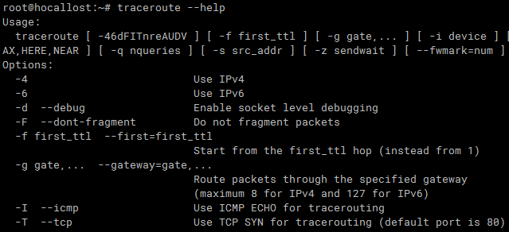

Traceroute — это инструмент в Linux, позволяющий исследовать маршруты сетевых пакетов. Это может помочь вам определить ограничивающий фактор перемещения сетевых пакетов. Traceroute также полезен для устранения проблем с медленными сетевыми подключениями. В этом руководстве показано, как запустить traceroute в Linux.

## О трассировке 

Traceroute отправляет пакеты данных на целевой компьютер, сервер или веб-сайт и записывает любые промежуточные шаги, через которые проходят пакеты. Результатом команды traceroute будут IP-адреса и доменные имена, через которые проходят пакеты. Эти записи также показывают, сколько времени требуется, чтобы пакеты достигли каждого пункта назначения. Это может объяснить, почему некоторые веб-сайты загружаются дольше, чем другие, поскольку количество переходов трафика может варьироваться.

Traceroute также полезен для отображения локальных сетей. Понимание топологии и подключений локальной сети можно найти при запуске инструмента.

Обратите внимание, что при использовании traceroute некоторые устройства могут плохо взаимодействовать. Это может быть связано с ошибками маршрутизаторов, ограничивающими скорость сообщениями ICMP интернет-провайдерами, устройствами, не настроенными для отправки пакетов ICMP (для предотвращения распределенных DoS-атак) и т.д. Некоторые сети также настроены на блокировку запросов трассировки.

## Установка traceroute 

Traceroute — мощный инструмент, доступный для всех дистрибутивов Linux. Ниже приводится краткий список команд для установки traceroute в различных дистрибутивах.

Для Debian/Ubuntu и производных:

$ sudo apt install traceroute -y

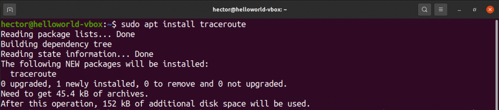

Для Fedora и производных:

$ sudo dnf install traceroute

Для openSUSE, SUSE Linux и производных:

$ sudo zypper in traceroute

Для Arch Linux и производных:

$ sudo pacman -S traceroute

## Использование traceroute 

В следующих разделах показано, как использовать traceroute в вашей системе Linux.

### Основное использование 

Основной метод использования traceroute довольно прост. Все, что требуется traceroute, — это пункт назначения для выполнения зондирования. Назначением может быть домен или IP-адрес.

$ traceroute example.com

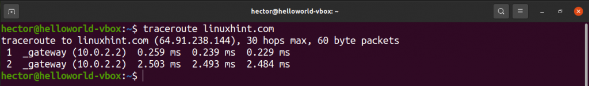

$ traceroute 8.8.8.8

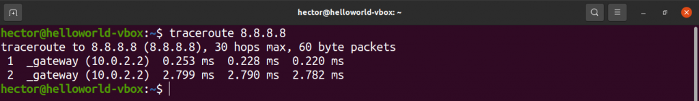

Если сеть настроена на блокировку сигнала traceroute, то этот зонд будет отмечен звездочками.

### IPv4 или IPv6 

По умолчанию traceroute будет использовать Интернет-протокол по умолчанию, на который настроена ваша система. Чтобы вручную установить версию IP, выполните описанную ниже процедуру.

Чтобы указать traceroute на использование IPv4, используйте флаг `-4`:

$ traceroute -4 example.com

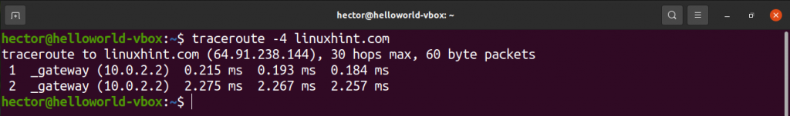

Чтобы указать traceroute использовать IPv6, используйте флаг `-6`:

$ traceroute -6 linuxhint.com

### Тестирование портов 

Если есть необходимость протестировать конкретный порт, его можно указать с помощью флага `-p`. Для отслеживания UDP traceroute будет начинаться с заданного значения и увеличиваться с каждым зондом. Для трассировки ICMP значение будет определять начальное значение последовательности ICMP. Для TCP и других это будет постоянный порт назначения для подключения.

$ traceroute -p <порт> 192.168.0.1

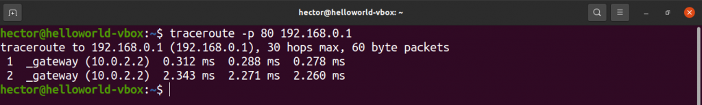

### Скрытие имен устройств 

В некоторых ситуациях имена устройств в выводе могут сделать вывод беспорядочным. Для большей наглядности вы можете скрыть имена устройств из вывода. Для этого используйте флаг `-n`:

$ traceroute -n example.com

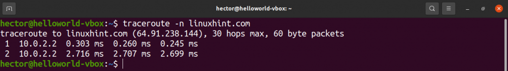

### Предел тайм-аута Traceroute 

По умолчанию traceroute ждет 5 секунд, чтобы получить ответ. В определенных ситуациях вы можете изменить время ожидания на больше или меньше 5 секунд. Для этого используйте флаг `-w`. Обратите внимание, что значение времени — это число с плавающей запятой.

$ traceroute -w 6.0 example.com

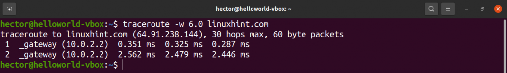

### Методы исследования 

Есть несколько методов, которые вы можете использовать для проверки удаленного адреса. Чтобы указать traceroute на использование эха ICMP, используйте флаг `-I`:

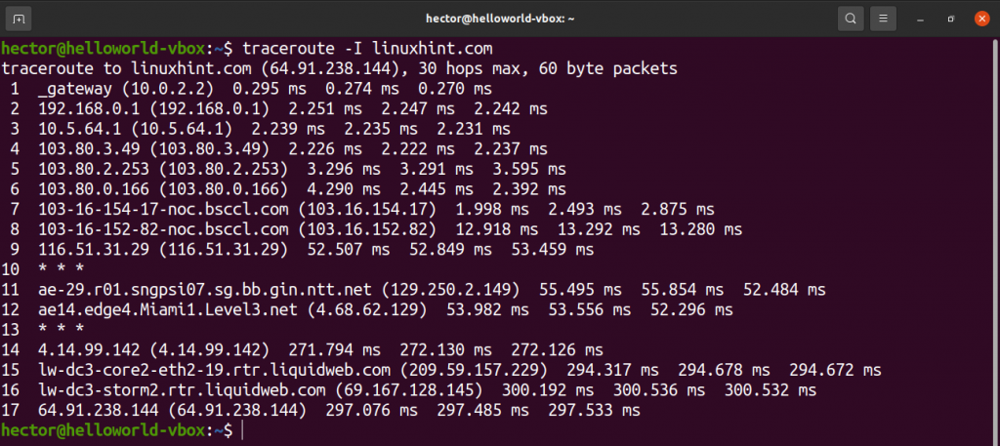

Чтобы использовать TCP SYN для зондирования, используйте флаг `-T`:

$ sudo traceroute -T example.com

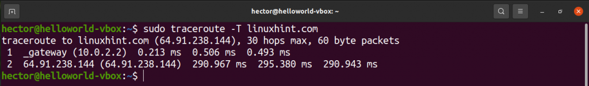

### Установка максимального количества прыжков 

По умолчанию traceroute отслеживает 30 переходов. Traceroute предлагает возможность вручную установить количество отслеживаемых переходов.

Используйте флаг `-m` для количества переходов:

$ traceroute -I -m 10 example.com

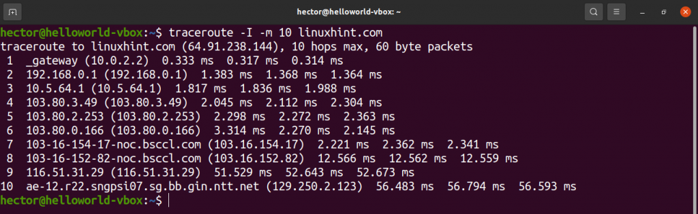

### Указание интерфейса 

Если к компьютеру подключено несколько сетевых интерфейсов, может оказаться полезным указать сетевой интерфейс, который будет использоваться для отправки пакетов. Чтобы указать сетевой интерфейс, используйте флаг `-i`:

$ sudo traceroute -i enp0s3 example.com

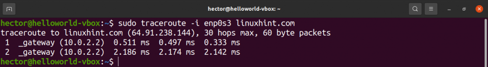

Определение количества запросов для прыжка

Чтобы определить количество запросов для перехода, укажите это число с помощью флага `-q`:

$ traceroute -I -q 4 example.com

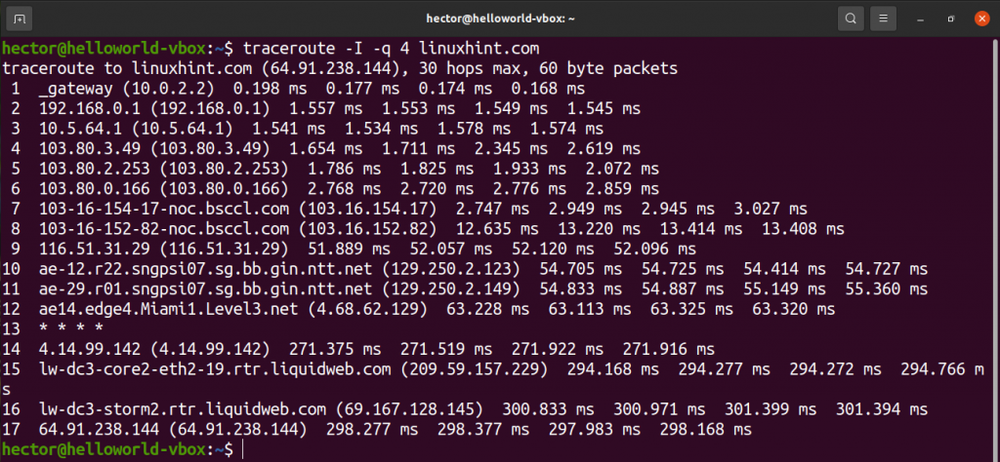

### Маршрутизация пакетов через шлюз 

Чтобы маршрутизировать пакеты через определенный шлюз, используйте опцию `-g`, за которой следует шлюз:

$ traceroute -I -g 192.168.0.1 example.com

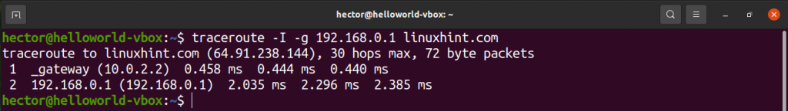

## Страница справки Traceroute 

Вышеупомянутые демонстрации — это лишь некоторые из распространенных способов использования traceroute, и вы можете использовать еще больше функций. Чтобы получить быструю помощь, откройте страницу справки traceroute с помощью следующей команды:

$ traceroute --help

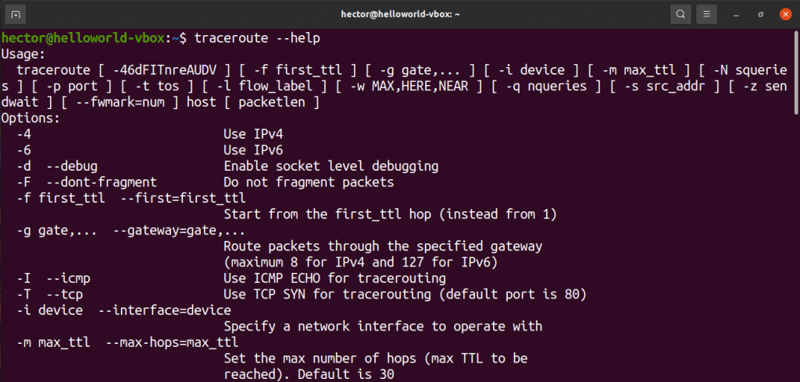

Чтобы получить более полное и подробное руководство по всем доступным параметрам traceroute, посетите страницу руководства с помощью следующей команды:

$ man traceroute

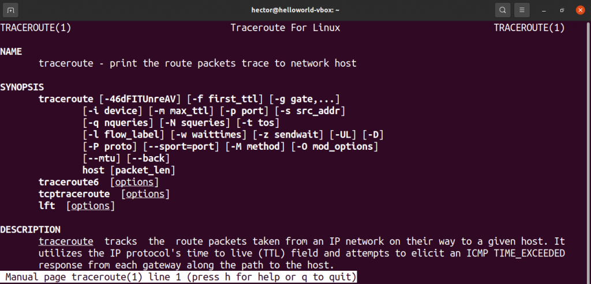

## Заключение 

Traceroute — это мощный инструмент, используемый для диагностики сети, и он поддерживает множество опций. Освоение traceroute может потребовать времени и практики. При использовании этого инструмента вы часто будете использовать методы, описанные в этой статье.
