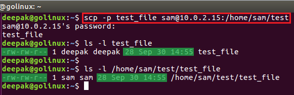

[источник](https://www.golinuxcloud.com/scp-command-in-linux/)

- [ Introduction to scp command](#link_1)
- [ How scp command works (syntax)](#link_2)
- [ Different examples to use scp command](#link_3)
  - [ 1. scp command to copy a file from local to remote host](#link_4)
  - [ 2. scp command to copy a file from remote to local host](#link_5)
  - [ 3. Transfer files between two remote hosts with scp command](#link_6)
  - [ 4. scp command to copy files and directories recursively](#link_7)
  - [ 5. Display verbose output for scp command](#link_8)
  - [ 6. Enable compression with scp command](#link_9)
  - [ 7. Limit the bandwidth in transfer with scp command](#link_10)
  - [ 8. scp command to preserve modification times, access times, and modes from original file](#link_11)
  - [ 9. Specify the port to connect using scp command](#link_12)
  - [ 10. Enable quiet mode with scp command](#link_13)
  - [ 11. Force scp to use IPv6 address only](#link_14)
  - [ 12. Force scp to use protocol version](#link_15)
  - [ 13. Prevent asking for passwords with scp command](#link_16)
  - [ 14. Use identity file to transfer with scp command](#link_17)
  - [ 15. Specify ssh configuration file with scp command](#link_18)
  - [ 16. scp command to select ciphers for encrypting the data transfer](#link_19)
  - [ 17. Pass additional options to ssh using scp command](#link_20)
- [ Conclusion](#link_21)

## Introduction to scp command <a name="link_1"></a>

scp is a command-line tool in Linux to copy files between hosts on a network. It allows you to copy files and directories without logging into the remote hosts. It uses **ssh** **connection and security** to transfer data securely over the network. Unlike rcp, scp will ask for passwords if needed for authentication.

## How scp command works (syntax) <a name="link_2"></a>

The scp connects to the ssh server and executes the command.  The scp exits `0` on success, and `>0` if an error occurs. The basic syntax of `scp` command is:

```
$ scp [option] {files|directories}  user1@destination_host1:directory1/filename1  [user2@destination_host2:directory2/filename2] ..
```

scp can be used to transfer files and directories securely from one Linux to another Linux server. You can also copy the same file and directory to more than one hosts.

Replace **[option]** with supported list of options which we will cover throughout this cheat sheet tutorial:

Replace **{files|directories}** with the file(s) or/and directory which you intend to copy to remote or source host

The destination to which the source file will be copied is defined by `user1@destination_host1:directory1/filename1`. You can add more than one hosts to copy files and directories to more than one destination host

- `user1` is the account of the destination Linux server using which SSH will be performed
- `destination_host1` is the hostname of the destination computer.
- `directory1` is the directory name under which the source file will be copied. If not dpecified then the file will be copied to the home directory of the user used to do SSH. For example, here user1's home directory would be used if destination is not specified.
- `filename1` is the name of source file which will be copied. Now ideally we don't specify filename in which case, the filename of the source would be used on destination. We specify the filename mostly when we want to copy the file as a different name on destination host.

If the source file already exists in the destination computer, **scp** will replace the contents of the destination file with the source file (keeping the inode). If the destination file does not exist yet, an empty file with destination filename is created and the contents of the source file are added to it.

## Different examples to use scp command <a name="link_3"></a>

As we have gone through the detail of scp, now let's see the practical [examples of `scp` command in Linux](https://www.golinuxcloud.com/linux-commands-cheat-sheet/ "100+ Linux commands cheat sheet & examples") hosts.

### 1. scp command to copy a file from local to remote host <a name="link_4"></a>

You can use the following command to copy a file from a local host to a remote host.

```
$ scp source_filename user@destination_host:/destination_folder
```

**Sample Output:**

```
deepak@golinux:~$ scp test_file root@10.0.2.15:/snap
root@10.0.2.15's password:
test_file 100% 28 0.0KB/s 00:00
```

### 2. scp command to copy a file from remote to local host <a name="link_5"></a>

To copy a file from a remote host to a local host, you can use the following command.

```
$ scp user@remote_host:/remote_directory/filename /local_directory
```

**Sample Output:**

```
deepak@golinux:~$ scp sam@10.0.2.15:test/test_file /home/deepak/Documents
sam@10.0.2.15's password:
test_file 100% 28 0.0KB/s 00:00

deepak@golinux:~$ ls Documents
test_file
```

### 3. Transfer files between two remote hosts with scp command <a name="link_6"></a>

You can copy a file from one remote host to another remote host using `-3` option with scp command. Without this option the data is copied directly between the two remote hosts.

```
$ scp -3 user1@source_host:directory1/filename1 user2@destination_host:directory/filename
```

In this example we will copy `/tmp/file1` from **server-1** to **server-2** using client host.

```
[root@server-1 ~]# touch /tmp/file1
[root@server-1 ~]# ls -l /tmp/file1
-rw-r--r-- 1 root root 0 Oct  3 18:25 /tmp/file1
```

Next we will connect to client host and copy `/tmp/file1` from **server-1** to **server-2**:

```
deepak@client:~$ scp -3 root@server-1:/tmp/file1 root@server-2:/tmp/
root@server-2's password: root@server-1's password:
Passw0rd
```

Verify the file on server-2:

```
[root@server-2 ~]# ls -l /tmp/file1
-rw-r--r-- 1 root root 0 Oct  3 18:29 /tmp/file1
```

The file is successfully copied, but as you can see that the scp command prompts for password of both the host at the same time wherein the password of one of the destination host is not visible on the console but while providing the password of second destination host, the password is visible in plain text format on the console.

So scp may not be the best to tool transfer files from one remote host to another remote host.

### 4. scp command to copy files and directories recursively <a name="link_7"></a>

`-r` option allows you to copy an entire directory recursively. All the files and sub-directories present in that directory will be copied.

```
$ scp -r source_dir_name user@destination_host:destination_folder
```

**Sample Output:**

```
deepak@golinux:~$ scp -r Folder sam@10.0.2.15:/home/sam
sam@10.0.2.15's password:
hello.c 100% 31 0.0KB/s 00:00
file.txt 100% 47 0.1KB/s 00:00
doc1 100% 86 0.1KB/s 00:00
```

```
deepak@golinux:~$ ls -l /home/sam/Folder
total 16
-rw-rw-r-- 1 sam sam 86 Sep 30 19:58 doc1
-rw-rw-r-- 1 sam sam 47 Sep 30 19:58 file.txt
drwxrwxr-x 2 sam sam 4096 Sep 30 19:57 folder2
-rw-rw-r-- 1 sam sam 31 Sep 30 19:58 hello.c
```

### 5. Display verbose output for scp command <a name="link_8"></a>

With the help of `-v` option, you can view the detailed information of scp process in the background. It prints the debug information which can help to debug connection, authentication, and configuration problems.

```
$ scp -v source_filename user@destination_host:destination_folder
```

**Sample Output:**

```
deepak@golinux:~$ scp -v test_file sam@10.0.2.15:/home/sam/test
Executing: program /usr/bin/ssh host 10.0.2.15, user sam, command scp -v -t /home/sam/test
OpenSSH_7.2p2 Ubuntu-4ubuntu2.10, OpenSSL 1.0.2g 1 Mar 2016
debug1: Reading configuration data /etc/ssh/ssh_config
debug1: /etc/ssh/ssh_config line 19: Applying options for *
debug1: Connecting to 10.0.2.15 [10.0.2.15] port 22.
debug1: Connection established.
.....
Sending file modes: C0664 28 test_file
Sink: C0664 28 test_file
test_file 100% 28 0.0KB/s 00:00
debug1: client_input_channel_req: channel 0 rtype exit-status reply 0
debug1: channel 0: free: client-session, nchannels 1
debug1: fd 0 clearing O_NONBLOCK
debug1: fd 1 clearing O_NONBLOCK
Transferred: sent 2744, received 2616 bytes, in 1.2 seconds
Bytes per second: sent 2376.9, received 2266.0
debug1: Exit status 0
```

### 6. Enable compression with scp command <a name="link_9"></a>

Use `-C` option to enable the compression while performing file transfer. It **does not** compress the file types like **.zip, .rar, .iso, .jpg, .png,** etc.

NOTE: File transfer may take longer when compression is enabled

```
$ scp -C source_filename user@destination_host:destination_folder
```

Here, I have a file of 35MB in size:

```
deepak@ubuntu:~$ ls -lSh /tmp/file1
-rw-rw-r-- 1 deepak deepak 35M Oct  3 18:39 /tmp/file1
```

First we attempt to transfer the file without any compression which took around 2 seconds:

```
deepak@ubuntu:~$ scp  /tmp/file1 root@server-2:/tmp/
root@server-2's password:
file1                                         100%   34MB  16.4MB/s   00:02
```

Next we enable compression and then perform transfer which took around 5 seconds:

```
deepak@ubuntu:~$ time scp -C /tmp/file1 root@server-2:/tmp/
root@server-2's password:
file1                                         100%   34MB   6.4MB/s   00:05
```

So, the file transfer took comparatively longer when compression is enabled with scp command.

### 7. Limit the bandwidth in transfer with scp command <a name="link_10"></a>

You can use `-l` option to limit the used bandwidth while copying. The bandwidth is specified in **Kbits/s**.

```
$ scp -l bandwidth_num source_filename user@destination_host:destination_folder
```

**Sample Output:**

```
deepak@golinux:~$ scp -l 5 iotop_0.6-1_i386.deb root@10.0.2.15:/var
root@10.0.2.15's password:
iotop_0.6-1_i386.deb 100% 23KB 2.1KB/s 00:11
```

### 8. scp command to preserve modification times, access times, and modes from original file <a name="link_11"></a>

If you want to keep modification times, access times, and modes same as the original file to the copy file, you can use `-p` option like below.

```
$ scp -p source_filename user@destination_host:destination_folder
```

**Sample Output:**



### 9. Specify the port to connect using scp command <a name="link_12"></a>

You can use `-P` option to specify the port to connect. The default port is 22 but if your SSH server is running on a different port then you can use -P <port> to specify an alternate port to perform the transfer.

```
$ scp -P port_num source_filename user@destination_host:destination_folder
```

For example, if SSH is using port `3022` on destination host then you can use scp with `-P 3022` to perform the transfer.

```
deepak@golinux:~$ scp -P 3022 test_file sam@10.0.2.15:/home/sam/test
```

### 10. Enable quiet mode with scp command <a name="link_13"></a>

Using `-q` option hides the progress meter while copying files. It also suppresses the warning and diagnostic messages from ssh.

```
$ scp -q source_filename user@destination_host:destination_folder
```

**Sample Output:**

```
deepak@golinux:~$ scp -q test_file sam@10.0.2.15:/home/sam/test
sam@10.0.2.15's password:
deepak@golinux:~$
```

### 11. Force scp to use IPv6 address only <a name="link_14"></a>

`-6` option forces the scp to use IPv6 address only. Other addresses are not supported with this command.

```
$ scp -6 source_filename user@destination_host:destination_folder
```

**Sample Output:**

```
deepak@golinux:~$ scp -6 test_file sam@10.0.2.15:/home/sam/test
```

Similarly, you can use `-4` to force scp to use IPv4 address only. By default Ipv4 address is used.

```
$ scp -4 source_filename user@destination_host:destination_folder
```

### 12. Force scp to use protocol version <a name="link_15"></a>

Use `-1` option to force scp to use protocol version 1.

```
$ scp -1 source_filename user@destination_host:destination_folder
```

**Sample Output:**

```
deepak@golinux:~$ scp -1 test_file root@10.0.2.15:/snap
```

`-2` option forces scp to use protocol version 2.

```
deepak@golinux:~$ scp -2 test_file root@10.0.2.15:/snap
root@10.0.2.15's password:
test_file 100% 28 0.0KB/s 00:00
```

### 13. Prevent asking for passwords with scp command <a name="link_16"></a>

To prevent scp asking for passwords, you can use `-B` option. You may not gain access to the server without authentication. This can be a preferred method when you have [setup passwordless SSH authentication](https://www.golinuxcloud.com/pssh-public-key-authentication-passwordless/ "Perform SSH public key authentication with PSSH (without password) in Linux").

```
$ scp -B source_filename user@destination_host:destination_folder
```

For Example, here I have setup passwordless authentication between server-1 and server-2 for deepak user. So I can use -B to perform the file transfer without any password prompt:

```
deepak@server-1:~$ scp -B  /tmp/file1 deepak@server-2:/tmp/
file1                                         100%   34MB  35.0MB/s   00:00
```

But if the provided user requires password to login to the remote host, in such case this command will fail as shown below:

```
deepak@server-1:~$ scp -B  /tmp/file1 deepak@server-2:/tmp/
deepak@server-2: Permission denied (publickey,gssapi-keyex,gssapi-with-mic,password).
lost connection
```

### 14. Use identity file to transfer with scp command <a name="link_17"></a>

An identity file contains a private key that can be used in SSH to have access to the server. You can create an identity file using `ssh-keygen` command. To select the identity file(**.pem**) for public-key authentication, you can use `-i` option.

```
$ scp -i identity_file source_filename user@destination_host:destination_folder
```

**Sample Output:**

```
deepak@golinux:~$ scp -i key.pem test_file sam@10.0.2.15:/home/sam/test
sam@10.0.2.15's password:
test_file 100% 28 0.0KB/s 00:00
```

### 15. Specify ssh configuration file with scp command <a name="link_18"></a>

`-F` option allows you to specify the ssh configuration file for ssh. This option is directly passed to ssh. I have already written a detailed article to learn more about [ssh_config file](https://www.golinuxcloud.com/ssh-config/). I hope you know `ssh_config` is different compared to `sshd_config` where the former is the client config file while latter is server config file.

```
$ scp -F ssh_config source_filename user@destination_host:destination_folder
```

For Example, I try to connect to server-2 here and the connection timed out because I have not configured my `/etc/hosts` to identify `server-2` host.

```
deepak@server-2:~$ scp -o ConnectTimeout=1 /tmp/file1 server-2:/tmp/
ssh: connect to host server1 port 22: Connection timed out
lost connection
```

Now, let me create a new `/tmp/ssh_config` file (I will not use the default one for this example) with following values:

```
$ cat /tmp/ssh_config
Host server-2
   HostName=192.168.0.165
   StrictHostKeyChecking=no
   User=root
   PasswordAuthentication=yes
   GSSAPIAuthentication=no
   ConnectTimeout=10
```

Here, I have defined the IP of server-2 and some other SSH options which must be used whenever I try to connect to server-2:

```
deepak@server-2:~$ scp -F /tmp/ssh_config /tmp/file1 server-2:/tmp/
root@192.168.0.165's password:
file1                                         100%   34MB  44.7MB/s   00:00
```

### 16. scp command to select ciphers for encrypting the data transfer <a name="link_19"></a>

`-c` option lets you select the ciphers for encrypting the data transfer.

```
$ scp -c cipher_name source_filename user@destination_host:destination_folder
```

**Sample Output:**

```
deepak@golinux:~$ scp -c blowfish-cbc test_file sam@10.0.2.15:/home/sam
sam@10.0.2.15's password:
test_file 100% 28 0.0KB/s 00:00
```

To view this list of ciphers, use the following command:

```
deepak@golinux:~$ ssh -Q cipher
3des-cbc
blowfish-cbc
cast128-cbc
arcfour
arcfour128
arcfour256
aes128-cbc
aes192-cbc
aes256-cbc
rijndael-cbc@lysator.liu.se
aes128-ctr
aes192-ctr
aes256-ctr
aes128-gcm@openssh.com
aes256-gcm@openssh.com
chacha20-poly1305@openssh.com
```

### 17. Pass additional options to ssh using scp command <a name="link_20"></a>

You can use `-o` option to pass options to ssh in the format used [ssh_config](https://linux.die.net/man/5/ssh_config). It is useful for specifying options for which scp does not have the separate command-line flag.

```
$ scp -o option=value source_filename user@destination_host:destination_folder
```

Following are some of the available options that can be used with above `-o` command.

```
AddKeysToAgent
AddressFamily
BatchMode
BindAddress
CanonicalDomains
CanonicalizeFallbackLocal
CanonicalizeHostname
CanonicalizeMaxDots
CanonicalizePermittedCNAMEs
CertificateFile
ChallengeResponseAuthentication
CheckHostIP
Ciphers
ClearAllForwardings

...

StrictHostKeyChecking
TCPKeepAlive
Tunnel
TunnelDevice
UpdateHostKeys
UsePrivilegedPort
User
UserKnownHostsFile
VerifyHostKeyDNS
VisualHostKey
XAuthLocation
```

Here, I have give a couple of examples to use `-o` with scp command. Enable `StrictHostKeyChecking` while performing the transfer:

```
deepak@server-1:~$ scp -o StrictHostKeyChecking=no /tmp/ssh_config /tmp/file1 server-2:/tmp/
ssh_config                                                              100%  158   194.3KB/s   00:00
file1                                                                   100%   34MB  38.7MB/s   00:00
```

Provide `ConnectTimeout` and disable `StrictHostKeyChecking` while performing the file transfer with scp command:

```
deepak@server-1:~$ scp -o ConnectTimeout=10  -o StrictHostKeyChecking=no /tmp/ssh_config /tmp/file1 server-2:/tmp/
ssh_config                                                              100%  158   125.6KB/s   00:00
file1                                                                   100%   34MB  40.2MB/s   00:00
```

Enable `PasswordAuthentication` while performing the file transfer:

```
deepak@server-1:~$ scp -o PasswordAuthentication=yes /tmp/ssh_config /tmp/file1 server-2:/tmp/
ssh_config                                                              100%  158    87.4KB/s   00:00
file1                                                                   100%   34MB  29.5MB/s   00:01
```

Enable `BatchMode` while performing the file transfer:

```
deepak@server-1:~$ scp -o BatchMode=yes /tmp/ssh_config /tmp/file1 server-2:/tmp/
ssh_config                                                              100%  158    17.4KB/s   00:00
file1                                                                   100%   34MB  36.8MB/s   00:00
```

## Conclusion <a name="link_21"></a>

In this article, you have learned about **scp** and its commands to copy files between hosts. It is a secure and useful remote file copy program. We hope you will be now able to copy files using `scp` command. If you have any confusion, please don't hesitate to ask in the comment section.
