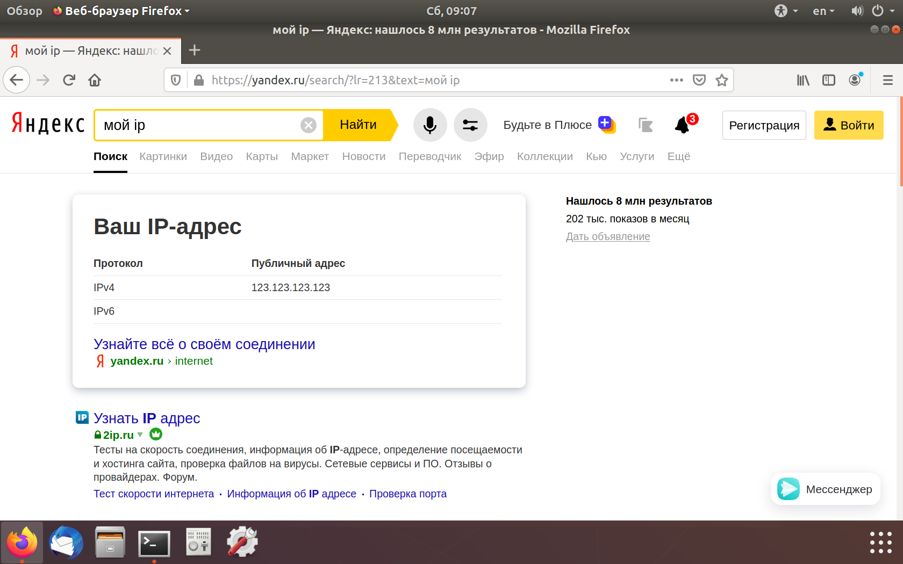

[источник](https://tokmakov.msk.ru/blog/item/492)

- [ Вход на сервер по ключу](#link_1)
- [ Настройка сервера](#link_2)
  - [ 1. Добавляем пользователя ssh-vpn](#link_3)
  - [ 2. Настройки OpenSSH сервера](#link_4)
  - [ 3. Создаем TUN устройство при загрузке](#link_5)
  - [ 4. Пересылка пакетов tun5→ens3](#link_6)
  - [ 5. Перезагружаем сервер](#link_7)
- [ Настройка клиента](#link_8)
  - [ 1. Создание пользователя ssh-vpn](#link_9)
  - [ 2. Создаем ключи и копируем на сервер](#link_10)
  - [ 3. Создаем TUN устройство при загрузке](#link_11)
  - [ 4. Создаем туннель при загрузке](#link_12)
  - [ 5. Заворачиваем трафик в туннель](#link_13)
  - [ 6. Перезагружаем клиента](#link_14)
- [ Теперь все готово](#link_15)

# VPN-канал с помощью OpenSSH. Часть вторая

Открывать `root`-доступ, даже при условии запрета удаленного входа по паролю, все равно плохо. В случае компрометации ключа, злоумышленник получит полный доступ к серверу. Поэтому нужно создать пользователя с ограниченными правами доступа и настроить для него аутентификацию по ключу. Таким образом, даже в случае компрометации ключа, контроль над сервером не будет утрачен.

Итак, есть сервер с белым ip-адресом `123.123.123.123` и клиент. На сервере и на клиенте установлена Ubuntu 18.04, на сервере установлен OpenSSH сервер. Нам надо построить туннель между клиентом и сервером, так что они будут в одной сети `192.168.200.0/30`. У сервера в этой сети будет ip-адрес `192.168.200.1`, а у клиента — `192.168.200.2`.


Настройку клиента и сервера выполним с нуля, поэтому надо удалить ключи доступа для `root`, которые создали в первой части. Войти удаленно от имени `root` будет никак нельзя — ни по паролю, ни по ключу. Вход на сервер будет только у пользователя `evgeniy` и только по ключу. Этот пользователь входит в группу `sudo`, так что при необходимости может получить права `root`.

## Вход на сервер по ключу <a name="link_1"></a>

Создаем ключи на клиенте для пользователя `evgeniy`:

```
$ cd ~/.ssh
$ ssh-keygen
```

Копируем публичный ключ на сервер:

```
$ ssh-copy-id -i id_rsa.pub evgeniy@123.123.123.123
```

Проверяем аутентификацию по ключу:

```
$ ssh evgeniy@123.123.123.123
Welcome to Ubuntu 18.04.4 LTS (GNU/Linux 4.15.0-91-generic x86_64)
```

И удалим TUN устройства, которые создали в первой части:

```
$ sudo ip tuntap del dev tun5 mode tun # на клиенте
$ sudo ip tuntap del dev tun5 mode tun # на сервере
```

Устройства пропадут сами, если просто перезагрузить клиент и сервер. Так что эту проблему нам тоже надо решить — как создавать виртуальные интерфейсы во время загрузки системы.

## Настройка сервера <a name="link_2"></a>

### 1. Добавляем пользователя ssh-vpn <a name="link_3"></a>

Создаем пользователя `ssh-vpn`:

```
# useradd -mU ssh-vpn
# mkdir /home/ssh-vpn/.ssh/ # директория для хранения ключей
# chown ssh-vpn:ssh-vpn /home/ssh-vpn/.ssh/
# chmod 700 /home/ssh-vpn/.ssh/
```

### 2. Настройки OpenSSH сервера <a name="link_4"></a>

Изменяем настройки ssh-сервера:

```
# nano /etc/ssh/sshd_config
```

```
# Разрешаем создание сетевых туннелей
PermitTunnel point-to-point
# Запрещаем аутентификацию для root
PermitRootLogin no
# Разрешаем аутентификацию по ключу
PubkeyAuthentication yes
# Запрещаем аутентификацию по паролю
PasswordAuthentication no
# Этим пользователям можно входить
AllowUsers evgeniy ssh-vpn
```

```
# systemctl restart ssh.service
```

### 3. Создаем TUN устройство при загрузке <a name="link_5"></a>

Теперь нужно добавить TUN устройство при загрузке системы, которое будет доступно для чтения и записи пользователю `ssh-vpn`. Для этого создаем файлы `*.netdev` и `*.network` (подробности см. [здесь](https://www.freedesktop.org/software/systemd/man/systemd.netdev.html) и [здесь](https://www.freedesktop.org/software/systemd/man/systemd.network.html)).

```
# nano /etc/systemd/network/50-ssh-vpn.netdev
```

```
[NetDev]
Name=tun5
Kind=tun
[Tun]
User=ssh-vpn
```

```
# nano /etc/systemd/network/50-ssh-vpn.network
```

```
[Match]
Name=tun5
[Address]
Address=192.168.200.1/30
Peer=192.168.200.2/30
[Network]
Address=192.168.200.1/30
```

С помощью этих двух файлов сервис `systemd-networkd` создаст TUN устройство, разрешит к нему доступ пользователю `ssh-vpn` и назначит ему ip-адрес `192.168.200.1/30`.

### 4. Пересылка пакетов tun5→ens3 <a name="link_6"></a>

Клиент будет направлять весь трафик в туннель, но что делать с этим трафиком — сервер пока не знает. Нужно включить пересылку пакетов между интерфейсами `tun5` и `ens3` и добавить `SNAT`, чтобы сервер подменял серый ip-адрес клиента на свой белый ip-адрес.

```
# nano /etc/sysctl.conf

net.ipv4.ip_forward=1

# iptables -t nat -A POSTROUTING -o ens3 -j MASQUERADE
```

Правило мы добавили, но оно пропадет при перезагрузке сервера. Так что его нужно сохранить и восстанавливать при перезагрузке. В этом нам поможет пакет `iptables-persistent`, который добавит новую службу `netfilter-persistent.service`:

```
# apt install iptables-persistent
```

При установке пакета будет предложено сохранить текущие правила `iptables`:

- в файл `/etc/iptables/rules.v4` для протокола IPv4
- в файл `/etc/iptables/rules.v6` для протокола IPv6

### 5. Перезагружаем сервер <a name="link_7"></a>

Перезагружаем сервер, чтобы создать TUN-устройство и назначить ему ip-адрес:

```
# reboot
```

Смотрим сетевые интерфейсы и маршруты:

```
$ ip addr
1: lo: <LOOPBACK,UP,LOWER_UP> mtu 65536 qdisc noqueue state UNKNOWN group default qlen 1000
    link/loopback 00:00:00:00:00:00 brd 00:00:00:00:00:00
    inet 127.0.0.1/8 scope host lo
       valid_lft forever preferred_lft forever
    inet6 ::1/128 scope host
       valid_lft forever preferred_lft forever
2: ens3: <BROADCAST,MULTICAST,UP,LOWER_UP> mtu 1500 qdisc fq_codel state UP group default qlen 1000
    link/ether 2a:d6:aa:bf:a4:0b brd ff:ff:ff:ff:ff:ff
    inet 123.123.123.123/24 brd 123.123.123.255 scope global dynamic ens3
       valid_lft 54942sec preferred_lft 54942sec
    inet6 fe80::28d6:aaff:febf:a40b/64 scope link
       valid_lft forever preferred_lft forever
3: tun5: <POINTOPOINT,MULTICAST,NOARP,UP,LOWER_UP> mtu 1500 qdisc fq_codel state UP group default qlen 500
    link/none
    inet 192.168.200.1 peer 192.168.200.2/30 scope global tun5
       valid_lft forever preferred_lft forever
    inet6 fe80::118b:8870:fd9c:238/64 scope link stable-privacy
       valid_lft forever preferred_lft forever
```

```
$ route -n
Destination     Gateway        Genmask           Flags   Metric   Ref   Use   Iface
-----------------------------------------------------------------------------------
0.0.0.0         123.123.123.1  0.0.0.0           UG      100      0     0     ens3
169.254.169.0   0.0.0.0        255.255.255.0     U       100      0     0     ens3
123.123.123.0   0.0.0.0        255.255.255.0     U       0        0     0     ens3
192.168.200.0   0.0.0.0        255.255.255.252   U       0        0     0     tun5
```

## Настройка клиента <a name="link_8"></a>

### 1. Создание пользователя ssh-vpn <a name="link_9"></a>

Создаем пользователя `ssh-vpn`:

```
# useradd -mU ssh-vpn
```

### 2. Создаем ключи и копируем на сервер <a name="link_10"></a>

Создаем публичный и приватный ключи:

```
# su ssh-vpn # дальше все команды выполянем от имени пользователя ssh-vpn
$ cd /home/ssh-vpn/
$ ssh-keygen
Generating public/private rsa key pair.
Enter file in which to save the key (/home/ssh-vpn/.ssh/id_rsa): Enter
Created directory '/home/ssh-vpn/.ssh/'.
Enter passphrase (empty for no passphrase): Enter
Enter same passphrase again: Enter
Your identification has been saved in /home/ssh-vpn/.ssh/id_rsa.
Your public key has been saved in /home/ssh-vpn/.ssh/id_rsa.pub.
$ exit # завершаем сеанс работы под пользователем ssh-vpn
```

Теперь нам надо с публичный ключ на сервер с помощью команды `scp`. Но у нас нет доступа для пользователя `evgeniy`:

- к директории `/home/ssh-vpn/.ssh/` на клиенте
- к директории `/home/ssh-vpn/.ssh/` на сервере

Изменяем права на директорию `/home/ssh-vpn/.ssh/` на клиенте:

```
# chmod 707 /home/ssh-vpn/.ssh/
```

Изменяем права на директорию `/home/ssh-vpn/.ssh/` на сервере:

```
# chmod 707 /home/ssh-vpn/.ssh/
```

Копируем от имени пользователя `evgeniy` публичный ключ на сервер:

```
$ scp /home/ssh-vpn/.ssh/id_rsa.pub evgeniy@123.123.123.123:/home/ssh-vpn/.ssh/authorized_keys
```

Возвращаем обратно права на директорию на клиенте:

```
# chmod 700 /home/ssh-vpn/.ssh/
```

Задаем владельца и права для файла `authorized_keys` на сервере:

```
# chown ssh-vpn:ssh-vpn /home/ssh-vpn/.ssh/authorized_keys
# chmod 600 /home/ssh-vpn/.ssh/authorized_keys
```

Возвращаем обратно права на директорию на сервере:

```
# chmod 700 /home/ssh-vpn/.ssh/
```

И надо обязательно выполнить вход по ssh на сервер от имени пользователя `ssh-vpn` с клиента, чтобы был создан файл `known_hosts`. Иначе потом, при автоматическом создании туннеля в момент загрузки клиента, получим сообщение об ошибке «Host key verification failed».

```
# su ssh-vpn # команду выполяняем от имени пользователя ssh-vpn
$ ssh -i ~/.ssh/id_rsa ssh-vpn@123.123.123.123
..........
Are you sure you want to continue connecting (yes/no)? yes
..........
$ exit # завершаем ssh-сеанс c сервером 123.123.123.123
$ exit # завершаем сеанс работы под пользователем ssh-vpn
```

### 3. Создаем TUN устройство при загрузке <a name="link_11"></a>

Теперь нужно добавить TUN устройство при загрузке системы, которое будет доступно для чтения и записи пользователю `ssh-vpn`. Для этого создаем файлы `*.netdev` и `*.network`:

```
# nano /etc/systemd/network/50-ssh-vpn.netdev
```

```
[NetDev]
Name=tun5
Kind=tun
[Tun]
User=ssh-vpn
```

```
# nano /etc/systemd/network/50-ssh-vpn.network
```

```
[Match]
Name=tun5
[Address]
Address=192.168.200.2/30
Peer=192.168.200.1/30
[Network]
Address=192.168.200.2/30
```

С помощью этих двух файлов сервис `systemd-networkd` создаст TUN устройство, разрешит к нему доступ пользователю `ssh-vpn` и назначит ему ip-адрес `192.168.200.2/30`.

Поскольку на клиенте у меня Ubuntu Desktop, пришлось отказаться от `NetworkManager` в пользу `systemd-networkd` и отредактировать файл `/etc/netplan/01-network-manager-all.yaml`:

```
# systemctl stop NetworkManager.service
# systemctl disable NetworkManager.service
# systemctl start systemd-networkd.service
# systemctl enable systemd-networkd.service
```

```
network:
  version: 2
  renderer: networkd
  ethernets:
    enp0s3:
      dhcp4: yes
```

Насколько мне удалось понять, `Netplan` пока не позволяет создавать `tun/tap` устройства. Во всяком случае, в документации об этом нет ни слова. А как добавить эти устройства при загрузке с помощью `NetworkManager` — пока не разобрался.

### 4. Создаем туннель при загрузке <a name="link_12"></a>

Для этого нам нужна служба, которая будет создавать туннель при загрузке системы. Кроме того, при обрыве связи эта служба будет пытаться снова установить соединение.

```
# nano /etc/systemd/system/ssh-vpn-tunnel-to-server.service
```

```
[Unit]
Description=SSH tunnel to 123.123.123.123 at startup
Requires=network-online.target
After=network-online.target
[Service]
User=ssh-vpn
ExecStartPre=/bin/sh -c 'until ping -c1 123.123.123.123; do sleep 1; done;'
ExecStart=/usr/bin/ssh -i /home/ssh-vpn/.ssh/id_rsa -N -w 5:5 ssh-vpn@123.123.123.123
Restart=always
RestartSec=3
[Install]
WantedBy=multi-user.target
```

Сообщим системе про новый unit-файл:

```
# systemctl daemon-reload
```

Добавляем новую службу в автозагрузку:

```
# systemctl enable ssh-vpn-tunnel-to-server.service
```

### 5. Заворачиваем трафик в туннель <a name="link_13"></a>

Чтобы перенаправить весь трафик клиента через туннель, нужно вместо старого шлюза — `192.168.110.1` (через интерфейс `enp0s3`) указать новый — `192.168.200.1` (через интерфейс `tun5`). Но при этом потеряется связь с сервером — поэтому перед заменой шлюза нужно добавить маршрут до сервера. Другими словами — нам нужно еще две две службы, которые при загрузке системы будут решать эти две задачи.

```
# nano /etc/systemd/system/ssh-vpn-route-to-server.service
```

```
[Unit]
Description=Route to server for SSH tunnel at startup
Requires=network-online.target ssh-vpn-tunnel-to-server.service
After=network-online.target ssh-vpn-tunnel-to-server.service
[Service]
ExecStartPre=/bin/sh -c 'until ping -c1 123.123.123.123; do sleep 1; done;'
ExecStart=/bin/ip route add 123.123.123.123 via 192.168.110.1 dev enp0s3
RemainAfterExit=yes
[Install]
WantedBy=multi-user.target
```

```
# nano /etc/systemd/system/ssh-vpn-new-default-route.service
```

```
Description=Replace default route for SSH tunnel at startup
Requires=network-online.target ssh-vpn-tunnel-to-server.service ssh-vpn-route-to-server.service
After=network-online.target ssh-vpn-tunnel-to-server.service ssh-vpn-route-to-server.service
[Service]
ExecStartPre=/bin/sh -c 'until ping -c1 192.168.200.1; do sleep 1; done;'
ExecStart=/bin/ip route replace default via 192.168.200.1 dev tun5
RemainAfterExit=yes
[Install]
WantedBy=multi-user.target
```

Сообщим системе про два новых unit-файла:

```
# systemctl daemon-reload
```

Добавляем новые службы в автозагрузку:

```
# systemctl enable ssh-vpn-route-to-server.service
# systemctl enable ssh-vpn-new-default-route.service
```

### 6. Перезагружаем клиента <a name="link_14"></a>

Перезагружаем клиента, чтобы добавить TUN-устройство, создать SSH-туннель и завернуть трафик клиента в туннель:

```
# reboot
```

После этого смотрим сетевые интерфейсы и маршруты:

```
$ ip addr
1: lo: <LOOPBACK,UP,LOWER_UP> mtu 65536 qdisc noqueue state UNKNOWN group default qlen 1000
    link/loopback 00:00:00:00:00:00 brd 00:00:00:00:00:00
    inet 127.0.0.1/8 scope host lo
       valid_lft forever preferred_lft forever
    inet6 ::1/128 scope host
       valid_lft forever preferred_lft forever
2: enp0s3: <BROADCAST,MULTICAST,UP,LOWER_UP> mtu 1500 qdisc fq_codel state UP group default qlen 1000
    link/ether 08:00:27:b8:4d:a6 brd ff:ff:ff:ff:ff:ff
    inet 192.168.110.18/24 brd 192.168.110.255 scope global enp0s3
       valid_lft forever preferred_lft forever
    inet6 fe80::a00:27ff:feb8:4da6/64 scope link
       valid_lft forever preferred_lft forever
3: tun5: <POINTOPOINT,MULTICAST,NOARP,UP,LOWER_UP> mtu 1500 qdisc fq_codel state UP group default qlen 500
    link/none
    inet 192.168.200.2 peer 192.168.200.1/30 scope global tun5
       valid_lft forever preferred_lft forever
    inet6 fe80::59ef:c348:d011:65d4/64 scope link stable-privacy
       valid_lft forever preferred_lft forever
```

```
$ route -n
Destination       Gateway         Genmask           Flags   Metric   Ref   Use   Iface
---------------------------------------------------------------------------------------
0.0.0.0           192.168.200.1   0.0.0.0           UG      0        0     0     tun5
0.0.0.0           192.168.110.1   0.0.0.0           UG      100      0     0     enp0s3
123.123.123.123   192.168.110.1   255.255.255.255   UGH     0        0     0     enp0s3
192.168.110.0     0.0.0.0         255.255.255.0     U       0        0     0     enp0s3
192.168.110.1     0.0.0.0         255.255.255.255   UH      100      0     0     enp0s3
192.168.200.0     0.0.0.0         255.255.255.252   U       0        0     0     tun5
```

Красным выделены маршруты, которые мы добавили. А зеленым — маршрут, который был добавлен при создании TUN-устройства.

## Теперь все готово <a name="link_15"></a>

Теперь все готово, так что открываем на клиенте браузер и смотрим свой ip-адрес:


