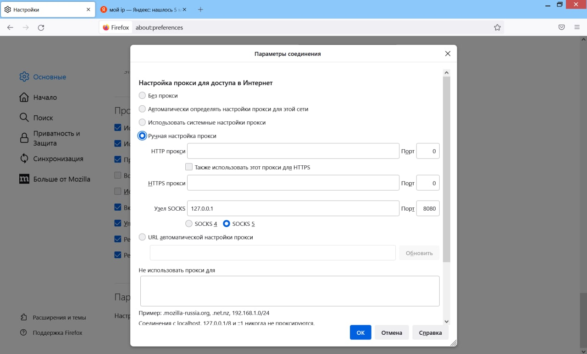

[источник](https://tokmakov.msk.ru/blog/item/702)

# SSH как SOCKS сервер

Допустим, нам нужен доступ к сайту, который заблокирован на территории России. Тогда нам потребуется ssh-сервер с белым ip-адресом где-то за границей. Можно настроить VPN-сервер, чтобы выходить в интернет через него. Но можно обойтись без установки дополнительного программного обеспечения, а использовать возможности ssh-сервера. Вот цитата из документации по команде ssh:

```
-D [bind_address:]port Dynamic application-level port forwarding. This allocates a socket to listen to port
on the local side. When a connection is made to this port, the connection is forwarded over the secure channel,
and the application protocol is then used to determine where to connect to from the remote machine.
```

При использовании ключа `-D` осуществляется динамическая переадресация портов на уровне приложения. На локальном устройстве (где работает ssh-клиент) выделяется/создается сокет для прослушивания определенного порта. Когда с этим портом устанавливается соединение, оно перенаправляется по безопасному каналу на удаленное устройство (на котором работает ssh-сервер). А затем уже там, на удаленном компьютере, для определения того, куда именно должно быть осуществлено соединение, используется прикладной протокол.

```
$ ssh -D 8080 -o 'GatewayPorts yes' evgeniy@123.123.123.123
```

```
DynamicForward
         Specifies that a TCP port on the local machine be forwarded over the secure channel, and the application protocol
         is then used to determine where to connect to from the remote machine.

         The argument must be [bind_address:]port.  IPv6 addresses can be specified by enclosing addresses in square
         brackets.  By default, the local port is bound in accordance with the GatewayPorts setting.  However, an explicit
         bind_address may be used to bind the connection to a specific address.  The bind_address of “localhost” indicates
         that the listening port be bound for local use only, while an empty address or ‘*’ indicates that the port should
         be available from all interfaces.

         Currently the SOCKS4 and SOCKS5 protocols are supported, and ssh(1) will act as a SOCKS server.  Multiple for‐
         wardings may be specified, and additional forwardings can be given on the command line.  Only the superuser can
         forward privileged ports.

 GatewayPorts
         Specifies whether remote hosts are allowed to connect to local forwarded ports.  By default, ssh(1) binds local
         port forwardings to the loopback address.  This prevents other remote hosts from connecting to forwarded ports.
         GatewayPorts can be used to specify that ssh should bind local port forwardings to the wildcard address, thus
         allowing remote hosts to connect to forwarded ports.  The argument must be “yes” or “no”.  The default is “no”.

[link](https://serverfault.com/questions/480208/strange-output-on-ssh-tunneling-output-failed-connect-failed-connection-timed)
GatewayPorts is not the problem. Gateway ports lets the ssh server listen to non-local ports. GatewayPorts becomes very useful when doing a reverse tunnel - allowing hosts from the private network to connect back to your ssh client host. Gordolio has it right above: the SOCKS server started by the local ssh is complaining when it can't reach host/port requested by SOCKS client users (as in Gordolio's example, Firefox ).
```

Если ssh-сервер работает на порту, отличном от 22-го, его тоже нужно указать:

```
$ ssh -p 2222 -D 8080 evgeniy@123.123.123.123
```

Иногда бывает так, что почти все порты закрыты. Но, как правило, открыт 443-ий порт — так что можно настроить ssh-сервер на этот порт. Мало того, можно настроить работу ssh-сервера на двух портах — для этого редактируем файл конфигурации `/etc/ssh/sshd_config`.

```
$ sudo nano /etc/ssh/sshd_config
```

```
Port 22
Port 443

```

```
$ sudo systemctl restart ssh
```

Теперь команда будет выглядеть так:

```
$ ssh -p 443 -D 8080 evgeniy@123.123.123.123
```

Для удобства можно создать файл конфигурации клиента `~/.ssh/config`:

```
Host ssh-proxy
    Hostname 123.123.123.123
    User evgeniy
    Compression yes
    DynamicForward 127.0.0.1:8080
    Port 443
```

```
$ ssh ssh-proxy
```

Хорошо, с этим разобрались, теперь настроим браузер Firefox — Настройки → Основные → Параметры сети:



Ниже есть дополнительная настройка, которая позволяет отправлять DNS-запросы тоже через наш ssh-сервер. Также там есть настройка, чтобы отправлять DNS-запросы через HTTPS, чтобы скрыть от посторонних глаз, какие сайты планируется посетить. И можно указать подходящий DNS-сервер, который поддерживает такую возможность, или оставить DNS-сервер по умолчанию — это Cloudflare.

При вводе веб-адреса или доменного имени в адресную строку, браузер отправляет запрос через интернет для поиска ip-адреса этого сайта. Традиционно этот запрос отправляется на серверы посредством простого текстового соединения. Это соединение не шифруется, позволяя посторонним видеть, какой веб-сайт будет посещен. DNS через HTTPS (DoH) работает иначе. Он отправляет доменное имя на DNS-сервер, совместимый с DoH, с помощью зашифрованного HTTPS-соединения вместо простого текста. Это предотвращает доступ посторонних к информации о том, какие веб-сайты планируется посетить.

Теперь проверим, что все работает — заходим на Яндекс и вводим запрос «мой ip адрес»:


Кроме того, мы можем изменить команду, чтобы прослушивать все интерфейсы (а не только `localhost`), включая `ethernet` или `wifi` — это позволит другим компьютерам в нашей локальной сети просматривать сайты через ssh-сервер. Теперь в настройках Firefox на других компах сети нужно указать ip-адрес нашего компа, например `192.168.100.2`.

```
$ ssh -p 443 -D 0.0.0.0:8080 evgeniy@123.123.123.123
```

Не только браузер, но и многие другие приложения могут использовать socks-прокси. У некоторых приложений есть параметры конфигурации для активации прокси-сервера. Другим нужно немного помочь вспомогательной программой — например, [proxychains](https://github.com/haad/proxychains) позволяет запустить через прокси Microsoft RDP и другие.

#### Дополнительно

- [SSH Tunneling and Proxying](https://www.baeldung.com/linux/ssh-tunneling-and-proxying)
- [Практические советы, примеры и туннели SSH](https://habr.com/ru/articles/435546/)
- [SSH-туннели: практические примеры](https://timeweb.cloud/tutorials/network-security/ssh-tunnels)
