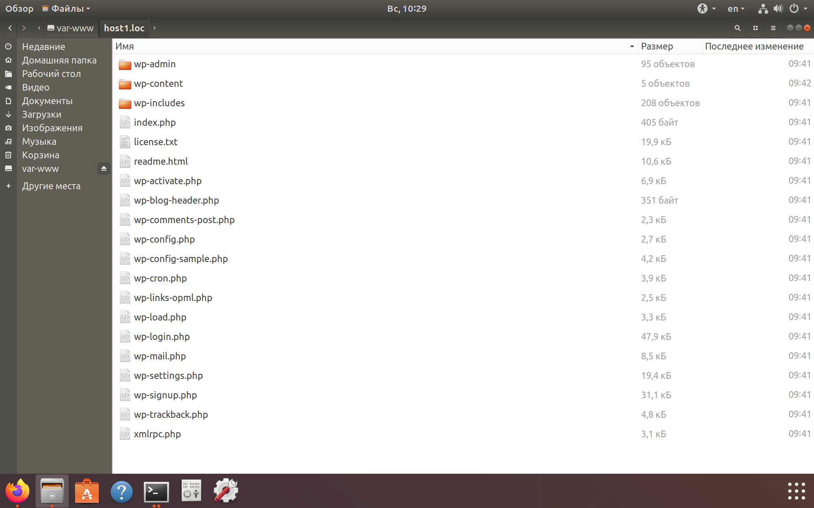
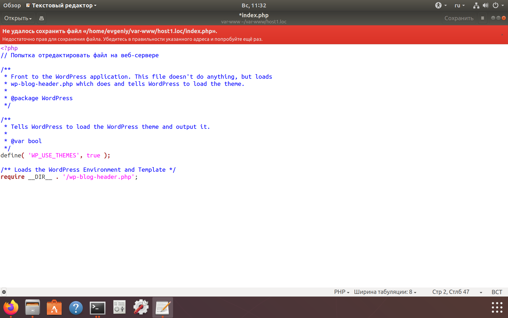
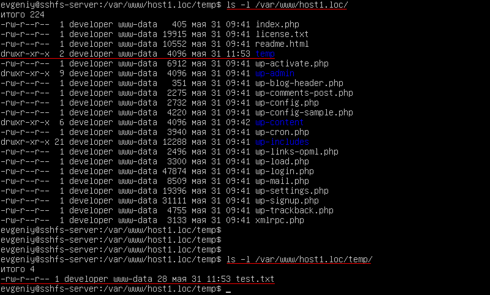

[источник](https://tokmakov.msk.ru/blog/item/513)

- [ Монтирование](#link_1)
- [ Права доступа](#link_2)
- [ Два скрипта](#link_3)
- [ Полезные опции](#link_4)
- [ Опция idmap](#link_5)
- [ Монтирование удаленной директории с помощью sshfs. Часть 2 из 2](#link_6)
- [ Опция allow_other](#link_7)
- [ Аутентификация по ключу](#link_8)
- [ Монтирование при загрузке](#link_9)
  - [ 1. Редактируем файл /etc/fstab](#link_10)
  - [ 2. Создаем новый unit-файл](#link_11)
    - [ 2.1. Создаем service-файл](#link_12)
    - [ 2.2. Создаем mount-файл](#link_13)
    - [ Дополнительно](#link_14)

# Монтирование удаленной директории с помощью sshfs. Часть 1 из 2

SSHFS (Secure Shell FileSystem) — это клиент, который позволяет монтировать удаленную файловую систему и работать с файлами этой системы на локальной машине с использованием протокола SFTP. SFTP (SSH File Transfer Protocol) — это безопасный протокол передачи файлов, который обеспечивает доступ, передачу и управление файлами через протокол Secure Shell. SSHFS поставляется со встроенным модулем ядра FUSE (файловая система в пространстве пользователей), который позволяет любым непривилегированным пользователям создавать свою файловую систему без изменения кода ядра.

Итак, у нас есть веб-сервер `123.123.123.123`, все файлы сайтов расположены в директории `/var/www/`. На сервере установлен пакет `openssh-server` и есть пользователь `evgeniy`. На клиенте тоже есть пользователь `evgeniy` и мы хотим смонтировать удаленную директорию `/var/www/`.

Прежде всего проверьте, что в файле конфигурации OpenSSH-сервера есть строка, которая начинается на «Subsystem sftp», подробнее [здесь](https://tokmakov.msk.ru/blog/item/484).

```
#Subsystem  sftp  /usr/lib/ssh/sftp-server
Subsystem  sftp  internal-sftp
```

## Монтирование <a name="link_1"></a>

Сначала установим пакет `sshfs`:

```
$ sudo apt install sshfs
```

Создадим каталог для монтирования удаленной файловой системы:

```
$ mkdir /home/evgeniy/var-www
```

Смонтируем в этот каталог директорию `/var/www` веб-сервера:

$ sshfs evgeniy@123.123.123.123:/var/www/ /home/evgeniy/var-www/
evgeniy@123.123.123.123's password: пароль

Теперь посмотрим содержимое каталога `/home/evgeniy/var-www/host1.loc`:



Когда на клиенте мы выполняем команду `sshfs`, для сервера это означает, что к нему подключился по ssh пользователь `evgeniy`. И этот пользователь может делать на сервере те операции, на которые у него есть права — в том числе, и работать с файлами.

## Права доступа <a name="link_2"></a>

При работе с файлами сервера в директории `/var/www/`, будут учитываться права удаленного пользователя `evgeniy`. Если у этого пользователя нет прав на чтение-запись файлов в директории `/var/www/`, то и на локальной машине их нельзя просматривать и сохранять. Давайте подключимся по ssh к серверу `123.123.123.123` и посмотрим права на файлы в директории `/var/www/host1.loc/`:

```
$ ls -l /var/www/host1.loc/
итого 220
-rw-r--r--  1 developer www-data   405 мая 31 09:41 index.php
-rw-r--r--  1 developer www-data 19915 мая 31 09:41 license.txt
-rw-r--r--  1 developer www-data 10552 мая 31 09:41 readme.html
-rw-r--r--  1 developer www-data  6912 мая 31 09:41 wp-activate.php
drwxr-xr-x  9 developer www-data  4096 мая 31 09:41 wp-admin
-rw-r--r--  1 developer www-data   351 мая 31 09:41 wp-blog-header.php
-rw-r--r--  1 developer www-data  2275 мая 31 09:41 wp-comments-post.php
-rw-r--r--  1 developer www-data  2732 мая 31 09:41 wp-config.php
-rw-r--r--  1 developer www-data  4220 мая 31 09:41 wp-config-sample.php
drwxr-xr-x  6 developer www-data  4096 мая 31 09:42 wp-content
-rw-r--r--  1 developer www-data  3940 мая 31 09:41 wp-cron.php
drwxr-xr-x 21 developer www-data 12288 мая 31 09:41 wp-includes
-rw-r--r--  1 developer www-data  2496 мая 31 09:41 wp-links-opml.php
-rw-r--r--  1 developer www-data  3300 мая 31 09:41 wp-load.php
-rw-r--r--  1 developer www-data 47874 мая 31 09:41 wp-login.php
-rw-r--r--  1 developer www-data  8509 мая 31 09:41 wp-mail.php
-rw-r--r--  1 developer www-data 19396 мая 31 09:41 wp-settings.php
-rw-r--r--  1 developer www-data 31111 мая 31 09:41 wp-signup.php
-rw-r--r--  1 developer www-data  4755 мая 31 09:41 wp-trackback.php
-rw-r--r--  1 developer www-data  3133 мая 31 09:41 xmlrpc.php
```

Только пользователь `developer` имеет право на запись файлов, все остальные могут только читать. Поэтому, если мы на клиенте попробуем записать что-то в файл `index.php`, то получим отказ:



Так что давайте размонтируем удаленную файловую систему и смонтируем еще раз:

```
$ fusermount -u /home/evgeniy/var-www/ # размонтируем удаленную файловую систему
$ sshfs developer@123.123.123.123:/var/www/ /home/evgeniy/var-www/ # монтируем снова
```

Теперь мы можем как создавать новые директории и файлы, так и изменять существующие. Создадим на клиенте директорию `/home/evgeniy/var-www/host1.loc/temp/`, а внутри этой директории — файл `test.txt`. И посмотрим на веб-сервере права на эту директорию и на этот файл:



Теперь все правильно — на клиенте мы работаем с файлами сервера под локальным пользователем `evgeniy`, а все изменения на сервере сохраняются от имени удаленного пользователя `developer`. Что за пользователь `developer` и зачем он нужен, можно прочитать [здесь](https://tokmakov.msk.ru/blog/item/439).

## Два скрипта <a name="link_3"></a>

Чтобы облегчить себе жизнь, создадим два маленьких bash-скрипта, которые позволят быстро смонтировать и размонтировать удаленную файловую систему:

```
$ nano /home/evgeniy/mount-sshfs.sh
```

```
#!/bin/bash
# монтируем удаленную файловую систему
echo 'qwerty' | sshfs -o password_stdin developer@123.123.123.123:/var/www/ /home/evgeniy/var-www/
```

```
$ chmod +x /home/evgeniy/mount-sshfs.sh
```

```
$ nano /home/evgeniy/umount-sshfs.sh
```

```bash
#!/bin/bash
# размонтируем удаленную файловую систему
fusermount -u /home/evgeniy/var-www/
```

```
$ chmod +x /home/evgeniy/umount-sshfs.sh
```

Мы используем опцию `password_stdin`, которая позволяет получить пароль пользователя `developer` из входного потока. Кроме того, вместе с опцией `password_stdin` мы могли бы использовать утилиту `sshpass` — но ее нужно предварительно установить:

```
$ sudo apt install sshpass
$ sshpass -p 'qwerty' sshfs -o password_stdin developer@123.123.123.123:/var/www/ /home/evgeniy/var-www/
```

## Полезные опции <a name="link_4"></a>

**Опция** `reconnect` позволяет автоматически восстанавливать соединие в случае разрыва:

```
$ sshfs -o reconnect developer@123.123.123.123:/var/www/ /home/evgeniy/var-www/
```

**Опция** `password_stdin` позволяет получать пароль пользователя из входного потока `stdin`:

```
$ echo 'qwerty' | sshfs -o password_stdin developer@123.123.123.123:/var/www/ /home/evgeniy/var-www/
```

**Опция** `delay_connect` — не монтировать удаленную директорию немедленно, а ждать момента первого обращения к файлам:

```
$ sshfs -o delay_connect developer@123.123.123.123:/var/www/ /home/evgeniy/var-www/
```

## Опция idmap <a name="link_5"></a>

**Опция** `idmap` по умолчанию имеет значение `none`. Если установить эту опцию в значение `user`, то `sshfs` будет транслировать идентификаторы локального и удаленного пользователя. Звучит сложно, так что давайте разберем на примере:

- на сервере есть пользователь `evgeniy`, `UID` равен `1000`
- на сервере есть пользователь `developer`, `UID` равен `1001`
- на клиенте есть пользователь `evgeniy`, `UID` равен `1000`
- на клиенте есть пользователь `backups`, `UID` равен `1001`

Посмотрим владельца файлов на сервере в директории `/var/www/`:

```
$ ls -l /var/www/ # показывается имя владельца
итого 12
drwxr-xr-x 6 developer www-data 4096 мая 31 14:45 host1.loc
drwxr-xr-x 2 developer www-data 4096 мая 31 09:07 host2.loc
drwxr-xr-x 2 developer www-data 4096 мая 31 08:55 html
```

```
$ ls -n /var/www/ # показывается UID владельца
итого 12
итого 12
drwxr-xr-x 6 1001 33 4096 мая 31 14:45 host1.loc
drwxr-xr-x 2 1001 33 4096 мая 31 09:07 host2.loc
drwxr-xr-x 2 1001 33 4096 мая 31 08:55 html
```

Смонтируем удаленную файловую систему без опции `idmap` и посмотрим список файлов в директории `/home/evgeniy/var-www/`:

```
$ sshfs developer@192.168.110.30:/var/www/ /home/evgeniy/var-www/
```

```
$ ls -l /home/evgeniy/var-www/ # показывается имя владельца
итого 12
drwxr-xr-x 1 backups www-data 4096 мая 31 14:45 host1.loc
drwxr-xr-x 1 backups www-data 4096 мая 31 09:07 host2.loc
drwxr-xr-x 1 backups www-data 4096 мая 31 08:55 html
```

```
$ ls -n /home/evgeniy/var-www/ # показывается UID владельца
итого 12
drwxr-xr-x 1 1001 33 4096 мая 31 14:45 host1.loc
drwxr-xr-x 1 1001 33 4096 мая 31 09:07 host2.loc
drwxr-xr-x 1 1001 33 4096 мая 31 08:55 html
```

Смонтируем удаленную файловую систему с опцией `idmap` и посмотрим список файлов в директории `/home/evgeniy/var-www/`:

```
$ sshfs -o idmap=user developer@192.168.110.30:/var/www/ /home/evgeniy/var-www/
```

```
$ ls -l /home/evgeniy/var-www/ # показывается имя владельца
итого 12
drwxr-xr-x 1 evgeniy www-data 4096 мая 31 14:45 host1.loc
drwxr-xr-x 1 evgeniy www-data 4096 мая 31 09:07 host2.loc
drwxr-xr-x 1 evgeniy www-data 4096 мая 31 08:55 html
```

```
$ ls -n /home/evgeniy/var-www/ # показывается UID владельца
итого 12
drwxr-xr-x 1 1000 33 4096 мая 31 14:45 host1.loc
drwxr-xr-x 1 1000 33 4096 мая 31 09:07 host2.loc
drwxr-xr-x 1 1000 33 4096 мая 31 08:55 html
```

Как видите, все просто. При использовании опции `idmap=user` — все файлы, которые принадлежат на сервере пользователю `developer`, на клиенте принадлежат локальному пользователю `evgeniy`. Утилита `sshfs` в процессе работы подменяет `UID` удаленного пользователя `developer`, который равен `1001` на `UID` локального пользователя `evgeniy`, который равен `1000`. Если опция не используется, на локальной машине мы видим `UID` пользователя `backups`, потому что он совпадает с `UID` удаленного пользователя `developer`.

Эту опцию лучше использовать всегда. Либо, создать локального пользователя с таким же именем, как на сервере. И монтировать удаленную файловую систему от имени локального пользователя `developer`, передавая `sshfs` имя и пароль удаленного пользователя `developer`. Это не обязательно, но так проще не запутаться — почему файлы принадлежат пользователю `backups` и какое отношение он имеет к файлам веб-сервера? А никакого не имеет — просто `UID` совпали.

## Монтирование удаленной директории с помощью sshfs. Часть 2 из 2 <a name="link_6"></a>

## Опция allow_other <a name="link_7"></a>

Сейчас доступ к директории `/home/evgeniy/var-www/` имеет только пользователь `evgeniy`. Чтобы разрешить другим пользователям работать с файлами в этой директории, нужно использовать опцию `allow_other`:

```
$ sshfs -o allow_other developer@123.123.123.123:/var/www/ /home/evgeniy/var-www/
fusermount: option allow_other only allowed if 'user_allow_other' is set in /etc/fuse.conf
```

По умолчанию это может делать только пользователь `root`. Чтобы разрешить другим пользователям применять эту опцию, редактируем файл `/etc/fuse.conf`:

```
$ sudo nano /etc/fuse.conf
```

```
# Set the maximum number of FUSE mounts allowed to non-root users (default is 1000).
#mount_max = 1000

# Allow non-root users to specify the allow_other or allow_root mount options.
user_allow_other
```

Теперь можем смонтировать уделенную директорию, чтобы с файлами могли работать и другие пользователи:

```
$ sshfs -o allow_other developer@123.123.123.123:/var/www/ /home/evgeniy/var-www/
```

## Аутентификация по ключу <a name="link_8"></a>

Давайте создадим пару ключей на клиенте и скопируем публичный ключ на сервер:

```
$ ssh-keygen
Generating public/private rsa key pair.
Enter file in which to save the key (/home/evgeniy/.ssh/id_rsa):
Enter passphrase (empty for no passphrase):
Enter same passphrase again:
Your identification has been saved in /home/evgeniy/.ssh/id_rsa.
Your public key has been saved in /home/evgeniy/.ssh/id_rsa.pub.
The key fingerprint is:
SHA256:aR5/t1LFc40pkZD6WjGgog4om4gbiWbDjP5HTH1+cb8 evgeniy@sshfs-client
The key's randomart image is:
+---[RSA 2048]----+
|          .o .   |
|        . . o    |
|      .. o   . +.|
|    .....oo...o.=|
|.  .o.  S. oo...o|
|O..  o o +o.  .. |
|O@  .   .oo ... .|
|O.o  .  .  ... E |
|.o...        ..  |
+----[SHA256]-----+
```

```
$ ssh-copy-id -i ~/.ssh/id_rsa.pub developer@123.123.123.123
/usr/bin/ssh-copy-id: INFO: Source of key(s) to be installed: "/home/evgeniy/.ssh/id_rsa.pub"
/usr/bin/ssh-copy-id: INFO: attempting to log in with the new key(s), to filter out any that are already installed
/usr/bin/ssh-copy-id: INFO: 1 key(s) remain to be installed -- if you are prompted now it is to install the new keys
developer@123.123.123.123's password: пароль
Number of key(s) added: 1
Now try logging into the machine, with: "ssh developer@123.123.123.123"
and check to make sure that only the key(s) you wanted were added.
```

Проверяем, что теперь можем подключаться к серверу без ввода пароля:

```
$ ssh developer@123.123.123.123
Welcome to Ubuntu 18.04.4 LTS (GNU/Linux 4.15.0-106-generic x86_64)
..........
$ exit
```

И монтируем удаленную директорию уже без ввода пароля:

```
$ sshfs -o idmap=user,allow_other,reconnect developer@123.123.123.123:/var/www/ /home/evgeniy/var-www/
```

## Монтирование при загрузке <a name="link_9"></a>

Если есть необходимость автоматически монтировать удаленную директорию при загрузке системы, то есть два пути. Первый — отредактировать файл `/etc/fstab` и добавить новую запись о монтировании. Второй — создать новый unit-файл для системы инициализации `systemd`.

### 1. Редактируем файл /etc/fstab <a name="link_10"></a>

Монтирование удаленной директории выглядит примерно так:

```
$ sudo nano /etc/fstab
```

```
developer@123.123.123.123:/var/www/  /home/evgeniy/var-www/  fuse.sshfs  allow_other,reconnect,uid=1000  0  0
```

Но, чтобы это заработало, должна быть настроена аутентификация по ключу на сервере. Мы это уже сделали, но монтирование файловых систем происходит от имени пользователя `root`. И файл ключа операционная система будет искать в директории `/root/.ssh/`. А наш ключ рсположен в домашней директории пользователя `evgeniy`. Поэтому нужно явно указать путь:

```
$ sudo nano /etc/fstab
```

```
developer@123.123.123.123:/var/www/  /home/evgeniy/var-www/  fuse.sshfs  allow_other,reconnect,uid=1000,IdentityFile=/home/evgeniy/.ssh/id_rsa  0  0
```

Кроме того, нужно один раз подключиться к серверу от имени пользователя `root` — чтобы был создан файл `/root/.ssh/known_hosts`:

```
# ssh -i /home/evgeniy/.ssh/id_rsa developer@123.123.123.123
The authenticity of host '123.123.123.123 (123.123.123.123)' can't be established.
ECDSA key fingerprint is SHA256:4SekW639zeTtdrRugvhGitb54QJroU4p07bkUs83rkA.
Are you sure you want to continue connecting (yes/no)? yes
Warning: Permanently added '123.123.123.123' (ECDSA) to the list of known hosts.
Welcome to Ubuntu 18.04.4 LTS (GNU/Linux 4.15.0-106-generic x86_64)
# exit
```

Здесь используется опция монтирования `uid=1000` — это значит, что владельцем файлов на клиенте будет пользователь с идентификатором 1000, другими словами — пользователь `evgeniy`. Неважно, кто создает файл на клиенте — на сервере его владельцем будет пользователь `developer`, а на клиенте — пользователь `evgeniy`. По сути, мы получаем тот же эффект, как при использовании опции `idmap=user`.

Вместо опции `uid=1000` мы могли бы использовать опцию `idmap=user`. В этом случае владельцем файлов на клиенте был бы пользователь `root`, но выглядит это не очень красиво. Поскольку мы также используем опцию `allow_other` — c файлами смогут работать и другие пользователи.

Когда мы создаем на клиенте новый файл, на самом деле мы создаем файл на сервере от имени пользователя `developer`. Основная группа этого пользователя — `www-data` (см. [здесь](https://tokmakov.msk.ru/blog/item/439)). Эта группа существует как на сервере, так и на клиенте (хотя на клиенте веб-сервер не установлен). И идентификатор этой группы равен 33 (на клиенте и на сервере установлена ОС Ubuntu). Так что можно не задавать опцию монтирования `gid=идентификатор`.

### 2. Создаем новый unit-файл <a name="link_11"></a>

Здесь опять возможны два варианта — создать файл `.service` (который просто выполнит команду монтирования), либо файл `.mount` (который предназначен специально для монтирования файловых систем).

#### 2.1. Создаем service-файл <a name="link_12"></a>

Итак, создаем новый unit-файл:

```
# nano /etc/systemd/system/mount-remote-file-system.service
```

```
[Unit]
Description=Mount remote file system with sshfs
Requires=network-online.target network.target
After=network-online.service network.target
[Service]
Type=simple
User=evgeniy
ExecStart=/usr/bin/sshfs -f -o allow_other developer@123.123.123.123:/var/www/ /home/evgeniy/var-www/
ExecStopPost=/bin/fusermount -u /home/evgeniy/var-www/
Restart=always
RestartSec=3
[Install]
WantedBy=remote-fs.target
```

Опция `-f` для утилиты `sshfs` говорит о том, что **не нужно** запускать ее в фоновом режиме (background). При запуске из командной строки утилита `sshfs` монтирует удаленную файловую систему и возвращает управление оболочке — но продолжает работу в фоновом режиме, обеспечивая доступ к файлам на сервере.

Команда `sshfs` выполняется от имени пользователя `evgeniy`, поэтому нам не нужно указывать путь к файлу ключа. Если пользователь не указан, команда будет выполнена от имени пользователя `root` — в этом случае указываем путь к файлу ключа:

```
# пользователь не указан, команда будет выполнена от имени пользователя root
Type=simple
ExecStart=/usr/bin/sshfs -f -o allow_other -o IdentityFile=/home/evgeniy/.ssh/id_rsa developer@123.123.123.123:/var/www/ /home/evgeniy/var-www/
ExecStopPost=/bin/fusermount -u /home/evgeniy/var-www/
```

Если по каким-то причинам нельзя настроить аутентификацию по ключу, можно использовать утилиту `sshpass`. Опция `-f` для утилиты `sshpass` говорит о том, что пароль доступа к серверу сохранен в файле `/home/evgeniy/server.pass`.

```
# пользователь не указан, команда будет выполнена от имени пользователя root
Type=simple
ExecStart=/usr/bin/sshpass -f /home/evgeniy/server.pass /usr/bin/sshfs -f -o allow_other developer@123.123.123.123:/var/www/ /home/evgeniy/var-www/
ExecStopPost=/bin/fusermount -u /home/evgeniy/var-www/
```

Разумеется, утилиту `sshpass` надо предварительно установить. Если нет желания хранить пароль в отдельном файле, можно просто передать его прямо в команде монтирования:

```
# пользователь не указан, команда будет выполнена от имени пользователя root
Type=simple
ExecStart=/usr/bin/sshfs -o allow_other -o ssh_command="sshpass -p 'qwerty' ssh" developer@123.123.123.123:/var/www/ /home/evgeniy/var-www/
ExecStopPost=/bin/fusermount -u /home/evgeniy/var-www/
```

Сообщаем системе про новый unit-файл:

```
# systemctl daemon-reload
```

Добавляем новую службу в автозагрузку:

```
# systemctl enable mount-remote-file-system.service
```

Теперь удаленная файловая система будет монтироваться автоматически во время загрузки системы. Кроме того, смонтировать и размонтировать удаленную файловую систему можно с помощью команд:

```
$ sudo systemctl start mount-remote-file-system.service
$ sudo systemctl stop mount-remote-file-system.service
```

#### 2.2. Создаем mount-файл <a name="link_13"></a>

Мне пришлось изменить имя директории для монтирования удаленной файловой системы с `/home/evgeniy/var-www/` на `/home/evgeniy/server/`, потому что имя unit-файла должно состоять из имен директорий, показывающих путь к точке монтирования, то есть вот так `home-evgeniy-server.mount`.

```
# nano /etc/systemd/system/home-evgeniy-server.mount
```

```
[Unit]
Description=Mount remote file system with sshfs
Requires=network-online.target network.target
After=network-online.service network.target
[Mount]
What=developer@123.123.123.123:/var/www/
Where=/home/evgeniy/server/
Options=allow_other,uid=1000,IdentityFile=/home/evgeniy/.ssh/id_rsa
Type=fuse.sshfs
[Install]
WantedBy=remote-fs.target
```

Если по каким-то причинам нельзя настроить аутентификацию по ключу, можно использовать пароль:

```
Where=/home/evgeniy/server/
Options=allow_other,uid=1000,ssh_command=sshpass -f /home/evgeniy/server.pass ssh
Type=fuse.sshfs

Where=/home/evgeniy/server/
Options=allow_other,uid=1000,ssh_command=sshpass -p qwerty ssh
Type=fuse.sshfs
```

Сообщаем системе про новый unit-файл:

```
# systemctl daemon-reload
```

Добавляем новую службу в автозагрузку:

```
# systemctl enable home-evgeniy-server.mount
```

Теперь удаленная файловая система будет монтироваться автоматически во время загрузки системы. Кроме того, смонтировать и размонтировать удаленную файловую систему можно с помощью команд:

```
$ sudo systemctl start home-evgeniy-server.mount
$ sudo systemctl stop home-evgeniy-server.mount
```

Посмотреть текущее состояние можно с помощью команды:

```
$ sudo systemctl status home-evgeniy-server.mount
● home-evgeniy-server.mount - Mount remote file system with sshfs
   Loaded: loaded (/etc/systemd/system/home-evgeniy-server.mount; enabled; vendor preset: enabled)
   Active: active (mounted) since Mon 2020-06-15 16:39:26 MSK; 2min 50s ago
    Where: /home/evgeniy/server
     What: developer@123.123.123.123:/var/www/
  Process: 646 ExecMount=/bin/mount developer@123.123.123.123:/var/www/ /home/evgeniy/server -t fuse.sshfs -o allow_other,uid=1000,IdentityFile=/home/evgeniy/.ssh/id_rsa (code=exited, status=0/SUC
    Tasks: 6 (limit: 2328)
   CGroup: /system.slice/home-evgeniy-server.mount
           ├─659 ssh -x -a -oClearAllForwardings=yes -oIdentityFile=/home/evgeniy/.ssh/id_rsa -2 developer@123.123.123.123 -s sftp
           └─798 sshfs developer@123.123.123.123:/var/www/ /home/evgeniy/server -o rw,allow_other,uid=1000,IdentityFile=/home/evgeniy/.ssh/id_rsa,dev,suid

июн 15 16:39:25 sshfs-client systemd[1]: Mounting Mount remote file system with sshfs...
июн 15 16:39:26 sshfs-client systemd[1]: Mounted Mount remote file system with sshfs.
```

#### Дополнительно <a name="link_14"></a>

- [Mounting Partitions Using Systemd](https://oguya.ch/posts/2015-09-01-systemd-mount-partition/)
- [Автомонтирование файловых систем с systemd](https://habr.com/ru/post/331240/)
- [Монтирование файловых систем](https://www.hippolab.ru/systemd-automount)
- [Монтирование sshfs с паролем](https://ru.alxschwarz.com/posts/sshfs-with-password-in-systemd/)
