[источник](https://tokmakov.msk.ru/blog/item/456)

- [ Создание SSH-туннеля. Часть 1](#link_1)
  - [ Проброс локального соединения на удаленную машину](#link_2)
  - [ Проброс удаленного соединения на локальную машину](#link_3)
  - [ Примеры проброса соединения](#link_4)
    - [ Проброс локального соединения на удаленную машину](#link_5)
    - [ Проброс удаленного соединения на локальную машину](#link_6)
- [ Создание SSH-туннеля. Часть 2](#link_7)
  - [ Проброс соединения TKMCOMP => ssh-server => web-server](#link_8)
  - [ Проброс соединения TKMCOMP <= ssh-server <= web-server](#link_9)
  - [ Аутентификация по ключу](#link_10)
    - [ Ключи для физического компьютера](#link_11)
    - [ Ключи для виртуальной машины](#link_12)
- [ Создание SSH-туннеля. Часть 3](#link_13)
  - [ Проверка активности соединения](#link_14)
  - [ Автоматическое восстанавление туннеля](#link_15)
  - [ Проверяем, как работает autossh](#link_16)
- [ Создание SSH-туннеля. Часть 4](#link_17)
  - [ Запуск autossh при загрузке web-server](#link_18)
  - [ Альтернативный вариант восстановления туннеля](#link_19)
  - [ Автозапуск туннеля при загрузке TKMCOMP](#link_20)

# Создание SSH-туннеля. Часть 1 <a name="link_1"></a>

SSH туннель — это туннель, создаваемый посредством SSH соединения и используемый для шифрования туннелированных данных. Используется для того, чтобы обезопасить передачу данных в интернете. Особенность состоит в том, что незашифрованный трафик какого-либо протокола шифруется на одном конце SSH соединения и расшифровывается на другом.

Строго говоря, SSH-туннели не являются полноценными туннелями и это название следует рассматривать как сложившееся в профессиональной среде устойчивое наименование. Официальное название технологии — SSH Port Forwarding — это опциональная возможность протокола SSH, которая позволяет передать TCP-пакет с одной стороны SSH-соединения на другую и произвести в процессе передачи трансляцию IP-заголовка по заранее определенному правилу.

Понять, как работает SSH туннель очень просто: если представить его в виде point-to-point соединения. Так же как и в PPP, любой пакет, попавший в один конец соединения, будет передан и получен на другом конце туннеля. Дальше, в зависимости от адреса получателя, заданного в IP заголовке, пакет будет либо обработан принимающей стороной туннеля (если пакет предназначается непосредственно ей), либо смаршрутизирован дальше в сеть (если адресатом является другой узел сети).

За TCP Port Forwarding отвечает опция `AllowTcpForwarding` в файле конфигурации SSH-сервера. По умолчанию она имеет значение `yes`, так что дополнительные настройки не нужны.

## Проброс локального соединения на удаленную машину <a name="link_2"></a>

Синтаксис команды:

```
$ ssh -L [ЛокальныйАдрес:]ЛокальныйПорт:АдресНазначения:ПортНазначения Пользователь@УдаленныйСервер
         \_____________  _____________/ \_____________  _____________/              \______  _____/
                       \/                             \/                                   \/
                   точка входа                пункт назначения                        точка выхода
```

После этого все соединения на `ЛокальныйАдрес:ЛокальныйПорт` будут перебрасываться удаленному серверу, который будет соединяться с `АдресНазначения:ПортНазначения` от своего имени.

## Проброс удаленного соединения на локальную машину <a name="link_3"></a>

Для совершения обратного действия нужно выполнить команду с ключом `-R`:

```
$ ssh -R [УдаленныйАдрес:]УдаленныйПорт:АдресНазначения:ПортНазначения Пользователь@УдаленныйСервер
         \_____________  _____________/ \_____________  _____________/
                       \/                             \/               точка выхода — хост, где
                   точка входа                пункт назначения         выполняется эта команда
```

Команда работает также, как и в вышеописанном случае, только соединения перебрасываются с удаленной машины на локальную.

Для OpenSSH точка входа всегда совпадает с локальным интерфейсом `127.0.0.1`, поэтому его можно опустить, сразу начиная команду с порта точки входа.

## Примеры проброса соединения <a name="link_4"></a>

У меня физический компьютер с двумя виртуальными машинами. На физической машине — Windows 10 и установлены web-сервер Apache и сервер БД MySQL. На виртуальной машине `ssh-server` — Ubuntu 18.04 и установлен SSH-сервер. На виртуальной машине `web-server` — Ubuntu 18.04 и установлен web-сервер Apache и сервер БД MySQL.

- Физическая машина `TKMCOMP`, ОС Windows 10, ip-адрес 192.168.110.2
- Виртуальная машина `ssh-server`, ОС Ubuntu 18.04, ip-адрес 192.168.110.8
- Виртуальная машина `web-server`, ОС Ubuntu 18.04, ip-адрес 192.168.110.12

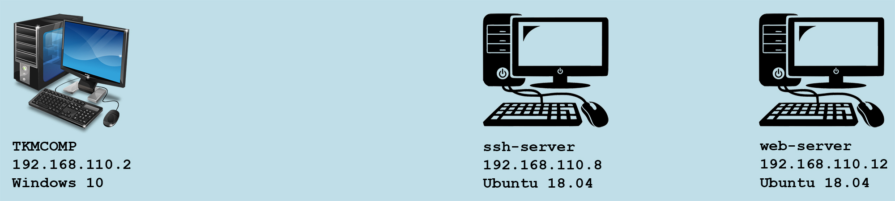

Все машины находятся в одной локальной сети — для удобства проведения экспериментов с построением туннелей. Хотя с практической точки зрения нужен компьютер с белым ip-адресом и с установленным ssh-сервером — который будет посредником между двумя компьютерами с серыми ip-адресами.

На виртуальной машине `web-server` работает web-сервер Apache — если на физическом компьютере открыть в браузере страницу `http://192.168.110.12`, то увидим дефолтную страницу Apache:

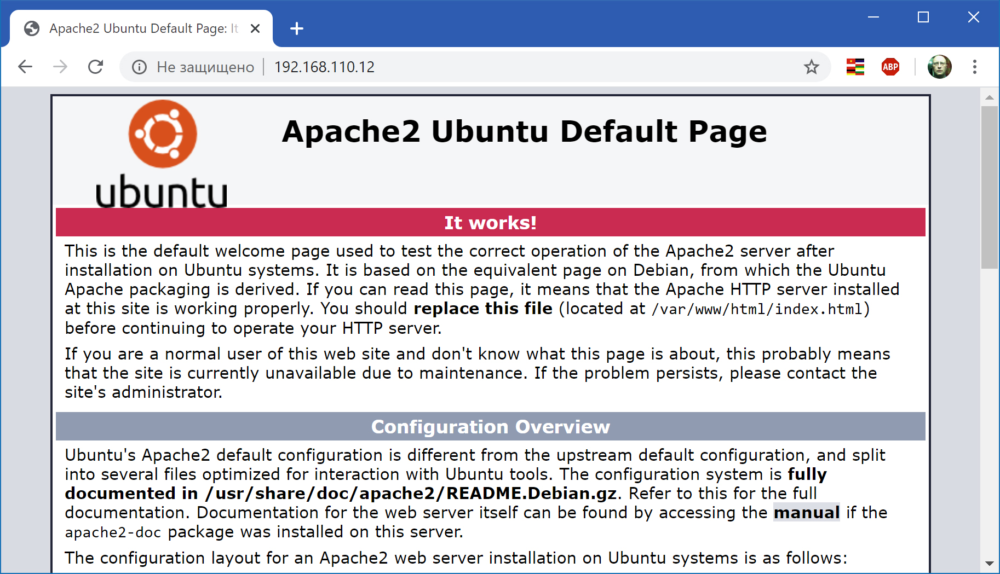

На физической машине `TKMCOMP` тоже работает web-сервер Apache — если открыть в браузере страницу `http://127.0.0.1`, то увидим вывод php-функции `phpinfo()`:

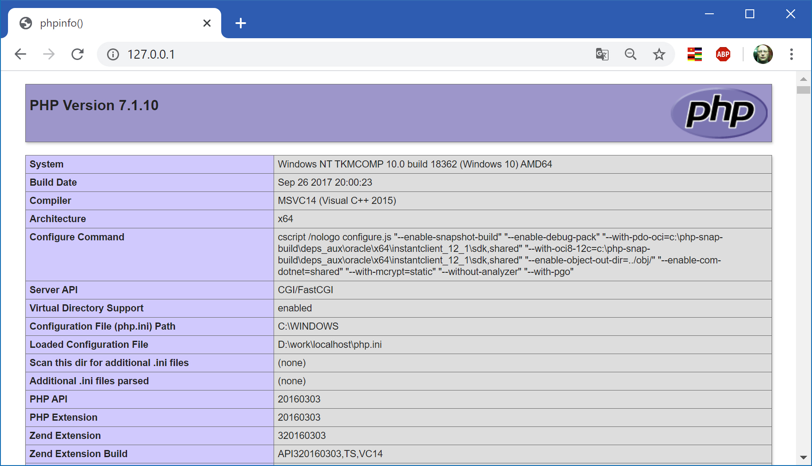

На виртуальной машине `ssh-server` необходимо открыть порт для ssh-соединений. У меня это — 2222:

```
$ sudo ufw allow 2222/tcp
Правило добавлено
Правило добавлено (v6)
```

```
$ sudo ufw status verbose
Состояние: активен
Журналирование: on (low)
По умолчанию: deny (входящие), allow (исходящие), disabled (маршрутизированные)
```

```
В                          Действие    Из
----------------------------------------------------
2222/tcp                   ALLOW IN    Anywhere
2222/tcp (v6)              ALLOW IN    Anywhere (v6)
```

### Проброс локального соединения на удаленную машину <a name="link_5"></a>

Открываем на физической машине PowerShell и выполняем команду:

```
> ssh -p 2222 -L 127.0.0.1:8080:192.168.110.12:80 evgeniy@192.168.110.8
```

- точка входа в туннель — физическая машина `TKMCOMP`, интерфейс `localhost`
- точка выхода из туннеля — виртуальная машина `ssh-server`, интерфейс `localhost`
- пункт назначения tcp-пакетов — виртуальная машина `web-server`

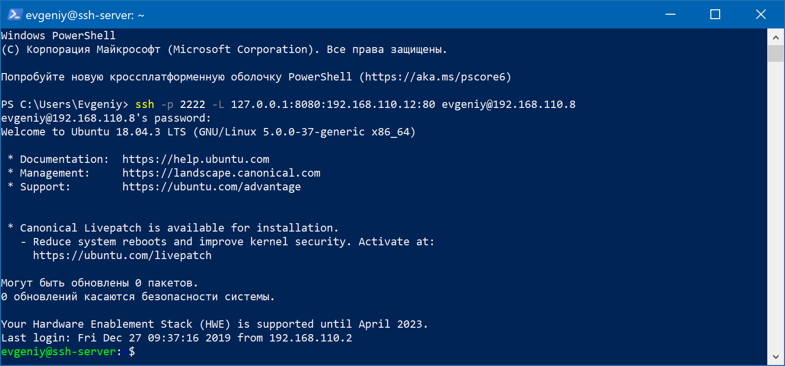

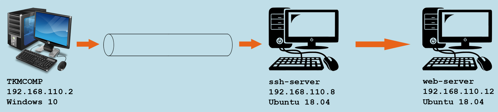

Теперь у нас есть туннель от 192.168.110.2 до 192.168.110.8: пакеты от физической машины попадают в туннель и будут получены виртуальной машиной `ssh-server`. А поскольку пункт назначения 192.168.110.12 — пакеты будут направлены дальше в сеть, к виртуальной машине `web-server`.

На физической машине открываем в браузере страницу `http://127.0.0.1:8080` — и видим дефолтную страницу Apache:


### Проброс удаленного соединения на локальную машину <a name="link_6"></a>

Открываем на физической машине PowerShell и выполняем команду:

```
> ssh -p 2222 -R 127.0.0.1:8080:127.0.0.1:80 evgeniy@192.168.110.8
```

- точка входа в туннель — виртуальная машина `ssh-server`, интерфейс `localhost`
- точка выхода из туннеля — физическая машина `TKMCOMP`, интерфейс `localhost`
- пункт назначения tcp-пакетов — физическая машина `TKMCOMP` (пакеты предназначены ей)

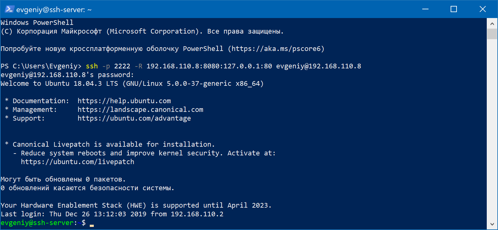

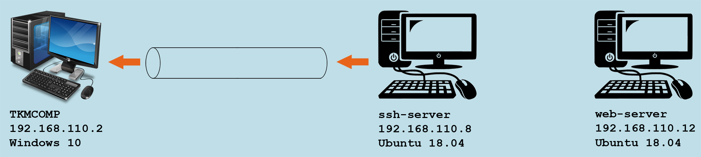

Теперь у нас есть туннель от 192.168.110.8 до 192.168.110.2: пакеты от виртуальной машины `ssh-server` попадут в туннель и будут получены физической машиной. Откроем на виртуальной машине `ssh-server` браузер и наберем в адресной строке `http://192.168.110.8:8080` или `http://127.0.01:8080`. Мы видим вывод функции `phpinfo()` от web-сервера физической машины:

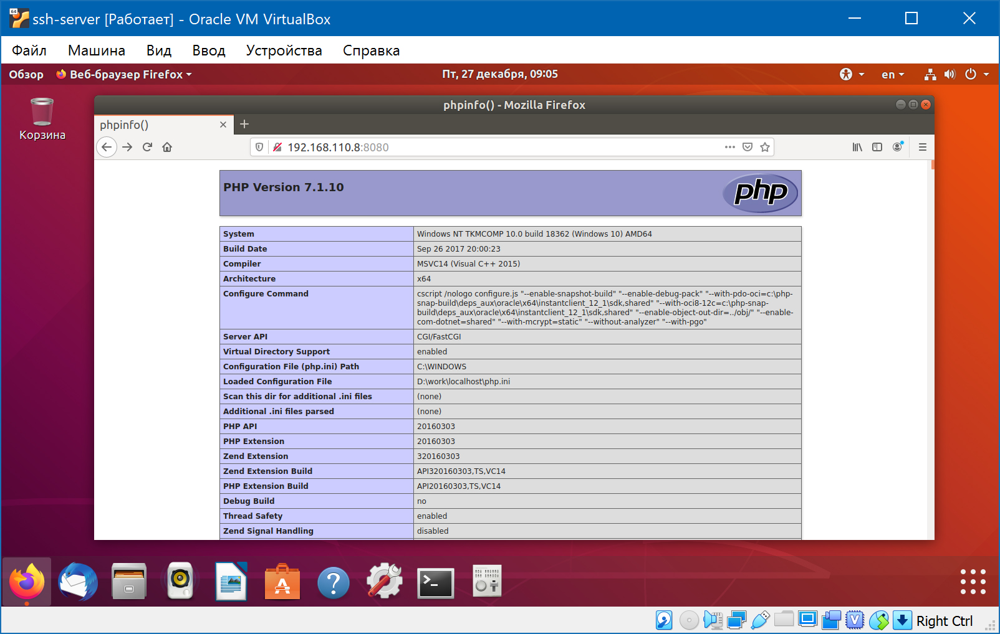

Однако, если мы откроем браузер на виртуальной машине `web-server` и наберем в адресной строке `http://192.168.110.8:8080` — то ничего не увидим:

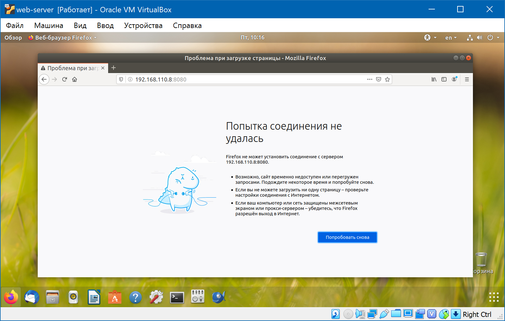

Пакеты от виртуальной машины `web-server` придут на сетевой интерфейс `enp0s3` (`192.168.110.8`) виртуальной машины `ssh-server`. А перенаправляются в туннель только те пакеты, которые пришли на интерфейс обратной петли `loopback` (`127.0.0.1`). Чтобы это исправить, нужно изменить настройки ssh-сервера — отредактировать файл конфигурации `/etc/ssh/sshd_config`:

```
GatewayPorts yes
```

```
$ sudo systemctl restart ssh
```

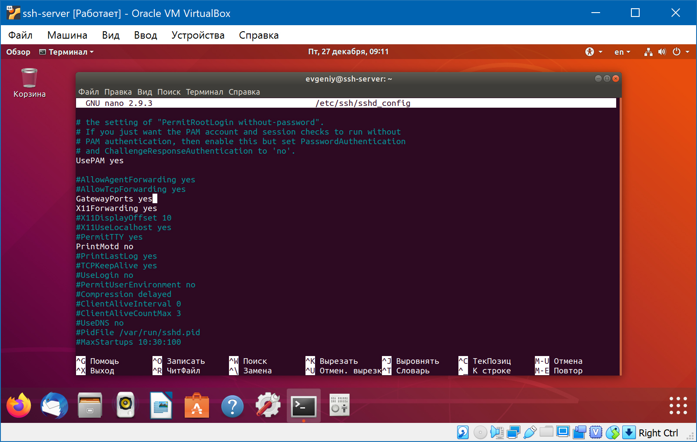

Но это очень радикальный путь, лучше использовать опцию `-g` в команде создания туннеля. Она действует аналогично `GatewayPorts`, но уменьшает риск забыть об этой настройке ssh-сервера, когда в ней уже не будет необходимости.

Обновляем страницу `http://192.168.110.8:8080` на виртуальной машине `web-server`:

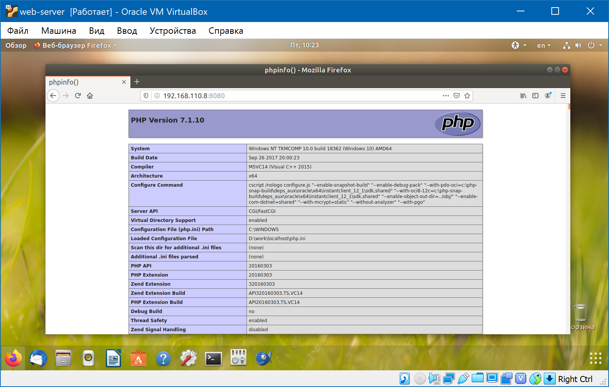

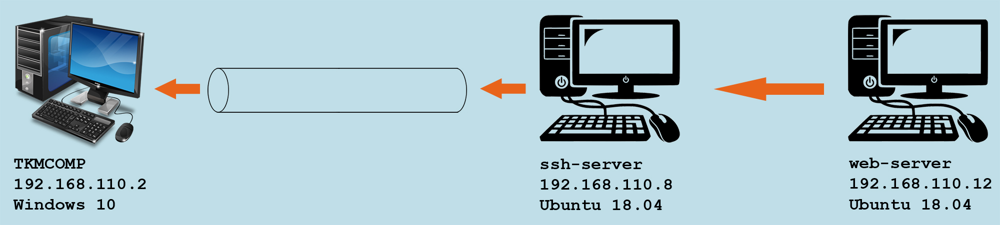

# Создание SSH-туннеля. Часть 2 <a name="link_7"></a>

Наша следующая задача — с помощью mysql-клиента на физическом компьютере `TKMCOMP` подключиться к mysql-серверу на виртуальной машине `web-server`. Для этого пробросим TCP-соединение от `TKMCOMP` к `web-server` через промежуточный сервер `ssh-server`.


На виртуальной машине `ssh-server` необходимо открыть порт для ssh-соединений. У меня это — 2222:

```
$ sudo ufw allow 2222/tcp
Правило добавлено
Правило добавлено (v6)
```

```
$ sudo ufw status verbose
Состояние: активен
Журналирование: on (low)
По умолчанию: deny (входящие), allow (исходящие), disabled (маршрутизированные)
```

```
В                          Действие    Из
----------------------------------------------------
2222/tcp                   ALLOW IN    Anywhere
2222/tcp (v6)              ALLOW IN    Anywhere (v6)
```

## Проброс соединения TKMCOMP => ssh-server => web-server <a name="link_8"></a>

Первый туннель — от физического компьютера до виртуальной машины `ssh-server`. Открываем окно PowerShell и выполняем команду:

```
> ssh -p 2222 -L 3307:127.0.0.1:3306 evgeniy@192.168.110.8
```

Второй туннель создаем с виртуальной машины `web-server`, с удаленной точкой входа на виртуальной машине `ssh-server`. Открываем окно терминала на `web-server` и выполняем команду:

```
$ ssh -p 2222 -R 3306:127.0.0.1:3306 evgeniy@192.168.110.8
```

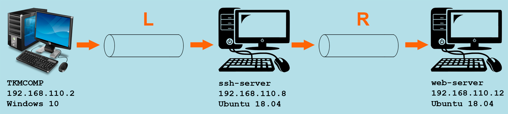

Открываем еще одно окно PowerShell и выполняем команду:

```
> mysql -uroot -pqwerty -P 3307
```

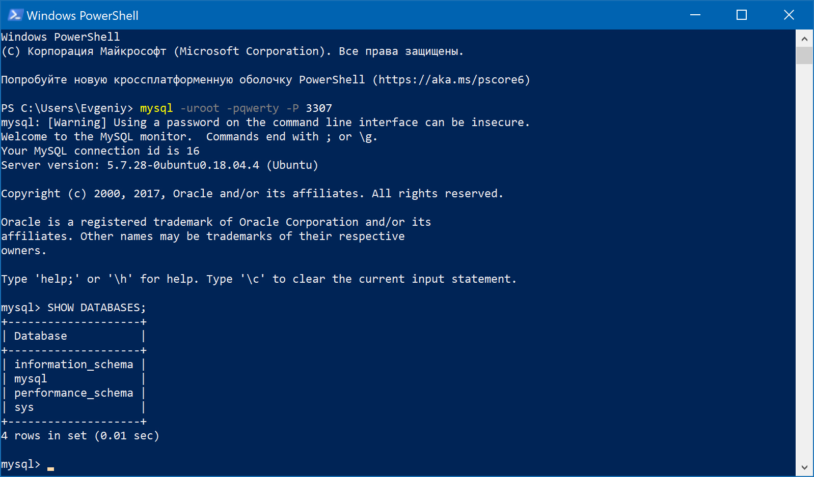

Эту задачу можно решить иначе, но для этого потребуется установить ssh-сервер на виртуальную машину `web-server` (подробности см. [здесь](https://tokmakov.msk.ru/blog/item/441)):

```
$ sudo apt install openssh-server
$ sudo nano /etc/ssh/sshd_config
$ sudo systemctl restart ssh
```

Теперь открываем окно PowerShell и выполняем команду:

```
> ssh -p 2222 -L 3307:127.0.0.1:3306 evgeniy@192.168.110.8
```

Тем самым мы создаем туннель и подключаемся к виртуальной машине `ssh-server`. И создаем еще один туннель (а заодно подключаемся к виртуальной машине `web-server`):

```
$ ssh -p 2222 -L 3306:127.0.0.1:3306 evgeniy@192.168.110.12
```

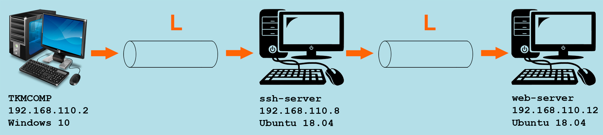

Открываем еще одно окно PowerShell и выполняем команду:

```
> mysql -uroot -pqwerty -P 3307
```

Такое решение не всегда возможно. Как правило, два туннеля нужны, чтобы пробросить соединение между двумя машинами с серыми ip-адресами, расположенными далеко друг от друга. Поскольку напрямую это сделать нельзя, нужен ssh-сервер с белым ip-адресом, который будет посредником.

## Проброс соединения TKMCOMP <= ssh-server <= web-server <a name="link_9"></a>

А теперь решим обратную задачу — пробросим соединение от виртуальной машины `web-server` к физической машине через промежуточный сервер `ssh-server`. Чтобы с виртуальной машины `web-server` можно было подключится к серверу БД на физической машине.

Итак, открываем окно PowerShell на физической машине и выполняем команду:

```
> ssh -p 2222 -R 3306:127.0.0.1:3306 evgeniy@192.168.110.8
```

Теперь открываем окно терминала на виртуальной машине `web-server`:

```
$ ssh -p 2222 -L 3307:127.0.0.1:3306 evgeniy@192.168.110.8
```

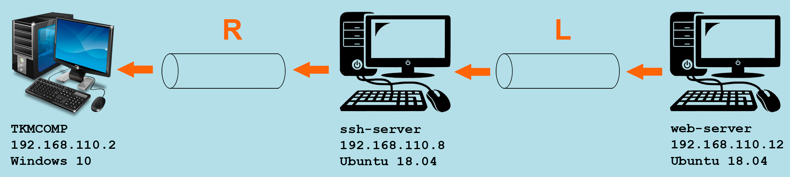

Открываем еще одно окно терминала на виртуальной машине `web-server`:

```
$ mysql -uroot -pqwerty -P 3307
```

И получаем совершенно неожиданный результат. Вместо того, чтобы подключиться к серверу БД на физической машине `TKMCOMP`, мы подключились к серверу БД на виртуальной машине `web-server`. Причем еще ухитрились подключиться на порту 3307, хотя порт по умолчанию для MySQL — 3306.

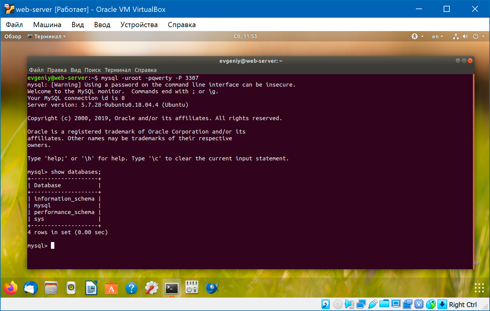

Дело в том, что хост по умолчанию для mysql-клиента — это `localhost`. А в этом случае подключение происходит с использованием unix-сокета. И порт может быть любым — он вообще не используется. Но нам нужно сетевое подключение, т.е. с использованием tcp-сокета. Тут есть два пути решения — либо указать протокол TCP, либо указать хост 127.0.0.1 (вместо значения по умолчанию `localhost`):

```
$ mysql -uroot -pqwerty -P 3307 --protocol=TCP
```

```
$ mysql -uroot -pqwerty -P 3307 -h 127.0.0.1
```

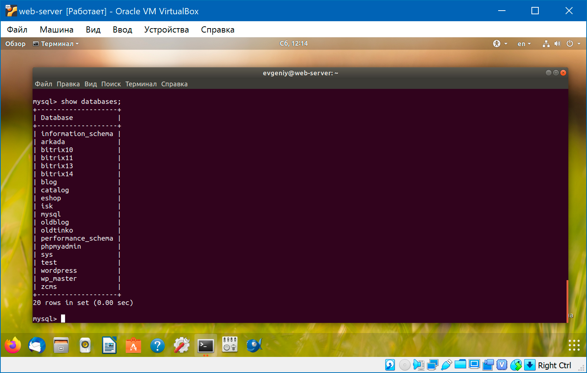

## Аутентификация по ключу <a name="link_10"></a>

Чтобы не вводить пароль каждый раз при создании туннеля — настроим аутентификацию по ключу. Сначала для физического компьютера, потом для виртуальной машины `web-server`. Эти ключи будут нужны для построения двух туннелей через промежуточный сервер:


Но перед этим надо изменить настройку ssh-сервера:

PubkeyAuthentication yes

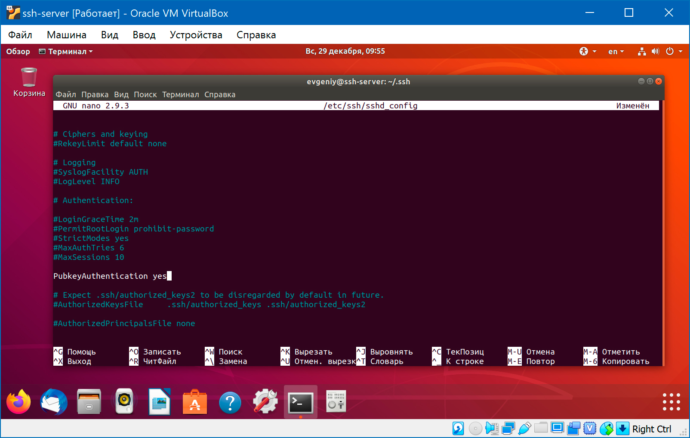

```
$ sudo systemctl restart ssh
```

### Ключи для физического компьютера <a name="link_11"></a>

Открываем окно PowerShell на физической машине и создаем пару ключей с именем `tcp-forward-ssh-server`:

```
> ssh-keygen
```

Копируем публичный ключ на `ssh-server`:

```
> cat .\.ssh\tcp-forward-ssh-server.pub | ssh -p 2222 evgeniy@192.168.110.8 `
> 'cat >> ./.ssh/authorized_keys'
```

Создаем или редактируем файл `~/.ssh/config`

```
#Проброс соединения 192.168.110.2 ==L==> 192.168.110.8
Host local-forward-ssh-server
  HostName 192.168.110.8
  Port 2222
  User evgeniy
  IdentityFile ~/.ssh/tcp-forward-ssh-server
  LocalForward 3307 127.0.0.1:3306
```

```
#Проброс соединения 192.168.110.2 <==R== 192.168.110.8
Host remote-forward-ssh-server
  HostName 192.168.110.8
  Port 2222
  User evgeniy
  IdentityFile ~/.ssh/tcp-forward-ssh-server
  RemoteForward 3306 127.0.0.1:3306
```

Теперь можно упростить команды построения туннелей:

```
> ssh -p 2222 -L 3307:127.0.0.1:3306 evgeniy@192.168.110.8 # вместо этой команды
> ssh local-forward-ssh-server # теперь можно использовать такую
```

```
> ssh -p 2222 -R 3306:127.0.0.1:3306 evgeniy@192.168.110.8 # вместо этой команды
> ssh remote-forward-ssh-server # теперь можно использовать такую
```

### Ключи для виртуальной машины <a name="link_12"></a>

Открываем окно терминала на виртуальной машине и создаем пару ключей с именем `tcp-forward-ssh-server`:

```
> ssh-keygen
```

Копируем публичный ключ на `ssh-server`:

```
$ ssh-copy-id -p 2222 -i ~/.ssh/tcp-forward-ssh-server.pub evgeniy@192.168.110.8
```

Создаем или редактируем файл `~/.ssh/config`

```
#Проброс соединения 192.168.110.8 ==R==> 192.168.110.12
Host remote-forward-ssh-server
  HostName 192.168.110.8
  Port 2222
  User evgeniy
  IdentityFile ~/.ssh/tcp-forward-ssh-server
  RemoteForward 3306 127.0.0.1:3306
```

```
#Проброс соединения 192.168.110.8 <==L== 192.168.110.12
Host local-forward-ssh-server
  HostName 192.168.110.8
  Port 2222
  User evgeniy
  IdentityFile ~/.ssh/tcp-forward-ssh-server
  LocalForward 3307 127.0.0.1:3306
```

Теперь можно упростить команды построения туннелей:

```
> ssh -p 2222 -R 3306:127.0.0.1:3306 evgeniy@192.168.110.8
> ssh remote-forward-ssh-server
```

```
> ssh -p 2222 -L 3307:127.0.0.1:3306 evgeniy@192.168.110.12
> ssh local-forward-ssh-server
```

# Создание SSH-туннеля. Часть 3 <a name="link_13"></a>

Мы создавали ssh-туннели между виртуальными машинами, где сетевые соединения стабильны. Но в реальной жизни каналы связи оставляют желать много лучшего. Было бы разумно как-то отслеживать наличие соединения и автоматически его восстанавливать.

В OpenSSH присутствует стандартная схема для мониторинга состояния подключения, причем как на стороне сервера, так и на стороне клиента. Суть ее заключается в том, что OpenSSH будет проверять наличие рабочего подключения и в случае отсутствия такового будет просто завершать ssh-сеанс, избавляя нас от зависших сессий.

## Проверка активности соединения <a name="link_14"></a>

Для этого отредактируем файл конфигурации `/etc/ssh/sshd_config` на виртуальной машине `ssh-server`:

```
$ sudo nano /etc/ssh/sshd_config
```

```
#отключаем дефолтный механизм проверки активности соединения
TCPKeepAlive no
#проверять активность подключения клиента каждые 30 секунд
ClientAliveInterval 30
#сервер закроет соединение после трех неудачных попыток
ClientAliveCountMax 3
```

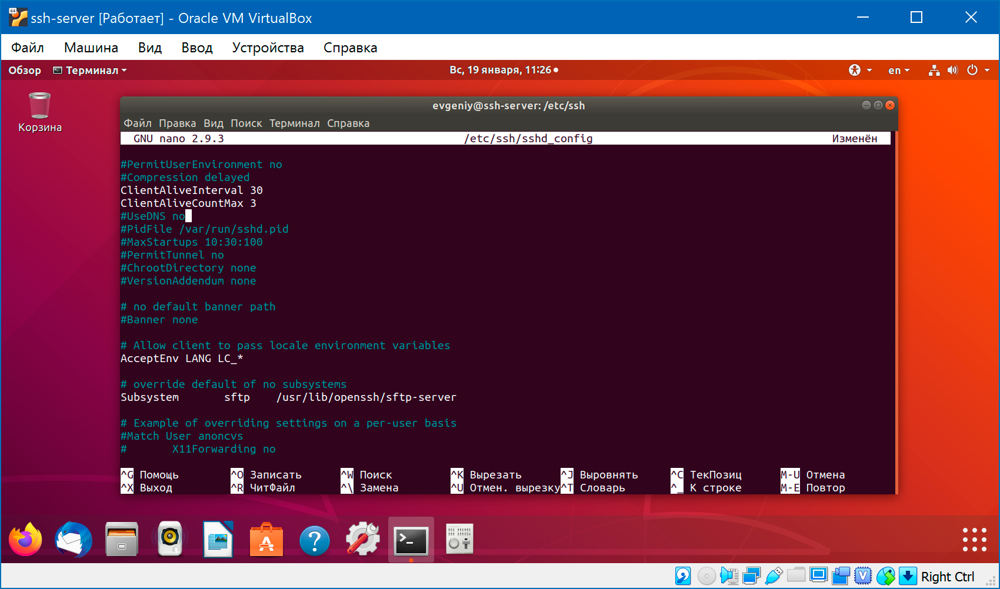

```
$ sudo systemctl restart ssh.service
```

Если что-то произойдет с клиентом, например, компьютер просто отключится от сети, то через 90 секунд `ssh-server` закроет туннельное соединение.

В файле `/etc/ssh/sshd_config` есть параметр `TCPKeepAlive`, который по умолчанию имеет значение `yes`. Он позволяет поддерживать TCP-соединение в активном состоянии, даже когда нет передачи пакетов. Эта решается на уровне протокола TCP/IP с помощью отправки специальных проверочных пакетов.

Кроме того, OpenSSH имеет альтернативные средства контроля активности сеансов — `ClientAliveInterval` и `ClientAliveCountMax`. При использовании этих параметров, в отличие от `TCPKeepAlive`, запросы отправляются через защищённый ssh-канал и не могут быть подменены.

При создании туннельного подключения со стороны клиента есть возможность указать аналогичные параметры `ServerAliveInterval` и `ServerAliveCountMax`. Команда создания туннеля на виртуальной машине `web-server`:

```
$ ssh -p 2222 -o "TCPKeepAlive no" -o "ServerAliveInterval 30" -o "ServerAliveCountMax 3" -R 3306:127.0.0.1:3306 evgeniy@192.168.110.8
```

Иногда возможна ситуация, когда порт не был проброшен, хотя туннель был поднят. То есть, со стороны ssh-сервера и ssh-клиента все будет выглядеть нормально, туннель будет существовать и работать, но вот порт не будет проброшен. Для этого случая предусмотрен дополнительный параметр `ExitOnForwardFailure yes`.

Параметры на стороне клиента можно задавать как в командной строке, так и записать их в файл конфигурации:

```
$ nano ~/.ssh/config
```

```
#Проброс соединения 192.168.110.8 ==R==> 192.168.110.12
Host remote-forward-ssh-server
  HostName 192.168.110.8
  Port 2222
  User evgeniy
  IdentityFile ~/.ssh/tcp-forward-ssh-server
  TCPKeepAlive no
  ServerAliveInterval 30
  ServerAliveCountMax 3
  ExitOnForwardFailure yes
  RemoteForward 3306 127.0.0.1:3306
```

```
#Проброс соединения 192.168.110.8 <==L== 192.168.110.12
Host local-forward-ssh-server
  HostName 192.168.110.8
  Port 2222
  User evgeniy
  IdentityFile ~/.ssh/tcp-forward-ssh-server
  TCPKeepAlive no
  ServerAliveInterval 30
  ServerAliveCountMax 3
  ExitOnForwardFailure yes
  LocalForward 3307 127.0.0.1:3306
```

В этом случае команда создания туннеля будет проще:

```
$ ssh remote-forward-ssh-server
```

Поскольку при создании туннеля не планируется выполнять команды на виртуальной машине `ssh-server`, можно добавить опцию

```
$ ssh -N remote-forward-ssh-server
```

Но в этом случае терминал у нас зависнет, т.к. будет ожидать окончания выполнения этой команды. И для дальнейшей работы нам потребуется еще один терминал. Но мы можем запустить эту команду в фоновом режиме:

```
$ ssh -N remote-forward-ssh-server &
[1] 3949
```

Чтобы завершить фоновый процесс, надо переместить его на передний план, а потом завершить с помощью `Ctrl+C`:

```
$ fg 1
ssh -N remote-forward-ssh-server
^C
```

## Автоматическое восстанавление туннеля <a name="link_15"></a>

Утилита `autossh` предназначена для мониторинга соединений ssh и их автоматического восстановления в случае разрыва. Она уже входит в репозитории Ubuntu, поэтому устанавливаем ее на виртуальную машину `web-server`:

```
$ sudo apt install autossh
```

```
$ autossh
usage: autossh [-V] [-M monitor_port[:echo_port]] [-f] [SSH_OPTIONS]

    -M specifies monitor port. Overrides the environment
       variable AUTOSSH_PORT. 0 turns monitoring loop off.
       Alternatively, a port for an echo service on the remote
       machine may be specified. (Normally port 7.)
    -f run in background (autossh handles this, and does not
       pass it to ssh.)
    -V print autossh version and exit.

Environment variables are:
    AUTOSSH_GATETIME    - how long must an ssh session be established
                          before we decide it really was established
                          (in seconds). Default is 30 seconds; use of -f
                          flag sets this to 0.
    AUTOSSH_LOGFILE     - file to log to (default is to use the syslog
                          facility)
    AUTOSSH_LOGLEVEL    - level of log verbosity
    AUTOSSH_MAXLIFETIME - set the maximum time to live (seconds)
    AUTOSSH_MAXSTART    - max times to restart (default is no limit)
    AUTOSSH_MESSAGE     - message to append to echo string (max 64 bytes)
    AUTOSSH_PATH        - path to ssh if not default
    AUTOSSH_PIDFILE     - write pid to this file
    AUTOSSH_POLL        - how often to check the connection (seconds)
    AUTOSSH_FIRST_POLL  - time before first connection check (seconds)
    AUTOSSH_PORT        - port to use for monitor connection
    AUTOSSH_DEBUG       - turn logging to maximum verbosity and log to
                          stderr
```

Команда создания туннеля на виртуальной машине `web-server`:

```
$ autossh -M 0 -N -p 2222 -o "TCPKeepAlive no" -o "ServerAliveInterval 30" -o "ServerAliveCountMax 3" -o "ExitOnForwardFailure yes" -R 3306:127.0.0.1:3306 evgeniy@192.168.110.8
```

```
$ autossh -M 0 -N remote-forward-ssh-server
```

Для `autossh` обязательна опция `-M`, которая задает порт для мониторинга соединения. Но ssh-клиент может и сам это делать (это опции `ServerAliveInterval` и `ServerAliveCountMax`). Так что опцию `-M` будем всегда отключать.

Чтобы запустить `autossh` в фоновом режиме, добавляем опцию `-f`:

```
$ autossh -M 0 -f -N -p 2222 -o "TCPKeepAlive no" -o "ServerAliveInterval 30" -o "ServerAliveCountMax 3" -o "ExitOnForwardFailure yes" -R 3306:127.0.0.1:3306 evgeniy@192.168.110.8
```

```
$ autossh -M 0 -f -N remote-forward-ssh-server
```

Здесь опции `-M` и `-f` относятся к `autossh`, а все остальные передаются `ssh`.

Проверим, что туннель работает, воспользовавшись командой `ps`:

```
$ ps -f -C autossh
UID        PID  PPID  C  STIME  TTY          TIME  CMD
evgeniy   4000  3210  0  12:26  ?        00:00:00  /usr/lib/autossh/autossh -M 0 -N remote-forward-ssh-server
```

Чтобы завершить процесс, используем команду `pkill`:

```
$ pkill autossh
```

## Проверяем, как работает autossh <a name="link_16"></a>

Во второй части мы решали две задачи:

1. Пробросить ssh-туннель от `TKMCOMP` до `web-server` через промежуточный `ssh-server`, чтобы иметь возможность подключаться с физической машины `TKMCOMP` к серверу БД на виртуальной машине `web-server`
2. Пробросить ssh-туннель от `web-server` до `TKMCOMP` через промежуточный `ssh-server`, чтобы иметь возможность подключаться с виртуальной машины `web-server` к серверу БД на физической машине `TKMCOMP`


Мы сейчас посмотрим, как работает `autossh`, пробрасывая туннель от `web-server` до `ssh-server` (правая половина первого рисунка). Для проверки того, что туннель работает, установим на виртуальную машину `ssh-server` клиент БД MySQL:

```
$ sudo apt install mysql-client
```

Теперь с виртуальной машины `web-server` выполним команду создания туннеля:

```
$ autossh -M 0 -N remote-forward-ssh-server
```

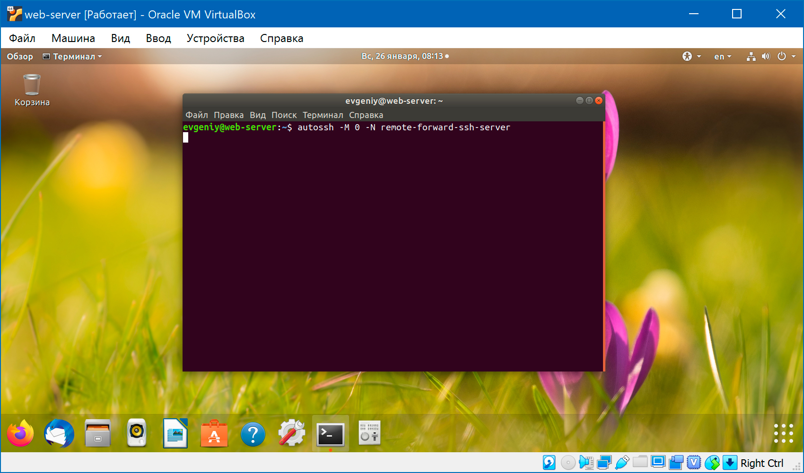

А с виртуальной машины `ssh-server` соединяемся с сервером БД MySQL:

```
$ mysql -uroot -pqwerty --protocol=TCP
```

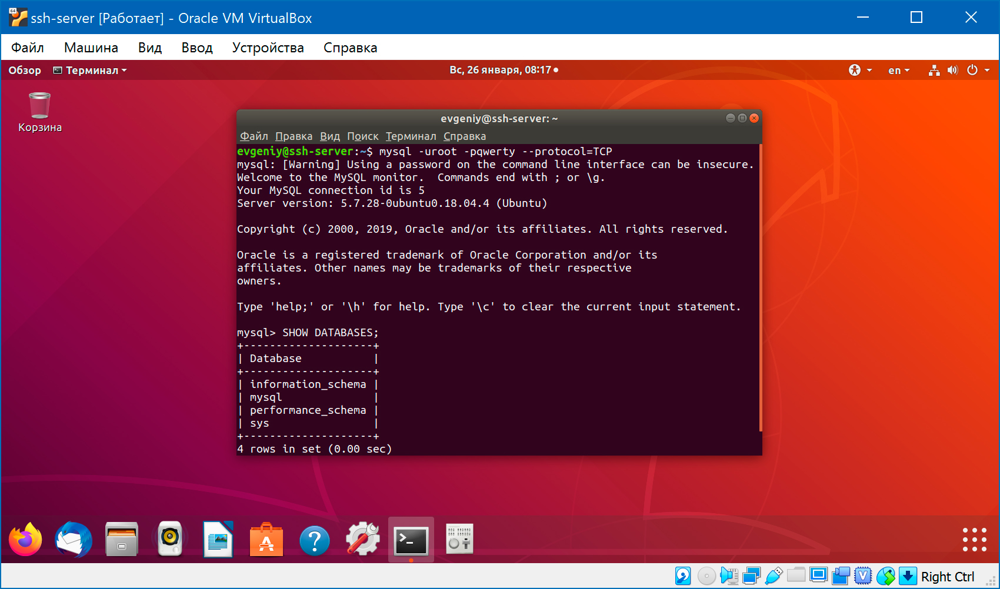

Соединение прошло успешно. Теперь выключим сетевой интерфейс на виртуальной машине `ssh-server`:

```
$ sudo ip link set dev enp0s3 down
```

Удостоверимся, что подключиться к серверу БД MySQL теперь нельзя:

```
$ mysql -uroot -pqwerty --protocol=TCP
mysql: [Warning] Using a password on the command line interface can be insecure.
ERROR 2003 (HY000): Can't connect to MySQL server on 'localhost' (111)
```

И посмотрим, как отреагирует утилита `autossh` на машине `web-server`:

```
$ autossh -M 0 -N remote-forward-ssh-server
Timeout, server 192.168.110.8 not responding. # прошло 90 секунд, сервер не отвечает
ssh: connect to host 192.168.110.8 port 2222: No route to host # попытка соединения с сервером
ssh: connect to host 192.168.110.8 port 2222: No route to host # попытка соединения с сервером
ssh: connect to host 192.168.110.8 port 2222: No route to host # попытка соединения с сервером
```

При включении сетевого интерфейса на виртуальной машине `ssh-server`:

```
$ sudo ip link set dev enp0s3 up
```

Туннель будет восстановлен. Это можно проверить, если выполнить команду на `ssh-server`:

```
$ mysql -uroot -pqwerty --protocol=TCP
mysql: [Warning] Using a password on the command line interface can be insecure.
Welcome to the MySQL monitor.  Commands end with ; or \g.
Your MySQL connection id is 12
Server version: 5.7.28-0ubuntu0.18.04.4 (Ubuntu)
..........
```

Если возникли какие-то проблемы с `autossh`, можно запустить утилиту в режиме отладки:

```
$ AUTOSSH_DEBUG=1 autossh -M 0 -N remote-forward-ssh-server
autossh[2744]: port set to 0, monitoring disabled # мы отключили мониторинг
autossh[2744]: checking for grace period, tries = 0
autossh[2744]: starting ssh (count 1) # запуск ssh (попытка 1)
autossh[2744]: ssh child pid is 2747
autossh[2744]: check on child 2747
autossh[2744]: set alarm for 600 secs
autossh[2747]: execing /usr/bin/ssh
Timeout, server 192.168.110.8 not responding.
autossh[2744]: check on child 2747
autossh[2744]: ssh exited with error status 255; restarting ssh
autossh[2744]: expired child, returning 1
autossh[2744]: checking for grace period, tries = 1
autossh[2744]: starting ssh (count 2) # запуск ssh (попытка 2)
autossh[2744]: ssh child pid is 2754
autossh[2744]: check on child 2754
autossh[2744]: set alarm for 559 secs
autossh[2754]: execing /usr/bin/ssh
ssh: connect to host 192.168.110.8 port 2222: No route to host
autossh[2744]: check on child 2754
autossh[2744]: ssh exited with error status 255; restarting ssh
autossh[2744]: expired child, returning 1
autossh[2744]: checking for grace period, tries = 2
autossh[2744]: starting ssh (count 3) # запуск ssh (попытка 3)
```

# Создание SSH-туннеля. Часть 4 <a name="link_17"></a>

Во второй части мы решали две задачи:

1. Пробросить ssh-туннель от `TKMCOMP` до `web-server` через промежуточный `ssh-server`, чтобы иметь возможность подключаться с физической машины `TKMCOMP` к серверу БД на виртуальной машине `web-server`
2. Пробросить ssh-туннель от `web-server` до `TKMCOMP` через промежуточный `ssh-server`, чтобы иметь возможность подключаться с виртуальной машины `web-server` к серверу БД на физической машине `TKMCOMP`


До этого момента мы создавали туннели сами, выполняя команды `ssh` или `autossh`. Гораздо удобнее, если туннель будет запускаться без нашего участия, во время загрузки операционной системы. Для первой задачи создадим две службы: на виртуальной машине `web-server` и на физической машине `TKMCOMP`. Каждая из этих служб будут запускаться во время загрузки Linux и Windows, создавая туннель к виртуальной машине `ssh-server`, и в дальнейшем поддерживать туннель в рабочем состоянии.

## Запуск autossh при загрузке web-server <a name="link_18"></a>

Для этого создаем новый unit-файл на виртуальной машине `web-server`:

```
$ sudo nano /etc/systemd/system/autossh-tunnel.service
```

```
[Unit]
Description=Autossh tunnel to ssh-server at startup
After=network-online.target
[Service]
User=evgeniy
Group=evgeniy
Environment="AUTOSSH_GATETIME=0"
ExecStart=/usr/bin/autossh -M 0 -N -F /home/evgeniy/.ssh/config remote-forward-ssh-server
[Install]
WantedBy=multi-user.target
```

Переменная окружения `AUTOSSH_GATETIME` по умолчанию имеет значение 30 секунд. Она задает время, которое должно пройти, чтобы `autossh` считал первое соединение `ssh` успешным. При любых проблемах первого подключения в течение 30 секунд — `autossh` просто прекращает свою работу, не пытаясь запустить `ssh` повторно. Это особенно полезно на этапе настройки и тестирования `autossh` и `ssh`.

Если переменная окружения `AUTOSSH_GATETIME` имеет нулевое значение, такое поведение отключается. Даже если первое соединение `ssh` было неудачным, `autossh` не прекращает свою работу, а переходит в фоновый режим и пытается запустить `ssh` снова. Если использована опция `-f` для `autossh` — переменная `AUTOSSH_GATETIME` устанавливается в ноль.

И сообщаем операционной системе про новый unit-файл:

```
$ sudo systemctl daemon-reload
```

Добавляем новую службу в автозагрузку:

```
$ sudo systemctl enable autossh-tunnel.service
```

Перезагружаем систему и смотрим статус нашей службы:

```
$ sudo systemctl status autossh-tunnel.service
```

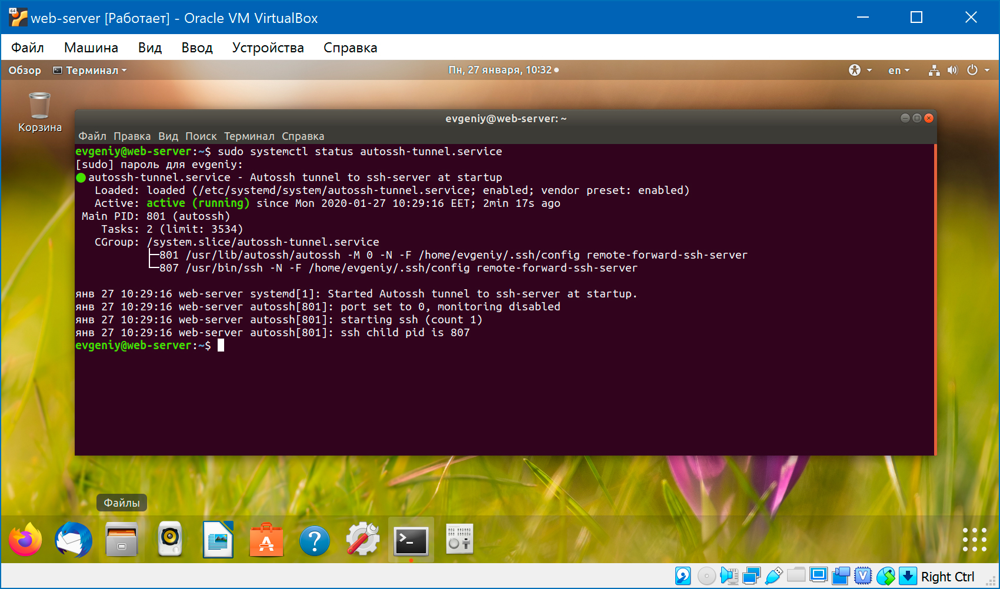

## Альтернативный вариант восстановления туннеля <a name="link_19"></a>

Разбираясь с созданием unit-файла, обнаружил, что поддерживать туннель в рабочем состоянии можно гораздо проще, без использования утилиты `autossh`:

```
$ sudo nano /etc/systemd/system/autossh-tunnel.service
```

```
[Unit]
Description=Autossh tunnel to ssh-server at startup
After=network-online.target
[Service]
User=evgeniy
Group=evgeniy
ExecStart=/usr/bin/ssh -N -F /home/evgeniy/.ssh/config remote-forward-ssh-server
Restart=always
RestartSec=5
[Install]
WantedBy=multi-user.target
```

Перезагружаем систему и смотрим статус нашей службы:

```
$ sudo systemctl status autossh-tunnel.service
```

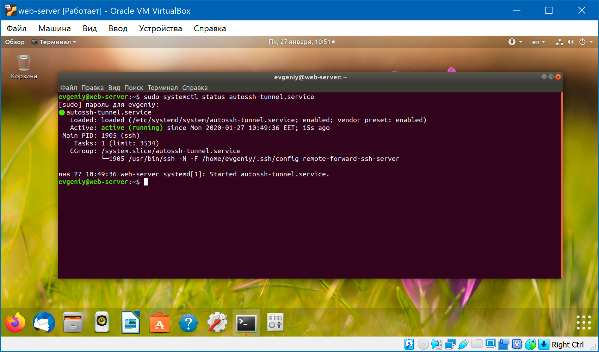

## Автозапуск туннеля при загрузке TKMCOMP <a name="link_20"></a>

На физическом компьютере у нас уже создан файл `~/.ssh/config`:

```
#Проброс соединения 192.168.110.2 ==L==> 192.168.110.8
Host local-forward-ssh-server
HostName 192.168.110.8
Port 2222
User evgeniy
IdentityFile ~/.ssh/tcp-forward-ssh-server
LocalForward 3307 127.0.0.1:3306
```

```
#Проброс соединения 192.168.110.2 <==R== 192.168.110.8
Host remote-forward-ssh-server
HostName 192.168.110.8
Port 2222
User evgeniy
IdentityFile ~/.ssh/tcp-forward-ssh-server
RemoteForward 3306 127.0.0.1:3306
```

По аналогии с файлом `~/.ssh/config` на виртуальной машине `web-server` добавляем в него опции мониторинга ssh-туннеля. Кроме того, указываем абсолютный путь к файлу ключа (зачем — станет понятно чуть ниже):

```
#Проброс соединения 192.168.110.2 ==L==> 192.168.110.8
Host local-forward-ssh-server
HostName 192.168.110.8
Port 2222
User evgeniy
IdentityFile C:/Users/Evgeniy/.ssh/tcp-forward-ssh-server
TCPKeepAlive no
ServerAliveInterval 30
ServerAliveCountMax 3
ExitOnForwardFailure yes
LocalForward 3307 127.0.0.1:3306
```

```
#Проброс соединения 192.168.110.2 <==R== 192.168.110.8
Host remote-forward-ssh-server
HostName 192.168.110.8
Port 2222
User evgeniy
IdentityFile C:/Users/Evgeniy/.ssh/tcp-forward-ssh-server
TCPKeepAlive no
ServerAliveInterval 30
ServerAliveCountMax 3
ExitOnForwardFailure yes
RemoteForward 3306 127.0.0.1:3306
```

После этого скачиваем установщик Cygwin64 и запускаем установку. Обязательно выбираем для установки `OpenSSH` и `autossh`. Запускаем терминал Cygwin64 от имени администратора и выполняем команду:

```
$ cygrunsrv -I AutoSSH -p /bin/autossh -a "-M 0 -N -F C:/Users/Evgeniy/.ssh/config local-forward-ssh-server" -e AUTOSSH_NTSERVICE=yes -e AUTOSSH_PATH=/bin/ssh
```

Справка по утилите `cygrunsrv`, которая добавляет службу

```
$ cygrunsrv --help
Usage: cygrunsrv [OPTION]...

Main options: Exactly one is required.

  -I, --install <svc_name>  Installes a new service named <svc_name>.
  -R, --remove <svc_name>   Removes a service named <svc_name>.
  -S, --start <svc_name>    Starts a service named <svc_name>.
  -E, --stop <svc_name>     Stops a service named <svc_name>.
  -Q, --query <svc_name>    Queries a service named <svc_name>.
  -L, --list [server]       Lists services that have been installed
                            with cygrunsrv.
  <svc_name> can be a local service or "server/svc_name" or "server\svc_name".

Required install options:
  -p, --path <app_path>     Application path which is run as a service.

Miscellaneous install options:
  -P, --crs-path <path>     Path to cygrunsrv. This is useful for testing or
                            when installing a service on a remote machine.
  -a, --args <args>         Optional string with command line options which
                            is given to the service application on startup.
  -c, --chdir <directory>   Optional directory which will be used as working
                            directory for the application.
  -e, --env <VAR=VALUE>     Optional environment strings which are added
                            to the environment when service is started.
                            You can add up to 255 environment strings using
                            the `--env' option.
                            Note: /bin is always added to $PATH to allow all
                            started applications to find cygwin DLLs.
  -d, --disp <display name> Optional string which contains the display name
                            of the service. Defaults to service name.
  -f, --desc <description>  Optional string which contains the service
                            description.
  -t, --type [auto|manual]  Optional start type of service. Defaults to `auto'.
  -u, --user <user name>    Optional user name to start service as.
                            Defaults to SYSTEM account.
  -w, --passwd <password>   Optional password for user. Only needed
                            if a user is given. If a user has an empty
                            password, enter `-w '. If a user is given but
                            no password, cygrunsrv will ask for a password
                            interactively.
  -s, --termsig <signal>    Optional signal to send to service application
                            when service is stopped.  <signal> can be a number
                            or a signal name such as HUP, INT, QUIT, etc.
                            Default is TERM.
  -z, --shutsig <signal>    Optional signal to send to service application
                            when shutdown has been initiated.  Default is the
                            same signal as defined as termination signal.
  -y, --dep <svc_name2>     Optional name of service that must be started
                            before this new service.  The --dep option may
                            be given up to 16 times, listing another dependent
                            service each time.
  -0, --stdin <file>        Optional input file used for stdin redirection.
                            Default is /dev/null.
  -1, --stdout <file>       Optional output file used for stdout redirection.
                            Default is /var/log/<svc_name>.log.
  -2, --stderr <file>       Optional output file used for stderr redirection.
                            Default is /var/log/<svc_name>.log.
  -x, --pidfile <file>      Optional path for .pid file written by application
                            after fork().
                            Default is that application must not fork().
  -n, --neverexits          Service should never exit by itself.
  -O, --preshutdown         Stop service application during system preshutdown.
  -o, --shutdown            Stop service application during system shutdown.
                            (Only one of --preshutdown and --shutdown is
                             accepted.  Preshutdown is preferred, but only
                             available since Windows Vista/Longhorn.  On earlier
                             OS versions it's silently converted to --shutdown).
  -i, --interactive         Allow service to interact with the desktop
                            (No effect since Windows Vista/Longhorn).
  -j, --nohide              Don't hide console window when service interacts
                            with desktop.

Informative output:
  -V, --verbose             When used with --query or --list, causes extra
  -h, --help                print this help, then exit.
  -v, --version             print cygrunsrv program version number, then exit.
```

Тут два важных момента:

- В системе могут существовать две утилиты `ssh`: одна — из поставки Windows 10, а вторая — из поставки Cygwin64. Утилита `autossh` будет работать с `ssh` из поставки Cygwin64 — мы указываем это явно с помощью переменной окружения `AUTOSSH_PATH`.
- Утилита `ssh` из состава Cygwin64 ищет файл конфигурации `~/.ssh/config` не в директории `C:/Users/Evgeniy/`, а в директории `C:/cygwin64/home/Evgeniy/`. Мы указываем явно, какой файл конфигурации использовать. И с самом файле конфигурации задали полный путь к файлу ключа.

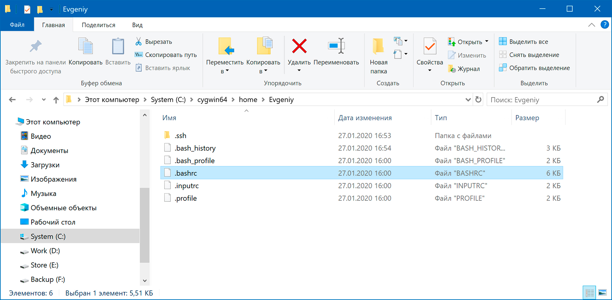

Дальше открываем список служб Windows, находим `AutoSSH`. Задаем пользователя, от которого будет запускаться служба и устанавливаем тип запуска Автоматический:

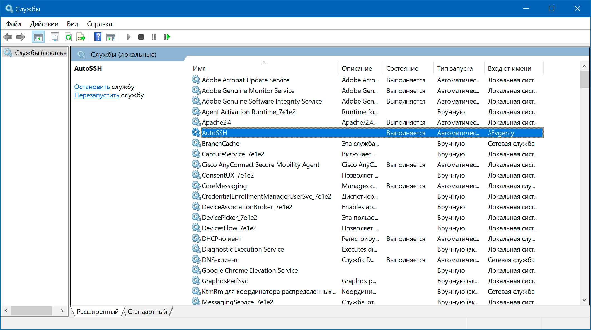

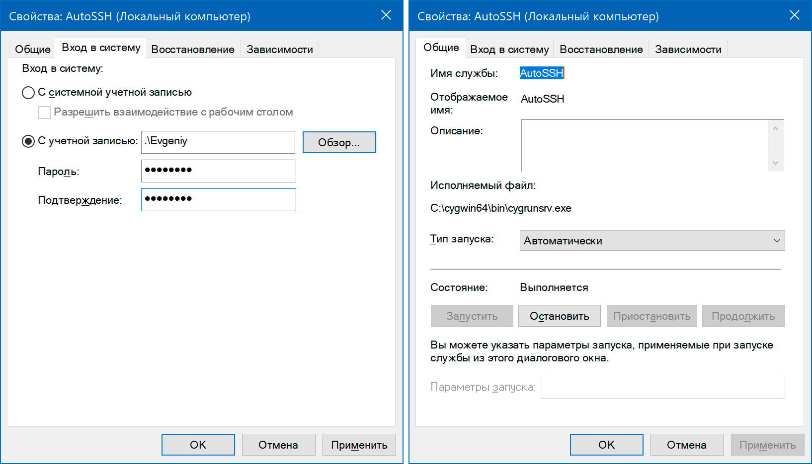

Удалить службу `AutoSSH` можно с помощью команды:

```
$ cygrunsrv --remove AutoSSH
```

- [](https://tokmakov.msk.ru/blog/item/484)
