## SSH-туннели на службе системного администратора

- Автор: Уваров А.С.
- 28.04.2017
  [источник](https://interface31.ru/tech_it/2017/04/ssh-tunneli-na-sluzhbe-sistemnogo-administratora.html)

Любому системному администратору приходится постоянно работать удаленно, но случаются ситуации, когда нужно срочно подключиться к узлам внутренней сети, доступ к которым снаружи закрыт. Хорошо если есть доступ на другие узлы данной сети, но бывает, что доступа из глобальной сети нет вообще, в этих случаях обычно используют TeamViewer или аналогичное ПО, но если к такой сети есть возможность подключиться через SSH или установить соединение с промежуточным SSH-сервером, то можно быстро и просто организовать доступ без привлечения стороннего ПО.

Очень часто, когда речь заходит об удаленном доступе к сетям с низким уровнем безопасности, первое что приходит на ум - это VPN, однако ради административных соединений поднимать VPN не всегда целесообразно, особенно если речь идет об аутсорсинге или "приходящем админе". Кроме того, не всегда условия связи позволяют поднять устойчивое VPN-соединение, особенно если приходится использовать мобильные сети.

При этом практически в любой сети можно найти устройство или сервер, к которому возможен доступ по SSH, либо имеется такой промежуточный сервер, например, VPS в глобальной сети. В таком случае отличным решением будут SSH-туннели, которые позволяют с легкостью организовывать безопасные каналы связи в том числе и через промежуточные узлы, что снимает проблему наличия выделенного IP-адреса.

Строго говоря, SSH-туннели не являются полноценными туннелями и это название следует рассматривать как сложившееся в профессиональной среде устойчивое наименование. Официальное название технологии - _SSH Port Forwarding_ - это опциональная возможность протокола SSH, которая позволяет передать TCP-пакет с одной стороны SSH-соединения на другую и произвести в процессе передачи трансляцию IP-заголовка по заранее определенному правилу.

Также, в отличие от VPN-туннелей, которые позволяют передавать любой трафик в любом направлении, SSH-туннель имеет точку входа и может работать только с TCP-пакетами. По факту это больше всего похоже на проброс портов (о чем и говорит официальное название), только поверх протокола SSH.

Рассмотрим работу SSH-туннеля более подробно. В качестве примера возьмем классический случай обеспечения доступа к некоторому удаленному серверу по протоколу RDP.

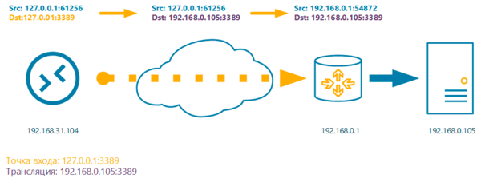Допустим, что в удаленной сети существует целевой сервер с адресом 192.168.0.105, но доступа к нему из внешней сети нет, единственное устройство к которому мы можем подключиться - это маршрутизатор с адресом 192.168.0.1 с которым мы можем установить SSH-соединение.

Остановимся на очень важном моменте: все параметры SSH-туннеля устанавливает **инициатор** подключения, он же **SSH-клиент**, вторым концом туннеля всегда является сервер, к которому мы подключаемся, он же **SSH-сервер**. В данном контексте следует понимать клиент и сервер сугубо как стороны соединения, например, в роли SSH-клиента может выступать VPS-сервер, а в роли SSH-сервера ноутбук админа.

Точка входа может располагаться с **любой стороны** соединения, там открывается TCP-сокет с указанными параметрами, который будет принимать входящие подключения. Точка выхода принимать соединения не может, а только маршрутизирует пакеты в соответствии с правилами трансляции.

Рассмотрим схему выше. Мы установили SSH-туннель с локальной машины к удаленному маршрутизатору, указав локальную **точку входа 127.0.0.1:3389** и **правило трансляции 192.168.0.105:3389**. Еще раз обращаем ваше внимание, что правило трансляции не указывает на точку выхода, а определяет узел, которому будут посланы пакеты по выходу из туннеля. Если вы укажете недействительный адрес, либо узел не будет принимать соединения, то SSH-туннель установится, но доступа к целевому узлу не будет.

Согласно указанной точке входа служба SSH создаст локальный TCP-сокет, который будет ожидать подключений на порт 3389. Поэтому в окне RDP-подключения указываем в качестве назначения **localhost** или **127.0.0.1**, RDP-клиент открывает динамический порт и отсылает пакет с адресом назначения **127.0.0.1:3389** и адресом источника **127.0.0.1:61256**, о реальном назначении получателя пакета ему ничего не известно.

![[./tunnel_ssh_admin_images/2337f5e50dcb151cbd58e099f5ee4e82_MD5.png]]

С точки входа данный пакет будет отправлен на другую сторону SSH-туннеля, а адрес назначения согласно правила трансляции будет изменен на **192.168.0.105:3389**, и SSH-сервер примет дальнейшее решение согласно собственной таблицы маршрутизации, заменив адрес источника на свой собственный, в противном случае целевой сервер попытается отправить ответный пакет на локальный адрес.

Таким образом RDP-клиент работает с локальным сокетом и далее этого узла RDP-пакеты не уходят, внутри туннеля они передаются поверх протокола SSH в зашифрованном виде, а вот между SSH-сервером и RDP-сервером в сети 192.168.0.0 устанавливается обычное RDP-соединение, в открытом виде. Это следует учитывать при использовании небезопасных протоколов, твердо запомнив, что если правило трансляции указывает за пределы узла с точкой выхода, то такое соединение (между точкой выхода и узлом назначения) **не защищается** посредством SSH.

Разобравшись в общих чертах как работают SSH-туннели перейдем к практическим вариантам их использования, в качестве платформы мы будем рассматривать Linux-системы семейства Debian/Ubuntu, но все нижеизложенное с небольшими поправками будет справедливо для любой UNIX-подобной системы.

### SSH-туннель с локальной точкой входа

Туннели с локальной точкой входа используются для получения доступа к узлам в удаленной сети при возможности установить SSH-соединение с одним из ее узлов, что предполагает наличие у удаленной сети выделенного IP-адреса.

Мы будем рассматривать все тот-же вариант, RDP-подключение к удаленному серверу, оранжевым пунктиром на схеме обозначено безопасное SSH-соединение, синими стрелками - обычное TCP-подключение.

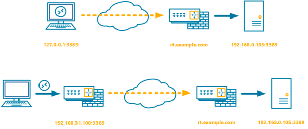В самом простом варианте мы просто устанавливаем соединение с клиентского ПК к маршрутизатору в удаленной сети, указывая в правиле трансляции целевой узел:

```
ssh -L 127.0.0.1:3389:192.168.0.105:3389 user@rt.example.com
```

Ключ **-L** указывает на то, что точка входа расположена локально, затем через двоеточие указываются адрес и порт точки входа и адрес, порт правила трансляции. Точкой выхода является узел, к которому мы подключаемся, т.е. **rt.example.com**.

Если в вашей сети также присутствует маршрутизатор (или иной Linux-сервер), то можно сделать точкой входа его, что позволит подключаться к удаленному серверу любому RDP-клиенту из локальной сети. В теории для этого следует поднять такой туннель:

```
ssh -L 192.168.31.100:3389:192.168.0.105:3389 user@rt.example.com
```

В таком случае служба SSH должна будет открыть TCP-сокет на интерфейсе 192.168.31.100, но на практике этого не произойдет. Это связано с особенностями реализации OpenSSH, который является стандартом для подавляющего большинства UNIX-подобных систем.

По умолчанию OpenSSH открывает точку входа **только на локальном интерфейсе**. В этом несложно убедиться:

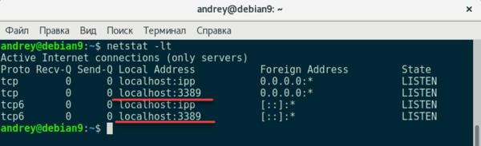Для того, чтобы предоставить доступ к TCP-сокету с внешних интерфейсов следует использовать ключ **-g**, либо добавить в конфигурационный файл **/etc/ssh/sshd_config** опцию:

```
GatewayPorts yes
```

Однако после этого сокет будет принимать соединения с **любого** сетевого интерфейса инициатора:

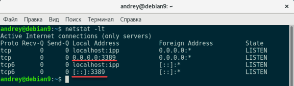:

```
iptables -A INPUT -i eth0 -p tcp --dport 3389 -j DROP
```

Таким образом рабочий туннель следует поднимать командой:

```
ssh -L -g 3389:192.168.0.105:3389 user@rt.example.com
```

Обратите внимание на еще один момент: если точка входа совпадает с локальным интерфейсом, а для OpenSSH это всегда так, то его можно опустить, сразу начиная команду с порта точки входа.

Также мы советуем использовать по возможности ключ **-g**, а не добавление опции в конфигурационный файл, так как в последнем случае вы рискуете, забыв об этой настройке, открыть наружу доступ к незащищенным службам удаленной сети.

### SSH-туннель с удаленной точкой входа

Туннель с удаленной точкой входа позволяет наоборот опубликовать любую локальную службу в удаленной сети, одно из наиболее частых применений - доступ в сети без выделенного IP-адреса, однако это требует "белый" IP со стороны сети администратора.

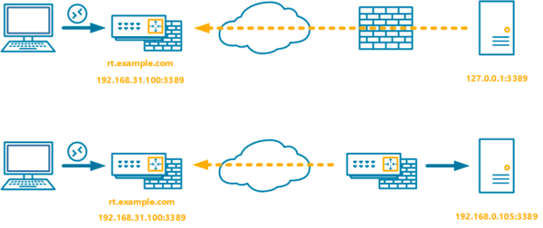В первом варианте удаленный сервер сам устанавливает подключение с маршрутизатором локальной сети. Это можно сделать простой командой:

```
ssh -R 3389:127.0.0.1:3389 user@rt.example.com
```

Ключ -R указывает открыть точку доступа с удаленной стороны туннеля, затем указываем порт для TCP-сокета и трансляцию, так как приходящие на точку выхода пакеты следует обрабатывать локально, то также указываем локальный интерфейс.

Внимательный читатель заметит, что мы не указали ключ **-g**, да, это так. Дело в том, что для туннелей с удаленной точкой входа данный ключ неприменим и следует использовать опцию

```
GatewayPorts yes
```

на стороне SSH-сервера.

В целях безопасности мы рекомендуем применять данную настройку с политикой по-умолчанию DROP для цепочки INPUT, это позволит избежать случайной публикации на внешнем интерфейсе внутренних служб и ресурсов. В минимальной конфигурации следует добавить в самое начало цепочки INPUT четыре правила:

```
iptables -P INPUT DROPiptables -A INPUT -i eth0 -m state --state ESTABLISHED,RELATED -j ACCEPTiptables -A INPUT -i eth1 -j ACCEPTiptables -A INPUT -i eth0 -p tcp --dport 22 -j ACCEPT
```

Первое из них задает запрещающую политику по умолчанию для входящих пакетов, второе разрешает входящие пакеты, инициированные самим хостом (ответы на исходящие пакеты), а третье разрешает все подключения из локальной сети. Наконец четвертое правило открывает 22 порт для входящих SSH-подключений, таким же образом можно открыть любой другой порт для внешних подключений.

Второй вариант представленный на схеме предусматривает, что SSH-туннель поднимают маршрутизаторы сетей, в этом случае команда будет выглядеть следующим образом:

```
ssh -R 3389:192.168.0.105:3389 user@rt.example.com
```

Снова обратим ваше внимание, что точка входа у нас располагается на противоположной стороне туннеля, поэтому трансляция указывается для стороны инициатора туннеля, т.е. в данном случае SSH-клиент устанавливает два соединения: одно SSH с rt.example.com, а второе RDP c 192.168.0.105, тогда как при туннеле с локальной точкой входа инициатор устанавливает единственное соединение с SSH-сервером.

### Двойной SSH-туннель

Достаточно часто возникают ситуации, когда требуется соединить два узла не имеющих выделенных IP-адресов. В этом случае обычно используется TeamViewer или аналогичное стороннее ПО, но если у вас есть доступный сервер с выделенным IP-адресом, то можно поступить проще.

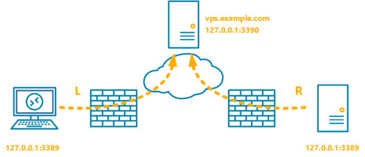Обратим внимание на схему выше. SSH позволяет строить целые цепочки туннелей, соединяя точку входа следующего с точкой выхода предыдущего. Таким образом, чтобы получить туннель с ПК админа на RDP-сервер, при этом оба узла с "серыми" IP-адресами, нам нужно создать два туннеля с промежуточным узлом.

Туннель с локальной точкой входа на ПК админа:

```
ssh -L 3389:127.0.0.1:3390 user@vps.example.com
```

И туннель с удаленной точкой входа на RDP-сервере:

```
ssh -R 3390:127.0.0.1:3389 user@vps.example.com
```

Мы специально указали на удаленном сервере нестандартный порт для большей наглядности и теперь давайте посмотрим, как все это работает. Начнем с RDP-сервера, он поднимает туннель с удаленной точкой входа, открывая на промежуточном сервере TCP-сокет, который будет принимать подключения на порт 3390, в качестве трансляции укажем сам RDP-сервер - 127.0.0.1:3389, т.е. все пришедшие на вход этого туннеля пакеты будут направлены на локальный порт 3389.

Туннель с локальной точкой входа на ПК админа открывает локальный сокет на порт 3389, куда будет подключаться RDP-клиент, в качестве трансляции мы указываем точку входа второго туннеля - 127.0.0.1:3390.

Как мы уже говорили, никаких ограничений на количество туннелей в цепочке нет, однако на практике потребность в туннелях с более чем одним промежуточным узлом возникает достаточно редко. При этом следует помнить, что с каждым новым промежуточным узлом будет падать надежность всей схемы, а итоговая скорость будет упираться в скорость самого медленного участка пути.

### Динамический SSH-туннель

В отличие от рассмотренных выше динамический туннель работает иначе, он открывает на хосте локальный TCP-сокет, который можно использовать как SOCKS4/SOCKS5 прокси для выхода в интернет через удаленный SSH-сервер. Это может быть полезно для обхода некоторых ограничений, когда поднимать полноценный VPN в другой юрисдикции нет необходимости, а использовать публичные прокси или VPN нельзя по соображениям безопасности.

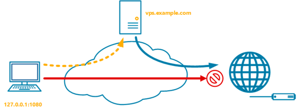

Такой вид туннеля особенно удобен, если требуется разовый выход в интернет с другого узла. Простой пример: мой хороший знакомый привез из Штатов два операторских контрактных iPhone и попросил их разблокировать. Сложностей данная операция не таит, если условия контракта не были нарушены, то достаточно зайти на сайт оператора и заполнить заявку на разблокировку. Но проблема оказалась в том, что у оператора T-Mobile доступ к данному разделу сайта был доступен только для жителей США, а соединения с публичных прокси и VPN отвергались как небезопасные.

Динамический SSH-туннель позволил быстро решить эту проблему используя VPS в Штатах. Чтобы создать такой туннель введите команду:

```
ssh -D 1080 user@vps.example.com
```

Где 1080 - порт на котором будет доступен наш SOCKS-прокси. Остается только настроить браузер на использование локального прокси-сервера.

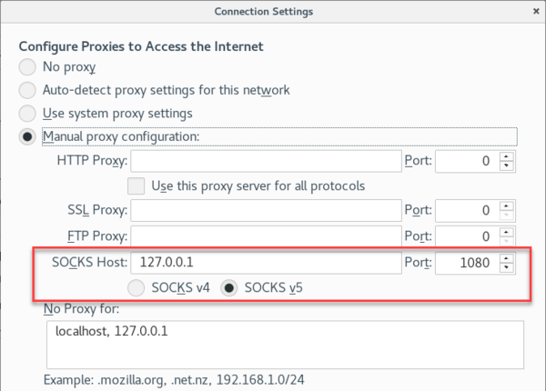Еще одним плюсом подобного метода является то, что прокси-сервер существует только локально на вашем хосте, никаких дополнительных портов во внешнюю сеть открывать не надо, а между клиентом и сервером существует только SSH-соединение.

Это позволяет скрыть от постороннего наблюдателя характер вашей интернет-деятельности, что может быть полезно в публичных сетях, где есть веские основания предполагать, что трафик может быть перехвачен и проанализирован третьими лицами. В этом случае SSH-туннель обеспечивает надежное шифрование передаваемых данных в небезопасной сети, но это требует полного доверия к тому серверу, через который вы выходите в интернет.

### Несколько слов о безопасности

Хоть это и выходит за рамки темы статьи, мы не могли упомянуть об одной особенности, которая может преподнести достаточно неприятные сюрпризы. Подняв SSH-туннель одной из приведенных выше команд, вы получите кроме туннеля также открытую консоль на сервере, к которому подключаетесь. Внимательно посмотрите на строку приглашения на скриншоте ниже.

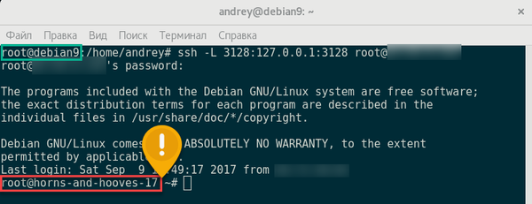Вверху мы видим приглашение локального хоста, а внизу, после поднятия туннеля - уже удаленного сервера. Это удобно, если нужно проверить канал связи или выполнить определенные настройки с удаленной стороны, но в обычной жизни это может привести к серьезным неприятностям, если вы забудете или не обратите внимание на то, к какому серверу подключена консоль и выполните на удаленном сервере команды, предназначенные локальному узлу, особенно если вы подключаетесь с правами суперпользователя.

Поэтому после того, как вы проверили работоспособность туннеля запускать его следует с ключом -N, который запрещает выполнение команд на удаленном сервере, например:

```
ssh -N -L -g 3389:192.168.0.105:3389 user@rt.example.com
```

И, конечно же, не следует использовать для подключения к серверу аккаунт суперпользователя, лучше всего заведите для этих целей обычную учетную запись.

### SSH-туннели в Windows

На протяжении всей статьи мы рассматривали SSH-туннели на примере Linux-систем и у пользователей Windows могло сложиться впечатление, что им данные возможности недоступны. Но это не так, под Windows существует множество SSH-клиентов, которые поддерживают создание тоннелей. Мы будем рассматривать наиболее популярного из них - [PuTTY](https://www.chiark.greenend.org.uk/~sgtatham/putty/latest.html). Также под Windows можно запустить и SSH-сервер, но это требует определенной квалификации и не всегда можно добиться стабильной работы, поэтому этот вариант мы рассматривать не будем.

Откроем PuTTY и в левой части дерева перейдем в **Connection - SSH -Tunnels**:

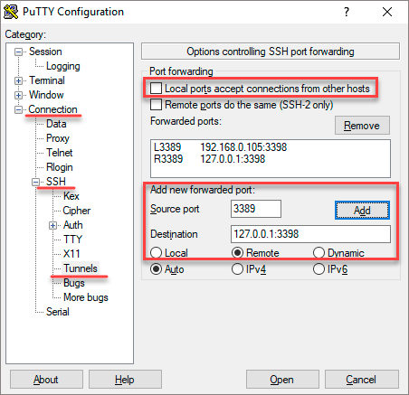Перед нами откроется следующее окно, основные настройки туннеля сосредоточены внизу, и мы выделили их красной рамкой. **Source port** - предназначен для указания порта точки входа, которая всегда располагается на локальном интерфейсе (127.0.0.1). **Destination** - трансляция, т.е. куда будут отправлены пакеты с точки выхода. Радиопереключатели **Local - Remote - Dynamic** задают тип туннеля и аналогичны ключам **-L**, **-R** и **-D**.

После того, как вы заполнили все необходимые поля можно добавить туннель кнопкой **Add**. Чтобы разрешить внешним узлам доступ к локальному сокету точки входа установите галочку **Local ports accept connections from other hosts**. В данном случае следует также ограничить доступ к открытым портам средствами брандмауэра Windows или стороннего сетевого фильтра.

Сервер, к которому мы подключаемся, задается в ином разделе - **Session**, который знаком каждому, кто хоть раз использовал PuTTY, там же вы можете сохранить параметры сессии для дальнейшего использования.

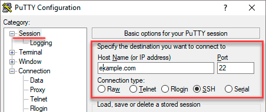Как видим, SSH дает в руки администратора гибкий и мощный инструмент для безопасного удаленного доступа без необходимости открытия портов или организации VPN-каналов. Надеемся, что данный материал окажется вам полезен и позволит освоить новые возможности на первый взгляд привычных инструментов.
