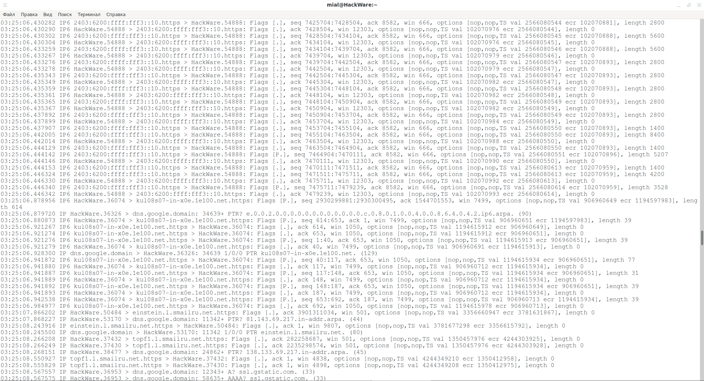
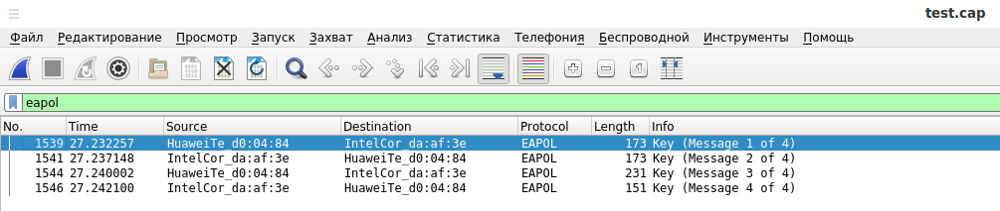
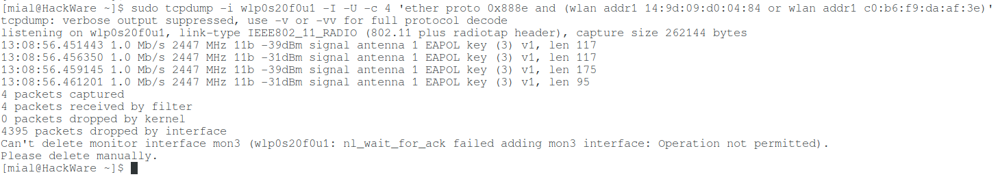
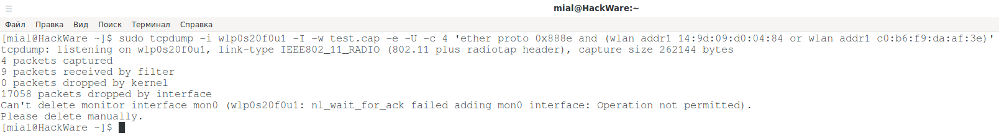
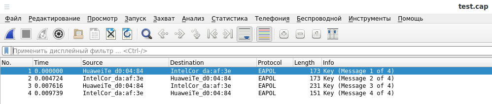

[источник](https://hackware.ru/?p=10246)

- [ 1. Программа tcpdump. Различия tcpdump и Wireshark ](#link_1)
  - [ Различия tcpdump и Wireshark ](#link_2)
  - [ Как установить tcpdump в Linux ](#link_3)
- [ 2. Как запустить tcpdump. Сетевые интерфейсы для захвата данных. Смена сетевого интерфейса для захвата и захват со всех интерфейсов сразу ](#link_4)
  - [ Как запустить tcpdump ](#link_5)
  - [ Опции и фильтры tcpdump ](#link_6)
  - [ Захват пакетов с определённого интерфейса ](#link_7)
  - [ Как захватывать и анализировать трафик со всех интерфейсов в tcpdump ](#link_8)
  - [ Как посмотреть, какие интерфейсы имеются в системе ](#link_9)
  - [ Показ поддерживаемых каналов передачи данных для сетевого интерфейса ](#link_10)
- [ 3. Фильтрация Ethernet трафика и протоколов локальной сети ](#link_11)
  - [ Как отфильтровать фреймы по MAC-адресу в tcpdump ](#link_12)
  - [ Как в tcpdump показать только фреймы, источником которых является определённый MAC-адрес ](#link_13)
  - [ Как в tcpdump показать только фреймы, предназначенные для определённого MAC-адреса ](#link_14)
  - [ Как отфильтровать ARP в tcpdump ](#link_15)
  - [ Фильтр широковещательных пакетов Ethernet ](#link_16)
  - [ Фильтр многоадресных пакетов Ethernet ](#link_17)
  - [ Как показать MAC-адреса в tcpdump ](#link_18)
- [ 4. Фильтры IP протокола: фильтрация трафика определённых IP, диапазонов IP адресов и подсетей в tcpdump ](#link_19)
  - [ Фильтрация IP трафика ](#link_20)
  - [ Фильтр пакетов по IP ](#link_21)
  - [ Захват пакетов, пришедших с определённого IP ](#link_22)
  - [ Анализ пакетов, отправленных на определённый IP ](#link_23)
  - [ Захват пакетов для диапазона IP адресов ](#link_24)
  - [ Как в tcpdump фильтровать пакеты отправленные на диапазон IP адресов ](#link_25)
  - [ Как в tcpdump фильтровать пакеты пришедшие из диапазона IP (подсети) ](#link_26)
  - [ Показ широковещательных пакетов IPv4 ](#link_27)
  - [ Показ многоадресных пакетов ](#link_28)
  - [ Как отфильтровать только входящий или только исходящий трафик в ](#link_29)
- [ 5. Фильтры транспортных протоколов TCP и UDP в tcpdump (фильтрация по номеру порта, диапазонам портов) ](#link_30)
  - [ Фильтрация только IP или IPv6 трафика ](#link_31)
  - [ Захват только TCP пакетов ](#link_32)
  - [ Захват только UDP пакетов ](#link_33)
  - [ Захват пакетов определённого порта ](#link_34)
  - [ Фильтрация по порту назначения ](#link_35)
  - [ Фильтрация по порту на локальной машине ](#link_36)
  - [ Фильтрация по диапазону портов ](#link_37)
  - [ Фильтрация по диапазону портов удалённого хоста ](#link_38)
  - [ Фильтрация по диапазону портов локального хоста ](#link_39)
  - [ Захват TCP пакетов с определёнными комбинациями флагов (SYN-ACK, URG-ACK и пр.) ](#link_40)
- [ 6. Фильтрация IPv6 трафика ](#link_41)
  - [ Как показать IPv6 трафик в tcpdump ](#link_42)
  - [ Как в tcpdump выводить одновременно IPv4 и IPv6 трафик ](#link_43)
  - [ Как отфильтровать TCP трафик IPv6 ](#link_44)
  - [ Как отфильтровать UDP трафик IPv6 ](#link_45)
  - [ Как отфильтровать ICPM6 ](#link_46)
  - [ Как отфильтровать пакеты ARP протокола для IPv6 ](#link_47)
  - [ Какие типы пакетов ICPM6 поддерживаются в tcpdump для фильтрации ](#link_48)
  - [ Фильтр многоадресных пакетов IPv6 ](#link_49)
  - [ Фильтр широковещательных пакетов IPv6 ](#link_50)
  - [ Как отфильтровать по IPv6 адресу ](#link_51)
  - [ Фильтр трафика, отправленного с определённого IPv6 адреса ](#link_52)
  - [ Как показать трафик, отправленный на определённый IPv6 адрес ](#link_53)
  - [ Как отфильтровать по диапазону IPv6 адресов ](#link_54)
  - [ Захват пакетов, пришедших из подсети IPv6 ](#link_55)
  - [ Захват пакетов, отправленных в подсеть IPv6 ](#link_56)
  - [ Как отфильтровать IPv6 трафик по номеру порта ](#link_57)
  - [ IPv6 трафик пришедший на указанный порт ](#link_58)
  - [ IPv6 трафик отправленный с указанного порта ](#link_59)
  - [ Как отфильтровать IPv6 трафик по диапазону портов ](#link_60)
  - [ Фильтрация IPv6 по диапазону портов удалённого хоста ](#link_61)
  - [ Фильтрация IPv6 по диапазону портов локального хоста ](#link_62)
- [ 7. Комбинирование фильтров tcpdump ](#link_63)
- [ 8. Настройка вывода tcpdump ](#link_64)
  - [ Печать содержимого сетевых пакетов в ASCII ](#link_65)
  - [ Показ захваченных сетевых пакетов в шестнадцатеричном виде и в ASCII ](#link_66)
  - [ Как в tcpdump выводить адреса и номера портов в числовом виде ](#link_67)
  - [ Как выводить MAC адреса в tcpdump ](#link_68)
  - [ Настройка подробности вывода tcpdump ](#link_69)
  - [ Настройка времени в tcpdump ](#link_70)
  - [ Номера пакетов ](#link_71)
- [ 9. Сохранение сетевых пакетов в файл. Анализ файла с сетевыми пакетами ](#link_72)
  - [ Захват и сохранение пакетов в файл ](#link_73)
  - [ Чтение файла захвата ](#link_74)
- [ 10. Ограничение количества захваченных сетевых данных ](#link_75)
  - [ Ограничение количества захваченных пакетов ](#link_76)
  - [ Ограничение на размер файла захвата tcpdump ](#link_77)
  - [ Настройка количества файлов для ротации в tcpdump ](#link_78)
  - [ Автоматическое выполнение команды после ротации файлов tcpdump ](#link_79)
- [ 11. Захват трафика беспроводных сетей ](#link_80)
  - [ Можно ли в tcpdump захватывать трафик Wi-Fi ](#link_81)
  - [ Режим монитора в tcpdump. Как перевести Wi-Fi карту в режим монитора ](#link_82)
  - [ Как выводить MAC адреса в tcpdump ](#link_83)
  - [ Как захватить рукопожатие в tcpdump ](#link_84)
  - [ Фильтры tcpdump для Wi-Fi ](#link_85)
  - [ Фильтрация различных типов пакетов Wi-Fi в tcpdump ](#link_86)
- [ 12. Практические примеры использования tcpdump ](#link_87)
  - [ Как проверить настройку прокси ](#link_88)
  - [ Как найти подключения к SSH. Как найти подключения к SSH на нестандартном порту ](#link_89)
- [ 13. Формат выводимых данных ](#link_90)
- [ 14. Справочная информация по всем фильтрам tcpdump. Применение экранирования в фильтрах tcpdump ](#link_91)
  - [ Справка по фильтрам tcpdump ](#link_92)
  - [ Экранирование в фильтрах tcpdump ](#link_93)
- [ Связанные статьи:](#link_94)

## 1. Программа tcpdump. Различия tcpdump и Wireshark <a name="link_1"></a>

tcpdump — это самый мощный и широко используемый сниффер пакетов с интерфейсом командной строки. Эта программа представляет собой анализатор пакетов, который используется для захвата или фильтрации разнообразных сетевых пакетов: несмотря на название, данный инструмент может захватывать и фильтровать не только пакеты TCP/IP, но и всё семейство IP протоколов (icmp, icmp6, igmp, igrp, pim, ah, esp, vrrp, udp, tcp), семейство протоколов Ethernet (ip, ip6, arp, rarp, atalk, aarp, decnet, sca, lat, mopdl, moprc, iso, stp, ipx, netbeui). Дополнительно программа поддерживает работу с пакетами беспроводных сетей (IEEE 802.11, то есть Wi-Fi и другие), поддерживает IPv6 и имеет очень гибкую систему фильтров.

Программа анализирует (или захватывает) пакеты на указанном интерфейсе, но также может работать сразу со всеми интерфейсами. Она доступна в операционных системах на основе Linux/Unix. Программа умеет не только анализировать живой поток данных, но и умеет их сохранять для последующего анализа в tcpdump или с использованием [Wireshark](https://kali.tools/?p=1407) (сетевой анализатор протоколов с графическим пользовательским интерфейсом), которая поддерживает формат файлов tcpdump pcap.

### Различия tcpdump и Wireshark <a name="link_2"></a>

Программа Wireshark также предназначена для захвата и анализа сетевых пакетов. У программы Wireshark имеется графический интерфейс и вариант с интерфейсом командной строки; у tcpdump только интерфейс командной строки

Программа Wireshark поддерживает два вида фильтров:

- фильтры захвата
- фильтры отображения

Фильтры захвата Wireshark идентичны фильтрам tcpdump. В Wireshark и tcpdump фильтры захвата применяются для фильтрации данных, которые будут сохранены в файл (или выведены на экран). Что касается фильтров отображения Wireshark, то они не влияют на количество захваченных и сохранённых данных, а используются только для фильтрации показываемой информации. Фильтры отображения Wireshark и фильтры захвата tcpdump/Wireshark поддерживают:

- Трафик протоколов канального уровня
- Трафик протоколов межсетевого уровня
- Трафик протоколов транспортного уровня
- Фильтры для Wi-Fi фреймов

Фильтры отображения Wireshark поддерживают все возможности фильтров захвата, а также дополнительно:

- Трафик протоколов прикладного уровня (HTTP, DNS, SSH, FTP, SMTP, RDP, SNMP, RTSP, GQUIC, CDP, LLMNR, SSDP и многие другие)

Кроме того, программа Wireshark имеет больше инструментов для анализа сетевых данных и наглядности их отображения.

Итак, программа Wireshark больше подходит для анализа трафика протоколов прикладного уровня и анализа связанных потоков данных.

Что касается tcpdump, то она будет работать в условиях отсутствия графического окружения. Также эта программа отлично подходит для захвата сетевого трафика и его фильтрации по заданным критериям. Tcpdump тоже может применяться для выполнения разного рода анализа и тестирования сетевых настроек.

Смотрите также справочный материал «[Фильтры Wireshark](https://hackware.ru/?p=7008)».

### Как установить tcpdump в Linux <a name="link_3"></a>

Многие дистрибутивы Linux поставляются уже с tcpdump. В случае, если эта программа отсутствует, вам достаточно установить пакет tcpdump из стандартных репозиториев:

Установка в Debian, Linux Mint, Ubuntu, Kali Linux и их производные:

```
sudo apt install tcpdump
```

Установка в Arch Linux, BlackArch и производные:

```
sudo pacman -S tcpdump
```

Установка в CentOS и другие родственные дистрибутивы:

```
yum install tcpdump
```

После установки программы tcpdump в систему, вы можете продолжать исследовать следующие примеры команды.

## 2. Как запустить tcpdump. Сетевые интерфейсы для захвата данных. Смена сетевого интерфейса для захвата и захват со всех интерфейсов сразу <a name="link_4"></a>

### Как запустить tcpdump <a name="link_5"></a>

Утилиту tcpdump можно запустить без опций, но она требует повышенных привилегий:

```
sudo tcpdump
```

В случае запуска без опций, tcpdump самостоятельно выберет интерфейс для захвата и анализа трафика — обычно это первый настроенный интерфейс с наименьшим номером, петлевые интерфейсы пропускаются.



Окно программы будет автоматически прокручиваться по мере сниффинга новых пакетов. Для остановки захвата нажмите **CTRL+c**.

### Опции и фильтры tcpdump <a name="link_6"></a>

Работа tcpdump и захватываемые и отображаемые ей данные регулируются опциями программы и фильтрами для выбора только сетевых пакетов, которые удовлетворяют указанным в выражении фильтра условиям.

В качестве выражения фильтров tcpdump используются фильтры pcap (библиотека по захвату пакетов). Выражение фильтров следует после опций и может быть помещено в одинарные кавычки, если в нём содержаться специальные символы.

Выражение фильтра может быть помещено в файл, который в программу передаётся опцией **-F**. Если в командной строке указано ещё одно выражение фильтра, то оно игнорируется.

Смотрите также справочную информацию «[Формат tcpdump (фильтры pcap)](https://zalinux.ru/?p=3185)».

### Захват пакетов с определённого интерфейса <a name="link_7"></a>

Если программа tcpdump неправильно выбрала интерфейс, то вы можете указать его явно с помощью опции **-i**:

```
sudo tcpdump -i wlo1
```

### Как захватывать и анализировать трафик со всех интерфейсов в tcpdump <a name="link_8"></a>

Если с опцией **-i** указать слово **any**, то программа будет захватывать со всех доступных в системе интерфейсов:

```
sudo tcpdump -i any
```

### Как посмотреть, какие интерфейсы имеются в системе <a name="link_9"></a>

Чтобы вывести список доступных в системе интерфейсов, запустите команду с опцией **-D**:

```
sudo tcpdump -D
```

Будут выведены сетевые интерфейсы, которые доступны в системе и на которых tcpdump может захватывать пакеты. Для каждого интерфейса будет показан номер и имя интерфейса, далее может идти текстовое описание этого интерфейса. Имя интерфейса или его номер можно указать с флагом -i (выбор интерфейса для захвата).

Это может быть полезно на системах, где нет команды для их вывода (например, системы Windows или UNIX системы, на которых отсутствуют программы ip a или ifconfig -a; номер может оказаться полезным на Windows 2000 и более поздних системах, где именем интерфейса является довольно сложная строка.

### Показ поддерживаемых каналов передачи данных для сетевого интерфейса <a name="link_10"></a>

Опция **-L** выведет список известных типов каналов передачи данных для выбранного интерфейса в указанном режиме и завершите работу. Список известных типов каналов передачи данных может зависеть от указанного режима; например, на некоторых платформах интерфейс Wi-Fi может поддерживать один набор типов каналов передачи данных, когда он не находится в режиме мониторинга (например, он может поддерживать только поддельные заголовки Ethernet или может поддерживать заголовки 802.11, но не поддерживает заголовки 802.11 с радиоинформацией) и другой набор типов каналов передачи данных в режиме мониторинга (например, он может поддерживать заголовки 802.11 или заголовки 802.11 с радиоинформацией, только в режиме мониторинга).

Пример команды:

```
sudo tcpdump -i wlp0s20f0u1 -L
```

Пример вывода для Wi-Fi интерфейса:

```
Data link types for wlp0s20f0u1 when not in monitor mode (use option -y to set):
  EN10MB (Ethernet)
```

Опция **-I** переводит Wi-Fi интерфейс в режим монитора (об этом в одном из следующих разделов), в данной команде опция **-I** комбинируется с **-L** чтобы посмотреть на тип канала передачи данных когда беспроводная карта будет в режиме монитора:

```
sudo tcpdump -i wlp0s20f0u1 -L -I
```

Пример вывода:

```
Data link types for wlp0s20f0u1 when in monitor mode (use option -y to set):
  IEEE802_11_RADIO (802.11 plus radiotap header)
```

Следующая команда проверить типы каналов передачи для проводного интерфейса:

```
sudo tcpdump -i enp3s0 -L
```

Пример вывода:

```
Data link types for enp3s0 (use option -y to set):
  EN10MB (Ethernet)
  DOCSIS (DOCSIS) (printing not supported)
```

## 3. Фильтрация Ethernet трафика и протоколов локальной сети <a name="link_11"></a>

В следующих командах в качестве примера выбран MAC-адрес c0:b6:f9:da:af:3e — при запуске команд заменяйте это значение на интересующий вас аппаратный адрес.

### Как отфильтровать фреймы по MAC-адресу в tcpdump <a name="link_12"></a>

Чтобы увидеть только фреймы, которые отправлены на определённый MAC-адрес или исходят от этого аппаратного адреса в Ethernet сети, используйте конструкцию **ether host MAC**, например:

```
sudo tcpdump ether host c0:b6:f9:da:af:3e
```

### Как в tcpdump показать только фреймы, источником которых является определённый MAC-адрес <a name="link_13"></a>

Чтобы в локальной сети отфильтровать фреймы, которые исходят с определённого аппаратного адреса используйте **ether src MAC**, например:

```
sudo tcpdump ether src c0:b6:f9:da:af:3e
```

### Как в tcpdump показать только фреймы, предназначенные для определённого MAC-адреса <a name="link_14"></a>

Чтобы в локальной сети отфильтровать фреймы, которые пришла на определённый аппаратный адрес используйте ether dst MAC, например:

```
sudo tcpdump ether dst c0:b6:f9:da:af:3e
```

### Как отфильтровать ARP в tcpdump <a name="link_15"></a>

Чтобы показать или сохранить только фреймы протокола ARP, используйте соответствующий фильтр:

```
sudo tcpdump arp
```

### Фильтр широковещательных пакетов Ethernet <a name="link_16"></a>

Для показа только широковещательных (broadcast) пакетов локальной сети запустите команду:

```
sudo tcpdump ether broadcast
```

### Фильтр многоадресных пакетов Ethernet <a name="link_17"></a>

Для показа только многоадресных пакетов (multicast) запустите команду:

```
sudo tcpdump ether multicast
```

Альтернативный вариант этой же команды:

```
sudo tcpdump 'ether[0] & 1 != 0'
```

### Как показать MAC-адреса в tcpdump <a name="link_18"></a>

Если вам нужно, чтобы для каждого пакета таких протоколов как Ethernet и IEEE 802.11 показывался MAC-адрес, то добавьте к команде опцию **-e**

```
sudo tcpdump -e
```

Эту опцию можно сочетать с фильтрами:

```
sudo tcpdump -e ether host c0:b6:f9:da:af:3e
```

## 4. Фильтры IP протокола: фильтрация трафика определённых IP, диапазонов IP адресов и подсетей в tcpdump <a name="link_19"></a>

### Фильтрация IP трафика <a name="link_20"></a>

Чтобы отфильтровать трафик протоколов канального уровня, запустите команду:

```
sudo tcpdump ip
```

### Фильтр пакетов по IP <a name="link_21"></a>

Для показа всех пакетов, которые пришли с указанного IP или отправлены на определённый IP используется команда вида:

```
sudo tcpdump host IP_АДРЕС
```

Вместо **IP_АДРЕСа** можно указать домен сайта:

```
sudo tcpdump host suay.ru
```

Или любое другое имя хоста, которое в данной сети может быть преобразовано в IP:

```
sudo tcpdump host HackWare
```

### Захват пакетов, пришедших с определённого IP <a name="link_22"></a>

Чтобы в tcpdump захватывать пакеты, которые пришли с определённого IP адреса, используйте слово **src**, после которого укажите интересующий вас IP:

```
sudo tcpdump src host 192.168.1.1
```

### Анализ пакетов, отправленных на определённый IP <a name="link_23"></a>

Для захвата пакетов, которые предназначены для отправки на указанный IP адрес, используется ключевое слово **dst**. Следующая команда захватит только пакеты, которые направляются к хосту с адресом 157.245.118.66:

```
sudo tcpdump dst host 157.245.118.66
```

В этой и предыдущей команде в качестве **ХОСТа** можно указывать любое имя, которое в данной сети может быть преобразовано в IP.

### Захват пакетов для диапазона IP адресов <a name="link_24"></a>

tcpdump поддерживает несколько вариантов указания подсетей для фильтрации пакетов.

Первый вариант:

```
sudo tcpdump net СЕТЬ
```

В качестве **СЕТЬ** можно указать полный IP адрес, например

```
sudo tcpdump net 192.168.1.1
```

А также можно указать только три октета IP адреса:

```
sudo tcpdump net 192.168.1
```

Два октета IP адреса:

```
sudo tcpdump net 192.168
```

Или один октет IP адреса:

```
sudo tcpdump net 192
```

В случае указания полного IP адреса, будут показаны только пакеты, которые отправлены или получены с этого адреса. В случае указания неполного IP, будут показаны все пакеты, часть адреса которых соответствуют указанному фрагменту IP (в случаях указания 4, 3, 2 и 1 октетов сетевыми масками являются, соответственно, 255.255.255.255, 255.255.255.0, 255.255.0.0 и 255.0.0.0).

Другими вариантами указания сети являются:

```
sudo tcpdump net СЕТЬ mask МАСКА_СЕТИ
```

Например:

```
sudo tcpdump net 192.168.1.0 mask 255.255.255.0
```

И ещё один вариант натации подсети:

```
sudo tcpdump net СЕТЬ/ДЛИНА
```

Например:

```
sudo tcpdump net 192.168.1.0/24
```

### Как в tcpdump фильтровать пакеты отправленные на диапазон IP адресов <a name="link_25"></a>

Для показа только покетов, которые предназначены для определённой подсети, имеется несколько поддерживаемых нотаций.

Первая:

```
sudo tcpdump dst net СЕТЬ
```

В ней в каче **СЕТЬ** можно указать как полный IP адрес, так и 3, 2 или 1 его октет — смотрите примеры для предыдущего пункта.

Второй вариант фильтрации пакетов отправленных в подсеть:

```
sudo tcpdump dst net СЕТЬ mask МАСКА_СЕТИ
```

Третий вариант (реальные примеры команд смотрите в предыдущем пункте):

```
sudo tcpdump dst net СЕТЬ/ДЛИНА
```

### Как в tcpdump фильтровать пакеты пришедшие из диапазона IP (подсети) <a name="link_26"></a>

Для показа только покетов, которые пришли из определённой подсети, можно использовать любую из следующих нотаций:

```
sudo tcpdump src net СЕТЬ
```

В качестве **СЕТЬ** может быть часть IP адреса (не все октеты).

Также вы можете указать диапазон подсети следующим образом:

```
sudo tcpdump src net СЕТЬ mask МАСКА_СЕТИ
```

Или с помощью такой нотации:

```
sudo tcpdump src net СЕТЬ/ДЛИНА
```

### Показ широковещательных пакетов IPv4 <a name="link_27"></a>

Для вывода только broadcast пакетов используйте команду фильтром:

```
sudo tcpdump ip broadcast
```

Этот фильтр проверят оба варианта записи широковещательных адресов: все нули и все единицы и ищет маску подсети на интерфейсе, на котором выполняется захват.

### Показ многоадресных пакетов <a name="link_28"></a>

Для вывода многоадресных пакетов IPv4 запустите команду:

```
sudo tcpdump ip multicast
```

### Как отфильтровать только входящий или только исходящий трафик в <a name="link_29"></a>

С опцией **-Q** вы можете указать направление движение пакетов, которое должно быть захвачено. Возможными значениями являются «**in**» (только входящий трафик), «**out**» (только исходящий трафик) и «**inout**» (входящий и исходящий трафик).

Например, для захвата только входящего трафика используйте команду:

```
sudo tcpdump -Q in
```

Для захвата только исходящего трафика запустите:

```
sudo tcpdump -Q out
```

Эта опция работает не на всех платформах.

## 5. Фильтры транспортных протоколов TCP и UDP в tcpdump (фильтрация по номеру порта, диапазонам портов) <a name="link_30"></a>

### Фильтрация только IP или IPv6 трафика <a name="link_31"></a>

Все последующие команды будут показывать трафик для обоих межсетевых протоколов: IP и IPv6.

Если вы хотите ограничить трафик только IP, то добавьте к любой из команд этого раздела **and ip**

Например, команда

```
sudo tcpdump tcp
```

превратиться в

```
sudo tcpdump tcp and ip
```

Если вы хотите ограничить трафик только IPv6, то добавьте к любой из команд этого раздела **and ip6**

Например, команда

```
sudo tcpdump tcp
```

превратиться в

```
sudo tcpdump tcp and ip6
```

### Захват только TCP пакетов <a name="link_32"></a>

Для захвата только пакетов протокола TCP, добавьте к команде фильтр **tcp**:

```
sudo tcpdump tcp
```

### Захват только UDP пакетов <a name="link_33"></a>

Для фильтрации UDP трафика выполните команду:

```
sudo tcpdump udp
```

### Захват пакетов определённого порта <a name="link_34"></a>

Допустим нужно захватить пакеты, которые отправлены или пришли на определённый порт, в этом случае после слова **port** укажите номер интересующего вас порта:

```
sudo tcpdump port ПОРТ
```

Эта и последующие команды с фильтрами портов применяются только для **ip/tcp**, **ip/udp**, **ip6/tcp** или **ip6/udp** протоколов — во всех остальных случаях данные не выводятся.

Порт может быть числом или именем, используемым в **/etc/services**. Если используется имя, то на соответствие проверяются и номер порта, и протокол. Если используется число или двусмысленное имя, то проверяется только номер порта. Например **dst port 513** напечатает оба **tcp/login** трафик и **udp/who** трафик, а **port domain** напечатает оба **tcp/domain** и **udp/domain** трафик).

В этой и последующих командах фильтрации по портам, можно явно указать протокол, для этого любому из приведённых выражений с портом или диапазоном портов могут предшествовать ключевые слова **tcp** или **udp** как в

```
sudo tcpdump tcp port ПОРТ
```

которому соответствуют только **tcp** пакеты, чей порт есть ПОРТ.

### Фильтрация по порту назначения <a name="link_35"></a>

Если нужно показать только трафик, который отправлен на определённый порт на удалённом хосте, то используйте команду вида:

```
sudo tcpdump dst port ПОРТ
```

### Фильтрация по порту на локальной машине <a name="link_36"></a>

Для фильтрации трафика, который исходит с определённого порта на локальной машине, используйте команду вида:

```
sudo tcpdump src port ПОРТ
```

### Фильтрация по диапазону портов <a name="link_37"></a>

Для фильтрации по диапазону портов, которые использовались в качестве порта отправки трафика или порта на удалённой системе, используется команда вида:

```
sudo tcpdump portrange ПОРТ1-ПОРТ2
```

То есть для указания диапазона портов два крайних значения нужно записать через дефис. В результате будет показан весь трафик, который в качестве исходящего или конечного порта использует номер порта, входящий в этот диапазон.

### Фильтрация по диапазону портов удалённого хоста <a name="link_38"></a>

Чтобы показать только трафик, который отправился на один из портов в указанном диапазоне, используется команда вида:

```
sudo tcpdump dst portrange ПОРТ1-ПОРТ2
```

### Фильтрация по диапазону портов локального хоста <a name="link_39"></a>

Можно показать только пакеты, которые были отправлены с одного из портов на локальной машине, входящего в указанный диапазон портов:

```
sudo tcpdump src portrange ПОРТ1-ПОРТ2
```

### Захват TCP пакетов с определёнными комбинациями флагов (SYN-ACK, URG-ACK и пр.) <a name="link_40"></a>

В разделе контрольных битов заголовка TCP есть 8 битов:

- **CWR**
- **ECE**
- **URG**
- **ACK**
- **PSH**
- **RST**
- **SYN**
- **FIN**

Давайте предположим, что мы хотим просматривать пакеты, используемые при установлении TCP-соединения. Вспомним, что при инициализации нового соединения TCP использует протокол трёх этапного рукопожатия; последовательность соединений относительно контрольных битов TCP:

1. Инициатор отправляет SYN
2. Получатель отвечает SYN, ACK
3. Инициатор отправляет ACK

Теперь мы заинтересованы в захвате пакетов, в которых установлен только бит SYN (шаг 1). Обратите внимание, что нам не нужны пакеты с шага 2 (SYN-ACK), просто начальный SYN. Нам нужно правильное выражение фильтра для tcpdump.

Напомним структуру заголовка TCP без параметров:

```
0                              15                              31
-----------------------------------------------------------------
|         исходный порт         |        порт назначения        |
-----------------------------------------------------------------
|                  номер в последовательности                   |
-----------------------------------------------------------------
|                      номер подтверждения                      |
-----------------------------------------------------------------
|  HL   | rsvd  |C|E|U|A|P|R|S|F|        размер окна            |
-----------------------------------------------------------------
|    контрольная сумма TCP      |     указатель срочности       |
-----------------------------------------------------------------
```

Заголовок TCP обычно содержит 20 октетов данных, если опции отсутствуют. Первая строка графика содержит октеты 0 - 3, вторая строка - октеты 4 - 7 и т. д.

Начиная отсчёт с 0, соответствующие биты управления TCP содержатся в октете 13:

```
0             7 |             15|             23|             31
----------------|---------------|---------------|----------------
|  HL   | rsvd  |C|E|U|A|P|R|S|F|        размер окна            |
----------------|---------------|---------------|----------------
|               |   13й октет   |               |               |
```

Давайте внимательнее посмотрим на октет №. 13:

```
|               |
|---------------|
|C|E|U|A|P|R|S|F|
|---------------|
|7   5   3     0|
```

Это интересующие нас биты TCP. Мы пронумеровали биты в этом октете от 0 до 7 справа налево, поэтому бит PSH — это бит 3, а бит URG — 5.

Напомним, что мы хотим захватывать пакеты только с установленным SYN. Давайте посмотрим, что происходит с октетом 13, если приходит датаграмма TCP с битом SYN, установленным в его заголовке:

```
|C|E|U|A|P|R|S|F|
|---------------|
|0 0 0 0 0 0 1 0|
|---------------|
|7 6 5 4 3 2 1 0|
```

Глядя на раздел битов управления, мы видим, что установлен только бит номер 1 (SYN).

Предполагая, что октет номер 13 является 8-разрядным целым числом без знака в порядке сетевых байтов, двоичное значение этого октета равно

```
00000010
```

и его десятичное представление

```
0*2^7 + 0*2^6 + 0*2^5 + 0*2^4 + 0*2^3 + 0*2^2 + 1*2^1 + 0*2^0 = 2
```

Мы почти закончили, потому что теперь мы знаем, что если установлен только SYN, значение 13-го октета в заголовке TCP, если интерпретировать его как 8-разрядное целое число без знака в порядке сетевых байтов, должно быть ровно 2.

Эта связь может быть выражена как

```
tcp[13] == 2
```

Мы можем использовать это выражение в качестве фильтра для tcpdump для просмотра пакетов, в которых установлен только SYN:

```
tcpdump -i xl0 tcp[13] == 2
```

Выражение говорит: «пусть 13-й октет дейтаграммы TCP имеет десятичное значение 2», и это именно то, что нам нужно.

Теперь давайте предположим, что нам нужно перехватить пакеты SYN, но нам все равно, установлен ли одновременно с ним ACK или любой другой бит управления TCP. Давайте посмотрим, что происходит с октетом 13, когда приходит TCP датаграмма с установленным SYN-ACK:

```
|C|E|U|A|P|R|S|F|
|---------------|
|0 0 0 1 0 0 1 0|
|---------------|
|7 6 5 4 3 2 1 0|
```

Теперь биты 1 и 4 установлены в 13-м октете. Двоичное значение октета 13 равно

```
00010010
```

что при переводе в десятичное представление даёт

```
0*2^7 + 0*2^6 + 0*2^5 + 1*2^4 + 0*2^3 + 0*2^2 + 1*2^1 + 0*2^0 = 18
```

Теперь мы не можем просто использовать 'tcp[13] == 18' в выражении фильтра tcpdump, потому что это выберет только те пакеты, у которых установлен SYN-ACK, но не те, у которых установлен только SYN. Помните, что нам все равно, установлен ли ACK или любой другой бит управления, пока установлен SYN.

Чтобы достичь нашей цели, нам нужно выполнить логическую операцию И между бинарным значением октета 13 с другим значением, которое сохранит бит SYN. Чтобы этого добиться, нужно выполнить операцию логическое И между значением 13-го октета и бинарным значением SYN:

```
     00010010 SYN-ACK              00000010 SYN
AND  00000010 (мы хотим SYN)  AND  00000010 (мы хотим SYN)
     --------                      --------
=    00000010                 =    00000010
```

Мы видим, что эта операция И даёт один и тот же результат независимо от того, установлен ли ACK или другой бит управления TCP. Десятичное представление значения AND, а также результат этой операции равен 2 (двоичный 00000010), поэтому мы знаем, что для пакетов с установленным SYN должно соблюдаться следующее соотношение:

```
( ( значение октета 13 ) AND ( 2 ) ) == ( 2 )
```

Это же самое в качестве выражения фильтра tcpdump:

```
tcp[13] & 2 == 2
```

Некоторые смещения и значения полей могут быть выражены как имена, а не как числовые значения. Например, tcp[13] можно заменить на tcp[tcpflags]. Также доступны следующие значения полей флага TCP: **tcp-fin**, **tcp-syn**, **tcp-rst**, **tcp-push**, **tcp-ack**, **tcp-urg**, **tcp-ece**, **tcp-cwr**.

Это может быть продемонстрировано как:

```
tcp[tcpflags] & tcp-push != 0
```

Обратите внимание, что вы должны использовать одинарные кавычки или обратную косую черту в выражении, чтобы скрыть специальный символ AND ('**&**') от оболочки.

Итак, если нам нужно отфильтровать пакеты, в которых установлен только определённый флаг (а остальные не установлены), то нужно использовать конструкцию вида

```
tcp[tcpflags] == ИМЯ_ФЛАГА
```

Если же нам нужны пакеты, в которых установлен определённый флаг (а другие флаги могут быть установлены или установлены — нам не важно), то нужно использовать конструкцию вида:

```
tcp[tcpflags] & ИМЯ_ФЛАГА != 0
```

Если нужно отфильтровать пакеты с установленным определённым сочетанием флагов, то можно использовать одну из следующих конструкций (показано на примере одновременно установленных SYN и ACK):

```
tcp[tcpflags] & (tcp-syn|tcp-ack) == (tcp-syn|tcp-ack)
tcp[tcpflags] & tcp-syn == tcp-syn' and 'tcp[tcpflags] & tcp-ack == tcp-ack
tcp[tcpflags] & (tcp-syn|tcp-ack) != 0
```

## 6. Фильтрация IPv6 трафика <a name="link_41"></a>

### Как показать IPv6 трафик в tcpdump <a name="link_42"></a>

По умолчанию фильтр **ip** показывает только IPv4 трафик. Для показа только IPv6 трафика запустите команду:

```
sudo tcpdump ip6
```

### Как в tcpdump выводить одновременно IPv4 и IPv6 трафик <a name="link_43"></a>

Чтобы захватывать и сохранять трафик обеих версий протокола IP, запустите команду:

```
sudo tcpdump ip or ip6
```

При запуске без опций, программа также будет показывать трафик обоих рассматриваемых протоколов:

```
sudo tcpdump
```

Но последние две команды при этом не являются идентичными! Предпоследняя будет захватывать только IPv4 и IPv6 трафик, а последняя из рассмотренных будет заватывать IPv4 и IPv6 трафик + Ethernet трафик (например, ARP).

### Как отфильтровать TCP трафик IPv6 <a name="link_44"></a>

Чтобы показывать только TCP пакеты, которые проходят по сети IPv6, выполните команду:

```
sudo tcpdump ip6 proto tpc
```

### Как отфильтровать UDP трафик IPv6 <a name="link_45"></a>

Для вывода и сохранения только UDP трафика протокола IPv6 запустите команду:

```
sudo tcpdump ip6 proto udp
```

### Как отфильтровать ICPM6 <a name="link_46"></a>

Чтобы показать только пакеты ICPM для IPv6, то есть ICPM6, выполните команду:

```
sudo tcpdump icmp6
```

### Как отфильтровать пакеты ARP протокола для IPv6 <a name="link_47"></a>

Для IPv6 протокол ARP не требуется, поскольку его роль выполняет протокол обнаружения соседей (Neighbor Discovery Protocol, NDP) средствами ICPM6 — подробности объяснены в статье «[IPv6 аналог для «arp -an» в IPv4](https://zalinux.ru/?p=3209)».

Для того, чтобы увидеть пакеты, которые выполняют роль ARP для IPv6, запустите команду:

```
sudo tcpdump 'icmp6[icmp6type]=133 or icmp6[icmp6type]=134 or icmp6[icmp6type]=135 or icmp6[icmp6type]=136 or icmp6[icmp6type]=137'
```

### Какие типы пакетов ICPM6 поддерживаются в tcpdump для фильтрации <a name="link_48"></a>

В tcpdump доступны следующие типы полей пакетов ICPM6: **icmp6-destinationrunreach, icmp6-packettoobig, icmp6-timeexceeded, icmp6-parameterproblem, icmp6-echo, icmp6-echoreply, icmp6-multicastlistenerquery, icmp6-multicastlistenerreportv1, icmp6-multicastlistenerdone, icmp6-routersolicit, icmp6-routeradvert, icmp6-neighborsolicit, icmp6-neighboradvert, icmp6-redirect, icmp6-routerrenum, icmp6-nodeinformationquery, icmp6-nodeinformationresponse, icmp6-ineighbordiscoverysolicit, icmp6-ineighbordiscoveryadvert, icmp6-multicastlistenerreportv2, icmp6-homeagentdiscoveryrequest, icmp6-homeagentdiscoveryreply, icmp6-mobileprefixsolicit, icmp6-mobileprefixadvert, icmp6-certpathsolicit, icmp6-certpathadvert, icmp6-multicastrouteradvert, icmp6-multicastroutersolicit, icmp6-multicastrouterterm**.

В фильтрах tcpdump типы полей нужно указывать следующим образом:

```
sudo tcpdump 'icmp6[icmp6type]=icmp6-neighborsolicit'
```

Также можно использовать цифровое значение:

```
sudo tcpdump 'icmp6[icmp6type]=133'
```

### Фильтр многоадресных пакетов IPv6 <a name="link_49"></a>

Для фильтрации multicast пакетов протокола IPv6 запустите команду:

```
sudo tcpdump ip6 multicast
```

### Фильтр широковещательных пакетов IPv6 <a name="link_50"></a>

Поддерживаются только фильтры широковещательных пакетов IP.

### Как отфильтровать по IPv6 адресу <a name="link_51"></a>

Если нужно найти пакеты, которые отправлены на определённый IPv6 или пришли с определённого IPv6 адреса, то используйте команду вида:

```
sudo tcpdump ip6 host IPv6_АДРЕС
```

В следующих командах в качестве примера я буду использовать IPv6 2604:a880:800:c1::2ae:d001 — заменяйте его на интересующий вас:

```
sudo tcpdump ip6 host 2604:a880:800:c1::2ae:d001
```

### Фильтр трафика, отправленного с определённого IPv6 адреса <a name="link_52"></a>

Если вас интересует только трафик, источником которого является указанный IPv6, то используйте следующую команду:

```
sudo tcpdump ip6 src host 2604:a880:800:c1::2ae:d001
```

### Как показать трафик, отправленный на определённый IPv6 адрес <a name="link_53"></a>

Если вы хотите найти пакеты, которые предназначены для IPv6 адреса, то запустите команду вида:

```
sudo tcpdump ip6 dst host 2604:a880:800:c1::2ae:d001
```

### Как отфильтровать по диапазону IPv6 адресов <a name="link_54"></a>

Как было показано выше, для IP протокола можно указать диапазоны подсетей сразу несколькими способами. Для IPv6 протокола вариантов меньше.

Во-первых, доступна следующая команда:

```
sudo tcpdump net IPv6_АДРЕС
```

Например:

```
sudo tcpdump net 2604:a880:800:c1::2ae:d001
```

Для IP протокола можно указать не все октеты, но для IPv6 адрес должен быть записан полностью, то есть сетевой маской является ff:ff:ff:ff:ff:ff:ff:ff. То есть получается, что IPv6 "сеть" на самом деле всегда соответствует одному хосту.

Указать диапазон подсети для IPv6 можно следующим образом:

```
sudo tcpdump net IPv6_АДРЕС/ДЛИНА
```

Например:

```
sudo tcpdump net 2604:a880:800:c1::/64
```

### Захват пакетов, пришедших из подсети IPv6 <a name="link_55"></a>

Для мониторинга трафика пришедшей из определённой IPv6 сети (с любого адреса, принадлежащего этой подсети) используйте команду вида:

```
sudo tcpdump src net IPv6_АДРЕС/ДЛИНА
```

Например:

```
sudo tcpdump src net 2604:a880:800:c1::/64
```

### Захват пакетов, отправленных в подсеть IPv6 <a name="link_56"></a>

Для мониторинга трафика отправленную в указанную IPv6 сеть (на любой адрес, принадлежащий этой подсети) используйте команду вида:

```
sudo tcpdump dst net IPv6_АДРЕС/ДЛИНА
```

Например:

```
sudo tcpdump dst net 2604:a880:800:c1::/64
```

### Как отфильтровать IPv6 трафик по номеру порта <a name="link_57"></a>

Чтобы получить только IPv6 отправленный или принятый на определённый ПОРТ, используйте конструкцию:

```
sudo tcpdump ip6 and port ПОРТ
```

Например:

```
sudo tcpdump ip6 and port 22
```

Если вам нужно одновременно захватывать трафик протоколов IP и IPv6 по номеру порта, то используйте команду вида:

```
sudo tcpdump port ПОРТ
```

### IPv6 трафик пришедший на указанный порт <a name="link_58"></a>

Чтобы показать только трафик, который предназначен для определённого порта, запустите команду:

```
sudo tcpdump ip6 and dst port ПОРТ
```

Например:

```
sudo tcpdump ip6 and dst port 22
```

Для захвата трафика отправленного на определённый порт независимо от межсетевого протокола, используйте команду вида:

```
sudo tcpdump dst port ПОРТ
```

### IPv6 трафик отправленный с указанного порта <a name="link_59"></a>

Чтобы показать только трафик, который отправлен с указанного порта, запустите команду:

```
sudo tcpdump ip6 and src port ПОРТ
```

Например:

```
sudo tcpdump ip6 and src port 22
```

Для захвата трафика отправленного с указанного порта независимо от межсетевого протокола, используйте команду вида:

```
sudo tcpdump src port ПОРТ
```

### Как отфильтровать IPv6 трафик по диапазону портов <a name="link_60"></a>

Для фильтрации по диапазону портов, которые использовались в качестве порта отправки трафика или порта на удалённой системе, используется команда вида:

```
sudo tcpdump ip6 and portrange ПОРТ1-ПОРТ2
```

### Фильтрация IPv6 по диапазону портов удалённого хоста <a name="link_61"></a>

Чтобы показать только трафик, который отправился на один из портов в указанном диапазоне, используется команда вида:

```
sudo tcpdump ip6 and dst portrange ПОРТ1-ПОРТ2
```

### Фильтрация IPv6 по диапазону портов локального хоста <a name="link_62"></a>

Можно показать только пакеты, которые были отправлены с одного из портов на локальной машине, входящего в указанный диапазон портов:

```
sudo tcpdump ip6 and src portrange ПОРТ1-ПОРТ2
```

## 7. Комбинирование фильтров tcpdump <a name="link_63"></a>

В фильтрах tcpdump можно выстраивать довольно сложные правила, что-то вроде «TCP трафик, отправленный на порт 8080, кроме трафика от хоста 192.168.1.4». Ещё пример: «весь трафик от хоста 192.168.1.5 или хоста 192.168.1.6, кроме TCP протокола на порт 443».

При создании таких комбинированных фильтров можно использовать:

- Логическое И (обозначается как «**&&**» или «**and**»).
- Логическое ИЛИ (обозначается как «**|**» или «**or**»).
- Отрицание (обозначается как «**!**» или «**not**»).

Отрицание имеет наивысший приоритет. Логическое ИЛИ и И имеют равный приоритет и связывают слева направо — обратите на это особое внимание, т. к. в логике и в некоторых других синтаксисах И имеет приоритет над ИЛИ. Чтобы правильно выражать логическую связь между фильтрами, рекомендуется группировать их с помощью скобок.

Например, если мы ходим видеть любой трафик кроме TCP и UDP, то следующее выражение будет неправильным:

```
sudo tcpdump not tcp or udp
```

Правильно так:

```
sudo tcpdump 'not (tcp or udp)'
```

Обратите внимание на одинарные кавычки — их нужно использовать если в выражении фильтра имеются скобки или другие специальные символы.

Пример, в котором будет показан любой трафик, кроме IP и IPv6 (будет показан, например, ARP):

```
sudo tcpdump '(not ip) and (not ip6)'
```

Эта команда означает в точности, что и предыдущая:

```
sudo tcpdump 'not (tcp or udp)'
```

«TCP трафик, отправленный на порт 8080, кроме трафика от хоста 192.168.1.4» в виде команды будет выглядеть следующим образом:

```
sudo tcpdump 'tcp and dst port 8080 and not host 192.168.1.4'
```

«Весь трафик от хоста 192.168.1.5 или хоста 192.168.1.6, кроме TCP протокола на порт 443» можно записать так:

```
sudo tcpdump '(host 192.168.1.5 or host 192.168.1.6) and not (tcp and dst port 443)'
```

Обратите внимание, что кроме слов **src** (хост или порт с которого отправлен пакет) и **dst** (хост или порт на который отправлен пакет), также существуют ключевые слова **src or dst** и **src and dst**. Причём вариант **src or dst** является поведением по умолчанию, поскольку если не указаны слова **src and dst**, то совпадение засчитывается для указанного хоста/порта, независимо от того, является он источником или пунктом назначения.

Выражение **src and dst** означает одновременно является источником и пунктом назначения (хост или порт) — может пригодиться для каких-то специальных случаев.

## 8. Настройка вывода tcpdump <a name="link_64"></a>

### Печать содержимого сетевых пакетов в ASCII <a name="link_65"></a>

С опцией **-A** команда tcpdump будет отображать на экране содержимое пакетов в формате ASCII:

```
sudo tcpdump -A
```

Печатные символы будут показаны в обычном виде, а остальные символы будут заменены точками — подобную картину можно видеть если открыть в ASCII формате бинарный файл.

В виде понятного текста вы будите видеть только информацию, которая передаётся в виде обычного текста. Бинарные данные и зашифрованный трафик будет нечитаем.

### Показ захваченных сетевых пакетов в шестнадцатеричном виде и в ASCII <a name="link_66"></a>

Следующая команда с опцией **-XX** захватывает данные каждого пакета, включая его заголовки уровня канала, и выводит их на экран в шестнадцатеричном и ASCII форматах.

```
sudo tcpdump -XX
```

Все родственные опции:

- **-x**: печатает заголовки (кроме канального уровня) и данные в шестнадцатеричном виде
- **-xx**: печатает заголовки (включая канального уровня) и данные в шестнадцатеричном виде
- **-X**: печатает заголовки (кроме канального уровня) и данные в шестнадцатеричном виде и в ASCII
- **-XX**: печатает заголовки (включая канального уровня) и данные в шестнадцатеричном виде и в ASCII

### Как в tcpdump выводить адреса и номера портов в числовом виде <a name="link_67"></a>

Программа tcpdump при выводе информации IP адреса преобразовывает в имена хостов и использует имена портов (служб) вместо цифрового отображения. Чтобы показывать IP и числа вместо имён портов, добавьте опцию **-n**, которая препятствует конвертации адресов (то есть адресов хостов и номеров портов) в имена.

```
sudo tcpdump -n
```

### Как выводить MAC адреса в tcpdump <a name="link_68"></a>

С опцией **-e** программа tcpdump будет печатать заголовки канального уровня в каждой выведенной строке. Это может использоваться, например, для показа аппаратных адресов MAC для таких протоколов как Ethernet и IEEE 802.11:

```
sudo tcpdump -e
```

### Настройка подробности вывода tcpdump <a name="link_69"></a>

У программы tcpdump несколько уровней вербальности. Для изменения уровня вербальности, установленного по умолчанию, используйте следующие опции:

- **-v**: при парсинге и выводе печатает чуть больше информации. Например, добавляет время жизни пакета, идентификацию, общую длину и опции в IP пакетах. Также включает дополнительную проверку целостности пакетов, такую как верификация контрольных сумм заголовков IP и ICMP. При записе в файл с опцией -w, сообщает каждые 10 секунд число захваченных пакетов.
- **-vv**: ещё больше информации. Например, печатаются дополнительные поля из пакетов ответов NFS, а SMB пакеты полностью декодируются.
- **-vvv**: и ещё более вербальный вывод. Например, опции telnet SB … SE печатаются полностью.
- **-q**: напротив уменьшает количество информации о протоколе, благодаря чему строки становятся короче.

### Настройка времени в tcpdump <a name="link_70"></a>

Для времени имеются следующие опции:

- **-t**: не печатать метку времени на каждой строке дампа.
- **-tt**: печатать метку времени как секунды, прошедшие с 1 января 1970, 00:00:00, UTC и доли секунды с этого времени на каждой строке дампа.
- **-ttt**: печатать разность (точность в микросекундах) между текущей и предыдущей строкой для каждой строки дампа.
- **-tttt**: печатать метку времени как часы, минуты, секунды и доли секунд с полночи, предшествует дате на каждой строке дампа.
- **-ttttt**: печатать разницу (с точностью до микросекунд) между текущей и первой строкой на каждой строке дампа.

### Номера пакетов <a name="link_71"></a>

Вы можете использовать опцию **-#** чтобы выводить в начале порядковый номер каждого захваченного пакета.

А опция **-S** печатает абсолютные, а не относительные номера последовательности TCP.

## 9. Сохранение сетевых пакетов в файл. Анализ файла с сетевыми пакетами <a name="link_72"></a>

### Захват и сохранение пакетов в файл <a name="link_73"></a>

Как уже было сказано ранее, у tcpdump есть функция по захвату и сохранению файла в формате **.pcap**, для этого используйте опцию **-w**:

```
sudo tcpdump -w 0001.pcap
```

В результате вместо парсинга и печати пакетов, сырые пакеты будут сохраняться в файл. Позже их можно напечатать с помощью опции **-r**. Если в качестве имени файла указать **-** (дефис), то будет использоваться стандартный вывод.

При записи в файл или передаче по контейнеру (трубе), вывод будет буферизироваться, поэтому программа, считывающая из файла или трубы, может не видеть пакеты произвольное количество времени после того, как они уже получены. Использование флага **-U** приводит к тому, что пакеты записываются сразу по мере их получения.

MIME тип application/vnd.tcpdump.pcap было зарегистрировано в IANA для файлов pcap. Файловое расширение **.pcap** кажется самым часто используемым наряду с **.cap** и **.dmp**. Сам Tcpdump не проверяет расширение при чтении файлов захвата и не добавляет расширение при их записи (вместо этого он использует магическое число в заголовке файла). Тем не менее многие операционные системы и приложения будут использовать это расширение, если оно присутствует, и добавление расширения (то есть pcap) является рекомендованным.

### Чтение файла захвата <a name="link_74"></a>

Для считывания и анализа файла захвата packet 0001.pcap используйте команду с опцией **-r**:

```
sudo tcpdump -r 0001.pcap
```

Ротация файлов захвата tcpdump

Если указать опцию **-G СЕКУНДЫ**, то файл захвата, который записывается с опцией **-w**, будет ротироваться каждые **СЕКУНД**. Сохраняемый файл будет иметь имя, которое указано опцией **-w**, при которой имя должно включать формат времени **strftime**(3). Если формат времени не указан, каждый новый файл будет перезаписывать предыдущий.

Если используется в пакет с опцией **-C**, то имя файла будет иметь форму «**файл<счётчик>**».

## 10. Ограничение количества захваченных сетевых данных <a name="link_75"></a>

### Ограничение количества захваченных пакетов <a name="link_76"></a>

Программу tcpdump можно запустить с опцией, чтобы автоматически завершала работу после **N** захваченных пакетов. Этой опцией является **-c**. Например, чтобы утилита захватила только 6 пакетов:

```
sudo tcpdump -c 5
```

### Ограничение на размер файла захвата tcpdump <a name="link_77"></a>

Если вы не хотите, чтобы файл с сетевыми пакетами, которые захватывает tcpdump, привысил определённый размер, то используйте опцию **-C РАЗМЕР_ФАЙЛА**.

Перед записью сырокого пакета в файл, будет выполняться проверка, превысил ли текущий файл **РАЗМЕР_ФАЙЛА**, и если это так, то текущий файл для сохранения будет закрыт и открыт новый.

Файл для сохранения данных будет иметь имя, которое указано опцией **-w**, после которого следует номер, начинающийся с 1 и постепенно увеличивающийся. Единицей **РАЗМЕРа_ФАЙЛА** являются миллионы байт (1,000,000 байт, а не 1,048,576 байт).

Учитывая логику работы, нужно понимать, что скорее всего файлы объём файла будет получаться не строго равным **РАЗМЕРу_ФАЙЛА**, а будет чуть превышать его.

### Настройка количества файлов для ротации в tcpdump <a name="link_78"></a>

Для ограничения количества создаваемых файлов с захваченными сетевыми пакетами используется опция **-W**. Эта опция комбинируется с **-C** (ограничивает размер файлов) и **-G** (устанавливает время ротации файлов).

Когда **-W** используется в паре с **-C**, то она ограничит лимит количества созданных файлов указанным числом, и будет перезаписывать файлы начиная с первого, таким образом создав буфер «ротации». Дополнительно она будет к имени файла добавлять достаточное количество нулей для поддержки максимального числа файлов — это делается для корректной их сортировки.

Когда **-W** используется в паре с **-G**, она будет ограничивать количество созданных ротируемых файлов дампа и завершит работу со статусом 0 при достижении лимита. Если используется также и с **-C**, то результатом будет циклическая ротация файлов в указанный промежуток времени.

### Автоматическое выполнение команды после ротации файлов tcpdump <a name="link_79"></a>

Вместе с опциями **-C** или **-G** вы можете дополнительно использовать опцию **-z КОМАНДА**. В результате tcpdump будет запускать файл **КОМАНДА** каждый раз, когда файл захвата будет закрываться при переходе к следующему файлу во время ротации. Например, если указать **-z gzip** или **-z bzip2**, то каждый файл захвата будет сжат с использованием **gzip** или **bzip2**.

Обратите внимание, что tcpdump будет запускать команду параллельно захвату, используя низший приоритет, то есть он не будет беспокоить процесс захвата.

В случае если вам хочется использовать команду, которая сама принимает опции или различные аргументы, вы всегда можете записать скрипт оболочки, который в качестве единственного аргумента будет принимать имя сохранённого файла захвата и в этом файле вы можете в команде указать любые опции и аргументы.

## 11. Захват трафика беспроводных сетей <a name="link_80"></a>

### Можно ли в tcpdump захватывать трафик Wi-Fi <a name="link_81"></a>

Программа tcpdump может захватывать трафик беспроводных сетей, в том числе Wi-Fi, при этом она может работать с Wi-Fi сетями как в обычном режиме, аналогичному захвату данных в Ethernet сети, так и в режиме монитора, когда она сможет захватывать управляющие и контрольные фреймы, рукопожатия и прочие пакеты, недоступные в обычном режиме. Для работы в режиме монитора нужен Wi-Fi адаптер из [этого списка](https://hackware.ru/?p=6780).

### Режим монитора в tcpdump. Как перевести Wi-Fi карту в режим монитора <a name="link_82"></a>

Режим монитора поддерживают Wi-Fi карты из [этого списка](https://hackware.ru/?p=6780). В режиме монитора беспроводная карта может захватывать фреймы, которые не предназначены для неё, а также контрольные и управляющие фреймы.

Для включения режима монитора нужно указать опцию **-I**:

```
sudo tcpdump -i wlp0s20f0u1 -I
```

Это работает только для IEEE 802.11 Wi-Fi интерфейсов и поддерживается не на всех операционных системах.

Обратите внимание, что в зависимости от беспроводного адаптера (точнее говоря, от сочетания одновременно поддерживаемых интерфейсов, т. к. некоторые Wi-Fi карты могут работать одновременно в обычном режиме и в режиме монитора), соединение Wi-Fi в режиме монитора может прерваться и будет невозможно преобразовывать имена хостов или сетевые адреса если вы не подключены к Интернету с помощью другого сетевого адаптера.

### Как выводить MAC адреса в tcpdump <a name="link_83"></a>

Для показа MAC адресов используйте опцию **-e**.

### Как захватить рукопожатие в tcpdump <a name="link_84"></a>

При работе tcpdump в режиме монитора без указания фильтров, будут захватываться все беспроводные фреймы, в том числе и четырёхступенчатое рукопожатие. Впоследствии это рукопожатие можно будет найти с помощью [Wireshark](https://kali.tools/?p=1407), используя фильтр:

```
eapol
```



Смотрите дополнительные подробности в статье «[Фильтры Wireshark](https://hackware.ru/?p=7008)».

Для того, чтобы tcpdump фильтровала только фреймы рукопожатий, используйте фильтр:

```
ether proto 0x888e
```



При захвате рукопожатий дополнительное рекомендуется всегда указывать опцию **-U**, чтобы данные сразу записывались в файл.

Пример захвата всех рукопожатий (для любых Точек Доступа и клиентов) и сохранение их в файл test.cap:

```
sudo tcpdump -i wlp0s20f0u1 -I -w test.cap -e -U ether proto 0x888e
```

Предыдущая команда будет захватывать рукопожатия на том канале, на котором в данный момент работает беспроводная карта — автоматического переключения каналов не будет.

Рассмотрим практическую ситуацию: нужно захватить рукопожатие от точки доступа с BSSID 14:9d:09:d0:04:84, которая работает на канале 8. Для захвата я буду использовать беспроводной интерфейс с именем wlp0s20f0u1.

Для выполнения этой задачи, нужно начать с переключения беспроводной карты на нужный канал. При этом помните, что NetworkManager и другие программы могут автоматически переключать беспроводные интерфейсы на другие каналы. Поэтому нужно либо остановить службу NetworkManager:

```
sudo systemctl stop NetworkManager.service
```

Либо хотя бы убедиться, что используемый для захвата беспроводной интерфейс не используется для Интернет-подключения.

Переключение беспроводной точки доступа выполняется просто, но есть нюансы, о которых нужно помнить: команда сработает только если интерфейс уже в режиме монитора И если он в момент переключения в состоянии up И если он в момент переключения не используется… В общем, хотя tcpdump умеет включать режим монитора, мы сделаем это заранее.

Для переключения Wi-Fi карты на определённый канал используйте последовательность команд:

```
sudo ip link set ИНТЕРФЕЙС down
sudo iw ИНТЕРФЕЙС set monitor control
sudo ip link set ИНТЕРФЕЙС up
sudo iw ИНТЕРФЕЙС set channel КАНАЛ
```

Например, беспроводную карту с именем интерфейса wlp0s20f0u1 я устанавливаю на восьмой канал:

```
sudo ip link set wlp0s20f0u1 down
sudo iw wlp0s20f0u1 set monitor control
sudo ip link set wlp0s20f0u1 up
sudo iw wlp0s20f0u1 set channel 8
```

Теперь нужно запустить команду вида:

```
sudo tcpdump -i ИНТЕРФЕЙС -I -w ФАЙЛ.cap -e -U -c 4 'ether proto 0x888e and (wlan addr1 BSSID_ТД or wlan addr1 BSSID_КЛИЕНТА)'
```

В этой команде:

- **-i ИНТЕРФЕЙС** — беспроводной интерфейс, который мы перевели в режим монитора и который установили на определённый канал
- **-I** — это опция говорит tcpdump перевести интерфейс в режим монитора, в данном случае эта опция используется для того, чтобы tcpdump понимала, что мы хотим захватывать в режиме монитора
- **-w ФАЙЛ.cap** — файл, куда будет сохранено четырёх этапное рукопожатие
- **-e** — эта опция говорит tcpdump выводить MAC адреса. Её можно пропустить, поскольку при использовании **-w** на экран вообще ничего выводиться не будет. Но в случае отладки, когда не используется опция **-w**, эта опция может пригодиться
- **-U** — означает немедленно записывать пакеты при их получении. На практике я сталкивался с тем, что без этой опции команда долго (на протяжении нескольких минут) не сохраняет успешно захваченные рукопожатия.
- **-c 4** — эта опция означает завершить работу программы после успешно захваченных четырёх пакетов — можно убрать эту опцию.
- **wlan addr1 BSSID_ТД** — здесь нужно указать MAC-адрес Точки Доступа от которой захватывается рукопожатие
- **wlan addr1 BSSID_КЛИЕНТА** — здесь нужно указать MAC-адрес одного из клиентов ТД от которой захватывается рукопожатие

Пример реальной команды, в которой для захвата рукопожатия используется интерфейс wlp0s20f0u1, рукопожатие сохраняется в файл test.cap, MAC-адрес ТД 14:9d:09:d0:04:84, а MAC-адрес клиента c0:b6:f9:da:af:3e:

```
sudo tcpdump -i wlp0s20f0u1 -I -w test.cap -e -U -c 4 'ether proto 0x888e and (wlan addr1 14:9d:09:d0:04:84 or wlan addr1 c0:b6:f9:da:af:3e)'
```



Файл **test.cap** открытый в Wireshark после захвата рукопожатия:



### Фильтры tcpdump для Wi-Fi <a name="link_85"></a>

У tcpdump имеются специальные фильтры для Wi-Fi сетей во время захвата трафика в режиме монитора, полный перечень смотрите в статье «[Фильтры tcpdump и pcap. Фильтры захвата Wireshark](https://zalinux.ru/?p=3185)». Ниже рассмотрены только некоторые из них.

### Фильтрация различных типов пакетов Wi-Fi в tcpdump <a name="link_86"></a>

**type wlan_type**

Истина, если тип фреймов IEEE 802.11 совпадает с указанным wlan_type. Действительными типами являются: **mgt**, **ctl** и **data**.

**type wlan_type subtype wlan_subtype**

Истина, если тип фреймов IEEE 802.11 совпадает с указанным типом wlan_type и подтип фреймов совпадает с указанным wlan_subtype.

Если указанным wlan_type является **mgt**, тогда действительными wlan_subtypes являются: **assoc-req**, **assoc-resp**, **reassoc-req**, **reassoc-resp**, **probe-req**, **probe-resp**, **beacon**, **atim**, **disassoc**, **auth** и **deauth**.

Если указанным wlan_type является **ctl**, тогда действительными wlan_subtypes являются: **ps-poll**, **rts**, **cts**, **ack**, **cf-end** и **cf-end-ack**.

Если указанным wlan_type является **data**, тогда действительными wlan_subtypes являются: **data**, **data-cf-ack**, **data-cf-poll**, **data-cf-ack-poll**, **null**, **cf-ack**, **cf-poll**, **cf-ack-poll**, **qos-data**, **qos-data-cf-ack**, **qos-data-cf-poll**, **qos-data-cf-ack-poll**, **qos**, **qos-cf-poll** и **qos-cf-ack-poll**.

## 12. Практические примеры использования tcpdump <a name="link_87"></a>

### Как проверить настройку прокси <a name="link_88"></a>

При настройке прокси, VPN или другого анонимайзера может возникнуть вопрос, действительно ли все пакеты на целевой хост переправляются через прокси, VPN или другой анонимайзер?

Ответить на этот вопрос поможет команда tcpdump если запустить её примерно следующим образом:

```
sudo tcpdump 'host IP_или_ДОМЕН'
```

В качестве **IP*или*ДОМЕН** укажите, например, адрес удалённого хоста:

```
sudo tcpdump 'host 185.26.122.50'
```

Теперь откройте этот удалённый хост или запустите его сканирование. Если прокси настроен правильно, то не должны отправляться пакеты на этот хост, и также не должны приходить пакеты с этого хоста. То есть вывод tcpdump должен быть пустым. Если вы увидели обмен трафиком с этим хостом, значит прокси или программа для работы с прокси настроена неверно и обращается к этому хосту напрямую.

### Как найти подключения к SSH. Как найти подключения к SSH на нестандартном порту <a name="link_89"></a>

Трафик SSH является зашифрованным. Тем не менее подключения к SSH можно обнаружить, поскольку зачастую SSH использует стандартны порт 22. И даже в случае если хитрый системный администратор настроил работу на нестандартном порту, мы всё равно можем найти эти подключения!

Начнём с захвата всего трафика:

```
sudo tcpdump -w ssh.cap
```

Чтобы обнаружить SSH подключения, которые выполняются к стандартному порту, выполните команду:

```
tcpdump -r ssh.cap -n port 22
```

В выводе этой команды вы увидите IP адреса, между которыми выполнялось это подключение.

Если используется нестандартный порт, то всё равно можно обнаружить подключение к SSH серверу. Дело в том, что при инициализации передачи ключа происходит обмен информацией в виде открытого текста, обе стороны пересылают друг другу что-то вроде такого:

```
curve25519-sha256,curve25519-sha256@libssh.org,ecdh-sha2-nistp256,ecdh-sha2-nistp384,ecdh-sha2-nistp521,diffie-hellman-group-exchange-sha256,diffie-hellman-group16-sha512,diffie-hellman-group18-sha512,diffie-hellman-group14-sha256,diffie-hellman-group14-sha1...Arsa-sha2-512,rsa-sha2-256,ssh-rsa,ecdsa-sha2-nistp256,ssh-ed25519...lchacha20-poly1305@openssh.com,aes128-ctr,aes192-ctr,aes256-ctr,aes128-gcm@openssh.com,aes256-gcm@openssh.com...lchacha20-poly1305@openssh.com,aes128-ctr,aes192-ctr,aes256-ctr,aes128-gcm@openssh.com,aes256-gcm@openssh.com....umac-64-etm@openssh.com,umac-128-etm@openssh.com,hmac-sha2-256-etm@openssh.com,hmac-sha2-512-etm@openssh.com,hmac-sha1-etm@openssh.com,umac-64@openssh.com,umac-128@openssh.com,hmac-sha2-256,hmac-sha2-512,hmac-sha1....umac-64-etm@openssh.com,umac-128-etm@openssh.com,hmac-sha2-256-etm@openssh.com,hmac-sha2-512-etm@openssh.com,hmac-sha1-etm@openssh.com,umac-64@openssh.com,umac-128@openssh.com,hmac-sha2-256,hmac-sha2-512,hmac-sha1....none,zlib@openssh.com....none,zlib@openssh.com...................
```

Скорее всего, это список поддерживаемых ими алгоритмов шифрования. Если удастся найти какую-либо из этих строк, то это говорит об инициализации подключения к SSH серверу.

Для поиска можно использовать примерно такую команду (ищется строка «@openssh.com»):

```
tcpdump -r ssh.cap -n -A | grep -E '@openssh.com'
```

Если будет что-то найдено, то для удобства можно продолжить в Wireshark, там используя фильтр отображения

```
tcp contains openssh.com
```

Вы наглядно увидите хосты, между которыми пересылались эти пакеты.

## 13. Формат выводимых данных <a name="link_90"></a>

[В ПРОЦЕССЕ ПОДГОТОВКИ]

## 14. Справочная информация по всем фильтрам tcpdump. Применение экранирования в фильтрах tcpdump <a name="link_91"></a>

### Справка по фильтрам tcpdump <a name="link_92"></a>

Полный перечень фильтров смотрите в справочном материале «[Фильтры tcpdump и pcap. Фильтры захвата Wireshark](https://zalinux.ru/?p=3185)».

### Экранирование в фильтрах tcpdump <a name="link_93"></a>

Некоторые слова могут быть как примитивом (ключевым словом), так и значением другого примитива (например, **ip**, **tpc**, **upd**, **icmp**). В случае использования такого слова в качестве значения, требуется его экранирование с помощью обратного слэша (\*\*\*\*). При использовании выражения фильтра, например, с программой tcpdump, нужно помнить, что обратный слэш имеет особое значение для оболочки, по этой причине весь фильтр нужно заключать в одинарные кавычки, например:

```
sudo tcpdump 'ip proto \tcp'
```

При наличии слов, которые нужно экранировать, всё выражение фильтра нужно помещать в одинарные кавычки. В данной ситуации экранирование выполняется не для об��лочки Bash, а для библиотеки обработки фильтров (поэтому такое странное экранирование — не отдельных символов, а целых слов).

Ещё примеры, когда, нужно экранировать ключевые слова:

**ip proto протокол**

В качестве протокола может быть число или одно из имён: **icmp**, **icmp6**, **igmp**, **igrp**, **pim**, **ah**, **esp**, **vrrp**, **udp** или **tcp**. Обратите внимание, что идентификаторы **tcp**, **udp** и **icmp** также являются ключевыми словами и должны быть экранированы обратным слэшем (\*\*\*\*).

**ether proto протокол**

Протоколом может быть число или одно из имён: **ip**, **ip6**, **arp**, **rarp**, **atalk**, **aarp**, **decnet**, **sca**, **lat**, **mopdl**, **moprc**, **iso**, **stp**, **ipx** или **netbeui**. Обратите внимание, что идентификаторы также являются ключевыми словами и должны быть экранированы обратным слэшем (\*\*\*\*).

В выражении фильтра могут применяться специальные символы (обозначение логических И, ИЛИ, НЕ, выражения фильтрации по заголовкам TCP пакетов и пр.). В этом случае можно экранировать отдельные символы, но намного удобнее просто поместить всё выражение фильтра в одинарные кавычки — в этом случае не придётся экранировать каждый символ по отдельности.

## Связанные статьи: <a name="link_94"></a>

- [Фильтры Wireshark](https://hackware.ru/?p=7008) (56.1%)
- [Как перехватить пароль SSH. Атака человек-посередине на SSH](https://hackware.ru/?p=10308) (53%)
- [Инструкция по использованию Router Scan by Stas’M. Часть вторая: Применение фальшивого DNS](https://hackware.ru/?p=731) (50%)
- [Инструкция по использованию Router Scan by Stas’M. Часть третья: Применение фальшивого VPN (атака человек-посередине+обход HSTS)](https://hackware.ru/?p=755) (50%)
- [Использование Burp Suite в сценариях человек-посередине (MitM): сбор информации, перехват паролей, заражение бэкдорами](https://hackware.ru/?p=872) (50%)
- [Транспортные протоколы TCP и UDP](https://hackware.ru/?p=12935) (RANDOM - 21.5%)
