[источник](https://losst.pro/komanda-dig-v-linux)

Содержание статьи

- [ Команда dig в Linux](#link_1)
  - [ Синтаксис команды dig](#link_2)
  - [ Опции и флаги dig](#link_3)
  - [ Примеры использования dig](#link_4)
    - [ 1. Получение информации о домене](#link_5)
    - [ 2. Получение определённой записи](#link_6)
    - [ 3. Использование определённого DNS-сервера](#link_7)
    - [ 4. Получение домена по IP](#link_8)
  - [ Выводы](#link_9)

# Команда dig в Linux <a name="link_1"></a>

Команда dig (domain information groper) — многофункциональный инструмент для опроса DNS-серверов. Она позволяет получить больше информации о конкретном домене, для того чтобы, например, узнать используемые им IP-адреса.

Этот инструмент может оказаться полезным сетевым администраторам для выявления неисправностей DNS. Аналоги чаще всего предлагают меньше функций и возможностей, чем может предоставить утилита командной строки dig. В этой статье мы рассмотрим что из себя представляет команда dig Linux, а также как ею пользоваться.

## Синтаксис команды dig <a name="link_2"></a>

Использовать команду dig несложно. Достаточно ввести название сервера, имя домена и передать команде подходящие опции:

**$ dig @сервер доменное.имя тип записи флаги**

Где:

- **@cервер** — IP-адрес или доменное имя DNS-сервера (если не указано, dig будет обращаться к DNS-серверу, используемому по умолчанию);
- **доменное.имя** — доменное имя интернет-ресурса, о котором необходимо получить информацию;
- **тип записи** — позволяет указать, для какого типа записи необходим вывод, например **A**, **NS**, **MX** или **TXT**;
- **флаги** — с помощью флагов утилите dig отдаются дополнительные команды; оговаривается, каким должен быть вывод команды (что в нём должно быть, а чего нет).

## Опции и флаги dig <a name="link_3"></a>

Во время работы утилиты dig могут использоваться следующие флаги:

- **+[no]all** — отображает или скрывает все установленные по умолчанию флаги отображения;
- **+[no]answer** — отображает только ответ на запрос;
- **+[no]fail** — эта опция указывает, должна ли утилита переключаться на следующий DNS сервер, если текущий не отвечает (по умолчанию стоит **+fail);**
- **+short** — сокращает вывод утилиты;
- **+[no]cmd** — отключает вывод заголовка и информации об использованных опциях утилиты;
- **+[no]identify** — используется вместе с флагом **+short** и отображает информацию об IP-адресе сервера;
- **+[no]comments** — удаляет все комментарии из вывода утилиты;
- **+[no]trace** - позволяет вывести список DNS серверов через которые прошёл запрос на получение информации о домене, по умолчанию отключено.

Вместе с dig можно применять следующие опции:

- **-4** — позволяет использовать только IPv4;
- **-6** — позволяет использовать только IPv6;
- **-x** — предназначена для получения домена по IP;
- **-f** — используется для чтения списка доменов из файла;
- **-b IP-адрес** — позволяет указать исходящий IP-адрес, с которого отправлен запрос к DNS-серверу, полезно, если к компьютеру подключено несколько сетевых карт;
- **-r** — предотвращает чтение настроек из файла ~/.digrc;
- **-t** — позволяет указать тип записи, которую надо получить;
- **-p** — позволяет указать номер порта DNS сервера;
- **-u** — отображает время в секундах вместо миллисекунд.

Здесь указаны лишь некоторые флаги и опции. Если необходимо узнать больше, используйте команду:

```bash
man dig
```

## Примеры использования dig <a name="link_4"></a>

### 1. Получение информации о домене <a name="link_5"></a>

Для того чтобы получить информацию о домене необходимо передать имя домена команде. Например, для google.com:

```bash
dig google.com
```

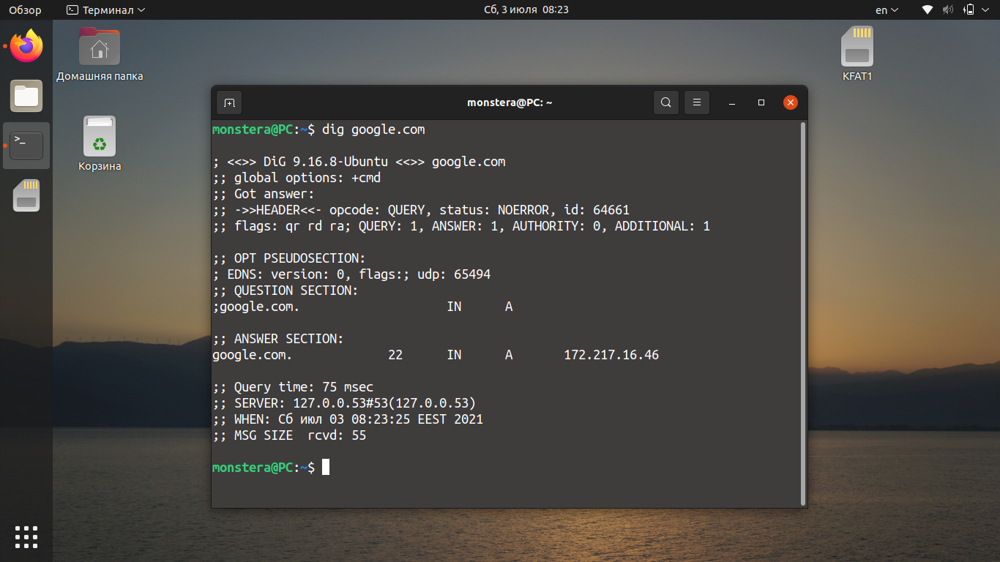

Рассмотрим каждую секцию вывода подробнее:

- **HEADER** — отображает информацию о версии утилиты, ID запроса, полученных ошибках и использованных флагах вывода. Выводится и другая важная информация о количестве запросов, обращений к DNS-серверу и т. д.;
- **QUESTION SECTION** — секция, которая отображает текущий запрос;
- **ANSWER SECTION** — секция, в которой отображается результат обработки созданного запроса (в данном случае это IP-адрес домена).

По умолчанию утилита выводит много лишней информации. Для получения только основных данных используйте запрос с флагом **+short.** Например:

```bash
dig google.com +short
```

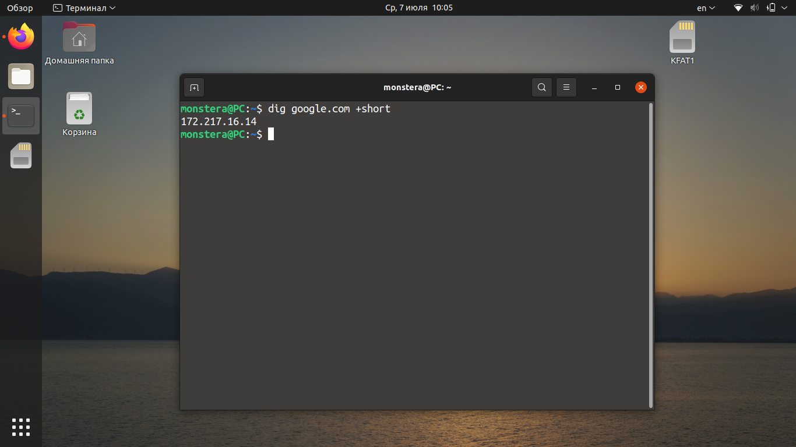

Если использовать команду dig вместе с **+noall**, вы ничего не увидите, поскольку этот флаг отключает вывод всех секций.

```bash
dig google.com +noall
```

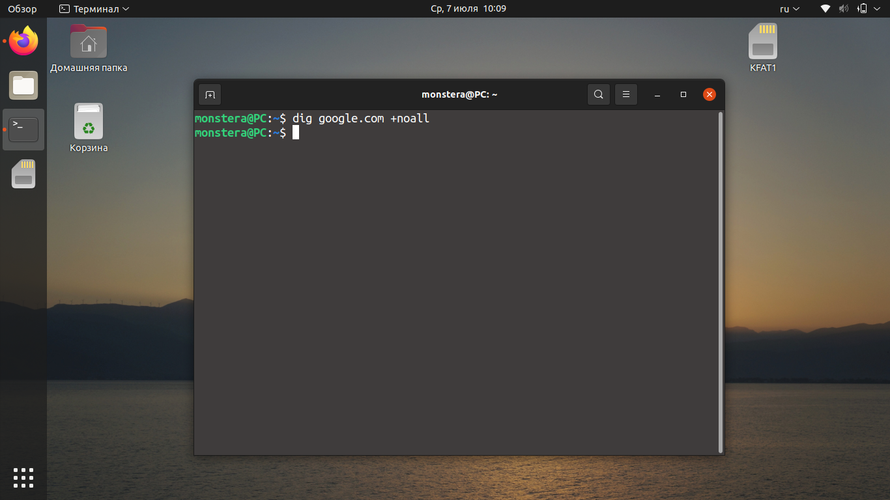

Если вместе с флагом **+noall** использовать флаг **+answer**, dig выведет только ту информацию, которая есть в секции ANSWER (IP-адрес, тип записи и пр.).

```bash
dig доменное.имя +noall +answer
```

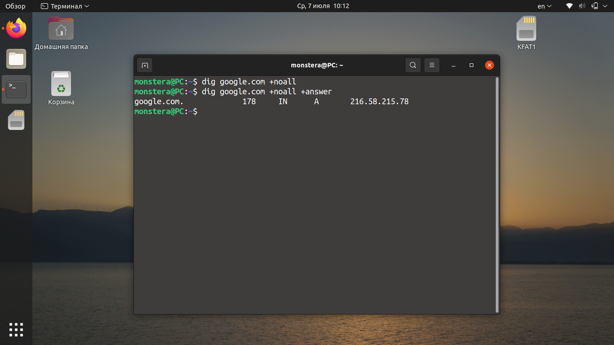

Для создания комбинированного запроса можно использовать текстовый файл со списком сайтов, например, **sites.txt.** Чтобы создать текстовый документ с таким именем, введите следующую команду в терминале:

```bash
nano sites.txt
```

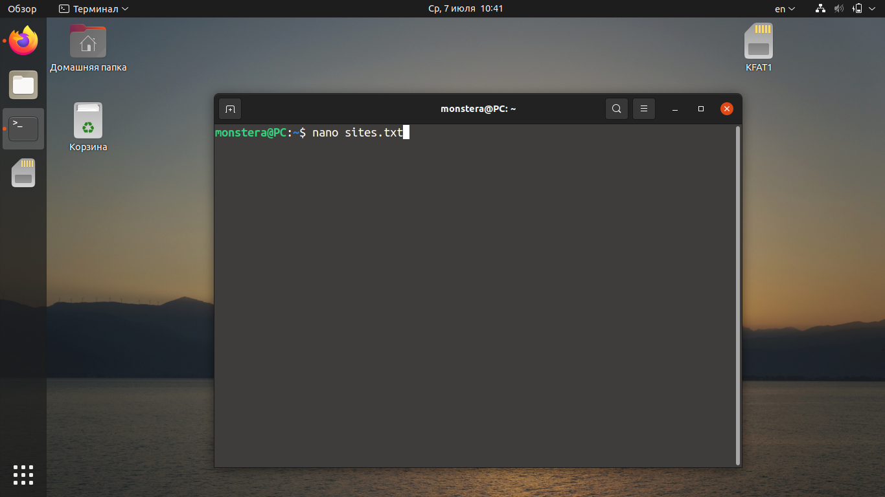

В файл необходимо добавить список доменов, для которых необходимо получить данные, например:

```bash
google.com   ya.ru   losst.pro
```

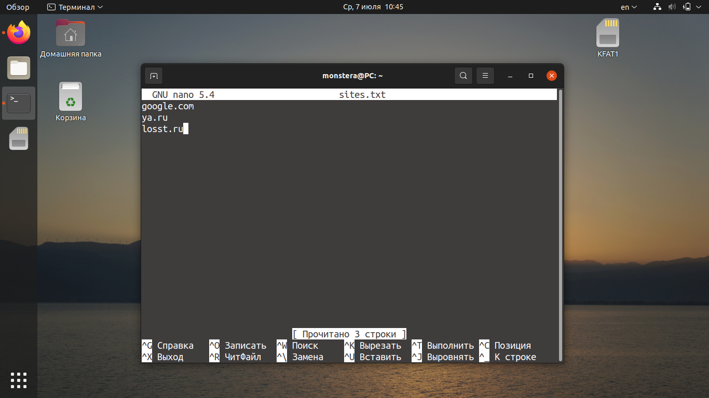

Для того чтобы получить информацию о перечисленных в файле **sites.txt** доменах, используйте команду:

```bash
dig -f sites.txt +noall +answer
```

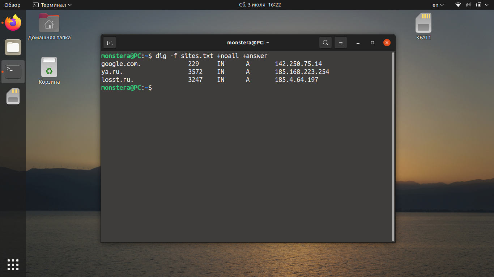

### 2. Получение определённой записи <a name="link_6"></a>

Согласно синтаксису команды dig linux, тип записи указывается после доменного имени. Для того чтобы получить **MX**-запись домена google.com, используйте команду:

```bash
dig google.com MX +noall +answer
```

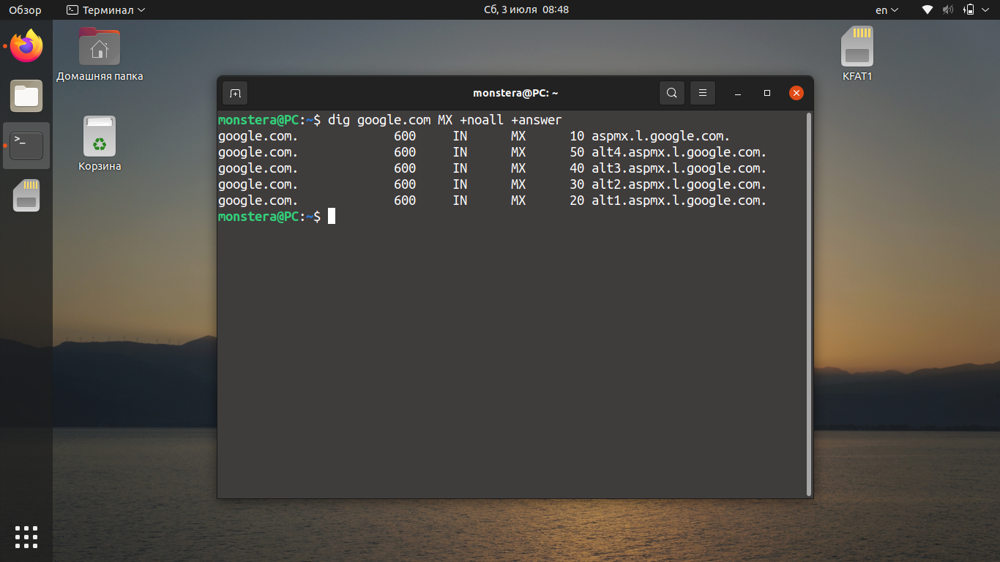

Чтобы получить **NS-**запись для домена, введите в терминале такую команду:

```bash
dig google.com NS +noall +answer
```

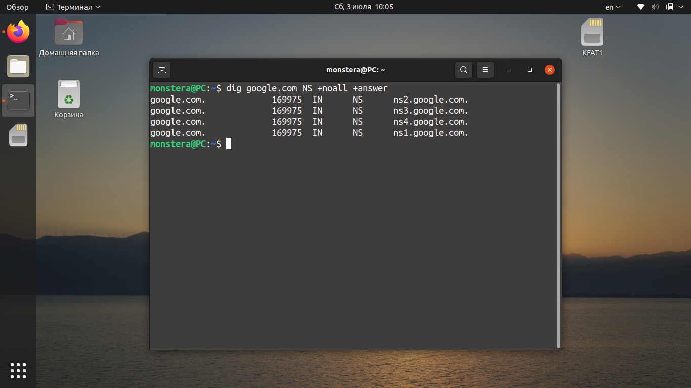

Запрос записи **A** происходит по умолчанию. Однако мы можем прописать этот запрос отдельно, чтобы обеспечить её вывод без дополнительной информации:

```bash
dig google.com A +noall +answer
```

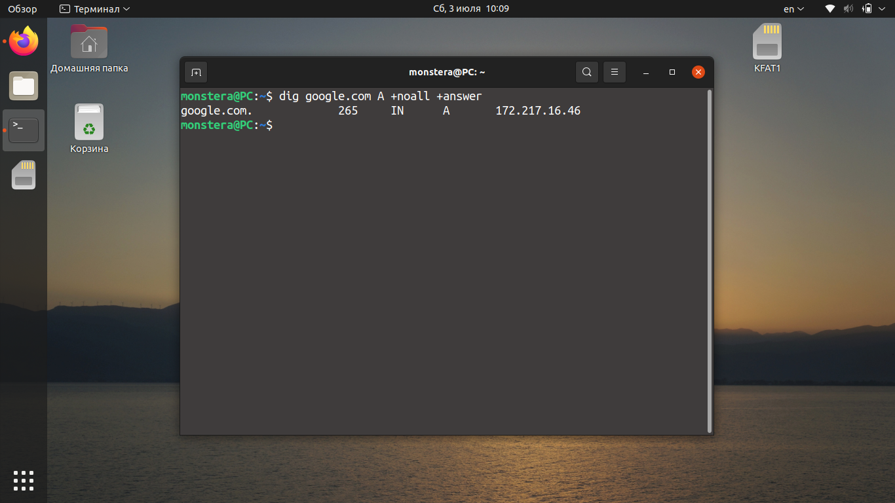

Для вывода записи **TXT** аналогичным образом используйте команду вида:

```bash
dig google.com TXT +noall +answer
```

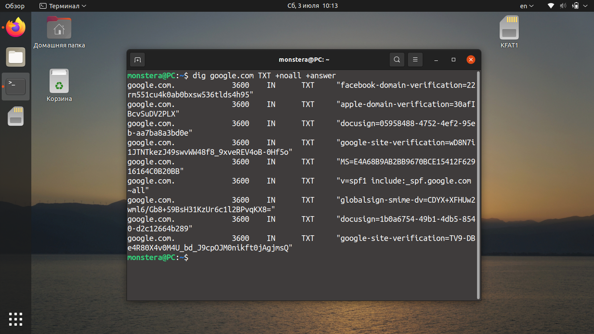

Для просмотра всех типов записей одновременно используйте запрос вида:

```bash
dig google.com ANY +noall +answer
```

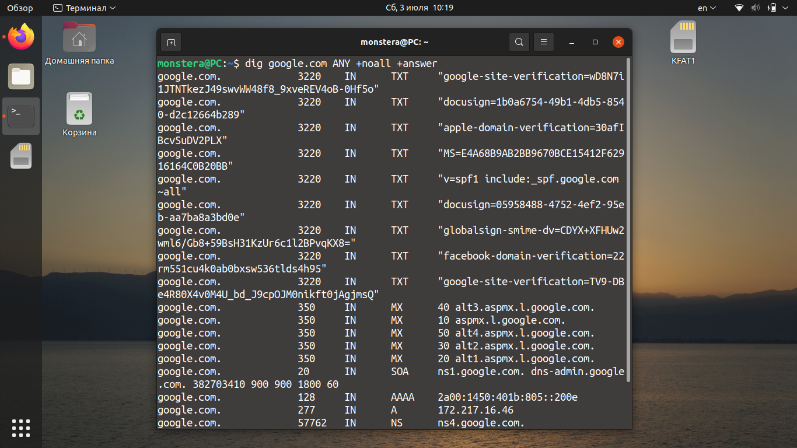

### 3. Использование определённого DNS-сервера <a name="link_7"></a>

Если DNS-сервер не был указан, как это было показано в предыдущих примерах, утилита dig linux будет по очереди пробовать все серверы из файла **/etc/resolv.conf**. Если же и там ничего нет, dig отправит запрос на localhost.

Указывать DNS-серверы можно в формате IPv4 или IPv6. Это не имеет значения и не повлияет на вывод dig. Отправим запрос на публичный DNS-сервер Google. Его IP-адрес: 8.8.8.8. В этом случае запрос в dig будет выглядеть следующим образом:

```bash
dig @8.8.8.8 google.com +noall +answer
```

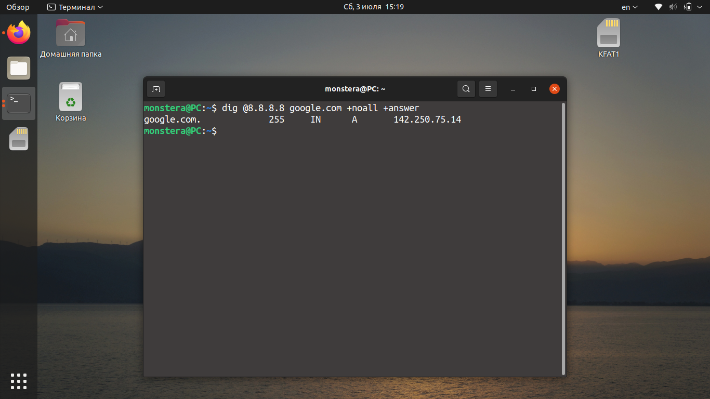

Как видно, для домена google.com используется IP-адрес: 142.250.75.14.

### 4. Получение домена по IP <a name="link_8"></a>

Для того чтобы узнать имя домена с помощью команды dig по IP, используйте опцию **-x**. Например, для того, чтобы узнать домен, привязанный к IP адресу 87.250.250.242 выполните такую команду:

```bash
dig -x 87.250.250.242
```

Как видите, это IP адрес яндекса. Правда такой способ получения доменов работает не всегда. Если к IP привязано несколько доменов программа может вывести только первый. Для того чтобы сократить вывод и оставить только нужную нам информацию, можно ввести запрос следующим образом:

```bash
dig -x 87.250.250.242 +short
```

Команда отображает информацию о том, что это google.com. Как видите команда dig Linux способна на многое.

## Выводы <a name="link_9"></a>

В этой небольшой статье мы рассмотрели, как можно использовать dig для опроса DNS-серверов. Несмотря на то что команда достаточно простая, она позволяет получить много полезной информации.
