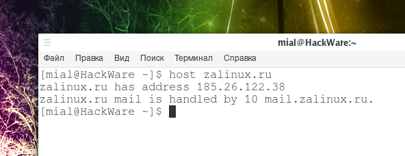
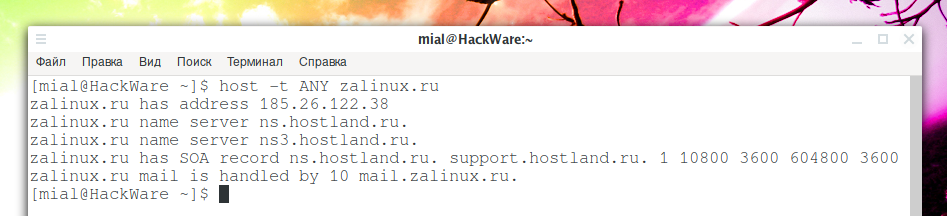
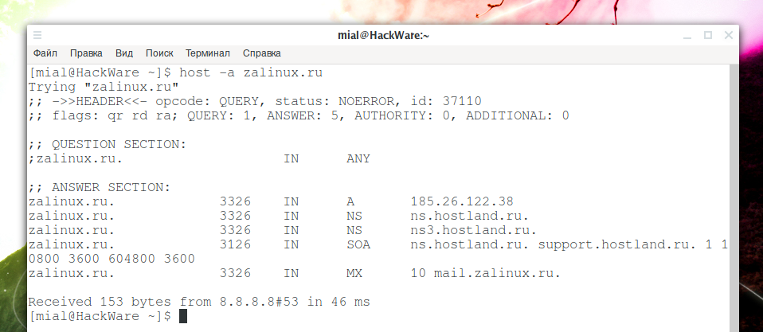
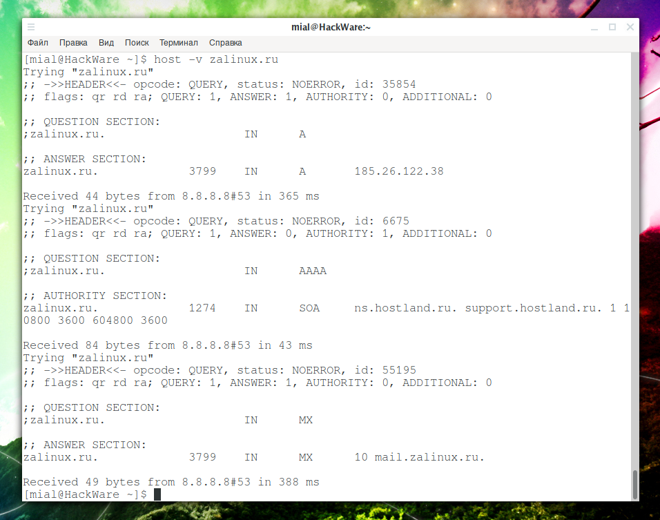

[источник](https://zalinux.ru/?p=2790)

- [ Примеры DNS запросов командой host](#link_1)
  - [ Как узнать IP адрес домена в Linux ](#link_2)
  - [ Как в host получить только IP адрес сайта без информации по почтовом сервере ](#link_3)
  - [ Как узнать Сервера Имён домена ](#link_4)
  - [ Поиск CNAME записей ](#link_5)
  - [ Поиск MX записей домена ](#link_6)
  - [ Поиск TXT записей ](#link_7)
  - [ Поиск SOA записей домена ](#link_8)
  - [ DNS запрос к определённому серверу имён ](#link_9)
  - [ Поиск всех DNS записей домена ](#link_10)
  - [ Как узнать TTL у DNS записи ](#link_11)
  - [ Использование IPv4 или IPv6 ](#link_12)
  - [ Выполнение не-рекурсивны запросов ](#link_13)
  - [ Как выполнить DNS запрос по TCP протоколу ](#link_14)
  - [ Изменение тайм-аута DNS запросов ](#link_15)
  - [ Поддержка IDN ](#link_16)

# Примеры DNS запросов командой host <a name="link_1"></a>

[Alexey](https://zalinux.ru/?author=1 "Записи Alexey")

Host — это простая утилита для выполнения поисков по DNS. Она обычно используется для преобразования имён в IP адреса и для обратных преобразований IP адресов в доменные имена. Она также может использоваться для просмотра списка и проверки различных типов DNS записей, таких как NS и MX, тестировать правильность настройки DNS сервера и выявления связанных с DNS проблем.

## Как узнать IP адрес домена в Linux <a name="link_2"></a>

Это самый простой пример команды host, который вы можете запустить, просто укажите доменное имя, такое как zalinux.ru для получения IP адреса сервера, где размещён этот сайт:

```
host zalinux.ru
```

Пример вывода:

```
zalinux.ru has address 185.26.122.38
```

zalinux.ru mail is handled by 10 mail.zalinux.ru.



## Как в host получить только IP адрес сайта без информации по почтовом сервере <a name="link_3"></a>

По умолчанию команда host получает информацию о следующих типах DNS записей: **A**, **AAAA**, и **MX**.

Команда:

```
host suip.biz
```

Выведет IPv4, IPv6 и MX записи:

```
suip.biz has address 185.117.153.79
suip.biz has IPv6 address 2a02:f680:1:1100::3d5f
suip.biz mail is handled by 20 mail.suip.biz.
```

suip.biz mail is handled by 10 mail.suip.biz.

Если вам нужен только IP адрес сайта без другой информации, то с помощью опции **-t** вы можете явно указать желаемую для получения запись.

Например, чтобы показать только IPv4:

```
host -t A suip.biz
```

Выведет:

```
suip.biz has address 185.117.153.79
```

Чтобы показать только IPv6:

```
host -t AAAA suip.biz
```

Выведет:

```
suip.biz has IPv6 address 2a02:f680:1:1100::3d5f
```

Кстати, о видах DNS записей и их функциях смотрите статью «[Введение в DNS терминологию, компоненты и концепции](https://hackware.ru/?p=9336)».

## Как узнать Сервера Имён домена <a name="link_4"></a>

Сервера имён, они также называются Name Servers или просто NS, можно узнать для домена с помощью опции **-t ns**:

```
host -t ns zalinux.ru
```

## Поиск CNAME записей <a name="link_5"></a>

Для поиска CNAME записей домена запустите:

```
host -t cname mail.google.com
```

Вывод:

```
mail.google.com is an alias for googlemail.l.google.com.
```

## Поиск MX записей домена <a name="link_6"></a>

Чтобы узнать MX записи домена запустите команду вида:

```
host -n -t mx google.com
```

Пример вывода:

```
google.com mail is handled by 50 alt4.aspmx.l.google.com.
google.com mail is handled by 20 alt1.aspmx.l.google.com.
google.com mail is handled by 10 aspmx.l.google.com.
google.com mail is handled by 40 alt3.aspmx.l.google.com.
```

google.com mail is handled by 30 alt2.aspmx.l.google.com.

## Поиск TXT записей <a name="link_7"></a>

Для просмотра TXT записей любого домена запустите команду:

```
host -t txt google.com
```

Пример вывода:

```
google.com descriptive text "v=spf1 include:_spf.google.com ~all"
google.com descriptive text "docusign=1b0a6754-49b1-4db5-8540-d2c12664b289"
google.com descriptive text "globalsign-smime-dv=CDYX+XFHUw2wml6/Gb8+59BsH31KzUr6c1l2BPvqKX8="
google.com descriptive text "facebook-domain-verification=22rm551cu4k0ab0bxsw536tlds4h95"
```

google.com descriptive text "docusign=05958488-4752-4ef2-95eb-aa7ba8a3bd0e"

## Поиск SOA записей домена <a name="link_8"></a>

Для получения записи SOA домена используйте команду:

```
host -t soa zalinux.ru
```

С помощью опции **-C** можно проверить непротиворечивость: хост будет запрашивать записи SOA для имени зоны со всех перечисленных доверенных серверов имён для этой зоны. Список серверов имён определяется записями NS, найденными для зоны.

```
host -C zalinux.ru
```

Пример вывода:

```
Nameserver 185.26.122.3:
    zalinux.ru has SOA record ns.hostland.ru. support.hostland.ru. 1 10800 3600 604800 3600
Nameserver 77.234.201.78:
    zalinux.ru has SOA record ns.hostland.ru. support.hostland.ru. 1 10800 3600 604800 3600
Nameserver 185.22.183.98:
    zalinux.ru has SOA record ns.hostland.ru. support.hostland.ru. 1 10800 3600 604800 3600
Nameserver 185.22.183.99:
    zalinux.ru has SOA record ns.hostland.ru. support.hostland.ru. 1 10800 3600 604800 3600
Nameserver 185.53.22.71:
    zalinux.ru has SOA record ns.hostland.ru. support.hostland.ru. 1 10800 3600 604800 3600
Nameserver 185.53.22.69:
```

    zalinux.ru has SOA record ns.hostland.ru. support.hostland.ru. 1 10800 3600 604800 3600

## DNS запрос к определённому серверу имён <a name="link_9"></a>

По умолчанию сервера имён для запроса берутся из файла /etc/resolv.conf, но вы можете указать любой другой DNS сервер — просто напишите его после имени домена:

```
host google.com ns4.google.com
```

Пример вывода:

```
Using domain server:
Name: ns4.google.com
Address: 216.239.38.10#53
Aliases:
google.com has address 172.217.19.46
google.com has address 172.217.19.46
google.com has address 172.217.19.46
google.com has IPv6 address 2a00:1450:4005:808::200e
google.com mail is handled by 30 alt2.aspmx.l.google.com.
google.com mail is handled by 20 alt1.aspmx.l.google.com.
google.com mail is handled by 50 alt4.aspmx.l.google.com.
google.com mail is handled by 10 aspmx.l.google.com.
```

google.com mail is handled by 40 alt3.aspmx.l.google.com.

## Поиск всех DNS записей домена <a name="link_10"></a>

В программе host есть несколько способов вывести информацию о сразу всех DNS записях домена, причём они немного различаются выводом.

Найти все DNS записи можно опцией **-t** (устанавливает тип запрашиваемой записи) со значением ANY (любое):

```
host -t ANY zalinux.ru
```

Пример вывода:



Второй вариант — использовать опцию **-a**, которая обычно является эквивалентом **-v -t ANY**:

```
host -a zalinux.ru
```

Пример вывода:



Ещё две опции **-v** (означает вербальный вывод) и **-d** (означает отладочную трассировку) являются эквивалентом друг друга, то есть можно применять любую из них:

```
host -v zalinux.ru
```

Пример вывода:



Вы можете использовать любой из этих вариантов в зависимости от того, какой из них ближе к вашим целям.

## Как узнать TTL у DNS записи <a name="link_11"></a>

Чтобы узнать TTL для DNS записей домена, используйте команду следующего вида:

```
host -v -t a zalinux.ru
```

## Использование IPv4 или IPv6 <a name="link_12"></a>

Опции **-4** и **-6** включают принудительное использование для транспортировки запроса, соответственно, только IPv4 или только IPV6:

```
host -4 zalinux.ru
```

ИЛИ

```
host -6 zalinux.ru
```

## Выполнение не-рекурсивны запросов <a name="link_13"></a>

Опция **-r** выполняет не-рекурсивные запросы, установка этой настройки очищает **RD** (recursion desired — рекурсия желательна), бит в запросе, который делает host.

```
host -rR 5 suip.biz
```

## Как выполнить DNS запрос по TCP протоколу <a name="link_14"></a>

Опции **-T** и **-U** могут включать принудительное использование протоколов. Соответственно TCP и UDP.

По умолчанию когда host делает запросы, она использует UDP. Опция **-T** делает так, что программа при запросах к серверу имён начинает использовать TCP соединения.

Протокол TCP выбирается автоматически для запросов, которые это требуют, для таких, как запросы zone transfer (AXFR). Запросы типа ANY по умолчанию используют TCP, но принудительно могут быть установлены на UDP если используется опция **-U**.

## Изменение тайм-аута DNS запросов <a name="link_15"></a>

Опция **-w** означает «ждать вечно»: она делает тайм-аут запроса максимально возможным.

С помощью опции **-W СЕКУНДЫ** устанавливает количество секунд, которое нужно ожидать ответ. Если значение меньше единицы, то время ожидания устанавливается на 1 секунду.

По умолчанию host ждёт по 5 секунд для UDP ответов и 10 секунд для TCP подключений.

## Поддержка IDN <a name="link_16"></a>

Если программа host была собрана с поддержкой IDN (internationalized domain name — интернационализированных доменных имён), она может принимать и отображать доменные имена при написании которых используются не-ASCII символы. host соответствующим образом преобразует кодировку символов доменного имени перед отправкой запроса на DNS-сервер или отображением ответа с сервера. Если по какой-то причине вы хотите отключить поддержку IDN, определите переменную среды **IDN_DISABLE**. Поддержка IDN отключена, если переменная установлена во время работы host.
