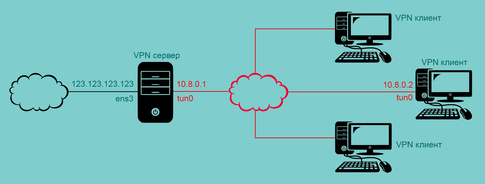

[источник](https://tokmakov.msk.ru/blog/item/535)

- [ Установка WireGuard](#link_1)
- [ Создаем ключи сервера](#link_2)
- [ Создаем ключи клиентов](#link_3)
- [ Файл конфигурации сервера](#link_4)
- [ Запуск службы сервера](#link_5)
- [ Файлы конфигурации клиентов](#link_6)
- [ Запуск службы клиента](#link_7)
- [ Проверяем, как все работает](#link_8)
- [ Связь между клиентами](#link_9)
- [ Весь трафик через сервер](#link_10)
  - [ 1. Настройка клиентов](#link_11)
  - [ 2. Настройка сервера](#link_12)
  - [ 3. Проверяем ip-адрес клиента](#link_13)
- [ Cryptokey Routing](#link_14)

# Установка WireGuard на Ubuntu 20.04 LTS. Часть первая из двух

WireGuard — это новый, современный VPN сервис с открытым исходным кодом, который позиционирует себя как замену других VPN решений. Проблема прочих VPN решений в том, что их тяжело правильно настроить и дорого обслуживать. Преимущества WireGuard — простота использования, современная криптография, компактный читаемый код и высокая производительность.

Нам потребуется решить следующие задачи:

1. Создать приватный и публичный ключи сервера
2. Создать приватный и публичный ключи первого клиента
3. Создать приватный и публичный ключи второго клиента
4. Создать файл конфигурации сервера, указать в нем приватный ключ сервера и публичные ключи клиентов
5. Создать файл конфигурации первого клиента, указать в нем приватный ключ этого клиента и публичный ключ сервера
6. Создать файл конфигурации второго клиента, указать в нем приватный ключ этого клиента и публичный ключ сервера
7. Скопировать файл конфигурации первого клиента на компьютер первого клиента
8. Скопировать файл конфигурации второго клиента на компьютер второго клиента
9. Проверить, что первый клиент может общаться с сервером
10. Проверить, что второй клиент может общаться с сервером
11. Обеспечить связь между первым и вторым клиентом
12. Направить весь трафик клиентов через сервер

## Установка WireGuard <a name="link_1"></a>

В Ubuntu 20.04 получить WireGuard можно из официальных репозиториев. В более старых дистрибутивах или для получения самой свежей версии следует использовать PPA:

```
$ sudo apt install software-properties-common
$ sudo add-apt-repository ppa:wireguard/wireguard
```

Устанавливаем пакет `wireguard` на сервере и на клиентах:

```
$ sudo apt install wireguard
```



## Создаем ключи сервера <a name="link_2"></a>

Создаем приватный и публичный ключ сервера. Ключ — это просто строка, которую мы будем указывать в файлах конфигурации. Эти строки сейчас записываем в файлы, чтобы потом их оттуда взять, но сами файлы ключей нам не нужны.

```
$ mkdir /home/evgeniy/wireguard/
$ cd /home/evgeniy/wireguard/

$ wg genkey > server-private.key # приватный ключ

$ wg pubkey < server-private.key > server-public.key # публичный ключ
```

Команда `wg genkey` создает приватный ключ, а команда `wg pubkey` — публичный ключ. Обе команды выводят сформированные ключи на экран. Для формирования публичного ключа нужен приватный ключ. А мы просто эти ключи записываем в файлы `server-private.key` и `server-public.key`.

Эти две команды можно заменить одной — создаем приватный ключ, записываем его в файл и передаем дальше по конвейеру — для создания публичного ключа, который тоже записываем в файл.

```
$ wg genkey | tee server-private.key | wg pubkey > server-public.key
```

## Создаем ключи клиентов <a name="link_3"></a>

Создаем ключи для первого клиента

```
$ wg genkey | tee client-one-private.key | wg pubkey > client-one-public.key
```

Создаем ключи для второго клиента

```
$ wg genkey | tee client-two-private.key | wg pubkey > client-two-public.key
```

## Файл конфигурации сервера <a name="link_4"></a>

Cоздаем файл конфигурации сервера, сразу в директории `/etc/wireguard/`:

```
$ sudo nano /etc/wireguard/wg0.conf
```

```
[Interface]
# ip-адрес сервера в виртуальной сети
Address = 10.8.0.1/24
# порт, на котором ожидать подключения
ListenPort = 54321
# приватный ключ сервера
PrivateKey = KB7lZqhYeY5LlwdUt4RpmUMTXnv0nsIajSCTwO01qHM=
[Peer]
# публичный ключ первого клиента
PublicKey = ELCQ4Q+dbMZFSaLuK8UrJEpOXNEu6hzdCNWIqYqh7So=
# принимать пакеты с такими ip-адресами источника от этого клиента,
# отправлять пакеты с такими ip-адресами назначения этому клиенту
AllowedIPs = 10.8.0.2/32
[Peer]
# публичный ключ второго клиента
PublicKey = GZHjarCmFTqpnFkyPcts/iNPvUsYWk9ecXujh7eURGY=
# принимать пакеты с такими ip-адресами источника от этого клиента,
# отправлять пакеты с такими ip-адресами назначения этому клиенту
AllowedIPs = 10.8.0.3/32
```

С точки зрения сервера `AllowedIPs` — это ip-адреса, которые клиенту разрешено использовать в качестве ip-адреса источника. Если клиент отправляет пакет с ip-адресом источника, которого нет в списке `AllowedIPs` сервера, то пакет будет просто отброшен. С другой стороны, `AllowedIPs` говорит серверу, какому клиенту отправлять пакеты с тем или иным ip-адресом назначения, и каким публичным ключом их шифровать.

## Запуск службы сервера <a name="link_5"></a>

Теперь все готово к запуску службы сервера, для этого можно использовать команду `wg-quick` или `systemctl`:

```
$ sudo wg-quick up wg0 # wg0 — имя файла конфигурации без расширения .conf

$ sudo systemctl start wg-quick@wg0.service # wg0 — имя файла конфигурации без расширения .conf
```

Добавим службу в автозагрузку

```
$ sudo systemctl enable wg-quick@wg0.service
```

## Файлы конфигурации клиентов <a name="link_6"></a>

Cоздаем файл конфигурации первого клиента. Создавать будем на сервере, а потом с компьютера клиента скопируем готовый файл. Можно создавать файл конфигурации клиента прямо на клиенте, но на сервере удобнее — все ключи под рукой.

```
$ nano /home/evgeniy/wireguard/client-one.conf
```

```
[Interface]
# ip-адрес первого клиента в виртуальной сети
Address = 10.8.0.2/24
# приватный ключ первого клиента
PrivateKey = ePEDoCDFjP7F9tY3cloqC9QGjf5T0cgi/YAhTB36wUo=
[Peer]
# публичный ключ сервера
PublicKey = dp9cddCMlwoF4oOBO+6aoXZfwQhqJr6W5vv6LYu5GHk=
# ip-адрес и порт сервера
Endpoint = 123.123.123.123:54321
# принимать пакеты с такими ip-адресами источника от сервера,
# отправлять пакеты с такими ip-адресами назначения серверу
AllowedIPs = 10.8.0.1/32
# поддерживать соединение в активном состоянии,
# каждые 25 секунд отправлять пакет на сервер
PersistentKeepalive = 25
```

Cоздаем файл конфигурации второго клиента:

```
$ nano /home/evgeniy/wireguard/client-two.conf
```

```
[Interface]
# ip-адрес второго клиента в виртуальной сети
Address = 10.8.0.3/24
# приватный ключ второго клиента
PrivateKey = KHwPyph1rUBjThkmfbWuSNFp3lBWqp/NdkvImJ5Ncmw=
[Peer]
# публичный ключ сервера
PublicKey = dp9cddCMlwoF4oOBO+6aoXZfwQhqJr6W5vv6LYu5GHk=
# ip-адрес и порт сервера
Endpoint = 123.123.123.123:54321
# принимать пакеты с такими ip-адресами источника от сервера,
# отправлять пакеты с такими ip-адресами назначения серверу
AllowedIPs = 10.8.0.1/32
# поддерживать соединение в активном состоянии,
# каждые 25 секунд отправлять пакет на сервер
PersistentKeepalive = 25
```

## Запуск службы клиента <a name="link_7"></a>

С компьютера первого клиента копируем файл конфигурации с сервера:

```
$ sudo scp evgeniy@123.123.123.123:/home/evgeniy/wireguard/client-one.conf /etc/wireguard/wg0.conf
```

Теперь все готово к запуску службы:

```
$ sudo systemctl start wg-quick@wg0.service
```

Добавим службу в автозагрузку:

```
$ sudo systemctl enable wg-quick@wg0.service
```

Для второго клиента все будет аналогично, так что нет смысла повторять.

## Проверяем, как все работает <a name="link_8"></a>

Выполняем `ping` сервера с первого клиента:

```
$ ping -c3 10.8.0.1
PING 10.8.0.1 (10.8.0.1) 56(84) bytes of data.
64 bytes from 10.8.0.1: icmp_seq=1 ttl=64 time=13.5 ms
64 bytes from 10.8.0.1: icmp_seq=2 ttl=64 time=18.0 ms
64 bytes from 10.8.0.1: icmp_seq=3 ttl=64 time=13.8 ms

--- 10.8.0.1 ping statistics ---
3 packets transmitted, 3 received, 0% packet loss, time 2003ms
rtt min/avg/max/mdev = 13.510/15.073/17.960/2.043 ms
```

Выполняем `ping` сервера со второго клиента:

```
$ ping -c3 10.8.0.1
PING 10.8.0.1 (10.8.0.1) 56(84) bytes of data.
64 bytes from 10.8.0.1: icmp_seq=1 ttl=64 time=10.8 ms
64 bytes from 10.8.0.1: icmp_seq=2 ttl=64 time=11.4 ms
64 bytes from 10.8.0.1: icmp_seq=3 ttl=64 time=11.7 ms

--- 10.8.0.1 ping statistics ---
3 packets transmitted, 3 received, 0% packet loss, time 2003ms
rtt min/avg/max/mdev = 10.772/11.281/11.696/0.383 ms
```

## Связь между клиентами <a name="link_9"></a>

Сейчас клиенты отправляют в туннель только пакеты с ip-адресом назначения `10.8.0.1/32`. И принимают из туннеля только пакеты с ip-адресом источника `10.8.0.1/32`. Другими словами, клиенты могут общаться только с сервером, но не могут общаться между собой. Давайте это изменим:

```
[Interface]
# ip-адрес первого клиента в виртуальной сети
Address = 10.8.0.2/24
# приватный ключ первого клиента
PrivateKey = ePEDoCDFjP7F9tY3cloqC9QGjf5T0cgi/YAhTB36wUo=
[Peer]
# публичный ключ сервера
PublicKey = dp9cddCMlwoF4oOBO+6aoXZfwQhqJr6W5vv6LYu5GHk=
# ip-адрес и порт сервера
Endpoint = 123.123.123.123:54321
# принимать пакеты с такими ip-адресами источника от сервера,
# отправлять пакеты с такими ip-адресами назначения серверу
AllowedIPs = 10.8.0.0/24
# поддерживать соединение в активном состоянии,
# каждые 25 секунд отправлять пакет на сервер
PersistentKeepalive = 25
```

```
[Interface]
# ip-адрес второго клиента в виртуальной сети
Address = 10.8.0.3/24
# приватный ключ второго клиента
PrivateKey = KHwPyph1rUBjThkmfbWuSNFp3lBWqp/NdkvImJ5Ncmw=
[Peer]
# публичный ключ сервера
PublicKey = dp9cddCMlwoF4oOBO+6aoXZfwQhqJr6W5vv6LYu5GHk=
# ip-адрес и порт сервера
Endpoint = 123.123.123.123:54321
# принимать пакеты с такими ip-адресами источника от сервера,
# отправлять пакеты с такими ip-адресами назначения серверу
AllowedIPs = 10.8.0.0/24
# поддерживать соединение в активном состоянии,
# каждые 25 секунд отправлять пакет на сервер
PersistentKeepalive = 25
```

А на сервере разрешим пересылку пакетов между интерфейсами. Чтобы пакеты, приходящие на виртуальный интерфейс `wg0`, могли с этого же интерфейса уходить.

```
[Interface]
# ip-адрес сервера в виртуальной сети
Address = 10.8.0.1/24
# порт, на котором ожидать подключения
ListenPort = 54321
# приватный ключ сервера
PrivateKey = KB7lZqhYeY5LlwdUt4RpmUMTXnv0nsIajSCTwO01qHM=
# выполнить команды сразу после запуска службы
PostUp = sysctl -w -q net.ipv4.ip_forward=1
PostUp = iptables -P FORWARD DROP
PostUp = iptables -I FORWARD -i %i -o %i -s 10.8.0.0/24 -d 10.8.0.0/24 -j ACCEPT
# выполнить команды сразу после остановки службы
PostDown = sysctl -w -q net.ipv4.ip_forward=0
PostDown = iptables -P FORWARD ACCEPT
PostDown = iptables -D FORWARD -i %i -o %i -s 10.8.0.0/24 -d 10.8.0.0/24 -j ACCEPT
[Peer]
# публичный ключ первого клиента
PublicKey = ELCQ4Q+dbMZFSaLuK8UrJEpOXNEu6hzdCNWIqYqh7So=
# принимать пакеты с такими ip-адресами источника от этого клиента,
# отправлять пакеты с такими ip-адресами назначения этому клиенту
AllowedIPs = 10.8.0.2/32
[Peer]
# публичный ключ второго клиента
PublicKey = GZHjarCmFTqpnFkyPcts/iNPvUsYWk9ecXujh7eURGY=
# принимать пакеты с такими ip-адресами источника от этого клиента,
# отправлять пакеты с такими ip-адресами назначения этому клиенту
AllowedIPs = 10.8.0.3/32
```

Директивы `PreUp`, `PostUp`, `PreDown`, `PostDown` — это команды, которые будут выполнены до/после up/down интерфейса. Чаще всего используются для настройки пользовательских параметров DNS или правил брандмауэра. Специальная строка `%i` преобразуется в имя интерфейса `wg0`, `wg1`, `wg2` и т.д. Каждая директива может быть указана несколько раз, в этом случае они выполняются по порядку.

После запуска службы можно посмотреть правила `netfilter` для цепочки `FORWARD` таблицы `filter`:

```
$ sudo iptables -t filter -L -v --line-numbers
Chain INPUT (policy ACCEPT 0 packets, 0 bytes)
num   pkts   bytes   target   prot   opt   in    out   source        destination

Chain FORWARD (policy DROP 0 packets, 0 bytes)
num   pkts   bytes   target   prot   opt   in    out   source        destination
1        0       0   ACCEPT   all    --    wg0   wg0   10.8.0.0/24   10.8.0.0/24

Chain OUTPUT (policy ACCEPT 0 packets, 0 bytes)
num   pkts   bytes   target   prot   opt   in    out   source        destination
```

После остановки службы мы все возвращаем к значениям по умолчанию — форвардинг пакетов запрещен, политика по умолчанию для цепочки `FORWARD` — `ACCEPT`, правило пересылки пакетов удалено:

```
$ sudo iptables -t filter -L -v --line-numbers
Chain INPUT (policy ACCEPT 0 packets, 0 bytes)
num   pkts   bytes   target   prot   opt   in   out   source         destination

Chain FORWARD (policy ACCEPT 0 packets, 0 bytes)
num   pkts   bytes   target   prot   opt   in   out   source         destination

Chain OUTPUT (policy ACCEPT 0 packets, 0 bytes)
num   pkts   bytes   target   prot   opt   in   out   source         destination
```

## Весь трафик через сервер <a name="link_10"></a>

### 1. Настройка клиентов <a name="link_11"></a>

Чтобы направить весь трафик клиентов в туннель, нужно отредактировать файлы конфигурации клиентов

```
[Interface]
# ip-адрес первого клиента в виртуальной сети
Address = 10.8.0.2/24
# приватный ключ первого клиента
PrivateKey = ePEDoCDFjP7F9tY3cloqC9QGjf5T0cgi/YAhTB36wUo=
# DNS-сервера для клиента
DNS = 1.1.1.1, 1.0.0.1
[Peer]
# публичный ключ сервера
PublicKey = dp9cddCMlwoF4oOBO+6aoXZfwQhqJr6W5vv6LYu5GHk=
# ip-адрес и порт сервера
Endpoint = 123.123.123.123:54321
# принимать от сервера пакеты с любым ip-адресом источника,
# отправлять серверу пакеты с любым ip-адресом назначения
AllowedIPs = 0.0.0.0/0
# поддерживать соединение в активном состоянии,
# каждые 25 секунд отправлять пакет на сервер
PersistentKeepalive = 25
```

```
[Interface]
# ip-адрес второго клиента в виртуальной сети
Address = 10.8.0.3/24
# приватный ключ второго клиента
PrivateKey = KHwPyph1rUBjThkmfbWuSNFp3lBWqp/NdkvImJ5Ncmw=
# DNS-сервера для клиента
DNS = 1.1.1.1, 1.0.0.1
[Peer]
# публичный ключ сервера
PublicKey = dp9cddCMlwoF4oOBO+6aoXZfwQhqJr6W5vv6LYu5GHk=
# ip-адрес и порт сервера
Endpoint = 123.123.123.123:54321
# принимать от сервера пакеты с любым ip-адресом источника,
# отправлять серверу пакеты с любым ip-адресом назначения
AllowedIPs = 0.0.0.0/0
# поддерживать соединение в активном состоянии,
# каждые 25 секунд отправлять пакет на сервер
PersistentKeepalive = 25
```

Поскольку теперь весь трафик клиенты направляют в туннель, требуется указать DNS-серверы, которые им следует использовать. А чтобы `wireguard` мог изменить сетевые настройки клиентов, нужно установить пакет `resolvconf` или `openresolv`.

```
$ sudo apt install resolvconf # на первом клиенте

$ sudo apt install resolvconf # на втором клиенте
```

Собственно, при установке пакета `wireguard` было сообщение о том, что желательно установить `resolvconf` или `openresolv`:

```
$ sudo apt install wireguard
Чтение списков пакетов… Готово
Построение дерева зависимостей
Чтение информации о состоянии… Готово
Будут установлены следующие дополнительные пакеты:
  wireguard-tools
Предлагаемые пакеты:
  openresolv | resolvconf
Следующие НОВЫЕ пакеты будут установлены:
  wireguard wireguard-tools
..........
```

Зачем нужен пакет `resolvconf` можно прочитать [здесь](https://tokmakov.msk.ru/blog/item/522). Без `resolvconf` клиент при запуске будет выдавать ошибку «resolvconf: command not found».

```
$ sudo systemctl status wg-quick@wg0.service
● wg-quick@wg0.service - WireGuard via wg-quick(8) for wg0
     Loaded: loaded (/lib/systemd/system/wg-quick@.service; disabled; vendor preset: enabled)
     Active: failed (Result: exit-code) since Sat 2020-08-29 10:34:15 MSK; 3min 28s ago
       Docs: man:wg-quick(8)
             man:wg(8)
             https://www.wireguard.com/
             https://www.wireguard.com/quickstart/
             https://git.zx2c4.com/wireguard-tools/about/src/man/wg-quick.8
             https://git.zx2c4.com/wireguard-tools/about/src/man/wg.8
    Process: 2540 ExecStart=/usr/bin/wg-quick up wg0 (code=exited, status=127)
   Main PID: 2540 (code=exited, status=127)

авг 29 10:34:14 wg-client wg-quick[2540]: [#] ip link add wg0 type wireguard
авг 29 10:34:15 wg-client wg-quick[2540]: [#] wg setconf wg0 /dev/fd/63
авг 29 10:34:15 wg-client wg-quick[2540]: [#] ip -4 address add 10.8.0.2/24 dev wg0
авг 29 10:34:15 wg-client wg-quick[2540]: [#] ip link set mtu 1420 up dev wg0
авг 29 10:34:15 wg-client wg-quick[2581]: [#] resolvconf -a wg0 -m 0 -x
авг 29 10:34:15 wg-client wg-quick[2583]: /usr/bin/wg-quick: line 32: resolvconf: command not found
авг 29 10:34:15 wg-client wg-quick[2540]: [#] ip link delete dev wg0
авг 29 10:34:15 wg-client systemd[1]: wg-quick@wg0.service: Main process exited, code=exited, status=127
авг 29 10:34:15 wg-client systemd[1]: wg-quick@wg0.service: Failed with result 'exit-code'.
авг 29 10:34:15 wg-client systemd[1]: Failed to start WireGuard via wg-quick(8) for wg0.
```

### 2. Настройка сервера <a name="link_12"></a>

Клиенты будут отправлять весь трафик в туннель, но что с ним делать — сервер не знает. Так что редактируем файл конфигурации сервера

```
$ sudo nano /etc/wireguard/wg0.conf
```

```
[Interface]
# ip-адрес сервера в виртуальной сети
Address = 10.8.0.1/24
# порт, на котором ожидать подключения
ListenPort = 54321
# приватный ключ сервера
PrivateKey = KB7lZqhYeY5LlwdUt4RpmUMTXnv0nsIajSCTwO01qHM=
# выполнить команды сразу после запуска службы
PostUp = sysctl -w -q net.ipv4.ip_forward=1
PostUp = iptables -P FORWARD DROP
PostUp = iptables -A FORWARD -i %i -o %i -s 10.8.0.0/24 -d 10.8.0.0/24 -j ACCEPT
PostUp = iptables -A FORWARD -i %i -o ens3 -s 10.8.0.0/24 -j ACCEPT
PostUp = iptables -A FORWARD -i ens3 -o %i -d 10.8.0.0/24 -j ACCEPT
PostUp = iptables -t nat -A POSTROUTING -o ens3 -j MASQUERADE
# выполнить команды сразу после остановки службы
PostDown = sysctl -w -q net.ipv4.ip_forward=0
PostDown = iptables -P FORWARD ACCEPT
PostDown = iptables -D FORWARD -i %i -o %i -s 10.8.0.0/24 -d 10.8.0.0/24 -j ACCEPT
PostDown = iptables -D FORWARD -i %i -o ens3 -s 10.8.0.0/24 -j ACCEPT
PostDown = iptables -D FORWARD -i ens3 -o %i -d 10.8.0.0/24 -j ACCEPT
PostDown = iptables -t nat -D POSTROUTING -o ens3 -j MASQUERADE
[Peer]
# публичный ключ первого клиента
PublicKey = ELCQ4Q+dbMZFSaLuK8UrJEpOXNEu6hzdCNWIqYqh7So=
# принимать пакеты с такими ip-адресами источника от этого клиента,
# отправлять пакеты с такими ip-адресами назначения этому клиенту
AllowedIPs = 10.8.0.2/32
[Peer]
# публичный ключ второго клиента
PublicKey = GZHjarCmFTqpnFkyPcts/iNPvUsYWk9ecXujh7eURGY=
# принимать пакеты с такими ip-адресами источника от этого клиента,
# отправлять пакеты с такими ip-адресами назначения этому клиенту
AllowedIPs = 10.8.0.3/32
```

Сразу после запуска службы мы выполянем команды: разрешаем форвардинг пакетов между интерфейсами, разрешаем клиентам общаться между собой, разрешаем клиентам выходить в интернет и добавляем правило SNAT для интерфейса `ens3`, чтобы все клиенты использовали единственный ip-адрес `123.123.123.123`. При остановке службы — действие всех этих команд отменяется.

### 3. Проверяем ip-адрес клиента <a name="link_13"></a>

Все готово, перезапускаем службы сервера и клиентов, потом на любом клиенте открываем браузер и смотрим ip-адрес:


## Cryptokey Routing <a name="link_14"></a>

В основе WireGuard лежит концепция под названием Cryptokey Routining, которая работает путем связывания открытых ключей со списком ip-адресов, которые разрешены внутри туннеля. Каждый сетевой интерфейс имеет закрытый ключ и список одноранговых узлов. У каждого однорангового узла есть открытый ключ. Открытые ключи используются одноранговыми узлами для аутентификации друг друга.

Например, серверный компьютер может иметь такую ​​конфигурацию:

```
[Interface]
PrivateKey = yAnz5TF+lXXJte14tji3zlMNq+hd2rYUIgJBgB3fBmk=
ListenPort = 51820
[Peer]
PublicKey = xTIBA5rboUvnH4htodjb6e697QjLERt1NAB4mZqp8Dg=
AllowedIPs = 10.192.122.3/32, 10.192.124.1/24
[Peer]
PublicKey = TrMvSoP4jYQlY6RIzBgbssQqY3vxI2Pi+y71lOWWXX0=
AllowedIPs = 10.192.122.4/32, 192.168.0.0/16
[Peer]
PublicKey = gN65BkIKy1eCE9pP1wdc8ROUtkHLF2PfAqYdyYBz6EA=
AllowedIPs = 10.10.10.230/32
```

А клиентский компьютер может иметь более простую конфигурацию:

```
[Interface]
PrivateKey = gI6EdUSYvn8ugXOt8QQD6Yc+JyiZxIhp3GInSWRfWGE=
ListenPort = 21841
[Peer]
PublicKey = HIgo9xNzJMWLKASShiTqIybxZ0U3wGLiUeJ1PKf8ykw=
Endpoint = 192.95.5.69:51820
AllowedIPs = 0.0.0.0/0
```

**Получение пакетов на стороне сервера**. Cервер будет принимать пакеты от клиента, если ip-адрес источника соответствует списку разрешенных ip-адресов для этого клиента. Когда сервер получил пакет от узла `gN65BkIK…`, после расшифровки и аутентификации, если ip-адрес источника — `10.10.10.230`, то он принимается, в противном случае — отбрасывается.

**Отправление пакетов на стороне сервера**. Когда сетевой интерфейс хочет отправить пакет клиенту, проверяется ip-адрес назначения этого пакета и сравниваетcя со списком разрешенных ip-адресов. Например, если сетевому интерфейсу предлагается отправить пакет с ip-адресом назначения `10.10.10.230`, он зашифрует его, используя открытый ключ клиента `gN65BkIK…`, а затем отправит на конечную точку этого узла.

**Конечная точка** представляет собой пару ip-адреса и порта хоста `ip-адрес:порт` в сети интернет. Сервер автоматически обновляет `ip-адрес:порт` клиента при получении от него аутентифицированных пакетов. Клиент, который переключается между мобильными сетями (и чей внешний ip-адрес изменяется), по-прежнему сможет получать сообщения от сервера. Поскольку конечная точка обновляется всякий раз, когда клиент отправляет аутентифицированное сообщение на сервер.

**Получение пакетов на стороне клиента**. У клиента есть только один узел, откуда можно получать пакеты — это сервер. Сервер может отправлять пакеты клиенту с любым ip-адресом источника (об этом говорит `0.0.0.0/0`). При получении пакета от узла `HIgo9xNz…`, если он правильно расшифровывается и аутентифицируется (с любым ip-адресом источника), пакет принимается, в противном случае — отбрасывается.

**Отправление пакетов на стороне клиента**. Когда сетевой интерфейс хочет отправить пакет серверу, он будет шифровать пакеты с любым ip-адресом назначения (об этом говорит `0.0.0.0/0`). Например, если сетевому интерфейсу предлагается отправить пакет с любым ip-адресом назначения, он зашифрует его, используя открытый ключ сервера `HIgo9xNz…`, а затем отправит на конечную точку этого узла.
