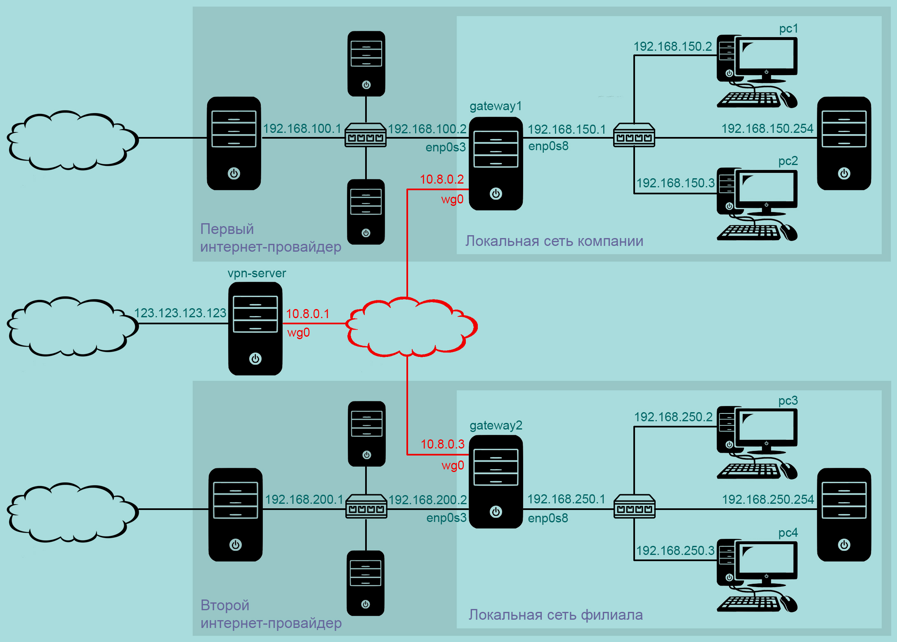
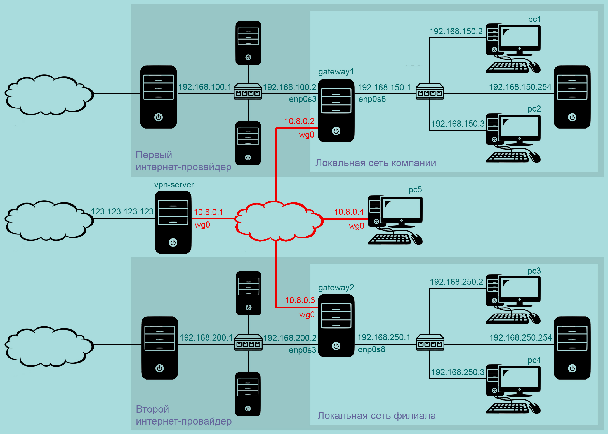

[источник](https://tokmakov.msk.ru/blog/item/538)

- [ Настройка шлюза gateway1](#link_1)
- [ Настройка шлюза gateway2](#link_2)
- [ Настройка VPN-сервера](#link_3)
- [ Настройка первого клиента (gateway1)](#link_4)
- [ Настройка второго клиента (gateway2)](#link_5)
- [ Проверяем, как все работает](#link_6)
- [ Еще один VPN-клиент](#link_7)
  - [ 1. Файл конфигурации нового клиента](#link_8)
  - [ 2. Файл конфигурации VPN-сервера](#link_9)
  - [ 3. Файл конфигурации первого клиента (gateway1)](#link_10)
  - [ 4. Файл конфигурации второго клиента (gateway2)](#link_11)
  - [ 5. Проверяем, как все работает](#link_12)

# Установка WireGuard на Ubuntu 20.04 LTS. Часть вторая из двух

Допустим, у нас есть локальная сеть компании и локальная сеть филиала, расположенные далеко друг от друга. И нам надо обеспечить связь между этими сетями по защищенному каналу. Интернет-провайдеры не предоставляют белых ip-адресов, поэтому нам потребуется промежуточный сервер, у которого такой ip-адрес есть.



## Настройка шлюза gateway1 <a name="link_1"></a>

Шлюз должен обеспечивать выход в интернет для всех компьютеров сети `192.168.150.0/24`, поэтому разрешаем форвардинг пакетов между интерфейсами и добавляем несколько правил для `netfilter` с помощью утилиты `iptables`.

```
$ sudo nano /etc/sysctl.conf # форвардинг пакетов

# Uncomment the next line to enable packet forwarding for IPv4
net.ipv4.ip_forward=1
```

Чтобы изменения вступили в силу

```
$ sudo sysctl -p /etc/sysctl.conf
net.ipv4.ip_forward = 1
```

Добавляем несколько правил

```
$ sudo iptables -P FORWARD DROP
$ sudo iptables -A FORWARD -i enp0s8 -o enp0s3 -s 192.168.150.0/24 -j ACCEPT
$ sudo iptables -A FORWARD -i enp0s3 -o enp0s8 -d 192.168.150.0/24 -j ACCEPT
$ sudo iptables -t nat -A POSTROUTING -o enp0s3 -j MASQUERADE
```

Для восстановления правил после перезагрузки

```
$ sudo apt install iptables-persistent
```

Сетевые настройки шлюза

```
$ sudo nano /etc/netplan/01-netcfg.yaml
```

```
network:
  version: 2
  renderer: networkd
  ethernets:
    enp0s3:
      dhcp4: no
      addresses: [192.168.100.2/24]
      gateway4: 192.168.100.1
      nameservers:
        addresses: [8.8.8.8, 8.8.4.4]
    enp0s8:
      dhcp4: no
      addresses: [192.168.150.1/24]
      nameservers:
        addresses: [8.8.8.8, 8.8.4.4]
```

## Настройка шлюза gateway2 <a name="link_2"></a>

Шлюз должен обеспечивать выход в интернет для всех компьютеров сети `192.168.250.0/24`, поэтому разрешаем форвардинг пакетов между интерфейсами и добавляем несколько правил для `netfilter` с помощью утилиты `iptables`.

```
$ sudo nano /etc/sysctl.conf # форвардинг пакетов

# Uncomment the next line to enable packet forwarding for IPv4
net.ipv4.ip_forward=1
```

Чтобы изменения вступили в силу

```
$ sudo sysctl -p /etc/sysctl.conf
net.ipv4.ip_forward = 1
```

Добавляем несколько правил

```
$ sudo iptables -P FORWARD DROP
$ sudo iptables -A FORWARD -i enp0s8 -o enp0s3 -s 192.168.250.0/24 -j ACCEPT
$ sudo iptables -A FORWARD -i enp0s3 -o enp0s8 -d 192.168.250.0/24 -j ACCEPT
$ sudo iptables -t nat -A POSTROUTING -o enp0s3 -j MASQUERADE
```

Для восстановления правил после перезагрузки

```
$ sudo apt install iptables-persistent
```

Сетевые настройки шлюза

```
$ sudo nano /etc/netplan/01-netcfg.yaml
```

```
network:
  version: 2
  renderer: networkd
  ethernets:
    enp0s3:
      dhcp4: no
      addresses: [192.168.200.2/24]
      gateway4: 192.168.200.1
      nameservers:
        addresses: [8.8.8.8, 8.8.4.4]
    enp0s8:
      dhcp4: no
      addresses: [192.168.250.1/24]
      nameservers:
        addresses: [8.8.8.8, 8.8.4.4]
```

## Настройка VPN-сервера <a name="link_3"></a>

Устанавливаем пакет `wireguard` на `vpn-server`, `gateway1` и `gateway2`:

```
$ sudo apt install wireguard
```

Создаем файл конфигурации сервера:

```
$ sudo nano /etc/wireguard/wg0.conf
```

```
[Interface]
# ip-адрес сервера в виртуальной сети
Address = 10.8.0.1/24
# порт, на котором ожидать подключения
ListenPort = 54321
# приватный ключ сервера
PrivateKey = KB7lZqhYeY5LlwdUt4RpmUMTXnv0nsIajSCTwO01qHM=
# выполнить команды сразу после запуска сервера
PostUp = sysctl -w -q net.ipv4.ip_forward=1
PostUp = iptables -P FORWARD DROP
PostUp = iptables -A FORWARD -i %i -o %i -j ACCEPT
# выполнить команды сразу после остановки сервера
PostDown = sysctl -w -q net.ipv4.ip_forward=0
PostDown = iptables -P FORWARD ACCEPT
PostDown = iptables -D FORWARD -i %i -o %i -j ACCEPT
[Peer]
# публичный ключ первого клиента
PublicKey = ELCQ4Q+dbMZFSaLuK8UrJEpOXNEu6hzdCNWIqYqh7So=
# принимать пакеты с такими ip-адресами источника от этого клиента,
# отправлять пакеты с такими ip-адресами назначения этому клиенту
AllowedIPs = 10.8.0.2/32, 192.168.150.0/24
[Peer]
# публичный ключ второго клиента
PublicKey = GZHjarCmFTqpnFkyPcts/iNPvUsYWk9ecXujh7eURGY=
# принимать пакеты с такими ip-адресами источника от этого клиента,
# отправлять пакеты с такими ip-адресами назначения этому клиенту
AllowedIPs = 10.8.0.3/32, 192.168.250.0/24
```

Сразу после запуска службы мы выполянем команды: разрешаем форвардинг пакетов между интерфейсами, разрешаем VPN-клиентам общаться между собой и разрешаем обмен пакетами между компьютерами двух сетей `192.168.150.0/24` и `192.168.250.0/24`. При остановке службы — действие всех этих команд отменяется.

Все готово, запускаем службу:

```
$ sudo systemctl start wg-quick@wg0.service
```

Добавим службу в автозагрузку:

```
$ sudo systemctl enable wg-quick@wg0.service
```

## Настройка первого клиента (gateway1) <a name="link_4"></a>

Создаем файл конфигурации первого клиента:

```
$ sudo nano /etc/wireguard/wg0.conf
```

```
[Interface]
# ip-адрес первого клиента в виртуальной сети
Address = 10.8.0.2/24
# приватный ключ первого клиента
PrivateKey = ePEDoCDFjP7F9tY3cloqC9QGjf5T0cgi/YAhTB36wUo=
# выполнить команды сразу после запуска сервера
PostUp = iptables -I FORWARD -i enp0s8 -o %i -s 192.168.150.0/24 -d 192.168.250.0/24 -j ACCEPT
PostUp = iptables -I FORWARD -i %i -o enp0s8 -s 192.168.250.0/24 -d 192.168.150.0/24 -j ACCEPT
# выполнить команды сразу после остановки сервера
PostDown = iptables -D FORWARD -i enp0s8 -o %i -s 192.168.150.0/24 -d 192.168.250.0/24 -j ACCEPT
PostDown = iptables -D FORWARD -i %i -o enp0s8 -s 192.168.250.0/24 -d 192.168.150.0/24 -j ACCEPT
[Peer]
# публичный ключ сервера
PublicKey = dp9cddCMlwoF4oOBO+6aoXZfwQhqJr6W5vv6LYu5GHk=
# ip-адрес и порт сервера
Endpoint = 123.123.123.123:54321
# принимать пакеты с такими ip-адресами источника от сервера,
# отправлять пакеты с такими ip-адресами назначения серверу
AllowedIPs = 10.8.0.0/24, 192.168.250.0/24
# поддерживать соединение в активном состоянии,
# каждые 25 секунд отправлять пакет на сервер
PersistentKeepalive = 25
```

Если пакет из сети `192.168.150.0/24` предназначен для сети `192.168.250.0/24` — разрешаем его пересылку от интерфейса `enp0s8` на интерфейс `wg0`. Далее этот пакет попадет на сервер `vpn-server` и будет отправлен клиенту `gateway2`. А клиент `gateway2` перебросит этот пакет с интерфейса `wg0` на интерфейс `enp0s8` и отправит дальше — в сеть `192.168.250.0/24`.

Все готово, запускаем службу:

```
$ sudo systemctl start wg-quick@wg0.service
```

Добавим службу в автозагрузку:

```
$ sudo systemctl enable wg-quick@wg0.service
```

## Настройка второго клиента (gateway2) <a name="link_5"></a>

Создаем файл конфигурации второго клиента:

```
$ sudo nano /etc/wireguard/wg0.conf
```

```
[Interface]
# ip-адрес второго клиента в виртуальной сети
Address = 10.8.0.3/24
# приватный ключ второго клиента
PrivateKey = KHwPyph1rUBjThkmfbWuSNFp3lBWqp/NdkvImJ5Ncmw=
# выполнить команды сразу после запуска сервера
PostUp = iptables -I FORWARD -i enp0s8 -o %i -s 192.168.250.0/24 -d 192.168.150.0/24 -j ACCEPT
PostUp = iptables -I FORWARD -i %i -o enp0s8 -s 192.168.150.0/24 -d 192.168.250.0/24 -j ACCEPT
# выполнить команды сразу после остановки сервера
PostDown = iptables -D FORWARD -i enp0s8 -o %i -s 192.168.250.0/24 -d 192.168.150.0/24 -j ACCEPT
PostDown = iptables -D FORWARD -i %i -o enp0s8 -s 192.168.150.0/24 -d 192.168.250.0/24 -j ACCEPT
[Peer]
# публичный ключ сервера
PublicKey = dp9cddCMlwoF4oOBO+6aoXZfwQhqJr6W5vv6LYu5GHk=
# ip-адрес и порт сервера
Endpoint = 123.123.123.123:54321
# принимать пакеты с такими ip-адресами источника от сервера,
# отправлять пакеты с такими ip-адресами назначения серверу
AllowedIPs = 10.8.0.0/24, 192.168.150.0/24
# поддерживать соединение в активном состоянии,
# каждые 25 секунд отправлять пакет на сервер
PersistentKeepalive = 25
```

Если пакет из сети `192.168.250.0/24` предназначен для сети `192.168.150.0/24` — разрешаем его пересылку от интерфейса `enp0s8` на интерфейс `wg0`. Далее этот пакет попадет на сервер `vpn-server` и будет отправлен клиенту `gateway1`. А клиент `gateway1` перебросит этот пакет с интерфейса `wg0` на интерфейс `enp0s8` и отправит дальше — в сеть `192.168.150.0/24`.

Все готово, запускаем службу:

```
$ sudo systemctl start wg-quick@wg0.service
```

Добавим службу в автозагрузку:

```
$ sudo systemctl enable wg-quick@wg0.service
```

## Проверяем, как все работает <a name="link_6"></a>

Выполняем `ping` компьютера `pc3` с компьютера `pc1`:

```
$ ping -c3 192.168.250.2
PING 192.168.250.2 (192.168.250.2) 56(84) bytes of data.
64 bytes from 192.168.250.2: icmp_seq=1 ttl=61 time=25.1 ms
64 bytes from 192.168.250.2: icmp_seq=2 ttl=61 time=23.9 ms
64 bytes from 192.168.250.2: icmp_seq=3 ttl=61 time=31.9 ms

--- 192.168.250.2 ping statistics ---
3 packets transmitted, 3 received, 0% packet loss, time 2002ms
rtt min/avg/max/mdev = 23.934/26.966/31.884/3.508 ms
```

## Еще один VPN-клиент <a name="link_7"></a>

Допустим, что какой-то сотрудник работает удаленно и надо обеспечить ему доступ к ресурсам двух сетей.



### 1. Файл конфигурации нового клиента <a name="link_8"></a>

Файл конфигурации третьего клиента:

```
[Interface]
# ip-адрес третьего клиента в виртуальной сети
Address = 10.8.0.4/24
# приватный ключ третьего клиента
PrivateKey = IC0RaHbpd9S+TAz3NUd7zVNQPqYDoP87izEV2tsQ5Ww=
[Peer]
# публичный ключ сервера
PublicKey = dp9cddCMlwoF4oOBO+6aoXZfwQhqJr6W5vv6LYu5GHk=
# ip-адрес и порт сервера
Endpoint = 123.123.123.123:54321
# принимать пакеты с такими ip-адресами источника от сервера,
# отправлять пакеты с такими ip-адресами назначения серверу
AllowedIPs = 10.8.0.0/24, 192.168.150.0/24, 192.168.250.0/24
# поддерживать соединение в активном состоянии,
# каждые 25 секунд отправлять пакет на сервер
PersistentKeepalive = 25
```

### 2. Файл конфигурации VPN-сервера <a name="link_9"></a>

Изменяем файл конфигурации VPN-сервера:

```
[Interface]
# ip-адрес сервера в виртуальной сети
Address = 10.8.0.1/24
# порт, на котором ожидать подключения
ListenPort = 54321
# приватный ключ сервера
PrivateKey = KB7lZqhYeY5LlwdUt4RpmUMTXnv0nsIajSCTwO01qHM=
# выполнить команды сразу после запуска сервера
PostUp = sysctl -w -q net.ipv4.ip_forward=1
PostUp = iptables -P FORWARD DROP
PostUp = iptables -A FORWARD -i %i -o %i -j ACCEPT
# выполнить команды сразу после остановки сервера
PostDown = sysctl -w -q net.ipv4.ip_forward=0
PostDown = iptables -P FORWARD ACCEPT
PostDown = iptables -D FORWARD -i %i -o %i -j ACCEPT
[Peer]
# публичный ключ первого клиента
PublicKey = ELCQ4Q+dbMZFSaLuK8UrJEpOXNEu6hzdCNWIqYqh7So=
# принимать пакеты с такими ip-адресами источника от этого клиента,
# отправлять пакеты с такими ip-адресами назначения этому клиенту
AllowedIPs = 10.8.0.2/32, 192.168.150.0/24
[Peer]
# публичный ключ второго клиента
PublicKey = GZHjarCmFTqpnFkyPcts/iNPvUsYWk9ecXujh7eURGY=
# принимать пакеты с такими ip-адресами источника от этого клиента,
# отправлять пакеты с такими ip-адресами назначения этому клиенту
AllowedIPs = 10.8.0.3/32, 192.168.250.0/24
[Peer]
# публичный ключ третьего клиента
PublicKey = EtxyuRYC/dmu8sTfMz2Gah+AnHskk3NGokcGPAgJRyw=
# принимать пакеты с такими ip-адресами источника от этого клиента,
# отправлять пакеты с такими ip-адресами назначения этому клиенту
AllowedIPs = 10.8.0.4/32
```

### 3. Файл конфигурации первого клиента (gateway1) <a name="link_10"></a>

Изменяем файл конфигурации первого клиента:

```
[Interface]
# ip-адрес первого клиента в виртуальной сети
Address = 10.8.0.2/24
# приватный ключ первого клиента
PrivateKey = ePEDoCDFjP7F9tY3cloqC9QGjf5T0cgi/YAhTB36wUo=
# выполнить команды сразу после запуска сервера
PostUp = iptables -I FORWARD -i enp0s8 -o %i -s 192.168.150.0/24 -d 10.8.0.0/24 -j ACCEPT
PostUp = iptables -I FORWARD -i %i -o enp0s8 -s 10.8.0.0/24 -d 192.168.150.0/24 -j ACCEPT
PostUp = iptables -I FORWARD -i enp0s8 -o %i -s 192.168.150.0/24 -d 192.168.250.0/24 -j ACCEPT
PostUp = iptables -I FORWARD -i %i -o enp0s8 -s 192.168.250.0/24 -d 192.168.150.0/24 -j ACCEPT
# выполнить команды сразу после остановки сервера
PostDown = iptables -D FORWARD -i enp0s8 -o %i -s 192.168.150.0/24 -d 10.8.0.0/24 -j ACCEPT
PostDown = iptables -D FORWARD -i %i -o enp0s8 -s 10.8.0.0/24 -d 192.168.150.0/24 -j ACCEPT
PostDown = iptables -D FORWARD -i enp0s8 -o %i -s 192.168.150.0/24 -d 192.168.250.0/24 -j ACCEPT
PostDown = iptables -D FORWARD -i %i -o enp0s8 -s 192.168.250.0/24 -d 192.168.150.0/24 -j ACCEPT
[Peer]
# публичный ключ сервера
PublicKey = dp9cddCMlwoF4oOBO+6aoXZfwQhqJr6W5vv6LYu5GHk=
# ip-адрес и порт сервера
Endpoint = 123.123.123.123:54321
# принимать пакеты с такими ip-адресами источника от сервера,
# отправлять пакеты с такими ip-адресами назначения серверу
AllowedIPs = 10.8.0.0/24, 192.168.250.0/24
# поддерживать соединение в активном состоянии,
# каждые 25 секунд отправлять пакет на сервер
PersistentKeepalive = 25
```

После запуска службы мы выполянем команды, которые

- разрешат компьютерам сети `192.168.150.0/24` отправлять пакеты VPN-клиентам
- разрешат компьютерам сети `192.168.150.0/24` получать пакеты от VPN-клиентов
- разрешат компьютерам сети `192.168.150.0/24` отправлять пакеты в сеть `192.168.250.0/24`
- разрешат компьютерам сети `192.168.150.0/24` получать пакеты из сети `192.168.250.0/24`

### 4. Файл конфигурации второго клиента (gateway2) <a name="link_11"></a>

Изменяем файл конфигурации второго клиента:

```
[Interface]
# ip-адрес второго клиента в виртуальной сети
Address = 10.8.0.3/24
# приватный ключ второго клиента
PrivateKey = KHwPyph1rUBjThkmfbWuSNFp3lBWqp/NdkvImJ5Ncmw=
# выполнить команды сразу после запуска сервера
PostUp = iptables -I FORWARD -i enp0s8 -o %i -s 192.168.250.0/24 -d 10.8.0.0/24 -j ACCEPT
PostUp = iptables -I FORWARD -i %i -o enp0s8 -s 10.8.0.0/24 -d 192.168.250.0/24 -j ACCEPT
PostUp = iptables -I FORWARD -i enp0s8 -o %i -s 192.168.250.0/24 -d 192.168.150.0/24 -j ACCEPT
PostUp = iptables -I FORWARD -i %i -o enp0s8 -s 192.168.150.0/24 -d 192.168.250.0/24 -j ACCEPT
# выполнить команды сразу после остановки сервера
PostDown = iptables -D FORWARD -i enp0s8 -o %i -s 192.168.250.0/24 -d 10.8.0.0/24 -j ACCEPT
PostDown = iptables -D FORWARD -i %i -o enp0s8 -s 10.8.0.0/24 -d 192.168.250.0/24 -j ACCEPT
PostDown = iptables -D FORWARD -i enp0s8 -o %i -s 192.168.250.0/24 -d 192.168.150.0/24 -j ACCEPT
PostDown = iptables -D FORWARD -i %i -o enp0s8 -s 192.168.150.0/24 -d 192.168.250.0/24 -j ACCEPT
[Peer]
# публичный ключ сервера
PublicKey = dp9cddCMlwoF4oOBO+6aoXZfwQhqJr6W5vv6LYu5GHk=
# ip-адрес и порт сервера
Endpoint = 123.123.123.123:54321
# принимать пакеты с такими ip-адресами источника от сервера,
# отправлять пакеты с такими ip-адресами назначения серверу
AllowedIPs = 10.8.0.0/24, 192.168.150.0/24
# поддерживать соединение в активном состоянии,
# каждые 25 секунд отправлять пакет на сервер
PersistentKeepalive = 25
```

После запуска службы мы выполянем команды, которые

- разрешат компьютерам сети `192.168.250.0/24` отправлять пакеты VPN-клиентам
- разрешат компьютерам сети `192.168.250.0/24` получать пакеты от VPN-клиентов
- разрешат компьютерам сети `192.168.250.0/24` отправлять пакеты в сеть `192.168.150.0/24`
- разрешат компьютерам сети `192.168.250.0/24` получать пакеты из сети `192.168.150.0/24`

### 5. Проверяем, как все работает <a name="link_12"></a>

Выполянем `ping` с компьютера `pc5`:

```
$ ping -c3 192.168.150.2
PING 192.168.150.2 (192.168.150.2) 56(84) bytes of data.
64 bytes from 192.168.150.2: icmp_seq=1 ttl=62 time=29.8 ms
64 bytes from 192.168.150.2: icmp_seq=2 ttl=62 time=30.7 ms
64 bytes from 192.168.150.2: icmp_seq=3 ttl=62 time=27.9 ms

--- 192.168.150.2 ping statistics ---
3 packets transmitted, 3 received, 0% packet loss, time 2005ms
rtt min/avg/max/mdev = 27.894/29.452/30.688/1.163 ms

$ ping -c3 192.168.250.2
PING 192.168.250.2 (192.168.250.2) 56(84) bytes of data.
64 bytes from 192.168.250.2: icmp_seq=1 ttl=62 time=29.2 ms
64 bytes from 192.168.250.2: icmp_seq=2 ttl=62 time=29.2 ms
64 bytes from 192.168.250.2: icmp_seq=3 ttl=62 time=27.4 ms

--- 192.168.250.2 ping statistics ---
3 packets transmitted, 3 received, 0% packet loss, time 2004ms
rtt min/avg/max/mdev = 27.391/28.571/29.173/0.834 ms
```
