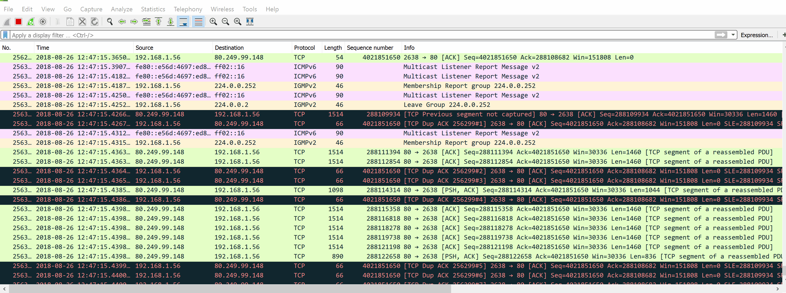
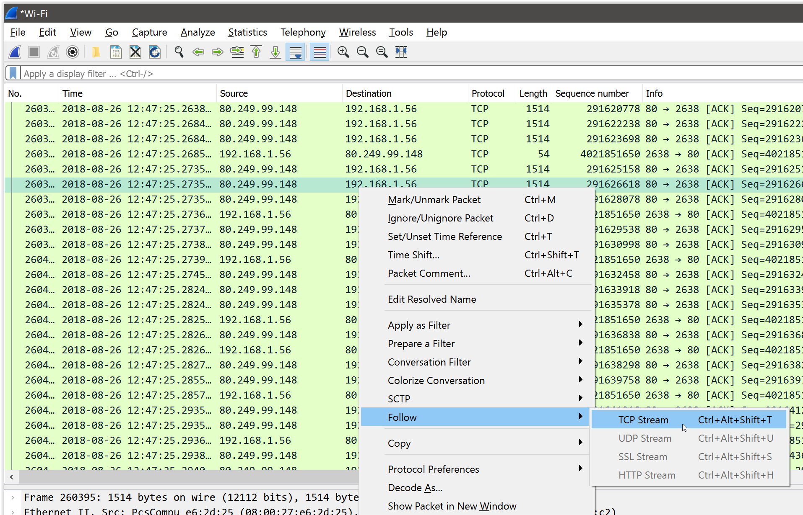
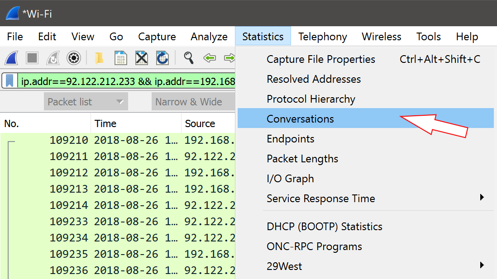
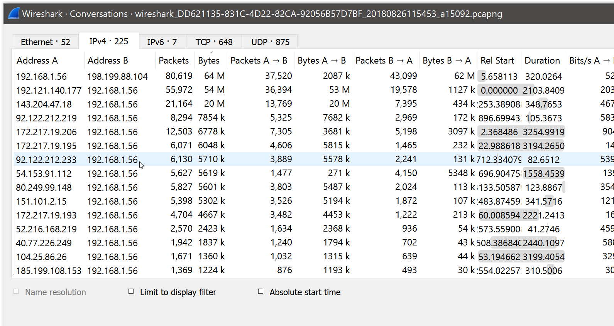
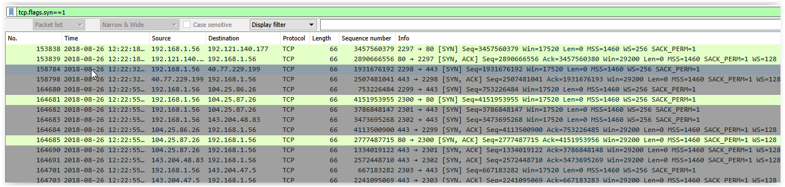

[source](https://blog.moabdelfattah.com/2018/09/02/wireshark-how-to-easily-find-a-tcp-session-in-a-huge-capture-file/)

# Wireshark – How To Easily Find A TCP Session In A Huge Capture File


Troubleshooting a specific TCP session in a Wireshark packet capture should be an easy or difficult task depending on the nature of the problem that’s being investigated, what can be cumbersome is actually finding that session in the middle of a huge capture file or even a running capture with lots of packets.



So how to find the specific session of interest?

## When you already know both TCP session peer IP’s

We have two methods:

-A quick method to zoom in on particular peers without knowing a specific session is to apply a wireshark display filter with both peer IP’s, this will show all conversations between those peers, for example:

```
ip.addr==192.168.1.2 && ip.addr==192.168.1.1
```

-After that, you could just right click any packet in a TCP conversation of interest and do a quick “Follow TCP Stream”


|Right click on a TCP session then Follow > TCP Stream, the result is a Wireshark display filter that shows only the packets in this session|

Another way to do the same is by using the “Conversations” list which can be accessed through “Statistics > Conversations” then you can sort the conversation list by bytes or number of packets in each direction or by totals which can be very useful.


The list of conversations can be accessed through the Statistics drop down menu > Conversations


The Wireshark conversations list shows a lot of useful information about all the conversations in a capture

## If you do not know one of the TCP session peer IP’s

In case one of the peers Today we are going to assume that we are lucky and have control of the application can actually start that TCP session at will to replicate the issue we are troubleshooting.

We will need then to capture certain packets that will be very useful to us, particularly the packets with the SYN flag set, this can be easily done in Wireshark using this display filter

```
tcp.flags.syn==1
```

Using this flag is a very effective way to list the first two packets of all TCP conversations in the capture, it can also show exactly which TCP connections failed to start because their SYN packets never got a SYN-ACK response 🙂 This will be shown in the capture file as TCP Retransmissions of the SYN packet.

Now just use this display filter and combine it with the source or destination IP addresses like this:

```
tcp.flags.syn==1 && ip.addr==192.168.1.1
```


A list of TCP packets with SYN flag set, the first two packets of every TCP conversation (SYN, SYN-ACK)

## Conclusion

Filtering the capture to show only TCP packets with SYN flag set provides a great way to locate a TCP session in a large capture file when both peer IP’s are not known.
