[источник](https://cisoclub.ru/rukovodstvo-po-tshark/?ysclid=mn0hle3yrd673807549)

- [ Руководство по TShark](#link_1)
  - [ Сетевой трафик](#link_2)
  - [ Знакомство с TShark](#link_3)
    - [ Список интерфейсов](#link_4)
    - [ Захват трафика](#link_5)
    - [ **Promiscuous mode**](#link_6)
  - [ Количество пакетов](#link_7)
    - [ Чтение и редактирование файла](#link_8)
    - [ **Verbose mode**](#link_9)
  - [ Формат выходных данных](#link_10)
    - [ **PDML**](#link_11)
    - [ **PS**](#link_12)
    - [ **PSML**](#link_13)
    - [ **JSON**](#link_14)
    - [ **EK**](#link_15)
    - [ **Текст**](#link_16)
    - [ Таблица](#link_17)
    - [ Разница между декодированными пакетами и кодированными пакетами](#link_18)
    - [ Преобразование PDML-файла HTML-страницы](#link_19)
    - [ Захват пакетов определенного порта](#link_20)
    - [ Экранный фильтр](#link_21)
  - [ Статистические данные](#link_22)
    - [ Статистика иерархии протоколов](#link_23)
    - [ Анализ фильтра для чтения](#link_24)
    - [ Анализ конечных точек](#link_25)
    - [ Анализ бесед](#link_26)
    - [ Анализ в экспертном режиме](#link_27)
    - [ Распределение пакетов](#link_28)
    - [ Длина пакетов](#link_29)
    - [ Анализ выходных данных на основе цвета](#link_30)
    - [ Анализ циклического буфера](#link_31)
    - [ Автоматическая остановка работы](#link_32)
    - [ Типы каналов для передачи данных](#link_33)
  - [ Сведения о версии](#link_34)
    - [ Функции отчетности](#link_35)
    - [ Форматы столбцов](#link_36)
    - [ Декодирование](#link_37)
    - [ Диссектор таблиц](#link_38)
  - [ **Elastic mapping**](#link_39)
    - [ Количество полей](#link_40)
  - [ Поля](#link_41)
    - [ Основные виды](#link_42)
    - [ Эвристическое декодирование](#link_43)
    - [ Плагины](#link_44)
    - [ Протоколы](#link_45)
    - [ Значения](#link_46)
    - [ Предпочтения](#link_47)
    - [ Папки](#link_48)
  - [ **PyShark**](#link_49)
  - [ Захват](#link_50)
    - [ Красивая презентация](#link_51)
    - [ Захваченное поле длины](#link_52)
    - [ Слои, поля Src и Dst](#link_53)
    - [ Захват **Promisc**](#link_54)

## Руководство по TShark <a name="link_1"></a>


**В этой статье пойдет речь о TShark, который является популярным анализатором сетевых протоколов. Он позволяет пользователю захватывать пакеты данных из сети. Инструмент также дает возможность читать или анализировать ранее захваченные пакеты данных из сохраненных файлов.**

### Сетевой трафик <a name="link_2"></a>

Как известно, **_сетевой трафик_** или трафик данных — это объем данных, передаваемых по сети за определенный отрезок времени. Сетевые данные в компьютерных сетях представлены в виде пакетов сетевых данных. Анализ этих сетевых пакетов обеспечивает безопасность сети, поскольку помогает пользователю отслеживать свой трафик. Если сеть отличается каким-то подозрительным объемом трафика данных, который является возможным признаком атаки, то TShark может помочь пользователю узнать об этом до того, как станет слишком поздно. Атака также будет остановлена, поскольку отчеты о трафике данных дают представление обо всей картине в целом.

**_Объем трафика_** — это термин, который используется при анализе сетевого трафика. Объем сетевого трафика — это показатель общей проделанной работы. Он определяется как средняя интенсивность трафика данных и период времени исследования его пакета сетевых данных.

### Знакомство с TShark <a name="link_3"></a>

Tshark, популярный и мощный инструмент командной строки, он используется в качестве сетевого анализатора. Инструмент был разработан компанией Wireshark. Его рабочая система очень похожа на Tcpdump, но у него есть несколько мощных декодеров и фильтров. TShark способен захватывать информацию о пакетах данных различных сетевых уровней и отображать их в вариативных форматах.

TShark применяется для **_анализа сетевого трафика в реальном времени_**, и он способен читать файлы формата .pcap для анализа информации. Подобный анализ этих соединений помогает специалистам по безопасности выявить имеющуюся сетевую проблему.

TShark — это инструмент командной строки, который способен делать все, что делает и Wireshark. Итак, стоит начать процесс знакомства с TShark. Пользователь запустит этот инструмент и изучит его возможности. Чтобы проверить все параметры, необходимо использовать следующую команду:

```
tshark -h
```

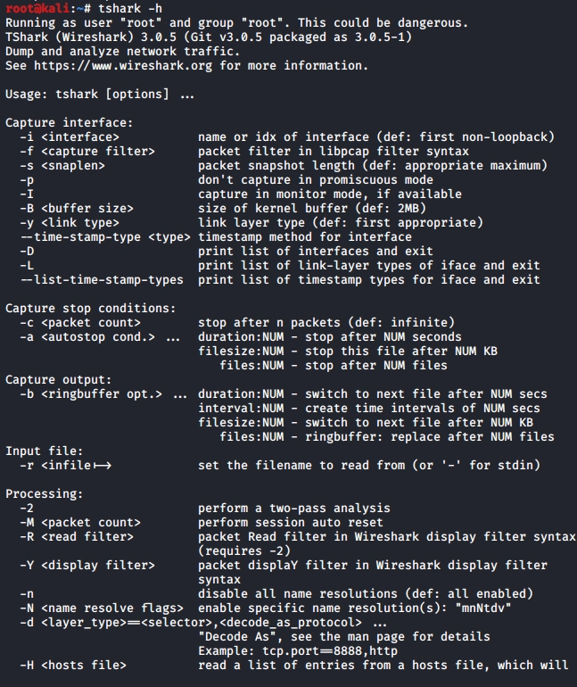

#### Список интерфейсов <a name="link_4"></a>

TShark показывает список интерфейсов, трафик которых он может перехватывать. Каждый интерфейс называется его серийным номером, и, как читатели могут увидеть, за ним следует текстовое описание сетевого интерфейса. Эти интерфейсы могут быть заданы с помощью параметра «**-i**», который применяется для указания сети, трафик которой пользователь хочет захватить. Чтобы проверить все интерфейсы, человек должен использовать другой параметр «**—\*\***d\*\*», как показано на рисунке ниже:

```
tshark -D
```

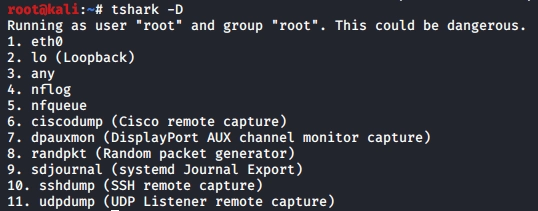

#### Захват трафика <a name="link_5"></a>

Настала пора попробовать захватить трафик. У пользователя есть различные возможности для выбора интерфейса для захвата трафика, поэтому можно выбрать любой из них в зависимости от своих потребностей. Но в данном сценарии интерфейс, который пользователь собирается исследовать, — это «**eth0**». Для того чтобы захватить трафик, нужно инициировать его тоже, так как человек тестирует это в контролируемой сети. Для этого он будет использовать команду **_ping_**, а затем просто укажет имя интерфейса с помощью параметра «**-i**», как показано на рисунке ниже:

```
ping www.hackingarticles.in
tshark -i eth0
```

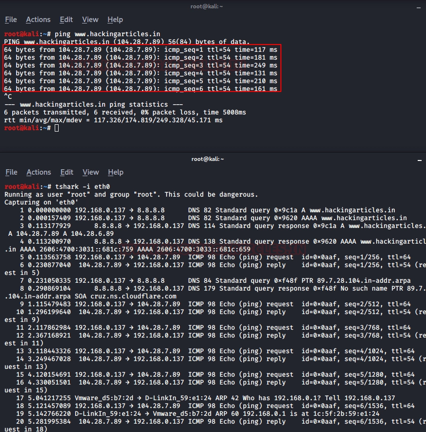

Как видно на картинке, инструмент выполняет трехстороннее рукопожатие, а затем запускает процесс запроса ICMP и получает ответ.

#### **Promiscuous mode** <a name="link_6"></a>

В сети этот режим используется в качестве контроллера интерфейса, который заставляет TShark передавать весь трафик, что он получает, на центральный процессор, а не передавать его в другое место, где происходит снифинг пакетов. Такое иметь место быть на маршрутизаторе или на компьютере, подключенном к проводной локальной сети.

При использовании Promiscuous mode нужно будет настроить его с помощью **ifconfig** так, чтобы инструмент давал возможность пользователю захватывать пакеты данных всей сети. Поэтому человек начинает с пинга веб-сайта и пытается захватить его пакеты данных.

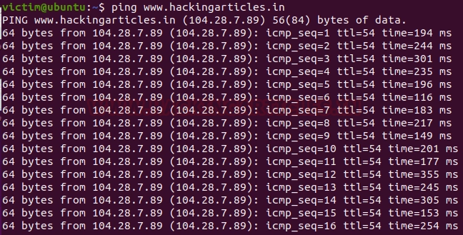

Теперь следует настроить этот режим. Пользователь будет выполнять эти команды и попытается захватить пакеты:

```
ifconfig eth0 promisc
tshark -i eth0
```

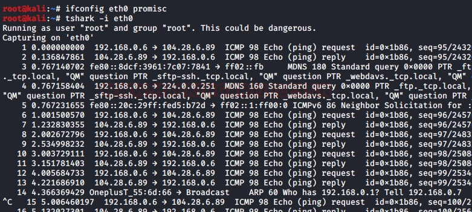

### Количество пакетов <a name="link_7"></a>

Tshark обладает удивительными функциями, с которыми пользователь сможет работать более эффективно. Он будет способен получить доступ к этим функциям, используя различные параметры. Одним из таких параметров является «**-с**», он позволяет человеку захватить точное количество данных, которые ему нужны, и будет отображать только их. Эта опция помогает уточнить результат захваченного трафика.

```
tshark -i eth0 -c 10
```

#### Чтение и редактирование файла <a name="link_8"></a>

В Tshark пользователь может редактировать и читать файл формата .**pcap**. Опция записи (**-w**) позволяет записывать исходные пакетные данные в стандартный формат .pcap, в то время как опция чтения (**-r**) дает возможность считывать эти необработанные выходные пакеты данных в желаемом порядке. Для записи пакетов в файл формата .pcap следует использовать следующую команду:

```
tshark -i eth0 -c 10 -w packets.pcap
```

Чтобы прочитать содержимое файла, нужно ввести следующую команду:

```
tshark -r packets.pcap
```

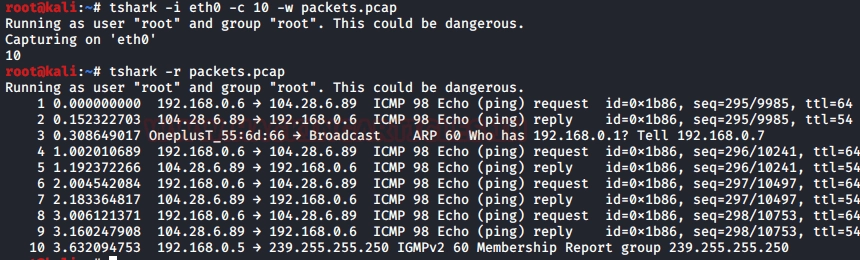

#### **Verbose mode** <a name="link_9"></a>

Verbose mode дает пользователю дополнительные сведения о пакетах в трафике. Используя его, человек может видеть информацию, содержащуюся в каждом пакете. Для этой опции следует применить параметр «**—\*\***v\*\*».

```
tshark -r packets.pcap -V
```

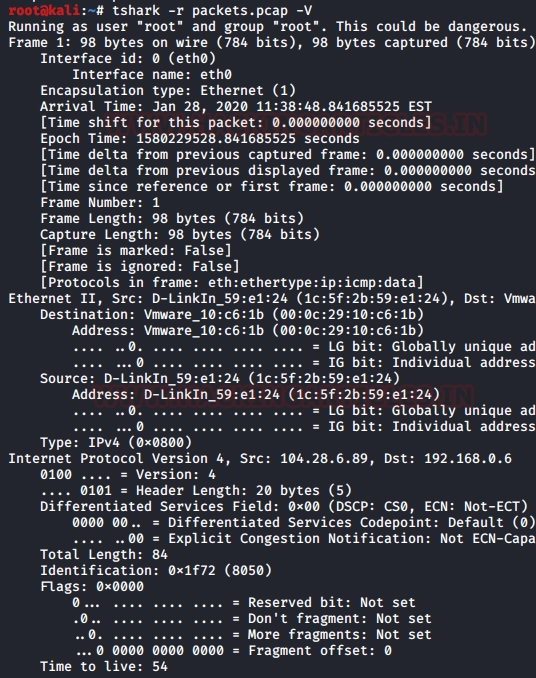

### Формат выходных данных <a name="link_10"></a>

Для удобства в TShark есть опция «**—\*\***t\*\*», которая позволяет сохранять декодированные пакеты в различных выходных форматах. Человек может установить формат выходных данных таким образом, чтобы его было легко прочесть. Чтобы просмотреть все доступные параметры, нужно ввести следующую команду:

```
tshark -T x
```

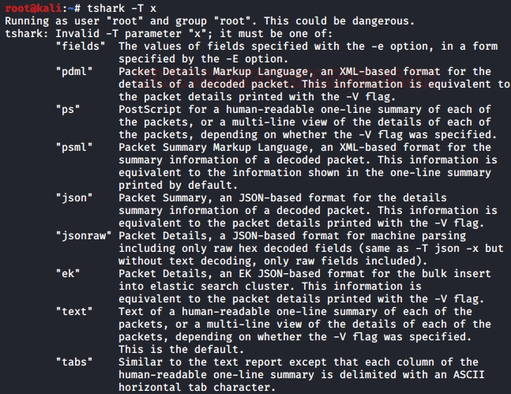

#### **PDML** <a name="link_11"></a>

PDML расшифровывается как **_Packet Details Mark-Up Language_**, который основан на XML. Эта информация вполне эквивалентна режиму Verbose mode, о котором говорилось ранее. А чтобы получить вывод данных в этом формате, надо ввести следующую команду:

```
tshark -r packets.pcap -T pdml
```

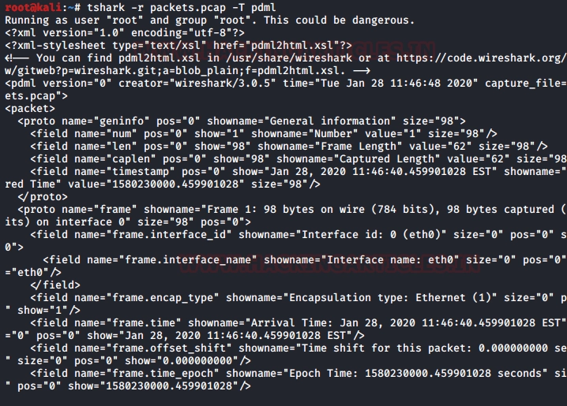

#### **PS** <a name="link_12"></a>

PS расшифровывается как **_PostScript_**. Эти выходные данные представлены в виде однострочной сводки по каждому пакету данных или многострочного подробного представления пакета данных в зависимости от спецификации. Эти однострочники очень быстро читаются, а так они вполне надежны. Для вывода данных в этом формате следует использовать следующую команду:

```
tshark -r packets.pcap -T ps
```

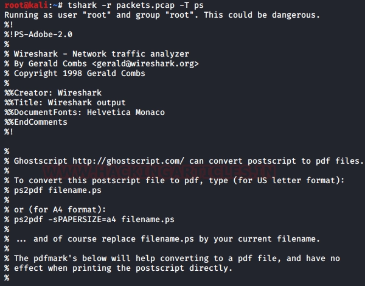

#### **PSML** <a name="link_13"></a>

PSML расшифровывается как **_Packet Summary Mark-Up Language_**. Этот формат на основе XML, такой как PDML, он суммирует подробную информацию о пакетах. И для получения этого типа формата данных надо ввести следующее:

```
tshark -r packets.pcap -T psml
```

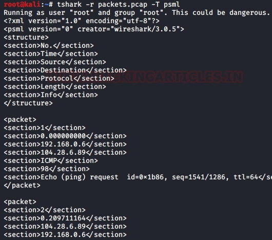

#### **JSON** <a name="link_14"></a>

JSON расшифровывается как **_Java-Script Object Notation_**. Это открытый стандартный формат файла, который отображает текст в удобно читаемой форме. Информация в этом формате полностью документирована и передана в **Wolfram**. Чтобы увидеть, что представляют собой пакеты данных в этом формате, необходимо ввести:

```
tshark -r packets.pcap -T json
```

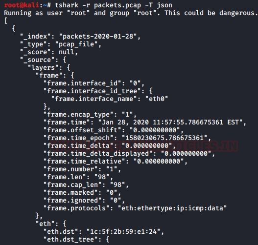

#### **EK** <a name="link_15"></a>

Это функция формата **JSON** с разделителями новой строки для массового импорта с опцией гибкого поиска. Для этого формата следует использовать следующую команду:

```
tshark -r packets.pcap -T ek
```

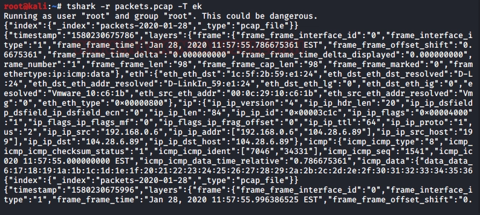

#### **Текст** <a name="link_16"></a>

Текст представляет собой понятную для человека однострочную сводку каждого из пакетов. Это самый простой из форматов. Для него человек будет использовать следующую команду:

```
tshark -r packets.pcap -T text
```

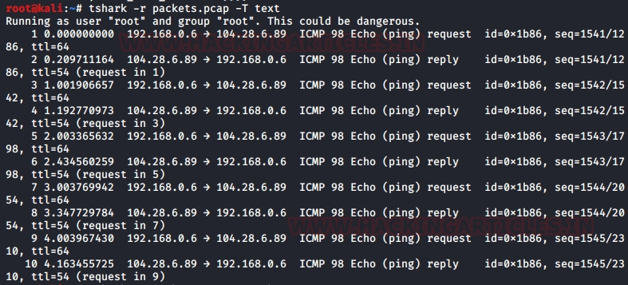

#### Таблица <a name="link_17"></a>

Этот формат очень похож на текст, за исключением того, что он включает в себя горизонтальное разделение ASCII (oxo9) между каждым столбцом. Чтобы попробовать этот формат, следует ввести:

```
tshark -r packets.pcap -T tabs
```

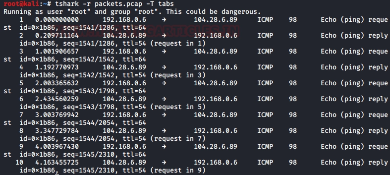

#### Разница между декодированными пакетами и кодированными пакетами <a name="link_18"></a>

Когда человек пытается записать пакеты данных в реальном времени в файл формата .pcap, он сжимает все данные в более мелкие сегменты. Чтобы лучше понять эти пакеты данных, нужно их декодировать, что приведет к разнице в размере файла. Чтобы проверить размер любого файла в данный момент, нужно использовать следующую команду:

```
ls -lh packets.p*
```

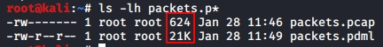

Как уже было сказано, есть большая разница в этих файлах, поэтому человек использует методы декодирования для извлечения нужной ему информации.

#### Преобразование PDML-файла HTML-страницы <a name="link_19"></a>

Единственное различие между Wireshark и TShark заключается в том, что Wireshark — это инструмент на основе графического интерфейса, а TShark — инструмент на основе командной строки. Но с помощью некоторого внешнего источника человек также может просматривать пакеты данных в формате HTML. Поэтому для достижения этой цели сначала нужно сохранить пакеты данных в формате PDML, а затем преобразовать их в XML-файл с помощью следующей команды:

```
tshark -r packets.pcap -T pdml > packets.xml
```

XML-файл будет сохранен в папке **/usr/share/wireshark/pdml2html.xsl**. Итак, человек собирается использовать инструмент **_xsltproc_** для запуска этого файла, который поможет создать HTML-страницу. Создание HTML-страницы приведет к форматированию всей ненужной информации и позволит просматривать только полезные данные. Для создания HTML-страницы, следует использовать следующую команду:

```
xsltproc /usr/share/wireshark/pdml2html.xsl packets.xml > packets.html
```

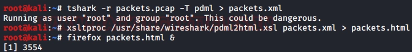

Чтобы открыть HTML-страницу в браузере, нужно обратить внимание на приведенное выше изображение и использовать следующую команду:

```
firefox packets.html &
```

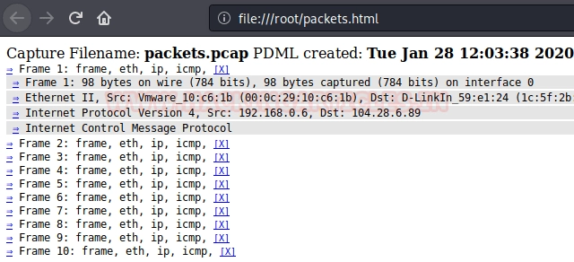

#### Захват пакетов определенного порта <a name="link_20"></a>

Очень часто пользователь применяет Wireshark на определенном порту. А с помощью опции «**-f**» человек также может захватывать пакеты данных определенного порта в TShark. Это помогает лучше анализировать пакеты данных сети. Пользователи используют эту функцию для захвата TCP-порта номер 80:

```
tshark -i eth0 -c 5 -f "tcp port 80"
```

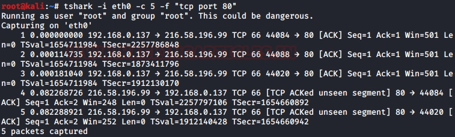

#### Экранный фильтр <a name="link_21"></a>

Экранный фильтр был представлен компанией Wireshark. Он помогает пользователям фильтровать захваченные пакеты данных или пакеты данных в реальном времени. С помощью этого фильтра человек может получить любой вид фильтра, который он хочет.

В данном сценарии пользователь применяет фильтр **GET request** для захвата только **GET request** из трафика. Используется команда:

```
tshark -i eth0 -c 5 -f "tcp port 80" -Y 'http.request.method == "GET" '
```

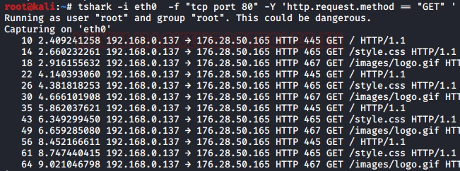

### Статистические данные <a name="link_22"></a>

TShark собирает различные типы статистических данных и отображает их в результате после завершения чтения захваченного файла. Для этого будет использоваться параметр «**-z**» в TShark. Изначально, чтобы узнать обо всех различных опциях внутри параметра «**-z**», пользователь откроет TShark уже с включенной опцией, за которой будет следовать ключевое слово **help**. Это даст человеку исчерпывающий список различных поддерживаемых форматов, как показано на рисунке ниже.

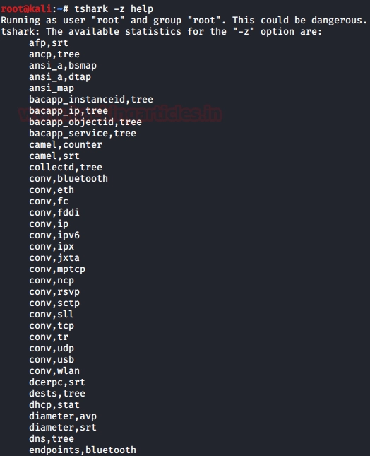

#### Статистика иерархии протоколов <a name="link_23"></a>

Используя TShark, человек может создать иерархию на основе протоколов, в которой будет перечислено количество пакетов и байтов. Нужно использовать опцию «**io,phs**» в параметре «**-z**». В случае, когда фильтр не задан после опции «**io,phs**», статистика будет рассчитана для всех пакетов в радиусе видимости. Но если предусмотрен определенный фильтр, то TShark будет вычислять статистику для тех пакетов, которые соответствуют выбору, сделанному пользователем. Для демонстрации пользователь сначала захватил некоторый трафик и записал его содержимое в файл .pcap. Затем он будет использовать трафик из файла и сортировать эти данные прямо в иерархию протоколов. Читатели могут заметить, что у пользователя есть определенное количество фреймов, размер пакетов в байтах и протокол, используемый для передачи.

```
tshark  -r wlan.pcap -z io,phs
```

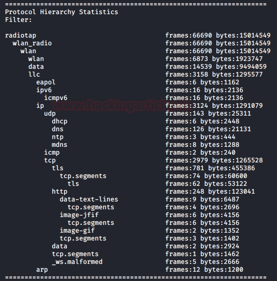

#### Анализ фильтра для чтения <a name="link_24"></a>

Во время первого анализа пакета должен быть применен указанный фильтр (который использует синтаксис фильтров чтения/отображения, а не фильтров захвата). Пакеты, которые не соответствуют фильтру, не рассматриваются для будущих случаев. Этот параметр имеет смысл при нескольких проходах. Стоит обратить свое внимание, что поля, такие как «**response in frame #**»не могут быть использованы с этим фильтром, так как они не будут вычислены. Параметр «**-2**» выполняет двухпроходный анализ. Это приводит к тому, что TShark буферизует выходные данные до тех пор, пока не будет выполнен весь первый проход, но также заполняет поля, требующие будущих знаний, а также правильно вычисляет зависимости фреймов повторной сборки. Здесь пользователь может увидеть два различных анализа, один из которых является анализом первого прохода, а второй — двухпроходным анализом.

```
tshark -r wlan.pcap -z io,phs,udp -q
tshark -r wlan.pcap -z io,phs -q -2 -R udp
```

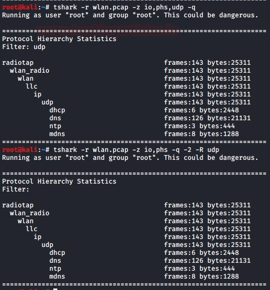

#### Анализ конечных точек <a name="link_25"></a>

Следующий пункт, который помогает человеку разобраться со статистикой, — это «**Конечные точки**». Будет создана таблица в которой перечислены все конечные точки, которые можно было бы увидеть при захвате. Функция «**type»**, которая может быть использована с параметром **endpoint**, укажет тип конечной точки, для которой человек хочет сгенерировать статистику.

Список конечных точек, поддерживаемых TShark, выглядит следующим образом:

|     |               |                                                          |
| --- | ------------- | -------------------------------------------------------- |
| №   | Фильтр        | Описание                                                 |
| 1   | **bluetooth** | Адреса Bluetooth                                         |
| 2   | **eth**       | Адреса Ethernet                                          |
| 3   | **fc**        | Адреса оптоволоконных каналов                            |
| 4   | **fddi**      | Адреса FDDI                                              |
| 5   | **ip**        | Адреса IPv4                                              |
| 6   | **ipv6**      | Адреса IPv6                                              |
| 7   | **ipx**       | Адреса IPX                                               |
| 8   | **jxta**      | Адреса JXTS                                              |
| 9   | **ncp**       | Адреса NCP                                               |
| 10  | **rsvp**      | Адреса RSVP                                              |
| 11  | **sctp**      | Адреса SCTP                                              |
| 12  | **tcp**       | Пары сокетов TCP/IP: поддерживаются как IPv4, так и IPv6 |
| 13  | **tr**        | Адреса Token Ring                                        |
| 14  | **usb**       | Адреса USB                                               |
| 15  | **udp**       | Пары сокетов UDP/IP: поддерживаются как IPv4, так и IPv6 |
| 16  | **wlan**      | Адреса IEEE 802.11                                       |

В случае, если пользователь указал определенный фильтр, то расчеты статистики выполняются для этого конкретного фильтра. Таблица, подобная той, что сгенерирована на изображении, показанном ниже, создается путем подбора однострочной формы каждой беседы и отображается напротив количества пакетов на байт в каждом направлении, а также общего количества пакетов на байт. Данные в этой таблице по умолчанию сортируются в соответствии с общим количеством фреймов.

```
tshark -r wlan.pcap -z endpoints,wlan -q | head
```

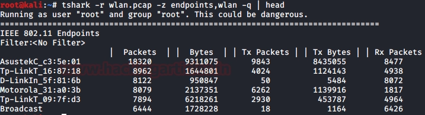

#### Анализ бесед <a name="link_26"></a>

Стоит перейти к следующему разделу, который очень похож на предыдущий. Помогает со статистикой именно «conversation». Будет создана таблица, в которой перечислены все разговоры, что можно было бы увидеть при захвате. Функция **type**, что используется с опцией **conversation**, укажет тип беседы, для которой человек хочет сгенерировать статистику.

Если пользователь установил определенный фильтр, то вычисления статистики выполняются для этого конкретного указанного фильтра. Таблица, сгенерированная путем подбора однострочной формы каждого разговора и отображаемая с количеством пакетов на байт в каждом направлении и общем количеством пакетов на байт, будет показана на экране. Данные сортируются в соответствии с общим количеством фреймов.

```
tshark -r wlan.pcap -z conv,wlan -q | head
```

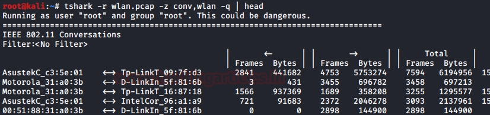

#### Анализ в экспертном режиме <a name="link_27"></a>

Модуль статистики TShark обладает **_экспертным режимом_**. Он собирает огромное количество данных на основе полученной информации, а затем печатает ее в определенном порядке. Все эти данные сгруппированы в разделы, такие как ошибки, предупреждения и т.д. Человек также может использовать экспертный режим с определенным протоколом. В этом случае будут отображены все экспертные элементы конкретного протокола.

```
tshark -r wlan.pcap -z expert -q | head
```

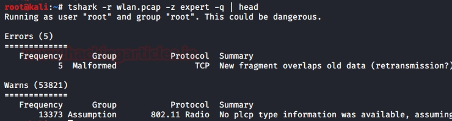

#### Распределение пакетов <a name="link_28"></a>

При этом варианте человек берет трафик из пакета, а затем прогоняет его через опцию «**http,tree**» с параметром «**-z**», чтобы подсчитать количество HTTP-запросов, их моды, а также код состояния. Это модульный подход, который очень легко понять и потом проанализировать свои действия. Здесь, в данном случае, пользователь взял пакет, который он захватил ранее, а затем прогнал его через опцию, что предоставила ему информацию о том, что в общей сложности было сгенерировано 126 запросов, из которых 14 вернули «**200 OK**». Это означает, что остальные из них либо выдали ошибку, либо были перенаправлены на другой сервер, выдав ответ серии 3XX.

```
tshark -r wlan.pcap -z http,tree -q
```

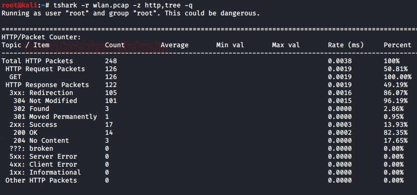

#### Длина пакетов <a name="link_29"></a>

Поскольку идет речь о структуре похожей на дерево, стоит немного ее исследовать. У человека есть много способов, с помощью которых он может применить опцию «**tree**» в сочетании с другими функциями. Чтобы продемонстрировать это, человек решил использовать параметр длины пакета с параметром «tree». Это позволит отсортировать данные на основе размера пакетов, а затем сгенерировать таблицу с ними. Теперь эта таблица будет содержать не только длину пакетов, но и их количество. Минимальное значение длины будет находиться в диапазоне размеров пакетов. Также инструмент вычислит размер и процент пакетов внутри диапазона установленной длины.

```
tshark -r wlan.pcap -z plen,tree -q
```

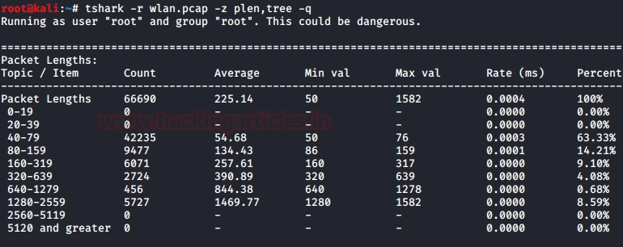

#### Анализ выходных данных на основе цвета <a name="link_30"></a>

**Стоит обратить внимание**: терминал должен поддерживать вывод цветов, чтобы эта опция работала правильно.

Человек может включить цвета для пакетов в соответствии со стандартными фильтрами Wireshark. В Windows цвета ограничены установленными вариантами. В данном случае пользователь может настроить цвета в соответствии с фильтром отображения. Это помогает быстро найти определенный пакет в группе подобных пакетов. Он также полезен при обнаружении рукопожатий в коммуникационном трафике. Его можно включить с помощью следующей команды:

```
tshark -r color.pcap --color
```

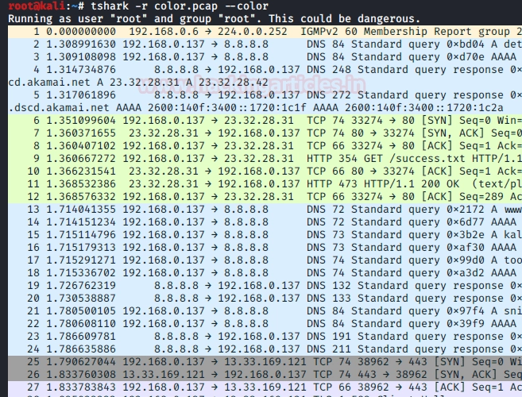

#### Анализ циклического буфера <a name="link_31"></a>

По умолчанию TShark работает в режиме «**_нескольких файлов_**». Таким образом, TShark записывает данные в несколько файлов захвата. Когда первый файл захвата заполняется до определенной степени, инструмент переключается на следующий файл и так далее. Имена файлов, которые человек хочет создать, можно указать с помощью параметра «**-w**». Количество файлов, данные о времени их появления будут объединены с именем, указанным рядом с параметром «-**w**», чтобы сформировать полное имя файла.

Опция «**files»** будет заполнять новые файлы до тех пор, пока не будет указано их количество. В этот момент TShark отбросит данные в первом файле и начнет запись в следующий файл. Если параметр «**files»** не включен, новые файлы заполняются до тех пор, пока одно из условий остановки захвата не будет выполнено или пока диск не будет до конца заполнен.

Существует множество критериев, по которым работает циклический буфер, но в данном случае человек использовал только 2 из них. Файлы и размер файла.

**Файлы**: значение начинается снова с первого файла после того, как было записано значение количества файлов (образуется циклический буфер). Это значение должно быть меньше 100000.

**Размер файла**: значение переключается на следующий файл после того, как первый достигнет установленного размера (КБ). Стоит обратить внимание, что максимальный размер файла ограничен **_2 гигабайтами_**.

```
tshark -I eth0 -w packetsbuffer.pcap -b filesize:1 -b file:3
```

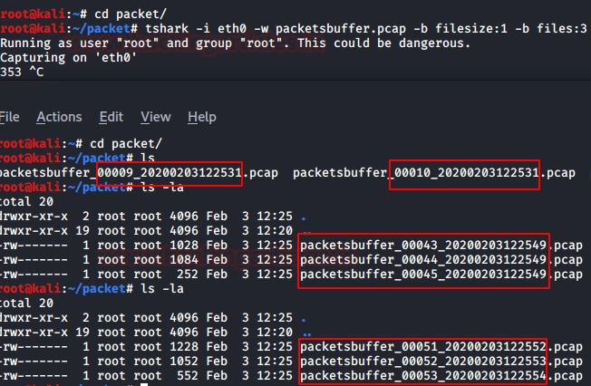

#### Автоматическая остановка работы <a name="link_32"></a>

Под огромным массивом опций есть одна, называемая **auto-stop**. Как следует из названия, с помощью нее можно автоматически остановить захват трафика после того, как установленные условия будут выполнены.

**Длина**

Есть несколько вариантов, в данном случае человек использовал критерий продолжительности. Он уточнил продолжительность и ограничил ее 10-ю. Это значение выражается в секундах. Итак, после захвата пользователь видит, что за 10 секунд он захватил 9 пакетов.

```
tshark -i eth0 -a duration:10
```

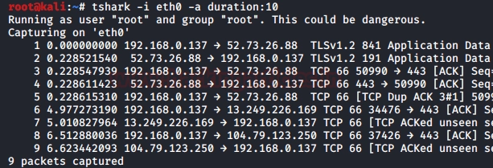

**Размер файла**

Еще одним критерием для автоматической остановки работы является размер файла. TShark прекратит записи в указанный файл захвата после того, как он достигнет размера, установленного пользователем. В данном случае пользователь установил размер файла равным 1. Это значение считается в КБ. Он использовал команду для вывода списка каталогов, чтобы показать, что захват был прекращен, как только файл достиг размера 1 кб.

```
tshark -i eth0 -w 1.pcap -a filesize:1
```

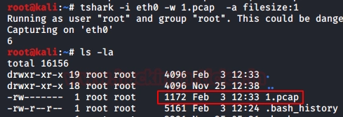

#### Типы каналов для передачи данных <a name="link_33"></a>

Пользователь также может изменить статистику захваченных данных трафика на основе типов каналов передачи данных. Для этого ему придется использовать независимый параметр «**—\*\***l**». В данном случае человек использовал его, чтобы показать, что у него есть каналы передачи данных, такие как **EN10MB\*\*, указанные для трафика Ethernet.

```
tshark -L
```

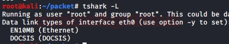

### Сведения о версии <a name="link_34"></a>

Нужно ввести простую команду, чтобы читатели могли понять и соотнести все практические действия, выполненные в этой статье, с версией программы. Эта информация изображена на рисунке ниже. Данный параметр выводит информацию о версии установленного TShark.

```
tshark -v
```

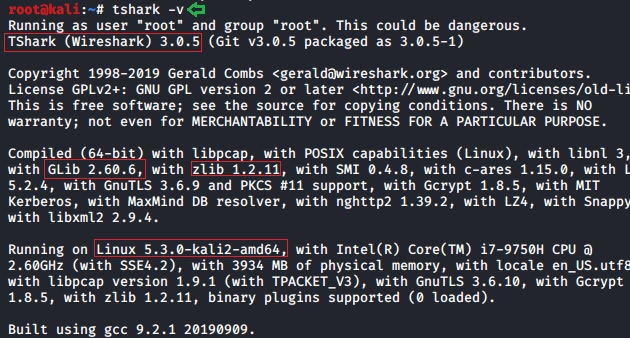

#### Функции отчетности <a name="link_35"></a>

Во время любого захвата сети существует острая потребность в отчетности, чтобы человек мог поделиться результатами с командой, а также с начальством и иметь подтвержденные доказательства любой деятельности внутри нее. По тем же причинам TShark предоставил человеку прекрасный вариант (**-G**). С помощью этой опции TShark может распечатать список нескольких типов отчетов, которые будут сгенерированы. Официальное руководство по TShark использует слово **_Глоссарии_** для описания данных типов отчетности.

```
tshark -G help
```

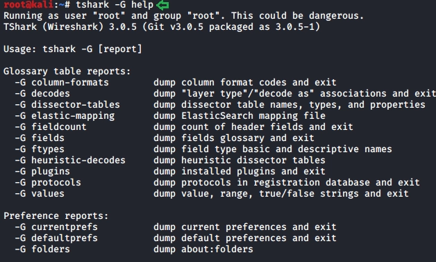

#### Форматы столбцов <a name="link_36"></a>

Конечно, есть опция форматирования столбцов, доступная в разделе отчетов TShark. Чтобы изучить его содержимое, человек выполнил команду, как показано на рисунке ниже. Читатели видят, что он печатает список с определенными знаками, которые могут быть использованы при создании отчета. Также есть идентификатор VLAN, дата, время, адрес назначения, порт назначения, длина пакета, протокол и другие данные.

```
tshark -G column-formats
```

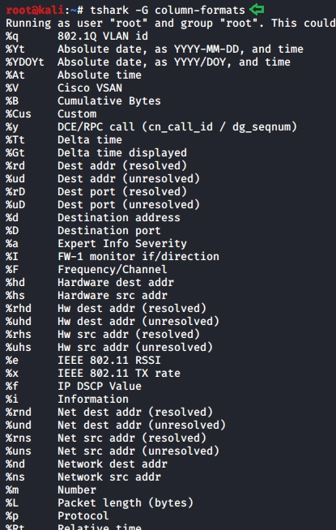

#### Декодирование <a name="link_37"></a>

Эта опция способна сгенерировать 3 поля, связанные со слоями, а также декодированным протоколом. Существует ограничение, применяемое для одной записи в строке с этой опцией. Первое поле, имеющее значение «**s1ap.процесс.sout**» сообщает пользователю тип слоя сетевых пакетов. Далее он получает значение селектора в десятичном формате. Наконец, у человека есть расшифровка того, что было получено при захвате. Он использовал команду **head**, так как выходные данные были довольно большими, чтобы поместиться на одном скриншоте.

```
tshark -G decodes | head
```

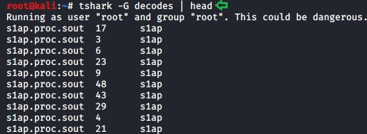

#### Диссектор таблиц <a name="link_38"></a>

Большинство людей, читающих эту статью, уже знакомы с концепцией **_диссектора_**. Если нет, то простыми словами Dissector — это синтаксический анализатор протокола. Выходные данные, генерируемые этой опцией, состоят из 6 полей. Начиная с имени таблицы диссектора, оно используется для таблицы диссектора в формате GUI. Далее, у человека уже есть тип и база для отображения имени протокола. Наконец, у него также есть возможность для декодирования полученной информации.

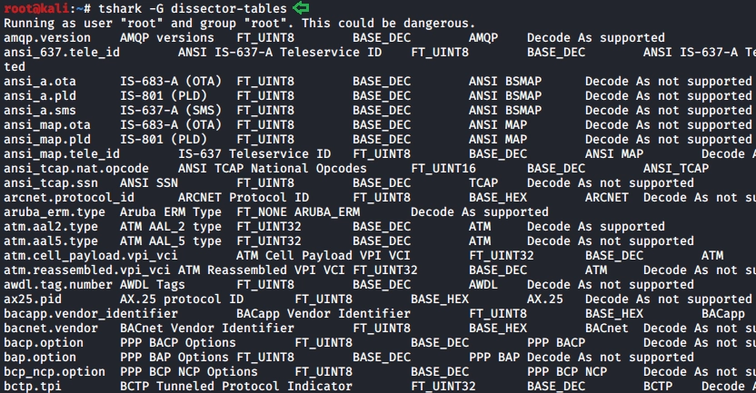

### **Elastic mapping** <a name="link_39"></a>

Mapping — это очертание документов, хранящихся в индексе. **Elasticsearch** поддерживает различные типы данных для полей в документе. Параметр **elastic-\*\***mapping** в TShark выводит данные, хранящиеся внутри файла сопоставления ElasticSearch. Из-за большого количества данных для печати пользователь решил также использовать команду **head\*\*.

```
tshark -G elastic-mapping | head
```

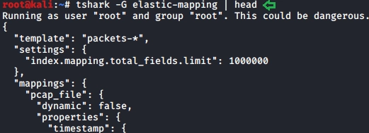

#### Количество полей <a name="link_40"></a>

В сетевой трассировке бывают моменты, когда нужно получить количество полей заголовка, перемещающихся в любой момент. В таких случаях TShark может помочь. С помощью опции **fieldcount** человек способен легко распечатать количество полей заголовка. Как можно увидеть на изображении, приведенном ниже, у пользователя есть 2522 протокола и 215000 полей, которые были предварительно распределены.

```
tshark -G fieldcount
```

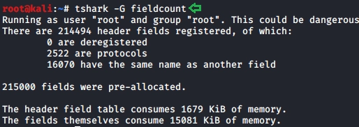

### Поля <a name="link_41"></a>

TShark также может получить содержимое регистрационной базы данных. Выходные данные, генерируемые этой опцией, не так легко интерпретировать, как другие. Некоторые пользователи могут использовать любой другой инструмент синтаксического анализа для получения более точного результата. Каждая запись в выходных данных является протоколом или файлом заголовка. Это можно различить по первому полю записи. Если поле P, то это протокол, а если F, то это поле заголовка. В случае с протоколами есть еще 2 поля. Один из них говорит о протоколе, а другие поля показывают аббревиатуру, используемую для указанного протокола. В случае с заголовком ситуация немного отличается. Более того, есть еще 7 полей. Пользователь получает имя, аббревиатуру, тип, аббревиатуру родительского протокола, базу для отображения файлов, поле для описания рекламы, битовую маску.

```
tshark -G fields | head
```

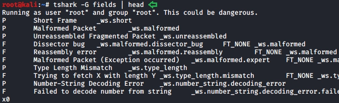

#### Основные виды <a name="link_42"></a>

TShark также помогает человеку создавать отчеты, концентрирующиеся вокруг основных типов сетевых протоколов. Это сокращенно называется **ftype**. Этот тип отчета состоит всего из 2 полей. Один для FTYPE, а другой для его описания.

```
tshark -G ftypes
```

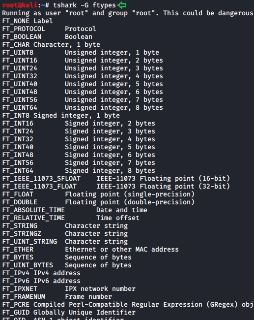

#### Эвристическое декодирование <a name="link_43"></a>

Сортировка диссекторов на основе эвристического декодирования — это одна из тех вещей, которые должны быть легко доступны. По той же причине у человека есть возможность эвристического декодирования в TShark. Эта опция дает возможность для печати всех эвристических декодов, которые в данный момент установлены. Состоит из 3-х полей.

```
tshark -G heuristic-decodes
```

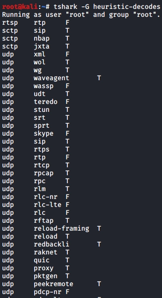

#### Плагины <a name="link_44"></a>

Плагины — это очень важный тип опций, который был интегрирован с опциями отчетности Tshark. Как следует из названия, он печатает имя всех установленных плагинов. Поле, из которого делается этот отчет, состоит из библиотеки, версии, типа плагинов и пути, по которому они находятся.

```
tshark –G plugins
```

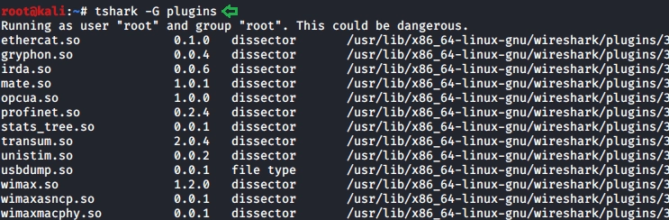

#### Протоколы <a name="link_45"></a>

Если читатели хотят знать подробности о протоколах, которые записываются в базу данных, они могут использовать параметр **protocols**. Этот вывод также немного не читабелен, так что пользователь может использовать любой сторонний инструмент, чтобы составить отчет. Этот параметр выводит данные в 3-х полях. У человека есть имя протокола, краткое имя и имя фильтра.

```
tshark –G protocols | head
```

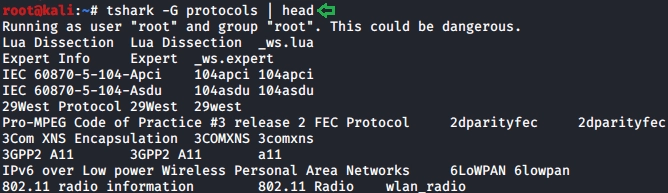

#### Значения <a name="link_46"></a>

Отчет состоит из строк значений, строк диапазона, строк true/false. Здесь доступны три типа записей. Первое поле может состоять из одного из этих трех символов:

- V: строки значений;
- R: строки диапазона;
- T: true/false строки.

Кроме того, в строках значений есть аббревиатура поля, значение и сама строка. В строках диапазона есть те же значения, за исключением того, что они содержат информацию, связанную с нижней и верхней границей строки.

```
tshark –G values | head
```

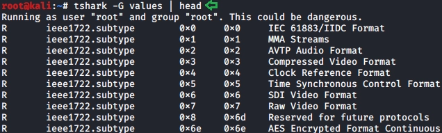

#### Предпочтения <a name="link_47"></a>

В случае, если пользователю требуется пересмотреть текущие настройки, установленные в системе, он может использовать параметры **currentprefs** для выбора предпочтений, сохраненных в файле.

```
tshark –G currentprefs | head
```

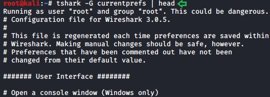

#### Папки <a name="link_48"></a>

Предполагается, что пользователь хочет вручную изменить конфигурацию или получить информацию о программе. Ему нужен путь к этим файлам, чтобы взглянуть на них. Здесь пригодится опция **folders**.

```
tshark –G folders
```

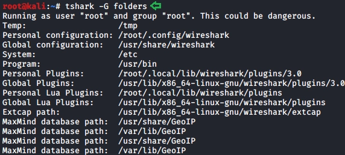

Поскольку читатели так много знают о TShark, будет несправедливо, если пользователь не расскажет об инструменте, который сильно зависит от данных TShark. Пора поговорить о **PyShark**.

### **PyShark** <a name="link_49"></a>

По сути, это Shell, основанный на Python. Его функциональность заключается в том, что он позволяет анализировать пакеты Python с помощью диссекторов TShark. Многие инструменты выполняют одну и ту же работу более или менее хорошо, но разница заключается в том, что этот инструмент может экспортировать XML для использования его синтаксического анализа.

**Установка**

Поскольку PyShark был разработан с использованием Python 3, нужно установить его, как показано на рисунке ниже.

```
apt install python3
```

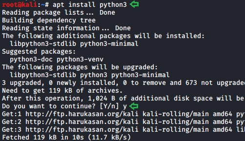

PyShark доступен через pip. Но у пользователя нет pip для Рython 3, поэтому также нужно установить и его.

```
apt install python3-pip
```

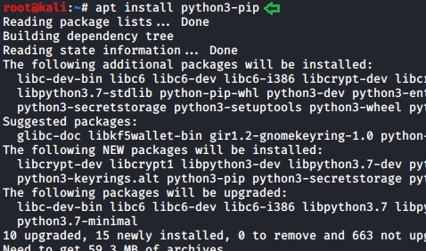

Поскольку у человека уже есть Рython3 с pip, он установит Рyshark с помощью команды. Он также может установить PyShark, клонировав git и запустив программу установки.

```
pip3 install pyshark
```

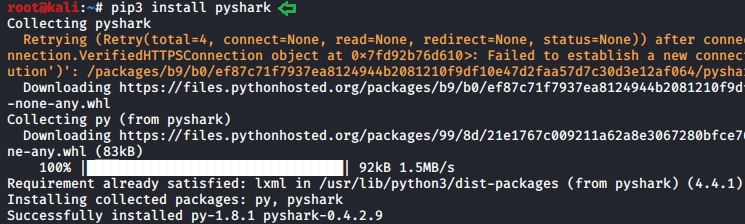

### Захват <a name="link_50"></a>

Теперь, чтобы начать, нужен интерпретатор Рython. Чтобы получить его, пользователь пишет **python3** и нажимает **Еnter**. Теперь, когда у него есть интерпретатор, самое первое, что нужно сделать, — это импортировать PyShark. Затем он определяет сетевой интерфейс для захвата. Также человек определит значение параметра **timeout**.

Наконец, пользователь начинает захват. Здесь он видит, что были захвачены 9 пакетов.

```
python3
import pyshark
capture = pyshark.LiveCapture(interface=’eth0’)
capture.sniff(timeout=5)
capture
```

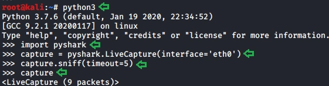

#### Красивая презентация <a name="link_51"></a>

Существует несколько способов, которыми PyShark может представлять данные внутри захваченного пакета. В предыдущей практике были захвачены 9 пакетов. Стоит взглянуть на первый пакет, который был захвачен с помощью PyShark. Здесь пользователь может увидеть, что у него есть послойный анализ с уровнем ETH, уровнем IP и уровнем TCP.

```
capture[1].pretty_print()
```

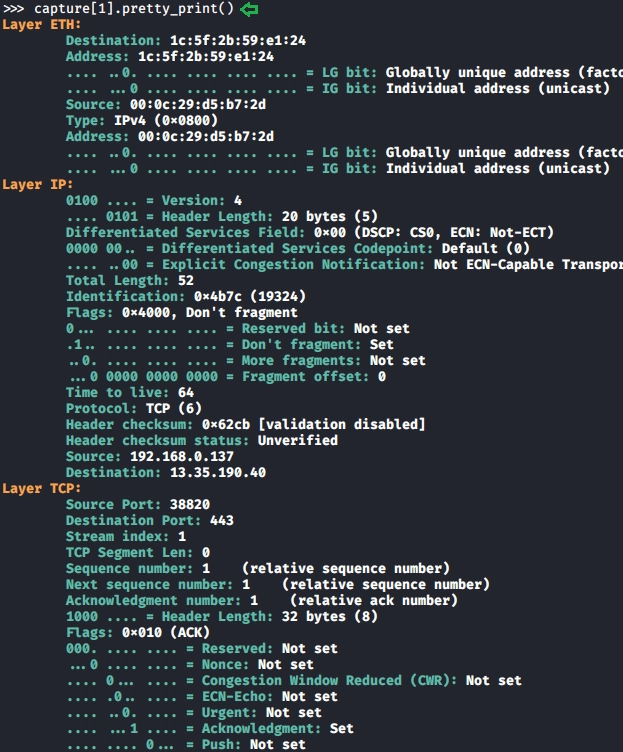

#### Захваченное поле длины <a name="link_52"></a>

При захвате пользователь увидел некоторые данные, которые состоят из нескольких атрибутов. Эти атрибуты нуждаются в полях для хранения. Чтобы исследовать данную область, человек будет использовать функцию **dir** в Python. Человек взял пакет, а затем определил переменную с именем **pkt** со значением этого пакета и сохранил все данные. Затем, используя функцию dir, он увидел, что исследовал поля внутри этого конкретного случая. Он понимает, что есть функция **pretty_print**. Также есть одно поле с именем **captured_length** для чтения, в которое он запишет имя переменной, за которым следует имя поля с точкой (.) между ними, как показано на рисунке ниже.

```
capture[2]
pkt = capture[2]
pkt
dir(pkt)
pkt.captured_length
```

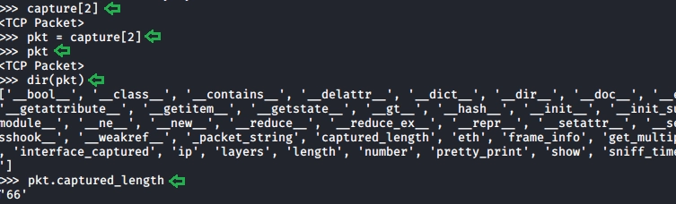

#### Слои, поля Src и Dst <a name="link_53"></a>

Когда пользователь перечислил поля, он увидел, что у него есть еще одно поле с именем **layers**. Человек прочитает его содержимое, чтобы узнать, что у него есть 3 слоя в этом захвате. Теперь, чтобы заглянуть в определенный слой, нужно получить его поля. Для этого пользователь снова будет использовать функцию **dir**. Человек уже использовал функцию dir на слое ETH, как показано на рисунке ниже. У него есть поле с именем **src**, что означает источник, и **dst**, что означает пункт назначения. Он проверил значение в этих полях, чтобы найти физический адрес источника и пункт назначения.

```
pkt.layers
pkt.eth.src
pkt.eth.dst
pkt.eth.type
```

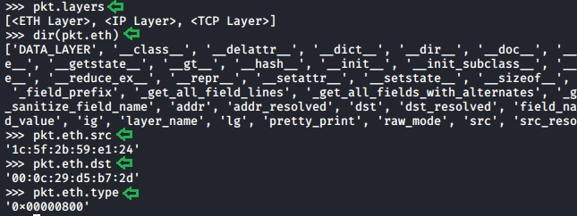

Для следующего шага нужны поля IP-пакета. Человек использовал функцию **dir** на IP-слое, а затем применил поля **src** и **dst**. Он видит, что есть IP-адрес, так как это IP-уровень. Поскольку уровень Ethernet работает на MAC-адресах, он хранит MAC-адреса источника и назначения, которые изменяются, когда человек переходит к IP-уровню.

```
dir(pkt.ip)
pkt.ip.src
pkt.ip.dst
pkt.ip.pretty_print()
```

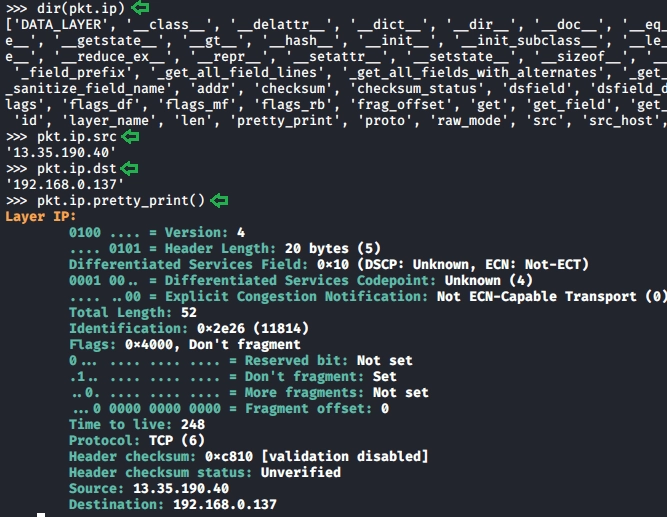

Аналогично, человек может использовать функцию **dir** и значение поля на любом слое захвата. Это значительно облегчает проведение захвата.

#### Захват **Promisc** <a name="link_54"></a>

В предыдущих разделах читатели узнали о режиме promisc, который означает, что сетевая карта будет передавать все полученные фреймы в операционную систему для обработки, в отличие от традиционного режима работы, при котором только фреймы, предназначенные для MAC-адреса сетевой карты или широковещательного адреса, будут передаваться на компьютер. Как правило, этот режим используется для снифинга всего трафика. Но появилась загвоздка, когда пользователь настроил сетевую интерфейсную карту для работы в режиме **promisc**. Таким образом, при захвате трафика на TShark пользователь может переключаться между обычным захватом и захватом promisc с помощью параметра «**-p**», как показано на рисунке ниже.

```
ifconfig eth0 promisc
ifconfig eth0
tshark -i eth0 -c 10
tshark -i eth0 -c  10 -p
```

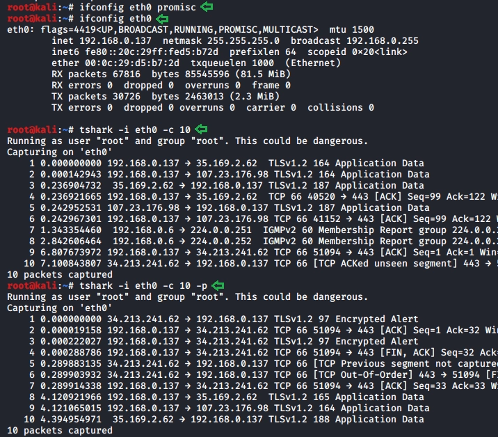

**Важно**! Информация исключительно в учебных целях. Пожалуйста, соблюдайте законодательство и не применяйте данную информацию в незаконных целях.
