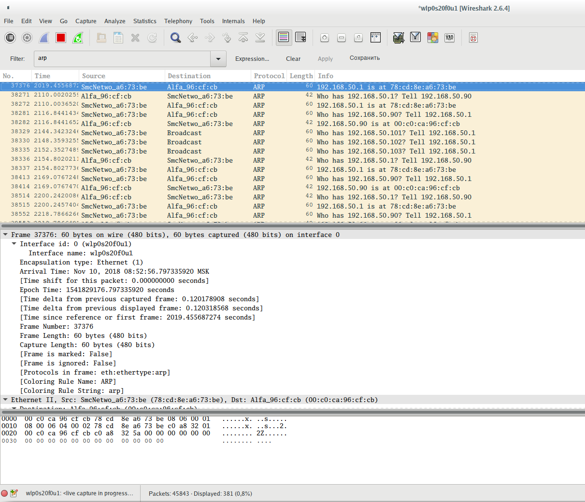
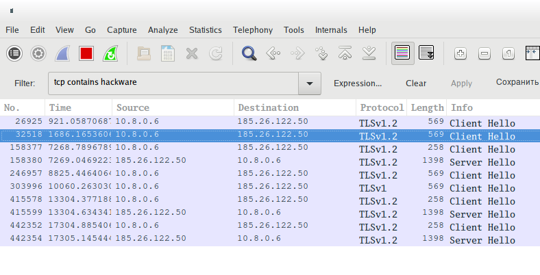
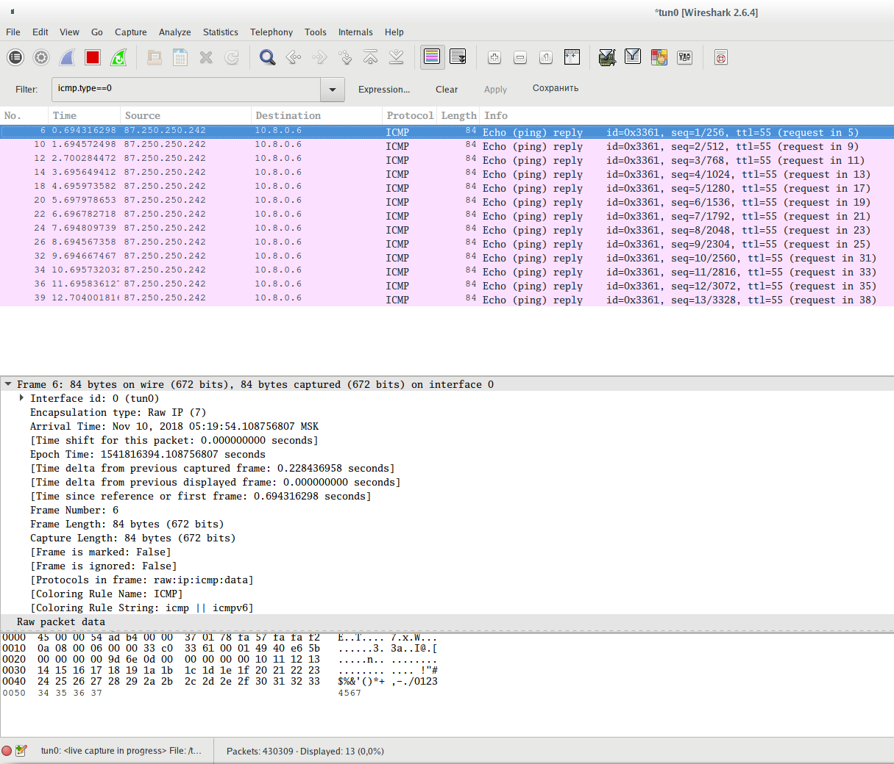

[источник](https://hackware.ru/?p=7008)

- [ Фильтры Wireshark для начинающих ](#link_1)
- [ Операторы фильтров Wireshark ](#link_2)
- [ Логические операторы фильтров Wireshark ](#link_3)
- [ Фильтр интерфейсов ](#link_4)
- [ Трафик протоколов канального уровня ](#link_5)
- [ Трафик протоколов межсетевого уровня ](#link_6)
- [ Трафик протоколов транспортного уровня ](#link_7)
- [ Трафик протоколов прикладного уровня ](#link_8)
- [ Фильтры для Wi-Fi фреймов ](#link_9)
- [ Фильтры Wireshark для идентификации типа программного обеспечения ](#link_10)
  - [ TLS fingerprinting клиентов ](#link_11)
  - [ TLS fingerprinting серверов (хеш JA3S) ](#link_12)
  - [ TLS fingerprinting серверов (хеш JA4S) ](#link_13)
  - [ TLS fingerprinting протокола QUIC (клиентов и серверов) ](#link_14)
  - [ SSH fingerprinting ](#link_15)

## Фильтры Wireshark для начинающих 

У [Wireshark](https://kali.tools/?p=1407) просто огромное количество разнообразных фильтров. И по этим фильтрам есть огромная документация, в которой не так просто разобраться. Я собрал самые интересные для меня и самые часто используемые фильтры Wireshark. Для начинающих пользователей это может стать чем-то вроде справочника по фильтрам Wireshark, отправной точкой для изучения. Также здесь в комментариях предлагаю вам делиться ходовыми фильтрами, которые вы часто используете, а также интересными находками — я добавлю их в этот список.

Помните, что в Wireshark есть фильтры отображения и фильтры захвата. Здесь я рассматриваю фильтры отображения, которые вводятся в главном окне программы в верхнем поле сразу под меню и иконками основных функций.

Чтобы в полной мере понимать значение фильтров и что именно он показывает, необходимо понимание работы сети. Для знакомства с принципами работы сети и протоколов, рекомендуется изучить цикл о работе компьютерных сетей, первая статья цикла «[Компьютерные сети: Часть 1. Как работают компьютерные сети](https://hackware.ru/?p=6290)» (остальные части в процессе подготовки).

Некоторые фильтры здесь написаны в общей форме, а некоторые выполнены в качестве конкретных примеров. Помните, что вы в любом случае можете подставить свои данные, например, изменить номер порта на любой вас интересующий, а также сделать то же самое с IP адресом, MAC-адресом, значением времени и пр.

Если вы только начинаете знакомиться с Wireshark, то обратитесь к статье «[Как использовать Wireshark для захвата, фильтрации и проверки пакетов](https://zawindows.ru/%d0%ba%d0%b0%d0%ba-%d0%b8%d1%81%d0%bf%d0%be%d0%bb%d1%8c%d0%b7%d0%be%d0%b2%d0%b0%d1%82%d1%8c-wireshark-%d0%b4%d0%bb%d1%8f-%d0%b7%d0%b0%d1%85%d0%b2%d0%b0%d1%82%d0%b0-%d1%84%d0%b8%d0%bb%d1%8c%d1%82/)».

## Операторы фильтров Wireshark 

Фильтры могут иметь различные значения, например, это может быть строка, шестнадцатеричный формат или число.

Если ищется неточное вхождение (лучше подходит для нечисловых значений) то используется **contains**. Например, чтобы показать TCP пакеты, содержащие строку hackware нужен следующий фильтр:

|     |                         |
| --- | ----------------------- |
| 1   | `tcp contains hackware` |

Для поиска точных значений используются операторы. Рассмотрим их:

| Оператор | Описание         |
| -------- | ---------------- |
| ==/eq    | Равно            |
| !=/ne    | Не равно         |
| </lt     | Меньше чем       |
| <=/le    | Меньше или равно |
| >/gt     | Больше чем       |
| >=/ge    | Больше или равно |

Как можно видеть, имеется по два варианта написания, например, если мы хотим указать, что значение фильтра равно чему-либо, то мы можем использовать **==** или **eq**.

Из фильтров с применением логических операндов можно строить довольно сложные конструкции, но, видимо, если один и тот же фильтр использовать дважды с операторами сравнения, например, как здесь в попытке сделать фильтрацию не по одному порту, а по диапазону портов:

|     |                                    |
| --- | ---------------------------------- |
| 1   | `tcp.port>=8000 && tcp.port<=8180` |

то значение фильтра (в данном случае **tcp.port**) перезаписывается последним значением, поэтому в результате вместо ожидаемого поведения, мы получаем результат работы только последней части, в данном случае это

|     |                  |
| --- | ---------------- |
| 1   | `tcp.port<=8180` |

Помните об этом баге!

При использовании с **==** (равно) этот баг отсутствует.

## Логические операторы фильтров Wireshark 

Логические операторы позволяют создавать детальные фильтры с использованием сразу нескольких условий. Рекомендуется дополнительно использовать скобки, поскольку в противном случае вы можете получить не то значение, которое ожидаете.

| Оператор | Описание                                                                                                                                                                                                                                                                                   |
| -------- | ------------------------------------------------------------------------------------------------------------------------------------------------------------------------------------------------------------------------------------------------------------------------------------------ |
| and/&&   | Логическое И, данные выводятся если они соответствуют обоим частям фильтра. Например, фильтр **ip.src==192.168.1.1 and tcp** покажет только пакеты, которые исходят от 192.168.1.1 и которые ассоциированы с протоколом TCP. Будут показаны только данные, совпадающие с обоими условиями. |
| or/\|    | Логическое ИЛИ, достаточно чтобы только одно условие было истинным; если оба являются истинной, то это тоже подходит. Например фильтр **tcp.port==80 or tcp.port==8080** покажет TCP пакеты, которые связаны (являются источником или пунктом назначения) с портом 80 или 8080.            |
| not/!    | Логическое НЕ используется, когда мы хотим исключить некоторые пакеты. То есть будут показаны все пакеты, кроме удовлетворяющие условию, следующему после НЕ. Например фильтр **!dns** покажет все пакеты, кроме DNS.                                                                      |

Примеры комбинирования:

Показать HTTP **или** DNS трафик:

|     |               |
| --- | ------------- |
| 1   | `http or dns` |

Показать любой трафик, **кроме** ARP, ICMP и DNS:

|     |                         |
| --- | ----------------------- |
| 1   | `!(arp or icmp or dns)` |

## Фильтр интерфейсов 

Показать пакеты только отправленные или полученные на интерфейсе wlan0:

|     |                                   |
| --- | --------------------------------- |
| 1   | `frame.interface_name == "wlan0"` |

## Трафик протоколов канального уровня 

**Для показа ARP трафика:**

|     |       |
| --- | ----- |
| 1   | `arp` |

Показать фреймы ARP протокола, отправленные с устройства, имеющего MAC-адрес 00:c0:ca:96:cf:cb:

|     |                                       |
| --- | ------------------------------------- |
| 1   | `arp.src.hw_mac == 00:c0:ca:96:cf:cb` |

Показать фреймы ARP протокола, отправленные с устройства, имеющего IP адрес 192.168.50.90:

|     |                                       |
| --- | ------------------------------------- |
| 1   | `arp.src.proto_ipv4 == 192.168.50.90` |

Показать фреймы ARP протокола, отправленные на устройство, имеющего MAC-адрес 00:00:00:00:00:00 (этот адрес используется когда протокол пытается узнать целевой MAC-адрес. Ещё один популярный адрес, который может вас смутить, это ff:ff:ff:ff:ff:ff, этот адрес является широковещательным, то есть сообщения с этим адресом предназначены для всех устройств локальной сети):

|     |                                       |
| --- | ------------------------------------- |
| 1   | `arp.dst.hw_mac == 00:00:00:00:00:00` |

Показать фреймы ARP протокола, отправленные на устройство, имеющего IP адрес 192.168.50.1:

|     |                                      |
| --- | ------------------------------------ |
| 1   | `arp.dst.proto_ipv4 == 192.168.50.1` |

**Показать Ethernet трафик:**

|     |       |
| --- | ----- |
| 1   | `eth` |

Показать фреймы (вообще все фреймы, а не только ARP, как это было в предыдущих примерах), отправленные с устройства, имеющего MAC-адрес 00:c0:ca:96:cf:cb:

|     |                                |
| --- | ------------------------------ |
| 1   | `eth.src == 00:c0:ca:96:cf:cb` |

Показать фреймы, отправленные на устройство, имеющего MAC-адрес 78:cd:8e:a6:73:be:

|     |                                |
| --- | ------------------------------ |
| 1   | `eth.dst == 78:cd:8e:a6:73:be` |

## Трафик протоколов межсетевого уровня 

**Фильтрация IPv4 протокола**

Показать IP трафик (сюда относятся TCP, UDP, а также протоколы уровня приложений DNS, HTTP — то есть практически всё, кроме протоколов канального уровня, которые не используют IP адреса для передачи данных (в локальных сетях Ethernet в качестве адресов доставки они используют MAC-адреса)):

**ip**

Если быть более точным, имеется ввиду трафик протокола IPv4, который обычно называют просто IP (Internet Protocol).

Показать трафик, связанный с определённым IP адресом (впишите его вместо x.x.x.x). Будут показаны пакеты, в которых этот IP адрес является источником данных ИЛИ получателем:

|     |                      |
| --- | -------------------- |
| 1   | `ip.addr == x.x.x.x` |

Показать трафик, связанный с данными двумя IP адресами. По единственно возможной логике, один из этих адресов будет источником, а второй — адресом доставки.

|     |                                            |
| --- | ------------------------------------------ |
| 1   | `ip.addr == x.x.x.x && ip.addr == y.y.y.y` |

Показать трафик, источником которого является хост с IP адресом 138.201.81.199:

|     |                            |
| --- | -------------------------- |
| 1   | `ip.src == 138.201.81.199` |

Показать трафик, адресатом которого является хост с IP адресом 138.201.81.199:

|     |                            |
| --- | -------------------------- |
| 1   | `ip.dst == 138.201.81.199` |

Обратите внимание, IP протокол оперирует IP адресами, но не оперирует портами. Порты являются частью протоколов TCP и UDP. IP протокол отвечает только за маршрутизацию трафика между хостами.

**Фильтрация подсетей и диапазонов IP в Wireshark**

Вы можете вместо одного IP адреса указать подсеть:

|     |                             |
| --- | --------------------------- |
| 1   | `ip.addr == 192.168.1.0/24` |

Фильтрация трафика, отправленного с определённого диапазона IP. Если нужно отфильтровать трафик, источником которого является подсеть, то используйте фильтр вида:

|     |                            |
| --- | -------------------------- |
| 1   | `ip.src == 192.168.1.0/24` |

Фильтрация трафика, предназначенного для отправки на определённый диапазон IP. Если нужно отфильтровать трафик, пунктом назначения которого является подсеть, то используйте фильтр вида:

|     |                            |
| --- | -------------------------- |
| 1   | `ip.dst == 192.168.1.0/24` |

**Фильтрация IPv6 протокола**

Показать трафик IPv6 (Internet Protocol шестой версии):

|     |        |
| --- | ------ |
| 1   | `ipv6` |

Фильтрация по IPv6 адресу. Для фильтрации по IPv6 адресу используйте фильтр:

|     |                                           |
| --- | ----------------------------------------- |
| 1   | `ipv6.addr == 2604:a880:800:c1::2ae:d001` |

**Фильтрация подсетей и диапазонов IPv6 в Wireshark**

Вы можете вместо одного IPv6 адреса указать подсеть для фильтрации:

|     |                                              |
| --- | -------------------------------------------- |
| 1   | `ipv6.addr == 2604:a880:800:c1::2ae:d000/64` |

Если нужно отфильтровать трафик, источником которого является определённый IPv6 адрес:

|     |                                          |
| --- | ---------------------------------------- |
| 1   | `ipv6.src == 2604:a880:800:c1::2ae:d001` |

Если нужно отфильтровать трафик, отправленный на определённый IPv6 адрес:

|     |                                          |
| --- | ---------------------------------------- |
| 1   | `ipv6.dst == 2604:a880:800:c1::2ae:d001` |

Фильтрация трафика, отправленного с определённого диапазона IPv6. Если нужно отфильтровать трафик, источником которого является подсеть, то используйте фильтр вида:

|     |                                             |
| --- | ------------------------------------------- |
| 1   | `ipv6.src == 2604:a880:800:c1::2ae:d000/64` |

Фильтрация трафика, предназначенного для отправки на определённый диапазон IPv6. Если нужно отфильтровать трафик, пунктом назначения которого является подсеть, то используйте фильтр вида:

|     |                                             |
| --- | ------------------------------------------- |
| 1   | `ipv6.dst == 2604:a880:800:c1::2ae:d000/64` |

Фильтрация ICMPv6 (Internet Control Message Protocol — протокол межсетевых управляющих сообщений шестой версии) в Wireshark делается фильтром:

|     |          |
| --- | -------- |
| 1   | `icmpv6` |

Как отфильтровать пакеты ARP протокола для IPv6 в Wireshark? Для IPv6 протокол ARP не требуется, поскольку его роль выполняет протокол обнаружения соседей (Neighbor Discovery Protocol, NDP) средствами ICPM6 — подробности объяснены в статье «[IPv6 аналог для «arp -an» в IPv4](https://zalinux.ru/?p=3209)».

Для того, чтобы увидеть пакеты, которые выполняют роль ARP для IPv6, используйте фильтр:

|     |                                                                                                              |
| --- | ------------------------------------------------------------------------------------------------------------ |
| 1   | `icmpv6.type == 133 or icmpv6.type == 134 or icmpv6.type == 135 or icmpv6.type == 136 or icmpv6.type == 137` |

Другие фильтры с IP адресом аналогичны для IPv6 и IPv4.

## Трафик протоколов транспортного уровня 

**Чтобы увидеть только трафик TCP:**

|     |       |
| --- | ----- |
| 1   | `tcp` |

Показать трафик, источником или портом назначения которого является определённый порт, например 8080:

|     |                  |
| --- | ---------------- |
| 1   | `tcp.port==8080` |

Показать трафик, источником которого является порт 80:

|     |                     |
| --- | ------------------- |
| 1   | `tcp.srcport == 80` |

Показать трафик, который отправляется службе, прослушивающей порт 80:

|     |                     |
| --- | ------------------- |
| 1   | `tcp.dstport == 80` |

Показать TCP пакеты с включённым флагом SYN:

|     |                    |
| --- | ------------------ |
| 1   | `tcp.flags.syn==1` |

Показать TCP пакеты с включённым флагом SYN и отключённым флагом ACK:

|     |                                        |
| --- | -------------------------------------- |
| 1   | `tcp.flags.syn==1 && tcp.flags.ack==0` |

Аналогично и для других флагов:

- SYN

|     |                    |
| --- | ------------------ |
| 1   | `tcp.flags.syn==1` |

- ACK

|     |                    |
| --- | ------------------ |
| 1   | `tcp.flags.ack==1` |

- RST

|     |                      |
| --- | -------------------- |
| 1   | `tcp.flags.reset==1` |

- FIN

|     |                    |
| --- | ------------------ |
| 1   | `tcp.flags.fin==1` |

- CWR

|     |                    |
| --- | ------------------ |
| 1   | `tcp.flags.cwr==1` |

- ECE

|     |                    |
| --- | ------------------ |
| 1   | `tcp.flags.ecn==1` |

- URG

|     |                    |
| --- | ------------------ |
| 1   | `tcp.flags.urg==1` |

- PSH

|     |                     |
| --- | ------------------- |
| 1   | `tcp.flags.push==1` |

- NS

|     |                   |
| --- | ----------------- |
| 1   | `tcp.flags.ns==1` |

Также можно использовать синтаксис вида **tcp.flags == 0x0XX**, например:

- FIN это **tcp.flags == 0x001**
- SYN это **tcp.flags == 0x002**
- RST это **tcp.flags == 0x004**
- ACK это **tcp.flags == 0x010**
- Установленные одновременно ACK и FIN это **tcp.flags == 0x011**
- Установленные одновременно ACK и SYN это **tcp.flags == 0x012**
- Установленные одновременно ACK и RST это **tcp.flags == 0x014**

Длина заголовка (смещение данных):

|                     |                                                                          |
| ------------------- | ------------------------------------------------------------------------ |
| 1  2  3 | `tcp.hdr_len == 32`  `tcp.hdr_len == 52`  `tcp.hdr_len > 32` |

Пакеты с установленными зарезервированными битами:

|     |                      |
| --- | -------------------- |
| 1   | `tcp.flags.res == 1` |

Размер окна:

|                              |                                                                                                                                                  |
| ---------------------------- | ------------------------------------------------------------------------------------------------------------------------------------------------ |
| 1  2  3  4 | `tcp.window_size_value == 11`  `tcp.window_size_value == 4468`  `tcp.window_size_value > 65000`  `tcp.window_size_value < 100` |

Вычесленный размер окна:

|            |                                                           |
| ---------- | --------------------------------------------------------- |
| 1  2 | `tcp.window_size == 45056`  `tcp.window_size == 11` |

Фактор масштабирования размера окна:

|     |                                       |
| --- | ------------------------------------- |
| 1   | `tcp.window_size_scalefactor == 4096` |

**tcp.window_size_value** — это необработанное значение размера окна, считываемое непосредственно из заголовка TCP, тогда как **tcp.window_size** — это вычисленный размер окна, который основан на том, применимо ли масштабирование окна или нет. Если масштабирование окна не используется или коэффициент масштабирования равен **1** или неизвестно, применимо ли масштабирование окна или нет, потому что трёхэтапное рукопожатие TCP не было захвачено, тогда эти два значения будут одинаковыми. С помощью **tcp.window_size_scalefactor** вы можете определить, какое из этих условий применимо — если его значение равно **-1**, то оно неизвестно, если его значение равно **-2**, тогда масштабирование окна не используется, а все остальные значения представляют фактический размер фактора масштабирования окна.

Чтобы показать пакеты, содержащие какую либо строку, например, строку hackware:

|     |                         |
| --- | ----------------------- |
| 1   | `tcp contains hackware` |

Следовать потоку TCP с номером X:

|     |                   |
| --- | ----------------- |
| 1   | `tcp.stream eq X` |

Фильтровать по номеру потока:

|     |                |
| --- | -------------- |
| 1   | `tcp.seq == x` |

Показать повторные отправки пакетов. Помогает прослеживать замедление производительности приложений и потери пакетов:

|     |                               |
| --- | ----------------------------- |
| 1   | `tcp.analysis.retransmission` |

Этот фильтр выведен проблемные пакеты (потерянные сегменты, повторную отправку и другие. Этот фильтр проходят пакеты TCP Keep-Alive, но они не являются показателем проблем.

|     |                      |
| --- | -------------------- |
| 1   | `tcp.analysis.flags` |

**Фильтры для оценки качества сетевого подключения.**

Следующие характеристики относятся к TCP фреймам. Причём они не основываются на заголовках фрейма — рассматриваемые характеристики (пропуск данных, дубли) присвоены программой Wireshark исходя из анализа.

Фильтр выводит информацию о фреймах с флагом ACK, которые являются дублями. Большое количество таких фреймов может говорить о проблемах связи:

|     |                                       |
| --- | ------------------------------------- |
| 1   | `tcp.analysis.duplicate_ack_num == 1` |

Фильтр показа фреймов для которых не захвачен предыдущий сегмент:

|     |                                 |
| --- | ------------------------------- |
| 1   | `tcp.analysis.ack_lost_segment` |

Это нормально в начале захвата данных — поскольку информация перехватывается не с самого начала сессии.

Для показа фреймов, которые являются ретрансмиссией (отправляются повторно):

|     |                               |
| --- | ----------------------------- |
| 1   | `tcp.analysis.retransmission` |

Вывод фреймов, которые получены не в правильном порядке:

|     |                             |
| --- | --------------------------- |
| 1   | `tcp.analysis.out_of_order` |

**Чтобы увидеть только трафик UDP:**

|     |       |
| --- | ----- |
| 1   | `udp` |

Для UDP не используются флаги. Для этого протокола можно только указать порт.

Показать трафик, источником которого является порт 53:

|     |                     |
| --- | ------------------- |
| 1   | `udp.srcport == 53` |

Показать трафик, который отправляется службе, прослушивающей порт 53:

|     |                     |
| --- | ------------------- |
| 1   | `udp.dstport == 53` |

UDP пакет, в котором встречается определённая строка, например, строка hackware:

|     |                         |
| --- | ----------------------- |
| 1   | `udp contains hackware` |

Порт назначения ИЛИ исходный порт:

|                     |                                                                   |
| ------------------- | ----------------------------------------------------------------- |
| 1  2  3 | `udp.port == 53`  `udp.port > 40000`  `udp.port < 30` |

Длина пакета:

|            |                                                |
| ---------- | ---------------------------------------------- |
| 1  2 | `udp.length == 60`  `udp.length > 50000` |

Время между пакетами (для выявления проблем сети):

|     |                        |
| --- | ---------------------- |
| 1   | `udp.time_delta > 1.5` |

Номер потока (запрос-ответ):

|     |                   |
| --- | ----------------- |
| 1   | `udp.stream == 5` |

Пакеты трассировки:

|     |                           |
| --- | ------------------------- |
| 1   | `udp.possible_traceroute` |

**Чтобы увидеть только трафик ICMP:**

|     |        |
| --- | ------ |
| 1   | `icmp` |

Чтобы увидеть только трафик ICMP v6 (шестой версии)

|     |          |
| --- | -------- |
| 1   | `icmpv6` |

Показать все ответы на пинг:

|     |                |
| --- | -------------- |
| 1   | `icmp.type==0` |

Показать все пинг запросы:

|     |                |
| --- | -------------- |
| 1   | `icmp.type==8` |

Показать все ошибки недоступности/запрета хостов и портов

|     |                |
| --- | -------------- |
| 1   | `icmp.type==3` |

Показать все попытки перенаправить маршрутизацию с использованием ICMP:

|     |                |
| --- | -------------- |
| 1   | `icmp.type==8` |

Другие типы ICMP, а также варианты CODE здесь: [https://www.frozentux.net/iptables-tutorial/iptables-tutorial.html#TCPOPTIONS](https://www.frozentux.net/iptables-tutorial/iptables-tutorial.html#TCPOPTIONS)

Пример использования значения CODE, следующий фильтр покажет сообщения о недоступности порта:

|     |                                |
| --- | ------------------------------ |
| 1   | `icmp.type==3 && icmp.code==3` |

## Трафик протоколов прикладного уровня 

Для протоколов приклодного уровня HTTP, DNS, SSH, FTP, SMTP, RDP, SNMP, RTSP, GQUIC, CDP, LLMNR, SSDP, VNC, RDP и пр. имеются фильтры, которые называются как и сами протоколы, но пишутся маленькими буквами.

**Например, чтобы увидеть HTTP трафик:**

|     |        |
| --- | ------ |
| 1   | `http` |

Чтобы увидеть трафик нового протокола HTTP/2:

|     |         |
| --- | ------- |
| 1   | `http2` |

Помните, что при принятии решения, к какому протоколу относятся передаваемые данные, программа исходит из номера используемого порта. Если используется нестандартный порт, то программа не сможет найти нужные данные. Например, если было выполнено подключение к SSH по порту 1234, то фильтр **ssh** не найдёт SSH трафик.

Фильтр, который показывает только данные, переданные методом POST:

|     |                                 |
| --- | ------------------------------- |
| 1   | `http.request.method == "POST"` |

Фильтр, который показывает только данные, переданные методом GET:

|     |                                |
| --- | ------------------------------ |
| 1   | `http.request.method == "GET"` |

Поиск запросов к определённому сайту (хосту):

|     |                        |
| --- | ---------------------- |
| 1   | `http.host == "<URL>"` |

Поиск запросов к определённому сайту по части имени:

|     |                                            |
| --- | ------------------------------------------ |
| 1   | `http.host contains "здесь.частичное.имя"` |

Фильтр для вывода HTTP запросов, в которых передавались кукиз:

|     |               |
| --- | ------------- |
| 1   | `http.cookie` |

Запросы, в которых сервер установил кукиз в браузер пользователя.

|     |                   |
| --- | ----------------- |
| 1   | `http.set_cookie` |

Для поиска любых переданных изображений:

|     |                                      |
| --- | ------------------------------------ |
| 1   | `http.content_type contains "image"` |

Для поиска определённых видов изображений:

|                     |                                                                                                                         |
| ------------------- | ----------------------------------------------------------------------------------------------------------------------- |
| 1  2  3 | `http.content_type contains "gif"`  `http.content_type contains "jpeg"`  `http.content_type contains "png"` |

Для поиска файлов определённого типа:

|                                                                  |                                                                                                                                                                                                                                                                                                                                                                                    |
| ---------------------------------------------------------------- | ---------------------------------------------------------------------------------------------------------------------------------------------------------------------------------------------------------------------------------------------------------------------------------------------------------------------------------------------------------------------------------- |
| 1  2  3  4  5  6  7  8 | `http.content_type contains "text"`  `http.content_type contains "xml"`  `http.content_type contains "html"`  `http.content_type contains "json"`  `http.content_type contains "javascript"`  `http.content_type contains "x-www-form-urlencode"`  `http.content_type contains "compressed"`  `http.content_type contains "application"` |

Поиск в Wireshark запросов на получения файлов определённого типа. Например, для поиска переданных ZIP архивов:

|     |                                   |
| --- | --------------------------------- |
| 1   | `http.request.uri contains "zip"` |

Вместо **http.request.uri** для большей точности можно использовать фильтры **http.request.uri.path** или **http.request.uri.query**, например, для поиска запросов на скачивание файлов JPG (ссылки на картинки):

|     |                                        |
| --- | -------------------------------------- |
| 1   | `http.request.uri.path contains "jpg"` |

Также вы можете отфильтровать запросы, содержащие определённое значение HTTP заголовка REFERER (реферер). Например, для поиска запросов, в которых реферером является ru-board.com:

|     |                                        |
| --- | -------------------------------------- |
| 1   | `http.referer contains "ru-board.com"` |

Поиск запросов с любой авторизацией. Аналогично с помощью **contains** можно искать определённые виды авторизации:

|     |                      |
| --- | -------------------- |
| 1   | `http.authorization` |

Поиск файлов в HTTP потоке:

|     |                  |
| --- | ---------------- |
| 1   | `http.file_data` |

Чтобы увидеть, какие HTTP данные получены с задержкой, используется следующая конструкция:

|     |               |
| --- | ------------- |
| 1   | `http.time>1` |

Она покажет трафик, полученный позднее чем через 1 секунду.

Для исследования проблем, можно анализировать статус HTTP кодов ответа. Например, следующий фильтр покажет трафик, при котором получена ошибка 404 Not Found (страница не найдена):

|     |                           |
| --- | ------------------------- |
| 1   | `http.response.code==404` |

Следующий фильтр очень интересный. Во-первых, он показывает какие сложные конструкции можно строить из отдельных фильтров. Во-вторых, он позволяет исследовать HTTP запросы и в целом веб активность, исключая лишние данные. С помощью этого фильтра вы можете просматривать веб-активность высокого уровня. Правила внутри скобок исключают изображения, файлы Javascript и таблицы стилей — всё, что страница запрашивает внутри себя. Если исследуемые страницы содержат другие встроенные объекты, то исключите их похожим образом:

|     |                                                                                                                                                                                                      |
| --- | ---------------------------------------------------------------------------------------------------------------------------------------------------------------------------------------------------- |
| 1   | `http.request && !(http.request.uri contains ".ico" or http.request.uri contains ".css" or http.request.uri contains ".js" or http.request.uri contains ".gif" or http.request.uri contains ".jpg")` |

Фильтрация полей HTTP заголовков: некоторые из рассмотренных чуть выше фильтров уже относятся к фильтрам HTTP заголовков, рассмотрим ещё несколько примеров.

Помните, что можно использовать фильтр не указав искомое значение, например:

|     |             |
| --- | ----------- |
| 1   | `http.host` |

В этом случае будут показаны все соединения, имеющие любое значение поля Host в HTTP заголовке.

Можно указать точное значение:

|     |                                    |
| --- | ---------------------------------- |
| 1   | `http.host == "www.archlinux.org"` |

Или указать часть искомой строки:

|     |                                      |
| --- | ------------------------------------ |
| 1   | `http.host contains "archlinux.org"` |

Фильтр по полю Host в HTTP заголовке:

|     |                                    |
| --- | ---------------------------------- |
| 1   | `http.host == "www.archlinux.org"` |

Фильтр по полю Content-Type в HTTP заголовке:

|     |                                     |
| --- | ----------------------------------- |
| 1   | `http.content_type == "text/plain"` |

Фильтр по полю Server в HTTP заголовке:

|     |                          |
| --- | ------------------------ |
| 1   | `http.server == "nginx"` |

Фильтры по полю Cookie в HTTP заголовке:

|            |                                         |
| ---------- | --------------------------------------- |
| 1  2 | `http.cookie`  `http.cookie_pair` |

Фильтр по полю User Agent в HTTP заголовке:

|     |                                                                                             |
| --- | ------------------------------------------------------------------------------------------- |
| 1   | `http.user_agent == "Mozilla/5.0 (X11; Linux x86_64; rv:82.0) Gecko/20100101 Firefox/82.0"` |

Фильтр по полю X-Powered-By в HTTP заголовке:

|     |                        |
| --- | ---------------------- |
| 1   | `http.x_forwarded_for` |

Для поиска переадресаций (поле Location):

|     |                 |
| --- | --------------- |
| 1   | `http.location` |

Для поиска сайтов, с которых сделан переход на страницу (поле Referer):

|     |                                       |
| --- | ------------------------------------- |
| 1   | `http.referer contains "hackware.ru"` |

Фильтра запросов:

|                                                |                                                                                                                                                                                 |
| ---------------------------------------------- | ------------------------------------------------------------------------------------------------------------------------------------------------------------------------------- |
| 1  2  3  4  5  6 | `http.request`  `http.request.uri`  `http.request.uri.path`  `http.request.uri.query.`  `http.request.uri.query.parameter`  `http.request.method` |

Фильтры ответов:

|     |                 |
| --- | --------------- |
| 1   | `http.response` |

Поиск по коду ответа:

|            |                                                                |
| ---------- | -------------------------------------------------------------- |
| 1  2 | `http.response.code == 404`  `http.response.code != 200` |

На самом деле, этот список далеко не полный. Вы можете использовать подсказки, которые появляются при вводе названия фильтров, либо ориентироваться на имена полей HTTP заголовков, которые похожи на имена фильтров.

**Чтобы показать только трафик на основе TLS (зашифрованные данные):**

|     |       |
| --- | ----- |
| 1   | `tls` |

Рукопожатие протокола:

|     |                 |
| --- | --------------- |
| 1   | `tls.handshake` |

Сертификаты:

|     |                              |
| --- | ---------------------------- |
| 1   | `tls.handshake.certificates` |

Поиск по содержимому сертификатов:

|     |                                                      |
| --- | ---------------------------------------------------- |
| 1   | `tls.handshake.certificate contains "*.hackware.ru"` |

Имеется много фильтров TLS, но нужно понимать, что мы не можем искать по содержимому передаваемых зашифрованных данных (по очевидным причинам — данные зашифрованы). Можно выполнять поиск по различным свойствам, а также по содержимому, передающемуся в незашифрованном виде, например, по сертификатам.

**Чтобы увидеть все DNS запросы и ответы:**

|     |       |
| --- | ----- |
| 1   | `dns` |

Чтобы увидеть, какие DNS запросы заняли много времени:

|     |              |
| --- | ------------ |
| 1   | `dns.time>1` |

Будут показаны ответы, пришедшие более чем через секунду после отправки запроса.

Этот фильтр показывает, какие dns запросы не могут быть правильно разрешены:

|     |                        |
| --- | ---------------------- |
| 1   | `dns.flags.rcode != 0` |

Показать только DNS запросы:

|     |                           |
| --- | ------------------------- |
| 1   | `dns.flags.response == 0` |

Показать только DNS ответы:

|     |                           |
| --- | ------------------------- |
| 1   | `dns.flags.response == 1` |

Показать запросы и ответы на них, в котором ищется IP для google.com:

|     |                                |
| --- | ------------------------------ |
| 1   | `dns.qry.name == "google.com"` |

Показать DNS запросы и ответы касаемые записи A:

|     |                     |
| --- | ------------------- |
| 1   | `dns.qry.type == 1` |

Показать DNS запросы и ответы касаемые записи AAAA:

|     |                      |
| --- | -------------------- |
| 1   | `dns.qry.type == 28` |

Показать ответы, в которых для записи A в качестве IP отправлен 216.58.196.3:

|     |                         |
| --- | ----------------------- |
| 1   | `dns.a == 216.58.196.3` |

Показать ответы, в которых для записи AAAA в качестве IP отправлен 2a01:4f8:172:1d86::1:

|     |                                    |
| --- | ---------------------------------- |
| 1   | `dns.aaaa == 2a01:4f8:172:1d86::1` |

Показать записи с CNAME apollo.archlinux.org:

|     |                                       |
| --- | ------------------------------------- |
| 1   | `dns.cname == "apollo.archlinux.org"` |

Показать ответы длиной более 30:

|     |                     |
| --- | ------------------- |
| 1   | `dns.resp.len > 30` |

Показать запросы с длиной более 25:

|     |                        |
| --- | ---------------------- |
| 1   | `dns.qry.name.len >25` |

Показать ответы DNS серверов на которых доступна рекурсия:

|     |                           |
| --- | ------------------------- |
| 1   | `dns.flags.recavail == 1` |

Показать ответы DNS серверов на которых не доступна рекурсия:

|     |                           |
| --- | ------------------------- |
| 1   | `dns.flags.recavail == 0` |

Желательна ли рекурсия (если запрошенный DNS сервер не имеет информацию об имени хоста, должен ли он опрашивать другие DNS сервера в поисках этой информации):

|     |                             |
| --- | --------------------------- |
| 1   | `dns.flags.recdesired == 1` |

Если в запросе стоит **1**, значит рекурсия нужна, если **0** — значит она не желательна.

Принимать ли неаутентифицированные данные (**0** означает не принимать, **1** означает принимать):

|     |                               |
| --- | ----------------------------- |
| 1   | `dns.flags.checkdisable == 0` |

**Чтобы увидеть, как назначаются IP адреса по протоколу DHCP:**

|     |                   |
| --- | ----------------- |
| 1   | `udp.dstport==67` |

Или так:

|     |                     |
| --- | ------------------- |
| 1   | `bootp.option.dhcp` |

Чтобы показать DHCP запросы:

|     |                          |
| --- | ------------------------ |
| 1   | `bootp.option.dhcp == 3` |

Чтобы показать DHCP Discover:

|     |                          |
| --- | ------------------------ |
| 1   | `bootp.option.dhcp == 1` |

**SMB фильтр**. Этот фильтр в колонке Info показывает всё дерево (шару) соединений, открытых директорий и открытых файлов в трассировке.

|     |                              |
| --- | ---------------------------- |
| 1   | `smb2.cmd==3 or smb2.cmd==5` |

**NetBIOS фильтры**

Фильтр Wireshark для службы имён (NetBIOS-NS):

|     |        |
| --- | ------ |
| 1   | `nbns` |

Фильтр Wireshark для службы рассылки дейтаграмм (NetBIOS-DGM):

|     |         |
| --- | ------- |
| 1   | `nbdgm` |

Фильтр Wireshark для службы сеанса (NetBIOS-SSN):

|     |        |
| --- | ------ |
| 1   | `nbss` |

**VNC**

Чтобы показать только трафик VNC сессий:

|     |       |
| --- | ----- |
| 1   | `vnc` |

VNC challenge (вызов):

|     |                      |
| --- | -------------------- |
| 1   | `vnc.auth_challenge` |

VNC response (ответ):

|     |                     |
| --- | ------------------- |
| 1   | `vnc.auth_response` |

Результат попытки аутентификации на VNC сервере:

|     |                   |
| --- | ----------------- |
| 1   | `vnc.auth_result` |

Вызов, ответ и результат попытки аутентификации на VNC сервере:

|     |                                                              |
| --- | ------------------------------------------------------------ |
| 1   | `vnc.auth_challenge or vnc.auth_response or vnc.auth_result` |

Имя компьютера с VNC сервером:

|     |                    |
| --- | ------------------ |
| 1   | `vnc.desktop_name` |

Позиция кнопок мыши:

|                              |                                                                                         |
| ---------------------------- | --------------------------------------------------------------------------------------- |
| 1  2  3  4 | `vnc.button_1_pos`  `vnc.button_2_pos`  `…………...`  `vnc.button_8_pos` |

Выбранный тип безопасности:

|     |                            |
| --- | -------------------------- |
| 1   | `vnc.client_security_type` |

Тип кодирования:

|     |                                          |
| --- | ---------------------------------------- |
| 1   | `vnc.client_set_encodings_encoding_type` |

Версия VNC протокола клиента:

|     |                        |
| --- | ---------------------- |
| 1   | `vnc.client_proto_ver` |

Версия VNC протокола сервера:

|     |                        |
| --- | ---------------------- |
| 1   | `vnc.server_proto_ver` |

Ширина Framebuffer:

|     |             |
| --- | ----------- |
| 1   | `vnc.width` |

Клавиша:

|     |           |
| --- | --------- |
| 1   | `vnc.key` |

Нажатие клавиши:

|     |                |
| --- | -------------- |
| 1   | `vnc.key_down` |

Данные передаваемого видео в формате H.264:

|     |                 |
| --- | --------------- |
| 1   | `vnc.h264_data` |

Вырезанный текст:

|     |                       |
| --- | --------------------- |
| 1   | `vnc.client_cut_text` |

Другие фильтры VNC: [https://www.wireshark.org/docs/dfref/v/vnc.html](https://www.wireshark.org/docs/dfref/v/vnc.html)

**Remote Desktop Protocol (RDP)**

Чтобы показать только трафик RDP сессий:

|     |       |
| --- | ----- |
| 1   | `rdp` |

Другие фильтры Remote Desktop Protocol (RDP): [https://www.wireshark.org/docs/dfref/r/rdp.html](https://www.wireshark.org/docs/dfref/r/rdp.html)

**Фильтры Wireshark для HTTP Basic и Digest аутентификации**

Wireshark может фильтровать сессии аутентификации. Для этого имеются следующие фильтры:

Все сессии аутентификации (BASIC/DIGEST/NTLM):

|     |                      |
| --- | -------------------- |
| 1   | `http.authorization` |

Только HTTP Basic аутентификация:

|     |                  |
| --- | ---------------- |
| 1   | `http.authbasic` |

Только HTTP Basic аутентификация с определёнными учётными данными:

|     |                                    |
| --- | ---------------------------------- |
| 1   | `http.authbasic == "ЛОГИН:ПАРОЛЬ"` |

**Фильтры Wireshark для анализа трафика через веб прокси-сервер**

Этот фильтр покажет запросы от прокси на HTTP Digest аутентификацию:

|     |                           |
| --- | ------------------------- |
| 1   | `http.proxy_authenticate` |

Этот фильтр покажет учётные данные, отправляемые клиентом на прокси-сервер для авторизации:

|     |                            |
| --- | -------------------------- |
| 1   | `http.proxy_authorization` |

Показ запросов, сделанных через прокси-сервер (HTTP метод CONNECT):

|     |                                    |
| --- | ---------------------------------- |
| 1   | `http.request.method == "CONNECT"` |

Поскольку для аутентификации пользователей веб-прокси используют HTTP Basic и Digest аутентификации, то можно использовать соответствующие фильтры Wireshark. Все сессии аутентификации (BASIC/DIGEST/NTLM):

|     |                      |
| --- | -------------------- |
| 1   | `http.authorization` |

Только HTTP Basic аутентификация:

|     |                  |
| --- | ---------------- |
| 1   | `http.authbasic` |

Только HTTP Basic аутентификация с определёнными учётными данными:

|     |                                    |
| --- | ---------------------------------- |
| 1   | `http.authbasic == "ЛОГИН:ПАРОЛЬ"` |

Запрос Digest аутентификации от прокси-сервера:

|     |                                             |
| --- | ------------------------------------------- |
| 1   | `http.proxy_authenticate contains "Digest"` |

Ответ пользователя передаваемый на прокси-сервер с информацией для Digest авторизации:

|     |                                              |
| --- | -------------------------------------------- |
| 1   | `http.proxy_authorization contains "Digest"` |

## Фильтры для Wi-Fi фреймов 

Показать элементы четырёхэтапных рукопожатий (то есть фреймы протокола EAPOL):

|     |         |
| --- | ------- |
| 1   | `eapol` |

Показать фреймы Beacon (маяки):

|     |                                |
| --- | ------------------------------ |
| 1   | `wlan.fc.type_subtype == 0x08` |

Показать фреймы Probe Response:

|     |                                |
| --- | ------------------------------ |
| 1   | `wlan.fc.type_subtype == 0x05` |

Показать всё сразу: EAPOL, маяки, Probe Response:

|     |                                                                         |
| --- | ----------------------------------------------------------------------- |
| 1   | `wlan.fc.type_subtype == 0x08 \| wlan.fc.type_subtype == 0x05 \| eapol` |

Показать беспроводные фреймы для определённого устройства с MAC-адресом BSSID:

|     |                    |
| --- | ------------------ |
| 1   | `wlan.addr==BSSID` |

Показать EAPOL, маяки, Probe Response для определённого устройства с MAC-адресом 28:28:5D:6C:16:24:

|     |                                                                                                           |
| --- | --------------------------------------------------------------------------------------------------------- |
| 1   | `(wlan.fc.type_subtype == 0x08 \| wlan.fc.type_subtype == 0x05 \| eapol) && wlan.addr==28:28:5D:6C:16:24` |

Показ всех PMKID:

|     |                              |
| --- | ---------------------------- |
| 1   | `eapol && wlan.rsn.ie.pmkid` |

Либо просто:

|     |                     |
| --- | ------------------- |
| 1   | `wlan.rsn.ie.pmkid` |

Показать PMKID с определённым значением:

|     |                                                                        |
| --- | ---------------------------------------------------------------------- |
| 1   | `wlan.rsn.ie.pmkid == 21:89:fa:52:75:df:e9:f5:56:f3:2e:e5:4b:86:b7:8f` |

Показать PMKID, маяки, Probe Response:

|     |                                                                                                  |
| --- | ------------------------------------------------------------------------------------------------ |
| 1   | `(wlan.fc.type_subtype == 0x08 \| wlan.fc.type_subtype == 0x05 \| (eapol && wlan.rsn.ie.pmkid))` |

Показать PMKID, маяки, Probe Response для точки доступа с MAC-адресом 40:3D:EC:C2:72:B8:

|     |                                                                                                                                  |
| --- | -------------------------------------------------------------------------------------------------------------------------------- |
| 1   | `(wlan.fc.type_subtype == 0x08 \| wlan.fc.type_subtype == 0x05 \| (eapol && wlan.rsn.ie.pmkid)) && wlan.addr==40:3D:EC:C2:72:B8` |

Показать только первое сообщение рукопожатия:

|     |                                     |
| --- | ----------------------------------- |
| 1   | `wlan_rsna_eapol.keydes.msgnr == 1` |

Показать только второе сообщение рукопожатия (можно использовать для сообщения рукопожатия с любым номером):

|     |                                     |
| --- | ----------------------------------- |
| 1   | `wlan_rsna_eapol.keydes.msgnr == 2` |

Показать фреймы для точек доступа со скоростью (Data Rate) 1 Мb/s:

|     |                             |
| --- | --------------------------- |
| 1   | `wlan_radio.data_rate == 1` |

Показать фреймы для точек доступа со скоростью более 10 Мb/s:

|     |                             |
| --- | --------------------------- |
| 1   | `wlan_radio.data_rate > 10` |

Показать данные относящиеся к частотам диапазона 2 GHz:

|     |                                    |
| --- | ---------------------------------- |
| 1   | `radiotap.channel.flags.2ghz == 1` |

Показать данные относящиеся к частотам диапазона 5 GHz:

|     |                                    |
| --- | ---------------------------------- |
| 1   | `radiotap.channel.flags.5ghz == 1` |

Показать захваченные данные на определённом канале:

|     |                            |
| --- | -------------------------- |
| 1   | `wlan_radio.channel == 44` |

Показывать точки доступа на определённой частоте:

|     |                                 |
| --- | ------------------------------- |
| 1   | `radiotap.channel.freq == 2412` |

Показывать точки доступа с определённым уровнем сигнала:

|     |                               |
| --- | ----------------------------- |
| 1   | `wlan_radio.signal_dbm > -50` |

Фильтры, связанные с наличием у устройства антены:

|     |                                 |
| --- | ------------------------------- |
| 1   | `radiotap.present.antenna == 1` |

и

|     |                         |
| --- | ----------------------- |
| 1   | `radiotap.antenna == 1` |

Полный перечень фильтров заголовков IEEE 802.11 Radiotap Capture: [https://www.wireshark.org/docs/dfref/r/radiotap.html](https://www.wireshark.org/docs/dfref/r/radiotap.html)

## Фильтры Wireshark для идентификации типа программного обеспечения 

### TLS fingerprinting клиентов 

Чтобы вывести все Handshake Protocol: Client Hello для которых вычислен **JA3** используйте фильтр:

|     |                     |
| --- | ------------------- |
| 1   | `tls.handshake.ja3` |

Чтобы найти конкретное значение **JA3**, укажите его следующим образом:

|     |                                                           |
| --- | --------------------------------------------------------- |
| 1   | `tls.handshake.ja3 == "d733943e54248bfc530d4fd240bc95ea"` |

Вы также можете получить полную строку **JA3_FULL**, используемую для вычисления **JA3**. Чтобы вывести все строки **JA3_FULL**, используйте следующий фильтр без указания значений:

|     |                          |
| --- | ------------------------ |
| 1   | `tls.handshake.ja3_full` |

Либо укажите конкретное значение **JA3_FULL**:

|     |                                                                                                                                                                                                                                                                   |
| --- | ----------------------------------------------------------------------------------------------------------------------------------------------------------------------------------------------------------------------------------------------------------------- |
| 1   | `tls.handshake.ja3_full == "771,4866-4867-4865-4868-49196-52393-49325-49162-49195-49324-49161-49200-52392-49172-49199-49171-157-49309-53-156-49308-47-159-52394-49311-57-158-49310-51,0-23-51-65281-5-43-11-10-22-16-28-13,23-24-25-29-30-256-257-258-259-260,0"` |

Чтобы вывести все Handshake Protocol: Client Hello для которых вычислен **JA4** используйте фильтр:

|     |                     |
| --- | ------------------- |
| 1   | `tls.handshake.ja4` |

Чтобы найти конкретное значение **JA4**, укажите его следующим образом:

|     |                                                               |
| --- | ------------------------------------------------------------- |
| 1   | `tls.handshake.ja4 == "t13d2912h2_723694b0fccc_288f874c93d6"` |

Вы также можете получить полную строку **JA4_R**, используемую для вычисления **JA4**. Чтобы вывести все строки **JA4_R**, используйте следующий фильтр без указания значений:

|     |                       |
| --- | --------------------- |
| 1   | `tls.handshake.ja4_r` |

Либо укажите конкретное значение **JA4_R**:

|     |                                                                                                                                                                                                                                                                                                                          |
| --- | ------------------------------------------------------------------------------------------------------------------------------------------------------------------------------------------------------------------------------------------------------------------------------------------------------------------------ |
| 1   | `tls.handshake.ja4_r == "t13d2912h2_002f,0033,0035,0039,009c,009d,009e,009f,1301,1302,1303,1304,c009,c00a,c013,c014,c02b,c02c,c02f,c030,c09c,c09d,c09e,c09f,c0ac,c0ad,cca8,cca9,ccaa_0005,000a,000b,000d,0016,0017,001c,002b,0033,ff01_0401,0809,0804,0403,0807,0501,080a,0805,0503,0808,0601,080b,0806,0603,0201,0203"` |

### TLS fingerprinting серверов (хеш JA3S) 

Чтобы вывести все Handshake Protocol: Server Hello для которых вычислен **JA3S** используйте фильтр:

|     |                      |
| --- | -------------------- |
| 1   | `tls.handshake.ja3s` |

Чтобы найти конкретное значение **JA3S**, укажите его следующим образом:

|     |                                                            |
| --- | ---------------------------------------------------------- |
| 1   | `tls.handshake.ja3s == "15af977ce25de452b96affa2addb1036"` |

Вы также можете получить полную строку **JA3S_FULL**, используемую для вычисления **JA3S**. Чтобы вывести все строки **JA3S_FULL**, используйте следующий фильтр без указания значений:

|     |                           |
| --- | ------------------------- |
| 1   | `tls.handshake.ja3s_full` |

Либо укажите конкретное значение **JA3S_FULL**:

|     |                                               |
| --- | --------------------------------------------- |
| 1   | `tls.handshake.ja3s_full == "771,4866,43-51"` |

**Примечание**: в категории «**tls.handshake.\***» имеется множество других фильтров, которые могут представлять интерес при получении отпечатков TLS клиентов и серверов, например:

|     |                             |
| --- | --------------------------- |
| 1   | `tls.handshake.ciphersuite` |

Смотрите также: [https://www.wireshark.org/docs/dfref/t/tls.html](https://www.wireshark.org/docs/dfref/t/tls.html)

### TLS fingerprinting серверов (хеш JA4S) 

На данный момент в **Wireshark** отсутствует поддержка **JA4S**. Но вычисление данного хеша в Wireshark можно активировать добавив **плагин JA4+ Wireshark** ([https://github.com/FoxIO-LLC/ja4/tree/main/wireshark/binaries/linux](https://github.com/FoxIO-LLC/ja4/tree/main/wireshark/binaries/linux)). Этот плагин используется для получения **JA4S** и **JA4S_R**, а также некоторых других хешей. В общей сложности данный плагин добавляет следующие хеши:

- JA4S

|     |            |
| --- | ---------- |
| 1   | `ja4.ja4s` |

- JA4H

|     |            |
| --- | ---------- |
| 1   | `ja4.ja4h` |

- JA4L

|     |            |
| --- | ---------- |
| 1   | `ja4.ja4l` |

- JA4LS

|     |             |
| --- | ----------- |
| 1   | `ja4.ja4ls` |

- JA4X

|     |            |
| --- | ---------- |
| 1   | `ja4.ja4x` |

- JA4SSH

|     |              |
| --- | ------------ |
| 1   | `ja4.ja4ssh` |

- JA4T

|     |            |
| --- | ---------- |
| 1   | `ja4.ja4t` |

- JA4TS

|     |             |
| --- | ----------- |
| 1   | `ja4.ja4ts` |

Чтобы добавить **плагин JA4+ Wireshark** перейдите на страницу [https://github.com/FoxIO-LLC/ja4/tree/main/wireshark](https://github.com/FoxIO-LLC/ja4/tree/main/wireshark) в папку **binaries** и скачайте плагин соответствующий вашей операционной системе и версии Wireshark.

Затем переместите скаченный файл в папку плагинов Wireshark. Примеры расположения папки плагинов Wireshark в различных операционных системах:

- Windows

|     |                                                |
| --- | ---------------------------------------------- |
| 1   | `C:\Program Files\Wireshark\plugins\4.4\epan\` |

- Mac

|     |                                                                    |
| --- | ------------------------------------------------------------------ |
| 1   | `/Applications/Wireshark.app/Contents/PlugIns/wireshark/4-4/epan/` |

- Kali Linux

|     |                                                        |
| --- | ------------------------------------------------------ |
| 1   | `/usr/lib/x86_64-linux-gnu/wireshark/plugins/4.4/epan` |

- BlackArch

|     |                                       |
| --- | ------------------------------------- |
| 1   | `/usr/lib/wireshark/plugins/4.4/epan` |

В вашей версии Linux точный путь до папки плагинов Wireshark вы можете найти с помощью команды:

|     |                                                              |
| --- | ------------------------------------------------------------ |
| 1   | `locate` `-l 1 --regex wireshark``/plugins/``[0-9.]+``/epan` |

Чтобы вывести все Handshake Protocol: Server Hello для которых вычислен **JA4S** используйте фильтр:

|     |            |
| --- | ---------- |
| 1   | `ja4.ja4s` |

Чтобы найти конкретное значение **JA4S**, укажите его следующим образом:

|     |                                           |
| --- | ----------------------------------------- |
| 1   | `ja4.ja4s == "t130200_1302_a56c5b993250"` |

Вы также можете получить полную строку **JA4S_R**, используемую для вычисления **JA4S**. Чтобы вывести все строки **JA4S_R**, используйте следующий фильтр без указания значений:

|     |              |
| --- | ------------ |
| 1   | `ja4.ja4s_r` |

Либо укажите конкретное значение **JA4S_R**:

|     |                                          |
| --- | ---------------------------------------- |
| 1   | `ja4.ja4s_r == "t130200_1302_002b,0033"` |

### TLS fingerprinting протокола QUIC (клиентов и серверов) 

TLS fingerprinting клиентов (хеши JA3 и JA4 для протокола QUIC)

|            |                                                                |
| ---------- | -------------------------------------------------------------- |
| 1  2 | `tls.handshake.ja3 && quic`  `tls.handshake.ja4 && quic` |

Хеши JA3 и JA4 протокола TLS без QUIC

|            |                                                                    |
| ---------- | ------------------------------------------------------------------ |
| 1  2 | `tls.handshake.ja3 && ! quic`  `tls.handshake.ja4 && ! quic` |

TLS fingerprinting серверов (хеши JA3S и JA4S для протокола QUIC)

|            |                                                        |
| ---------- | ------------------------------------------------------ |
| 1  2 | `tls.handshake.ja3s && quic`  `ja4.ja4s && quic` |

Хеши JA3S и JA4S протокола TLS без QUIC

|            |                                                            |
| ---------- | ---------------------------------------------------------- |
| 1  2 | `tls.handshake.ja3s && ! quic`  `ja4.ja4s && ! quic` |

### SSH fingerprinting 

Чтобы показать все **HASSH** для клиентов и серверов SSH используйте следующий фильтр:

|     |                       |
| --- | --------------------- |
| 1   | `ssh.kex.hasshserver` |

Вы также можете выполнить поиск по конкретному значению HASSH следующим образом:

|     |                                                             |
| --- | ----------------------------------------------------------- |
| 1   | `ssh.kex.hasshserver == "0babd4b68a5f3757987be75fe35ad60a"` |

**Примечание**: в категории «**ssh.kex.\***» имеется множество других фильтров, которые могут представлять интерес при получении отпечатков SSH клиентов и серверов, например:

|     |                                  |
| --- | -------------------------------- |
| 1   | `ssh.kex.hasshserver_algorithms` |

Смотрите также: [https://www.wireshark.org/docs/dfref/s/ssh.html](https://www.wireshark.org/docs/dfref/s/ssh.html)
