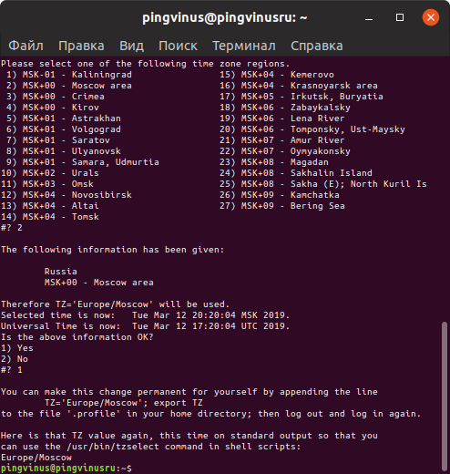
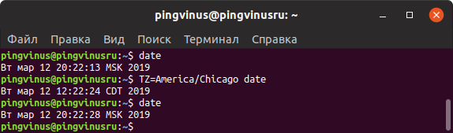
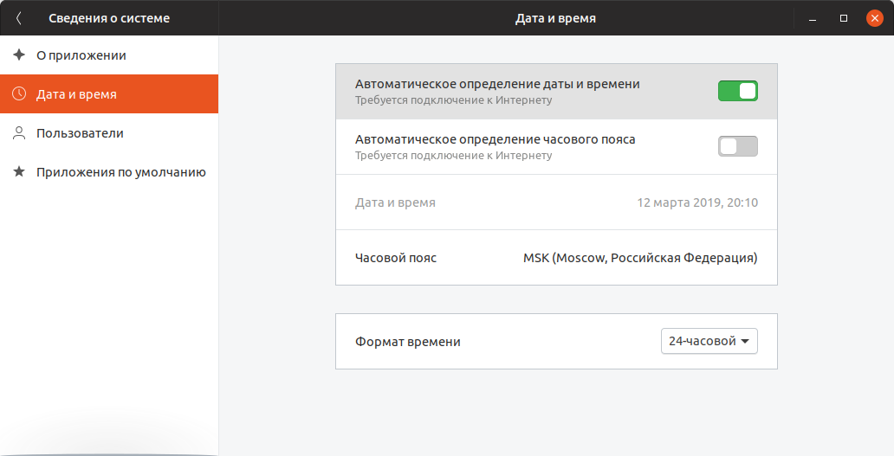
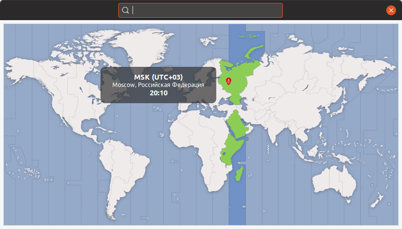

[источник](https://pingvinus.ru/note/timezone?ysclid=mmkeh2ki1c368999768)

# Как изменить часовой пояс в Linux <a name="link_1"></a>


Часовой пояс в Linux обычно настраивается во время установки системы. Иногда пользователю может потребоваться его изменить. Способ изменения часового пояса (его еще называют временной зоной) может зависеть от конкретного дистрибутива. Рассмотрим некоторые из способов изменения часового пояса.

Оглавление

- [ Как изменить часовой пояс в Linux](#link_1)
  - [ Посмотреть текущий часовой пояс](#link_2)
    - [ Команда date](#link_3)
    - [ Команда timedatectl](#link_4)
    - [ ls -lh /etc/localtime](#link_5)
  - [ Получить список доступных часовых поясов](#link_6)
    - [ Утилита tzselect](#link_7)
    - [ Утилита timedatectl](#link_8)
  - [ Изменить часовой пояс](#link_9)
    - [ Изменяем часовой пояс утилитой timedatectl](#link_10)
    - [ Изменяем часовой пояс настройкой /etc/localtime](#link_11)
  - [ Изменить часовой пояс только для одной программы или текущей сессии](#link_12)
  - [ Изменить часовой пояс через графические утилиты](#link_13)
  - [ Заключение](#link_14)

## Посмотреть текущий часовой пояс <a name="link_2"></a>

Посмотреть текущий часовой пояс можно разными способами.

### Команда date <a name="link_3"></a>

Команда date выводит текущую дату, время и часовой пояс:

```
$ date
Вт мар 12 19:01:33 MSK 2019
```

В выводе команды мы можем видеть, что текущая временная зона соответствует Москве — MSK.

### Команда timedatectl <a name="link_4"></a>

Утилита timedatectl применяется для настройки и получения информации о текущем системном времени. Она доступна в системах, использующих systemd.

Если выполнить команду timedatectl без параметров, то будет выведена информация о системных часах, а также часовой пояс (в поле Time zone).

```
$ timedatectl
Local time: Вт 2019-03-12 20:18:08 MSK
Universal time: Вт 2019-03-12 17:18:08 UTC
RTC time: Вт 2019-03-12 17:18:09
Time zone: Europe/Moscow (MSK, +0300)
System clock synchronized: yes
NTP service: active
RTC in local TZ: no
```

### ls -lh /etc/localtime <a name="link_5"></a>

Файл /etc/localtime это [символическая ссылка](https://pingvinus.ru/note/ln), которая указывает на текущий часовой пояс, используемый в системе.

Для просмотра можно воспользоваться командной:

```
$ ls -lh /etc/localtime
lrwxrwxrwx 1 root root 35 мар 12 20:09 /etc/localtime -> ../usr/share/zoneinfo/Europe/Moscow
```

## Получить список доступных часовых поясов <a name="link_6"></a>

### Утилита tzselect <a name="link_7"></a>

Перед тем, как устанавливать часовой пояс, нужно понять, какое значение можно установить. Для этого можно воспользоваться утилитой tzselect.

После запуска утилита tzselect отображает список географических областей. Вы должны ввести номер области и нажать Enter. Затем появится список стран. Аналогично, нужно ввести номер страны. Появится список городов. Вводим номер города. В результате вы сможете увидеть название вашей временной зоны.

```
tzselect
Please identify a location so that time zone rules can be set correctly.
Please select a continent, ocean, "coord", or "TZ".
1) Africa
2) Americas
3) Antarctica
4) Asia
5) Atlantic Ocean
6) Australia
7) Europe
8) Indian Ocean
9) Pacific Ocean
10) coord - I want to use geographical coordinates.
11) TZ - I want to specify the time zone using the Posix TZ format.
#? 7
```



### Утилита timedatectl <a name="link_8"></a>

Утилита timedatectl поддерживает опцию list-timezones. Выполнив следующую команду можно просмотреть список всех доступных временных зон:

```
timedatectl list-timezones
```

Можно воспользоваться _grep_ и ограничить область поиска. Например, выведем список временных зон только для Европы:

```
timedatectl list-timezones | grep Europe | less
```

## Изменить часовой пояс <a name="link_9"></a>

### Изменяем часовой пояс утилитой timedatectl <a name="link_10"></a>

Напомним, что утилита _timedatectl_ доступна только для систем, использующих systemd. Если у вас нет утилиты _timedatectl_, то используйте способ описанный в следующем параграфе.

Для установки часового пояса с помощью утилиты timedatectl нужно выполнить команду:

```
timedatectl set-timezone Europe/Moscow
```

Во время ввода часового пояса можно нажимать дважды клавишу Tab, чтобы получить список часовых поясов.

### Изменяем часовой пояс настройкой /etc/localtime <a name="link_11"></a>

Данный способ наиболее универсальный и работает в большинстве дистрибутивов Linux.

Необходимо создать символическую ссылку /etc/localtime, чтобы она указывала на файл нужной временной зоны. Файлы временных зон хранятся в каталоге /usr/share/zoneinfo/. Каждая зона имеет путь /usr/share/zoneinfo/Название/Зоны. Например, для Москвы это /usr/share/zoneinfo/Europe/Moscow.

Итак создадим ссылку на нужный файл временной зоны:

```
sudo unlink /etc/localtime
sudo ln -s /usr/share/zoneinfo/Europe/Moscow /etc/localtime
```

Чтобы проверить, что временная зона установлена верно, можно выполнить команду date:

```
date
```

## Изменить часовой пояс только для одной программы или текущей сессии <a name="link_12"></a>

Чтобы установить часовой пояс для отдельной программы можно задать его через переменную окружения TZ:

```
TZ=America/Chicago программа
```

Например:

```
$ TZ=America/Chicago date
```



Чтобы установить часовой пояс только для текущей сессии в терминале, используется команда:

```
export TZ=America/Denver
```

## Изменить часовой пояс через графические утилиты <a name="link_13"></a>

Выше мы описали способ изменения часового пояса, используя средства и утилиты командной строки. В большинстве дистрибутивах обычно есть графическая программа настройки, через которую можно с легкостью изменить часовой пояс.

Если вы работаете в Gnome, откройте Параметры системы.

Перейдите на вкладку Сведения о системе, далее вкладка Дата и время (в зависимости от версии Gnome названия пунктов могут немного отличаться). Нажмите на надпись Часовой пояс.



Откроется карта с возможностью интерактивного выбора часового пояса. Выберите мышкой нужный регион на карте.  


## Заключение <a name="link_14"></a>

Мы рассмотрели как изменить часовой пояс в Linux, как определить текущий часовой пояс и просмотреть список доступных временных зон. Большинству пользователей подойдет способ с использованием графической программы для изменения Параметров системы.
