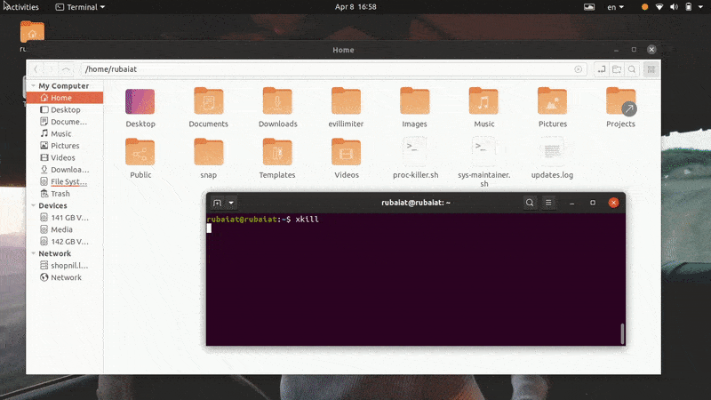
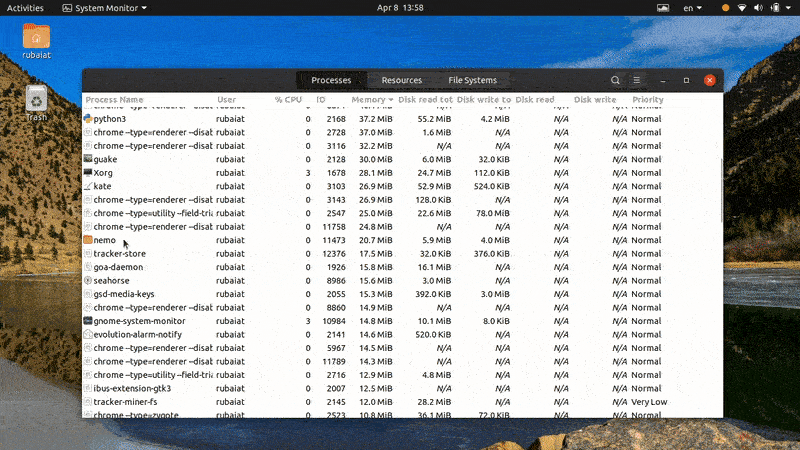

[источник](https://ru.linux-terminal.com/?p=1301)

- [ Как завершить или завершить процесс Linux: полное руководство](#link_1)
  - [ Освоение управления неотвечающими процессами в Linux](#link_2)
    - [ Различные методы завершения мертвого процесса Linux](#link_3)
    - [ Завершить не отвечающий процесс из командной строки](#link_4)
    - [ Узнайте информацию о PPID](#link_5)
      - [ Метод 1: использование команды ps](#link_6)
      - [ Метод 2: использование команды pstree](#link_7)
      - [ Метод 3: использование команды pgrep](#link_8)
      - [ Метод 4. Использование команды pidof](#link_9)
      - [ Метод 5: использование верхней команды](#link_10)
    - [ Завершить не отвечающий процесс Linux](#link_11)
      - [ Метод 1. Использование команды kill](#link_12)
      - [ Метод 2: использование команды pkill](#link_13)
      - [ Метод 3. Использование команды killall](#link_14)
      - [ Метод 4. Использование удобных острот](#link_15)
      - [ Метод 5. Уничтожьте несколько процессов с помощью сценариев оболочки Linux](#link_16)
    - [ Завершить не отвечающий процесс из графического интерфейса](#link_17)
      - [ Метод 1. Использование приложения xkill](#link_18)
      - [ Метод 2: использование приложения системного монитора в Ubuntu](#link_19)
  - [ Завершение мыслей](#link_20)

# Как завершить или завершить процесс Linux: полное руководство <a name="link_1"></a>

Многопроцессорные операционные системы, такие как [Linux](https://ru.linux-konsole.com) и BSD, используют несколько методов максимизации использования ЦП. Процесс — это просто выполняемая программа. Поскольку в данный момент времени в [Linux](https://ru.linux-konsole.com) выполняется более одного процесса, управление процессами в [Linux](https://ru.linux-konsole.com) чрезвычайно важно. Пользователи часто сталкиваются с такими проблемами, как регулирование ресурсов ЦП при запуске слишком большого количества программ. Подобные ситуации возникают, когда процессор не справляется с растущим числом процессов. Хотя это не полностью зависит от мощности вашего процессора, работа с зависшими или зомби-процессами может быть весьма неприятной. Чтобы помочь вам смягчить такие случаи, мы наметим некоторые стандартные способы уничтожения этих процессов.

## **Освоение управления неотвечающими процессами в Linux** <a name="link_2"></a>

---

Вы узнаете несколько способов завершить процесс Linux, который вообще не отвечает. Если вы работаете в Windows, возможно, вы знакомы с Ctrl+Alt+Delete. Аналогично, у пользователей Mac есть метод Command+Option+Escape для завершения замороженных процессов. [Linux](https://ru.linux-konsole.com) гораздо более универсален, чем его аналоги, и предлагает более одного метода борьбы с мертвыми/не отвечающими процессами.

### **Различные методы завершения мертвого процесса Linux** <a name="link_3"></a>

---

В основном мы опишем два метода уничтожения процессов-зомби. Для первого метода мы будем использовать терминал Linux. Для этого нам сначала нужно определить идентификатор процесса. После успешного получения мы можем использовать этот PID, чтобы завершить программу, отправив определенные сигналы на этот PID.

Вы также узнаете, как выполнять такие задания уничтожения [Linux](https://ru.linux-konsole.com) из графического интерфейса пользователя или из окна X. Для этого мы собираемся использовать приложение _System Monitor_, доступное в Ubuntu. Хотя это приложение GNOME, аналогичные инструменты доступны и для других сред рабочего стола Linux.

### **Завершить не отвечающий процесс из командной строки** <a name="link_4"></a>

---

Существует несколько инструментов для завершения не отвечающего или зависшего процесса из командной строки, включая **kill**, **pkill** и **killall**. Эти команды работают, отправляя определенные сигналы этим неотвечающим процессам. Вам понадобится идентификатор процесса или информация **PID**, чтобы вы могли отправить им необходимый завершающий сигнал.


PID или идентификатор процесса — это уникальный номер, идентифицирующий процесс. Они создаются ядром [Linux](https://ru.linux-konsole.com) во время выполнения, и планировщик процессов управляет их деятельностью ЦП. Таким образом, всякий раз, когда вы запускаете приложение, ядро сначала запускает необходимые процессы и присваивает им эти уникальные значения PID. С процессом может быть связано несколько PID. Более того, каждый процесс имеет единственный родительский процесс с уникальным PPID (ID родительского процесса).

Итак, если вы сможете узнать этот PPID, то сможете послать сигнал уничтожения с помощью программ, предназначенных для этой цели. Ниже вы узнаете, как проверить запущенные процессы в [Linux](https://ru.linux-konsole.com) и определить их PPID из терминала.

### **Узнайте информацию о PPID** <a name="link_5"></a>

---

Узнать PPID процесса можно с помощью нескольких команд управления процессами в Linux, таких как **pidof**, **pstree** и **pgrep**. Давайте рассмотрим их один за другим и посмотрим, как получить PID процесса Linux.

#### **Метод 1: использование команды ps** <a name="link_6"></a>

---

Команда ps в [Linux](https://ru.linux-konsole.com) отображает все запущенные процессы вместе с другой информацией, связанной с процессом, такой как PID, в терминале. Мы можем использовать эту команду для получения списка всех процессов, а затем отфильтровать конкретный процесс с помощью команд [Linux](https://ru.linux-konsole.com) grep. Он должен показать нам интересующую нас информацию об идентификаторе процесса.

```powershell
$ nano > /dev/null &
```

```powershell
$ ps aux | grep "nano"
```

Сначала мы вызвали текстовый редактор [Linux](https://ru.linux-konsole.com) в фоновом режиме. Затем мы использовали команду ps вместе с командой grep, чтобы узнать PPID этого редактора. Вывод может содержать несколько идентификаторов процессов, но нас интересует только первый, поскольку это наш PPID. Мы также можем использовать команду [Linux](https://ru.linux-konsole.com) awk, чтобы узнать эту информацию, как показано ниже.

```powershell
$ ps aux | awk '/nano/ {print $2}'
```

Эта команда более гибкая, поскольку она подавляет всю ненужную информацию. Он покажет только ту информацию PPID, которую мы ищем.


#### **Метод 2: использование команды pstree** <a name="link_7"></a>

---

Команда pstree предоставляет нам древовидное представление всех запущенных процессов. Он обеспечивает графическое представление списка задач [Linux](https://ru.linux-konsole.com) из окна терминала. С помощью этой команды вы можете просмотреть PPID, а также всю информацию PID процесса. Ознакомьтесь с примерами ниже, чтобы узнать, как использовать pstree для поиска PPID конкретного процесса.

```powershell
$ nano > /dev/null &
```

```powershell
$ pstree -p | grep 'nano'
$ pstree -p | awk '/nano/ {print $NF}'
```

Во-первых, мы запустили процесс в фоновом режиме, используя первую команду. Затем вторая команда получает PPID этого процесса с помощью команды grep в Linux. Наконец, третья команда показывает нам, как получить это значение с помощью команды awk.

#### **Метод 3: использование команды pgrep** <a name="link_8"></a>

---

Команда pgrep — одна из самых простых команд управления процессами в Linux. Он проверяет список всех запущенных процессов и выводит PPID данного процесса в стандартный вывод или терминал в нашем случае. Он работает путем сопоставления регулярных выражений и очень хорошо подходит для написания сценариев оболочки Linux.

```powershell
$ nano > /dev/null &
```

```powershell
$ pgrep 'nano'
```

Мы создали нанопроцесс аналогично предыдущим примерам. Затем мы получили его PPID с помощью команды pgrep. Как только мы получим это значение, мы сможем очень легко выполнить задание уничтожения Linux.

#### **Метод 4. Использование команды pidof** <a name="link_9"></a>

---

Команда pidof — еще один простой, но полезный способ определения PPID процесса Linux. Он отображает как PPID, так и все другие PID, связанные с процессом. Ознакомьтесь с приведенным ниже исследованием, чтобы узнать, как использовать это на практике.

```powershell
$ nano > /dev/null &
```

```powershell
$ pidof nano
$ pidof -s nano
```

При использовании команды pidof для проверки запущенных процессов в [Linux](https://ru.linux-konsole.com) вы часто будете видеть несколько PID. Обычно в таких случаях первое или последнее число — это PPID, в зависимости от того, расположены ли они в порядке возрастания или убывания. Вы можете использовать опцию **-s** pidof, чтобы смягчить это. Будет отображаться только значение PPID.


#### **Метод 5: использование верхней команды** <a name="link_10"></a>

---

Команда top обеспечивает просмотр всех запущенных процессов в Unix-подобных операционных системах в режиме реального времени. Вы можете использовать это, чтобы отобразить список задач [Linux](https://ru.linux-konsole.com) на вашем терминале и узнать информацию PID конкретного процесса.

```powershell
$ top
```

Используйте следующие команды, чтобы получить PPID определенного процесса из выходных данных команды top.

```powershell
$ nano > /dev/null &
```

```powershell
$ top -n1 -b | grep 'nano'
$ top -n1 -b | awk '/nano/ {print $1}'
```

Поскольку top обеспечивает вывод в реальном времени, а не выгрузку статических данных на терминал, мы использовали опции **-n1** и **-b** для печати статического вывода. Затем вы можете получить информацию PPID, используя команду grep или команду awk в Linux.

### **Завершить не отвечающий процесс Linux** <a name="link_11"></a>

---

Вы можете использовать любой из вышеперечисленных методов для получения PPID неотвечающего процесса. Как только вы это получите, пришло время вообще остановить процесс. Есть несколько команд, которые позволяют нам это сделать, например **kill**, **pkill** и **killall**. В следующих разделах мы увидим, как они работают один за другим.

#### **Метод 1. Использование команды kill** <a name="link_12"></a>

---

Команда kill широко используется администраторами [Linux](https://ru.linux-konsole.com) из-за ее простоты и надежности. Он принимает PID процесса и сигнал. Ядро убивает/останавливает выполнение процесса на основе этого сигнала. Вы можете использовать следующую команду, чтобы просмотреть все доступные сигналы для команды уничтожения.

```powershell
$ kill -l
```

Как видите, kill предлагает 64 различных сигнала. Однако в этом руководстве мы обсудим только два из них. Это сигнал 9(SIGKILL) и сигнал 15(SIGTERM). SIGTERM или сигнал 15 — это безопасный метод завершения не отвечающего процесса. SIGKILL или сигнал 9, с другой стороны, принудительно завершает процесс Linux.

```powershell
$ kill -9 8631
$ kill -KILL 8631
```

Вышеупомянутые команды эквивалентны, и они принудительно завершают процесс с PID 8631. Это PPID процесса «nano» в моей системе. Замените его PID не отвечающего процесса в вашей системе.

```powershell
$ kill -15 8631
$ kill -TERM 8631
```

Вышеуказанные команды также эквивалентны и корректно завершают процесс. Вот почему может пройти некоторое время, прежде чем процесс будет завершен. Более того, вам может потребоваться добавить **sudo** перед командой kill, если процесс принадлежит другому пользователю.


#### **Метод 2: использование команды pkill** <a name="link_13"></a>

---

Команда pkill — одна из самых универсальных команд управления процессами в Linux. Это позволяет нам завершить не отвечающий процесс на основе его имени, PID, владельца и других атрибутов времени выполнения. Это идеальный инструмент для начинающих пользователей или людей, которые не знакомы со многими стандартными командами терминала.

```powershell
$ pkill nano
$ pkill 8631
$ pkill -e nano
$ pkill -f nano
```

Вы можете использовать любую из приведенных выше команд pkill для уничтожения процесса-зомби или не отвечающего процесса в Linux. Используйте опцию **-e**, если вам нужно подтверждение выполнения задания уничтожения Linux. Команда pkill также позволяет пользователям отправлять определенные сигналы завершения.

#### **Метод 3. Использование команды killall** <a name="link_14"></a>

---

Команда killall позволяет пользователям завершать не отвечающие процессы по их именам. Его проще использовать, но могут возникнуть проблемы, если вы не будете осторожны. Поскольку killall завершает процессы на основе имен, всегда существует вероятность того, что вы случайно уничтожите процесс. Например, если в вашей системе доступны разные версии nano, первый пример уничтожит их все.

```powershell
$ killall nano
$ killall --verbose nano
$ killall --interactive nano
$ killall --signal KILL nano
```

В первом примере показано базовое использование команды killall в Linux. Вторая команда сообщит, было ли задание уничтожения успешным или нет, а третья команда запросит у пользователя подтверждение, прежде чем завершить процесс. По умолчанию killall использует сигнал SIGTERM для завершения процессов. Однако вы можете указать сигнал вручную, как показано в последнем примере.

#### **Метод 4. Использование удобных острот** <a name="link_15"></a>

---

Истинная красота [Linux](https://ru.linux-konsole.com) заключается в том, что он позволяет пользователям создавать сложные комбинации команд в соответствии со своими потребностями. Чтобы продемонстрировать это, мы выделили в этом разделе несколько острот.

```powershell
$ nano > /dev/null &
```

```powershell
$ kill -9 $(pgrep nano)
$ ps aux | grep -e 'nano' | awk '{print $2}' | xargs kill -9
```

В первом примере мы использовали интерполяцию оболочки для передачи PID процесса «nano» команде уничтожения Linux. Во втором примере используется несколько повседневных команд терминала и перенаправление ввода-вывода для завершения процесса. Вы можете создавать свои собственные изящные остроты, как только освоитесь с терминалом Linux.


#### **Метод 5. Уничтожьте несколько процессов с помощью сценариев оболочки Linux** <a name="link_16"></a>

---

Иногда пользователи могут захотеть завершить более чем один процесс. Мы можем легко автоматизировать такие задачи, написав простые сценарии оболочки. Если вас интересует эта тема, ознакомьтесь с нашим предыдущим руководством по сценариям оболочки Linux. Следующий скрипт получит PPID процессов, которые вы хотите уничтожить, а затем завершит их с помощью сигналов уничтожения.

```powershell
$ nano proc-killer.sh
```

```powershell
#!/usr/bin/env bash

for pro in "$@"
do
    pid=$(pgrep $pro | head -1)
    echo $pid

    comm="kill -9 $pid"
    eval $comm
done
```

Теперь сохраните этот файл и добавьте разрешение на выполнение, введя приведенную ниже команду.

```powershell
$ chmod +x proc-killer.sh
```

Теперь вы можете передать этому сценарию имена процессов, которые хотите завершить.

```powershell
$ ./proc-killer.sh nano gedit vlc
```

Просто замените аргументы именами не отвечающих процессов [Linux](https://ru.linux-konsole.com) в вашей системе.


### **Завершить не отвечающий процесс из графического интерфейса** <a name="link_17"></a>

---

Вы также можете завершить не отвечающий процесс из графического интерфейса пользователя или из окна X. В следующем разделе мы обсудим два способа сделать это.

#### **Метод 1. Использование приложения xkill** <a name="link_18"></a>

---

Современные дистрибутивы [Linux](https://ru.linux-konsole.com) используют графическое окно X для предоставления пользователям элегантного графического интерфейса. Существует простой инструмент под названием xkill, который позволяет пользователям закрывать не отвечающее окно графического интерфейса. Это возможно, поскольку в [Linux](https://ru.linux-konsole.com) окно заголовка приложения отделено от самого приложения.

Просто зайдите в эмулятор терминала [Linux](https://ru.linux-konsole.com) и введите xkill. Он превратит курсор мыши в кнопку X, которую можно использовать для закрытия любого окна графического интерфейса.

```powershell
$ xkill
```

Теперь все, что вам нужно сделать, это просто нажать на панель окна не отвечающего приложения, и оно мгновенно закроется и исчезнет.



#### **Метод 2: использование приложения системного монитора в Ubuntu** <a name="link_19"></a>

---

Большинство основных дистрибутивов [Linux](https://ru.linux-konsole.com) поставляются с какими-то инструментами мониторинга графического пользовательского интерфейса, которые позволяют пользователям графически завершать зависший процесс Linux. Например, приложение System Monitor в Ubuntu позволит нам интуитивно завершить не отвечающий процесс. Вы можете просто выбрать мертвый процесс из списка процессов и убить его, щелкнув правой кнопкой мыши по процессу и выбрав опцию уничтожения.



Существует еще много альтернатив этому приложению, и мы уверены, что вы легко найдете одну для своего дистрибутива или среды рабочего стола.

## **Завершение мыслей** <a name="link_20"></a>

---

Поскольку управление процессами в [Linux](https://ru.linux-konsole.com) очень универсально, пользователи часто расстраиваются, когда сталкиваются с не отвечающими процессами. Вот почему наши редакторы описали в этом руководстве все возможные способы завершения мертвого процесса Linux. Прочитав это, вы сможете завершить любые не отвечающие процессы из командной строки или из графического интерфейса. Вы также можете использовать любую из наших однострочных команд, чтобы справиться с такими неприятностями в кратчайшие сроки. Более того, вы даже можете завершить несколько процессов, используя наш простой сценарий оболочки. Надеемся, вы получили нужную вам информацию из нашего руководства.
