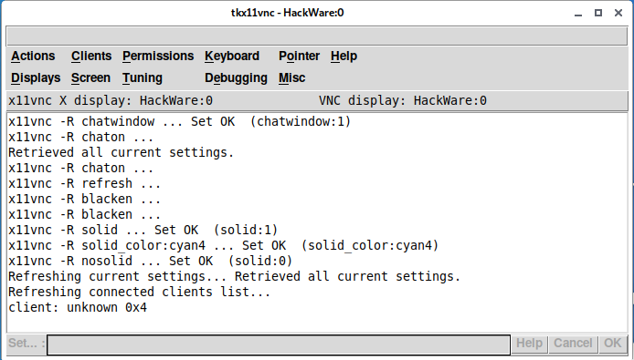
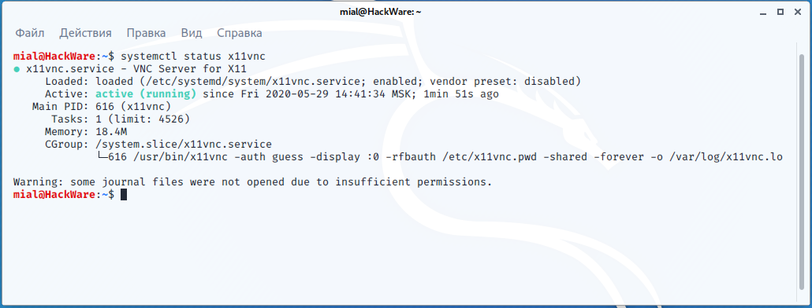
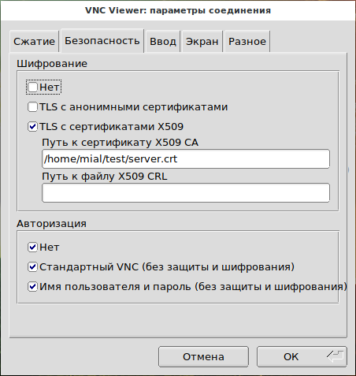
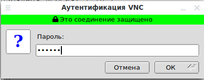

## x11vnc  

источник - https://hackware.ru/?p=12588#2115

**x11vnc** — это сервер VNC для Linux. Пакет x11vnc также включает несколько дополнительных утилит. VNC сервер x11vnc в первую очередь предназначен для работы в качестве службы или демона, но программа имеет и графический интерфейс.

### Как установить x11vnc  

Пакет **x11vnc** присутствует в стандартных репозиториях большинства дистрибутивов Linux.

Для установки в Debian, Kali Linux, Linux Mint, Ubuntu и их производные:

|   |   |
|---|---|
|1|`sudo` `apt` `install` `x11vnc`|

Для установки в Arch Linux, BlackArch и их производные:

|   |   |
|---|---|
|1|`sudo` `pacman -S x11vnc`|

### Быстрый запуск x11vnc  

Быстрый запуск без предварительной настройки подходит только в экстренных ситуациях, во всех остальных случаях настоятельно рекомендуется хотя бы установить пароль.

Запуск VNC сервера выполняется командой:

|   |   |
|---|---|
|1|`x11vnc`|

Программа выведет длинное сообщение об основах использования.

Поскольку к серверу без пароля может подключиться кто угодно, то для его остановки нажмите **CTRL-c** и перейдите к настройке.

### Как установить пароль для x11vnc  

Запустите команду вида:

|   |   |
|---|---|
|1|`x11vnc -storepasswd ПАРОЛЬ /ПУТЬ/ДО/ФАЙЛА`|

В этом случае **ПАРОЛЬ** в кодированном виде будет записан в указанный **ФАЙЛ**.

Также вы можете использовать следующий синтаксис:

---

|   |   |
|---|---|
|1|`x11vnc -storepasswd /ПУТЬ/ДО/ФАЙЛА`|

В этом случае программа запросит пароль и его подтверждение, а также запросит подтверждение на запись пароля в файл.

Также можно не указывать файл для сохранения, то есть следующий синтаксис:

|   |   |
|---|---|
|1|`x11vnc -storepasswd`|

В этом случае пароль будет сохранён в файл по умолчанию, а именно в **~/.vnc/passwd**.

Теперь чтобы сервер использовал пароль, запустите команду вида:

|   |   |
|---|---|
|1|`x11vnc -rfbauth /ПУТЬ/ДО/ФАЙЛА`|

Например:

|   |   |
|---|---|
|1|`x11vnc -rfbauth ~/.vnc``/passwd`|

Если существует файл **~/.vnc/passwd** от другого приложения VNC, то сервер будет работать нормально и с ним.

Кроме опции **-rfbauth**, после которой нужно указать путь до файла с паролем, сохранённого с помощью опции **-storepasswd**, имеется ещё две опции по работе с паролем:

- **-passwdfile /ПУТЬ/ДО/ФАЙЛА**
- **-passwd ПАРОЛЬ**

С опцией **-passwdfile** указывается путь до файла, в котором в первой строке хранится пароль в виде простого текста.

А опция **-passwd** позволяет установить пароль прямо в командной строке.

Опция **-usepw** сделает так, что автоматически будут использоваться файлы **~/.vnc/passwd** или **~/.vnc/passwdfile**. А если они не существуют, то будет сделан запрос на создание файла **~/.vnc/passwd**.

Помните, что пароль защищает только от несанкционированного подключения, но трафик всё равно передаётся в незашифрованным. Чтобы трафик шифровался, его нужно туннелировать через ssh или использовать опции x11vnc SSL: **-ssl** и **-stunnel**. Эти вопросы будут рассмотрены далее.

Файл настроек x11vnc

Поддержка файла конфигурации: если файл **$HOME/.x11vncrc** (то есть **~/.x11vncrc**) существует, то каждая строка в нем обрабатывается как один параметр командной строки.

Отключить использование файла конфигурации можно опцией **-norc**.

Для каждого имени опции начальный символ "**—**" не требуется. Например, строки "**forever**" и "**-forever**" является эквивалентными. Аналогично, «**wait 100**» или «**-wait 100**» являются приемлемыми и эквивалентными строками.

Символ "**#**" комментирует до конца строки (для буквального использования этого символа поставьте перед ним обратный слэш (**\**)).

Начальные и конечные пробелы обрезаются.

Строки могут быть продолжены символом **\** как последним символом строки (он становится пробелом).

К примеру, сохраним в файл **~/.x11vncrc**

|   |   |
|---|---|
|1|`gedit ~/.x11vncrc`|

следующую строку:

|   |   |
|---|---|
|1|`rfbauth /home/mial/.vnc/passwd`|

В результате служба **x11vnc** всегда будет использовать пароль для подключения, даже если запустить её без опций:

|   |   |
|---|---|
|1|`x11vnc`|

Обратите внимание, что путь до файла с паролем записан как абсолютный, а не относительный путь, чтобы независимо от способа запуска (например, при запуске демона от root) не возникало проблем с трактовой пути.

### Почему x11vnc сама выключается  

По умолчанию сервер x11vnc автоматически завершает работу при отключении клиента. Чтобы это не происходило, используйте опцию **-forever**.

Также при подключении нового клиента, существующий клиент отключается. Чтобы разрешить множественное подключение клиентов, используйте опцию **-shared**.

Для достижения стандартного VNC поведения без совместного подключения, когда новый VNC клиент подключается, а существующий VNC клиент отбрасывается, используйте совместно опции **-nevershared -forever**. Этот метод также может использоваться для защиты от зависших TCP подключений, который не исчезают.

### Графический интерфейс x11vnc  

Для запуска графического интерфейса **x11vnc** используйте опцию **-gui**:

|   |   |
|---|---|
|1|`x11vnc -gui`|

Графический интерфейс можно запускать даже когда служба x11vnc уже работает. Данный интерфейс передаёт команды службе с помощью опции, которая будет рассмотрена далее.

]

### Как разрешить подключения только с определённых IP адресов  

Для этого используйте опцию **-allow host1[,host2..]**

Она разрешает клиентские подключения только с хостов, соответствующих списку имён хостов или IP-адресов, в нём адреса или имена перечисляются через запятую без пробелов. Может также быть числовым префиксом IP, например, "192.168.100." чтобы соответствовать простой подсети. Если список содержит «**/**», он интерпретируется как файл, содержащий адреса или префиксы, которые перечитываются каждый раз, когда подключается новый клиент. Строки могут быть закомментированы символом "**#**".

**-allow** применяется в режиме **-ssl**, но не в режиме **-stunnel**.

IPv6: по состоянию на x11vnc 0.9.10, хост может быть указан в числовом формате IPv6, например 2001:4860:b009::93.

Опция **-localhost** это в основном так то же самое, что и "**-allow 127.0.0.1**".

Примечание: если вы хотите ограничить, какой сетевой интерфейс прослушивает x11vnc, смотрите опцию **-listen** ниже. Например. "**-listen localhost**" или "**-listen 192.168.3.21**". В особом случае опция «**-localhost**» подразумевает «**-listen localhost**».

Если вы не хотите, чтобы x11vnc прослушивал ЛЮБОЙ интерфейс (очевидно, вы используете **-connect** или **-connect_or_exit** или планируете использовать удалённое управление: **-R connect: host**), используйте **-rfbport 0**

IPv6: если IPv6 поддерживается, этот параметр автоматически подразумевает и loopback адрес IPv6 '::1'.

### Как в x11vnc установить пароль только на просмотр  

Вы можете в настройках VNC сервера задать пароль, который разрешит клиенту подключаться и видеть экран, но не позволит выполнять любые действия, то есть данный пароль только на просмотр без права любого ввода (с клавиатуры или с помощью мыши).

Для этого используйте опцию **-viewpasswd СТРОКА**.

Пароль для полного доступа (например, указанный опцией **-passwd**), также должен быть указан.

### Как запретить любой ввод на VNC сервере  

Для этого используйте опцию **-viewonly**, она делает так, что все VNC клиенты могут только наблюдать (по умолчанию выключено).

### Как настроить способы ввода, разрешённые пользователям  

Опция **-input СРОКА** делает точную настройку разрешённого пользовательского ввода. Если строка не содержит запятой "**,**" настройка применяется только к обычным клиентам. В противном случае часть перед "**,**" предназначена для обычных клиентов, а часть после для клиентов с правами только для просмотра. «**K**» — для ввода нажатия клавиши, «**M**» — для ввода движения мыши, «**B**» — для ввода нажатием кнопки, «**C**» — для ввода в буфер обмена, а «**F**» — для передачи файла (только [ultravnc](https://hackware.ru/?p=12383#5)). Их присутствие в строке позволяет этот тип ввода. Например. «**-input M**» означает, что обычные пользователи могут перемещать только мышь, а «**-input KMBCF,M**» позволяет обычным пользователям делать все что угодно, и позволяет пользователям с правами только для просмотра перемещать мышь. Эта опция игнорируется, когда действует глобальное **-viewonly** (в этом случае все входные данные отбрасываются).

### Настройка совместного доступа  

Одновременное подключение нескольких клиентов к одному VNC серверу регулируется следующими опциями:

**-shared**

Разрешает одновременное подключение нескольких клиентов

**-alwaysshared**

Всегда обрабатывать новых клиентов как совместных

**-nevershared**

Никогда не обрабатывать новых клиентов как совместных

**-dontdisconnect**

Не отключать существующих клиентов когда приходит новое не-совместное подключение (вместо этого отклонять новые подключения)

### Как прослушивать определённый IP адрес в x11vnc  

Опцией **-listen IP_АДРЕС** можно установить, на каком сетевом интерфейс принимать подключения (по умолчанию на всех). Можно указать IP или имя хоста.

### Как изменить имя рабочего стола VNC  

Для этого есть опция **-desktop ИМЯ**, которая меняет имя рабочего стола VNC (по умолчанию это "LibVNCServer")

### Как изменить номер используемого порта  

Поменять порт можно с помощью опции **-rfbport ЧИСЛО**. Не забудьте указать это же значение при подключении просмотрщика VNC.

### Демон службы x11vnc  

x11vnc по умолчанию не регистрирует свой демон, но его легко настроить.

Создайте файл **/etc/systemd/system/x11vnc.service**

|   |   |
|---|---|
|1|`sudo` `gedit` `/etc/systemd/system/x11vnc``.service`|

со следующим содержимым:

|   |   |
|---|---|
|1  2  3  4  5  6  7  8  9  10  11  12  13  14|`[Unit]`  `Description=VNC Server for X11`  `Requires=display-manager.service`  `After=network-online.target ##optional for better performance`  `Wants=network-online.target ##optional for better performance`  `[Service]`  `ExecStart=/usr/bin/x11vnc -auth guess -display :0 -rfbauth /etc/x11vnc.pwd -shared -forever -o /var/log/x11vnc.log`  `ExecStop=/usr/bin/x11vnc -R stop`  `Restart=on-failure`  `RestartSec=2`  `[Install]`  `WantedBy=multi-user.target`|

Установите пароль VNC (замените **МОЙ_ПАРОЛЬ**):

|   |   |
|---|---|
|1|`sudo` `x11vnc -storepasswd MY_PASSWORD` `/etc/x11vnc``.``pwd`|

Для запуска службы:

|   |   |
|---|---|
|1|`sudo` `systemctl start x11vnc`|

Для проверки её статуса:

|   |   |
|---|---|
|1|`systemctl status x11vnc`|

Для включения автозапуска службы при загрузке компьютера:

|   |   |
|---|---|
|1|`sudo` `systemctl` `enable` `x11vnc`|

Для остановки службы:

|   |   |
|---|---|
|1|`sudo` `systemctl stop x11vnc`|

Для удаления службы из автозагрузки

|   |   |
|---|---|
|1|`sudo` `systemctl disable x11vnc`|

### Более плавное обновление картинки  

Попробуйте опцию **-ncach ЧИСЛО**, например:

|   |   |
|---|---|
|1|`x11vnc -ncache 10 ...`|

Данная опция включает функцию кэширования пикселей на стороне клиента. **ЧИСЛО** по умолчанию равно **10**, то есть **-ncache 10**.

Данная опция приводит к повышенному потреблению оперативной памяти. Рекомендуются значения **ЧИСЛА** от 6 до 12. ЧИСЛО должно быть чётным, если это не так, то он увеличивается на 1.

Также попробуйте опцию **-ncache_cr**.

### Как запретить подключение всех клиентов  

С помощью опции **-deny_all** запущенная служба **x11vnc** не будет принимать подключения. Действие данной опции можно отменить удалённым управлением службы, а именно командой:

|   |   |
|---|---|
|1|`x11vnc -remote nodeny`|

После выполнения данной команды будет разрешено подключение VNC клиентов.

### Как менять опции x11vnc без перезапуска службы  

Службой x11vnc можно управлять удалённо, например, завершать её работу или на лету менять опции. Для этого используется та же самая команда, которой запускается VNC сервер, то есть **x11vnc** с опцией **-remote**. У этой опции два псевдонима: **-R** и **-r**.

Список поддерживаемых команд большой, рассмотрим только несколько примеров:

- Для установки уже запущенного сервера VNC используйте любую из следующих команд:

|   |   |
|---|---|
|1  2|`x11vnc -remote stop`  `x11vnc -R stop`|

- Для разрешения совместных подключений:

|   |   |
|---|---|
|1|`x11vnc -R shared`|

- Следующая команда изменит масштабирование рабочего стола:

|   |   |
|---|---|
|1|`x11vnc -R scale:3``/4`|

Команда для разрешения подключений, если VNC сервер был запущен с опцией **-deny_all**:

|   |   |
|---|---|
|1|`x11vnc -remote nodeny`|

Для запуска последовательности команд используйте что-то вроде такого:

|   |   |
|---|---|
|1|`x11vnc -R` `'script:ПЕРВАЯ КОМАНДА;ВТОРАЯ КОМАНДА;...'`|

Для чтения команд из файла используйте:

|     |                                            |
| --- | ------------------------------------------ |
| 1   | `x11vnc -R script:``file``=/ПУТЬ/ДО/ФАЙЛА` |

Файл может состоять из нескольких строк и использовать символ '**#**' для комментирования. В любом случае нужно использовать разделитесь '**;**' для отделения каждой команды.

### Как создать SSL сертификаты для шифрования трафика VNC сессий  

На сервере сгенерируйте сертификаты (замените оба вхождения «**192.168.0.100**» на IP-адрес сервера — это может быть как локальный, так и глобальный IP):

|   |   |
|---|---|
|1|`openssl req -x509 -newkey rsa -days 365 -nodes -keyout vnc-server-private.pem -out vnc-server.pem -subj` `'/CN=192.168.0.100'` `-addext` `"subjectAltName=IP:192.168.0.100"`|

Для x11vnc нужен файл, в котором вначале идёт приватный ключ, а затем сертификат, создадим его следующей командой:

|   |   |
|---|---|
|1|`cat` `vnc-server-private.pem vnc-server.pem > server.pem`|

Эта команда просто объединила содержимое файлов **vnc-server-private.pem** и **vnc-server.pem** в файл **server.pem**.

### Как использовать SSL для шифрования трафика VNC сессий  

Сервер запустите с опцией **-ssl** после которой укажите путь до файла **server.pem**:

|   |   |
|---|---|
|1|`x11vnc -ssl server.pem`|

Скопируйте файл с сертификатом **vnc-server.pem** на компьютер с просмотрщиком VNC — то есть клиентам, которые будут подключаться — укажите в клиентском приложении путь до файла сертификата, например в TigerVNC:

]

После этого VNC трафик будет шифроваться:

### Как использовать имя и пароль пользователя Linux для аутентификации VNC  

По умолчанию для входа по VNC нужно установить специальный пароль для данной службы. Если вы хотите, чтобы аутентификация происходила с использованием учётных данных пользователей на сервере, то укажите опцию **-unixpw [СПИСОК]**.

Для данной опции обязательно использовать шифрование с помощью SSL сертификата:

|   |   |
|---|---|
|1|`x11vnc -ssl server.pem -unixpw`|

В результате будет использоваться Unix имя пользователя и пароль аутентификации. x11vnc будет использовать программу **su** для проверки пароля пользователя. **[СПИСОК]** — необязательный список разрешённых имён пользователей Unix, разделённых запятыми. Если строка **[СПИСОК]** начинается с символа "**!**" тогда весь список принимается как исключающий список. Ниже приведены параметры для каждого пользователя, которые могут быть применены.

Знакомый диалог "login:" and "Password:" представлен пользователю на чёрном экране внутри vncviewer. Соединение обрывается, если пользователь не в состоянии ввести правильный пароль в 3 попытках или не отправляет его до истечения 45-секундного тайм-аута. В этот период существующие клиенты доступны только для просмотра.

Если первым полученным символом является «Escape», то имя пользователя unix не будет отображаться после «login:» по мере его введения. Это может быть полезно для просмотрщиков VNC, которые автоматически вводят имя пользователя и пароль.

Поскольку подробное поведение **su** может варьироваться от ОС к ОС и для локальных конфигураций, проверьте режим перед развёртыванием, чтобы убедиться, что он работает правильно. x11vnc попытается быть консервативным и отклонит вход в систему, если произойдёт что-то ненормальное.

Имена пользователей в **[СПИСКЕ]** через запятую могут иметь индивидуальные параметры после «**:**», например, "**fred:opts**", где "**opts**" — это разделённый плюсом ("**+**") список "**viewonly**", "**fullaccess**", "**input = XXXX**" или "**deny**", например, "**karl,wally:viewonly,boss:input=M**". Для «**input=**» это **K,M,B,C**, о которых рассказано при описании опции **-input**.

Если элемент в списке «*****», это означает, что эти параметры применяются ко всем пользователям. Это также подразумевает, что все пользователи могут войти в систему после предоставления действительного пароля. Используйте «**deny**», чтобы явно запретить некоторых пользователей, если вы используете «*****», чтобы установить глобальную опцию. Если **[СПИСОК]** начинается с "**!**", символ «*****» игнорируется для проверки, разрешён ли пользователь, но значения параметров, связанные с ним, применяются как обычно.
