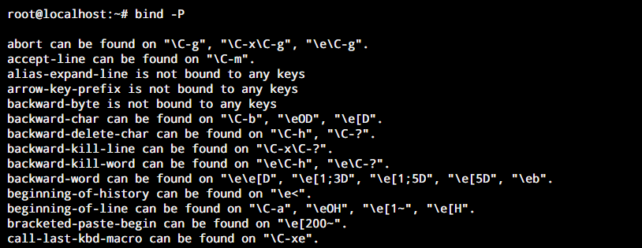
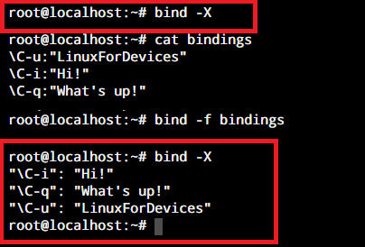

man\(1\)
bind [-m keymap] [-lpsvPSVX]
       bind [-m keymap] [-q function] [-u function] [-r keyseq]
       bind [-m keymap] -f filename
       bind [-m keymap] -x keyseq:shell-command
       bind [-m keymap] keyseq:function-name
       bind [-m keymap] keyseq:readline-command
              Display current readline key and function  bindings,  bind  a  key  sequence  to  a
              readline  function  or macro, or set a readline variable.  Each non-option argument
              is a command as it would appear in .inputrc, but each binding or  command  must  be
              passed  as a separate argument; e.g., '"\C-x\C-r": re-read-init-file'.  Options, if
              supplied, have the following meanings:
              -m keymap
                     Use keymap as  the  keymap  to  be  affected  by  the  subsequent  bindings.
                     Acceptable  keymap  names are emacs, emacs-standard, emacs-meta, emacs-ctlx,
                     vi, vi-move, vi-command, and vi-insert.   vi  is  equivalent  to  vi-command
                     (vi-move is also a synonym); emacs is equivalent to emacs-standard.
              -l     List the names of all readline functions.
              -p     Display  readline function names and bindings in such a way that they can be
                     re-read.
              -P     List current readline function names and bindings.
              -s     Display readline key sequences bound to macros and the strings  they  output
                     in such a way that they can be re-read.
              -S     Display readline key sequences bound to macros and the strings they output.
              -v     Display  readline  variable  names and values in such a way that they can be
                     re-read.
              -V     List current readline variable names and values.
              -f filename
                     Read key bindings from filename.
              -q function
                     Query about which keys invoke the named function.
              -u function
                     Unbind all keys bound to the named function.
              -r keyseq
                     Remove any current binding for keyseq.
              -x keyseq:shell-command
                     Cause shell-command  to  be  executed  whenever  keyseq  is  entered.   When
                     shell-command  is executed, the shell sets the READLINE_LINE variable to the
                     contents of the readline line buffer and the READLINE_POINT variable to  the
                     current  location  of  the insertion point.  If the executed command changes
                     the value of READLINE_LINE or  READLINE_POINT,  those  new  values  will  be
                     reflected in the editing state.
              -X     List  all  key sequences bound to shell commands and the associated commands
                     in a format that can be reused as input.

sed -n l

## Using The bind Command in Linux

Now we have developed an understanding of the bind command in Linux along with its parameters. Now it’s time to use this knowledge for practical application of the bind command. For this tutorial, we will go over some examples to learn how to use the bind command.

### 1. Listing all the keybindings and available variables

Now you may not remember all the keybindings that are available in the system so the bind command keeps track of those here. You can simply run the command below to get a list of all the keybindings.

|   |   |
|---|---|
|1|`bind -P`|

Bind List All

### 2. Creating a new Key bind

Creating custom key bindings is an important feature of the bind command in Linux. With the help of these, we can call any function without using its full name or execute our macros with a single key. Let’s assign the key _Ctrl+u_ to print ‘hello’ on the screen.

|   |   |
|---|---|
|1|`bind` `'"\C-u":"Hello!"'`|

As you can see, _Ctrl_ is represented by _\C-_ in the above command. We can see this working in the screenshot below.

Bind Key Creation

### 3. Listing All Custom Key bindings

Now if you don’t see your modified or custom created keybinding in the list above, it’s okay. This is a feature, not a bug. Most of your custom keybindings will be created with the default option **-x** even though we really don’t use any option apart from the key sequence and the command(as we’ve seen above).

So for key bindings created with the -x option, you need to run the follow command to view the binding.

|   |   |
|---|---|
|1|`bind -X`|

Bind X

### 3. Removing an Existing Keybind

Sometimes you notice a key binding which you don’t wish to use accidentally. Or you may wish to use a particular key binding for a separate command. For this, you can utilise the -r option of the bind command to remove the earlier function for a key sequence. Let’s demonstrate it by removing the key binding we just created. This can be done using the following command.

|   |   |
|---|---|
|1|`bind -r` `"\C-u"`|

Bind Remove

Now, the key sequence _Ctrl+u_ is unbounded. This can be used for some other command or left alone.

### 5. Reading Key bindings from a File

If you have a bunch of keybindings exported from some other system, here’s how you can import them. For starters the format of the file should be exactly the way you declare the bindings, except the bind command itself.

|                                       |                                                                                                                                                                   |
| ------------------------------------- | ----------------------------------------------------------------------------------------------------------------------------------------------------------------- |
| 1  2  3  4  5 | `#key bindings file format`  `\<key sequence>:``"<command or command sequence>"`  `#command to read the keybindings file`  `bind -f <filename>` |

Bind File

As you can see the bindings that I have used in the file, are now available for use in the system. I’ve used the [cat command](https://www.linuxfordevices.com/tutorials/linux/cat-more-command-in-linux) here to display the contents of the file.

## Wrapping up

The bind command in Linux is a helpful tool for any Linux user who wishes to optimize their workload. This is especially useful if you work with a lot of functions and macros on a regular basis.

With this tutorial, we hope you were able to understand the bind command in Linux and learn its usage. If you have any suggestions, feedback, or queries, please leave them down in the comment section below.
