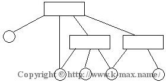
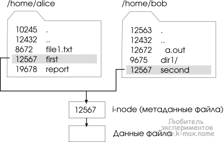

https://www.k-max.name/linux/fajlovaya-sistema-linux-i-struktura-katalogov/#fstab

__Структуру каталогов__, в общем случае можно представить в виде следующей схемы:

Сетевая иерархия каталогов Linux Данная схема отображает то, что у одного объекта файловой системы  (файла) может быть несколько путей. Грубо говоря, несколько файлов в структуре каталогов Linux могут быть физически одним файлом на диске. Или же другими словами, 1 физический файл на диске может иметь несколько имен (путей). Это достигается тем, что в файловой системе каждый файл идентифицируется уникальным номером, называемым __Inode (инод = Индексный дескриптор)__.

Отсюда можно сделать вывод, что структура  файловой системы отчасти иерархична. Или лучше сказать - "перекрестно-иерархическая", потому что дерево иерархии за счет того, что один объект может иметь несколько путей, может пересекаться.

__Операция монтирования__ служит для того, чтобы сделать доступной файловую систему, расположенную на каком-либо блочном устройстве. 

__Суть операции монтирования__ заключается в том, что ядро ассоциирует некоторый каталог (называемый точкой монтирования) с устройством, содержащем файловую систему и драйвером файловой системы. Для этого оно передает ссылку на блочное устройство - драйверу файловой системы, и в случае, если драйвер успешно проидентифицировал эту файловую систему, ядро заносит в специальную таблицу монтирования информацию о том, что все файлы и каталоги, чей полный путь начинается с указанной точки монтирования, обслуживаются соответствующим драйвером файловой системы и расположены на указанном блочном устройстве. Посмотреть таблицу примонтированных файловых систем можно через файл __/proc/mounts__.

__Примечание. Вообще говоря, привязываться к блочному устройству в данном случае не обязательно. Устройство, которое монтируется может быть не только блочным. Может быть, например, сетевым (если монтируется NFS или SMB\CIFS).__

Посмотреть сколько файл имеет ссылок и инод файла можно командой:
__ls -li__

Инод, как уже говорилось, уникален в пределах определенной файловой системы и содержит следующую информацию:

- о владельце объекта ФС
- последнем времени доступа
- размере объекта ФС
- указании файл это или каталог
- права доступа

При перемещении файла утилитой mv в пределах одной файловой системы, инод файла остается неизменным (меняется только поле, описывающее имя путь файла), при перемещении файла в другую файловую систему сначала создается новый inod, а затем удаляется исходный.

Так же хочу отметить, что в линукс существует 2 вида ссылок:
- __Жесткая ссылка__(она же Хардлинк, Hard-Link) - это собственно и есть один их путей файла (который указывается в команде ls -li), хорошо представлена жесткая ссылка в википедии:

- __Символьная__ (она же Симлинк от англ. Symbolic link, символическая ссылка) - это файл UNIX, содержащий в себе лишь текстовую строку - путь к оригинальному файлу, на который собственно ссылается.

__Файл в Linux существует пока на inod существует хотя бы одно указание (1 путь/имя)__, как только из системы удаляется последнее указание на inod, блоки, занимаемые файлом с данным inod "переходят" в свободный список (список блоков, доступных для выделения на диске). То есть блоки становятся свободным местом на диске.

В ФС UNIX есть такое понятие как __суперблок__. Суперблок - это своеобразный аналог FAT таблицы в ФС FAT32. Суперблок содержит в себе следующую информацию о файловой системе:

- общее число блоков и индексных дескрипторов в файловой системе;
- число свободных блоков и индексных дескрипторов в файловой системе;
- размер блока файловой системы;
- количество блоков и индексных дескрипторов в группе;
- размер индексного дескриптора;
- идентификатор файловой системы.

Суперблок размещается в первых 1024 байтах раздела, от его целостности зависит работоспособность ФС. ОС создает несколько копий суперблока для восстановления в случае повреждения оригинального и размещает их (копии) различных областях жесткого диска.

При загрузке, ядро ОС Linux после монтирования корневого раздела на чтение, автоматически примонтирует остальные разделы жесткого диска. Какие разделы необходимо примонтировать, ядро берет из конфигурационного файла __/etc/fstab__. 

Присмотревшись, можно увидеть, что в более современном варианте, устройства монтируются не по адресу устройства, а по UUID (идентификатору устройства). Это позволяет в случае смены жесткого диска, не перенастраивать fstab, а просто присвоить новому диску имеющийся UUID.

Строки, начинающиеся символом #, являются комментариями. 
Остальные строки содержат шесть полей. Поскольку эти поля позиционные, все они должны быть заполнены.

- __file system__
    Монтируемое блочное устройство (файловая система). Точнее сказать - указание пути к блочному устройству. Для файловых систем ext2, ext3, xfs и др. поддерживающих данную возможность, можно вместо этого указывать метку тома, например: LABEL="scsiboot", либо идентификатор UUID блочного устройства.  Это делает систему более устойчивой при установке и удалении устройств. Точка монтирования (каталог) должна существовать для корректного монтирования.
- __mount point__
    Это точка монтирования. Это путь, куда будет примонтирована файловая система file system.  Для пространства подкачки это поле имеет значение none.
- __type__
    Определяет тип файловой системы. CD/DVD-диски часто имеют разные файловые системы - ISO9660 или UDF - поэтому вы можете перечислить различные возможности в виде списка, разделенного запятыми. Если вы хотите, чтобы mount автоматически определила тип, используйте auto, как сделано в последней строке для дискеты.
- __option__
    Определяет параметры монтирования. Опции монтирования – это специальные параметры, которые влияют на работу драйвера файловой системы, когда он работает с файловой системой на соответствующем блочном устройстве – например, с помощью опций монтирования можно управлять режимом кэширования данных, преобразованиями имен файлов и данных, включать и отключать поддержку ACL и т.д. Для монтирования со значениями по умолчанию используйте defaults. Несколько полезных опций:

    - rw и ro указывают монтирование файловой системы в режиме чтения/записи или только для чтения.
    - noauto указывает, что файловая система не должна автоматически монтироваться при загрузке или при выдаче команды mount -a. В нашем примере эта опция применена для съемных устройств.
    - owner определяет, что пользователь, не имеющий прав root, может монтировать данную файловую систему (только если он является владельцем устройства) и демонтировать может только тот, кто смонтировал. Это особенно полезно для съемных носителей. Эта опция должна быть задана в /etc/fstab, а не в команде mount.
    - user определяет, что пользователь, не имеющий прав root, может монтировать данную файловую систему и демонтировать может только тот, кто смонтировал. Это особенно полезно для съемных носителей. Эта опция должна быть задана в /etc/fstab, а не в команде mount.
    - users определяет, что любой пользователь, не имеющий прав root, может монтировать данную файловую систему и демонтировать. Это особенно полезно для съемных носителей. Эта опция должна быть задана в /etc/fstab, а не в команде mount.exec или noexec определяют, позволять ли исполнение файлов из данной файловой системы. Для файловых систем, монтируемых пользователем, по умолчанию устанавливается значение noexec, если только после поля user не указано exec.
    - noatime отключает запись атрибута времени доступа к файлу. Это может повысить производительность.
    - nosuid устанавливает запуск исполняемых suid - файлов  без повышения прав.

- __dump__
    Определяет, будет ли команда dump включать данную файловую систему ext2 или ext3 в резервные копии. Значение 0 означает, что dump игнорирует данную файловую систему.
- __pass__
    Ненулевые значения pass определяют порядок проверки файловых систем во время загрузки

__В файловой системе Linux существуют следующие типы файлов:__

    - обычные файлы (текстовые, картинки и т.п.)
    - каталоги (это тоже тип файла, который содержит в себе список файлов, принадлежащий "себе")
    - блочные устройства (представляют собой "драйверы" устройств, позволяющие взаимодействовать с устройством. Блочное устройство производит чтение\запись в устройство блоками. Пример устройства: жесткие диски, дискеты и т.п.)
    - символьные устройства (представляют собой "драйверы" устройств, позволяющие взаимодействовать с устройством. Символьное устройство представляет собой любое не блочное устройство. Пример устройства: терминалы, принтеры и т.п.)
    - символические ссылки
    - PIPE (FIFO)
    - гнезда (socket)

. 			ссылка на текущий каталог. Данный элемент есть в каждом каталоге файловой структуры.
.. 			ссылка на родительский каталог. Данный элемент есть в каждом каталоге файловой структуры. (в корне - / данный элемент указывает на саму корневую систему)
/ 			корневой каталог ФС, сюда "завязаны" все остальные подкаталоги первого уровня
/bin/ 			Бинарные программы, основные программы для работы в системе: командные оболочки, файловые утилиты и.т.д.
/boot/ 			статичные файлы загрузчика (образ ядра, файлы GRUB, LILO)    
|-- 	/grub/ 		Каталог конфигурационных файлов загрузчика GRUB
|-- 	/lilo/ 		Каталог конфигурационных файлов загрузчика LILO
| 	config-kern_ver 		файл текущей конфигурации ядра
| 	initrd.img-kern_ver 		загрузочный образ инициализации initrd
| 	vmlinuz-kern_ver 		образ ядра Linux
/dev/ 			каталог, содержащий файлы устройств.
                В Linux вообще всё рассматривается, как файл, даже различные устройства, такие как принтеры, жёсткие диски, сканеры и т.д. Для получения доступа к определённому устройству, необходимо чтобы существовал специальный файл. Аналогично устроено большинство UNIX-подобных операционных систем
|-- 	/pts/ 		фиктивная файловая система, представляющая собой файловую структуру, которая отражает псевдотерминалы пользователей вошедших в систему
| 	|-- 	0 	устройство псевдотерминала pts/0
| 	|-- 	1 	устройство псевдотерминала pts/1
| 	--- 	n 	устройство псевдотерминала pts/n
|-- 	null 		т.н. "черная дыра" или "урна для битов". Вся информация, отправляемая на данное устройства - пропадает/уничтожается.
--- 	zero 		"генератор нулей"
/etc/ 			Системные конфигурационные файлы, стартовые сценарии, конфигурационные файлы графической системы и различных приложений. Из данного каталога хотелось бы выделить следующие файлы:
|-- 	/default/ 		содержит системные Файлы конфигураций в дистрибутивах Debian (аналог /etc/sysconfig/ в RedHat)
|-- 	/logrotate.d/ 		директория конфигурационных файлов демона автоматической обработки логов;
| 	|-- 	apache 	конфигурация логирования apache
| 	|-- 	squid 	конфигурация логирования apache
| 	|-- 	syslog 	конфигурация логирования системных логов
| 	--- 	... 	
|-- 	/pam.d/ 		каталог содержит файлы конфигурации PAM (указывают методы аутентификации в приложениях, использующих PAM)
|-- 	/ppp/ 		директория содержит конфигурации PPP-соединений:
| 	|-- 	options 	содержит общую для всех PPP-соединений конфигурацию;
| 	|-- 	options.* 	конфигурация конкретно взятого соединения (например модемное options.ttyS1)
| 	|-- 	ip-up 	скрипт выполняемый при/для соединения (демоном pppd);
| 	--- 	ip-down 	скрипт выполняемый при/для разъединении (демоном pppd).
|-- 	/rc.d/ 		директория системы инициализации init (в стиле UNIX) (содержит сценарии инициализации)
| 	|-- 	/init.d/ 	содержит скрипты, для управления системными демонами (сервисами);
| 	--- 	/rcX.d/ 	директории уровней запуска X, содержат ссылки на скрипты в init.d;
|-- 	/samba/ 		содержит файлы конфигурации samba:
| 	|-- 	smb.conf 	главный конфигурационный файл SAMBA;
| 	|-- 	smbusers 	описывает соответствие SAMBA пользователей к системным пользователям;
| 	--- 	smbpasswd 	содержит хеши пользователей SAMBA, пароли устанавливаются утилитой smbpasswd.
|-- 	/ssh/ 		Каталог конфигурации демона sshd
| 	|-- 	ssh_config 	Конфигурационный файл ssh клиента
| 	--- 	sshd_config 	Конфигурационный файл ssh - сервера
|-- 	/sysconfig/ 		содержит системные Файлы конфигураций в дистрибутивах RedHat (аналог /etc/default/ в Debian)
| 	|-- 	keyboard 	описание текущей раскладки клавиатуры;
| 	|-- 	desktop 	установки графической среды (KDE,GNOME..);
| 	|-- 	network 	файл конфигурации сетевой подсистемы
| 	--- 	i18n 	конфигурация общесистемной локали (локаль отдельных пользователей может содержаться в {home}/i18n);
|-- 	/security/ 		содержит Файлы описывающие безопасность системы:
| 	|-- 	console.perms 	правила изменения прав доступа к устройствам, при аутентификации;
| 	|-- 	limits.conf 	конфигурация лимитов пользователей.
| 	--- 	network 	конфигурация сети;
|-- 	/skel/ 		шаблон директории пользователя (в момент создания пользователя содержимое директории пользователя копируется отсюда), своеобразный аналог каталога C:\Documents and settings\Default User\ в Windows.
|-- 	/xinetd.d/ 		директория содержит файлы конфигураций отдельных сервисов для суперсервера xinetd;
|-- 	/X11/ 	/fs/config 	содержит перечень каталогов со шрифтами для X;
| 	|-- 	XF86Config 	Файл конфигурации X (XFree86);
| 	--- 	xorg.conf 	Файл конфигурации X (XOrg);
|-- 	at.allow 		Список пользователей, разрешающий (allow) или запрещающий (deny) выполнение утилиты at
|-- 	at.deny 	
|-- 	cron.allow 		Список пользователей, разрешающий (allow) или запрещающий (deny) выполнение утилиты cron
|-- 	cron.deny 	
|-- 	anacrontab 		конфигурация задач выполняемых anacron;
|-- 	crontab 		конфигурация задач выполняемых cron;
|-- 	ethers 		Файл соответствия аппаратных MAC адресов сетевым IP адресам в сети, в случае несоответствия доступ для хоста будет закрыт;
|-- 	export 		конфигурация NFS-ресурсов доступных извне;
|-- 	filesystems 		список ФС, поддерживаемых ядром (отсюда берется ФС, если она не указана в /etc/fstab)
|-- 	fstab 		список ФС, монтирующихся автоматически при загрузке
|-- 	group 		база данных групп пользователей в ОС
|-- 	gshadow 		файл паролей групп пользователей
|-- 	hostname 		текущее имя машины;
|-- 	hosts 		перечень хостов и соответствующих им IP-адресов;
|-- 	host.allow 		список хостов которым вход разрешен;
|-- 	host.deny 		список хостов которым вход запрещен (для libc ver 5);
|-- 	host.conf 		указывает где и в каком порядке искать имена хостов (для libc ver 6);
|-- 	inittab 		конфигурация последовательности загрузки (для процесса init);
|-- 	inputrc 		конфигурация ресурсов ввода с клавиатуры;
|-- 	issue 		сообщение, выводимое при локальном подключении к системе
|-- 	issue.net 		сообщение, выводимое при удаленном подключении к системе
|-- 	ld.so.conf 		файл конфигурации, содержащий список каталогов, в которых ld.so ищет библиотечные файлы, кроме указанных путей, компоновщик ищет в каталогах /lib и /usr/lib
|-- 	ld.so.cache 		кэш библиотечных файлов, для более быстрого поиска библиотек (своеобразный индекс)
|-- 	login.defs 		описывает поведение login и su;
|-- 	logrotate.conf 		конфигурация демона автоматической обработки логов (ротация, упаковка, удаление);
|-- 	lilo.conf 		конфигурация boot-загрузчика LILO;
|-- 	man.conf 		конфигурация системы страниц помощи, команда man;
|-- 	motd 		сообщение, выводимое всем пользователям после ввода пароля и перед запуском интерпретатора, т.н. "сообщение дня"
|-- 	mtab 		Список текущих примонтированных ФС. Обычно, этот файл должен создаваться, как только монтируется новая файловая система.
|-- 	netgroup 		файл определяет сетевые группы, используемые для проверки прав доступа при выполнении удаленного входа.
|-- 	nologin 		наличие этого файла запрещает пользователям входить в систему с выдачей сообщения в файле;
|-- 	nsswitch.conf 		конфигурация последовательности поиска имен по различным источникам;
|-- 	passwd 		база данных пользователей Linux
|-- 	printcap 		Файл конфигурации принтеров;
|-- 	profile 		сценарий-профиль для интерпретатора BASH (выполняется после регистрации в системе и используется для всех пользователей системы);
|-- 	protocols 		файл описывает номера протоколов, названия и описания.
|-- 	resolv.conf 		конфигурация резолвера имён, содержит список DNS-серверов;
|-- 	rpc 		файл описывает службы RPC (соответствие имя сервера RPC, номер программы RPC и псевдонимы)
|-- 	services 		содержит сопоставления номеров портов/сокетов именам служб
|-- 	shadow 		файл зашифрованных паролей пользователей
|-- 	sysctl.conf 		содержит команды для автоматической инициализации sysctl-параметров ядра;
|-- 	syslog.conf 		конфигурация демона системного логера (syslogd);
|-- 	sudoers 		указание на то какие пользователи и какие программы могут быть запущены с привилегиями root используя sudo.
--- 	xinetd.conf 		конфигурация суперсервера Internet (централизованное управление сокетами/портами);
/home/ 	{имя_юзера} 		каталог, содержащий подкаталоги пользователей (настройки интерфейса, личные файлы)
|-- 		.bashrc 	профиль конкретного пользователя для BASH (запускается при запуске bash или запуске копии bash );
|-- 		.cshrc 	профиль конкретного пользователя для TCSH;
|-- 		.bash_profile 	профиль конкретного пользователя для BASH (запускается при каждом входе в систему).
|-- 		.inputrc 	конфигурация ресурсы ввода с клавиатуры конкретного пользователя.
|-- 		.Xauthority 	файл авторизации для запуска X-приложений удаленно, файлы на удаленных машинах должны соответствовать;
|-- 		.xinitrc 	сценарий загрузки X сервера конкретного пользователя;
--- 		.plan
.project
.forward 	данные файлы используются утилитой finger для вывода информации о пользователе
/lib/ 			Системные библиотеки, необходимые для программ и модули ядра. (В Windows библиотеки представляют собой dll модули)
/lost+found 			В lost+found скидываются файлы, на которых не было ссылок ни в одной директории, хотя их inod не были помечены как свободные.
/media/ 			Каталог для монтирования съемных носителей (CD, Flash)
|-- 	/cdrom/ 		
/mnt/ 			В каталоге содержаться временные точки монтирования для устройств
/opt/ 			Дополнительные пакеты программ. Если программа установленная сюда больше не нужна, то достаточно удалить ее каталог без процедуры денсталляции. Сюда могут устанавливается программы не являющиеся частью дистрибутива. (например /opt/openoffice.org).
/proc/ 			Виртуальная ФС, хранящаяся в памяти компьютера при загруженной ОС. В данном каталоге расположены самые свежие сведения обо всех процессах, запущенных на компьютере. Содержимое каждого файла определяется в реальном времени. среди данного каталога, хотелось бы особо выделить следующие файлы и каталоги:
|-- 	/net/ 		
| 	-- 	arp 	текущая arp-таблица
|-- 	/sys/kernel/ 		
| 	|-- 	cap-bound 	управление дополнительными пра, как сделано в последней строке для дискеты.tr сценарий-профиль для интерпретатора BASH (выполняетсtd/tdtda name="proc"я после регистрации в системе и используется для всех пользователей системы);вами (root) (0 – root права аннулируются);
| 	|-- 	hostname 	текущее имя Компьютера
| 	|-- 	domainname 	Имя домена компьютера
| 	|-- 	osrelease 	версия ядра системы;
| 	|-- 	ostype 	тип ОС (Linux, *BSD, ...);
| 	--- 	version 	дата сборки ядра.
|-- 	cpuinfo 		Текущая информация о процессоре
|-- 	cmdline 		список параметров, переданных ядру при загрузке
|-- 	devices 		системные устройства
|-- 	dma 		Задействованные в данный момент DMA каналы
|-- 	interrupts 		Счетчики количества прерываний IRQ в архитектуре i386.
|-- 	ioports 		порты ввода/вывода
|-- 	filesystems 		поддерживаемые ФС
|-- 	loadvg 		информация о загруженности системы
|-- 	kcore 		содержимое физической памяти в текущий момент
|-- 	kmsg 		сообщения, выдаваемые ядром (копия syslog)
|-- 	mdstat 		отображение статистики программных RAID массивов
|-- 	meminfo 		информация о памяти
|-- 	modules 		загруженные модули ядра
|-- 	mounts 		смонтированные ФС
|-- 	partitions 		информация о разделах дисков
|-- 	pci 		Полный список всех PCI-устройств, найденных во время инициализации ядра, а также их конфигурация.
|-- 	swaps 		информация о всех своп-разделах, подключенных к системе
|-- 	uptime 		время работоспособности
|-- 	version 		версия ядра
|-- 	/цифровые/ 		каталоги, содержащие в названии наборы цифр, соответствуют GID -номеру процесса и содержат в себе информацию о работающем процессе, GIDу которого соответствует.
| 	|-- 	/fd/* 	содержит указатели на все, открытые процессом файлы
| 	|-- 	cmdline 	полную командную строку запуска процесса до тех пор, пока процесс не будет "выгружен" или не станет "зомби"
| 	|-- 	cwd 	символьная ссылка на текущий рабочий каталог процесса
| 	|-- 	environ 	содержит окружение процесса
| 	|-- 	exe 	содержит мягкую ссылку на бинарник процесса
| 	|-- 	limits 	содержит информацию о лимитах процесса (например, лимит открытых файлов, приоритет процесса и т.п.)
| 	|-- 	root 	мягкая ссылка на каталог пользователя root для процесса
| 	--- 	status 	Информация о процессе, представленная в довольно удобном для просмотра виде. Она содержит, в частности, следующие строки:

    Имя исполняемого файла процесса в скобках;
    Статус процесса;
    Идентификатор процесса
    Идентификатор родительского процесса
    Идентификатор группы процессов процесса
    и др.

/root/ 			домашний каталог пользователя root, данный каталог должен быть в корневой ФС, чтобы администратор мог войти в нее.
/sbin/ 			В данном каталоге содержаться основные системные бинарники, команды для системного администрирования, а также программы, выполняемые в ходе загрузки ОС. Здесь находятся элементы, запускаемые в фоновом режиме, в каком то смысле данный каталог является аналогом папки c:\Windows\system\ и c:\Windows\system32\.
--- 	shutdown 		утилита остановки системы
/srv/ 			данные предоставляемых сервисов от ОС
/sys/ 			это директория, к которой примонтирована виртуальная файловая система sysfs, которая добавляет в пространство пользователя информацию ядра Linux о присутствующих в системе устройствах и драйверах. (В версии ядра ниже 2.6 не использовалась)
|-- 	/block/ 		каталог содержит подкаталоги всех блочных устройств, присутствующих в данный момент в системе.
|-- 	/bus/ 		В этом каталоге находится список шин, определенных в ядре Linux (eisa, pci и т.д.).
--- 	/class/ 		Каталог содержит список группированных устройств по классам (printer, scsi-devices и т.д.).
/tmp/ 			Временные файлы. Данный каталог аналогичен c:\Windows\temp. Обычно Linux очищает этот каталог во время загрузки.
/usr/ 			В данном каталоге хранятся все установленные пакеты программ, документация, исходный код ядра и система X Window. Все пользователи кроме суперпользователя root имеют доступ только для чтения. Может быть смонтирована по сети и может быть общей для нескольких машин.
|-- 	/bin/ 		Директория дополнительных программ для всех учетных записей.
|-- 	/include/ 		Заголовочные файлы С++.
|-- 	/lib/ 		Системные библиотеки для программ, расположенных в каталоге/usr
| 	/local/ 		По стандарту /usr должен быть общим для нескольких компьютеров и смонтирован по сети, а /usr/local должен содержать установленные пакеты программы только на локальной машине (к примеру, /usr - бюджет семьи, а /usr/local - личный кошелек каждого). Но чаще всего директория /usr/local используется для установки программ, которые не предназначены для конкретного дистрибутива (к примеру для пакетного дистрибутива Ubuntu в /usr находятся "родные" установленные пакеты, а /usr/local находятся собранные пакеты из исходников).
| 	|-- 	/bin/
| 	|-- 	/lib/
| 	|-- 	...
|-- 	/sbin/ 		Дополнительные системные программы.
|-- 	/share/ 		Общие данные установленных программ.
| 	|-- 	/icons/ 	В каталоге находятся все иконки системы.
| 	--- 	/doc/ 	Директория, в которой обычно находится справочная документация по установленным программам.
|-- 	/src/ 		Каталог содержит исходные коды (например, здесь располагаются исходные коды ядра).
|-- 	/X11R6/bin/ 	Х 	ссылка на текущий X сервер;
|-- 	magic.mime 		файлы, хранящие "магическое число". Данное число описывает тип файла для утилиты file.
--- 	magic 	
/var 			Здесь находятся часто меняющиеся данные (журналы операционной системы, системные log-файлы, cache-файлы и т. д.)
|-- 	/cache 		В этом месте хранятся все кэшированные данные различных программ.
|-- 	/lib 		Постоянные данные, изменяемые программами в процессе работы (например, базы данных, метаданные пакетного менеджера и др.).
| 	--- 	/rpm/ 	база данных пакетного менеджера RPM
|-- 	/lock 		Здесь лежат lock-файлы, указывающие на занятость некоторого ресурса.
|-- 	/log/ 		в данном каталоге лежат все лог файлы системы
| 	|-- 	wtmp 	(бинарный формат) содержит удачные попытки входа и выхода в систему
| 	|-- 	utmp 	(бинарный формат) содержит текущих вошедших пользователей в систему
| 	|-- 	lastlog 	(бинарный формат) содержит, когда каждый пользователь последний раз входил
| 	-- 	btmp 	(бинарный формат) содержит НЕ удачные попытки входа/выхода в систему
|-- 	/spool 		Задачи, ожидающие обработки (например, очереди печати, непрочитанные или не отправленные письма, задачи cron и т. д.).
--- 	/www 		В этом месте размещаются Web-страницы для сервера Apache.