В данной статье рассмотрим как подключить bluetooth устройства в linux debian через usb-адаптер. А также рассмотрим что делать, если bluetooth устройство не отображается.

Перед покупкой usb-адаптера необходимо убедиться в том, то что он поддерживает linux, а также желательно посмотреть комментарии людей: столкнулись ли они с какими-либо проблемами при подключении usb-адаптера. Потому что существует два вида usb-адаптеров: первый вид - это когда usb-адаптер после подключения работает и не требует никаких действий, а второй вид - это когда необходимо установить драйвера.

## Установка драйверов usb bluetooth адаптера

Рассмотрим второй случай. Например вы приобрели usb-адаптер, которым была указана поддержка linux, подключили его к компьютеру, а он не работает. При попытке включения bluetooth - он просто не включается, а если мы попробуем вывести список usb-устройств следующей командой:

```bash
lsusb | grep bluetooth -i
```

То увидим то, что наш адаптер подключен:

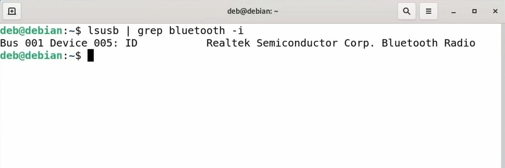

Для того, чтобы узнать в чем причина воспользуемся журналом логов. Для этого, следующей командой запустим журнал логов **journalctl**:

```bash
sudo journalctl -f
```

И после этого подключим наш usb-адаптер. После подключения usb-адаптера увидим следующую ошибку:

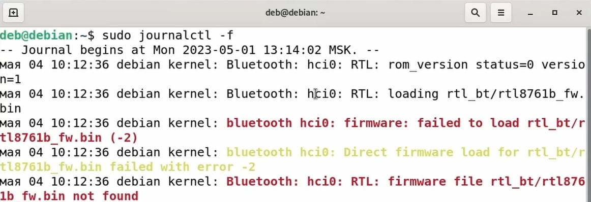

О том, что прошивка данного адаптера не была найдена, то есть отсутствует драйвер данного usb-адаптера. В моём случае это драйвер realtek rtl 8761b. Далее необходимо найти решение данной ошибки в интернете.

В данном случае, чтобы решить текущую проблему необходимо скачать файл драйвера с репозитория ядра linux и скопировать его в папку с драйверами.

Перейдем в папку с драйверами:

```bash
cd /usr/lib/firmware/rtl_bt
```

И увидим то что папка rtl_bt не создана. Создадим её:

```bash
cd /usr/lib/firmware
mkdir rtl_bt
```

Перейдем в эту папку:

```bash
cd rtl_bt
```

И теперь скачаем драйвера перейдя по следующей [ссылке](https://git.kernel.org/pub/scm/linux/kernel/git/firmware/linux-firmware.git/tree/rtl_bt).

Здесь необходимо найти нужный нам драйвер и скачать два файла config и fw:


Скачаем данные файлы нажав на ссылку plain:

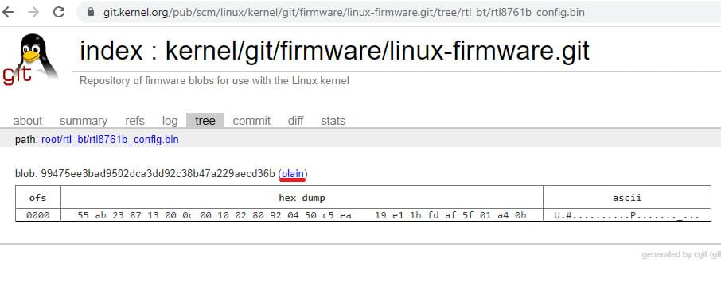

И скопируем данные файлы из папки загрузки в папку с драйверами:

```bash
sudo cp ~/Загрузки/rtl8761b_config.bin .
sudo cp ~/Загрузки/rtl8761b_fw.bin .
```

Теперь снова запустим журнал логов:

```bash
sudo journalctl -f
```

И переподключим наш usb-адаптер.

И увидим то, что ошибка не отображается:

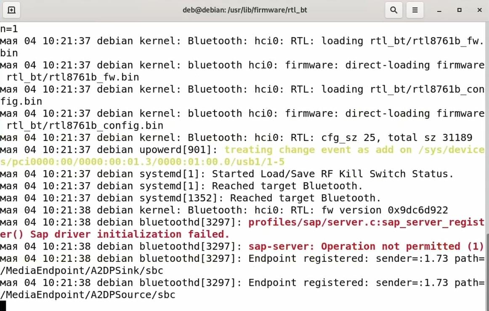

Теперь попробуем включить Bluetooth и найти устройство.

Как мы видим устройство отображается:

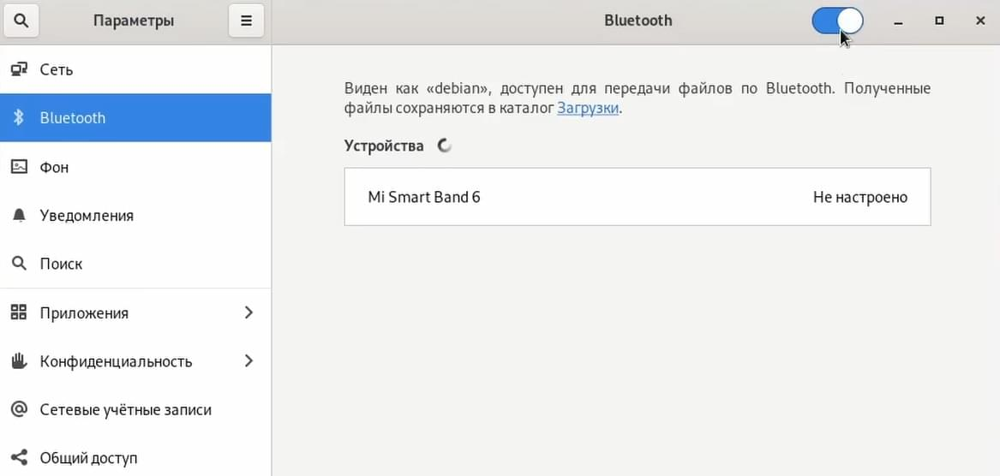

## Драйвера из non free репозитория в Debian

Также в debian установить драйвера можно при помощи пакетов из non free репозитория. О том как подключить non free репозиторий есть [статья на сайте](https://kodprog.ru/dobavlenie-repozitoriev-non-free-i-contrib-v-linux-debian). Для того, чтобы установить пакет драйверов введем в консоли sudo apt install далее через пробел укажем firmware:

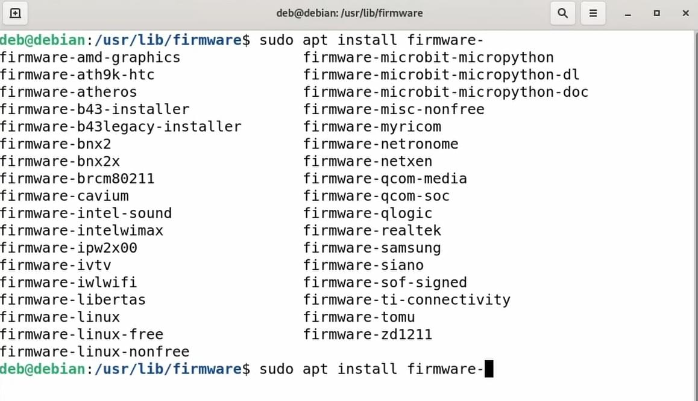

И через тире укажем производителя чипа usb-адаптера в нашем случае это realtek:

```bash
sudo apt install firmware-realtek
```

После установки перейдем в папку с драйверами:

```bash
cd /usr/lib/firmware/rtl_usb
```

И выведем их список:

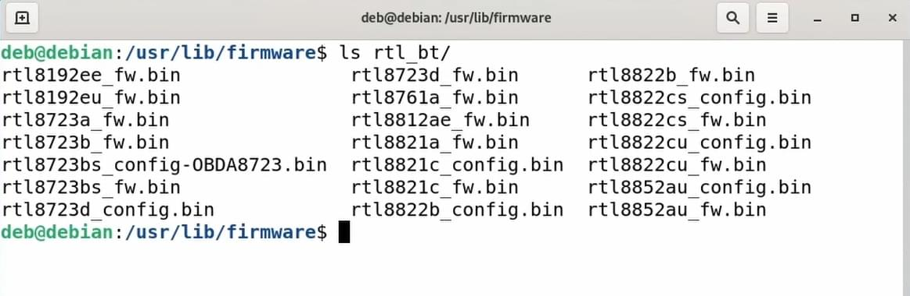

И увидим то, что нашего драйвера нет в списке. Значит данный способ нам не помог. Здесь установилась только **A версия** драйвера 8761, а нам нужна **версия B**.

Также драйвер может быть на сайте производителя usb-адаптера.

## Дополнение про работу usb bluetooth адаптеров

Небольшое дополнение. Попробовал запустить оба usb-адаптера в linux ubuntu и ситуация поменялась на противоположную Первый bluetooth-адаптер, у которого нет никакого бренда отказался работать адекватно. Хотя в debian он работал сразу после подключения, а второй блютус адаптер под брендом dexp наоборот заработал сразу после подключения хотя в debian нам пришлось скачать для него драйвера.

Так что, работа адаптера также зависит от того, на какой системе он запускается.

## Подключение bluetooth устройств

Перейдем к подключению устройств в графическом окружении. В gnome используется специальный интерфейс для подключения bluetooth устройств, который находится в разделе параметры. Откроем его и попробуем подключить беспроводную клавиатуру.


На клавиатуре включим режим сопряжения. В моем случае на клавиатуре есть специальный индикатор который начинает быстро мигать, что говорит о том, что клавиатура находится в режиме сопряжения. И увидим в списке устройств нашу клавиатуру:

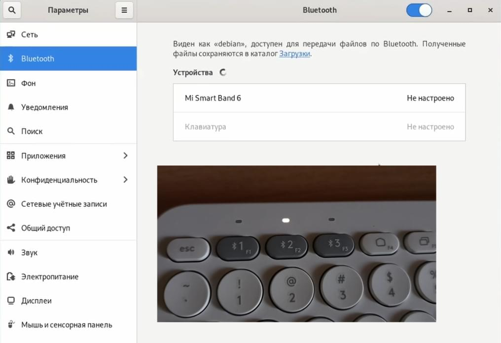

Она отображается серым цветом. Если мы попробуем подключить её, то ничего не произойдет, то есть подключение невозможно. Возникает следующий вопрос: "Что же делать если в графическом окружении нет такого интерфейса для подключения bluetooth устройств, подключение bluetooth устройства невозможно или bluetooth устройство вообще не отображается в списке?".

## Что делать если bluetooth устройство не отображается или не подключается

В этом нам поможет bluetooth manager - blueman. Установим его. Для этого откроем терминал, и следующий командой запустим установку:

```bash
sudo apt install blueman
```

## Запуск bluetooth менеджера blueman

Теперь запустим bluetooth manager, у меня почему-то произошло какая-то ошибка и bluetooth менеджер не отображается в списке программ, поэтому запустим его через терминал следующий командой:

```bash
blueman-manager
```

В программе нажимаем кнопку найти и начинается поиск наших устройств:

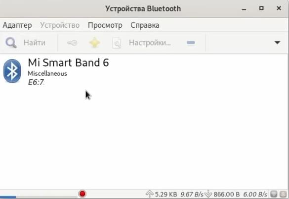

На клавиатуре снова запустим режим сопряжения. Нажмем правой кнопкой мышку по найденной клавиатуре и нажмем сопряжение:


Для сопряжения программа нам предложит ввести символы на подключаемой клавиатуре.

Если же такого не произойдет:


То нужно нажать правой кнопкой мыши на найденном устройстве и выбрать пункт подключить:

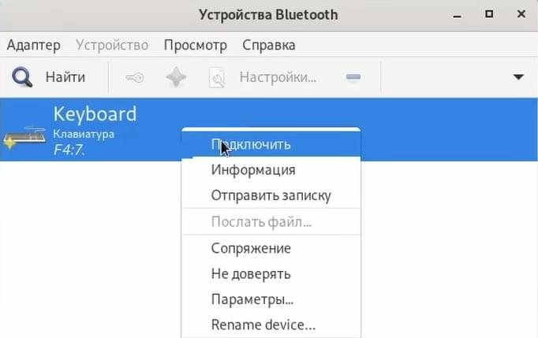

Также правой кнопкой мыши доверять:

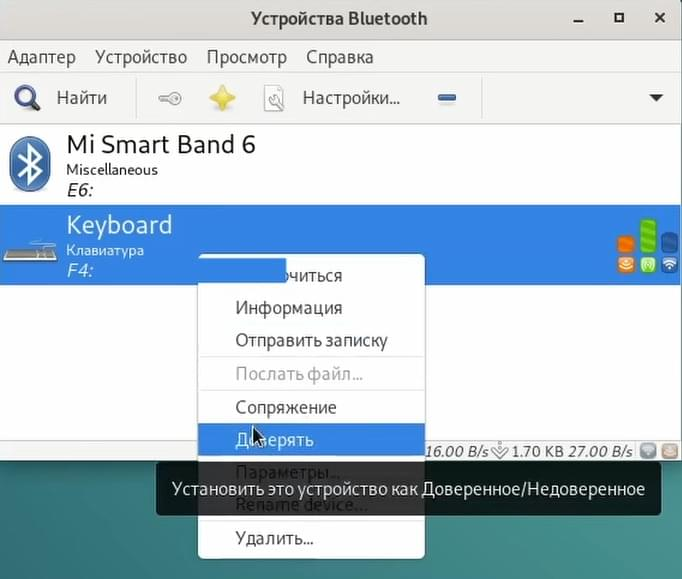

В данном случае клавиатура подключилась. Также может возникнуть ситуация когда устройство также не отображается в данной программе.

## Если bluetooth устройство не отображается в blueman

Для решения этой проблемы нам поможет терминал. Для начала убедимся в том, что сервис bluetooth запущен. Для этого выведем его статус следующей командой:

```bash
sudo systemctl status bluetooth
```

И увидим то, что он запущен и работает:

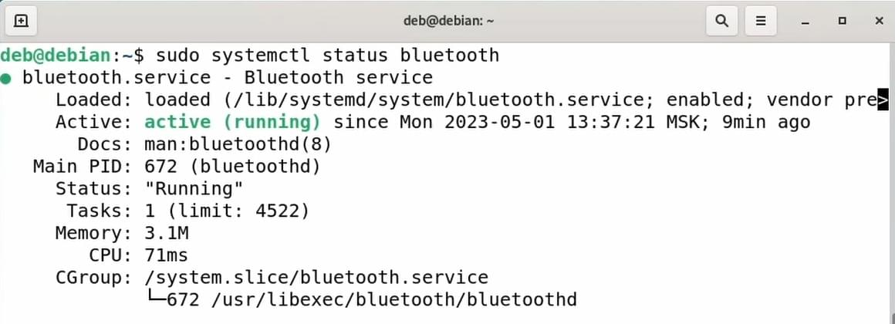

Если он вдруг по какой-то причине не запущен, то можно воспользоваться командой start:

```bash
sudo systemctl start bluetooth
```

А если произошла какая-то ошибка то воспользоваться командой restart для перезапуска:

```bash
sudo systemctl restart bluetooth
```

Также воспользуемся командой enable, для того чтобы bluetooth сервис запускался вместе со стартом компьютера:

```bash
sudo systemctl enable bluetooth
```

## bluetoothctl - консольная утилита для управления bluetooth устройствами

Перейдем к консольной утилите для управления bluetooth устройствами. Запустим ее при помощи команды:

```bash
bluetoothctl
```

Если по какой-то причине она не запускается, то необходимо установить пакет bluetooth следующей командой:

```bash
sudo apt install bluetooth
```

список доступных bluetooth контроллеров

```bash
list
```

назначить контроллер по умолчанию(идентификатор взять из предыдущей команды list)

```bash
select id_ctrl
```

List available devices, with an optional property as the filte

```bash
devices [Paired/Bonded/Trusted/Connected]
```

начать сканировать доступные для подключения устройства

```bash
scan on
```

Видим отображаемые устройства:

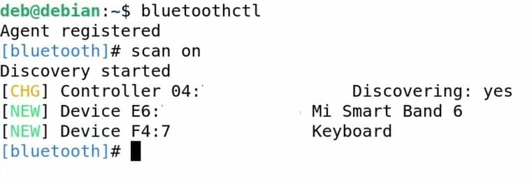

Для того, чтобы завершить сканирование можно воспользоваться командой:

```bash
scan off
```

информация об устройстве

```bash
info 74:45:CE:15:F4:BB
```

Cкопируем mac-адрес клавиатуры и для сопряжения воспользуемся командой pair:

```bash
pair F4:71:33:66:77:C3
```

Где через пробел укажем mac-адрес нашего устройства. На клавиатуре также необходимо запустить режим сопряжения.

Для сопряжения программа предлагает нам ввести ключ состоящий из чисел. На подключаемой клавиатуре ведем их и после этого устройство должно подключиться.

Если этого не произошло:

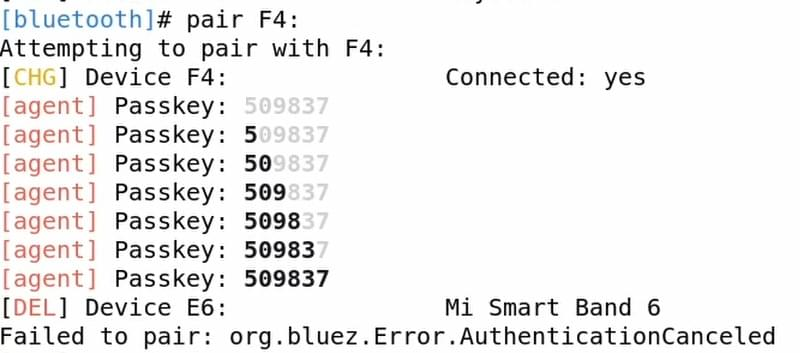

То подключим устройство при помощи команды connect:

```bash
connect F4:71:33:66:77:C3
```

И как мы видим наше устройство успешно подключилось:

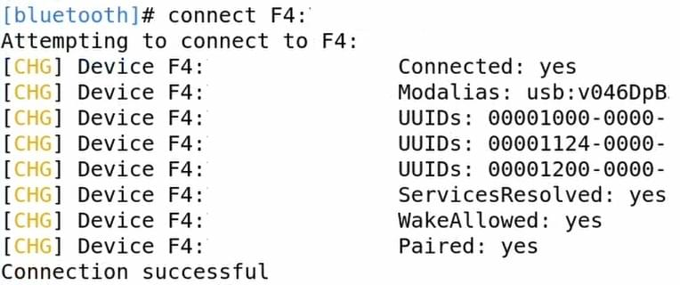

Для того, чтобы доверять данному устройству воспользуемся командой trust:

```bash
trust F4:71:33:66:77:C3
```

Где через пробел укажем mac-адрес устройства. Для того, чтобы вывести список связанных устройств воспользуемся командой paired-devices:

```bash
paired-devices
```

Для того, чтобы отключить устройство используется команда disconnect:

```bash
disconnect F4:71:33:66:77:C3
```

Для удаления устройства из списка доверенных используется команда unstrust:

```bash
untrust F4:71:33:66:77:C3
```

Для удаления устройства используется команда remove:

```bash
remove F4:71:33:66:77:C3
```

Снова выведем список подключенных устройств:

```bash
paired-devices
```

И увидим то, что наша клавиатура успешно удалена:


Для того чтобы выйти из утилиты воспользуемся командой exit:

```bash
exit
```

Перейдем в интерфейс gnome. И увидим подключенную клавиатуру в списке устройств:


## Как узнать версию bluetooth у usb bluetooth адаптера в Linux

Ну и бонусом рассмотрим "Как узнать какая у нас версия usb-адаптера?". Для этого введем команду:

```bash
hciconfig -a
```

В строке HCI версия видим то, что версия адаптера 5.1:

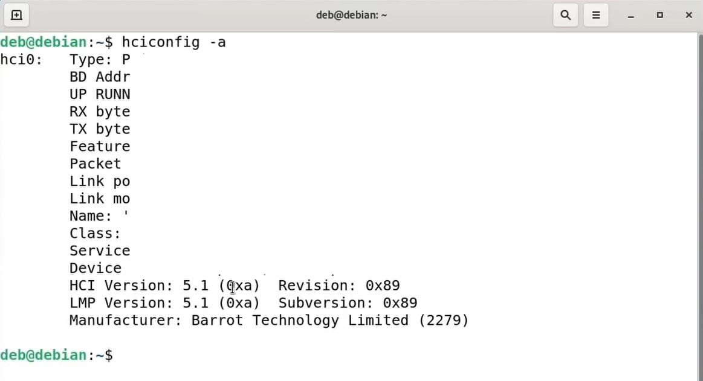

Если версия не отображается, то можно узнать версию воспользовавшись данной таблицей:

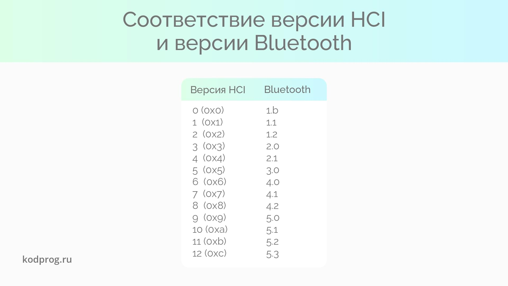

dmesg | grep -i bluetooth

rfkill list all

gatttool -I
connect 74:45:CE:15:F4:BB
