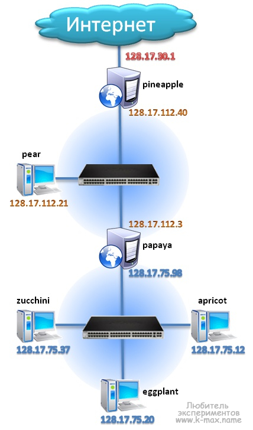
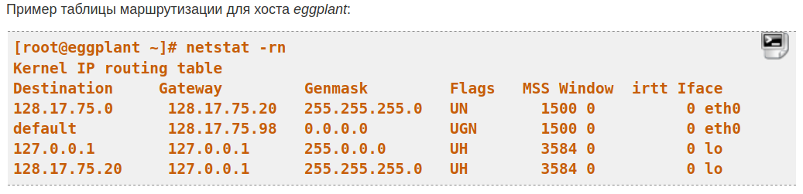
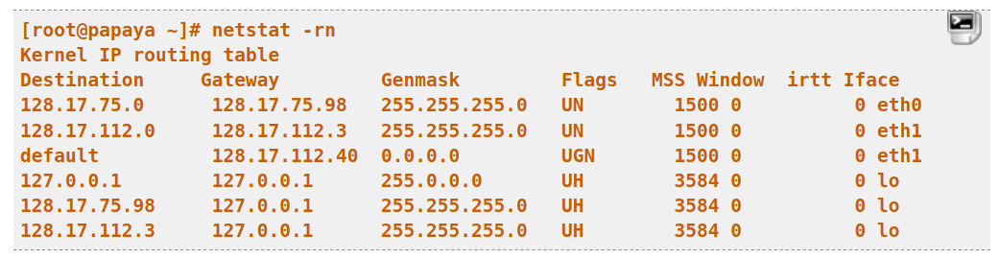
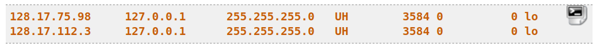

# Маршрутизация в Linux

Вы уже знаете, что все данные в сети передаются в виде пакетов, а чтобы компьютер знал куда нужно отправить тот или иной пакет используются IP адреса. Но пакету, перед тем, как он достигнет точки назначения нужно пройти множество компьютеров и маршрутизаторов.

Каждому из маршрутизаторов нужно знать на какой компьютер передавать пакет дальше.

## Сетевые маршруты в Linux

Сетевые маршруты необходимы чтобы компьютеры могли определить по какой цепочке должен пойти пакет, чтобы достигнуть цели. Маршруты можно настроить на уровне интерфейса или маршрутизатора.

Когда компьютеру нужно отправить пакет в сеть он смотрит таблицу маршрутизации, в ней указанны ip адреса пунктов назначения и адреса интерфейсов и роутеров в домашней сети, которые могут отправить пакет по нужному адресу. Если для цели маршрут не указан то используется так называемый шлюз по умолчанию или маршрут по умолчанию. Точно такая же картина наблюдается на роутере. Устройство смотрит на IP адрес назначения и сверяет его со своей таблицей маршрутизации, а потом отправляет дальше.
Ниже мы рассмотрим как проверить текущие маршруты в системе, а также как настроить новые.
Самый удобный способ посмотреть таблицу маршрутизации linux - это команда ip:
__ip route__
пример вывода
default via 192.168.1.1 dev enp2s0 proto static metric 100

что вывод команды можно использовать в качестве аргумента для __ip route add__ или __ip route del__. Это очень удобно. Как вы видите, в качестве шлюза по умолчанию везде используется 192.168.1.1. Рассмотрим подробнее что означает вывод этой команды:
__default__ - в данной строке означает вариант по умолчанию. Здесь должен быть ip адрес цели или маска подсети;
__via 192.168.1.1__ - указывает через какой шлюз мы можем добраться до этой цели, у нас это 192.168.1.1;
__dev enp2s0__ - сетевой интерфейс, с помощью которого будет доступен этот шлюз;
__proto static__ - означает, что маршрут был установлен администратором, значение __kernel__ значит что он был установлен ядром;
__metric__ - это приоритет маршрута, чем меньше значение - тем выше приоритет.

## Настройка маршрутов в Linux

Вы можете настраивать таблицу маршрутизации с помощью команды ip. Например, чтобы изменить маршрут по умолчанию достаточно выполнить:
__ip route add default via 192.168.1.1__

Так вы можете добавить маршрут для любого IP адреса, например, для 243.143.5.25:
__sudo ip route add 243.143.5.25 via 192.168.1.1__

Все очень просто, сначала указывается IP адрес цели, а затем шлюз в локальной сети, через который можно достичь этого адреса. Но такие маршруты будут активны только до перезагрузки, после перезагрузки компьютера они будут автоматически удалены. Чтобы маршруты сохранились их нужно добавить в файл конфигурации.

В операционных системах семейства Red Hat используются конфигурационные файлы __/etc/sysconfig/network-scripts/route-ethX__. Каждый файл может описывать несколько маршрутов, например:
GATEWAY=10.10.0.1
NETMASK=255.0.0.0
IPADDR=10.10.0.22

Здесь gateway - шлюз по умолчанию для этого интерфейса, netmask - маска сети, а ipaddr - ip адрес интерфейса. В Debian и основанных на нем дистрибутивах можно настроить маршруты в файле __/etc/network/interfaces__. Здесь команда route добавляется в секцию iface. Например:

__up route add -net 10.10.0.0 netmask 255.0.0.0 gw 10.10.0.1__
С помощью опции -net мы указываем целевую сеть, netmask - это маска сети, а gw - шлюз. Все очень просто. Теперь добавленные маршруты останутся даже после перезагрузки.

## Примеры

Предположим, что мы только что добавили новую сетевую карту на этот компьютер. Мы набираем следующее и видим, что он отображается как enp0s8:
__ip link show__

Мы добавим новый маршрут к компьютеру, чтобы использовать этот новый интерфейс. Сначала мы вводим следующее, чтобы связать IP-адрес с интерфейсом:
__sudo ip addr add 192.168.121.1/24 dev enp0s8__

Маршрут по умолчанию с использованием существующего IP-адреса добавляется в новый интерфейс. Мы используем опцию delete и указываем его свойства, как показано ниже, чтобы удалить маршрут по умолчанию:
__sudo ip route delete default via 192.168.4.1 dev enp0s8__

Теперь мы будем использовать опцию add, чтобы добавить наш новый маршрут. Новый интерфейс будет обрабатывать сетевой трафик в диапазоне IP-адресов 192.168.121.0/24. Мы дадим ему метрику 100; потому что это будет единственный маршрут, обрабатывающий этот трафик, метрика в значительной степени академическая.

Мы вводим следующее:
__sudo ip route add 192.168.121.0/24 dev enp0s8 metric 100__

Теперь мы набираем следующее, чтобы увидеть, что мы получили в конечном счёте:
__ip route__

Наш новый маршрут уже на месте. Однако у нас все ещё есть маршрут 192.168.4.0/24, который указывает на интерфейс enp0s8 — мы набираем следующее, чтобы удалить его:
__sudo ip route delete 192.168.4.0/24 dev enp0s8__

Теперь у нас должен быть новый маршрут, который направляет весь трафик, предназначенный для диапазона IP 192.168.121.0/24, через интерфейс enp0s8. Это также должен быть единственный маршрут, который использует наш новый интерфейс.
Мы вводим следующее для подтверждения:
__ip route__

# Маршрутизация
Давайте рассмотрим (на иллюстрации) пример инфраструктуры с несколькими подсетями. Может возникнуть вопрос, а как же один компьютер соединиться с другим? Откуда он знает, куда посылать пакеты?

Для разрешения этого вопроса, сети между собой соединены __шлюзами (маршрутизаторами)__. __Шлюз__ - это тот же хост, но имеющий соединение с двумя и более сетями, который может передавать информацию между сетями и направлять пакеты в другую сеть. На рисунке роль шлюза выполняет __pineapple и papaya, имеющих по 2 интерфейса, подключенные к разным сетям.__

Чтобы определить маршрут передачи пакетов, IP использует __сетевую часть адреса (маску подсети)__. Для определения маршрута, на каждой машине в сети имеется таблица маршрутизации (__routing table__), которая хранит список сетей и шлюзов для этих сетей.  IP "просматривает" сетевую часть адреса назначения в проходящем пакете и если для этой сети есть запись в таблице маршрутизации, то пакет отправляется на соответствующий шлюз.

В Linux ядро операционной системы хранит таблицу маршрутизации в файле __/proc/net/route__. Просмотреть текущую таблицу маршрутизации можно командой __netstat -rn__ (r - routing table, n - не преобразовывать IP в имена) или route. 

- Первая колонка вывода команды netstat -rn (Destination - назначение) содержит адреса сетей (хостов) назначения. При этом, при указании сети, адрес  обычно заканчивается на ноль. 

- Вторая колонка (Gateway) - адрес шлюза для указанного в первой колонке хоста/сети. 

- Третья колонка (Genmask) - маска подсети, для которой работает данный маршрут. 

- Колонка Flags дает информацию об адресе назначения (U - маршрут работает (Up), N - маршрут для сети (network), H - маршрут для хоста и т.п.). 

- Колонка MSS показывает число байтов, которое может быть отправлено за 1 раз.

- Window - количество фреймов, которое может быть отправлено до получения подтверждения.

- rtt - статистика использования маршрута.

- Iface - указывает сетевой интерфейс, используемый для маршрута (eth0, eth1 и т.п.)

Как видно в примере ниже, 
- первая запись (строка) указана для сети 128.17.75, все пакеты для данной сети будут отправлены на шлюз 128.17.75.20, который является IP адресом самого хоста. 
- Вторая запись - это маршрут по умолчанию, который применяется ко всем пакетам, посылаемым в сети, не указанные в данной таблице маршрутизации. Здесь маршрут лежит через хост papaya (IP 128.17.75.98), который можно считать дверью во внешний мир. Данный маршрут должен быть прописан на всех машинах сети 128.17.75, которые должны иметь доступ к другим сетям. - Третья запись создана для петлевого интерфейса. Данный адрес используется, если машине необходимо подключиться к самой себе по протоколу TCP/IP.  
- Последняя запись в таблице маршрутизации сделана для IP 128.17.75.20 и направляется на интерфейс lo, т.о. при подключении машины к самой себе на адрес 128.17.75.20, все пакеты будут посылаться на интерфейс 127.0.0.1.

Если хост __eggplant__ пожелает послать пакет хосту __zucchini__, (соответственно, в пакете будет указан отправитель - 128.17.75.20 и получатель - 128.17.75.37), протокол IP определит на основании таблицы маршрутизации, что оба хоста принадлежат одной сети и пошлет пакет прямо в сеть, где __zucchini__ его получит. __Если более подробно сказать.. сетевая карта широковещательно кричит ARP-запросом "Кто такой IP  128.17.75.37, это кричит 128.17.75.20?" все машины, получившие данное послание - игнорируют его, а хост с адресом 128.17.75.37 отвечает "Это я и мой MAC - адрес такой-то...", далее происходит соединение и обмен данными на основе arp таблиц, в которых занесено соответствие IP-MAC адресов. "Кричит", то есть этот пакет посылается всем хостам, это происходит потому что, MAC-адрес получателя указан широковещательный адрес ( FF:FF:FF:FF:FF:FF ). Такие пакеты получают все хосты сети.__

Давайте рассмотрим ситуацию, когда хост __eggplant__ хочет послать пакет хосту, например, __pear__ или еще дальше?.. В таком случае, получатель пакета будет - 128.17.112.21, протокол IP попытается найти в таблице маршрутизации маршрут для сети 128.17.112, но данного маршрута в таблице нет, __по этому будет выбран маршрут по умолчанию, шлюзом которого является papaya (128.17.75.98). Получив пакет, papaya отыщет адрес назначения в своей таблице маршрутизации:__

Из примера видно, что papaya подключена к двум сетям __128.17.75, через устройство eth0__ и __128.17.112 через устройство eth1__. Маршрут по умолчанию, через хост pineapple, который в свою очередь, является шлюзом во внешнюю сеть.

Соответственно, получив пакет для pear, маршрутизатор papaya увидит, что адрес назначения принадлежит сети 128.17.112 и направит пакет в соответствии со второй записью в таблице маршрутизации.

Таким образом, пакеты передаются от маршрутизатора к маршрутизатору, пока не достигнут адреса назначения.

Стоит отметить, что в данных примерах маршруты

Не стандартные. И в современном linux вы такого не увидите.