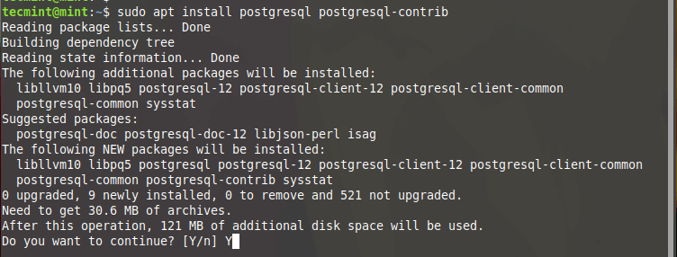

[источник](https://www.tecmint.com/install-postgresql-with-pgadmin4-on-linux-mint/)
**pgAdmin** is an open-source feature-rich, frontend management tool that allows you to easily administer and manage your **PostgreSQL** relational database from a web browser.

It provides an easy-to-use user interface that simplifies the creation and monitoring of databases and database objects. **PgAdmin 4** is an improvement of the earlier **pgAdmin** tool and is available for Linux, Windows, macOS systems, and even a Docker container.

In this tutorial, you will learn how to install **PostgreSQL** with **pgAdmin4** on **Linux Mint 21** and **Linux Mint 20**.

### Step 1: Install PostgreSQL Database on Linux Mint

**1.** To start off, launch your terminal and update your packages using the [apt package manager](https://www.tecmint.com/apt-advanced-package-command-examples-in-ubuntu/ "APT Command Examples") as shown.

$ sudo apt update -y

Once the update is complete, proceed to the next step.

Since **pgAdmin4** provides a frontend interface for the management of **PostgreSQL** database objects, it’s essential to have **PostgreSQL** installed first.

**2.** To do this, we are going to install the **postgresql** package and **postgresql-contrib** which offers extended features that extend the functionality of **PostgreSQL**.

$ sudo apt install postgresql postgresql-contrib

Install PostgreSQL on Linux Mint

**3.** Usually, **PostgreSQL** starts automatically on boot up. You can confirm this using the command given below:

$ sudo systemctl status postgresql

Check PostgreSQL Status

**4.** To log in to your **PostgreSQL** instance, first switch to the **postgres** user. The Postgres user comes included by default with the installation of **PostgreSQL**. Then run the **psql** command as shown.

`$ sudo -i -u postgres`
`$ psql`
`\q`

Connect to PostgreSQL Shell

**5.** Additionally, you can check if the database server is accepting incoming connections as shown.

$ sudo pg_isready

Check PostgreSQL Accepting Incoming Connections

### Step 2: Install pgAdmin4 on Linux Mint

**pgAdmin4** is available for **Ubuntu 16.04** and later versions and can easily be installed using the **APT** package manager. The same cannot support **Linux Mint** and **Pgadmi4** developers are yet to include support that allows users to easily install the frontend management tool using the APT package manager.

**6.** The only viable option is to install **pgAdmin4** from a virtual environment. So first, we will install the prerequisite packages as shown.

$ sudo apt install libgmp3-dev build-essential libssl-dev

Install Prerequisite Packages

**7.** Next, install the **Python** virtual environment and associated dependencies.

$ sudo apt install python3-virtualenv python3-dev libpq-dev

Install Python Virtual Environment

**8.** Next, create a directory where you will create a virtual environment.

$ mkdir pgadmin4 && cd pgadmin4

**9.** Then create the virtual environment as shown. Here, **pgadmin4env** is the name of the virtual environment.

$ virtualenv pgadmin4env

Create Virtual Environment for pgAdmim4

**10.** Once the virtual environment is in place, activate it as shown.

$ source pgadmin4env/bin/activate

**11.** Then use the [pip tool](https://www.tecmint.com/install-pip-in-linux/ "How To Install PIP to Manage Python Packages in Linux") to install **pg
admin4** as shown.

$ pip install https://ftp.postgresql.org/pub/pgadmin/pgadmin4/v7.5/pip/pgadmin4-7.5-py3-none-any.whl это не сработало - устаревший адрес, **установил последний пакет**
**`pip install pgadmin4`**

Install PgAdmin4 in Linux Mint

**12.** Next, create a configuration file **config_local.py**.

**-------- On Linux Mint 20 --------**
$ sudo nano pgadmin4env/lib/python3.8/site-packages/pgadmin4/config_local.py

**-------- On Linux Mint 21 --------**
$ sudo nano pgadmin4env/lib/python3.10/site-packages/pgadmin4/config_local.py

and add the lines below.

import os
DATA_DIR = os.path.realpath(os.path.expanduser(u'~/.pgadmin/'))
LOG_FILE = os.path.join(DATA_DIR, 'pgadmin4.log')
SQLITE_PATH = os.path.join(DATA_DIR, 'pgadmin4.db')
SESSION_DB_PATH = os.path.join(DATA_DIR, 'sessions')
STORAGE_DIR = os.path.join(DATA_DIR, 'storage')
SERVER_MODE = False
AZURE_CREDENTIAL_CACHE_DIR = os.path.join(DATA_DIR, 'azurecredentialcache')

Create PgAdmin4 Configuration

This piece of code does:  [source](https://serverspace.io/support/help/how-to-install-and-configure-pgadmin-4-in-server-mode-on-ubuntu-22-04/)
LOG_FILE: Path to the log file  
SQLITE_PATH: Path to user data in SQLite database , our user data will not be lost after upgrade.  
SESSION_DB_PATH: Path to a directory containing information about connected sessions.  
STORAGE_DIR: Path to a directory containing storage and certificate information.  
SERVER_MODE: The server mode selected is True.

**13.** To start the **pgAdmin4** management tool, invoke the command:

**-------- On Linux Mint 20 --------** 
$ python pgadmin4env/lib/python3.8/site-packages/pgadmin4/pgAdmin4.py

**-------- On Linux Mint 21 --------**
$ python pgadmin4env/lib/python3.10/site-packages/pgadmin4/pgAdmin4.py

Start PgAdmin4 Service

**14.** Finally, head over to your browser and browse the address shown.

http://127.0.0.1:5050

You will be prompted to set the master password, so proceed and set a strong password and click the ‘**Ok**’ button.

Set PgAdmin4 Password

**15.** To make things easier, you can create an alias in the **~/.bashrc** file as shown.

**-------- On Linux Mint 20 --------** 
$ echo "alias startPg='~/pgadmin4/pgadmin4env/bin/python pgadmin4env/lib/python3.8/site-packages/pgadmin4/pgAdmin4.py'" >> ~/.bashrc

**-------- On Linux Mint 21 --------** 
$ echo "alias startPg='~/pgadmin4/pgadmin4env/bin/python pgadmin4env/lib/python3.10/site-packages/pgadmin4/pgAdmin4.py'" >> ~/.bashrc

**16.** Next, update the bashrc file.

$ source ~/.bashrc

**17.** Finally, you can start the **pgAdmin4** management tool by simply invoking the **startPg** command.

$ startPg &

Start PgAdmin4 Tool

Once again head over to your browser and log in to the **PgAdmin4** interface. And this concludes the installation of **PostgreSQL** with **pgAdmin4** on **Linux Mint 21** and **Linux Mint 20**.
