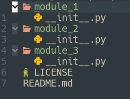
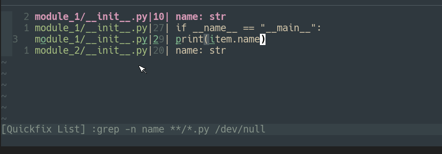
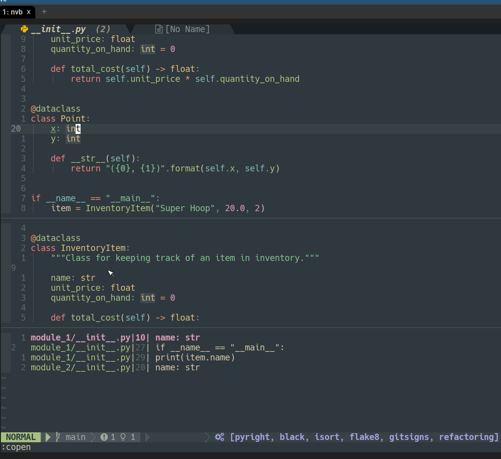

# Neovim for Beginners — Refactoring

## Code refactoring using Neovim.

Neovim for Beginners — Refactoring

Code refactoring is one key feature of using an IDE. Natively Vim as a text editor does not have any built-in support for code refactoring.

With Neovim we start to have the built-in LSP support that gives us basic code refactoring features like find-references, rename, code actions, etc., using semantic whole-project analysis. In this article, we are going to

- Use Neovim to search and replace a pattern in multiple buffers.
- Explore plugins to help in search and replace.
- Explore LSP code refactoring features.
- Explore plugins for code refactoring.

_This article is part of the [Neovim for Beginners series](https://alpha2phi.medium.com/learn-neovim-the-practical-way-8818fcf4830f#545a)._

The Neovim configuration files can be found in this [repository](https://github.com/alpha2phi/neovim-for-beginner/tree/25-refactoring).

# Search and Replace in Multiple Buffers

There are multiple ways to search and replace a pattern in multiple buffers. We can use the commands listed below to search and replace a pattern in multiple buffers.

- `:argdo` — Execute the command for each file in the argument list
- `:bufdo` — Execute the command in each buffer in the buffer list
- `:tabdo` — Execute the command in each tab page
- `:windo` — Execute the command in each window
- `:cdo` — Execute the command in each valid entry in the quickfix list
- `:cfdo` — Execute the command in each file in the quickfix list

We will use a [simple Python project](https://github.com/alpha2phi/sample-refactor-project/blob/main/README.md) for demonstration purposes. The project layout is shown below.

A Sample Project for Refactoring

## Scenario 1 — Use Argument List

Let’s start with the `:argdo` command.

**Add files to the Argument List**

- `:args **/*.py` — Add all the python files in the current folder and below to the arguments list. We can use `:argadd` to add additional files.
- Now use `:args` to list all the files in the argument list. Alternatively, we can use `:sall` or `:vert sall` to view the files in splits.

Add Files to Argument List

**Search and Replace using the Argument List**

- Use the `*` command to highlight the word we want to replace.
- Use `:argdo %s//<target string>/ge | update` to replace the selected word with the target string and save all the files. The `g` option indicates a global search and replace, and `e` option ignores any error if the pattern is not found.
- If we want confirmation before replacing, we can use the `c` option.

In the screenshot below, we perform a global search and replace the pattern `name`.

Search and Replace

## Scenario 2 — Use the Quickfix List

We can also use a quickfix list (`:h quickfix`) for search and replace.

**Add Files to the Quickfix List**

- If the files are already in the argument list, we can use the command `:vimgrep /<pattern>/ ##` or `:grep <pattern> ##` for searching. `##` (`:h :_##`) is replaced with all the files in the argument list.
- The quickfix list is populated with the search result, and we can use the `:copen` command to view the result.

Search in Argument List

- Alternatively, we can use `:vimgrep /<pattern>/ **/*.py` or `:grep <pattern> **/*.py` to search for files in the current folder and below, and view the quickfix list using the `:copen` command.

Vim Internal Grep

**Modify the Quickfix List**

There are 2 ways to further filter the populated quickfix list.

- Use the `cfilter` plugin (`:h cfilter-plugin`) to reduce the number of entries. We can load the plugin with the `packadd` command.

:packadd cfilter

Then we can use the following commands to filter a quickfix/location list:

:Cfilter[!] /{pattern}/
:Lfilter[!] /{pattern}/

The `:Cfilter` command creates a new quickfix list from the entries matching the pattern in the current quickfix list. `Pattern` is a Vim regular expression.

Quickfix Filter

- A simpler way is to set the quickfix list to be modifiable and we can delete any entry using the `dd` command.

:set modifiable

Modify the Quickfix List

**Search and Replace using Quickfix List**

We can use either the `:cdo` or `:cfdo` commands to search and replace using the quickfix list.

- If we use `cdo`, the action will be applied to every _entry_ in the quickfix window.
- If we use `cfdo`, then the action will be applied to each _file_ in the quickfix window.

**Use :cdo**

- Use `:cdo s/<pattern>/<target string>/ge` to replace a pattern to _each entry in the quickfix list._

Search and Replace using Quickfix List

**Use :cfdo**

- Use `:cfdo %s/<pattern>/<target string>/ge` to replace a pattern to _each file in the quickfix list._
- We need to use `%` to apply the action to the entire buffer.
- If we delete any entry from the quickfix list but the file name is still in the quickfix list, the action will still be applied.

Search and Replace using Quickfix List

_Notes: Do explore other commands like `:tabdo`, `:windo`, `:bufdo`._
