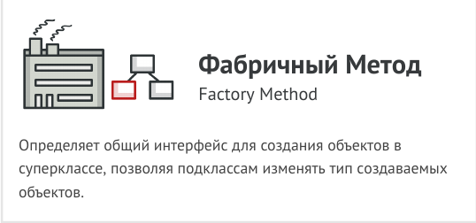

1. Порождающие паттерны
- Фабричный Метод (Factory Method).
- Второй подпункт.
- Третий подпункт.

2. Структурные паттерны

- Первый подпункт.
- Второй подпункт.
- Третий подпункт.

3. Поведенческие паттерны
- Первый подпункт.
- Второй подпункт.
- Третий подпункт.

# Фабричный Метод (Factory Method).

