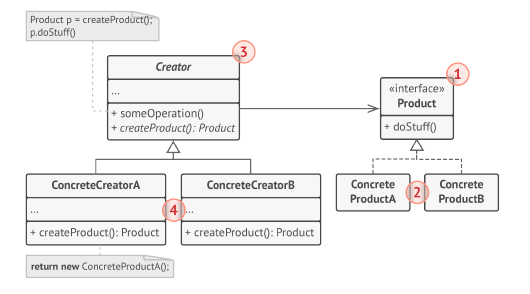

# Фабричный Метод (Factory Method)


Фабричный метод — это порождающий паттерн
проектирования, который определяет общий интерфейс для
создания объектов в суперклассе, позволяя подклассам
изменять тип создаваемых объектов.

Паттерн Фабричный метод предлагает создавать объекты
не напрямую, используя оператор new , а через вызов
особого фабричного метода.

## Структура



1. Продукт определяет общий интерфейс объектов, которые
может произвести создатель и его подклассы.
2. Конкретные продукты содержат код различных продуктов.
Продукты будут отличаться реализацией, но интерфейс у
них будет общий.
3. Создатель объявляет фабричный метод, который должен
возвращать новые объекты продуктов. Важно, чтобы тип
результата совпадал с общим интерфейсом продуктов.
Зачастую фабричный метод объявляют абстрактным, чтобы
заставить все подклассы реализовать его по-своему. Но он
может возвращать и некий стандартный продукт.
Несмотря на название, важно понимать, что создание
продуктов не является единственной функцией создателя.
Обычно он содержит и другой полезный код работы с
продуктом. Аналогия: большая софтверная компания может
иметь центр подготовки программистов, но основная
задача компании — создавать программные продукты, а не
готовить программистов.
4. Конкретные создатели по-своему реализуют фабричный
метод, производя те или иные конкретные продукты.
Фабричный метод не обязан всё время создавать новые
объекты. Его можно переписать так, чтобы возвращать
существующие объекты из какого-то хранилища или кэша.

## Применимость

- Когда заранее неизвестны типы и зависимости объектов, с
которыми должен работать ваш код.

- Фабричный метод отделяет код производства продуктов от
остального кода, который эти продукты использует.
Благодаря этому, код производства можно расширять, не трогая основной. Так, чтобы добавить поддержку нового продукта, вам нужно создать новый подкласс и определить
в нём фабричный метод, возвращая оттуда экземпляр нового продукта.

- Когда вы хотите дать возможность пользователям
расширять части вашего фреймворка или библиотеки.

- Пользователи могут расширять классы вашего фреймворка
через наследование. Но как сделать так, чтобы фреймворк
создавал объекты из этих новых классов, а не из
стандартных?
Решением будет дать пользователям возможность
расширять не только желаемые компоненты, но и классы,
которые создают эти компоненты. А для этого создающие
классы должны иметь конкретные создающие методы,
которые можно определить.
Например, вы используете готовый UI-фреймворк для
своего приложения. Но вот беда — требуется иметь круглые
кнопки, вместо стандартных прямоугольных. Вы создаёте
класс RoundButton . Но как сказать главному классу
фреймворка UIFramework , чтобы он теперь создавал
круглые кнопки, вместо стандартных?
Для этого вы создаёте подкласс UIWithRoundButtons из
базового класса фреймворка, переопределяете в нём метод
создания кнопки (а-ля createButton ) и вписываете туда создание своего класса кнопок. Затем используете
UIWithRoundButtons вместо стандартного UIFramework.

- Когда вы хотите экономить системные ресурсы, повторно
используя уже созданные объекты, вместо порождения
новых.

- Такая проблема обычно возникает при работе с тяжёлыми
ресурсоёмкими объектами, такими, как подключение к базе
данных, файловой системе и т. д.

## Преимущества и недостатки

- Избавляет класс от привязки к конкретным классам
продуктов.

- Выделяет код производства продуктов в одно место,
упрощая поддержку кода.

- Упрощает добавление новых продуктов в программу.

- Реализует принцип открытости/закрытости.

- __Может привести к созданию больших параллельных
иерархий классов, так как для каждого класса продукта
надо создать свой подкласс создателя.__

## Отношения с другими паттернами

- Многие архитектуры начинаются с применения Фабричного
метода (более простого и расширяемого через подклассы)
и эволюционируют в сторону Абстрактной фабрики,
Прототипа или Строителя (более гибких, но и более
сложных).

- Классы Абстрактной фабрики чаще всего реализуются с
помощью Фабричного метода, хотя они могут быть
построены и на основе Прототипа.

- Фабричный метод можно использовать вместе с
Итератором, чтобы подклассы коллекций могли создавать
подходящие им итераторы.

- Прототип не опирается на наследование, но ему нужна
сложная операция инициализации. Фабричный метод,
наоборот, построен на наследовании, но не требует
сложной инициализации.

- Фабричный метод можно рассматривать как частный
случай Шаблонного метода. Кроме того, Фабричный метод
нередко бывает частью большого класса с Шаблонными
методами.

## Пример
<!-- <link rel="stylesheet" href="./highlight/styles/atelier-forest-dark.css">
<script src="./highlight/highlight.pack.js"></script>
<script>hljs.initHighlightingOnLoad();</script>
<pre id="mycode" class="python">
<code> -->

```python
"""
EN: Factory Method Design Pattern

Intent: Provides an interface for creating objects in a superclass, but allows
subclasses to alter the type of objects that will be created.

RU: Паттерн Фабричный Метод

Назначение: Определяет общий интерфейс для создания объектов в суперклассе,
позволяя подклассам изменять тип создаваемых объектов.
"""


from __future__ import annotations
from abc import ABC, abstractmethod


class Creator(ABC):
    """
    EN: The Creator class declares the factory method that is supposed to return
    an object of a Product class. The Creator's subclasses usually provide the
    implementation of this method.

    RU: Класс Создатель объявляет фабричный метод, который должен возвращать
    объект класса Продукт. Подклассы Создателя обычно предоставляют реализацию
    этого метода.
    """

    @abstractmethod
    def factory_method(self):
        """
        EN: Note that the Creator may also provide some default implementation
        of the factory method.

        RU: Обратите внимание, что Создатель может также обеспечить реализацию
        фабричного метода по умолчанию.
        """
        pass

    def some_operation(self) -> str:
        """
        EN: Also note that, despite its name, the Creator's primary
        responsibility is not creating products. Usually, it contains some core
        business logic that relies on Product objects, returned by the factory
        method. Subclasses can indirectly change that business logic by
        overriding the factory method and returning a different type of product
        from it.

        RU: Также заметьте, что, несмотря на название, основная обязанность
        Создателя не заключается в создании продуктов. Обычно он содержит
        некоторую базовую бизнес-логику, которая основана на объектах Продуктов,
        возвращаемых фабричным методом. Подклассы могут косвенно изменять эту
        бизнес-логику, переопределяя фабричный метод и возвращая из него другой
        тип продукта.
        """

        # EN: Call the factory method to create a Product object.
        #
        # RU: Вызываем фабричный метод, чтобы получить объект-продукт.
        product = self.factory_method()

        # EN: Now, use the product.
        #
        # RU: Далее, работаем с этим продуктом.
        result = f"Creator: The same creator's code has just worked with {product.operation()}"

        return result


"""
EN: Concrete Creators override the factory method in order to change the
resulting product's type.

RU: Конкретные Создатели переопределяют фабричный метод для того, чтобы изменить
тип результирующего продукта.
"""


class ConcreteCreator1(Creator):
    """
    EN: Note that the signature of the method still uses the abstract product
    type, even though the concrete product is actually returned from the method.
    This way the Creator can stay independent of concrete product classes.

    RU: Обратите внимание, что сигнатура метода по-прежнему использует тип
    абстрактного продукта, хотя фактически из метода возвращается конкретный
    продукт. Таким образом, Создатель может оставаться независимым от конкретных
    классов продуктов.
    """

    def factory_method(self) -> ConcreteProduct1:
        return ConcreteProduct1()


class ConcreteCreator2(Creator):
    def factory_method(self) -> ConcreteProduct2:
        return ConcreteProduct2()


class Product(ABC):
    """
    EN: The Product interface declares the operations that all concrete products
    must implement.

    RU: Интерфейс Продукта объявляет операции, которые должны выполнять все
    конкретные продукты.
    """

    @abstractmethod
    def operation(self) -> str:
        pass


"""
EN: Concrete Products provide various implementations of the Product interface.

RU: Конкретные Продукты предоставляют различные реализации интерфейса Продукта.
"""


class ConcreteProduct1(Product):
    def operation(self) -> str:
        return "{Result of the ConcreteProduct1}"


class ConcreteProduct2(Product):
    def operation(self) -> str:
        return "{Result of the ConcreteProduct2}"


def client_code(creator: Creator) -> None:
    """
    EN: The client code works with an instance of a concrete creator, albeit
    through its base interface. As long as the client keeps working with the
    creator via the base interface, you can pass it any creator's subclass.

    RU: Клиентский код работает с экземпляром конкретного создателя, хотя и
    через его базовый интерфейс. Пока клиент продолжает работать с создателем
    через базовый интерфейс, вы можете передать ему любой подкласс создателя.
    """

    print(f"Client: I'm not aware of the creator's class, but it still works.\n"
          f"{creator.some_operation()}", end="")


if __name__ == "__main__":
    print("App: Launched with the ConcreteCreator1.")
    client_code(ConcreteCreator1())
    print("\n")

    print("App: Launched with the ConcreteCreator2.")
    client_code(ConcreteCreator2())
```
<!-- </code>
</pre> -->